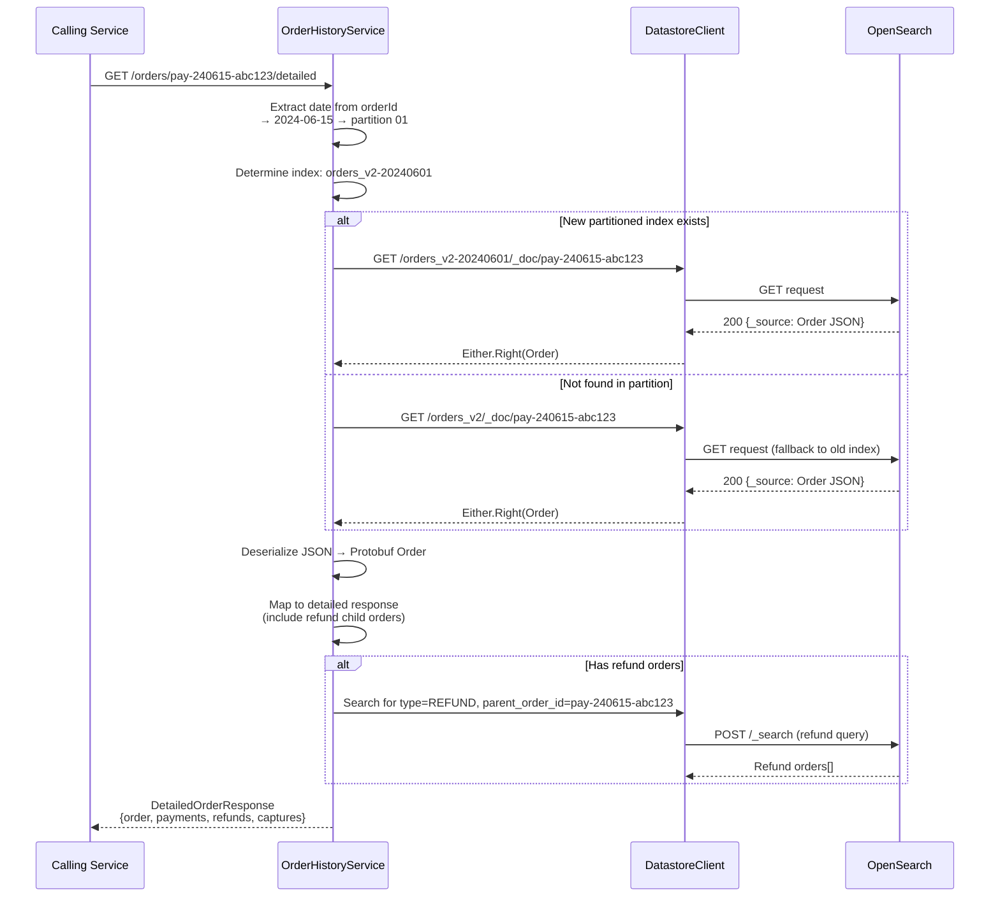
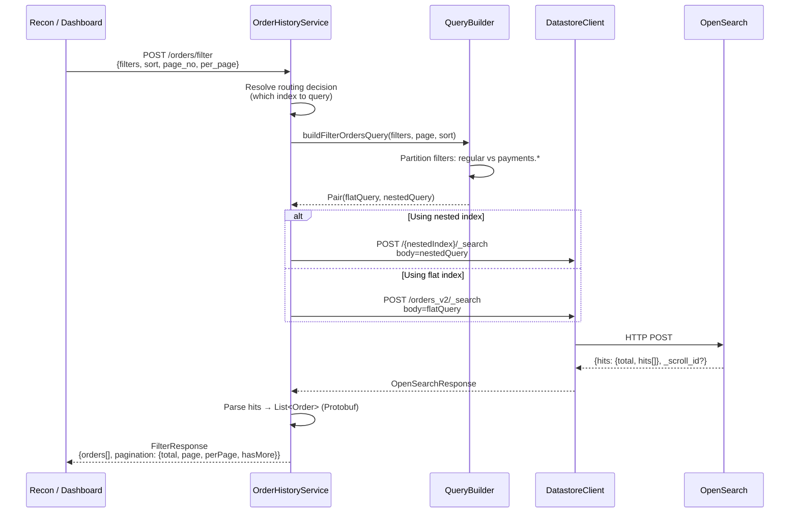
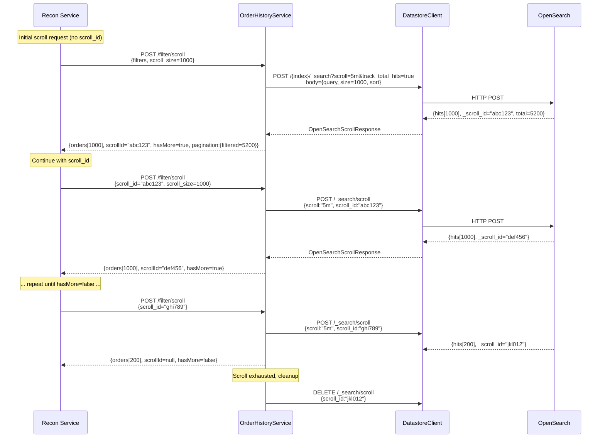
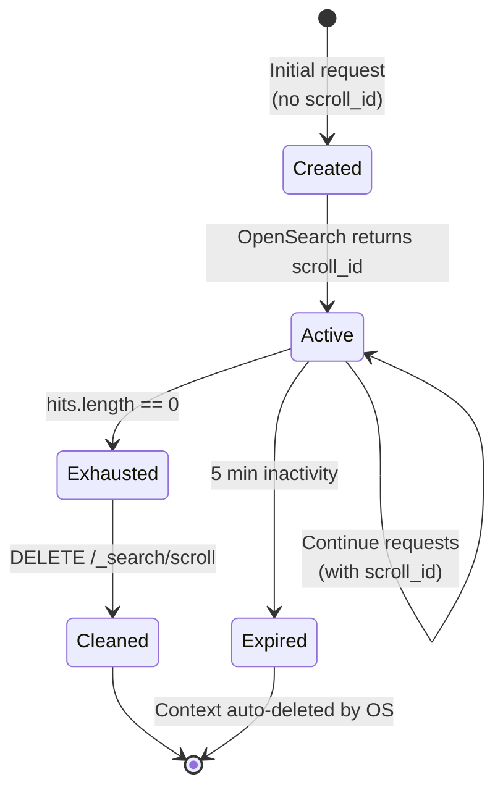
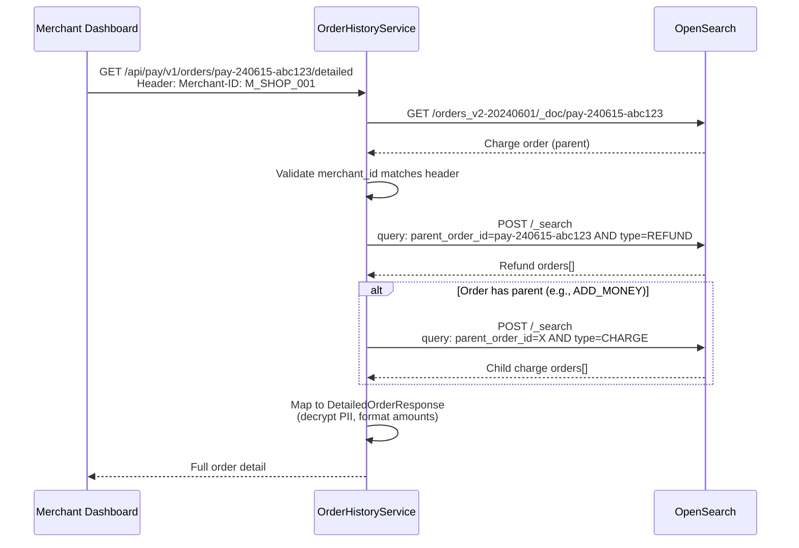
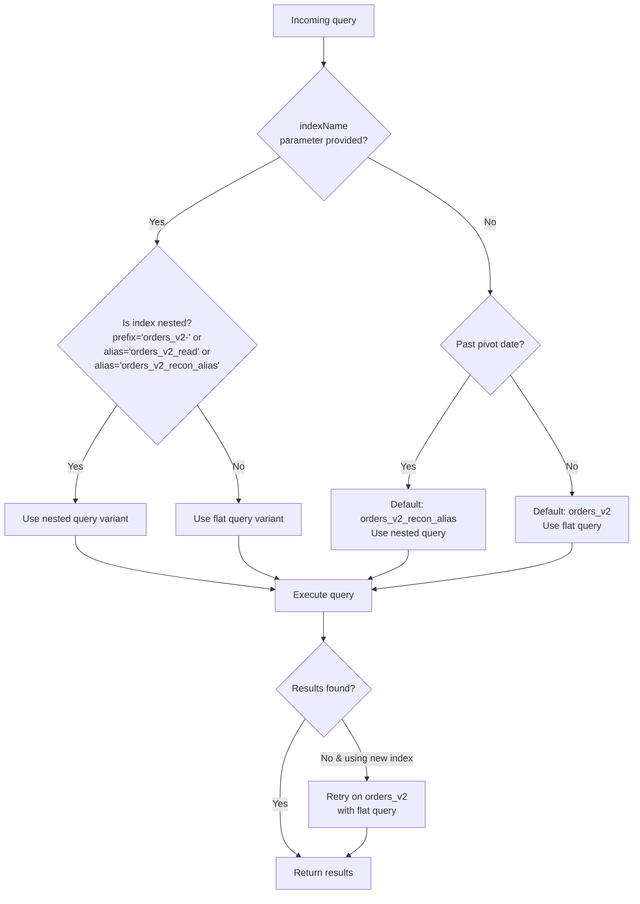

# 05 — Query Patterns & API Workflows

## Overview

The Order History Service exposes a rich query API serving diverse read patterns — from single-order lookups to bulk reconciliation scrolls to financial aggregations. This document details every query pattern, the OpenSearch DSL generated, and the service-level routing logic.

## API Endpoint Catalog

### Merchant-Facing

| Endpoint | Method | Use Case |
|----------|--------|----------|
| `/api/pay/v1/orders/{orderId}/detailed` | GET | Merchant dashboard: full order with payments, refunds, captures |

### Internal

| Endpoint | Method | Use Case |
|----------|--------|----------|
| `/api/internal/v1/orders/{id}/detailed` | GET | Service-to-service order lookup |
| `/api/internal/v1/orders/save` | PUT | Firehose event ingestion |
| `/api/internal/v1/orders/filter/{indexName?}` | POST | Paginated multi-field search |
| `/api/internal/v1/orders/filter/scroll/{indexName?}` | POST | Deep pagination (recon, export) |
| `/api/internal/v1/orders/aggregate/{indexName?}` | POST | Sum amounts, count orders |
| `/api/internal/v1/orders/raw-search` | POST | Pass-through OpenSearch DSL |
| `/api/internal/v1/orders/acquirer-score` | PATCH | Gateway score update |
| `/api/internal/v1/orders/create-index/{dateStamp}` | POST | Create new partition |
| `/api/internal/v1/orders/update-aliases` | POST | Rotate rolling aliases |
| `/api/internal/v1/orders/delete-by-query/{indexName}` | POST | Cleanup old data |
| `/api/internal/v1/orders/task-status/{taskId}` | GET | Async operation status |

---

## Query Pattern 1: Get Order by ID

### Request

```
GET /api/internal/v1/orders/{orderId}/detailed
Header: Merchant-ID: M_SHOP_001
```

### Workflow



### Response Structure

```json
{
  "order_id": "pay-240615-abc123",
  "merchant_id": "M_SHOP_001",
  "status": "PROCESSED",
  "amount": { "value": 150000, "currency": "INR" },
  "charges": [
    {
      "payment_id": "pay-240615-abc123-p2",
      "status": "CAPTURED",
      "payment_method": "CARD",
      "card_network": "VISA",
      "amount": 150000,
      "rrn": "423456789012"
    }
  ],
  "refunds": [
    {
      "refund_order_id": "ref-240620-xyz789",
      "status": "PROCESSED",
      "amount": 50000
    }
  ]
}
```

---

## Query Pattern 2: Paginated Filter (Standard Search)

### Request

```
POST /api/internal/v1/orders/filter
{
  "filters": [
    { "field": "merchant_id", "value": ["M_SHOP_001"], "operator": "terms" },
    { "field": "status", "value": ["PROCESSED", "FAILED"], "operator": "terms" },
    { "field": "created_at", "value": {"gte": "2024-06-01", "lte": "2024-06-30"}, "operator": "range" }
  ],
  "sort": [{ "field": "created_at", "order": "desc" }],
  "page_no": 1,
  "per_page": 50
}
```

### Generated OpenSearch DSL (Nested Index)

```json
{
  "query": {
    "bool": {
      "filter": [
        { "terms": { "merchant_id": ["M_SHOP_001"] } },
        { "terms": { "status": ["PROCESSED", "FAILED"] } },
        { "range": { "created_at": { "gte": "2024-06-01", "lte": "2024-06-30" } } }
      ]
    }
  },
  "sort": [{ "created_at": { "order": "desc" } }],
  "from": 0,
  "size": 50
}
```

### When Payment Fields Are Included (Nested Query)

```
POST /api/internal/v1/orders/filter
{
  "filters": [
    { "field": "merchant_id", "value": ["M_SHOP_001"], "operator": "terms" },
    { "field": "payments.status", "value": ["CAPTURED"], "operator": "terms" },
    { "field": "payments.payment_option.payment_method", "value": ["UPI"], "operator": "terms" }
  ]
}
```

**Generated DSL (Nested):**

```json
{
  "query": {
    "bool": {
      "filter": [
        { "terms": { "merchant_id": ["M_SHOP_001"] } },
        {
          "nested": {
            "path": "payments",
            "query": {
              "bool": {
                "filter": [
                  { "terms": { "payments.status": ["CAPTURED"] } },
                  { "terms": { "payments.payment_option.payment_method": ["UPI"] } }
                ]
              }
            }
          }
        }
      ]
    }
  }
}
```

### Query Building Logic

```mermaid
flowchart TD
    FILTERS[Input filters] --> SPLIT{Any filter field<br/>starts with 'payments.'?}

    SPLIT -->|No| FLAT_ONLY[All filters in top-level<br/>bool.filter array]
    SPLIT -->|Yes| PARTITION[Split into:<br/>- Regular filters (order-level)<br/>- Payment filters (payments.*)]

    PARTITION --> COMBINE["Combine:<br/>bool.filter: [<br/>  ...regular_filters,<br/>  nested: {<br/>    path: 'payments',<br/>    query: { bool: { filter: payment_filters } }<br/>  }<br/>]"]

    FLAT_ONLY --> RESULT[Complete OpenSearch DSL]
    COMBINE --> RESULT
```

### Workflow



---

## Query Pattern 3: Scroll-Based Deep Pagination

### Why Scroll?

Standard `from/size` pagination becomes expensive beyond ~10,000 results (OpenSearch must score and sort ALL preceding results). The Scroll API maintains a point-in-time snapshot for efficient deep iteration.

### Request (Initial)

```
POST /api/internal/v1/orders/filter/scroll
{
  "filters": [
    { "field": "status", "value": ["PENDING"], "operator": "terms" },
    { "field": "payments.status", "value": ["AUTHENTICATED"], "operator": "terms" },
    { "field": "payments.updated_at", "value": {"gte": "2024-06-01T00:00:00Z", "lte": "2024-06-01T00:55:00Z"}, "operator": "range" }
  ],
  "sort": [{ "field": "payments.created_at", "order": "desc" }],
  "scroll_size": 1000
}
```

### Request (Continue)

```
POST /api/internal/v1/orders/filter/scroll
{
  "scroll_id": "DXF1ZXJ5QW5kRmV0Y2gBAAAAAA...",
  "scroll_size": 1000
}
```

### Workflow



### Scroll Configuration

| Parameter | Value | Purpose |
|-----------|-------|---------|
| `scroll` (keep-alive) | 5m | How long the scroll context persists between requests |
| `scroll_size` | 1000 (default) | Documents per batch |
| `track_total_hits` | true | Return accurate total count on first request |

### Scroll Lifecycle



---

## Query Pattern 4: Aggregation

### Request

```
POST /api/internal/v1/orders/aggregate
{
  "filters": [
    { "field": "merchant_id", "value": ["M_SHOP_001"], "operator": "terms" },
    { "field": "created_at", "value": {"gte": "2024-06-01", "lte": "2024-06-30"}, "operator": "range" }
  ]
}
```

### Generated DSL (New Nested Index)

```json
{
  "query": {
    "bool": {
      "filter": [
        { "terms": { "merchant_id": ["M_SHOP_001"] } },
        { "range": { "created_at": { "gte": "2024-06-01", "lte": "2024-06-30" } } }
      ]
    }
  },
  "size": 0,
  "aggs": {
    "captured_amount": {
      "nested": { "path": "payments" },
      "aggs": {
        "captured_payments": {
          "filter": {
            "term": { "payments.status": "CAPTURED" }
          },
          "aggs": {
            "total": {
              "sum": { "field": "payments.amount.value" }
            }
          }
        }
      }
    },
    "refunded_amount": {
      "nested": { "path": "payments" },
      "aggs": {
        "refunded_payments": {
          "filter": {
            "term": { "payments.status": "REFUNDED" }
          },
          "aggs": {
            "total": {
              "sum": { "field": "payments.amount.value" }
            }
          }
        }
      }
    }
  }
}
```

### Generated DSL (Old Flat Index — Painless Script)

```json
{
  "query": { "bool": { "filter": [...] } },
  "size": 0,
  "aggs": {
    "captured_amount": {
      "scripted_metric": {
        "init_script": "state.total = 0",
        "map_script": "for (p in params._source.payments) { if (p.status == 'CAPTURED') { state.total += p.amount.value } }",
        "combine_script": "return state.total",
        "reduce_script": "long total = 0; for (s in states) { total += s } return total"
      }
    }
  }
}
```

### Performance: Nested vs Script

| Approach | Latency (10K orders) | Latency (1M orders) |
|----------|---------------------|---------------------|
| Painless scripted_metric (old) | ~200ms | ~5,000ms |
| Native nested aggregation (new) | ~6ms | ~150ms |

**~33x faster** with native nested aggregations.

### Response

```json
{
  "number_of_orders": 1234,
  "captured_amount": 15000000,
  "refunded_amount": 500000
}
```

---

## Query Pattern 5: Get Detailed Order with Refunds

### Workflow (Merchant Dashboard)



### Refund Query

```json
{
  "query": {
    "bool": {
      "filter": [
        { "term": { "additional_details.order_info.parent_order_id": "pay-240615-abc123" } },
        { "term": { "merchant_id": "M_SHOP_001" } },
        { "term": { "type": "REFUND" } }
      ]
    }
  },
  "sort": [{ "created_at": { "order": "desc" } }],
  "size": 100
}
```

---

## Query Pattern 6: Raw Search (Pass-Through)

### Request

```
POST /api/internal/v1/orders/raw-search
{
  "index_name": "orders_v2-20240601",
  "query_body": {
    "query": { "match_all": {} },
    "size": 5,
    "sort": [{ "created_at": "desc" }]
  }
}
```

This endpoint passes the query body directly to OpenSearch without any transformation. Used for:
- Debugging/investigation
- Custom queries not supported by the filter API
- Ad-hoc operational queries

---

## Index Routing Decision Tree



## Response Format

### FilterResponse

```kotlin
data class FilterResponse(
    val orders: List<Order>,           // Protobuf Order objects (JSON-serialized)
    val pagination: Pagination
)

data class Pagination(
    val total: Long,                   // Total matching documents
    val filtered: Long,                // Same as total (for compatibility)
    val page_no: Int,
    val per_page: Int,
    val has_more: Boolean
)
```

### ScrollResponse

```kotlin
data class ScrollResponse(
    val orders: List<Order>,
    val scroll_id: String?,            // null when exhausted
    val has_more: Boolean,
    val pagination: Pagination
)
```

## Operator Reference

| Operator | OpenSearch Mapping | Example |
|----------|-------------------|---------|
| `terms` | `{"terms": {"field": [values]}}` | `{"field": "status", "value": ["PROCESSED","FAILED"], "operator": "terms"}` |
| `range` | `{"range": {"field": {gte/lte/gt/lt}}}` | `{"field": "created_at", "value": {"gte": "2024-01-01"}, "operator": "range"}` |

## Sort Reference

| Sort Field | Index Type | Notes |
|------------|-----------|-------|
| `created_at` | Both | Order creation time |
| `updated_at` | Both | Last modification |
| `payments.created_at` | Nested (requires inner_sort) | Payment initiation time |
| `payments.updated_at` | Nested | Payment last update |
| `amount.value` | Both | Order amount |
