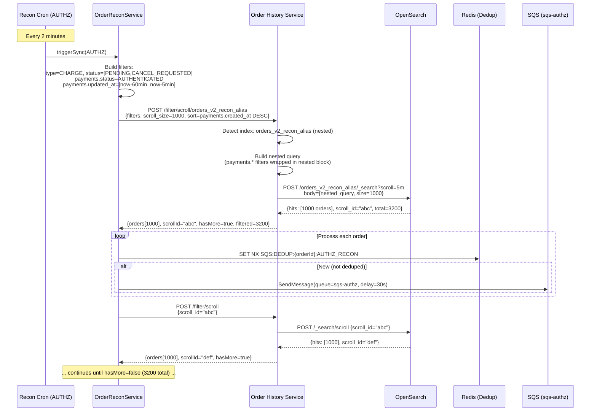
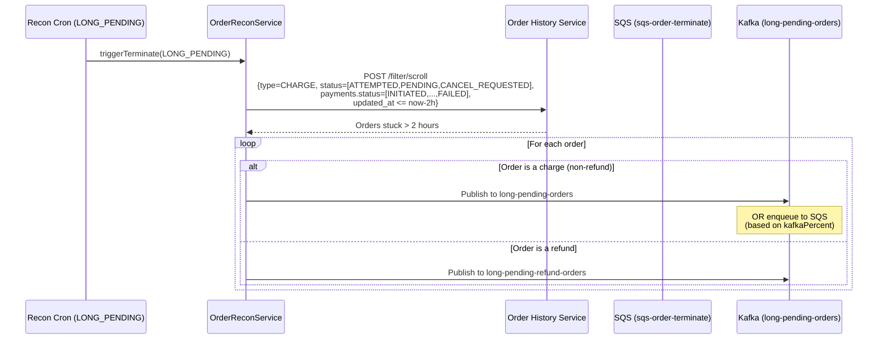
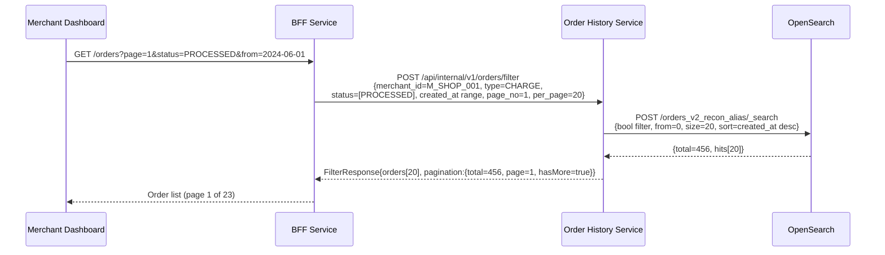
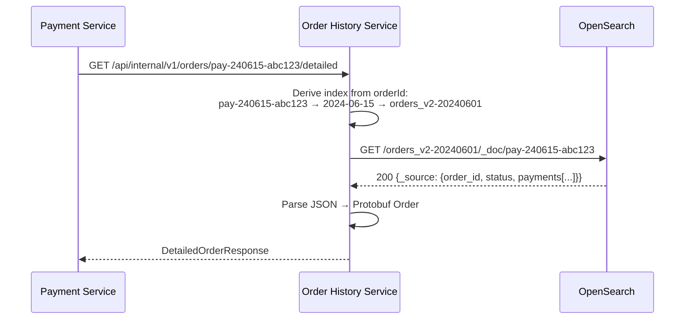
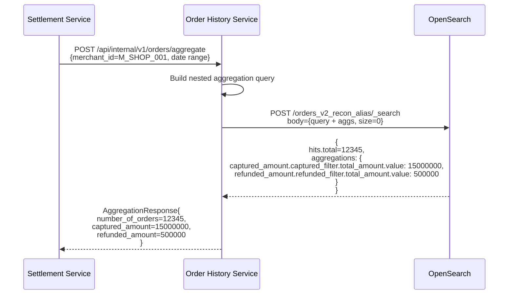
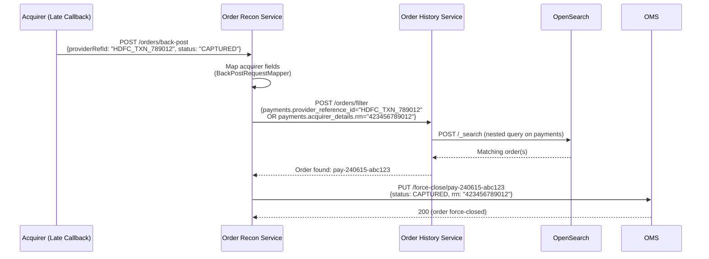
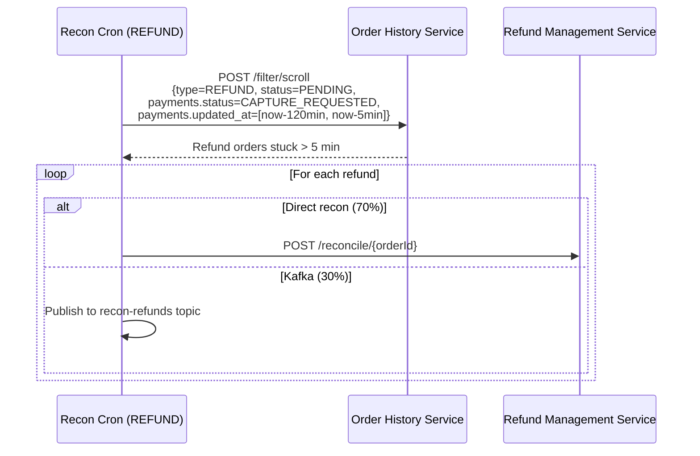
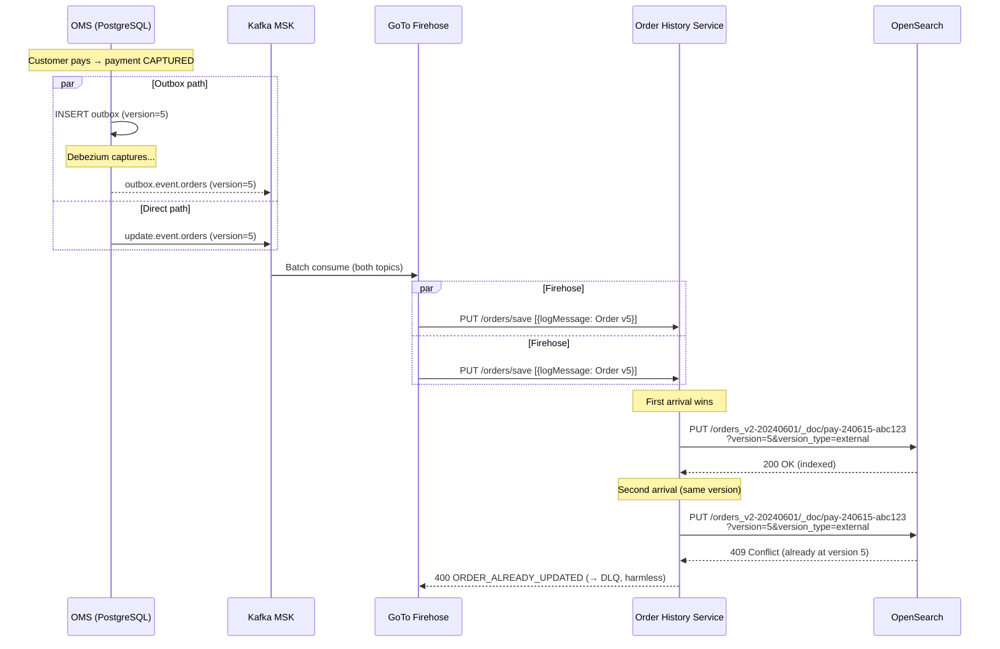
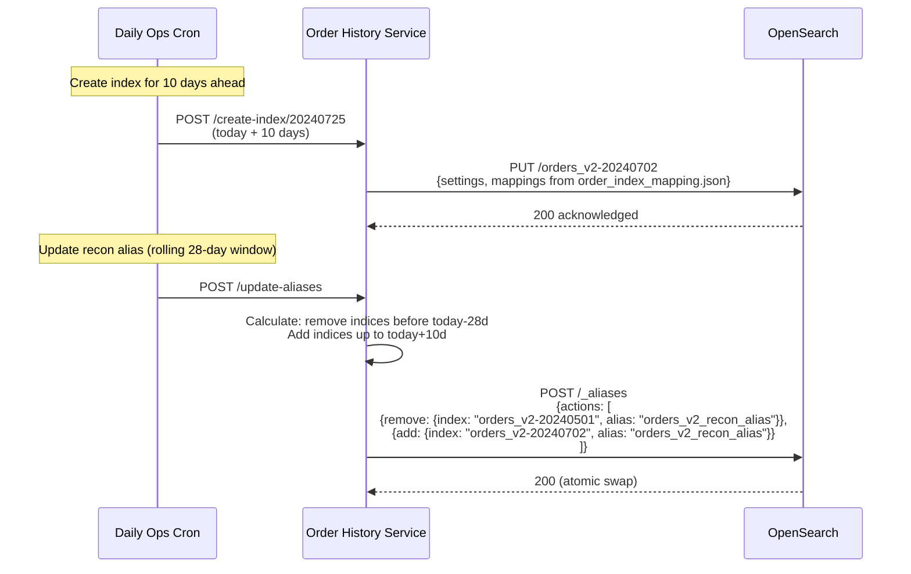

# 06 — Key Query Flows & Diagrams

## Overview

This document provides detailed workflow diagrams for the most critical query flows in the platform — showing how different services use OHS and what queries they generate. These are the **hot paths** that handle the majority of OHS traffic.

---

## Flow 1: Recon Service — Discover Pending Orders (AUTHZ Scenario)

The reconciliation service's most frequent query: find orders stuck in AUTHENTICATED state.

### Query Generated

```json
{
  "query": {
    "bool": {
      "filter": [
        { "terms": { "type": ["CHARGE"] } },
        { "terms": { "status": ["PENDING", "CANCEL_REQUESTED"] } },
        {
          "nested": {
            "path": "payments",
            "query": {
              "bool": {
                "filter": [
                  { "terms": { "payments.status": ["AUTHENTICATED"] } },
                  { "range": { "payments.updated_at": {
                      "gte": "2024-06-15T10:25:00Z",
                      "lte": "2024-06-15T11:20:00Z"
                  }}}
                ]
              }
            }
          }
        }
      ]
    }
  },
  "sort": [{ "payments.created_at": { "order": "desc" } }],
  "size": 1000
}
```

### End-to-End Workflow



### Query Characteristics

| Metric | Value |
|--------|-------|
| Result set size | 1,000–20,000 orders per run |
| Execution frequency | Every 2 minutes |
| Target index | `orders_v2_recon_alias` (28-day window) |
| Latency (initial scroll) | ~50-200ms |
| Latency (continue scroll) | ~20-50ms |

---

## Flow 2: Recon Service — Long-Pending Termination

Find orders that have been stuck for hours and need force-termination.

### Query Generated

```json
{
  "query": {
    "bool": {
      "filter": [
        { "terms": { "type": ["CHARGE"] } },
        { "terms": { "status": ["ATTEMPTED", "PENDING", "CANCEL_REQUESTED"] } },
        {
          "nested": {
            "path": "payments",
            "query": {
              "bool": {
                "filter": [
                  { "terms": { "payments.status": [
                      "INITIATED", "AUTHENTICATED", "AUTHENTICATION_CHALLENGED",
                      "CANCEL_REQUESTED", "CANCELLED", "FAILED"
                  ]}},
                  { "range": { "payments.updated_at": {
                      "lte": "2024-06-15T08:30:00Z"
                  }}}
                ]
              }
            }
          }
        }
      ]
    }
  },
  "sort": [{ "updated_at": { "order": "desc" } }],
  "size": 1000
}
```

### Workflow



---

## Flow 3: Merchant Dashboard — Order History List

Merchant viewing their recent orders with filters.

### Query Generated

```json
{
  "query": {
    "bool": {
      "filter": [
        { "terms": { "merchant_id": ["M_SHOP_001"] } },
        { "terms": { "type": ["CHARGE"] } },
        { "range": { "created_at": { "gte": "2024-06-01", "lte": "2024-06-30" } } }
      ]
    }
  },
  "sort": [{ "created_at": { "order": "desc" } }],
  "from": 0,
  "size": 20
}
```

### Workflow



---

## Flow 4: Get Order Status (Payment Service → OHS)

When a payment service needs to check the current state of an order.

### Workflow



### Direct Document Lookup Performance

| Metric | Value |
|--------|-------|
| Latency (p50) | ~2ms |
| Latency (p99) | ~10ms |
| Index routing | Direct to partition (no alias search) |

---

## Flow 5: Settlement Aggregation

Settlement service needs total captured/refunded amounts for a merchant in a period.

### Query Generated

```json
{
  "query": {
    "bool": {
      "filter": [
        { "terms": { "merchant_id": ["M_SHOP_001"] } },
        { "range": { "created_at": { "gte": "2024-06-01", "lte": "2024-06-30" } } }
      ]
    }
  },
  "size": 0,
  "aggs": {
    "captured_amount": {
      "nested": { "path": "payments" },
      "aggs": {
        "captured_filter": {
          "filter": { "term": { "payments.status": "CAPTURED" } },
          "aggs": {
            "total_amount": { "sum": { "field": "payments.amount.value" } }
          }
        }
      }
    },
    "refunded_amount": {
      "nested": { "path": "payments" },
      "aggs": {
        "refunded_filter": {
          "filter": { "term": { "payments.status": "REFUNDED" } },
          "aggs": {
            "total_amount": { "sum": { "field": "payments.amount.value" } }
          }
        }
      }
    }
  }
}
```

### Workflow



---

## Flow 6: Back-Post Order Lookup (Recon → OHS)

When an acquirer sends a late callback, recon searches OHS by provider reference ID.

### Query Generated

```json
{
  "query": {
    "bool": {
      "filter": [
        {
          "nested": {
            "path": "payments",
            "query": {
              "bool": {
                "should": [
                  { "term": { "payments.provider_reference_id": "HDFC_TXN_789012" } },
                  { "term": { "payments.acquirer_details.rrn": "423456789012" } }
                ],
                "minimum_should_match": 1
              }
            }
          }
        }
      ]
    }
  },
  "sort": [{ "payments.created_at": { "order": "desc" } }],
  "size": 25
}
```

### Workflow



---

## Flow 7: Recon — Refund Discovery

Find refund orders waiting for acquirer confirmation.

### Query Generated

```json
{
  "query": {
    "bool": {
      "filter": [
        { "terms": { "type": ["REFUND"] } },
        { "terms": { "status": ["PENDING"] } },
        {
          "nested": {
            "path": "payments",
            "query": {
              "bool": {
                "filter": [
                  { "terms": { "payments.status": ["CAPTURE_REQUESTED"] } },
                  { "range": { "payments.updated_at": {
                      "gte": "2024-06-15T09:30:00Z",
                      "lte": "2024-06-15T11:25:00Z"
                  }}}
                ]
              }
            }
          }
        }
      ]
    }
  },
  "sort": [{ "payments.created_at": { "order": "desc" } }],
  "size": 1000
}
```

### Workflow



---

## Flow 8: Firehose Ingestion (Real-Time Indexing)

The most critical write flow — every order state change must be indexed.



---

## Flow 9: Index Lifecycle Management

Daily operations for partition management.



---

## Query Performance Summary

| Query Pattern | Latency (p50) | Latency (p99) | Frequency |
|---------------|---------------|---------------|-----------|
| Get by ID (direct) | 2ms | 10ms | ~50,000/min |
| Filter (paginated, page 1) | 10ms | 100ms | ~10,000/min |
| Filter (deep page >100) | 50ms | 500ms | ~100/min |
| Scroll (initial) | 50ms | 200ms | ~500/min |
| Scroll (continue) | 20ms | 50ms | ~5,000/min |
| Aggregation (nested) | 20ms | 200ms | ~100/min |
| Back-post search | 30ms | 150ms | ~50/min |
| Upsert (write) | 5ms | 50ms | ~10,000/min |

## Common Query Anti-Patterns

| Anti-Pattern | Problem | Solution |
|--------------|---------|----------|
| Deep pagination (page 500+) | O(n) cost grows linearly | Use scroll API instead |
| Querying all indices | Shard fan-out overhead | Use alias or explicit index |
| Scripted aggregations | 33x slower than native | Use nested type + native aggs |
| Large result size (>1000) | Memory pressure | Use scroll with batches |
| Frequent get-by-id without partition hint | Searches all indices | Extract date from orderId → direct index |
| Range on `created_at` without merchant_id | Scans entire time window | Always include merchant_id for selectivity |
