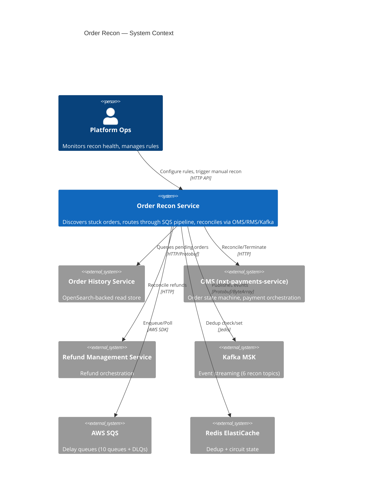
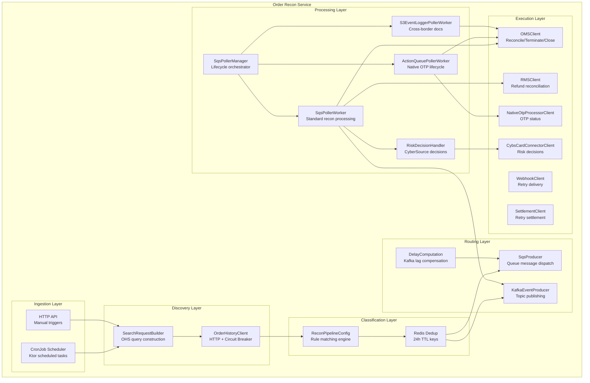
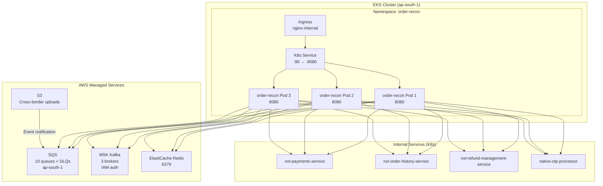
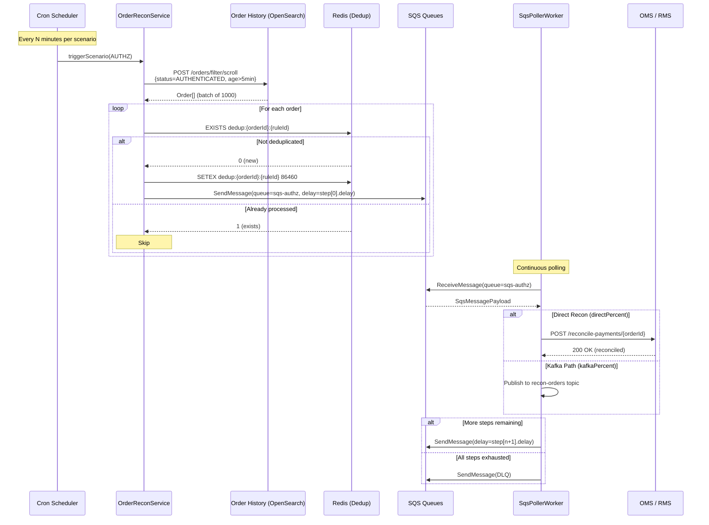

# 01 — Architecture Overview

## System Context

The Order Reconciliation Service sits between **Order History Service** (the read-optimized OpenSearch store) and the **transactional services** (OMS, RMS). Its primary role is to detect orders/payments in intermediate states and drive them to terminal states through configurable retry pipelines.

## Component Architecture

## Layered Architecture

| Layer | Responsibility | Key Classes |
|-------|---------------|-------------|
| **Ingestion** | Trigger recon runs via cron or API | `OrderReconService`, `OrderReconRoutes` |
| **Discovery** | Build & execute OHS queries | `SearchRequestBuilder`, `OrderHistoryClient` |
| **Classification** | Match orders to pipeline rules | `ReconPipelineConfig`, `ReconPipelineRule` |
| **Routing** | Decide SQS vs Kafka, compute delays | `SqsProducer`, `KafkaEventProducer`, `DelayComputation` |
| **Processing** | Poll SQS, execute recon logic | `SqsPollerWorker`, `ActionQueuePollerWorker`, `S3EventLoggerPollerWorker` |
| **Execution** | Call downstream services | All `*Client` classes |

## Deployment Topology

### HPA Configuration

| Parameter | Value |
|-----------|-------|
| Min replicas | 2 |
| Max replicas | 3 |
| CPU target | 80% |
| Memory target | 80% |
| Resources | 500m CPU / 1000Mi memory |

## Technology Decisions

| Decision | Choice | Rationale |
|----------|--------|-----------|
| **Delay mechanism** | AWS SQS | Native DelaySeconds (≤900s) + visibility-timeout trick (>900s) eliminates need for custom delay infrastructure |
| **Message format** | JSON (SQS), Protobuf (Kafka) | SQS messages are small routing metadata; Kafka carries full order payloads for downstream |
| **Query engine** | OpenSearch via OHS | Millisecond queries over millions of orders; real-time index from Debezium CDC |
| **Circuit breaking** | Arrow Resilience | Functional, composable, Kotlin-native; avoids Spring dependency |
| **Deduplication** | Redis with TTL | Simple, fast, auto-expiring keys prevent re-processing within 24h window |
| **Config management** | Hoplite + ConfigMap | Hot-reloadable pipeline rules via K8s ConfigMap mount without service restart |
| **Concurrency** | Kotlin Coroutines (Dispatchers.IO) | Lightweight async processing; each SQS queue gets independent coroutine scope |
| **HTTP client** | OkHttp + CIO engines | OkHttp for connection pooling (600 max); CIO for async/non-blocking |

## Health & Observability

### Probes

| Probe | Endpoint | Port |
|-------|----------|------|
| Liveness | `/health/live` | 8080 |
| Readiness | `/health/ready` | 8080 |

### Metrics & Tracing

- **OpenTelemetry** instrumentation on Kafka producer (TracingProducerInterceptor)
- **Structured logging** via logback with JSON encoder
- **Custom metrics** (exposed via OTLP):
  - `recon.orders.discovered` — orders found per scenario per cron run
  - `recon.sqs.messages.processed` — messages processed per queue
  - `recon.direct.reconcile.duration` — latency of direct recon calls
  - `recon.dedup.hits` — deduplicated (skipped) orders

### Alerting Signals

| Signal | Condition | Action |
|--------|-----------|--------|
| DLQ depth > 0 | Messages failing all retries | Investigate stuck orders |
| Circuit breaker OPEN | Downstream service unhealthy | Check OMS/RMS/OHS health |
| Cron run 0 orders | OHS query returning empty | Verify OpenSearch index health |
| Redis connection failures | Pool exhausted | Scale Redis / check network |

## Request Flow Summary

