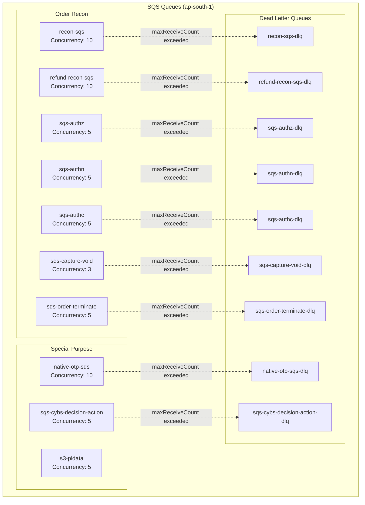
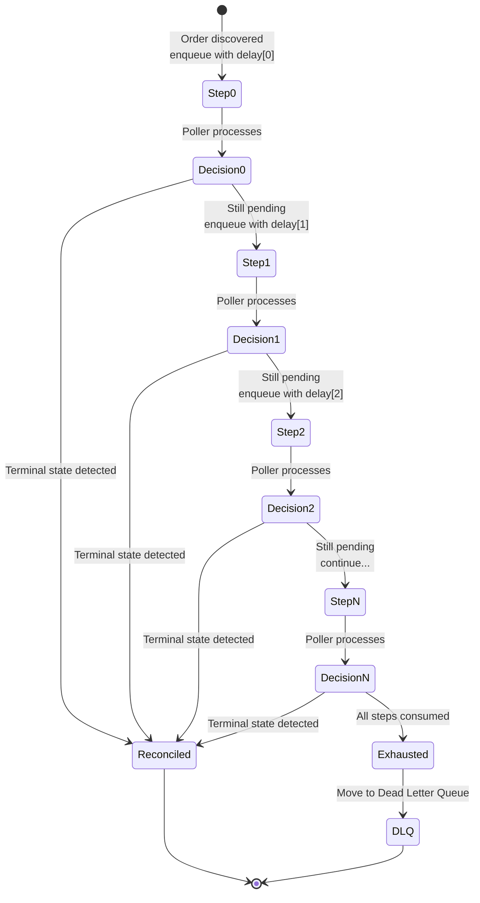
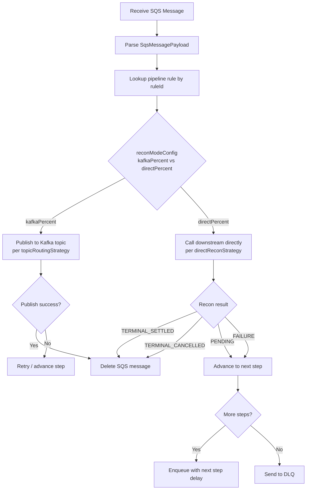
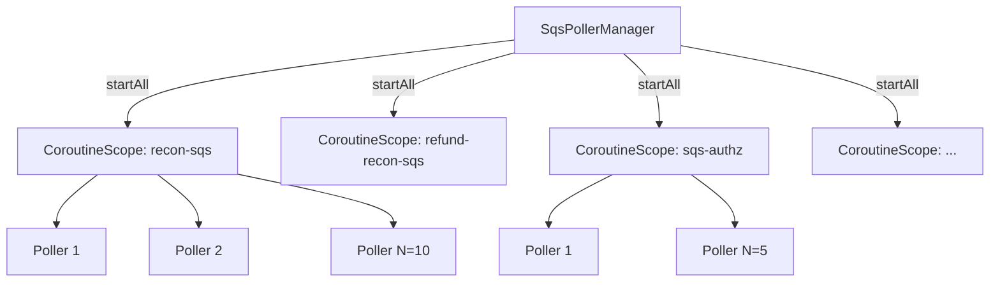
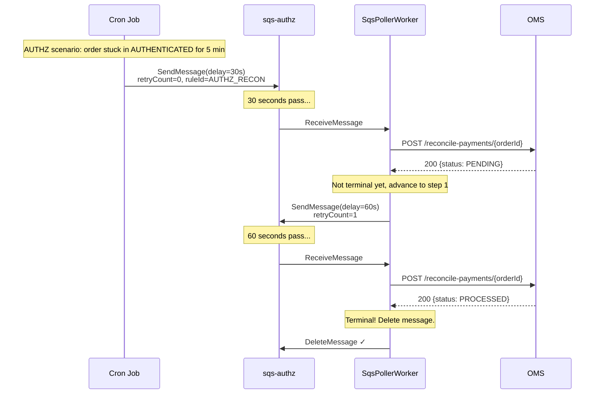

# 02 — SQS Pipeline & Step-Based Delays

## Overview

The order-recon service uses **AWS SQS** as its primary delay and retry mechanism. Orders discovered in non-terminal states are enqueued with configurable multi-step delays, allowing the system to poll downstream services at increasing intervals before escalating or terminating.

## Queue Topology



## SQS Message Payload

Every message in the pipeline carries this JSON structure:

```kotlin
data class SqsMessagePayload(
    val orderId: String,
    val merchantId: String,
    val orderType: String,         // CHARGE | REFUND
    val orderStatus: String,       // PENDING | CANCEL_REQUESTED | ATTEMPTED | ...
    val paymentStatus: String,     // AUTHENTICATED | AUTHENTICATION_CHALLENGED | ...
    val paymentMethod: String?,    // CARD | UPI | NETBANKING | WALLET | BNPL | EMI
    val source: String,            // Scenario that discovered this order
    val isParked: Boolean,         // Whether payment is parked (aggregator/acquirer failures)
    val retryCount: Int,           // Current step index (0-based)
    val ruleId: String,            // Pipeline rule that matched this order
    val sameStepRetryCount: Int,   // Retries within same step (visibility timeout path)
    val nextVisibleAtEpochMs: Long // Wall-clock time for extended delay
)
```

## Delay Mechanics

### Two Delay Modes

The SQS pipeline supports two distinct delay mechanisms depending on the configured delay duration:

```mermaid
flowchart TD
    MSG[Message to enqueue] --> CHECK{delay ≤ 900s?}

    CHECK -->|Yes| NATIVE[Native SQS DelaySeconds<br/>Message invisible for N seconds]
    CHECK -->|No| EXTENDED[Extended Delay Mode<br/>Visibility timeout trick]

    NATIVE --> VISIBLE[Message becomes visible<br/>Poller receives it]

    EXTENDED --> SEND[Send with DelaySeconds=0<br/>Set nextVisibleAtEpochMs in payload]
    SEND --> POLL[Poller receives immediately]
    POLL --> TIME_CHECK{now() >= nextVisibleAtEpochMs?}
    TIME_CHECK -->|No| CHANGE_VIS[ChangeMessageVisibility<br/>min(remaining, 900s)]
    TIME_CHECK -->|Yes| PROCESS[Process message]
    CHANGE_VIS --> POLL
```

### Native Delay (≤ 900 seconds)

SQS natively supports `DelaySeconds` up to 900 (15 minutes). For delays within this range:

```kotlin
// Simple: message invisible for configured delay
sqsClient.sendMessage {
    queueUrl = targetQueue
    messageBody = payload.toJson()
    delaySeconds = step.delaySeconds  // 0..900
}
```

### Extended Delay (> 900 seconds, up to 43,200 seconds / 12 hours)

For delays exceeding 15 minutes, the service uses a **visibility timeout recycling pattern**:

```kotlin
// Step 1: Enqueue with nextVisibleAtEpochMs set in payload
val targetTime = System.currentTimeMillis() + (step.delaySeconds * 1000)
val payload = payload.copy(nextVisibleAtEpochMs = targetTime)
sqsClient.sendMessage {
    queueUrl = targetQueue
    messageBody = payload.toJson()
    delaySeconds = 0  // Immediately visible
}

// Step 2: Poller receives, checks wall-clock time
fun processMessage(msg: SqsMessagePayload, receipt: String) {
    val remainingMs = msg.nextVisibleAtEpochMs - System.currentTimeMillis()
    if (remainingMs > 0) {
        // Not ready yet — extend visibility timeout
        val visibilitySeconds = min(remainingMs / 1000, 900).toInt()
        sqsClient.changeMessageVisibility {
            queueUrl = queueUrl
            receiptHandle = receipt
            visibilityTimeout = visibilitySeconds
        }
        return  // Message will reappear after visibility timeout
    }
    // Ready to process
    executeRecon(msg)
}
```

**Key constraint**: SQS `ChangeMessageVisibility` also has a 900s max, so messages with very long delays (e.g., 12h) may cycle through visibility extensions multiple times:

```
12h delay = 43,200s
Max visibility = 900s
Cycles needed = ceil(43200/900) = 48 visibility extensions
```

### Same-Step Retry

When a message fails processing (transient error), it can retry within the same step:

```kotlin
if (shouldRetryInSameStep(error)) {
    val updated = payload.copy(sameStepRetryCount = payload.sameStepRetryCount + 1)
    sqsClient.sendMessage {
        queueUrl = sameQueue
        messageBody = updated.toJson()
        delaySeconds = backoffDelay(payload.sameStepRetryCount)  // exponential
    }
}
```

## Step-Based Pipeline Progression

Each pipeline rule defines an ordered list of steps with delays:

```yaml
rules:
  - ruleId: "AUTHZ_RECON"
    steps:
      - { stepIndex: 0, delaySeconds: 30 }    # Wait 30s, then check
      - { stepIndex: 1, delaySeconds: 60 }    # Wait 1min, check again
      - { stepIndex: 2, delaySeconds: 120 }   # Wait 2min
      - { stepIndex: 3, delaySeconds: 300 }   # Wait 5min
      - { stepIndex: 4, delaySeconds: 600 }   # Wait 10min
      - { stepIndex: 5, delaySeconds: 900 }   # Wait 15min (max native)
    topicRoutingStrategy: SYNC
    directReconStrategy: OMS_RECONCILE_PAYMENTS
```

### Step Progression Flow



### Processing at Each Step

When the poller receives a message, it determines the **recon path** based on the `reconModeConfig`:



## Poller Configuration

### SQS Poller Parameters

| Parameter | Value | Purpose |
|-----------|-------|---------|
| `longPollWaitTimeSeconds` | 20 | Long-poll duration (reduces API calls) |
| `maxNumberOfMessages` | 10 | Batch size per receive call |
| `processorMultiplier` | 2 | Concurrency multiplier per queue |
| `visibilityTimeoutSeconds` | 30 | Default message lock time |

### Concurrency Model

```
Effective concurrency = concurrency × processorMultiplier

Example for sqs-authz (concurrency=5, multiplier=2):
  = 5 × 2 = 10 concurrent message processors
```

Each queue gets its own **coroutine scope** (`Dispatchers.IO`) with independent error boundaries:



## Dual SQS Client Architecture

The service uses **two separate `SqsAsyncClient` instances** to prevent connection pool starvation:

| Client | Purpose | Operations |
|--------|---------|-----------|
| **Receive Client** | Message polling | `receiveMessage`, `deleteMessage` |
| **Mutation Client** | State changes | `sendMessage`, `changeMessageVisibility` |

**Rationale**: Under high load, `receiveMessage` long-polls block connections for up to 20s. If send/visibility-change operations share the same pool, they can be starved, causing cascading delays.

## DLQ Strategy

Messages reach the DLQ when:
1. All pipeline steps are exhausted and order is still non-terminal
2. Repeated processing failures (controlled by SQS `maxReceiveCount`)
3. Unrecoverable errors (malformed payload, unknown ruleId)

### DLQ Monitoring

```
DLQ depth > 0 for > 5 minutes → P2 Alert
DLQ depth > 100 → P1 Alert (systematic failure)
```

### DLQ Reprocessing

Manual reprocessing via API:
```
POST /api/internal/recon/v1/dlq/reprocess
{
  "queueName": "sqs-authz-dlq",
  "maxMessages": 50,
  "targetQueue": "sqs-authz"
}
```

## Delay Compensation: Kafka Lag

When messages arrive via Kafka before being enqueued to SQS, the service compensates for Kafka consumer lag:

```kotlin
// DelayComputation.kt
fun computeEffectiveDelay(configuredDelay: Int, kafkaTimestamp: Long): Int {
    val lagMs = System.currentTimeMillis() - kafkaTimestamp
    val lagSeconds = (lagMs / 1000).toInt()
    val effectiveDelay = configuredDelay - lagSeconds
    return effectiveDelay.coerceIn(0, configuredDelay)
}
```

**Example**:
- Configured delay: 60s
- Kafka lag: 15s (message was produced 15s ago)
- Effective SQS delay: 60 - 15 = 45s

This ensures the total end-to-end delay matches the configured intent regardless of Kafka consumer group lag.

## Queue-to-Scenario Mapping

| Queue | Scenarios Routed Here | Typical Delays |
|-------|----------------------|----------------|
| `sqs-authz` | AUTHZ (authorized but not captured) | 30s → 60s → 120s → 300s → 600s → 900s |
| `sqs-authn` | AUTHN, AUTHN_2MINS (card/EMI auth challenged) | 120s → 300s → 600s → 900s |
| `sqs-authc` | AUTHC_UPI, AUTHC_CR_UPI, AUTHC_NETBANKING, AUTHC_WALLET, AUTHC_BNPL | 60s → 120s → 300s → 600s |
| `sqs-capture-void` | CAPTURE_VOID | 120s → 300s → 600s → 900s |
| `refund-recon-sqs` | REFUND, AGGREGATOR_REFUNDS, ACQUIRER_FAILURE | 60s → 120s → 300s → 600s → 900s |
| `sqs-order-terminate` | LONG_PENDING, LONG_PENDING_CREATED, LONG_PENDING_REFUND | 1800s → 3600s → 7200s |
| `recon-sqs` | Default fallback, PAYMENT_CANCEL | 60s → 120s → 300s |
| `native-otp-sqs` | Native OTP (ActionQueue) | Dynamic exponential: 1→2→4→8...s |
| `sqs-cybs-decision-action` | CyberSource risk pending review | 300s → 600s → 900s |

## Message Lifecycle Example


