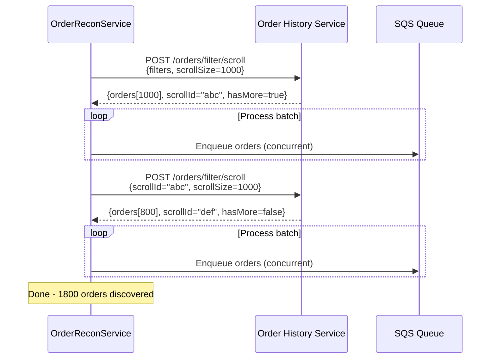
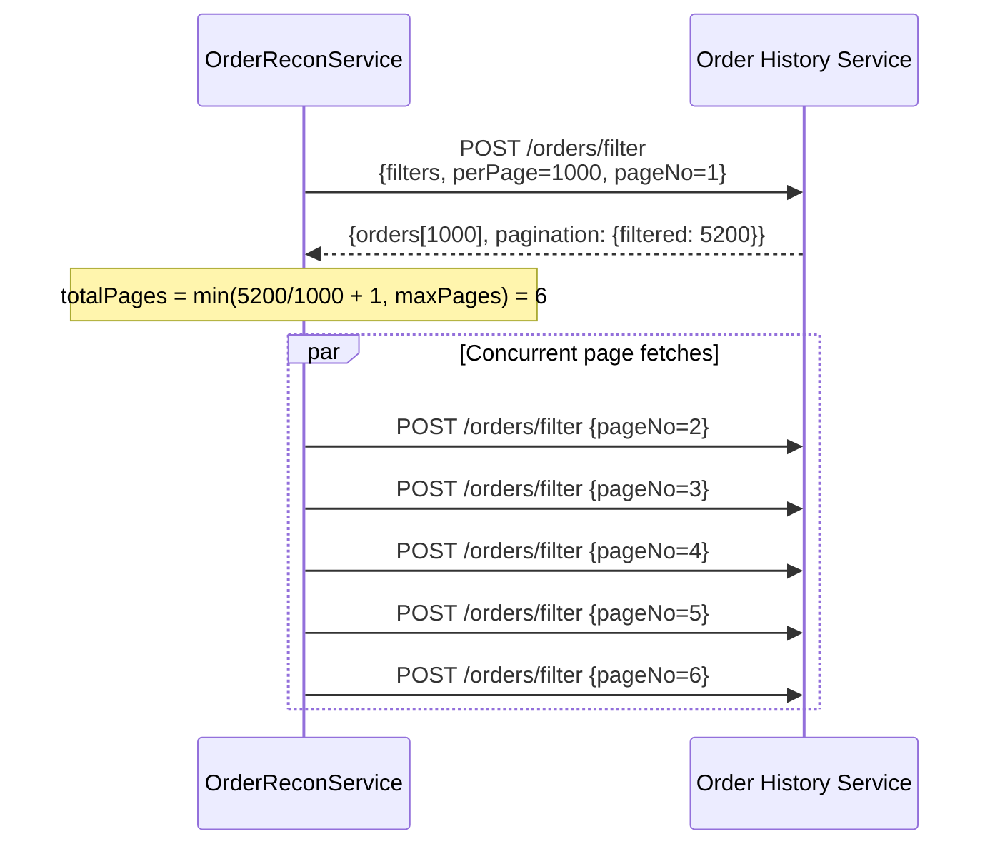
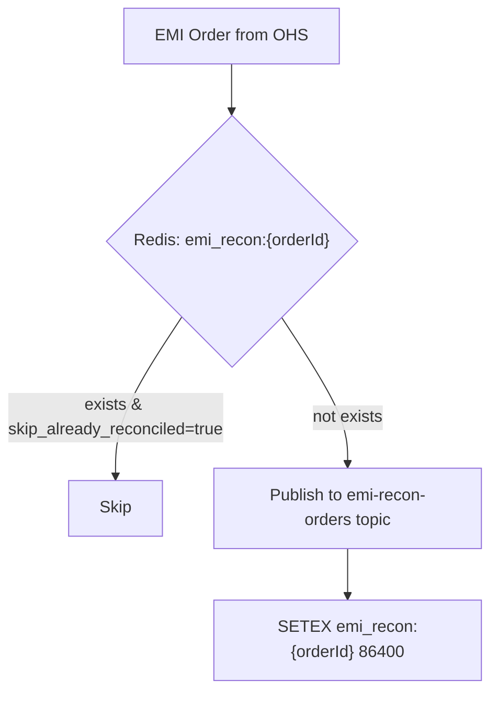

# 03 — Reconciliation Scenarios

## Overview

The Order Reconciliation Service discovers stuck orders by running **scheduled queries** against Order History Service (OpenSearch). Each query targets a specific combination of order/payment states, forming a "scenario." There are **17+ distinct scenarios**, each with tailored filters, time windows, and downstream routing.

## Discovery Architecture

```mermaid
flowchart TB
    subgraph "Cron Triggers"
        C1[AUTHZ Cron<br/>every 2 min]
        C2[AUTHN Cron<br/>every 3 min]
        C3[AUTHC_UPI Cron<br/>every 2 min]
        C4[REFUND Cron<br/>every 5 min]
        C5[LONG_PENDING Cron<br/>every 15 min]
        C6[CAPTURE_VOID Cron<br/>every 5 min]
        CN[... 11 more]
    end

    subgraph "OrderReconService"
        SYNC[syncOrders()]
        TERM[terminateOrders()]
        MASK[dataMasking()]
    end

    subgraph "SearchRequestBuilder"
        FILTER[buildFilterRequest()]
        SCROLL[buildOrderScrollRequest()]
        SEARCH[buildSearchRequest()]
    end

    subgraph "OrderHistoryClient"
        PAGINATE[POST /orders/filter]
        SCROLL_API[POST /orders/filter/scroll]
    end

    C1 & C2 & C3 --> SYNC
    C5 --> TERM
    SYNC --> FILTER & SCROLL
    TERM --> FILTER & SCROLL
    FILTER --> PAGINATE
    SCROLL --> SCROLL_API
```

## Scenario Catalog

### Purchase Order Scenarios

| Scenario | Order Status | Payment Status | Payment Method | Time Field | Purpose |
|----------|-------------|----------------|----------------|------------|---------|
| **AUTHZ** | PENDING, CANCEL_REQUESTED | AUTHENTICATED | Any | `payments.updated_at` | Orders authorized at gateway but not captured by merchant |
| **AUTHN** | PENDING, CANCEL_REQUESTED | AUTHENTICATION_CHALLENGED | CARD, EMI | `payments.created_at` | Card payments stuck in 3DS challenge |
| **AUTHN_2MINS** | PENDING, CANCEL_REQUESTED | AUTHENTICATION_CHALLENGED | CARD, EMI | `payments.created_at` | Same as AUTHN but for PAY_BY_LINK tenant (shorter window) |
| **AUTHC_UPI** | PENDING | AUTHENTICATION_CHALLENGED | UPI | `payments.updated_at` | UPI collect/intent stuck in challenge |
| **AUTHC_CR_UPI** | CANCEL_REQUESTED | AUTHENTICATION_CHALLENGED | UPI | `payments.updated_at` | UPI with cancel requested |
| **AUTHC_NETBANKING** | PENDING, CANCEL_REQUESTED | AUTHENTICATION_CHALLENGED | NETBANKING | `payments.updated_at` | Netbanking redirect not returned |
| **AUTHC_WALLET** | PENDING, CANCEL_REQUESTED | AUTHENTICATION_CHALLENGED | WALLET | `payments.updated_at` | Wallet payment stuck |
| **AUTHC_BNPL** | PENDING, CANCEL_REQUESTED | AUTHENTICATION_CHALLENGED | BNPL | `payments.updated_at` | Buy-now-pay-later stuck |
| **CAPTURE_VOID** | Any | CAPTURE_REQUESTED, CANCEL_REQUESTED | Any | `payments.updated_at` | Capture/void sent to acquirer but no response |
| **PAYMENT_CANCEL** | Any | CANCEL_REQUESTED | Any | `payments.created_at` | Force-cancelled payments (is_force_cancelled=true) |

### Refund Scenarios

| Scenario | Order Status | Payment Status | Extra Filters | Purpose |
|----------|-------------|----------------|---------------|---------|
| **REFUND** | PENDING | CAPTURE_REQUESTED | — | Refund initiated, waiting for acquirer confirmation |
| **AGGREGATOR_REFUNDS** | PENDING | INITIATED | is_parked=true, parked_reason=AGGREGATOR_SALE_CHECK_FAILURE | Parked due to aggregator sale-check failure |
| **ACQUIRER_FAILURE** | PENDING | INITIATED | is_parked=true, parked_reason=ACQUIRER_DECLINE, attempt count | Parked due to acquirer decline, retry eligible |
| **LONG_PENDING_REFUND** | PENDING | Any | — | Refund stuck beyond threshold, force-close |

### Termination Scenarios

| Scenario | Order Status | Payment Status | Purpose |
|----------|-------------|----------------|---------|
| **LONG_PENDING** | ATTEMPTED, PENDING, CANCEL_REQUESTED | INITIATED, AUTHENTICATED, AUTH_CHALLENGED, CANCEL_REQ, CANCELLED, FAILED | Orders beyond max lifecycle, force-terminate |
| **LONG_PENDING_CREATED** | CREATED | Any | Orders never attempted, force-terminate |

### Special Scenarios

| Scenario | Purpose | Filters |
|----------|---------|---------|
| **DATA_MASKING** | PCI compliance — encrypt card data in old orders | Rolling time window on `created_at` |
| **EMI_RECON** | EMI-specific reconciliation (charge orders) | EMI payment methods |
| **EMI_REFUND_RECON** | EMI-specific reconciliation (refund orders) | EMI payment methods |

## Query Construction

### Filter DSL

The service uses a custom filter DSL that maps to OpenSearch queries:

```kotlin
data class OrderFilterRequest(
    val filters: List<Filter>,           // AND-combined filters
    val sort: SortConfig?,               // Sort field + direction
    val perPage: Int = 600,              // Page size
    val pageNo: Int = 1,                 // Page number (1-indexed)
    val scrollSize: Int? = null,         // For scroll API
    val scrollId: String? = null,        // Continue scroll
    val indexName: String? = null        // Target index
)

sealed class Filter {
    data class TermsFilter(
        val field: String,
        val values: List<String>
    ) : Filter()

    data class RangeFilter(
        val field: String,
        val from: String?,    // ISO datetime or value
        val to: String?       // ISO datetime or value
    ) : Filter()
}
```

### Example: AUTHZ Scenario Query

```json
{
  "filters": [
    { "type": "terms", "field": "order_type", "values": ["CHARGE"] },
    { "type": "terms", "field": "order_status", "values": ["PENDING", "CANCEL_REQUESTED"] },
    { "type": "terms", "field": "payments.payment_status", "values": ["AUTHENTICATED"] },
    { "type": "range", "field": "payments.updated_at", "from": "2024-01-01T00:00:00Z", "to": "2024-01-01T00:55:00Z" }
  ],
  "sort": { "field": "payments.created_at", "direction": "DESC" },
  "perPage": 1000
}
```

### Example: LONG_PENDING Scenario Query

```json
{
  "filters": [
    { "type": "terms", "field": "order_type", "values": ["CHARGE"] },
    { "type": "terms", "field": "order_status", "values": ["ATTEMPTED", "PENDING", "CANCEL_REQUESTED"] },
    { "type": "terms", "field": "payments.payment_status", "values": [
        "INITIATED", "AUTHENTICATED", "AUTHENTICATION_CHALLENGED",
        "CANCEL_REQUESTED", "CANCELLED", "FAILED"
    ]},
    { "type": "range", "field": "updated_at", "from": null, "to": "2024-01-01T00:00:00Z" }
  ],
  "sort": { "field": "updated_at", "direction": "DESC" },
  "perPage": 1000
}
```

## Pagination Strategies

### Scroll Mode (Preferred)



**Advantages**:
- Consistent snapshot (no missed/duplicate orders during iteration)
- No deep-page performance degradation
- OHS manages scroll lifecycle automatically

### Pagination Mode (Legacy)



**Controlled by**: `filterScrollConfig.enabled` flag (value "1" = scroll mode)

### Page Limits per Scenario

| Scenario | Max Pages | Effective Max Orders |
|----------|-----------|---------------------|
| AUTHZ | 10 | 10,000 |
| AUTHN | 5 | 5,000 |
| AUTHC_* | 5 | 5,000 |
| REFUND | 10 | 10,000 |
| LONG_PENDING | 20 | 20,000 |
| CAPTURE_VOID | 5 | 5,000 |
| Default | 5 | 5,000 |

## Time Windows

Each scenario queries orders within a specific time window relative to "now":

```mermaid
gantt
    title Scenario Time Windows (relative to now)
    dateFormat X
    axisFormat %s

    section AUTHZ
    Query window (5min - 60min ago) :0, 55

    section AUTHN
    Query window (3min - 30min ago) :0, 27

    section AUTHC_UPI
    Query window (2min - 15min ago) :0, 13

    section REFUND
    Query window (5min - 120min ago) :0, 115

    section LONG_PENDING
    Query window (2h - 24h ago) :0, 22

    section CAPTURE_VOID
    Query window (5min - 60min ago) :0, 55
```



**Window construction**:
- `from` = `now - maxAge` (oldest orders to consider)
- `to` = `now - minAge` (newest orders to consider — gives time for natural completion)

The `minAge` prevents reconciling orders that are still being actively processed.

## Deduplication

Before enqueueing to SQS, each order is checked against Redis:

```mermaid
flowchart TD
    ORDER[Order from OHS] --> DEDUP_KEY["Key: dedup:{orderId}:{ruleId}"]
    DEDUP_KEY --> EXISTS{Redis EXISTS?}
    EXISTS -->|0 (new)| SETEX["SETEX key 86460 '1'<br/>(24h + 60s TTL)"]
    SETEX --> ENQUEUE[Enqueue to SQS]
    EXISTS -->|1 (exists)| SKIP[Skip order<br/>Already in pipeline]
```

**TTL = 86,460 seconds (24h + 60s buffer)**

This prevents the same order from being enqueued multiple times across consecutive cron runs while it's still progressing through the SQS pipeline.

## Concurrent Processing

Each scroll/page batch is processed concurrently:

```kotlin
// Simplified from OrderReconService.kt
suspend fun processOrders(orders: List<Order>, rule: ReconPipelineRule) {
    orders.map { order ->
        async(Dispatchers.IO) {
            val dedupKey = "dedup:${order.id}:${rule.ruleId}"
            if (redis.exists(dedupKey) == 0L) {
                redis.setex(dedupKey, 86460, "1")
                when (rule.topicRoutingStrategy) {
                    SYNC -> enqueueToSqs(order, rule)
                    TERMINATE -> enqueueToTerminateQueue(order, rule)
                    SYNC_PAYMENTS -> enqueueToSyncPaymentsQueue(order, rule)
                }
            }
        }
    }.awaitAll()
}
```

## Scenario → Pipeline Rule → Queue Mapping

```mermaid
flowchart LR
    subgraph "Scenarios"
        S_AUTHZ[AUTHZ]
        S_AUTHN[AUTHN]
        S_AUTHC[AUTHC_UPI/NB/WALLET/BNPL]
        S_REFUND[REFUND]
        S_CAPVOID[CAPTURE_VOID]
        S_LONG[LONG_PENDING]
        S_CANCEL[PAYMENT_CANCEL]
    end

    subgraph "Pipeline Rules"
        R1[AUTHZ_RECON]
        R2[AUTHN_RECON]
        R3[AUTHC_RECON]
        R4[REFUND_RECON]
        R5[CAPVOID_RECON]
        R6[TERMINATE_RECON]
        R7[CANCEL_RECON]
    end

    subgraph "SQS Queues"
        Q1[sqs-authz]
        Q2[sqs-authn]
        Q3[sqs-authc]
        Q4[refund-recon-sqs]
        Q5[sqs-capture-void]
        Q6[sqs-order-terminate]
        Q7[recon-sqs]
    end

    S_AUTHZ --> R1 --> Q1
    S_AUTHN --> R2 --> Q2
    S_AUTHC --> R3 --> Q3
    S_REFUND --> R4 --> Q4
    S_CAPVOID --> R5 --> Q5
    S_LONG --> R6 --> Q6
    S_CANCEL --> R7 --> Q7
```



## OHS Response Processing

Orders from OHS arrive as **Protobuf `Order` objects** (deserialized from JSON via `nxt-message-contracts`):

```kotlin
data class Order(
    val id: String,
    val merchantId: String,
    val orderType: OrderType,        // CHARGE | REFUND
    val orderStatus: OrderStatus,
    val amount: Long,
    val currency: String,
    val payments: List<Payment>,
    val createdAt: Timestamp,
    val updatedAt: Timestamp,
    val metadata: Map<String, String>
)

data class Payment(
    val id: String,
    val paymentStatus: PaymentStatus,
    val paymentMethod: PaymentMethod,
    val amount: Long,
    val acquirerDetails: AcquirerDetails?,
    val isParked: Boolean,
    val parkedReason: String?,
    val isForceCancelled: Boolean,
    val createdAt: Timestamp,
    val updatedAt: Timestamp
)
```

## EMI Reconciliation (Special Case)

EMI orders have additional dedup logic:



EMI orders are always routed to the **`emi-recon-orders`** Kafka topic (never direct recon), because EMI reconciliation requires specialized downstream processing (interest calculation, EMI plan validation, bank confirmation).
