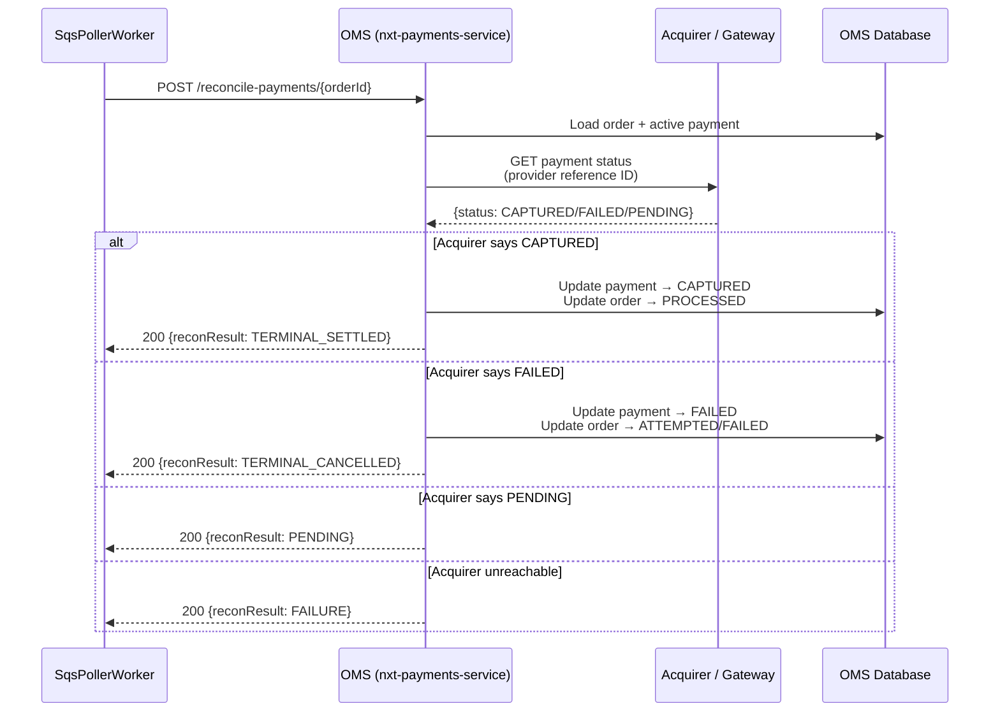
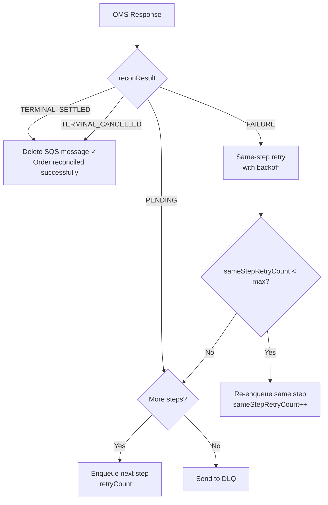
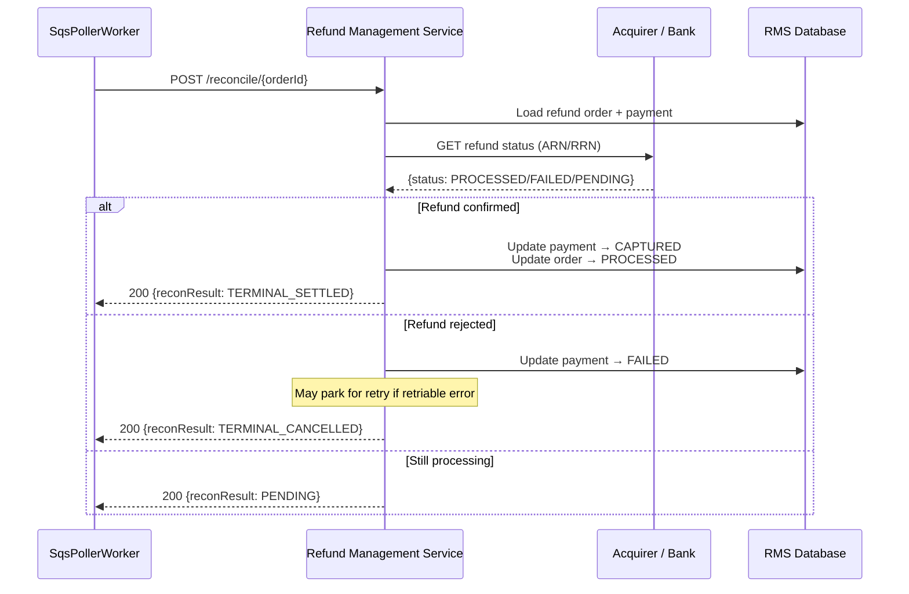
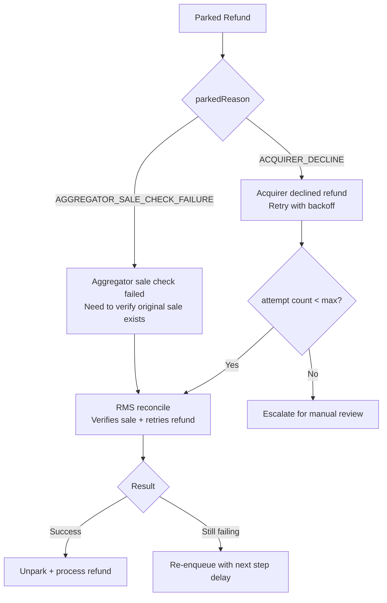
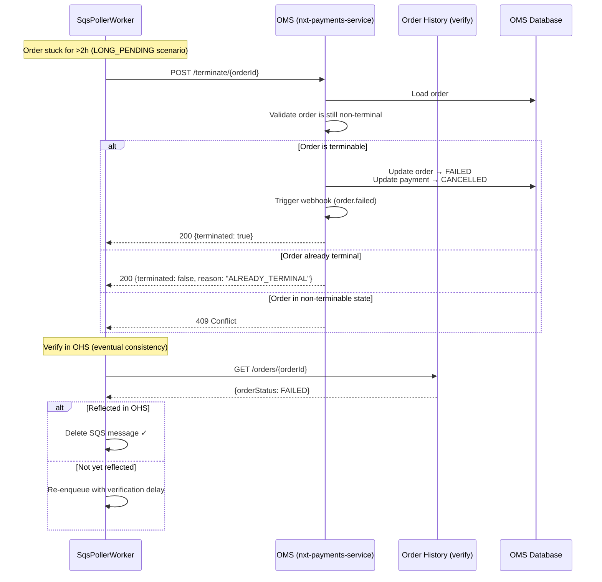
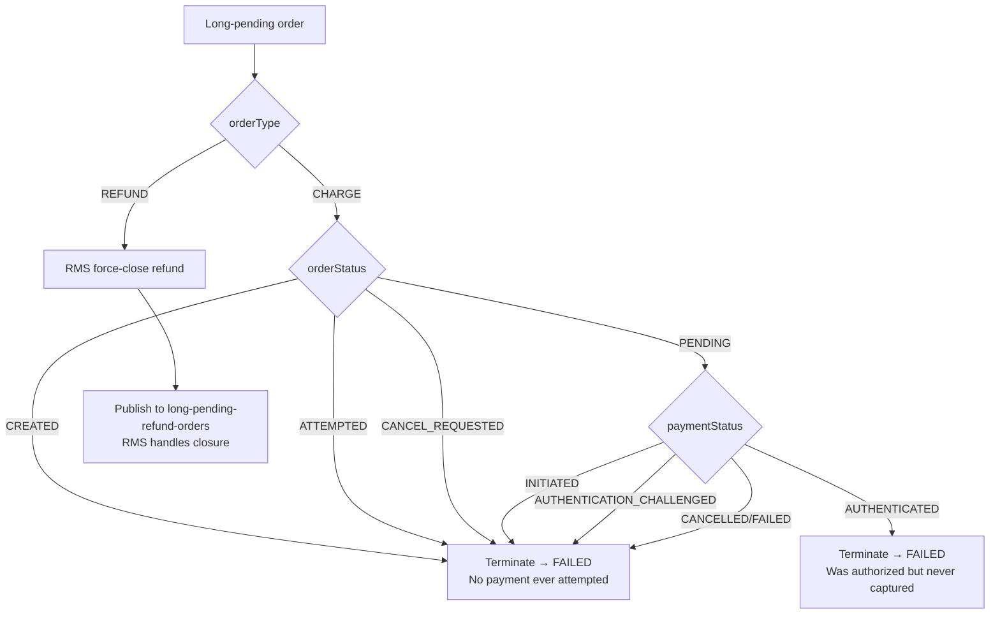
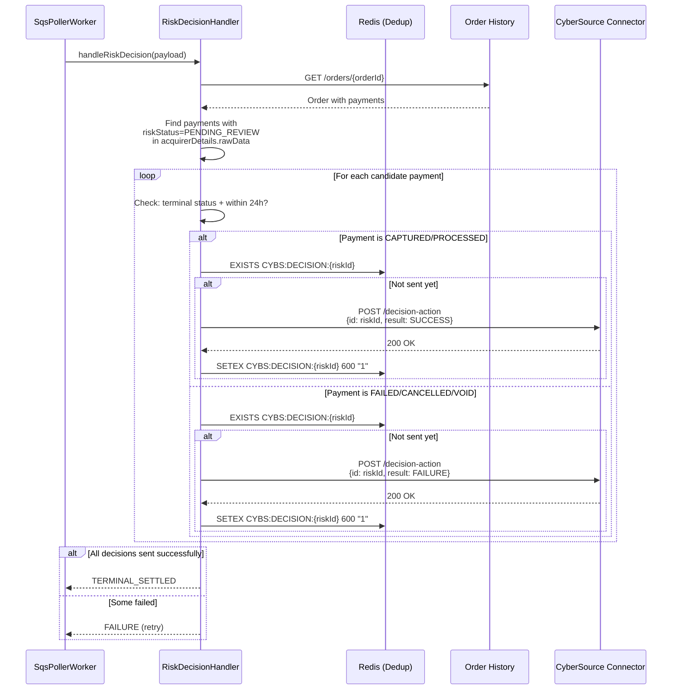
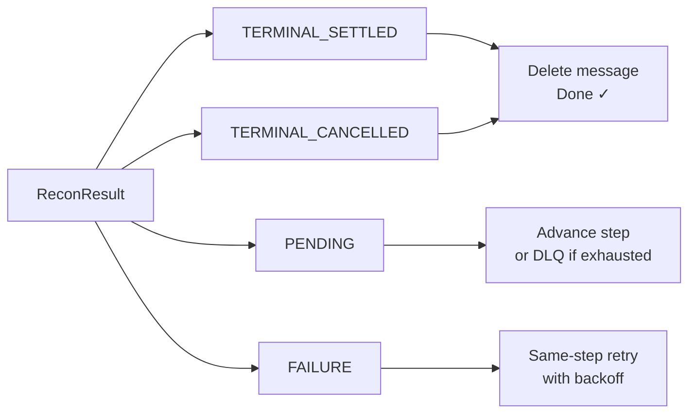
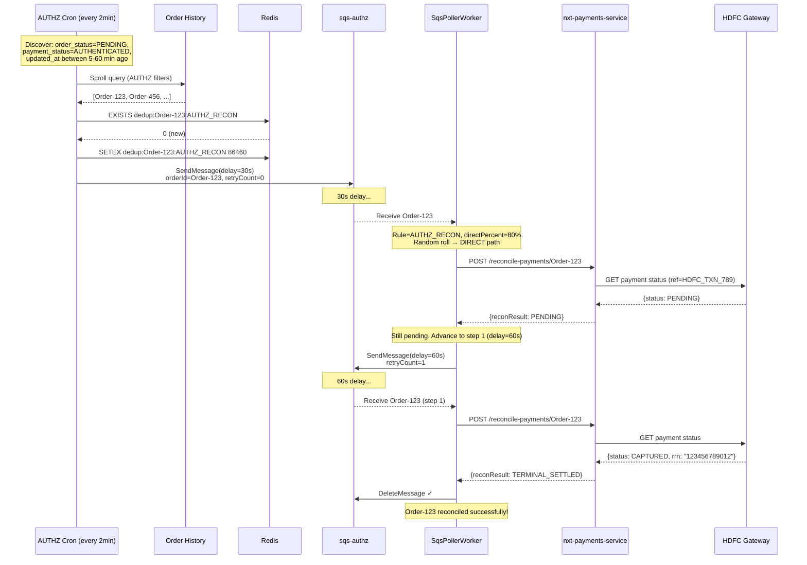

# 04 — Direct Recon Workflows

## Overview

When the SQS poller processes a message and the pipeline rule's `reconModeConfig` routes it to the **direct path** (vs Kafka), the service calls downstream services directly via HTTP to drive reconciliation. There are four `DirectReconStrategy` options:

| Strategy | Target Service | Endpoint | Purpose |
|----------|---------------|----------|---------|
| `OMS_RECONCILE_PAYMENTS` | OMS (nxt-payments-service) | `POST /api/internal/pay/v1/orders/reconcile-payments/{orderId}` | Sync payment state with acquirer |
| `RMS_RECONCILE_REFUND` | RMS (nxt-refund-management-service) | `POST /api/internal/pay/v1/refunds/reconcile/{orderId}` | Sync refund state with acquirer |
| `OMS_TERMINATE_ORDER` | OMS (nxt-payments-service) | `POST /api/internal/pay/v1/orders/terminate/{orderId}` | Force-close long-pending orders |
| `CYBS_RISK_DECISION` | CyberSource Card Connector | `POST /connectors/cybs/v1/cards/decision-action` | Submit risk decision for reviewed payments |

## OMS_RECONCILE_PAYMENTS

### Purpose

Triggers OMS to query the acquirer/gateway for the current payment status and update the order state accordingly. Used for orders stuck in intermediate states (AUTHENTICATED, AUTHENTICATION_CHALLENGED, CAPTURE_REQUESTED).

### Workflow



### Response Handling



### Circuit Breaker Protection

All OMS calls are wrapped in an Arrow Resilience circuit breaker:

```kotlin
// Circuit breaker config for OMS client
CircuitBreaker(
    maxFailures = 200,         // Open after 200 consecutive failures
    resetTimeout = 10.seconds, // Half-open after 10s
    exponentialBackoffFactor = 1.2,
    maxResetTimeout = 60.seconds
)
```

**When circuit is OPEN**: Messages are not processed — they return to the queue via visibility timeout and will be retried when the circuit transitions to HALF_OPEN.

## RMS_RECONCILE_REFUND

### Purpose

Triggers the Refund Management Service to check refund status with the acquirer. Used for refunds stuck in CAPTURE_REQUESTED (refund initiated but not confirmed by bank).

### Workflow



### Parked Refund Handling

For scenarios like `AGGREGATOR_REFUNDS` and `ACQUIRER_FAILURE`, the refund is "parked" with a reason:



## OMS_TERMINATE_ORDER

### Purpose

Force-closes orders that have been stuck beyond the maximum lifecycle threshold. This is the "nuclear option" — the order is moved to a terminal state regardless of acquirer response.

### Workflow



### Termination Decision Tree



### Force Close (vs Terminate)

There are two related but distinct operations:

| Operation | Endpoint | Use Case | Who Calls |
|-----------|----------|----------|-----------|
| **Terminate** | `POST /terminate/{orderId}` | Long-pending orders with no acquirer response | Recon service |
| **Force Close** | `PUT /force-close/{orderId}` | Back-posting — late auth from acquirer | Recon service (backpost flow) |

Force close includes payment details from the acquirer (providerReferenceId, RRN, status):

```kotlin
data class OMSForceCloseRequest(
    val orderId: String,
    val paymentId: String,
    val providerReferenceId: String?,
    val rrn: String?,
    val paymentStatus: String,  // CAPTURED | FAILED
    val acquirerCode: String?,
    val acquirerMessage: String?
)
```

## CYBS_RISK_DECISION

### Purpose

For CyberSource-processed payments where risk review status is `PENDING_REVIEW`, this strategy submits the final decision (accept/reject) to CyberSource based on the payment's terminal state.

### Workflow



### Decision Mapping

| Payment Terminal Status | CyberSource Decision | Message |
|------------------------|---------------------|---------|
| CAPTURED | SUCCESS | "Payment captured successfully" |
| PROCESSED | SUCCESS | "Payment processed successfully" |
| FAILED | FAILURE | "Payment failed" |
| CANCELLED | FAILURE | "Payment cancelled" |
| VOID | FAILURE | "Payment voided" |

### Dedup TTL

Redis key: `CYBS:DECISION:{riskId}` with **10-minute TTL** (600s). This is shorter than the standard 24h dedup because CyberSource decisions are idempotent and we want faster retry on transient failures.

## Direct Recon Result Contract

All direct recon strategies return one of these outcomes:

```kotlin
enum class ReconResult {
    TERMINAL_SETTLED,     // Order reached terminal success state
    TERMINAL_CANCELLED,   // Order reached terminal failure state
    PENDING,              // Still in intermediate state, retry later
    FAILURE               // Recon call itself failed (transient error)
}
```

### Result → Action Mapping



## Error Handling & Retries

### HTTP Error Responses

| HTTP Status | Interpretation | Action |
|-------------|---------------|--------|
| 200 | Success (check body for reconResult) | Per result mapping above |
| 404 | Order not found in OMS | Delete message (stale) |
| 409 | Conflict (concurrent modification) | Same-step retry |
| 429 | Rate limited | Same-step retry with longer backoff |
| 5xx | Server error | Same-step retry |
| Timeout | Network timeout (10s) | Same-step retry |
| Circuit OPEN | Service unhealthy | Message returns via visibility timeout |

### Backoff Strategy

Same-step retries use exponential backoff:

```
delay = min(baseDelay * 2^(sameStepRetryCount), maxBackoff)

baseDelay = 5s
maxBackoff = 300s (5 min)

Attempt 0: 5s
Attempt 1: 10s
Attempt 2: 20s
Attempt 3: 40s
Attempt 4: 80s
Attempt 5: 160s
Attempt 6: 300s (capped)
```

## End-to-End Direct Recon Example

### AUTHZ Order: Card Payment Authorized but Not Captured


