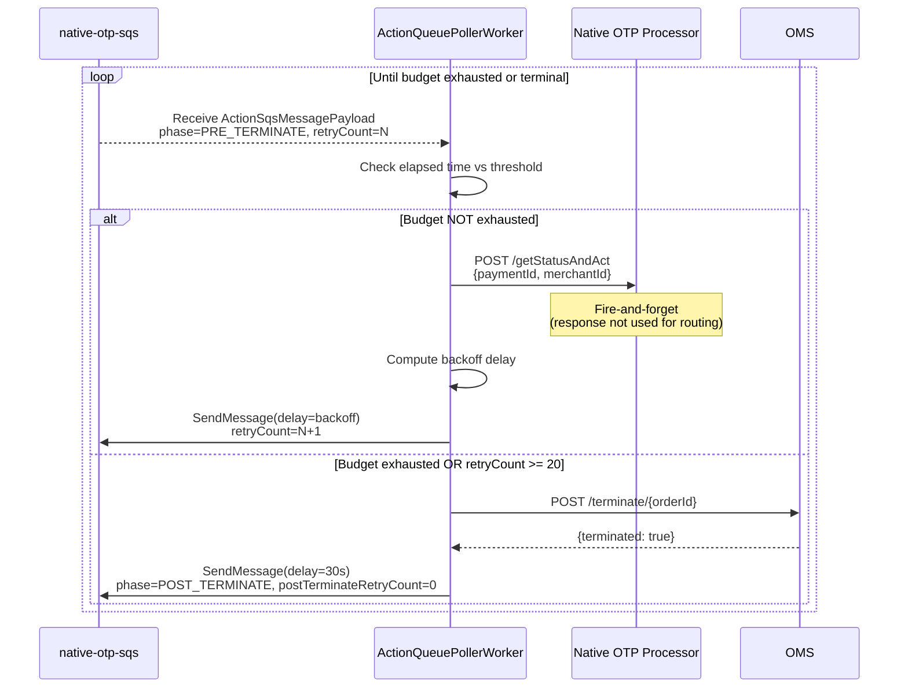
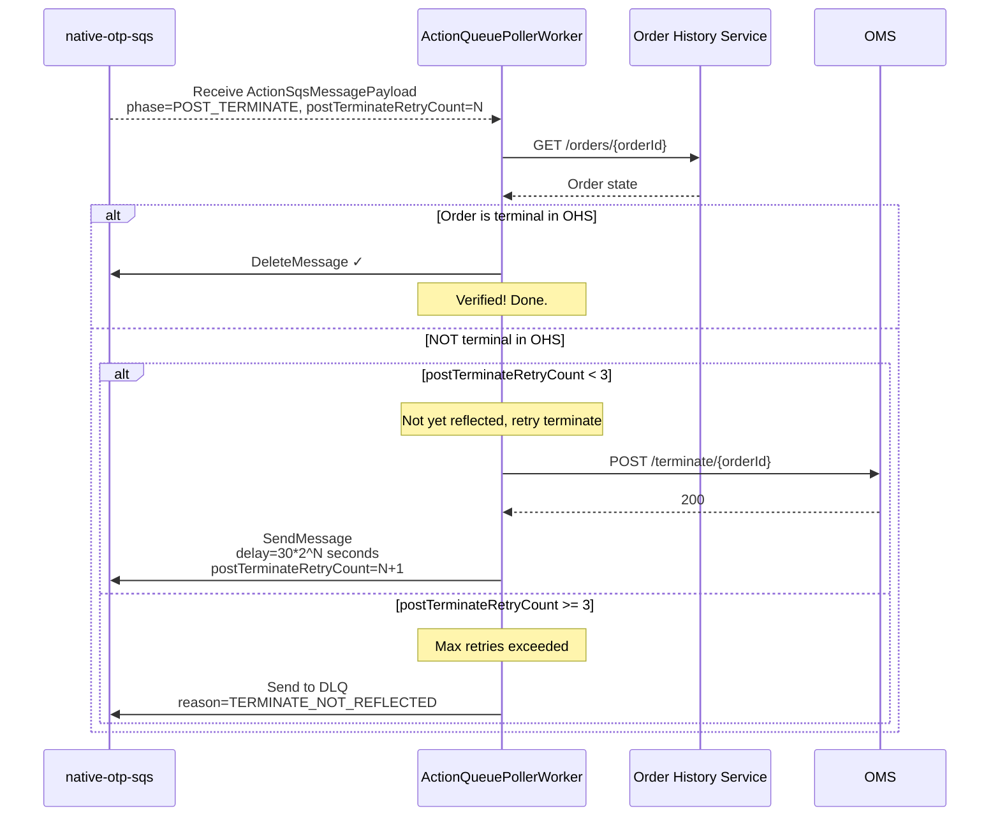
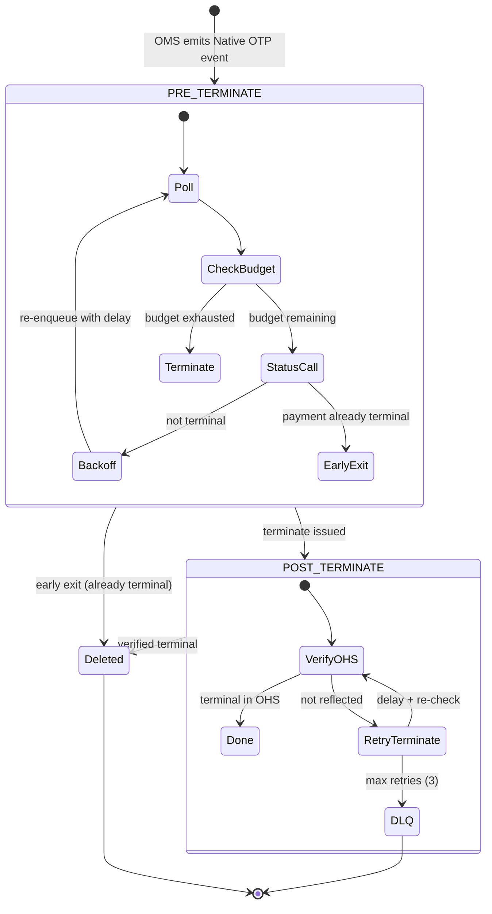
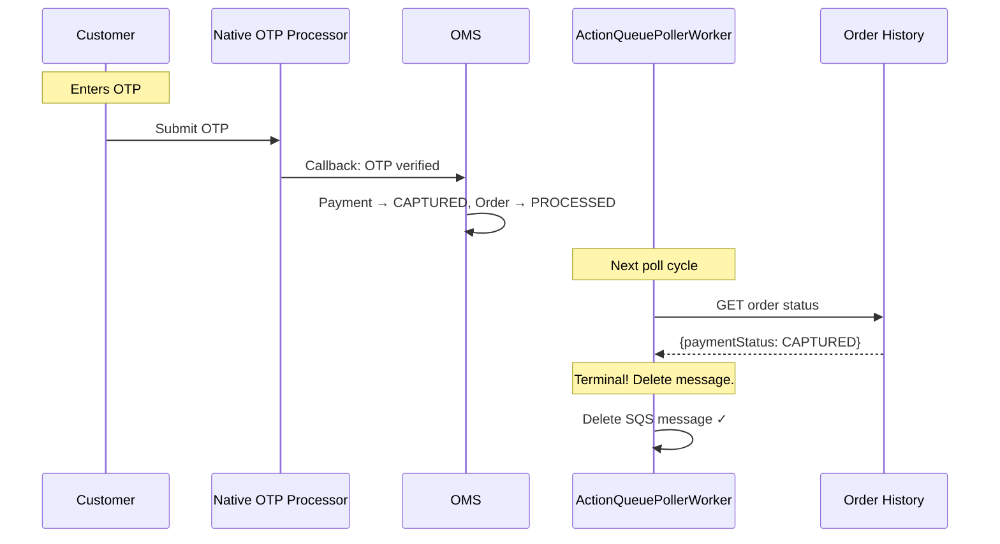
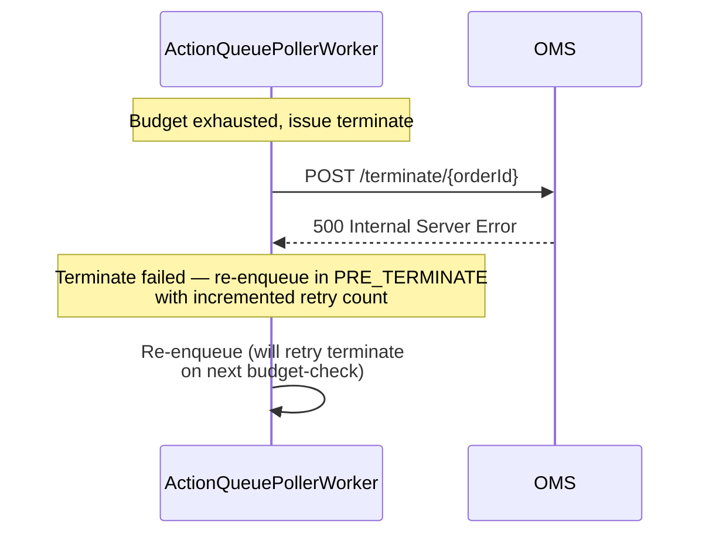
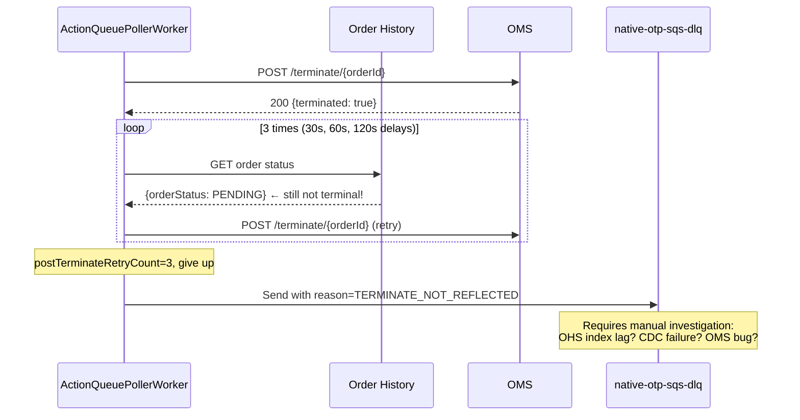

# 05 — Native OTP & Action Queues

## Overview

The **Action Queue** system handles a specialized class of reconciliation where the service must actively drive an order to termination through a multi-phase lifecycle. The primary use case is **Native OTP** — card payments authenticated via OTP where the platform manages the authentication timeout lifecycle.

Unlike standard recon (discover → delay → check), action queues implement a **two-phase termination protocol**:
1. **PRE_TERMINATE**: Actively poll payment processor, waiting for OTP completion
2. **POST_TERMINATE**: Verify termination is reflected in OHS after issuing terminate

## Architecture

```mermaid
graph TB
    subgraph "Trigger"
        OMS[OMS emits event<br/>Native OTP payment initiated]
        SQS_SEND[Enqueue to native-otp-sqs]
    end

    subgraph "ActionQueuePollerWorker"
        POLL[Poll native-otp-sqs]
        PARSE[Parse ActionSqsMessagePayload]
        PHASE{Current phase?}

        subgraph "PRE_TERMINATE"
            STATUS[Call NativeOTP Processor<br/>getStatusAndAct()]
            BUDGET{Time budget<br/>elapsed?}
            REQUEUE_PRE[Re-enqueue with<br/>exponential backoff]
            TERMINATE_CALL[Call OMS terminate]
        end

        subgraph "POST_TERMINATE"
            VERIFY[Check OHS for<br/>terminal status]
            RETRY_TERM[Re-issue terminate]
            DLQ_SEND[Send to DLQ]
        end
    end

    OMS --> SQS_SEND
    SQS_SEND --> POLL
    POLL --> PARSE --> PHASE
    PHASE -->|PRE_TERMINATE| STATUS
    STATUS --> BUDGET
    BUDGET -->|No| REQUEUE_PRE
    BUDGET -->|Yes| TERMINATE_CALL
    TERMINATE_CALL --> VERIFY
    PHASE -->|POST_TERMINATE| VERIFY
    VERIFY -->|Not reflected| RETRY_TERM
    VERIFY -->|Reflected| DELETE[Delete message ✓]
    RETRY_TERM -->|max retries exceeded| DLQ_SEND
```

## Action Message Payload

```kotlin
data class ActionSqsMessagePayload(
    val orderId: String,
    val merchantId: String,
    val actionType: String,              // "NATIVE_OTP"
    val paymentId: String,
    val retryCount: Int,                 // PRE_TERMINATE retry counter
    val postTerminateRetryCount: Int,    // POST_TERMINATE retry counter
    val phase: ActionPhase,              // PRE_TERMINATE | POST_TERMINATE
    val originalTimestamp: Long          // Epoch ms when order was first enqueued
)

enum class ActionPhase {
    PRE_TERMINATE,
    POST_TERMINATE
}

// Constants
const val MAX_PRE_TERMINATE_RETRIES = 20
const val MAX_POST_TERMINATE_RETRIES = 3
const val POST_TERMINATE_VERIFY_DELAY_SECONDS = 30
```

## Phase 1: PRE_TERMINATE

### Purpose

During the PRE_TERMINATE phase, the service:
1. Polls the Native OTP Processor for current payment status
2. Waits for the customer to complete OTP entry
3. If the time budget expires, transitions to termination

### Time Budget

The budget is configured as `actionTerminationThresholdSeconds` (typically 300–600s / 5–10 min). It's measured from `originalTimestamp`:

```kotlin
val elapsedSec = (System.currentTimeMillis() - payload.originalTimestamp) / 1000
val budgetExhausted = elapsedSec >= config.actionTerminationThresholdSeconds
```

### Backoff Strategy

PRE_TERMINATE uses exponential backoff for re-enqueue delays:

```
delay = min(baseDelay * 2^retryCount, maxDelay)

Retry 0:  1s
Retry 1:  2s
Retry 2:  4s
Retry 3:  8s
Retry 4:  16s
Retry 5:  32s
Retry 6:  64s
Retry 7:  128s
Retry 8:  256s
Retry 9:  512s → capped at threshold boundary
...
Retry 20: MAX_PRE_TERMINATE_RETRIES (force transition)
```

### PRE_TERMINATE Sequence



### Early Termination (Terminal Status Detection)

If at any point the order is already in a terminal state (detected from OHS or OMS response), the message is immediately deleted:

```kotlin
val terminalStatuses = setOf(
    "PROCESSED", "CANCELLED", "FAILED",
    "AUTHORIZED", "ATTEMPTED", "CANCEL_REQUESTED"
)

if (order.paymentStatus in terminalStatuses) {
    deleteMessage(receipt)
    return  // No further action needed
}
```

## Phase 2: POST_TERMINATE

### Purpose

After issuing terminate to OMS, the service verifies the terminal state is reflected in Order History Service (OpenSearch). Due to eventual consistency (Debezium CDC lag), there can be a delay.

### POST_TERMINATE Sequence



### POST_TERMINATE Retry Delays

```
Retry 0: 30s  (POST_TERMINATE_VERIFY_DELAY_SECONDS)
Retry 1: 60s  (30 * 2^1)
Retry 2: 120s (30 * 2^2)
Retry 3: DLQ  (MAX_POST_TERMINATE_RETRIES exceeded)
```

Total max wait for OHS reflection: 30 + 60 + 120 = **210 seconds (3.5 minutes)**

## Complete Lifecycle



## Configuration

```yaml
actionQueues:
  - queueName: "native-otp"
    queueUrl: "https://sqs.ap-south-1.amazonaws.com/305714281830/native-otp-sqs-dev"
    dlqUrl: "https://sqs.ap-south-1.amazonaws.com/305714281830/native-otp-sqs-dev-dlq"
    concurrency: 10
    actionType: "NATIVE_OTP"
    actionTerminationThresholdSeconds: 300  # 5 minutes
```

## Native OTP Processor Integration

The `NativeOtpProcessorClient` makes fire-and-forget calls:

```kotlin
class NativeOtpProcessorClient(
    private val httpClient: HttpClient,
    private val circuitBreaker: CircuitBreaker
) {
    suspend fun getStatusAndAct(paymentId: String, merchantId: String): Either<ClientError, Unit> {
        return circuitBreaker.protectOrElse(
            fa = {
                httpClient.post("/api/internal/v1/native-otp/status-and-act") {
                    setBody(mapOf("paymentId" to paymentId, "merchantId" to merchantId))
                }
                Unit.right()
            },
            orElse = { ClientError("Circuit open").left() }
        )
    }
}
```

**Fire-and-forget**: The response is logged but not used for routing decisions. The Native OTP Processor independently handles the OTP flow (resend, timeout, success/failure callback to OMS). The Action Queue's role is purely to ensure eventual termination if the OTP flow doesn't complete.

## Error Scenarios

### Scenario 1: OTP Completed During PRE_TERMINATE



### Scenario 2: OMS Terminate Fails



### Scenario 3: DLQ — TERMINATE_NOT_REFLECTED



## Metrics & Monitoring

| Metric | Labels | Purpose |
|--------|--------|---------|
| `action_queue.pre_terminate.polls` | actionType, merchantId | Track polling activity |
| `action_queue.pre_terminate.budget_exhausted` | actionType | Orders that hit timeout |
| `action_queue.post_terminate.verified` | actionType | Successful verifications |
| `action_queue.post_terminate.dlq` | actionType, reason | Failed verifications |
| `action_queue.early_exit` | actionType, terminalStatus | Orders already terminal |
| `action_queue.terminate.latency` | actionType | Time from enqueue to termination |

### Alerts

| Alert | Condition | Severity |
|-------|-----------|----------|
| High DLQ rate | `TERMINATE_NOT_REFLECTED` > 10/hr | P1 |
| Budget exhaustion spike | > 50% orders hitting timeout | P2 |
| OMS terminate failures | Circuit breaker OPEN | P1 |
