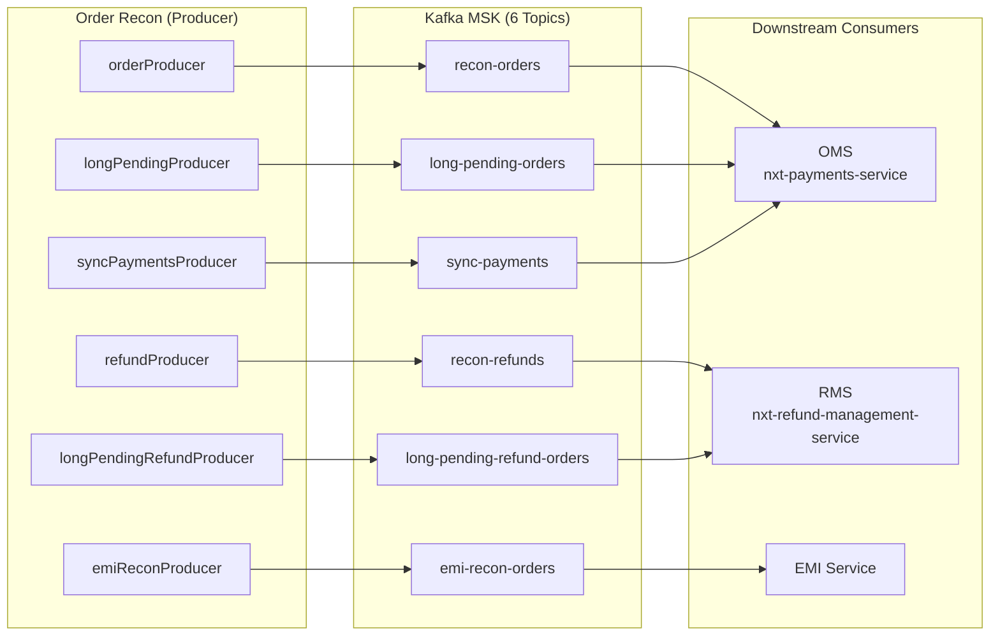
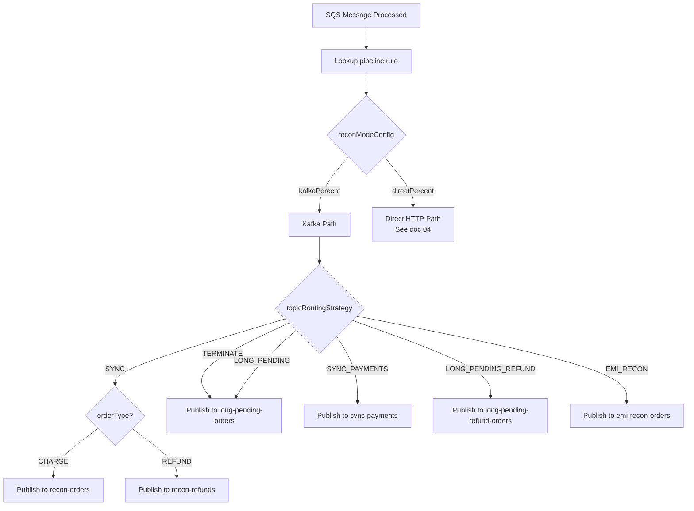
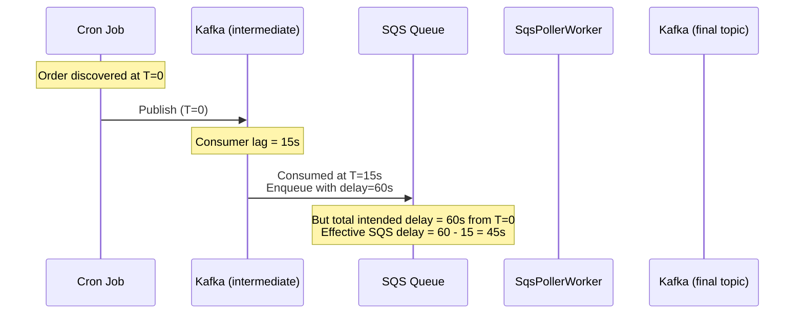
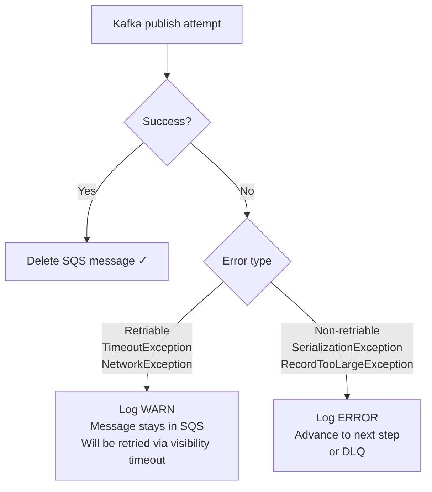

# 06 — Kafka Producer & Topic Routing

## Overview

The order-recon service is a **Kafka producer only** — it does not consume from any Kafka topics. After processing SQS messages, orders may be published to Kafka topics for downstream consumers to handle the actual reconciliation logic. This separation allows:

1. **Decoupling**: Recon discovery is independent of recon execution
2. **Fan-out**: Multiple downstream services can consume the same topic
3. **Backpressure**: Kafka provides natural buffering when downstream services are slow
4. **Gradual migration**: `kafkaPercent` vs `directPercent` enables safe rollout of direct recon

## Topic Architecture



## Topic Routing Strategy

Each pipeline rule specifies a `TopicRoutingStrategy` that determines which Kafka topic to publish to:

| Strategy | Kafka Topic | Use Case |
|----------|-------------|----------|
| `SYNC` | `recon-orders` (charge) or `recon-refunds` (refund) | Standard reconciliation — downstream queries acquirer |
| `TERMINATE` | `long-pending-orders` | Force-close charge orders beyond lifecycle threshold |
| `LONG_PENDING` | `long-pending-orders` | Same as TERMINATE (alias) |
| `SYNC_PAYMENTS` | `sync-payments` | Payment-level reconciliation (vs order-level) |
| `LONG_PENDING_REFUND` | `long-pending-refund-orders` | Force-close stuck refund orders |
| `EMI_RECON` | `emi-recon-orders` | EMI-specific reconciliation with interest validation |

### Routing Decision Flow



## Kafka Producer Configuration

### Producer Settings

```yaml
kafkaConfig:
  bootstrap_servers: "b-1.dappstream.eborq1.c3.kafka.ap-south-1.amazonaws.com:9098,b-2...,b-3..."
  producer:
    acks: "all"                          # Wait for all ISR replicas
    retries: 3
    retry_backoff_ms: 1000
    max_block_ms: 3000                   # Max time producer.send() blocks
    key_serializer: "ByteArraySerializer"
    value_serializer: "ByteArraySerializer"
    interceptor_classes: "io.opentelemetry.instrumentation.kafkaclients.v2_6.TracingProducerInterceptor"
```

### MSK IAM Authentication

```yaml
security:
  protocol: "SASL_SSL"
  sasl:
    mechanism: "AWS_MSK_IAM"
    jaas_config: "software.amazon.msk.auth.iam.IAMLoginModule required;"
    client_callback_handler: "software.amazon.msk.auth.iam.IAMClientCallbackHandler"
```

### KafkaEventProducer Implementation

```kotlin
class KafkaEventProducer(
    private val producer: KafkaProducer<ByteArray, ByteArray>,
    private val topic: String
) {
    suspend fun publish(order: Order): Either<ProducerError, RecordMetadata> {
        val key = order.id.toByteArray()
        val value = order.toByteArray()  // Protobuf serialization
        val record = ProducerRecord(topic, key, value)

        return try {
            val metadata = producer.send(record).get()
            metadata.right()
        } catch (e: Exception) {
            log.error("Kafka publish failed", e)
            ProducerError(e.message).left()
        }
    }
}
```

**Key**: `orderId` as bytes (ensures same order always goes to same partition → ordering)
**Value**: Full Protobuf `Order` object serialized to bytes

## Traffic Split: Kafka vs Direct

### reconModeConfig

Each pipeline rule has a `reconModeConfig` that controls what percentage of messages go to Kafka vs direct HTTP:

```yaml
reconModeConfig:
  kafkaPercent: 20    # 20% published to Kafka for downstream
  directPercent: 80   # 80% reconciled directly via HTTP
```

### Split Decision

```kotlin
fun determineReconPath(rule: ReconPipelineRule): ReconPath {
    val rand = Random.nextInt(100)  // 0-99
    return if (rand < rule.reconModeConfig.directPercent) {
        ReconPath.DIRECT
    } else {
        ReconPath.KAFKA
    }
}

enum class ReconPath {
    DIRECT,  // Call OMS/RMS directly
    KAFKA    // Publish to topic for downstream consumer
}
```

### Migration Pattern

The traffic split enables safe migration from Kafka-based recon to direct recon:

```
Phase 1: kafkaPercent=100, directPercent=0   (all Kafka, legacy)
Phase 2: kafkaPercent=80,  directPercent=20  (canary direct)
Phase 3: kafkaPercent=50,  directPercent=50  (50/50 split)
Phase 4: kafkaPercent=20,  directPercent=80  (mostly direct)
Phase 5: kafkaPercent=0,   directPercent=100 (full direct)
```

## Kafka Lag Compensation

When the reconModeConfig routes to Kafka, and the message originally came via Kafka (from cron → Kafka → SQS flow), there may be ingestion lag:



### DelayComputation.kt

```kotlin
object DelayComputation {
    fun computeEffectiveDelay(configuredDelay: Int, kafkaTimestamp: Long): Int {
        val lagMs = System.currentTimeMillis() - kafkaTimestamp
        val lagSeconds = (lagMs / 1000).toInt()
        val effectiveDelay = configuredDelay - lagSeconds
        return effectiveDelay.coerceIn(0, configuredDelay)
    }
}
```

**Guarantees**:
- Effective delay is never negative (floored at 0)
- Effective delay never exceeds configured delay (capped)
- If lag exceeds configured delay, message is processed immediately (delay=0)

## Message Serialization

### Protobuf Schema (from nxt-message-contracts)

Orders are serialized using the platform's shared Protobuf contract:

```protobuf
message Order {
    string id = 1;
    string merchant_id = 2;
    OrderType order_type = 3;
    OrderStatus order_status = 4;
    int64 amount = 5;
    string currency = 6;
    repeated Payment payments = 7;
    google.protobuf.Timestamp created_at = 8;
    google.protobuf.Timestamp updated_at = 9;
    map<string, string> metadata = 10;
}
```

### Serialization Flow

```mermaid
flowchart LR
    OHS[OHS Response<br/>JSON] --> PARSE[Parse to Protobuf<br/>Order object]
    PARSE --> SERIALIZE[.toByteArray()<br/>Protobuf binary]
    SERIALIZE --> RECORD[ProducerRecord<br/>key=orderId, value=bytes]
    RECORD --> KAFKA[Kafka Topic]
```

## Per-Producer Topic Mapping

| Producer Instance | Topic | Partition Key | Downstream Consumer |
|------------------|-------|---------------|-------------------|
| `orderProducer` | `recon-orders` | orderId | OMS (reconcile-payments flow) |
| `refundProducer` | `recon-refunds` | orderId | RMS (reconcile-refund flow) |
| `longPendingProducer` | `long-pending-orders` | orderId | OMS (force-close flow) |
| `longPendingRefundProducer` | `long-pending-refund-orders` | orderId | RMS (force-close-refund flow) |
| `syncPaymentsProducer` | `sync-payments` | orderId | OMS (payment-sync flow) |
| `emiReconProducer` | `emi-recon-orders` | orderId | EMI Service (plan validation) |

## Error Handling

### Publish Failures



### Producer Failure Modes

| Failure | Kafka Behavior | Recon Service Behavior |
|---------|---------------|----------------------|
| Broker unreachable | `max_block_ms=3000` timeout | Message returns to SQS (visibility timeout) |
| Topic not found | `UnknownTopicException` | Log error, advance step |
| Message too large | `RecordTooLargeException` | Log error, DLQ |
| ISR < min.insync | `NotEnoughReplicasException` | Retry (acks=all enforcement) |
| Auth failure | `SaslAuthenticationException` | Circuit breaker trigger |

## OpenTelemetry Integration

The `TracingProducerInterceptor` automatically:
1. Creates a span for each `producer.send()` call
2. Injects trace context into Kafka record headers
3. Links the produce span to the parent SQS processing span

This enables end-to-end distributed tracing:
```
Cron → OHS Query → Redis Dedup → SQS Enqueue → SQS Poll → Kafka Publish → Downstream Consumer
```

## Topic Retention & Configuration

| Topic | Partitions | Replication | Retention | Cleanup |
|-------|-----------|-------------|-----------|---------|
| `recon-orders` | 12 | 3 | 24h | delete |
| `recon-refunds` | 6 | 3 | 24h | delete |
| `long-pending-orders` | 6 | 3 | 48h | delete |
| `long-pending-refund-orders` | 3 | 3 | 48h | delete |
| `sync-payments` | 6 | 3 | 24h | delete |
| `emi-recon-orders` | 3 | 3 | 24h | delete |

**Partition count rationale**: Higher for `recon-orders` (highest volume) to support parallel consumption by OMS consumer group.
