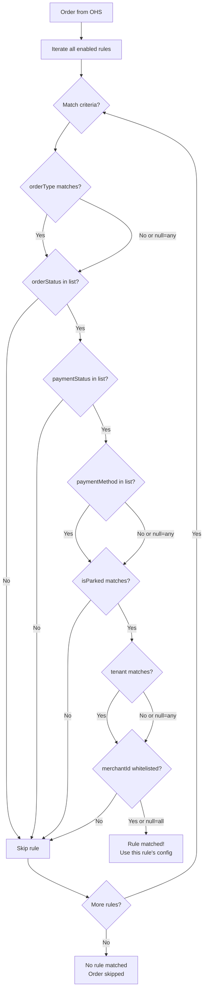

# 07 — Pipeline Rules & Configuration

## Overview

The reconciliation pipeline is driven by a **rule engine** that matches orders to processing behaviors. Rules are defined in YAML, loaded via Hoplite, and can be hot-updated via Kubernetes ConfigMap mounts without service restart.

## Rule Structure

```kotlin
data class ReconPipelineRule(
    val ruleId: String,                          // Unique identifier
    val enabled: Boolean,                        // Master switch
    val whitelistedMerchantIds: List<String>?,   // Null = all merchants, non-null = only these
    val matchCriteria: MatchCriteria,            // Order matching filters
    val queueName: String,                       // Target SQS queue
    val steps: List<PipelineStep>,               // Delay steps
    val topicRoutingStrategy: TopicRoutingStrategy,
    val directReconStrategy: DirectReconStrategy?,
    val reconModeConfig: ReconModeConfig,        // Kafka vs Direct split
    val dedupTtlSeconds: Long                    // Redis dedup TTL
)

data class MatchCriteria(
    val orderType: String?,                // CHARGE | REFUND | null (any)
    val orderStatus: List<String>?,        // Matches any in list
    val paymentStatus: List<String>?,      // Matches any in list
    val paymentMethod: List<String>?,      // CARD | UPI | NETBANKING | ...
    val isParked: Boolean?,                // true | false | null (any)
    val parkedReason: String?,             // AGGREGATOR_SALE_CHECK_FAILURE | ACQUIRER_DECLINE
    val tenant: String?,                   // PAY_BY_LINK | null
    val isForceCancelled: Boolean?         // true | false | null
)

data class PipelineStep(
    val stepIndex: Int,
    val delaySeconds: Int                  // 0-43200 (0s to 12h)
)

data class ReconModeConfig(
    val kafkaPercent: Int,                  // 0-100
    val directPercent: Int                  // 0-100 (must sum to 100)
)

enum class TopicRoutingStrategy {
    SYNC,                // recon-orders / recon-refunds
    TERMINATE,           // long-pending-orders
    LONG_PENDING,        // long-pending-orders (alias)
    SYNC_PAYMENTS,       // sync-payments
    LONG_PENDING_REFUND  // long-pending-refund-orders
}

enum class DirectReconStrategy {
    OMS_RECONCILE_PAYMENTS,
    RMS_RECONCILE_REFUND,
    OMS_TERMINATE_ORDER,
    CYBS_RISK_DECISION
}
```

## Rule Matching Algorithm



**First match wins** — rules are evaluated in order, and the first matching rule is used.

## Example Rules (13 rules in dev)

### Rule 1: AUTHZ_RECON (Authorized payments)

```yaml
- ruleId: "AUTHZ_RECON"
  enabled: true
  whitelistedMerchantIds: null  # All merchants
  matchCriteria:
    orderType: "CHARGE"
    orderStatus: ["PENDING", "CANCEL_REQUESTED"]
    paymentStatus: ["AUTHENTICATED"]
    paymentMethod: null  # All methods
  queueName: "authz"
  steps:
    - { stepIndex: 0, delaySeconds: 30 }
    - { stepIndex: 1, delaySeconds: 60 }
    - { stepIndex: 2, delaySeconds: 120 }
    - { stepIndex: 3, delaySeconds: 300 }
    - { stepIndex: 4, delaySeconds: 600 }
    - { stepIndex: 5, delaySeconds: 900 }
  topicRoutingStrategy: SYNC
  directReconStrategy: OMS_RECONCILE_PAYMENTS
  reconModeConfig:
    kafkaPercent: 20
    directPercent: 80
  dedupTtlSeconds: 86460
```

### Rule 2: AUTHN_CARD_RECON (Card 3DS challenged)

```yaml
- ruleId: "AUTHN_CARD_RECON"
  enabled: true
  matchCriteria:
    orderType: "CHARGE"
    orderStatus: ["PENDING", "CANCEL_REQUESTED"]
    paymentStatus: ["AUTHENTICATION_CHALLENGED"]
    paymentMethod: ["CARD", "EMI"]
  queueName: "authn"
  steps:
    - { stepIndex: 0, delaySeconds: 120 }
    - { stepIndex: 1, delaySeconds: 300 }
    - { stepIndex: 2, delaySeconds: 600 }
    - { stepIndex: 3, delaySeconds: 900 }
  topicRoutingStrategy: SYNC
  directReconStrategy: OMS_RECONCILE_PAYMENTS
  reconModeConfig:
    kafkaPercent: 30
    directPercent: 70
  dedupTtlSeconds: 86460
```

### Rule 3: AUTHC_UPI_RECON (UPI challenged)

```yaml
- ruleId: "AUTHC_UPI_RECON"
  enabled: true
  matchCriteria:
    orderType: "CHARGE"
    orderStatus: ["PENDING", "CANCEL_REQUESTED"]
    paymentStatus: ["AUTHENTICATION_CHALLENGED"]
    paymentMethod: ["UPI"]
  queueName: "authc"
  steps:
    - { stepIndex: 0, delaySeconds: 60 }
    - { stepIndex: 1, delaySeconds: 120 }
    - { stepIndex: 2, delaySeconds: 300 }
    - { stepIndex: 3, delaySeconds: 600 }
  topicRoutingStrategy: SYNC
  directReconStrategy: OMS_RECONCILE_PAYMENTS
  reconModeConfig:
    kafkaPercent: 20
    directPercent: 80
  dedupTtlSeconds: 86460
```

### Rule 4: REFUND_RECON

```yaml
- ruleId: "REFUND_RECON"
  enabled: true
  matchCriteria:
    orderType: "REFUND"
    orderStatus: ["PENDING"]
    paymentStatus: ["CAPTURE_REQUESTED"]
  queueName: "refund"
  steps:
    - { stepIndex: 0, delaySeconds: 60 }
    - { stepIndex: 1, delaySeconds: 120 }
    - { stepIndex: 2, delaySeconds: 300 }
    - { stepIndex: 3, delaySeconds: 600 }
    - { stepIndex: 4, delaySeconds: 900 }
  topicRoutingStrategy: SYNC
  directReconStrategy: RMS_RECONCILE_REFUND
  reconModeConfig:
    kafkaPercent: 30
    directPercent: 70
  dedupTtlSeconds: 86460
```

### Rule 5: CAPTURE_VOID_RECON

```yaml
- ruleId: "CAPTURE_VOID_RECON"
  enabled: true
  matchCriteria:
    orderType: "CHARGE"
    paymentStatus: ["CAPTURE_REQUESTED", "CANCEL_REQUESTED"]
    isForceCancelled: false
  queueName: "capture-void"
  steps:
    - { stepIndex: 0, delaySeconds: 120 }
    - { stepIndex: 1, delaySeconds: 300 }
    - { stepIndex: 2, delaySeconds: 600 }
    - { stepIndex: 3, delaySeconds: 900 }
  topicRoutingStrategy: SYNC
  directReconStrategy: OMS_RECONCILE_PAYMENTS
  reconModeConfig:
    kafkaPercent: 20
    directPercent: 80
  dedupTtlSeconds: 86460
```

### Rule 6: LONG_PENDING_TERMINATE

```yaml
- ruleId: "LONG_PENDING_TERMINATE"
  enabled: true
  matchCriteria:
    orderType: "CHARGE"
    orderStatus: ["ATTEMPTED", "PENDING", "CANCEL_REQUESTED"]
    paymentStatus: ["INITIATED", "AUTHENTICATED", "AUTHENTICATION_CHALLENGED",
                    "CANCEL_REQUESTED", "CANCELLED", "FAILED"]
  queueName: "terminate"
  steps:
    - { stepIndex: 0, delaySeconds: 1800 }   # 30 min
    - { stepIndex: 1, delaySeconds: 3600 }   # 1 hour
    - { stepIndex: 2, delaySeconds: 7200 }   # 2 hours
  topicRoutingStrategy: TERMINATE
  directReconStrategy: OMS_TERMINATE_ORDER
  reconModeConfig:
    kafkaPercent: 50
    directPercent: 50
  dedupTtlSeconds: 86460
```

### Rule 7: PAYMENT_CANCEL_RECON

```yaml
- ruleId: "PAYMENT_CANCEL_RECON"
  enabled: true
  matchCriteria:
    paymentStatus: ["CANCEL_REQUESTED"]
    isForceCancelled: true
  queueName: "default"
  steps:
    - { stepIndex: 0, delaySeconds: 60 }
    - { stepIndex: 1, delaySeconds: 120 }
    - { stepIndex: 2, delaySeconds: 300 }
  topicRoutingStrategy: SYNC
  directReconStrategy: OMS_RECONCILE_PAYMENTS
  reconModeConfig:
    kafkaPercent: 100
    directPercent: 0
  dedupTtlSeconds: 86460
```

### Rule 8: CYBS_RISK_DECISION

```yaml
- ruleId: "CYBS_RISK_DECISION"
  enabled: true
  matchCriteria:
    orderType: "CHARGE"
    # Matched programmatically when riskStatus=PENDING_REVIEW in acquirerDetails
  queueName: "cybs-decision-action"
  steps:
    - { stepIndex: 0, delaySeconds: 300 }
    - { stepIndex: 1, delaySeconds: 600 }
    - { stepIndex: 2, delaySeconds: 900 }
  topicRoutingStrategy: SYNC
  directReconStrategy: CYBS_RISK_DECISION
  reconModeConfig:
    kafkaPercent: 0
    directPercent: 100
  dedupTtlSeconds: 3600
```

## Configuration Loading

### Hoplite Config Merge

```mermaid
flowchart LR
    subgraph "Config Sources (priority order)"
        ENV[Environment Variables<br/>Highest priority]
        CM[ConfigMap Mount<br/>/config/recon-pipeline-rules.yaml]
        APP[application.yaml<br/>Lowest priority]
    end

    subgraph "Hoplite Loader"
        MERGE[ConfigLoaderBuilder<br/>addSource(env)<br/>addSource(file)<br/>addSource(resource)]
    end

    subgraph "Result"
        CONFIG[AppConfig]
    end

    ENV --> MERGE
    CM --> MERGE
    APP --> MERGE
    MERGE --> CONFIG
```

### Environment Variable Mapping

Hoplite uses `__` (double underscore) as a path separator:

```bash
# Example: Override Kafka bootstrap servers
kafkaConfig__bootstrap_servers="new-broker:9098"

# Example: Disable a specific rule
reconPipelineConfig__rules__0__enabled="false"

# Example: Change direct percent for rule 0
reconPipelineConfig__rules__0__reconModeConfig__directPercent="100"
```

### ConfigMap Mount (Kubernetes)

```yaml
# K8s Deployment
volumes:
  - name: recon-pipeline-config
    configMap:
      name: recon-pipeline-rules
volumeMounts:
  - name: recon-pipeline-config
    mountPath: /config
    readOnly: true
```

This allows ops to update pipeline rules by editing the ConfigMap and restarting pods (rolling restart).

## Feature Flags

### Global Toggles

| Flag | Config Path | Default | Effect |
|------|-------------|---------|--------|
| `pollerEnabled` | `reconPipelineConfig.pollerEnabled` | true | Master switch for all SQS pollers |
| `scrollEnabled` | `filterScrollConfig.enabled` | "1" | Use scroll API vs pagination |
| `orderTerminationEnabled` | `orderTerminationConfig.enabled` | true | Allow force-termination |
| `skipAlreadyReconciled` | `emi_recon.skip_already_reconciled` | true | Skip EMI orders already processed |

### Per-Rule Toggles

```yaml
rules:
  - ruleId: "AUTHZ_RECON"
    enabled: true                              # Rule-level enable/disable
    whitelistedMerchantIds: null               # null = all merchants
    # whitelistedMerchantIds: ["M001", "M002"] # Only these merchants
```

### Per-Cron Toggles

```yaml
cronJobs:
  authz:
    enabled: true
    cronExpression: "0 */2 * * * *"   # Every 2 minutes
  authn:
    enabled: true
    cronExpression: "0 */3 * * * *"   # Every 3 minutes
  longPending:
    enabled: false                     # Disabled (migrated to SQS-only)
```

## Merchant Rollout Strategy

### Progressive Rollout

```mermaid
flowchart TD
    PHASE1[Phase 1: Whitelist 3 test merchants] --> MONITOR1[Monitor 24h]
    MONITOR1 --> PHASE2[Phase 2: Whitelist 20 merchants<br/>+ increase directPercent to 50%]
    PHASE2 --> MONITOR2[Monitor 48h]
    MONITOR2 --> PHASE3[Phase 3: Remove whitelist (all merchants)<br/>directPercent=80%]
    PHASE3 --> MONITOR3[Monitor 72h]
    MONITOR3 --> PHASE4[Phase 4: directPercent=100%<br/>Fully migrated]
```

### Whitelist Mechanics

```kotlin
fun isRuleApplicable(rule: ReconPipelineRule, order: Order): Boolean {
    if (!rule.enabled) return false

    // Merchant whitelist check
    if (rule.whitelistedMerchantIds != null) {
        if (order.merchantId !in rule.whitelistedMerchantIds) return false
    }

    // Match criteria check
    return matchesCriteria(rule.matchCriteria, order)
}
```

## Dedup Configuration

### Per-Rule TTL

```yaml
# Standard recon rules
dedupTtlSeconds: 86460  # 24h + 60s buffer

# Short-lived rules (CyberSource)
dedupTtlSeconds: 3600   # 1 hour (faster retry cycle)
```

### Redis Key Pattern

```
dedup:{orderId}:{ruleId}

Examples:
  dedup:ord_abc123:AUTHZ_RECON
  dedup:ord_def456:REFUND_RECON
  dedup:ord_ghi789:CYBS_RISK_DECISION
```

## Pagination Configuration

Per-scenario max pages (legacy pagination mode):

```yaml
paginationConfig:
  AUTHZ: 10
  AUTHN: 5
  AUTHC_UPI: 5
  AUTHC_NETBANKING: 5
  AUTHC_WALLET: 5
  AUTHC_BNPL: 5
  REFUND: 10
  CAPTURE_VOID: 5
  LONG_PENDING: 20
  LONG_PENDING_CREATED: 10
  PAYMENT_CANCEL: 5
  DATA_MASKING: 50
  EMI_RECON: 10
```

## Full Application Configuration Structure

```yaml
# application.yaml (simplified)
ktor:
  deployment:
    port: 8080

# HTTP Clients
clients:
  oms:
    baseUrl: "http://nxt-payments-service-svc..."
    timeouts:
      request: 10000
      connect: 2000
      socket: 10000
    circuitBreaker:
      maxFailures: 200
      resetTimeout: 10000
      backoffFactor: 1.2
      maxResetTimeout: 60000
  orderHistory:
    baseUrl: "http://nxt-order-history-service-svc..."
  rms:
    baseUrl: "http://nxt-refund-management-service-svc..."
  # ... more clients

# SQS Configuration
sqsConfig:
  region: "ap-south-1"
  queues:
    - name: "default"
      url: "https://sqs.ap-south-1.amazonaws.com/.../recon-sqs-dev"
      dlqUrl: "https://sqs.ap-south-1.amazonaws.com/.../recon-sqs-dev-dlq"
      concurrency: 10
    # ... more queues
  longPollWaitTimeSeconds: 20
  maxNumberOfMessages: 10
  processorMultiplier: 2

# Kafka
kafkaConfig:
  bootstrap_servers: "b-1...:9098,b-2...:9098,b-3...:9098"
  topics:
    order: "recon-orders"
    refund: "recon-refunds"
    longPending: "long-pending-orders"
    longPendingRefund: "long-pending-refund-orders"
    syncPayments: "sync-payments"
    emiRecon: "emi-recon-orders"

# Redis
redisConfig:
  host: "dev-common-redis.oiu4us.0001.aps1.cache.amazonaws.com"
  port: 6379
  pool:
    maxTotal: 100
    maxIdle: 50
    minIdle: 20
  timeouts:
    connection: 2000
    socket: 2000

# Pipeline Rules (mounted from ConfigMap)
reconPipelineConfig:
  pollerEnabled: true
  rules: [...]  # See rules above

# Feature Flags
filterScrollConfig:
  enabled: "1"
orderTerminationConfig:
  enabled: true
```

## Observability for Config Changes

When rules are updated:
1. Service logs all loaded rules at startup with `ruleId`, `enabled`, `directPercent`
2. Rule match/miss metrics tagged with `ruleId`
3. Config hash exposed via `/health/ready` metadata for verification

```
GET /health/ready
{
  "status": "UP",
  "configHash": "abc123def",
  "rulesLoaded": 13,
  "pollersActive": 10
}
```
