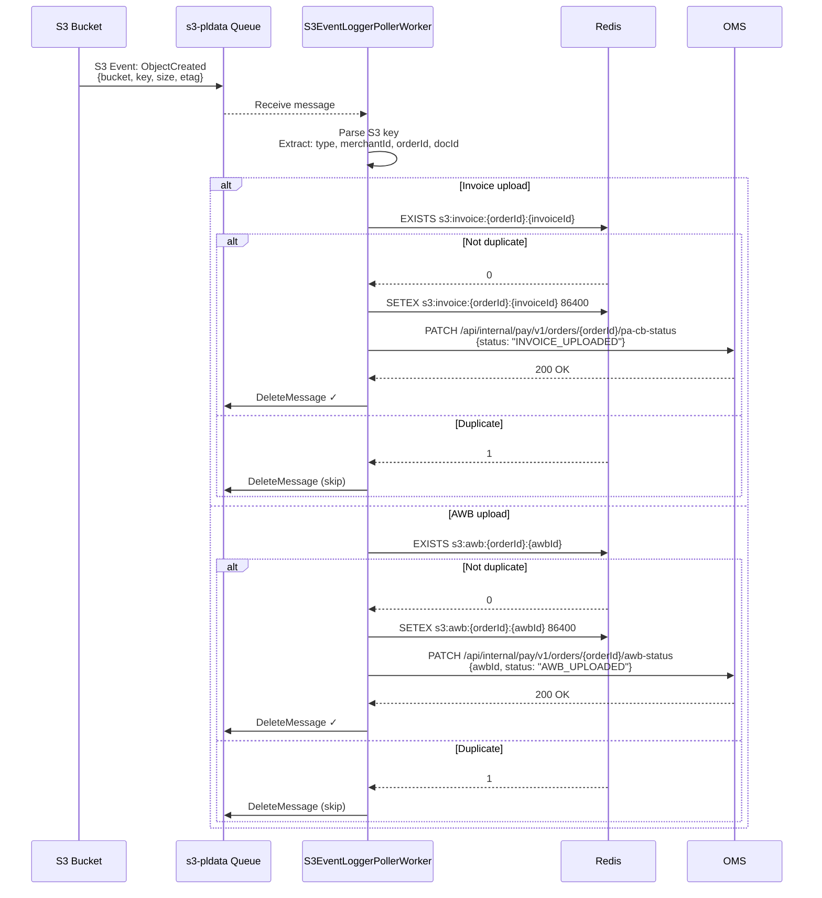
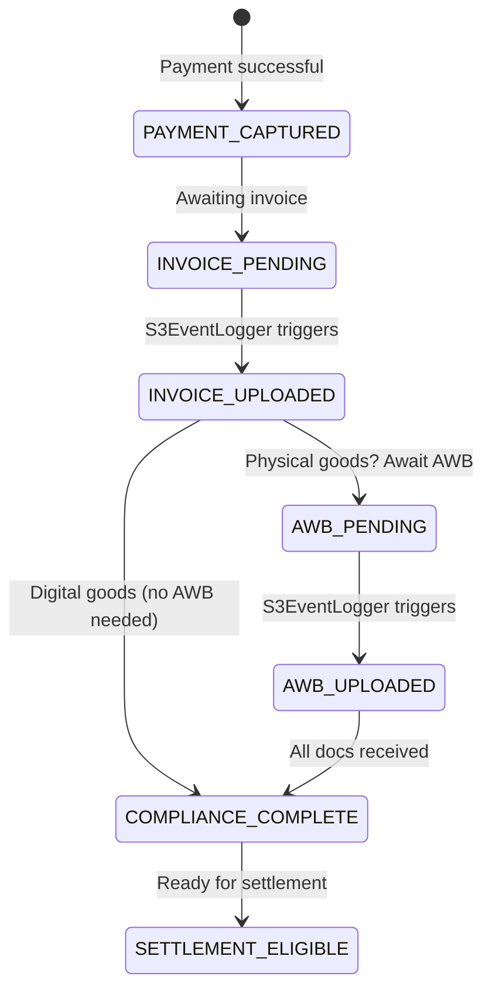
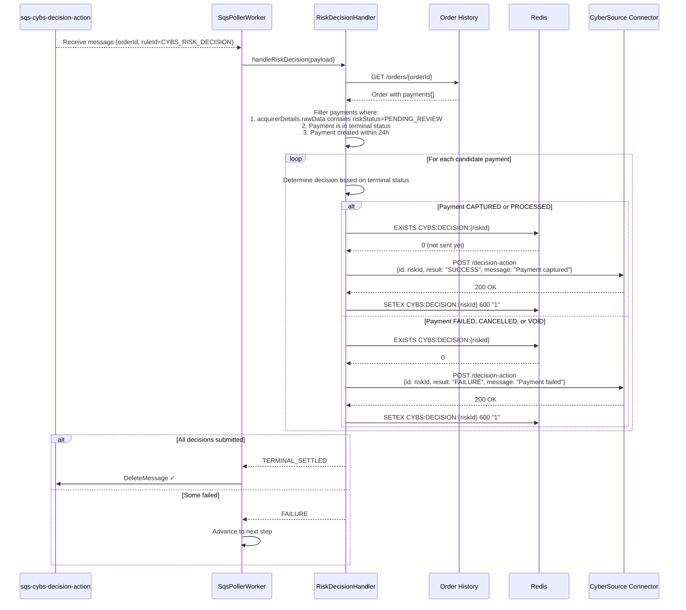
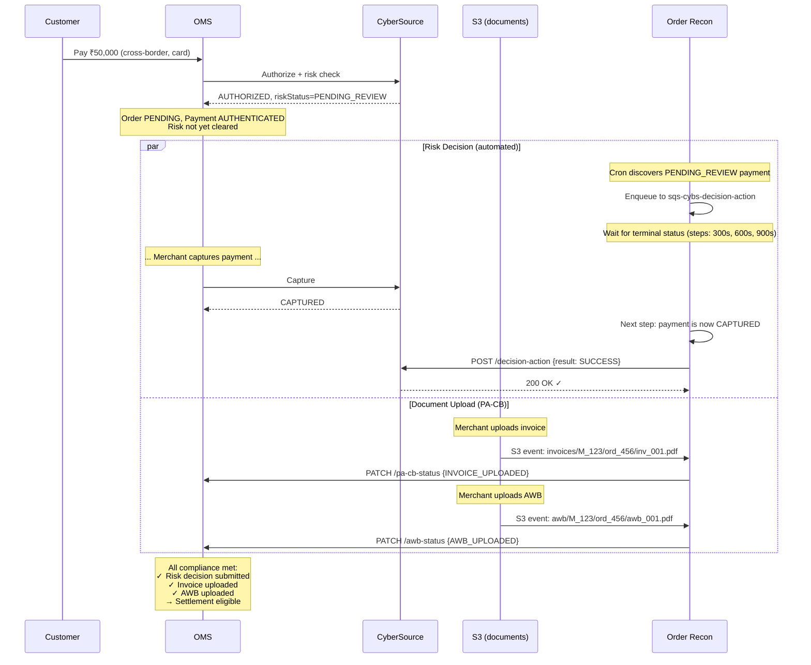

# 08 — Cross-Border & Risk Decision

## Overview

The order-recon service handles two specialized workflows beyond standard payment reconciliation:

1. **Cross-Border Document Processing (PA-CB)** — Processing S3 event notifications for invoice and AWB (Air Waybill) uploads in cross-border transactions
2. **CyberSource Risk Decision** — Automatically submitting accept/reject decisions for payments in `PENDING_REVIEW` risk status

Both use dedicated SQS queues with specialized poller workers.

---

## Cross-Border Document Processing

### Context: PA-CB (Payment Aggregator — Cross Border)

Under RBI regulations, cross-border payments require:
- **Invoice upload** — Proof of goods/services for the transaction
- **AWB upload** — Shipping tracking document for physical goods

Merchants upload these documents to S3, which triggers notifications to the recon service for status updates.

### Architecture

```mermaid
graph TB
    subgraph "Merchant"
        UPLOAD[Merchant uploads<br/>Invoice/AWB to S3]
    end

    subgraph "AWS"
        S3[S3 Bucket<br/>pldata]
        SNS[S3 Event → SQS]
        SQS_S3[s3-pldata queue]
    end

    subgraph "Order Recon"
        S3_POLLER[S3EventLoggerPollerWorker]
        PARSER[S3 Key Parser]
    end

    subgraph "OMS"
        PA_CB[PA-CB Status Endpoint<br/>PATCH /orders/{orderId}]
        AWB[AWB Status Endpoint<br/>PATCH /orders/{orderId}/awb]
    end

    subgraph "Redis"
        DEDUP[Dedup Keys<br/>s3:{orderId}:{docId}]
    end

    UPLOAD --> S3
    S3 -->|Event notification| SNS --> SQS_S3
    SQS_S3 --> S3_POLLER
    S3_POLLER --> PARSER
    PARSER --> DEDUP
    DEDUP --> PA_CB
    DEDUP --> AWB
```

### S3 Object Key Format

Documents are stored with structured keys:

```
invoices/{merchantId}/{orderId}/{invoiceId}.{ext}
awb/{merchantId}/{orderId}/{awbId}.{ext}
```

**Examples**:
```
invoices/M_12345/ord_abc123/inv_001.pdf
invoices/M_12345/ord_abc123/inv_002.jpg
awb/M_12345/ord_abc123/awb_shipping_label.pdf
```

### Processing Workflow



### Error Handling

| Error | Action |
|-------|--------|
| Malformed S3 key (can't parse) | Log error, delete message |
| OMS returns 404 (order not found) | Delete message (stale order) |
| OMS returns 409 (already in target state) | Delete message (idempotent) |
| OMS returns 5xx | Re-enqueue with 5min visibility timeout |
| Redis failure | Process anyway (accept rare duplicates) |

### PA-CB State Machine Impact

When OMS receives the status update, it advances the cross-border compliance state:



---

## CyberSource Risk Decision

### Context

CyberSource Decision Manager evaluates transactions for fraud risk. Some transactions are placed in `PENDING_REVIEW` status — they are neither accepted nor rejected automatically. A human reviewer (or automated system) must submit a final decision.

The recon service automates this: once a payment reaches a terminal state (CAPTURED or FAILED), it submits the corresponding decision to CyberSource.

### Architecture

```mermaid
graph TB
    subgraph "Discovery"
        CRON[Cron: Discover orders with<br/>riskStatus=PENDING_REVIEW]
        SQS_SEND[Enqueue to sqs-cybs-decision-action]
    end

    subgraph "Processing"
        POLLER[SqsPollerWorker]
        HANDLER[RiskDecisionHandler]
    end

    subgraph "External"
        OHS[Order History Service<br/>Get current order state]
        CYBS[CyberSource Connector<br/>POST /decision-action]
        REDIS[Redis Dedup<br/>CYBS:DECISION:{riskId}]
    end

    CRON --> SQS_SEND
    SQS_SEND --> POLLER
    POLLER --> HANDLER
    HANDLER --> OHS
    HANDLER --> REDIS
    HANDLER --> CYBS
```

### RiskDecisionHandler Workflow



### Decision Mapping Table

| Payment Terminal Status | CyberSource Decision | Decision Message |
|------------------------|---------------------|-----------------|
| `CAPTURED` | `SUCCESS` | "Payment captured successfully" |
| `PROCESSED` | `SUCCESS` | "Payment processed successfully" |
| `FAILED` | `FAILURE` | "Payment failed" |
| `CANCELLED` | `FAILURE` | "Payment cancelled" |
| `VOID` | `FAILURE` | "Payment voided" |

### Candidate Selection Criteria

A payment is eligible for risk decision submission when ALL of:
1. `acquirerDetails.rawData` contains a `riskId` field
2. `riskStatus` in rawData equals `PENDING_REVIEW`
3. Payment is in a **terminal** status (CAPTURED/PROCESSED/FAILED/CANCELLED/VOID)
4. Payment `createdAt` is within the last **24 hours**

```kotlin
fun findCandidatePayments(order: Order): List<RiskDecisionCandidate> {
    return order.payments.filter { payment ->
        val rawData = payment.acquirerDetails?.rawData ?: return@filter false
        val riskId = rawData["riskId"] ?: return@filter false
        val riskStatus = rawData["riskStatus"]

        riskStatus == "PENDING_REVIEW"
            && payment.paymentStatus in terminalStatuses
            && payment.createdAt.isAfter(Instant.now().minus(24, ChronoUnit.HOURS))
    }.map { payment ->
        RiskDecisionCandidate(
            riskId = payment.acquirerDetails!!.rawData["riskId"]!!,
            paymentStatus = payment.paymentStatus,
            decision = mapToDecision(payment.paymentStatus)
        )
    }
}
```

### Dedup Strategy

| Key Pattern | TTL | Rationale |
|-------------|-----|-----------|
| `CYBS:DECISION:{riskId}` | 600s (10 min) | Short TTL because decisions are idempotent at CyberSource; we want faster retry on transient failures |

**Why 10 min vs 24h?**
- CyberSource `/decision-action` is idempotent — submitting same decision twice is harmless
- Shorter TTL means if a message is re-processed (e.g., SQS retry), it will attempt the API call again after 10 min
- This is acceptable because the API is idempotent and we prefer liveness over strict dedup

### Error Scenarios

```mermaid
flowchart TD
    START[RiskDecisionHandler] --> OHS_CALL{OHS returns order?}

    OHS_CALL -->|404| DELETE[Delete message<br/>Order not found/deleted]
    OHS_CALL -->|5xx| RETRY_STEP[Advance step / retry]
    OHS_CALL -->|200| CANDIDATES{Any candidate payments?}

    CANDIDATES -->|None| DELETE_NO_CANDIDATES[Delete message<br/>No eligible payments<br/>(all non-terminal or >24h old)]

    CANDIDATES -->|Found| PROCESS_LOOP[Process each candidate]
    PROCESS_LOOP --> CYBS_CALL{CyberSource call}

    CYBS_CALL -->|200 OK| NEXT_CANDIDATE[Next candidate]
    CYBS_CALL -->|401 Auth| CIRCUIT[Circuit breaker counts failure]
    CYBS_CALL -->|5xx| PARTIAL_FAIL[Mark as FAILURE<br/>Will retry next step]
    CYBS_CALL -->|Timeout| PARTIAL_FAIL

    NEXT_CANDIDATE --> ALL_DONE{All processed?}
    ALL_DONE -->|Yes| TERMINAL[Return TERMINAL_SETTLED]
    ALL_DONE -->|No| PROCESS_LOOP
```

### CyberSource Connector Client

```kotlin
class CybsCardConnectorClient(
    private val httpClient: HttpClient,
    private val circuitBreaker: CircuitBreaker
) {
    suspend fun sendDecisionAction(request: DecisionActionRequest): Either<ClientError, Unit> {
        return circuitBreaker.protectOrElse(
            fa = {
                httpClient.post("/connectors/cybs/v1/cards/decision-action") {
                    setBody(request)
                    contentType(ContentType.Application.Json)
                }
                Unit.right()
            },
            orElse = { ClientError("CyberSource circuit open").left() }
        )
    }
}

data class DecisionActionRequest(
    val id: String,        // CyberSource riskId
    val result: String,    // "SUCCESS" | "FAILURE"
    val message: String    // Human-readable reason
)
```

---

## Combined Timeline: Cross-Border Order with Risk Review



---

## Monitoring & Alerts

### Cross-Border (S3EventLogger)

| Metric | Labels | Alert Condition |
|--------|--------|-----------------|
| `s3_event.processed` | eventType (invoice/awb) | — |
| `s3_event.parse_failure` | — | > 10/hour → investigate S3 key format |
| `s3_event.oms_update_failure` | statusCode | 5xx > 5/min → OMS health check |
| `s3_event.dedup_hit` | eventType | High rate → possible S3 event replay |

### CyberSource Risk Decision

| Metric | Labels | Alert Condition |
|--------|--------|-----------------|
| `cybs_decision.submitted` | decision (SUCCESS/FAILURE) | — |
| `cybs_decision.api_failure` | statusCode | > 5/min → CyberSource connectivity |
| `cybs_decision.no_candidates` | — | High rate → timing/filter issue |
| `cybs_decision.circuit_open` | — | Immediate P1 → CyberSource down |
| `cybs_decision.dedup_hit` | — | Expected (10min TTL, normal re-polls) |
