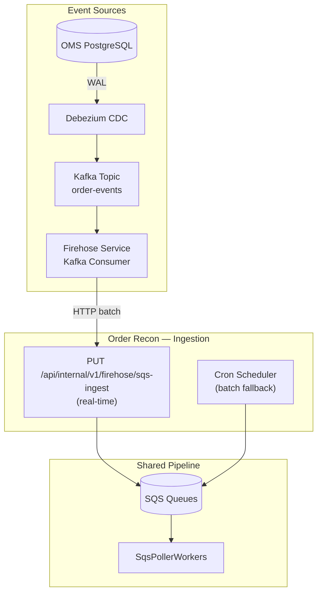
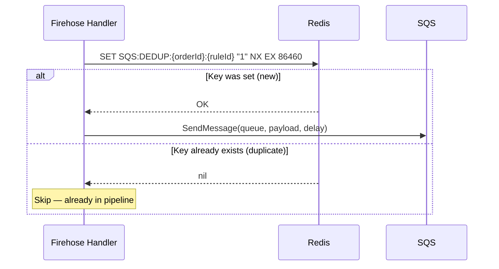
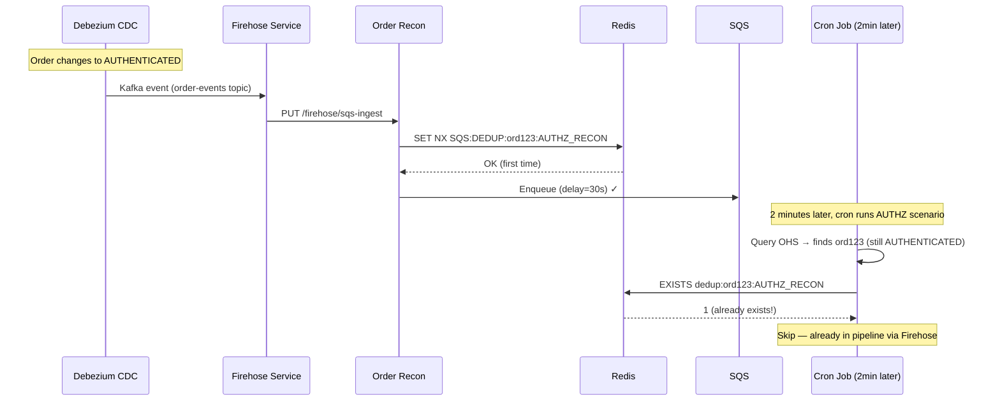

# 09 — Firehose Real-Time Ingestion

## Overview

The Firehose path is the **primary real-time ingestion route** into the reconciliation pipeline. Unlike cron-based discovery (which batch-queries OHS every N minutes), the Firehose endpoint receives events **immediately** when order/payment state changes, enabling sub-second pipeline entry.

**This is architecturally critical**: The service has TWO ingestion modes that feed the same SQS pipeline:

| Mode | Trigger | Latency | Volume | Use Case |
|------|---------|---------|--------|----------|
| **Firehose** (real-time) | CDC event via Kafka → HTTP push | < 1 second | High (every state change) | Immediate reconciliation entry |
| **Cron** (batch) | Scheduled OHS queries | 2-15 minutes | Medium (pending orders only) | Catch-up / safety net |



## Endpoint Specification

```
PUT /api/internal/v1/firehose/sqs-ingest
Content-Type: application/json

Request Body:
{
  "events": [
    {
      "payload": "<base64-encoded Protobuf Order>",
      "timestamp": 1706745600000,     // Kafka message timestamp
      "topic": "order-events",
      "partition": 3,
      "offset": 1234567
    }
  ]
}

Response: 200 OK
{
  "processed": 45,
  "skipped": 5,
  "errors": 0
}
```

## Processing Logic

### Multi-Payment Rule Matching

Each order may have multiple payments, and each payment may match different pipeline rules. The Firehose endpoint evaluates ALL payments against ALL enabled rules:

```mermaid
flowchart TD
    EVENT[Firehose Event<br/>Protobuf Order] --> DECODE[Base64 decode → Protobuf parse]
    DECODE --> TERMINAL_CHECK{Order in terminal state?}

    TERMINAL_CHECK -->|Yes (PROCESSED/FAILED)| SKIP[Skip - already terminal]
    TERMINAL_CHECK -->|No| PAYMENTS[Iterate all payments]

    PAYMENTS --> PAY_LOOP[For each payment]
    PAY_LOOP --> RULES[For each enabled rule]

    RULES --> MATCH{Payment matches<br/>rule criteria?}
    MATCH -->|No| NEXT_RULE[Next rule]
    MATCH -->|Yes| DEDUP_RULE{Already matched<br/>this ruleId for order?}

    DEDUP_RULE -->|Yes| NEXT_RULE
    DEDUP_RULE -->|No| COLLECT[Add to matches<br/>First payment wins per rule]

    COLLECT --> NEXT_PAYMENT[Next payment]
    NEXT_PAYMENT --> ENQUEUE_ALL[Enqueue all unique rule matches to SQS]
```

**Key rule**: One order can match MULTIPLE rules (e.g., one payment matches AUTHZ_RECON, another matches CYBS_RISK_DECISION), but each rule can only match ONCE per order (first matching payment wins).

### Redis Dedup (Atomic SET NX EX)



**Fail-open guarantee**: If Redis is unreachable or circuit is open, the event is enqueued anyway (accepting rare duplicates over lost events):

```kotlin
val dedupResult = redisClient.setIfAbsent(
    key = "SQS:DEDUP:${order.id}:${rule.ruleId}",
    value = "1",
    ttlSeconds = rule.dedupTtlSeconds
)

// Fail-open: if Redis fails, proceed with enqueue
if (dedupResult == null || dedupResult == true) {
    sqsProducer.send(queue, payload, delay)
}
```

### Zero-Payment Order Termination

Orders from whitelisted merchants that have 0 payments are auto-terminated:

```mermaid
flowchart TD
    ORDER[Order received] --> PAYMENTS_CHECK{payments.isEmpty()?}
    PAYMENTS_CHECK -->|No| NORMAL[Normal rule matching]
    PAYMENTS_CHECK -->|Yes| MERCHANT_CHECK{Merchant in<br/>termination whitelist?}

    MERCHANT_CHECK -->|No| SKIP2[Skip]
    MERCHANT_CHECK -->|Yes| MERCHANT_API[Call Merchant Service<br/>GET authActionTimeInSec]

    MERCHANT_API --> DELAY_CALC[delay = max(authActionTime, minDelay)<br/>Apply Kafka lag compensation]
    DELAY_CALC --> ENQUEUE_TERM[Enqueue to TERMINATE queue<br/>with computed delay]
```

This handles orders where the merchant's checkout session was created but the customer never initiated a payment attempt. After the merchant's configured auth-action timeout, the order is terminated.

### CYBS Risk Decision Pre-Check

For `CYBS_RISK_DECISION` rules, the Firehose handler performs an additional check before enqueueing:

```kotlin
if (rule.directReconStrategy == CYBS_RISK_DECISION) {
    val hasRiskId = order.payments.any { payment ->
        payment.acquirerDetails?.rawData?.containsKey("riskId") == true
    }
    if (!hasRiskId) continue  // Skip — no risk review pending
}
```

This avoids enqueueing messages that would immediately be skipped by the RiskDecisionHandler.

### Kafka Lag Compensation in Firehose

```kotlin
val kafkaTimestamp = event.timestamp  // When original event was produced
val configuredDelay = rule.steps[0].delaySeconds
val effectiveDelay = DelayComputation.computeEffectiveDelay(configuredDelay, kafkaTimestamp)

// If Kafka consumer had 10s lag, and configured delay is 30s:
// effectiveDelay = 30 - 10 = 20s (message spends less time in SQS)
```

### Tenant ID Extraction

Pipeline rules can filter by tenant. The Firehose handler extracts tenant from order metadata:

```kotlin
val tenantId = order.metadata["tenant_id"]
    ?: order.merchantMetadata?.get("tenant_id")

// Used in rule matching:
if (rule.matchCriteria.tenant != null && rule.matchCriteria.tenant != tenantId) {
    continue  // Rule doesn't apply to this tenant
}
```

## Firehose vs Cron: Interaction

Both paths feed the same SQS queues, so dedup prevents double-processing:



**Result**: Firehose provides immediate entry; cron serves as safety net for:
- Events missed during Firehose downtime
- Events where Redis dedup expired but order is still pending
- Scenarios not covered by Firehose rules

## Error Handling

| Error | Behavior | Rationale |
|-------|----------|-----------|
| Invalid base64 payload | Skip event, log error | Don't block batch |
| Protobuf parse failure | Skip event, log error | Corrupted message |
| Redis unavailable | Enqueue anyway (fail-open) | Prefer duplicates over lost events |
| SQS send failure | Log error, continue batch | Individual failures don't block others |
| Merchant Service timeout | Use default min delay | Don't block termination |

## Performance Characteristics

| Metric | Value |
|--------|-------|
| Batch size (typical) | 10-100 events per request |
| Processing time | < 50ms per event (excluding network) |
| Redis operations per event | 1-3 (one per matching rule) |
| SQS operations per event | 0-3 (one per matching rule) |
| Throughput | ~5,000 events/sec per pod |
