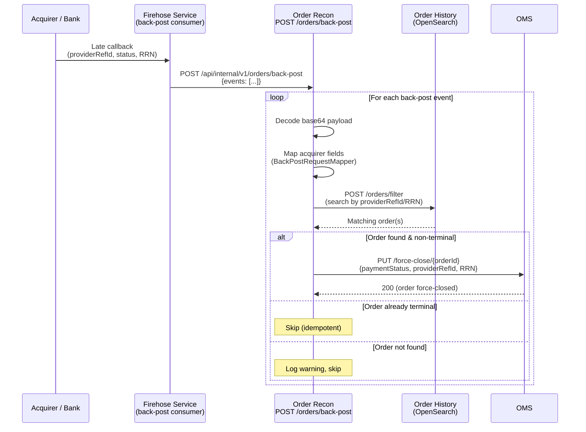
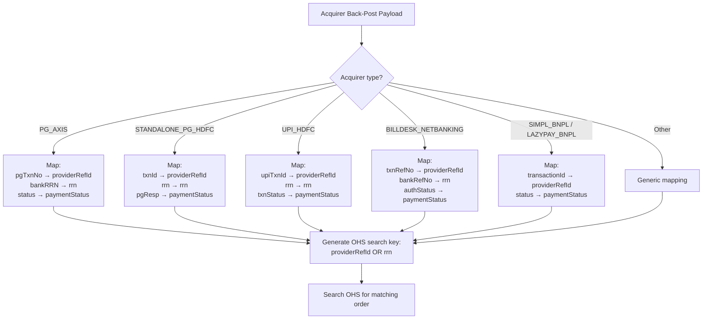
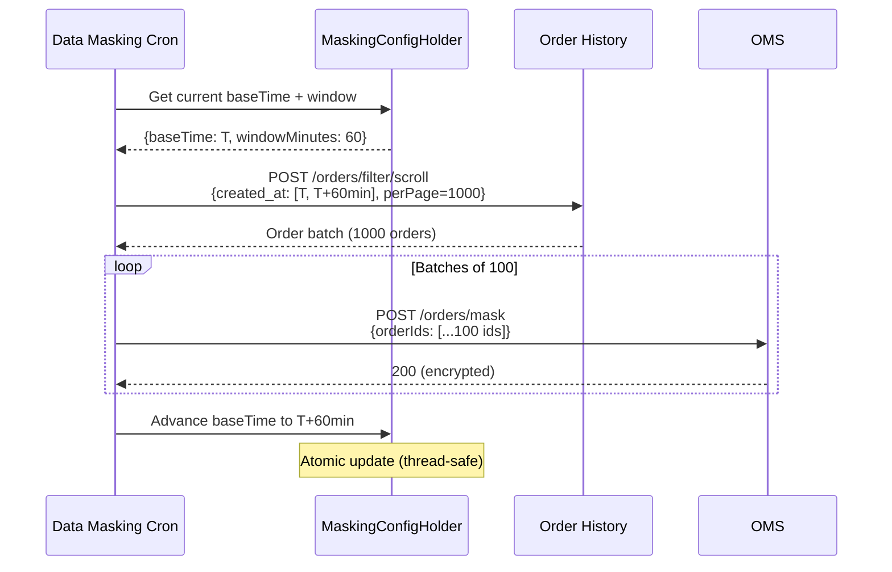
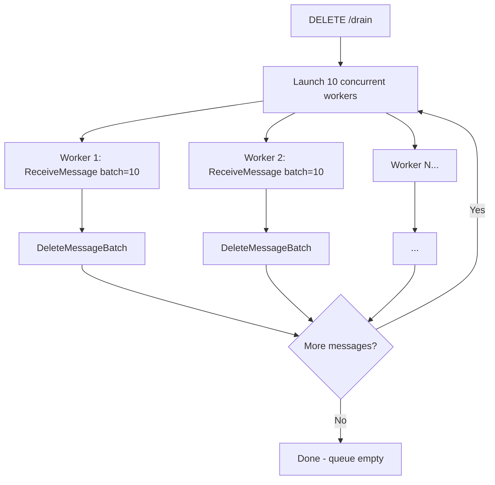

# 10 — Back-Post, Data Masking & Operations API

## Overview

This document covers three additional capabilities of the order-recon service:

1. **Back-Post Processing** — Handling late acquirer callbacks that arrive after order timeout
2. **Data Masking** — PCI compliance: encrypting sensitive card data in aged orders
3. **Operations API** — Debug endpoints, runtime config CRUD, SQS management

---

## Back-Post Processing

### Context

A "back-post" occurs when an acquirer (bank) sends a transaction result **after** the platform has already timed out or terminated the order. This is common with:
- Slow bank switches (response arrives 30min+ later)
- Batch settlement files where the acquirer processed the transaction but the real-time response was lost
- Network timeouts where the acquirer actually captured the payment

The back-post flow reconciles these late arrivals by force-closing the order with the acquirer's reported status.

### Architecture



### BackPostRequestMapper

Each acquirer has unique field mappings for back-post data. The mapper normalizes them:



### Supported Acquirers

| Acquirer Code | Payment Method | Search Field |
|---------------|---------------|--------------|
| `PG_AXIS` | Card | pgTxnNo → providerRefId |
| `WIBMO_AXIS` | Card (3DS) | pgTxnNo → providerRefId |
| `PG_RBL` | Card | txnId → providerRefId |
| `STANDALONE_PG_HDFC` | Card | txnId → providerRefId |
| `PG_LOYALTY_REWARDS` | Rewards | txnId → providerRefId |
| `PayGlocal_Kotak` | Card (international) | txnId → providerRefId |
| `BILLDESK_NETBANKING` | Netbanking | txnRefNo → providerRefId |
| `BILLDESK_WALLET` | Wallet | txnRefNo → providerRefId |
| `AXIS_PINE` | Card | pgTxnNo → providerRefId |
| `UPI_HDFC` | UPI | upiTxnId → providerRefId |
| `SIMPL_BNPL` | BNPL | transactionId → providerRefId |
| `LAZYPAY_BNPL` | BNPL | transactionId → providerRefId |
| `LYRA_ICICI` | Card | txnId → providerRefId |

### Force Close Request

```kotlin
data class OMSForceCloseRequest(
    val orderId: String,
    val paymentId: String,
    val providerReferenceId: String?,
    val rrn: String?,
    val paymentStatus: String,       // CAPTURED | FAILED
    val acquirerCode: String?,
    val acquirerMessage: String?
)

// For refund back-posts:
data class RefundForceCloseRequest(
    val merchantRefundReference: String,
    val merchantId: String,
    val forceCloseRequest: OMSForceCloseRequest
)
```

### Back-Post vs Standard Recon

| Aspect | Standard Recon | Back-Post |
|--------|---------------|-----------|
| Trigger | Cron/Firehose (platform-initiated) | Acquirer callback (bank-initiated) |
| Direction | Platform queries acquirer | Acquirer pushes to platform |
| Data source | OMS queries acquirer API | Acquirer provides final status |
| Action | Reconcile (may advance step) | Force-close (immediate terminal) |
| Lookup | By orderId (known) | By providerRefId/RRN (search OHS) |

---

## Data Masking (PCI Compliance)

### Purpose

Under PCI-DSS, sensitive card data (PAN, expiry, CVV) must be encrypted/masked after a defined retention period. The data masking flow:
1. Queries OHS for orders within a rolling time window
2. Sends batches to OMS for encryption
3. Advances the time window atomically

### Workflow



### MaskingConfigHolder

```kotlin
class MaskingConfigHolder {
    private val baseTime = AtomicReference<Instant>(initialBaseTime)

    fun getAndAdvance(windowMinutes: Long): Pair<Instant, Instant> {
        val from = baseTime.get()
        val to = from.plus(windowMinutes, ChronoUnit.MINUTES)
        baseTime.compareAndSet(from, to)  // Atomic advancement
        return from to to
    }
}
```

**Atomicity**: Ensures multiple cron invocations don't process the same window, even under concurrent execution.

### Data Masking Configuration

```yaml
dataMaskingConfig:
  enabled: true
  windowMinutes: 60          # Process 1 hour of orders per run
  batchSize: 100             # Orders per OMS call
  maxPages: 50               # Safety limit
  retentionDays: 90          # Mask orders older than 90 days
  cronExpression: "0 0 * * * *"  # Every hour
```

---

## Operations API

### Debug SQS Endpoints

#### Drain Queue

```
DELETE /api/debug/sqs/drain?queue=sqs-authz
```

Drains all visible messages from a queue using 10 concurrent workers. Used for:
- Clearing test queues
- Emergency drain during incident
- Pre-deployment cleanup



#### Force Drain (includes delayed/in-flight)

```
DELETE /api/debug/sqs/drain/force?queue=sqs-authz
```

Multi-round drain that waits up to 60s for delayed messages to become visible:
1. Drain visible messages
2. Wait 5s
3. Drain again (catches messages that became visible)
4. Repeat until 60s elapsed with no new messages

#### Queue Stats

```
GET /api/debug/sqs/stats

Response:
{
  "queues": {
    "sqs-authz": {
      "visible": 42,
      "inFlight": 8,
      "delayed": 156
    },
    "sqs-authz-dlq": {
      "visible": 3,
      "inFlight": 0,
      "delayed": 0
    },
    ...
  }
}
```

### Runtime Pipeline Config API

#### Get Current Config

```
GET /api/internal/v1/recon-pipeline/config

Response: Full ReconPipelineConfig JSON
```

#### Update Config (Hot Reload)

```
PUT /api/internal/v1/recon-pipeline/config
Content-Type: application/json

{
  "pollerEnabled": true,
  "rules": [...]
}
```

**Validation rules**:
- `kafkaPercent + directPercent` must equal 100
- All `ruleId` values must be unique
- Step delays must be within SQS bounds (0-43200s)
- Queue names must reference configured queues
- SYNC strategy requires non-null topicRoutingStrategy

### Order Retry API

```
POST /api/internal/v1/orders/retry
{
  "orderId": "ord_abc123",
  "target": "WEBHOOK"  // WEBHOOK | SETTLEMENT | RISK
}
```

Fetches order from OHS and re-dispatches to the specified downstream service. Used when:
- Webhook delivery failed and merchant requests re-delivery
- Settlement processing was missed
- Risk/FRM evaluation needs re-trigger

### Health Check

```
GET /health/ready

Response:
{
  "status": "UP",
  "checks": {
    "redis": "UP",
    "sqs": "UP",
    "kafka": "UP"
  },
  "info": {
    "rulesLoaded": 13,
    "pollersActive": 10,
    "configHash": "abc123"
  }
}
```

---

## Redis Architecture: Fail-Open Pattern

### Design Principle

The order-recon service treats Redis as a **best-effort optimization**, not a critical dependency. All Redis operations are fail-open:

```kotlin
class RedisClient(
    private val jedisPool: JedisPool,
    private val circuitBreaker: CircuitBreaker  // 5 failures, 30s reset
) {
    // Returns null on failure (caller proceeds without dedup)
    suspend fun setIfAbsent(key: String, value: String, ttlSeconds: Long): Boolean? {
        return circuitBreaker.protectOrElse(
            fa = {
                jedisPool.resource.use { jedis ->
                    val result = jedis.set(key, value, SetParams().nx().ex(ttlSeconds))
                    result == "OK"  // true = was set (new), false = already existed
                }
            },
            orElse = { null }  // Fail-open: return null = "don't know, proceed"
        )
    }

    // Returns null on failure (caller treats as "not exists")
    suspend fun exists(key: String): Boolean? {
        return circuitBreaker.protectOrElse(
            fa = { jedisPool.resource.use { it.exists(key) } },
            orElse = { null }  // Fail-open
        )
    }
}
```

### Redis Circuit Breaker (Stricter than HTTP clients)

| Parameter | Value | Rationale |
|-----------|-------|-----------|
| maxFailures | 5 | Open quickly — Redis should be fast or not at all |
| resetTimeout | 30s | Try again after 30s |
| exponentialBackoffFactor | 1.5 | Slower recovery than HTTP clients |
| maxResetTimeout | 120s | Max 2min between retries |

### Dedup Key Catalog

| Key Pattern | TTL | Context |
|-------------|-----|---------|
| `SQS:DEDUP:{orderId}:{ruleId}` | 86,460s (24h+60s) | Firehose ingestion dedup |
| `dedup:{orderId}:{ruleId}` | 86,460s | Cron discovery dedup |
| `CYBS:DECISION:{riskId}` | 600s (10min) | CyberSource decision dedup |
| `INVOICE:PACB_UPDATE:{orderId}` | 3,600s (1h) | Invoice upload dedup |
| `AWB:STATUS_UPDATE:{awbId}` | 3,600s (1h) | AWB upload dedup |
| `emi_recon:{orderId}` | 86,400s (24h) | EMI recon dedup |

### Failure Impact Matrix

| Redis State | Impact | Mitigation |
|-------------|--------|-----------|
| Healthy | Normal dedup, ~0.01% duplicate rate | — |
| Degraded (high latency) | Slight increase in duplicates | Circuit breaker opens at 5 failures |
| Down (circuit open) | All dedup bypassed, ~5% duplicate rate | Downstream idempotency handles duplicates |
| Recovering (half-open) | Intermittent dedup | Gradual traffic restoration |

**Architectural guarantee**: All downstream services (OMS, RMS) are idempotent — processing the same order twice is safe (no double-charge, no double-refund). Redis dedup is a performance optimization, not a correctness requirement.
