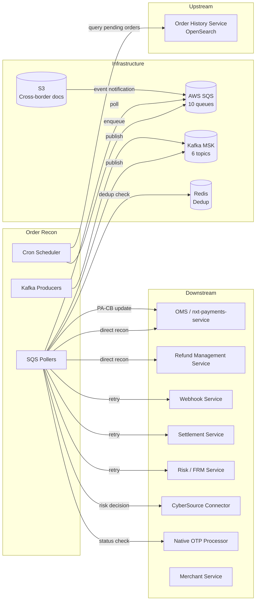

# Order Reconciliation Service (order-recon)

> Comprehensive architecture and workflow documentation for Plural Platform V3's reconciliation engine.

## Service Identity

| Attribute | Value |
|-----------|-------|
| **Service** | `order-recon` |
| **Language** | Kotlin 1.9.22 / JVM 17 |
| **Framework** | Ktor 2.3.4 (CIO engine) |
| **DI** | Koin |
| **Config** | Hoplite (YAML + env vars) |
| **Port** | 8080 |
| **Repo** | `order-recon` |

## Purpose

The Order Reconciliation Service is the platform's **asynchronous state reconciler**. It continuously discovers orders/payments that are stuck in non-terminal states and drives them to resolution by:

1. **Discovering** — Querying Order History Service (OpenSearch) for pending/stuck orders via scheduled cron jobs
2. **Classifying** — Matching orders against pipeline rules by (orderType, orderStatus, paymentStatus, paymentMethod, tenant, merchant)
3. **Routing** — Enqueueing to SQS queues with configurable step-based delays
4. **Reconciling** — Either publishing to Kafka for downstream consumers OR calling OMS/RMS directly for state synchronization
5. **Terminating** — Force-closing long-pending orders that exceed time thresholds

## Document Map

| # | Document | Description |
|---|----------|-------------|
| 01 | [Architecture Overview](./01-architecture-overview.md) | System context, component diagram, deployment topology, tech decisions |
| 02 | [SQS Pipeline & Step-Based Delays](./02-sqs-pipeline-and-delays.md) | Queue topology, delay mechanics, visibility timeout trick, DLQ strategy |
| 03 | [Reconciliation Scenarios](./03-reconciliation-scenarios.md) | All 17+ discovery scenarios, OHS query filters, scroll/pagination |
| 04 | [Direct Recon Workflows](./04-direct-recon-workflows.md) | OMS_RECONCILE_PAYMENTS, RMS_RECONCILE_REFUND, OMS_TERMINATE_ORDER workflows |
| 05 | [Native OTP & Action Queues](./05-native-otp-and-action-queues.md) | Two-phase termination, PRE/POST_TERMINATE lifecycle, backoff strategy |
| 06 | [Kafka Producer & Topic Routing](./06-kafka-producer-and-routing.md) | Topic routing strategies, lag compensation, Kafka-vs-direct split |
| 07 | [Pipeline Rules & Configuration](./07-pipeline-rules-and-configuration.md) | Rule DSL, feature flags, config loading, per-merchant rollout |
| 08 | [Cross-Border & Risk Decision](./08-cross-border-and-risk.md) | S3 event processing, CyberSource risk decisions, PA-CB status updates |
| 09 | [Firehose Real-Time Ingestion](./09-firehose-real-time-ingestion.md) | Primary event-driven ingestion, multi-payment rule matching, zero-payment termination |
| 10 | [Back-Post, Data Masking & Ops API](./10-backpost-masking-and-ops-api.md) | Late acquirer callbacks, PCI data encryption, debug/config APIs, Redis fail-open |

## Key Architecture Decisions

| Decision | Rationale |
|----------|-----------|
| **SQS over Kafka for delays** | SQS provides native delay (up to 900s) and visibility-timeout-based extended delays without custom infrastructure |
| **No Kafka consumers** | Service is a producer-only to Kafka; ingestion via Firehose HTTP push (real-time) and cron batch queries (fallback) |
| **Dual ingestion: Firehose + Cron** | Firehose provides sub-second pipeline entry from CDC events; cron serves as safety net for missed events |
| **Redis fail-open** | All Redis operations gracefully degrade — prefer duplicate processing over lost events; downstream is idempotent |
| **Arrow Circuit Breakers** | All HTTP clients protected with `resetTimeout=10s`, `maxFailures=200`, exponential backoff |
| **Dual SQS clients** | Separate receive vs mutation clients prevent connection pool starvation under load |
| **Redis dedup** | 24h TTL dedup keys prevent duplicate reconciliation of the same order across cron runs |
| **Scroll-based OHS queries** | Preferred over pagination for large result sets; avoids deep-page performance degradation |
| **Hoplite config merging** | `application.yaml` + env vars + mounted ConfigMap enables per-environment pipeline rule customization without code changes |

## Service Interactions

## Quick Reference: SQS Queues

| Queue | Purpose | Concurrency |
|-------|---------|-------------|
| `recon-sqs` | Default order recon | 10 |
| `refund-recon-sqs` | Refund reconciliation | 10 |
| `sqs-order-terminate` | Long-pending termination | 5 |
| `native-otp-sqs` | Native OTP lifecycle | 10 |
| `sqs-authz` | Authorized payment recon | 5 |
| `sqs-authn` | Authentication-challenged (card) | 5 |
| `sqs-authc` | Authentication-challenged (UPI/NB/wallet) | 5 |
| `sqs-capture-void` | Capture/void recon | 3 |
| `sqs-cybs-decision-action` | CyberSource risk decisions | 5 |
| `s3-pldata` | Cross-border S3 events | 5 |

## Quick Reference: Kafka Topics (Producer Only)

| Topic | Content |
|-------|---------|
| `recon-orders` | Orders needing sync reconciliation |
| `recon-refunds` | Refunds needing sync reconciliation |
| `long-pending-orders` | Orders to force-close |
| `long-pending-refund-orders` | Refunds to force-close |
| `sync-payments` | Payment-level reconciliation |
| `emi-recon-orders` | EMI-specific reconciliation |
