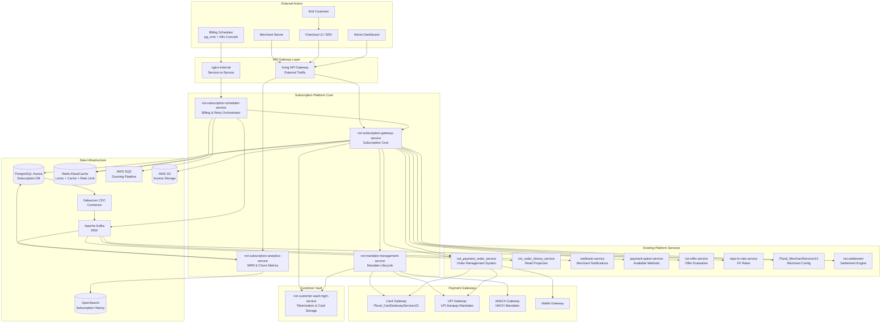
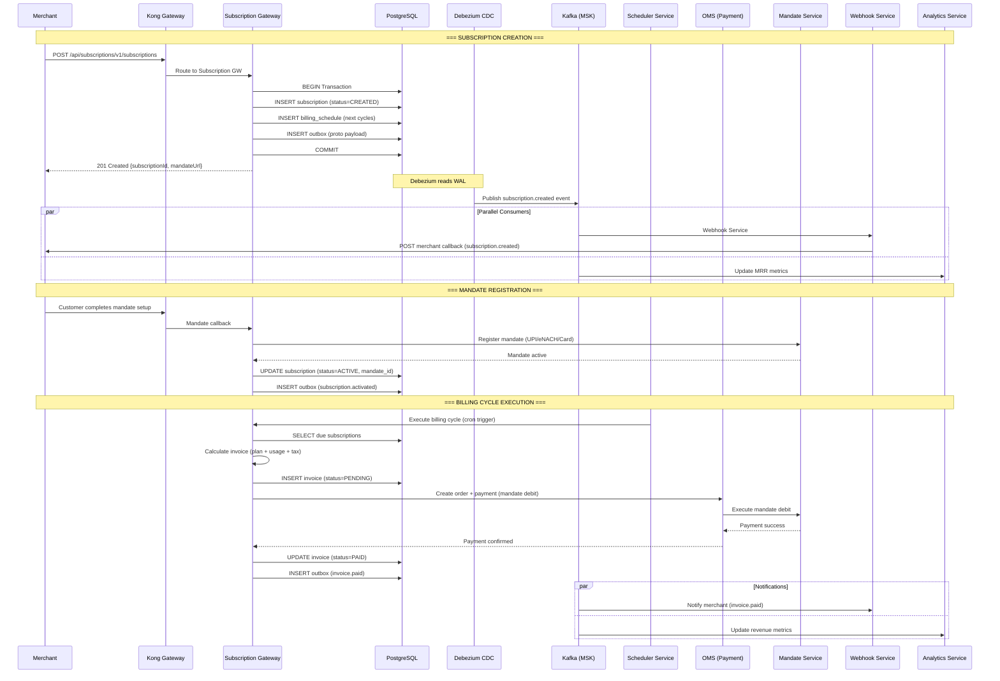

# 01 — Architecture Overview

> High-level system design of the Plural Platform V3 Subscription Gateway

---

## System Context Diagram



---

## Layered Architecture (Subscription Gateway Internal)

```
┌────────────────────────────────────────────────────────────────────────────────────┐
│                          API LAYER (Ktor Routing)                                    │
│  PlanRoutes │ SubscriptionRoutes │ InvoiceRoutes │ UsageRoutes │ InternalRoutes     │
├────────────────────────────────────────────────────────────────────────────────────┤
│                        API SERVICE LAYER                                             │
│  PlanAPIService │ SubscriptionAPIService │ InvoiceAPIService │ UsageAPIService      │
│  MandateAPIService │ AnalyticsAPIService │ WebhookEventService                     │
├────────────────────────────────────────────────────────────────────────────────────┤
│                    SUBSCRIPTION CLIENT (Facade / Orchestrator)                       │
│  SubscriptionClient — orchestrates Plan, Subscription, Billing, Dunning services   │
├────────────────────────────────────────────────────────────────────────────────────┤
│                        DOMAIN SERVICE LAYER                                          │
│  PlanService │ SubscriptionService │ BillingService │ InvoiceService               │
│  DunningService │ ProrationService │ MeteringService │ LifecycleService            │
│  MandateService │ TaxService │ DiscountService │ CouponService                     │
├────────────────────────────────────────────────────────────────────────────────────┤
│                    BILLING ENGINE LAYER (Strategy Pattern)                           │
│  FixedRecurringEngine │ UsageBasedEngine │ TieredEngine │ HybridEngine             │
│  PerSeatEngine │ VolumeTieredEngine │ StaircaseEngine                              │
├────────────────────────────────────────────────────────────────────────────────────┤
│                        PAYMENT EXECUTION LAYER                                       │
│  PaymentExecutor → OMS integration for actual charge execution                      │
│  MandateExecutor → UPI Autopay / eNACH / Card-on-file debit                       │
│  RetryStrategyEngine → Smart retry with backoff + ML scoring                       │
├────────────────────────────────────────────────────────────────────────────────────┤
│                        REPOSITORY LAYER                                              │
│  PlanRepository │ SubscriptionRepository │ InvoiceRepository │ BillingCycleRepo    │
│  MandateRepository │ UsageRecordRepository │ DunningAttemptRepository              │
│  OutboxRepository │ ScheduleRepository │ CouponRepository                          │
├────────────────────────────────────────────────────────────────────────────────────┤
│                        INFRASTRUCTURE                                                │
│  PostgreSQL (Exposed ORM) │ Redis │ Kafka Producer │ SQS Client │ S3 Client        │
│  HTTP Clients (OMS, Merchant, Vault, FX) │ pg_cron │ OpenTelemetry                 │
└────────────────────────────────────────────────────────────────────────────────────┘
```

---

## Data Flow Architecture



---

## Infrastructure Topology

### Kubernetes Deployment

```
EKS Cluster (ap-south-1)
├── Namespace: nxt-subscriptions
│   ├── nxt-subscription-gateway-service (3 replicas, 2 CPU / 4GB)
│   ├── nxt-subscription-scheduler-service (2 replicas, 1 CPU / 2GB)
│   ├── nxt-mandate-management-service (3 replicas, 1 CPU / 2GB)
│   ├── nxt-subscription-analytics-service (2 replicas, 1 CPU / 2GB)
│   └── subscription-debezium-server (1 replica, outbox CDC)
├── Namespace: nxt-services (existing)
│   ├── nxt-payment-order-service (OMS — payment execution)
│   ├── webhook-service (notification delivery)
│   └── payment-option-service (payment methods)
└── Namespace: data
    ├── Redis (ElastiCache — subscription locks, plan cache)
    ├── Kafka Connect (MSK Connect — Debezium)
    └── SQS (dunning retry queues)
```

### Database Architecture

```
Aurora PostgreSQL (Multi-AZ) — nxt_subscriptions_db
├── plans (subscription plan definitions)
├── plan_prices (multi-currency pricing per plan)
├── subscriptions (RANGE partitioned by created_date — monthly)
├── subscription_items (line items per subscription)
├── billing_schedules (next billing dates, computed)
├── invoices (RANGE partitioned by billing_date — monthly)
├── invoice_line_items (breakdown per invoice)
├── payments (RANGE partitioned by created_at)
├── mandates (mandate lifecycle tracking)
├── dunning_attempts (retry history)
├── usage_records (metered usage, RANGE partitioned)
├── coupons (discount definitions)
├── subscription_coupons (applied coupons)
├── proration_credits (mid-cycle credits)
├── outbox (Debezium CDC source)
├── subscription_events (audit trail)
└── Extensions: pg_cron, pgcrypto, pg_partman
```

### Kafka Topics

| Topic | Producer | Consumers | Format |
|-------|----------|-----------|--------|
| `subscriptions.public.outbox` | Debezium | Firehose, Webhook, Analytics | Protobuf |
| `subscription.lifecycle` | Sub GW | Analytics, Webhook, Settlement | Protobuf |
| `subscription.billing` | Scheduler | Sub GW, Analytics | Protobuf |
| `subscription.dunning` | Scheduler | Sub GW (retry) | Protobuf |
| `subscription.mandate` | Mandate Svc | Sub GW, Analytics | Protobuf |
| `subscription.invoice` | Sub GW | Webhook, Settlement, Analytics | Protobuf |
| `subscription.usage` | Sub GW | Analytics, Metering | Protobuf |
| `subscription.recon` | Recon Pipeline | Sub GW | Protobuf |

### SQS Queues (Dunning Pipeline)

| Queue | Delay | Purpose |
|-------|-------|---------|
| `subscription-retry-immediate` | 0s | Soft-decline immediate retry |
| `subscription-retry-4h` | 4h | First retry after cooling |
| `subscription-retry-24h` | 24h | Second retry next day |
| `subscription-retry-48h` | 48h | Third retry |
| `subscription-retry-72h` | 72h | Final retry before cancellation |
| `subscription-dunning-dlq` | — | Dead letter after all retries exhausted |

---

## Cross-Cutting Concerns

### Security
- Merchant authentication via HMAC-signed headers (same as OMS)
- Mandate tokens encrypted at rest (AES-256-GCM)
- Customer PII encrypted in JSONB (card last-4, email, phone)
- TLS 1.3 for all inter-service communication
- API rate limiting per merchant (Redis sliding window)
- PCI DSS compliance for stored card mandates (delegated to Vault)

### Observability
- **Traces**: OpenTelemetry → OTLP → Last9 (full distributed trace from billing trigger to payment completion)
- **Metrics**: Custom counters — billing_cycles_executed, dunning_attempts, churn_rate, mrr_delta
- **Logs**: Structured JSON via logstash-logback-encoder → Loki
- **Alerts**: PagerDuty integration for billing failures > threshold
- **Health**: `/health/live` + `/health/ready` on port 8081
- **Dashboards**: Grafana — MRR, churn, ARPU, billing success rate, dunning recovery

### Resilience
- Distributed locks (Redis) prevent duplicate billing for same subscription
- Circuit breakers on all downstream payment gateways
- Exponential backoff in SQS dunning pipeline
- Idempotency keys on all billing and payment operations
- Graceful degradation: if mandate service is down, queue billing for later
- Feature toggles for new billing engine rollout

### Performance
- Table partitioning (monthly range) for invoices and usage records
- JSONB for flexible subscription metadata
- Coroutine-based async I/O (batch billing cycles in parallel)
- Connection pooling via HikariCP (max 50 per pod)
- Redis caching for plan configs (5-min TTL), merchant settings
- Pre-computed billing schedules (avoid runtime calculation)
- Batch invoice generation (process 1000 subscriptions per scheduler tick)

### Regulatory Compliance (RBI)
- **Pre-debit notification**: 24 hours before recurring charge (mandatory for UPI/eNACH)
- **Amount ceiling**: eNACH mandates capped at registered max amount
- **Customer opt-out**: One-click cancellation without merchant intervention
- **Transaction limits**: Per-transaction and periodic limits enforced
- **AFA (Additional Factor of Authentication)**: First transaction requires 2FA; subsequent charges auto-debited within mandate limits
