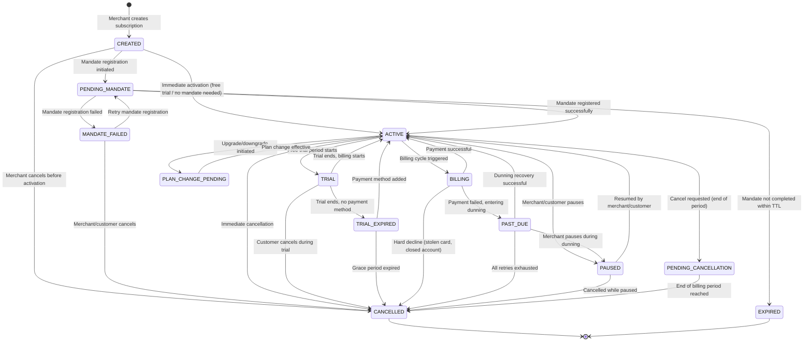
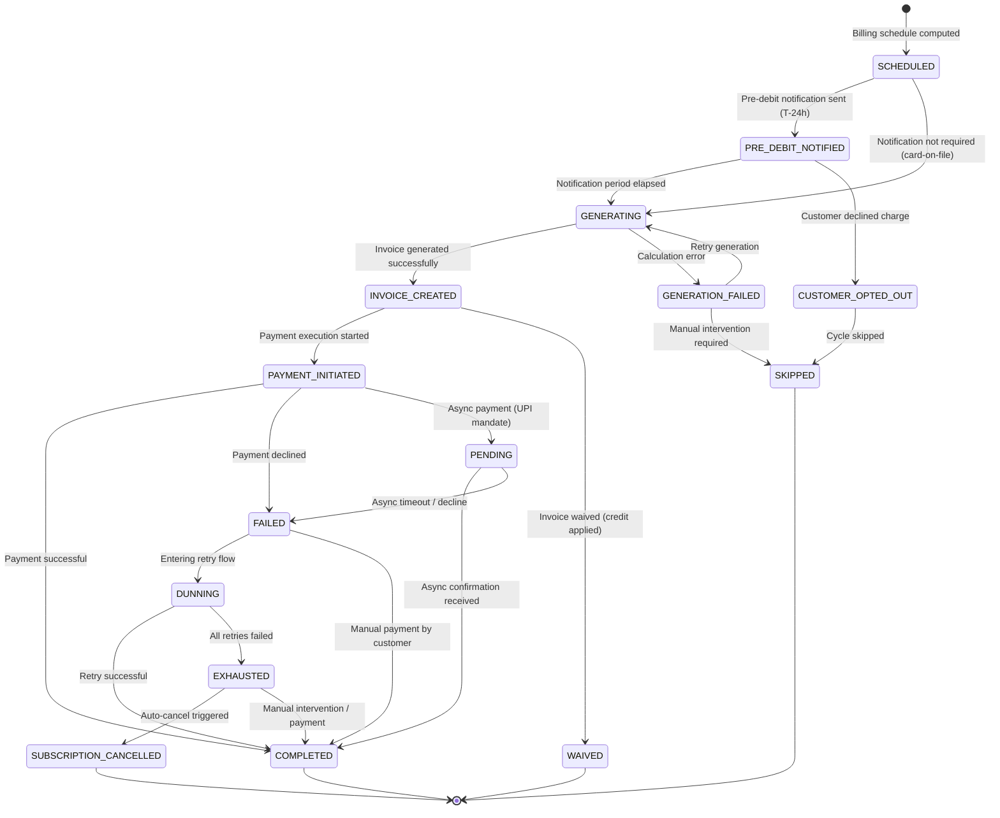
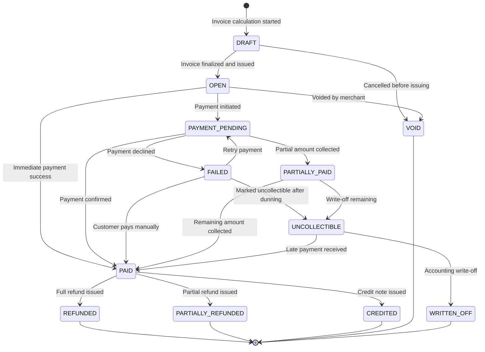
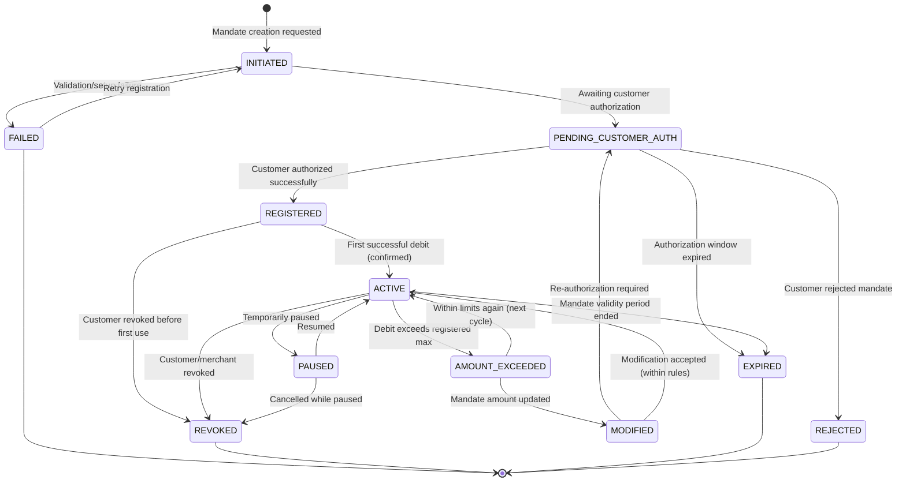
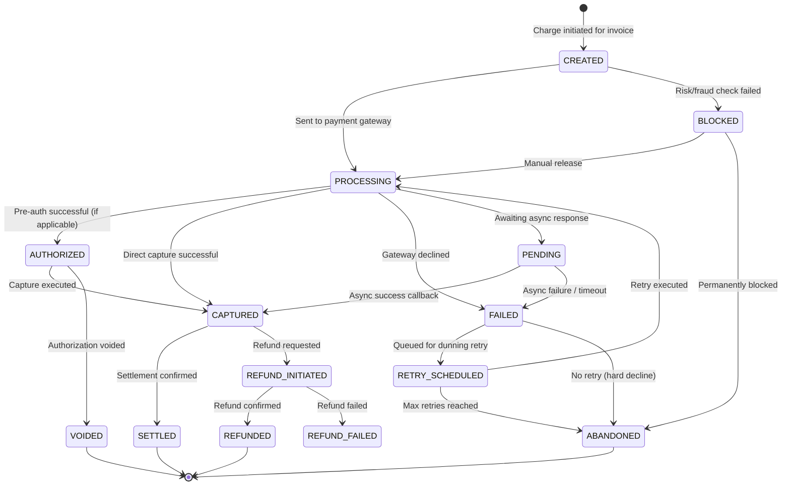
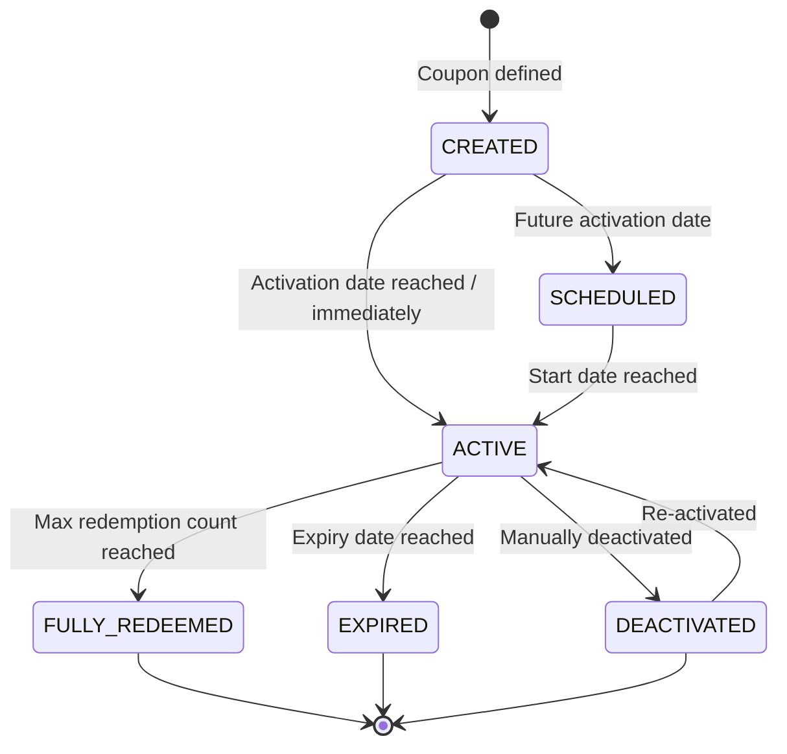
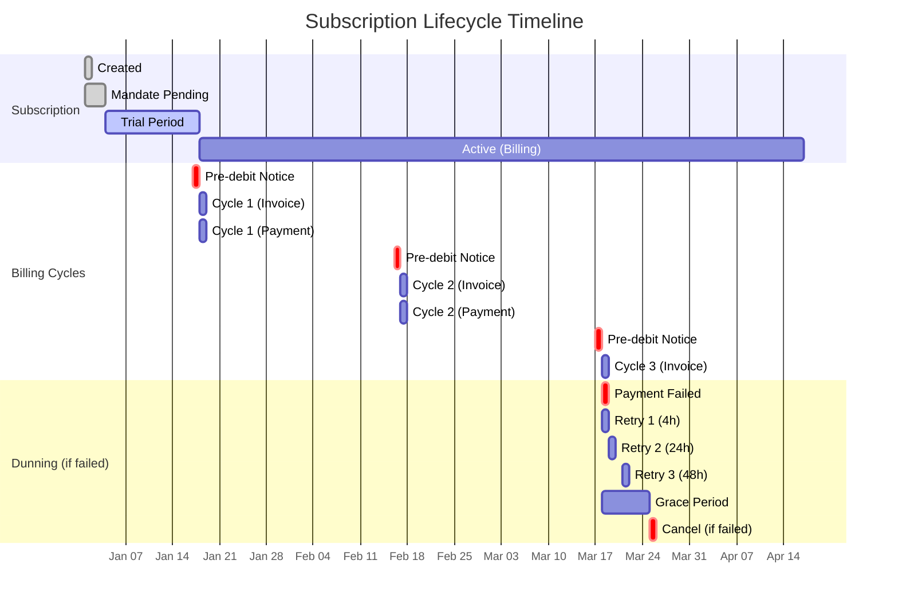

# 02 — State Machines

> Subscription, Billing Cycle, Invoice, Payment, and Mandate lifecycle state diagrams with all transitions

---

## 1. Subscription Lifecycle State Machine



### Subscription State Definitions

| State | Description | Billable | Mandate Active |
|-------|-------------|----------|----------------|
| `CREATED` | Subscription created, awaiting setup | No | No |
| `PENDING_MANDATE` | Waiting for customer to complete mandate registration | No | Pending |
| `MANDATE_FAILED` | Mandate registration failed, awaiting retry or cancel | No | Failed |
| `ACTIVE` | Subscription live, can be billed | Yes | Yes |
| `TRIAL` | In free trial period, no charges | No | Optional |
| `TRIAL_EXPIRED` | Trial ended without payment method | No | No |
| `BILLING` | Billing cycle in progress (transient) | Charging | Yes |
| `PAST_DUE` | Payment failed, in dunning/retry window | Grace | Yes |
| `PAUSED` | Temporarily suspended (no billing) | No | Held |
| `PENDING_CANCELLATION` | Active until end of current period | Yes (until EOT) | Yes |
| `PLAN_CHANGE_PENDING` | Upgrade/downgrade processing | Yes (old plan) | Yes |
| `CANCELLED` | Permanently terminated | No | Revoked |
| `EXPIRED` | Mandate expired, subscription invalid | No | Expired |

### Transition Rules

```kotlin
enum class SubscriptionTransition(
    val from: Set<SubscriptionStatus>,
    val to: SubscriptionStatus,
    val trigger: String
) {
    INITIATE_MANDATE(
        from = setOf(CREATED),
        to = PENDING_MANDATE,
        trigger = "mandate.registration.initiated"
    ),
    ACTIVATE(
        from = setOf(PENDING_MANDATE, TRIAL_EXPIRED, PAST_DUE, PAUSED, PLAN_CHANGE_PENDING),
        to = ACTIVE,
        trigger = "subscription.activated"
    ),
    START_TRIAL(
        from = setOf(ACTIVE),
        to = TRIAL,
        trigger = "trial.started"
    ),
    ENTER_BILLING(
        from = setOf(ACTIVE),
        to = BILLING,
        trigger = "billing.cycle.started"
    ),
    PAYMENT_FAILED(
        from = setOf(BILLING),
        to = PAST_DUE,
        trigger = "payment.failed"
    ),
    PAUSE(
        from = setOf(ACTIVE, PAST_DUE),
        to = PAUSED,
        trigger = "subscription.paused"
    ),
    CANCEL_IMMEDIATE(
        from = setOf(CREATED, ACTIVE, TRIAL, PAST_DUE, PAUSED, PENDING_MANDATE, MANDATE_FAILED),
        to = CANCELLED,
        trigger = "subscription.cancelled"
    ),
    CANCEL_END_OF_TERM(
        from = setOf(ACTIVE),
        to = PENDING_CANCELLATION,
        trigger = "subscription.cancellation.scheduled"
    ),
    INITIATE_PLAN_CHANGE(
        from = setOf(ACTIVE),
        to = PLAN_CHANGE_PENDING,
        trigger = "plan.change.initiated"
    );
}
```

---

## 2. Billing Cycle State Machine



### Billing Cycle State Definitions

| State | Description | Duration |
|-------|-------------|----------|
| `SCHEDULED` | Future billing cycle computed and stored | Until T-24h |
| `PRE_DEBIT_NOTIFIED` | 24h pre-debit notification sent (RBI mandate) | 24 hours |
| `GENERATING` | Invoice being calculated (plan + usage + tax + discounts) | Seconds |
| `GENERATION_FAILED` | Invoice generation error (missing usage data, FX failure) | Until retry |
| `INVOICE_CREATED` | Invoice finalized, ready for payment | Until charge |
| `PAYMENT_INITIATED` | Payment request sent to gateway | Seconds-minutes |
| `PENDING` | Awaiting async payment confirmation | Up to 30 min |
| `COMPLETED` | Payment successful, cycle complete | Terminal |
| `FAILED` | Payment declined | Transient |
| `DUNNING` | In retry/dunning flow | 3-7 days |
| `EXHAUSTED` | All retries failed | Terminal trigger |
| `SKIPPED` | Cycle intentionally skipped | Terminal |
| `WAIVED` | Invoice waived (credits covered full amount) | Terminal |
| `CUSTOMER_OPTED_OUT` | Customer declined pre-debit notification | Terminal |
| `SUBSCRIPTION_CANCELLED` | Subscription cancelled due to payment failure | Terminal |

---

## 3. Invoice State Machine



### Invoice State Definitions

| State | Description | Revenue Recognized |
|-------|-------------|-------------------|
| `DRAFT` | Being calculated, not yet final | No |
| `OPEN` | Finalized, awaiting payment | Accrued |
| `PAYMENT_PENDING` | Payment in progress | Accrued |
| `PAID` | Successfully collected | Yes |
| `PARTIALLY_PAID` | Partial amount collected | Partial |
| `FAILED` | Payment attempt failed | Accrued |
| `UNCOLLECTIBLE` | Marked as bad debt after dunning exhaustion | Reversed |
| `VOID` | Cancelled/voided | No |
| `REFUNDED` | Full amount refunded | Reversed |
| `PARTIALLY_REFUNDED` | Partial refund issued | Partial reversal |
| `CREDITED` | Credit note applied to account | Deferred |
| `WRITTEN_OFF` | Written off in accounting | Loss |

---

## 4. Mandate State Machine



### Mandate Types & Rules

| Mandate Type | Max Amount | Frequency | Pre-debit Notice | Validity |
|-------------|-----------|-----------|-----------------|----------|
| UPI Autopay | INR 1,00,000 | Daily/Weekly/Monthly/Yearly | 24h mandatory | Up to 5 years |
| eNACH/NACH | INR 1,00,00,000 | Monthly/Quarterly/Yearly | 24h mandatory | Perpetual (with renewal) |
| Card-on-File | No RBI limit (acquirer limit applies) | Any | Optional (best practice) | Until card expiry |
| SI (Standing Instruction) | INR 15,000 (no AFA) / unlimited (with AFA) | Any | 24h mandatory | As registered |

### Mandate Debit Rules

```kotlin
data class MandateDebitValidation(
    val maxAmountPerDebit: Money,        // Cannot exceed registered max
    val frequencyRule: FrequencyRule,     // Cannot debit more frequently than registered
    val preDebitHours: Int = 24,          // Pre-debit notification window
    val cooldownAfterFailure: Duration,   // Wait time after failed debit
    val maxRetriesPerCycle: Int = 3,      // Retry limit per billing cycle
    val requiresAFA: Boolean,            // Additional Factor of Authentication
    val validUntil: LocalDate            // Mandate expiry date
)
```

---

## 5. Payment (Subscription Charge) State Machine



### Decline Code Classification

```kotlin
enum class DeclineCategory(
    val retryable: Boolean,
    val suggestedDelay: Duration,
    val maxRetries: Int,
    val action: String
) {
    // Soft Declines — Retryable
    INSUFFICIENT_FUNDS(true, 4.hours, 5, "Retry with backoff"),
    ISSUER_UNAVAILABLE(true, 1.hours, 3, "Retry soon"),
    PROCESSING_ERROR(true, 30.minutes, 3, "Immediate retry"),
    RATE_LIMIT(true, 2.hours, 3, "Backoff retry"),
    TIMEOUT(true, 1.hours, 3, "Retry with timeout increase"),

    // Hard Declines — Non-retryable
    STOLEN_CARD(false, Duration.ZERO, 0, "Cancel mandate, notify merchant"),
    CLOSED_ACCOUNT(false, Duration.ZERO, 0, "Cancel mandate, notify merchant"),
    FRAUD_SUSPECTED(false, Duration.ZERO, 0, "Block + notify"),
    INVALID_CARD(false, Duration.ZERO, 0, "Request payment method update"),
    DO_NOT_HONOR(false, Duration.ZERO, 0, "Notify customer to contact bank"),

    // Action Required — Customer intervention
    AUTHENTICATION_REQUIRED(false, Duration.ZERO, 0, "Send payment link to customer"),
    MANDATE_REVOKED(false, Duration.ZERO, 0, "Request new mandate"),
    AMOUNT_EXCEEDS_LIMIT(false, Duration.ZERO, 0, "Split charge or update mandate");
}
```

---

## 6. Coupon / Discount State Machine



---

## 7. Composite State: Subscription + Billing Timeline



---

## 8. Event Emission per State Transition

| Transition | Event Emitted | Kafka Topic | Webhook Event |
|-----------|--------------|-------------|---------------|
| → CREATED | `subscription.created` | `subscription.lifecycle` | Yes |
| → PENDING_MANDATE | `subscription.mandate.initiated` | `subscription.mandate` | Yes |
| → ACTIVE | `subscription.activated` | `subscription.lifecycle` | Yes |
| → TRIAL | `subscription.trial.started` | `subscription.lifecycle` | Yes |
| TRIAL → ACTIVE | `subscription.trial.ended` | `subscription.lifecycle` | Yes |
| → BILLING | `billing.cycle.started` | `subscription.billing` | No |
| → INVOICE_CREATED | `invoice.created` | `subscription.invoice` | Yes |
| → PAID | `invoice.paid` | `subscription.invoice` | Yes |
| → FAILED | `invoice.payment_failed` | `subscription.invoice` | Yes |
| → PAST_DUE | `subscription.past_due` | `subscription.lifecycle` | Yes |
| → DUNNING | `dunning.started` | `subscription.dunning` | Yes |
| → PAUSED | `subscription.paused` | `subscription.lifecycle` | Yes |
| → ACTIVE (from pause) | `subscription.resumed` | `subscription.lifecycle` | Yes |
| → PENDING_CANCELLATION | `subscription.cancellation.scheduled` | `subscription.lifecycle` | Yes |
| → CANCELLED | `subscription.cancelled` | `subscription.lifecycle` | Yes |
| → PLAN_CHANGE_PENDING | `subscription.plan_change.initiated` | `subscription.lifecycle` | Yes |
| Plan change done | `subscription.plan_change.completed` | `subscription.lifecycle` | Yes |
| Mandate → ACTIVE | `mandate.activated` | `subscription.mandate` | Yes |
| Mandate → REVOKED | `mandate.revoked` | `subscription.mandate` | Yes |
