# 03 — Database Schema & Data Model

> Complete database architecture including partitioning strategy, JSONB models, and entity relationships

---

## Entity Relationship Diagram

```mermaid
erDiagram
    PLANS ||--o{ PLAN_PRICES : "has pricing"
    PLANS ||--o{ SUBSCRIPTIONS : "subscribes to"
    PLANS ||--o{ PLAN_ADDONS : "optional addons"
    
    SUBSCRIPTIONS ||--o{ SUBSCRIPTION_ITEMS : "contains items"
    SUBSCRIPTIONS ||--o{ BILLING_SCHEDULES : "scheduled cycles"
    SUBSCRIPTIONS ||--o{ INVOICES : "generates"
    SUBSCRIPTIONS ||--o{ SUBSCRIPTION_EVENTS : "audit trail"
    SUBSCRIPTIONS ||--o{ SUBSCRIPTION_COUPONS : "discounts applied"
    SUBSCRIPTIONS ||--o{ PRORATION_CREDITS : "mid-cycle credits"
    SUBSCRIPTIONS }o--|| MANDATES : "payment mandate"
    SUBSCRIPTIONS }o--|| CUSTOMERS : "subscriber"
    
    INVOICES ||--o{ INVOICE_LINE_ITEMS : "breakdown"
    INVOICES ||--o{ PAYMENTS : "collection attempts"
    INVOICES ||--o{ CREDIT_NOTES : "adjustments"
    
    PAYMENTS ||--o{ DUNNING_ATTEMPTS : "retry history"
    
    USAGE_RECORDS }o--|| SUBSCRIPTIONS : "metered usage"
    USAGE_RECORDS }o--|| SUBSCRIPTION_ITEMS : "for item"
    
    COUPONS ||--o{ SUBSCRIPTION_COUPONS : "applied to"
    
    MANDATES ||--o{ MANDATE_EVENTS : "lifecycle events"
    
    CUSTOMERS ||--o{ SUBSCRIPTIONS : "has subscriptions"
    CUSTOMERS ||--o{ MANDATES : "payment methods"

    PLANS {
        uuid id PK
        text plan_id UK "merchant-facing identifier"
        text merchant_id FK
        text name
        text description
        text status "ACTIVE/ARCHIVED/DRAFT"
        text billing_model "FIXED/USAGE/TIERED/PER_SEAT/HYBRID"
        text interval_unit "DAY/WEEK/MONTH/YEAR"
        int interval_count
        int trial_period_days
        int setup_fee_amount
        text setup_fee_currency
        jsonb metadata
        jsonb features "feature flags/limits"
        int max_billing_cycles "null = infinite"
        boolean prorate_on_change
        text cancellation_policy "IMMEDIATE/END_OF_TERM/CUSTOM"
        timestamp created_at
        timestamp updated_at
    }

    PLAN_PRICES {
        uuid id PK
        uuid plan_id FK
        text currency "INR/USD/EUR..."
        bigint unit_amount "in smallest denomination"
        text pricing_model "FLAT/TIERED/VOLUME/STAIRCASE"
        jsonb tiers "tier definitions if tiered"
        boolean is_default
        timestamp created_at
    }

    PLAN_ADDONS {
        uuid id PK
        uuid plan_id FK
        text addon_id UK
        text name
        bigint unit_amount
        text currency
        text billing_model "FLAT/USAGE/PER_UNIT"
        boolean is_mandatory
        jsonb metadata
        timestamp created_at
    }

    CUSTOMERS {
        uuid id PK
        text customer_id UK "merchant-facing"
        text merchant_id
        text email_encrypted
        text phone_encrypted
        text name
        jsonb address
        text tax_id
        text tax_id_type
        jsonb metadata
        timestamp created_at
        timestamp updated_at
    }

    SUBSCRIPTIONS {
        uuid id PK
        text subscription_id UK "sub_XXXXXXXXXXXX"
        text merchant_id FK
        uuid customer_id FK
        uuid plan_id FK
        uuid mandate_id FK "nullable"
        text status
        text previous_status
        text billing_model
        text interval_unit
        int interval_count
        text currency
        bigint base_amount "plan amount per cycle"
        bigint discount_amount
        bigint tax_amount
        bigint total_amount "computed per cycle"
        date current_period_start
        date current_period_end
        date trial_start
        date trial_end
        date billing_anchor_date "fixed billing date"
        date next_billing_date
        date cancelled_at
        date cancel_at "scheduled cancellation"
        date paused_at
        date resumed_at
        int billing_cycle_count "total cycles billed"
        int max_billing_cycles
        text cancellation_reason
        jsonb metadata
        jsonb payment_settings "retry policy, grace days"
        jsonb proration_behavior "CREATE_PRORATIONS/NONE/ALWAYS_INVOICE"
        bigint version "optimistic locking"
        date partition_date "for partitioning"
        timestamp created_at
        timestamp updated_at
    }

    SUBSCRIPTION_ITEMS {
        uuid id PK
        uuid subscription_id FK
        uuid plan_id FK
        uuid addon_id FK "nullable"
        text item_type "BASE_PLAN/ADDON/METERED"
        text description
        int quantity "seats/units"
        bigint unit_amount
        text currency
        jsonb tier_config "if tiered pricing"
        jsonb metadata
        timestamp created_at
        timestamp updated_at
    }

    BILLING_SCHEDULES {
        uuid id PK
        uuid subscription_id FK
        int cycle_number
        date scheduled_date
        date pre_debit_notification_date
        text status "SCHEDULED/PRE_NOTIFIED/GENERATING/COMPLETED/SKIPPED/FAILED"
        uuid invoice_id FK "nullable, set after generation"
        text skip_reason "nullable"
        jsonb metadata
        timestamp created_at
        timestamp updated_at
    }

    INVOICES {
        uuid id PK
        text invoice_id UK "inv_XXXXXXXXXXXX"
        uuid subscription_id FK
        text merchant_id
        uuid customer_id FK
        int cycle_number
        text status "DRAFT/OPEN/PAID/FAILED/VOID/UNCOLLECTIBLE/REFUNDED"
        date billing_period_start
        date billing_period_end
        date due_date
        date paid_at
        bigint subtotal_amount
        bigint discount_amount
        bigint tax_amount
        bigint total_amount
        bigint amount_paid
        bigint amount_remaining
        text currency
        text invoice_pdf_url "S3 URL"
        jsonb tax_details "GST breakdown"
        jsonb payment_intent_id "OMS order ID"
        jsonb metadata
        int attempt_count
        text hosted_invoice_url "customer payment page"
        date partition_date
        timestamp created_at
        timestamp updated_at
    }

    INVOICE_LINE_ITEMS {
        uuid id PK
        uuid invoice_id FK
        uuid subscription_item_id FK
        text description
        text type "SUBSCRIPTION/ADDON/USAGE/PRORATION/TAX/DISCOUNT"
        int quantity
        bigint unit_amount
        bigint total_amount
        text currency
        date period_start
        date period_end
        jsonb usage_details "if usage-based"
        jsonb proration_details "if prorated"
        timestamp created_at
    }

    PAYMENTS {
        uuid id PK
        text payment_id UK "pay_sub_XXXXXXXXXXXX"
        uuid invoice_id FK
        uuid subscription_id FK
        uuid mandate_id FK
        text status "CREATED/PROCESSING/CAPTURED/FAILED/REFUNDED"
        bigint amount
        text currency
        text payment_method "CARD/UPI_AUTOPAY/ENACH/WALLET"
        text gateway_order_id "OMS order_id"
        text gateway_payment_id "OMS payment_id"
        text decline_code
        text decline_reason
        text decline_category "SOFT/HARD/ACTION_REQUIRED"
        int attempt_number
        boolean is_retry
        jsonb gateway_response
        jsonb metadata
        date partition_date
        timestamp created_at
        timestamp updated_at
    }

    DUNNING_ATTEMPTS {
        uuid id PK
        uuid payment_id FK
        uuid subscription_id FK
        uuid invoice_id FK
        int attempt_number
        text status "SCHEDULED/PROCESSING/SUCCESS/FAILED/SKIPPED"
        text strategy "IMMEDIATE/BACKOFF_4H/BACKOFF_24H/BACKOFF_48H/BACKOFF_72H"
        timestamp scheduled_at
        timestamp executed_at
        text decline_code
        text decline_reason
        text next_action "RETRY/ESCALATE/CANCEL/NOTIFY_CUSTOMER"
        jsonb metadata
        timestamp created_at
    }

    MANDATES {
        uuid id PK
        text mandate_id UK "mdt_XXXXXXXXXXXX"
        uuid customer_id FK
        text merchant_id
        text mandate_type "UPI_AUTOPAY/ENACH/CARD_ON_FILE/STANDING_INSTRUCTION"
        text status "INITIATED/PENDING/REGISTERED/ACTIVE/PAUSED/REVOKED/EXPIRED"
        text umrn "Unique Mandate Reference Number (eNACH)"
        text upi_mandate_id "UPI mandate reference"
        text token_reference "vault token (card-on-file)"
        bigint max_amount "max debit per execution"
        text frequency "DAILY/WEEKLY/MONTHLY/QUARTERLY/YEARLY/AS_PRESENTED"
        date valid_from
        date valid_until
        text debit_day "day of month for eNACH"
        text bank_name
        text account_type
        text last_four "last 4 of card/account"
        jsonb customer_details_encrypted
        jsonb acquirer_details
        jsonb metadata
        timestamp created_at
        timestamp updated_at
    }

    MANDATE_EVENTS {
        uuid id PK
        uuid mandate_id FK
        text event_type "CREATED/AUTH_INITIATED/REGISTERED/DEBIT_INITIATED/DEBIT_SUCCESS/DEBIT_FAILED/REVOKED/EXPIRED"
        text previous_status
        text new_status
        jsonb event_data
        text source "GATEWAY/MERCHANT/SYSTEM/CUSTOMER"
        timestamp created_at
    }

    USAGE_RECORDS {
        uuid id PK
        uuid subscription_id FK
        uuid subscription_item_id FK
        text merchant_id
        text idempotency_key UK
        bigint quantity
        text action "SET/INCREMENT"
        date usage_date
        date billing_period_start
        date billing_period_end
        jsonb metadata
        date partition_date
        timestamp created_at
    }

    COUPONS {
        uuid id PK
        text coupon_id UK "cpn_XXXXXXXXXXXX"
        text merchant_id
        text name
        text discount_type "PERCENTAGE/FIXED_AMOUNT"
        bigint discount_value "percentage * 100 or amount"
        text currency "for FIXED_AMOUNT"
        int duration_in_months "null = forever"
        int max_redemptions
        int current_redemptions
        date valid_from
        date valid_until
        text status "ACTIVE/EXPIRED/FULLY_REDEEMED/DEACTIVATED"
        jsonb applicable_plans "list of plan_ids, null = all"
        jsonb metadata
        timestamp created_at
        timestamp updated_at
    }

    SUBSCRIPTION_COUPONS {
        uuid id PK
        uuid subscription_id FK
        uuid coupon_id FK
        date applied_at
        date expires_at
        int remaining_cycles "null = until coupon expires"
        bigint total_discount_applied
        text status "ACTIVE/EXPIRED/REMOVED"
        timestamp created_at
    }

    PRORATION_CREDITS {
        uuid id PK
        uuid subscription_id FK
        uuid invoice_id FK "invoice where credit is applied"
        text credit_type "PLAN_CHANGE/CANCELLATION/PAUSE"
        bigint credit_amount
        text currency
        date period_start
        date period_end
        int days_unused
        int total_days_in_period
        text description
        jsonb calculation_details
        timestamp created_at
    }

    SUBSCRIPTION_EVENTS {
        uuid id PK
        uuid subscription_id FK
        text event_type
        text previous_status
        text new_status
        text triggered_by "SYSTEM/MERCHANT/CUSTOMER/SCHEDULER"
        jsonb event_data
        text idempotency_key
        text trace_id
        timestamp created_at
    }

    CREDIT_NOTES {
        uuid id PK
        text credit_note_id UK "cn_XXXXXXXXXXXX"
        uuid invoice_id FK
        uuid subscription_id FK
        text reason "REFUND/GOODWILL/PRORATION/BILLING_ERROR"
        bigint amount
        text currency
        text status "ISSUED/APPLIED/VOID"
        uuid applied_to_invoice_id FK "nullable"
        jsonb metadata
        timestamp created_at
    }

    OUTBOX {
        bigint id PK
        bytea aggregate_id
        text aggregate_type "SUBSCRIPTION/INVOICE/MANDATE/PAYMENT"
        bytea payload "protobuf serialized"
        text traceparent
        timestamp created_at
        timestamp updated_at
    }
```



---

## Partitioning Strategy

### Range Partitioning (Monthly)

```sql
-- Subscriptions: partitioned by created month
CREATE TABLE subscriptions (
    id UUID NOT NULL,
    subscription_id TEXT NOT NULL,
    partition_date DATE NOT NULL,
    -- ... other columns
    PRIMARY KEY (id, partition_date)
) PARTITION BY RANGE (partition_date);

-- Auto-create monthly partitions via pg_partman
SELECT partman.create_parent(
    p_parent_table := 'public.subscriptions',
    p_control := 'partition_date',
    p_type := 'native',
    p_interval := '1 month',
    p_premake := 3  -- 3 months ahead
);

-- Invoices: partitioned by billing date
CREATE TABLE invoices (
    id UUID NOT NULL,
    invoice_id TEXT NOT NULL,
    partition_date DATE NOT NULL,
    PRIMARY KEY (id, partition_date)
) PARTITION BY RANGE (partition_date);

-- Payments: partitioned by created_at date
CREATE TABLE payments (
    id UUID NOT NULL,
    payment_id TEXT NOT NULL,
    partition_date DATE NOT NULL,
    PRIMARY KEY (id, partition_date)
) PARTITION BY RANGE (partition_date);

-- Usage Records: partitioned by usage date
CREATE TABLE usage_records (
    id UUID NOT NULL,
    usage_date DATE NOT NULL,
    partition_date DATE NOT NULL,
    PRIMARY KEY (id, partition_date)
) PARTITION BY RANGE (partition_date);
```

### Index Strategy

```sql
-- Subscriptions
CREATE UNIQUE INDEX idx_subscriptions_sub_id ON subscriptions (subscription_id);
CREATE INDEX idx_subscriptions_merchant ON subscriptions (merchant_id, status);
CREATE INDEX idx_subscriptions_customer ON subscriptions (customer_id, status);
CREATE INDEX idx_subscriptions_next_billing ON subscriptions (next_billing_date, status)
    WHERE status IN ('ACTIVE', 'TRIAL', 'PAST_DUE');
CREATE INDEX idx_subscriptions_mandate ON subscriptions (mandate_id)
    WHERE mandate_id IS NOT NULL;
CREATE INDEX idx_subscriptions_plan ON subscriptions (plan_id, status);

-- Invoices
CREATE UNIQUE INDEX idx_invoices_inv_id ON invoices (invoice_id);
CREATE INDEX idx_invoices_subscription ON invoices (subscription_id, billing_period_start DESC);
CREATE INDEX idx_invoices_merchant_status ON invoices (merchant_id, status, due_date);
CREATE INDEX idx_invoices_due_unpaid ON invoices (due_date, status)
    WHERE status IN ('OPEN', 'FAILED');
CREATE INDEX idx_invoices_customer ON invoices (customer_id, created_at DESC);

-- Payments
CREATE UNIQUE INDEX idx_payments_pay_id ON payments (payment_id);
CREATE INDEX idx_payments_invoice ON payments (invoice_id, attempt_number DESC);
CREATE INDEX idx_payments_subscription ON payments (subscription_id, created_at DESC);
CREATE INDEX idx_payments_gateway_order ON payments (gateway_order_id);
CREATE INDEX idx_payments_status ON payments (status, created_at)
    WHERE status IN ('PROCESSING', 'FAILED');

-- Billing Schedules
CREATE INDEX idx_billing_sched_due ON billing_schedules (scheduled_date, status)
    WHERE status IN ('SCHEDULED', 'PRE_NOTIFIED');
CREATE INDEX idx_billing_sched_sub ON billing_schedules (subscription_id, cycle_number);
CREATE INDEX idx_billing_sched_predebit ON billing_schedules (pre_debit_notification_date, status)
    WHERE status = 'SCHEDULED';

-- Mandates
CREATE UNIQUE INDEX idx_mandates_mandate_id ON mandates (mandate_id);
CREATE INDEX idx_mandates_customer ON mandates (customer_id, status);
CREATE INDEX idx_mandates_merchant ON mandates (merchant_id, mandate_type, status);
CREATE INDEX idx_mandates_expiry ON mandates (valid_until, status)
    WHERE status = 'ACTIVE';
CREATE INDEX idx_mandates_umrn ON mandates (umrn)
    WHERE umrn IS NOT NULL;

-- Usage Records
CREATE UNIQUE INDEX idx_usage_idempotency ON usage_records (idempotency_key);
CREATE INDEX idx_usage_sub_period ON usage_records (subscription_id, billing_period_start, billing_period_end);
CREATE INDEX idx_usage_item_period ON usage_records (subscription_item_id, usage_date);

-- Dunning
CREATE INDEX idx_dunning_scheduled ON dunning_attempts (scheduled_at, status)
    WHERE status = 'SCHEDULED';
CREATE INDEX idx_dunning_subscription ON dunning_attempts (subscription_id, attempt_number DESC);

-- Outbox (Debezium polling)
CREATE INDEX idx_outbox_unprocessed ON outbox (created_at)
    WHERE id > 0;  -- Debezium tracks offset
```

---

## JSONB Model Definitions

### Subscription Payment Settings

```json
{
  "payment_settings": {
    "payment_method_types": ["UPI_AUTOPAY", "CARD_ON_FILE"],
    "default_mandate_id": "mdt_xxxxx",
    "retry_policy": {
      "max_retries": 4,
      "retry_intervals_hours": [4, 24, 48, 72],
      "smart_retry_enabled": true,
      "retry_on_decline_codes": ["INSUFFICIENT_FUNDS", "ISSUER_UNAVAILABLE", "TIMEOUT"]
    },
    "grace_period_days": 7,
    "auto_cancel_on_exhaustion": true,
    "pre_debit_notification": {
      "enabled": true,
      "hours_before": 24,
      "channels": ["SMS", "EMAIL", "WHATSAPP"]
    },
    "dunning_emails": {
      "enabled": true,
      "templates": ["payment_failed", "retry_scheduled", "final_notice"]
    }
  }
}
```

### Plan Features / Metadata

```json
{
  "features": {
    "api_calls_limit": 10000,
    "storage_gb": 50,
    "team_members": 10,
    "priority_support": true,
    "custom_domain": true,
    "sso_enabled": false
  },
  "metadata": {
    "display_order": 2,
    "popular_badge": true,
    "category": "business",
    "internal_sku": "BIZ_MONTHLY_V3"
  }
}
```

### Tier Configuration

```json
{
  "tiers": [
    {
      "up_to": 1000,
      "unit_amount": 50,
      "flat_amount": null
    },
    {
      "up_to": 5000,
      "unit_amount": 40,
      "flat_amount": null
    },
    {
      "up_to": 10000,
      "unit_amount": 30,
      "flat_amount": null
    },
    {
      "up_to": null,
      "unit_amount": 20,
      "flat_amount": null
    }
  ],
  "tier_mode": "GRADUATED"
}
```

### Tax Details

```json
{
  "tax_details": {
    "tax_type": "GST",
    "tax_rate_percentage": 1800,
    "breakdown": {
      "cgst": 900,
      "sgst": 900,
      "igst": 0
    },
    "taxable_amount": 99900,
    "tax_amount": 17982,
    "merchant_gstin": "27AABCU9603R1ZM",
    "customer_gstin": null,
    "sac_code": "998431",
    "place_of_supply": "Maharashtra"
  }
}
```

### Proration Calculation Details

```json
{
  "calculation_details": {
    "method": "DAY_BASED",
    "old_plan": {
      "plan_id": "plan_basic",
      "amount_per_day": 3333,
      "days_used": 12,
      "amount_used": 39996
    },
    "new_plan": {
      "plan_id": "plan_pro",
      "amount_per_day": 6666,
      "days_remaining": 18,
      "amount_due": 119988
    },
    "credit_from_old": 59994,
    "charge_for_new": 119988,
    "net_charge": 59994,
    "effective_date": "2024-01-13"
  }
}
```

---

## Data Retention & Archival

| Table | Hot Data | Warm Archive | Cold Archive |
|-------|----------|-------------|-------------|
| `subscriptions` | Active + last 6 months | 6 months – 2 years | 2+ years (S3 Parquet) |
| `invoices` | Last 12 months | 12 months – 3 years | 3+ years (S3) |
| `payments` | Last 6 months | 6 months – 2 years | 2+ years (S3) |
| `usage_records` | Current period + last 3 months | 3 months – 1 year | 1+ year (S3) |
| `dunning_attempts` | Last 3 months | 3 months – 1 year | 1+ year (S3) |
| `subscription_events` | Last 6 months | 6 months – 3 years | 3+ years (S3) |
| `outbox` | Last 7 days (Debezium) | Purged after processing | N/A |

### Archival Process

```sql
-- Automated via pg_cron + partman
-- 1. Detach old partitions from live table
-- 2. Export to S3 Parquet via AWS DMS
-- 3. Drop partition after export confirmation
-- 4. OpenSearch retains searchable projection for 5 years

-- Example: Archive invoices older than 12 months
SELECT partman.run_maintenance(
    p_parent_table := 'public.invoices',
    p_retention := '12 months',
    p_retention_keep_table := false
);
```

---

## Migration Strategy

```sql
-- Flyway naming: V{version}__{description}.sql
-- Example migrations:

-- V1__create_subscription_schema.sql
-- V2__create_billing_tables.sql
-- V3__create_mandate_tables.sql
-- V4__create_usage_and_metering.sql
-- V5__create_coupons_and_discounts.sql
-- V6__create_outbox_and_events.sql
-- V7__add_partitioning.sql
-- V8__add_indices.sql
-- V9__add_pg_cron_jobs.sql

-- pg_cron scheduled jobs
SELECT cron.schedule('billing-cycle-check', '*/5 * * * *',
    $$SELECT process_due_billing_cycles()$$);

SELECT cron.schedule('pre-debit-notifications', '0 * * * *',
    $$SELECT send_pre_debit_notifications()$$);

SELECT cron.schedule('mandate-expiry-check', '0 6 * * *',
    $$SELECT check_mandate_expiries()$$);

SELECT cron.schedule('partition-maintenance', '0 3 * * 0',
    $$SELECT partman.run_maintenance()$$);
```
