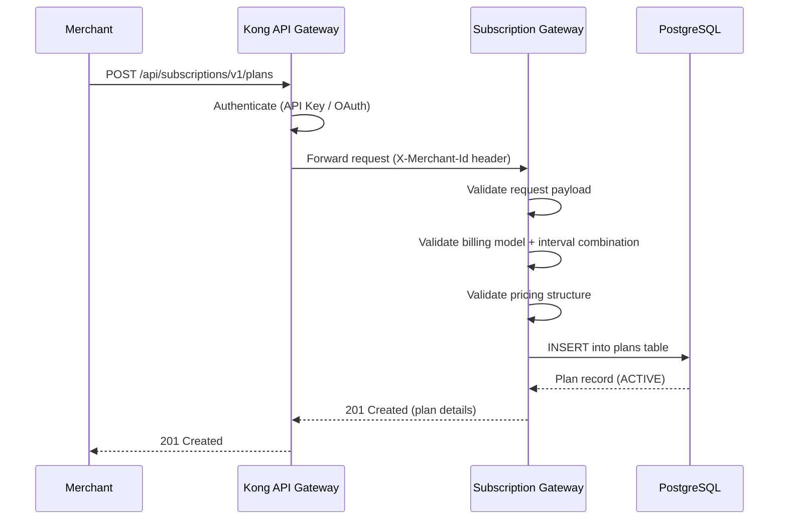
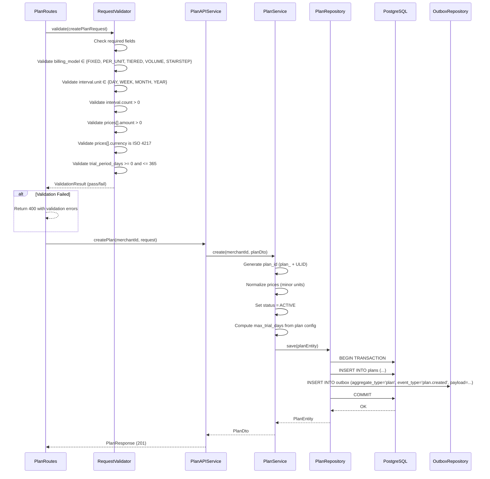
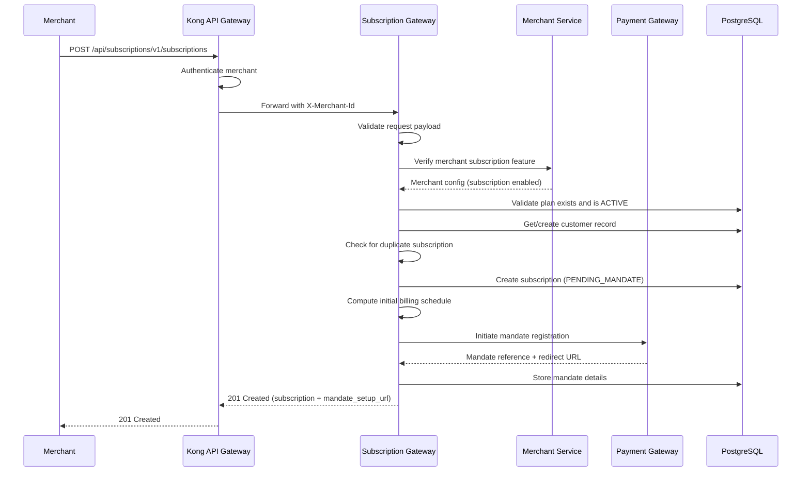
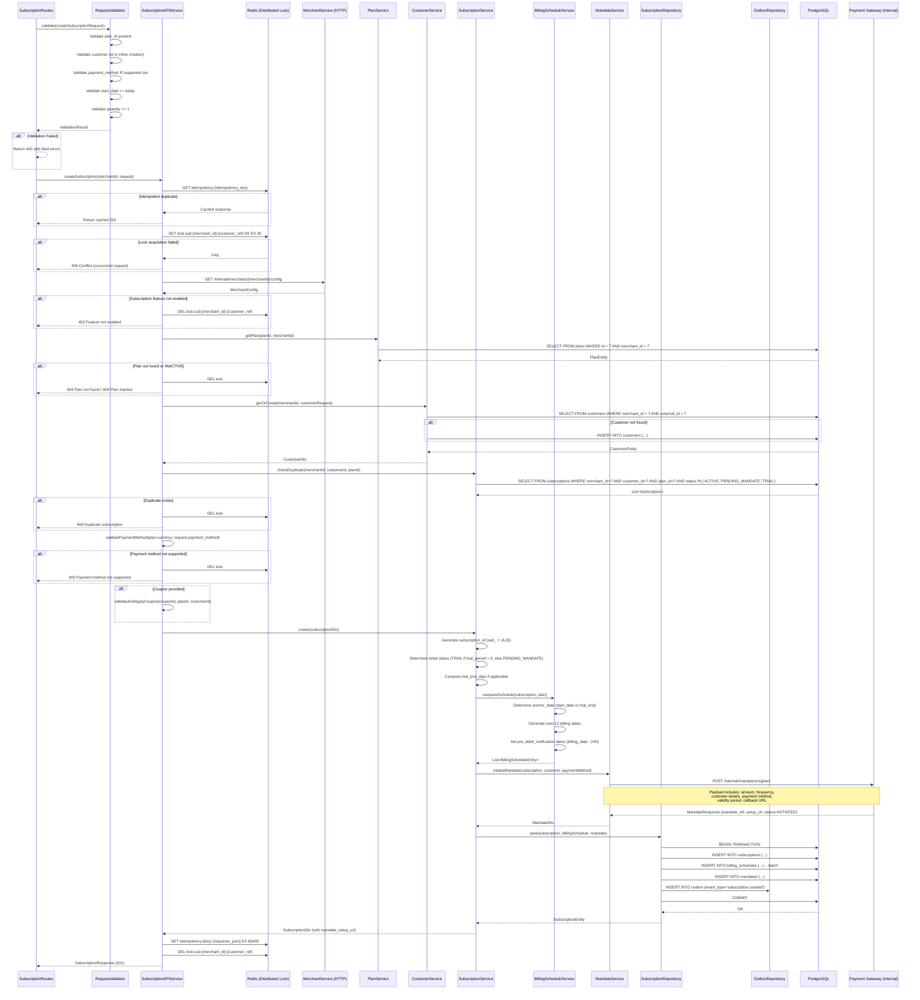
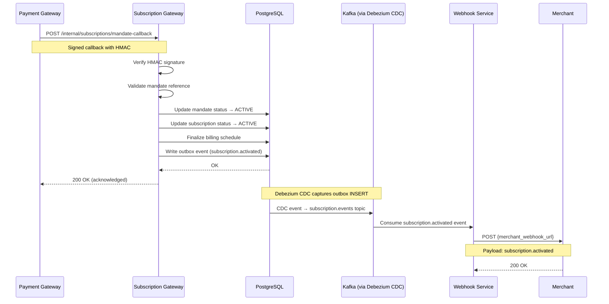
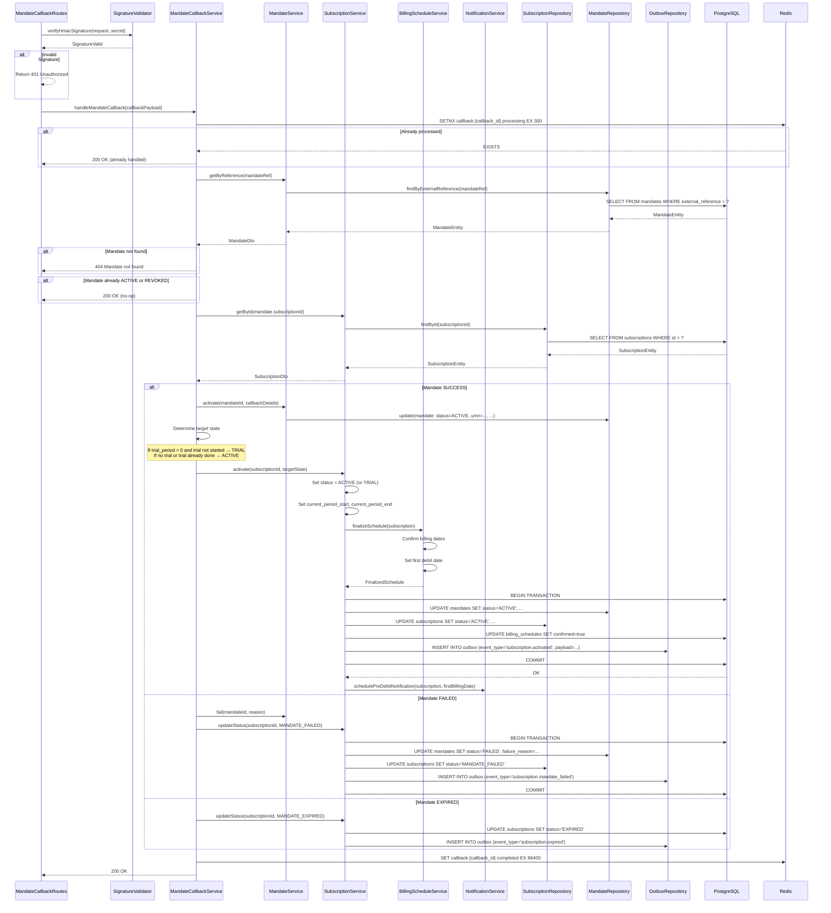
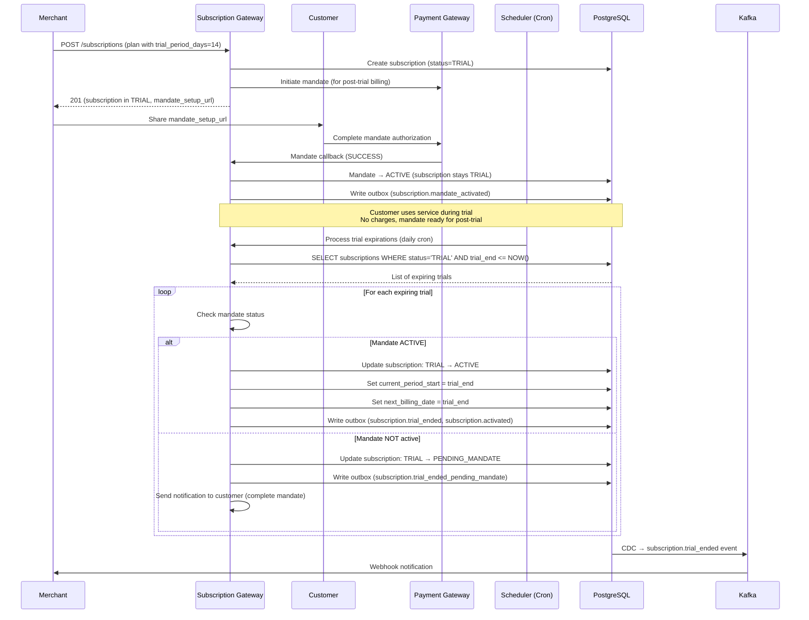

# 04 — Subscription Creation Workflow

> End-to-end subscription onboarding — from plan creation to active subscription with mandate

---

## Functional Overview

The subscription creation workflow encompasses four core stages:

1. **Plan Creation** — Merchant defines pricing, billing model, intervals, trial periods, and feature entitlements
2. **Subscription Creation** — Merchant creates a subscription linking a customer to a plan, triggering mandate setup
3. **Mandate Setup Completion** — Customer completes payment authorization (UPI Autopay / eNACH / Card-on-file), subscription activates
4. **Trial Handling** — Optional trial period where subscription is active without billing, transitioning to paid at trial end

Each stage produces CDC events via the transactional outbox pattern, ensuring downstream systems (webhooks, analytics, billing scheduler) remain eventually consistent.

---

## Flow 1: Create Plan

### Functional Sequence



### Technical Sequence



### Request/Response Examples

**Request:**

```json
POST /api/subscriptions/v1/plans
Host: api.pluralpay.in
Authorization: Bearer {merchant_access_token}
Content-Type: application/json
X-Idempotency-Key: idem_plan_abc123

{
  "name": "Pro Monthly",
  "description": "Professional plan with all features",
  "billing_model": "FIXED",
  "interval": {
    "unit": "MONTH",
    "count": 1
  },
  "prices": [
    {
      "currency": "INR",
      "amount": 99900,
      "pricing_model": "FLAT"
    }
  ],
  "trial_period_days": 14,
  "features": {
    "api_calls": 50000,
    "storage_gb": 100
  },
  "cancellation_policy": "END_OF_TERM",
  "prorate_on_change": true,
  "max_quantity": 100,
  "setup_fee": {
    "currency": "INR",
    "amount": 0
  },
  "metadata": {
    "tier": "professional"
  }
}
```

**Response (201 Created):**

```json
{
  "id": "plan_01HQ3K5V7XJHG2BNMW9RTCFP4N",
  "name": "Pro Monthly",
  "description": "Professional plan with all features",
  "billing_model": "FIXED",
  "interval": {
    "unit": "MONTH",
    "count": 1
  },
  "prices": [
    {
      "id": "price_01HQ3K5V8YJHG2BNMW9RTCFP5M",
      "currency": "INR",
      "amount": 99900,
      "pricing_model": "FLAT"
    }
  ],
  "trial_period_days": 14,
  "features": {
    "api_calls": 50000,
    "storage_gb": 100
  },
  "cancellation_policy": "END_OF_TERM",
  "prorate_on_change": true,
  "max_quantity": 100,
  "setup_fee": {
    "currency": "INR",
    "amount": 0
  },
  "status": "ACTIVE",
  "merchant_id": "merch_01HQ3K5V7XJHG2BNMW9RTCFP4N",
  "created_at": "2024-01-15T10:30:00Z",
  "updated_at": "2024-01-15T10:30:00Z",
  "metadata": {
    "tier": "professional"
  }
}
```

---

## Flow 2: Create Subscription

### Functional Sequence



### Technical Sequence



### Request/Response Examples

**Request:**

```json
POST /api/subscriptions/v1/subscriptions
Host: api.pluralpay.in
Authorization: Bearer {merchant_access_token}
Content-Type: application/json
X-Idempotency-Key: idem_sub_xyz789

{
  "plan_id": "plan_01HQ3K5V7XJHG2BNMW9RTCFP4N",
  "customer": {
    "id": "cust_01HQ3K5V7XJHG2BNMW9RTCFP4N",
    "email": "customer@example.com",
    "phone": "+919876543210"
  },
  "payment_method": "UPI_AUTOPAY",
  "start_date": "2024-02-01",
  "metadata": {
    "source": "website",
    "campaign": "onboarding_q1"
  },
  "quantity": 1,
  "coupon_id": "cpn_welcome20",
  "notification_preferences": {
    "channels": ["EMAIL", "SMS", "WHATSAPP"],
    "pre_debit_hours": 24
  }
}
```

**Response (201 Created):**

```json
{
  "id": "sub_01HQ4M7X9ZJHG2BNMW9RTCFP6Q",
  "plan_id": "plan_01HQ3K5V7XJHG2BNMW9RTCFP4N",
  "customer_id": "cust_01HQ3K5V7XJHG2BNMW9RTCFP4N",
  "status": "PENDING_MANDATE",
  "payment_method": "UPI_AUTOPAY",
  "quantity": 1,
  "start_date": "2024-02-01",
  "current_period_start": null,
  "current_period_end": null,
  "trial_start": null,
  "trial_end": null,
  "billing_anchor_date": "2024-02-01",
  "next_billing_date": "2024-02-01",
  "mandate": {
    "id": "mdt_01HQ4M7X9ZJHG2BNMW9RTCFP7R",
    "status": "INITIATED",
    "payment_method": "UPI_AUTOPAY",
    "max_amount": 99900,
    "frequency": "MONTHLY",
    "valid_from": "2024-02-01",
    "valid_until": "2025-02-01",
    "mandate_setup_url": "https://pay.pluralpay.in/mandate/setup/mdt_01HQ4M7X9ZJHG2BNMW9RTCFP7R"
  },
  "coupon": {
    "id": "cpn_welcome20",
    "discount_type": "PERCENTAGE",
    "discount_value": 20,
    "applied_amount": 79920
  },
  "upcoming_invoices": [
    {
      "billing_date": "2024-02-01",
      "amount": 79920,
      "currency": "INR",
      "pre_debit_notification_date": "2024-01-31T00:00:00Z"
    }
  ],
  "metadata": {
    "source": "website",
    "campaign": "onboarding_q1"
  },
  "created_at": "2024-01-15T14:20:00Z",
  "updated_at": "2024-01-15T14:20:00Z"
}
```

---

## Flow 3: Mandate Setup Completion (Callback)

### Functional Sequence



### Technical Sequence



### Callback Payload (from Payment Gateway)

```json
{
  "callback_id": "cb_01HQ5N8Y0AKJG3CNMX0SUDGQ8S",
  "mandate_reference": "mdt_01HQ4M7X9ZJHG2BNMW9RTCFP7R",
  "external_mandate_id": "NACH000001234567",
  "status": "SUCCESS",
  "payment_method": "UPI_AUTOPAY",
  "umn": "customer@upi-autopay-ref",
  "max_amount": 99900,
  "frequency": "MONTHLY",
  "valid_from": "2024-02-01",
  "valid_until": "2025-02-01",
  "completed_at": "2024-01-16T09:45:00Z",
  "signature": "hmac_sha256_signature_here"
}
```

---

## Flow 4: Subscription with Free Trial

### Functional Sequence



### Trial State Transitions

```
TRIAL ──[trial_end reached + mandate ACTIVE]──→ ACTIVE
TRIAL ──[trial_end reached + mandate NOT ready]──→ PENDING_MANDATE
TRIAL ──[merchant cancels]──→ CANCELLED
TRIAL ──[customer cancels]──→ CANCELLED (immediate, no charge)
```

### Trial Timeline Example

```
Day 0 (Jan 15): Subscription created → status=TRIAL, trial_end=Jan 29
Day 0-1:        Customer completes mandate setup → mandate=ACTIVE
Day 1-14:       Customer uses service (no charges)
Day 14 (Jan 29): Trial ends
                  → subscription transitions to ACTIVE
                  → current_period_start = Jan 29
                  → current_period_end = Feb 28
                  → first billing/debit on Jan 29
```

---

## Validation Rules

| # | Rule | Field(s) | Error Code | Description |
|---|------|-----------|------------|-------------|
| 1 | Plan must be ACTIVE | `plan_id` | `PLAN_INACTIVE` | Cannot create subscription on archived/draft/inactive plans |
| 2 | Merchant subscription feature enabled | `merchant_id` | `FEATURE_NOT_ENABLED` | Merchant must have subscription module activated in their config |
| 3 | Customer contact required | `customer.email` or `customer.phone` | `CUSTOMER_CONTACT_REQUIRED` | At least one contact channel needed for notifications |
| 4 | No duplicate active subscription | `customer_id` + `plan_id` | `DUPLICATE_SUBSCRIPTION` | Same customer cannot have two active subscriptions on the same plan |
| 5 | Payment method supported | `payment_method` + plan currency | `PAYMENT_METHOD_UNSUPPORTED` | UPI Autopay only for INR; eNACH only for INR; Card-on-file for INR/USD |
| 6 | Trial period within plan max | `trial_period_days` | `TRIAL_PERIOD_EXCEEDED` | Request trial cannot exceed plan's configured max trial days |
| 7 | Quantity >= 1 | `quantity` | `INVALID_QUANTITY` | Must be positive integer, cannot exceed plan's `max_quantity` |
| 8 | Coupon valid and applicable | `coupon_id` | `COUPON_INVALID` | Coupon must exist, not expired, applicable to plan, within usage limits |
| 9 | Start date not in past | `start_date` | `INVALID_START_DATE` | Must be today or future date |
| 10 | Customer not blocked | `customer_id` | `CUSTOMER_BLOCKED` | Customer must not be in blocked/fraud state |
| 11 | Merchant not rate-limited | — | `RATE_LIMIT_EXCEEDED` | Per-merchant rate limit on subscription creation (100/min default) |
| 12 | Plan currency matches customer region | `plan.prices[].currency` | `CURRENCY_MISMATCH` | Customer region must support the plan's currency |

---

## Idempotency

### Mechanism

Subscription creation is protected by idempotency keys to prevent duplicate subscriptions from retry scenarios (network timeouts, client retries).

### Implementation

```kotlin
class IdempotencyInterceptor(
    private val redis: RedisClient,
    private val objectMapper: ObjectMapper
) {
    companion object {
        private const val TTL_SECONDS = 86400L // 24 hours
        private const val PREFIX = "idempotency:"
    }

    suspend fun <T> execute(
        idempotencyKey: String,
        block: suspend () -> T
    ): IdempotencyResult<T> {
        val redisKey = "$PREFIX$idempotencyKey"

        // Attempt to acquire idempotency lock
        val acquired = redis.setNx(redisKey, "processing", TTL_SECONDS)

        if (!acquired) {
            // Key exists — check if completed or in-progress
            val cached = redis.get(redisKey)
            return when {
                cached == "processing" -> IdempotencyResult.InProgress()
                cached != null -> IdempotencyResult.Cached(objectMapper.readValue(cached))
                else -> IdempotencyResult.Expired()
            }
        }

        return try {
            val result = block()
            // Store successful response
            redis.set(redisKey, objectMapper.writeValueAsString(result), TTL_SECONDS)
            IdempotencyResult.New(result)
        } catch (e: Exception) {
            // Remove key on failure so retry can proceed
            redis.del(redisKey)
            throw e
        }
    }
}
```

### Key Rules

1. **Key Source**: Merchant provides `X-Idempotency-Key` header (required for POST endpoints)
2. **Key Scope**: Scoped per merchant — `idempotency:{merchant_id}:{key}`
3. **TTL**: 24 hours from first request
4. **Collision Handling**: If key exists with `processing` state, return `409 Conflict` with retry-after header
5. **Failure Cleanup**: On error, key is deleted so merchant can retry with same key
6. **Response Matching**: Cached response includes original HTTP status code and headers

---

## Error Handling

| Scenario | HTTP Code | Error Code | Error Message | Recovery Action |
|----------|-----------|------------|---------------|-----------------|
| Plan not found | 404 | `PLAN_NOT_FOUND` | Plan with id {plan_id} not found | Merchant should verify plan_id |
| Plan inactive | 400 | `PLAN_INACTIVE` | Plan {plan_id} is not active | Merchant should use an active plan |
| Customer creation failed | 500 | `CUSTOMER_CREATION_FAILED` | Unable to create customer record | Retry with backoff |
| Mandate initiation failed | 502 | `MANDATE_INITIATION_FAILED` | Payment gateway mandate registration failed | Retry; subscription created as PENDING_MANDATE |
| Duplicate subscription | 409 | `DUPLICATE_SUBSCRIPTION` | Active subscription already exists for this customer and plan | Return existing subscription |
| Invalid payment method | 400 | `INVALID_PAYMENT_METHOD` | {payment_method} not supported for currency {currency} | Use supported payment method |
| Rate limit exceeded | 429 | `RATE_LIMIT_EXCEEDED` | Too many requests. Retry after {n} seconds | Retry after indicated delay |
| Internal service failure | 500 | `INTERNAL_ERROR` | An unexpected error occurred | Retry with exponential backoff |
| Merchant service unavailable | 503 | `MERCHANT_SERVICE_UNAVAILABLE` | Unable to verify merchant configuration | Retry with backoff |
| Idempotency conflict | 409 | `IDEMPOTENCY_CONFLICT` | Request with this idempotency key is already being processed | Wait and retry |
| Coupon expired | 400 | `COUPON_EXPIRED` | Coupon {coupon_id} has expired | Remove coupon or use valid one |
| Coupon usage limit reached | 400 | `COUPON_LIMIT_REACHED` | Coupon has reached maximum usage | Use different coupon |
| Lock acquisition timeout | 503 | `CONCURRENT_REQUEST` | Another request for this customer is being processed | Retry after 1-2 seconds |

### Error Response Format

```json
{
  "error": {
    "code": "DUPLICATE_SUBSCRIPTION",
    "message": "Active subscription already exists for this customer and plan",
    "details": {
      "existing_subscription_id": "sub_01HQ4M7X9ZJHG2BNMW9RTCFP6Q",
      "customer_id": "cust_01HQ3K5V7XJHG2BNMW9RTCFP4N",
      "plan_id": "plan_01HQ3K5V7XJHG2BNMW9RTCFP4N"
    },
    "request_id": "req_01HQ5N8Y0AKJG3CNMX0SUDGQ8S"
  }
}
```

---

## Billing Schedule Computation

### Algorithm

```kotlin
fun computeBillingSchedule(
    subscription: Subscription,
    plan: Plan,
    count: Int = 12
): List<BillingScheduleEntry> {
    val anchorDate: LocalDate = when {
        subscription.trialEndDate != null -> subscription.trialEndDate
        else -> subscription.startDate
    }

    val entries = mutableListOf<BillingScheduleEntry>()
    var currentDate = anchorDate

    for (i in 0 until count) {
        val preDebitDate = currentDate.minusHours(24)
        val periodEnd = advanceByInterval(currentDate, plan.interval)

        entries.add(
            BillingScheduleEntry(
                subscriptionId = subscription.id,
                sequenceNumber = i + 1,
                billingDate = currentDate,
                periodStart = currentDate,
                periodEnd = periodEnd.minusDays(1),
                amount = computeAmount(subscription, plan),
                currency = plan.prices.first().currency,
                preDebitNotificationDate = preDebitDate,
                status = if (i == 0) "UPCOMING" else "SCHEDULED"
            )
        )

        currentDate = periodEnd
    }

    return entries
}

/**
 * Advances a date by the plan interval, handling month-end anchoring.
 *
 * Rules:
 * - If anchor day > days in target month, use last day of target month
 * - Preserves the "anchor day" concept across all months
 * - Example: Jan 31 → Feb 28 → Mar 31 → Apr 30
 */
fun advanceByInterval(
    date: LocalDate,
    interval: BillingInterval,
    anchorDay: Int = date.dayOfMonth
): LocalDate {
    return when (interval.unit) {
        IntervalUnit.DAY -> date.plusDays(interval.count.toLong())
        IntervalUnit.WEEK -> date.plusWeeks(interval.count.toLong())
        IntervalUnit.MONTH -> {
            val targetMonth = date.plusMonths(interval.count.toLong())
            val maxDay = targetMonth.lengthOfMonth()
            targetMonth.withDayOfMonth(minOf(anchorDay, maxDay))
        }
        IntervalUnit.YEAR -> {
            val targetYear = date.plusYears(interval.count.toLong())
            val maxDay = targetYear.lengthOfMonth()
            targetYear.withDayOfMonth(minOf(anchorDay, maxDay))
        }
    }
}

fun computeAmount(subscription: Subscription, plan: Plan): Long {
    val baseAmount = when (plan.billingModel) {
        BillingModel.FIXED -> plan.prices.first().amount
        BillingModel.PER_UNIT -> plan.prices.first().amount * subscription.quantity
        else -> plan.prices.first().amount // Tiered/Volume computed separately
    }

    return subscription.coupon?.let { coupon ->
        when (coupon.discountType) {
            DiscountType.PERCENTAGE -> baseAmount - (baseAmount * coupon.value / 100)
            DiscountType.FIXED -> maxOf(0, baseAmount - coupon.value)
        }
    } ?: baseAmount
}
```

### Example: Monthly Subscription Starting Jan 15

| # | Billing Date | Period Start | Period End | Pre-Debit Notification |
|---|---|---|---|---|
| 1 | 2024-01-15 | 2024-01-15 | 2024-02-14 | 2024-01-14T00:00:00Z |
| 2 | 2024-02-15 | 2024-02-15 | 2024-03-14 | 2024-02-14T00:00:00Z |
| 3 | 2024-03-15 | 2024-03-15 | 2024-04-14 | 2024-03-14T00:00:00Z |
| 4 | 2024-04-15 | 2024-04-15 | 2024-05-14 | 2024-04-14T00:00:00Z |

### Example: Month-End Anchoring (Jan 31 Start)

| # | Billing Date | Period Start | Period End | Note |
|---|---|---|---|---|
| 1 | 2024-01-31 | 2024-01-31 | 2024-02-28 | Anchor day = 31 |
| 2 | 2024-02-29 | 2024-02-29 | 2024-03-30 | Feb 2024 is leap year, min(31, 29) = 29 |
| 3 | 2024-03-31 | 2024-03-31 | 2024-04-29 | March has 31 days |
| 4 | 2024-04-30 | 2024-04-30 | 2024-05-30 | April has 30 days, min(31, 30) = 30 |
| 5 | 2024-05-31 | 2024-05-31 | 2024-06-29 | May has 31 days |

### Pre-Debit Notification Timing

Per RBI mandate guidelines:
- **UPI Autopay**: Notification must be sent at least 24 hours before debit
- **eNACH**: Notification must be sent at least 24 hours before debit
- **Card-on-file**: Notification 24 hours prior (AFA exemption for recurring)

The `pre_debit_notification_date` is computed as `billing_date - 24 hours` and stored alongside each billing schedule entry. The notification scheduler picks these up and dispatches SMS/Email/WhatsApp notifications to the customer.

---

## CDC Event Flow (Outbox → Debezium → Kafka)

All state changes produce events via the transactional outbox pattern:

```
PostgreSQL (outbox table INSERT)
    → Debezium CDC connector (polls WAL)
        → Kafka topic: subscription.events
            → Webhook Service (delivers to merchant)
            → Analytics Service (tracks metrics)
            → Billing Scheduler (schedules debits)
```

### Event Types Produced

| Event | Trigger | Key Payload Fields |
|-------|---------|-------------------|
| `subscription.created` | Subscription record created | subscription_id, plan_id, customer_id, status |
| `subscription.activated` | Mandate confirmed, subscription active | subscription_id, activated_at, next_billing_date |
| `subscription.trial_started` | Subscription enters trial | subscription_id, trial_end |
| `subscription.trial_ended` | Trial period expired | subscription_id, transitioned_to_status |
| `subscription.mandate_failed` | Mandate setup failed | subscription_id, failure_reason |
| `plan.created` | New plan created | plan_id, merchant_id |
