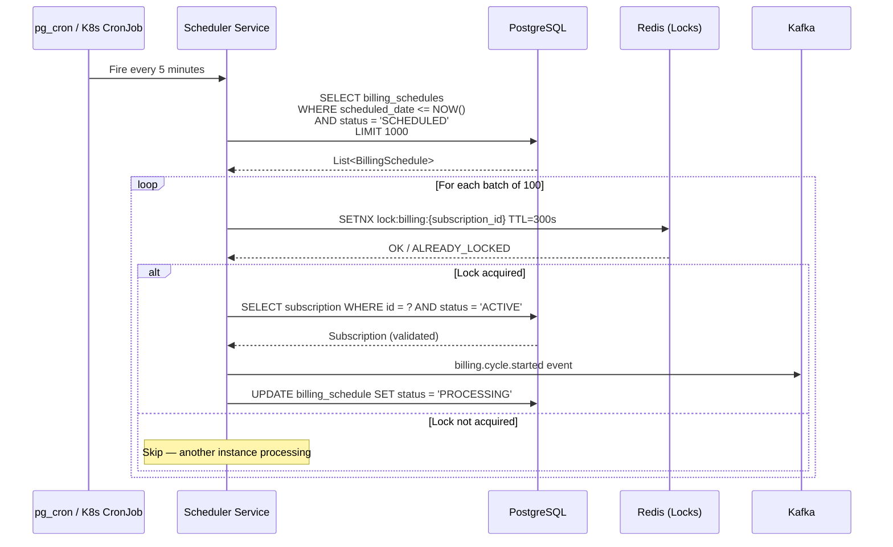
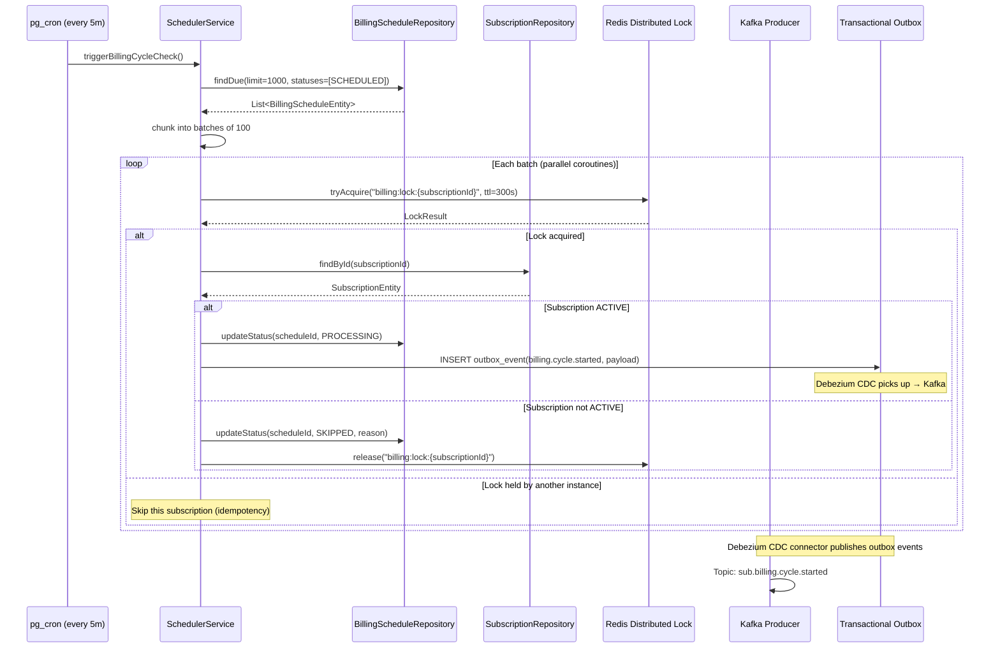
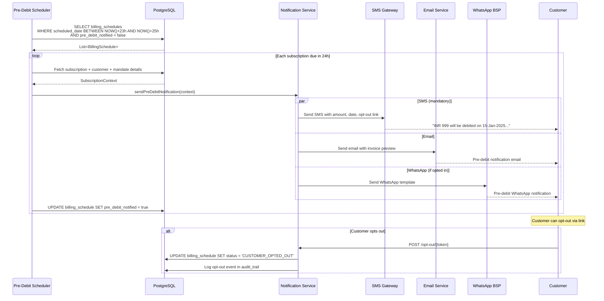
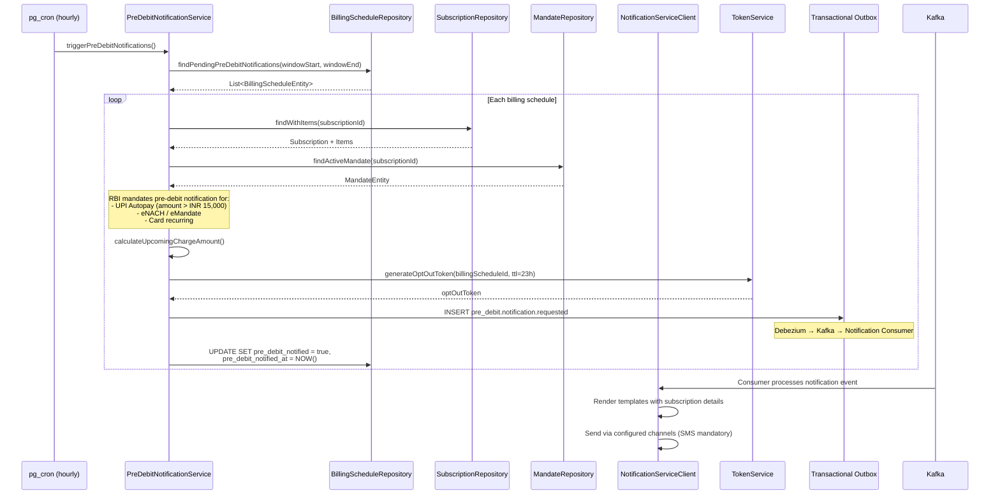
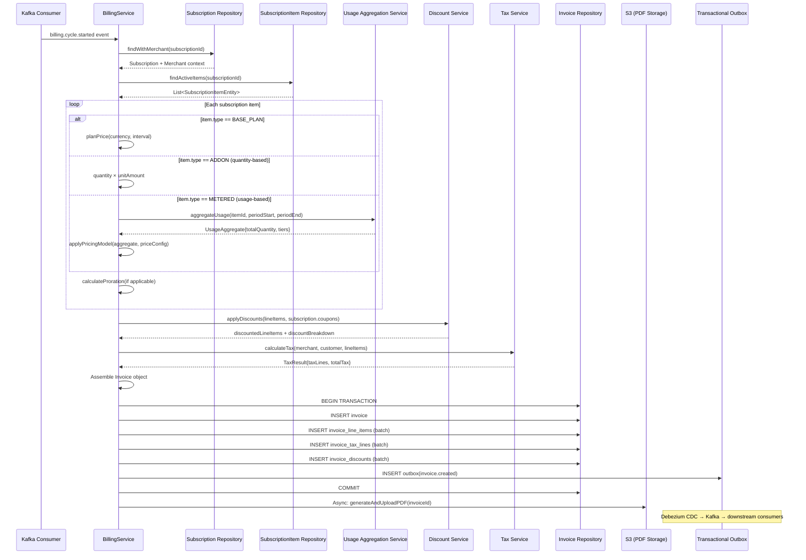
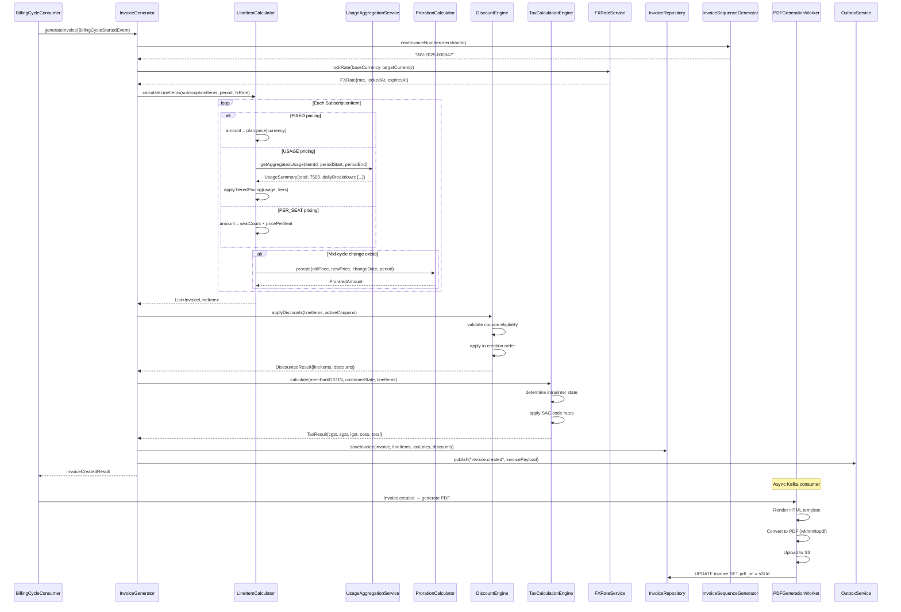
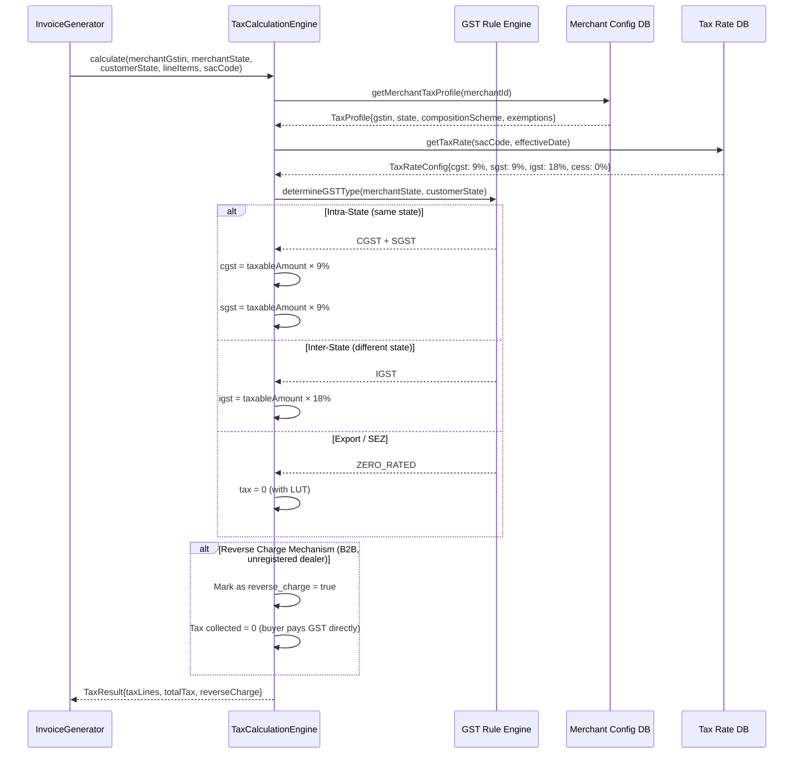
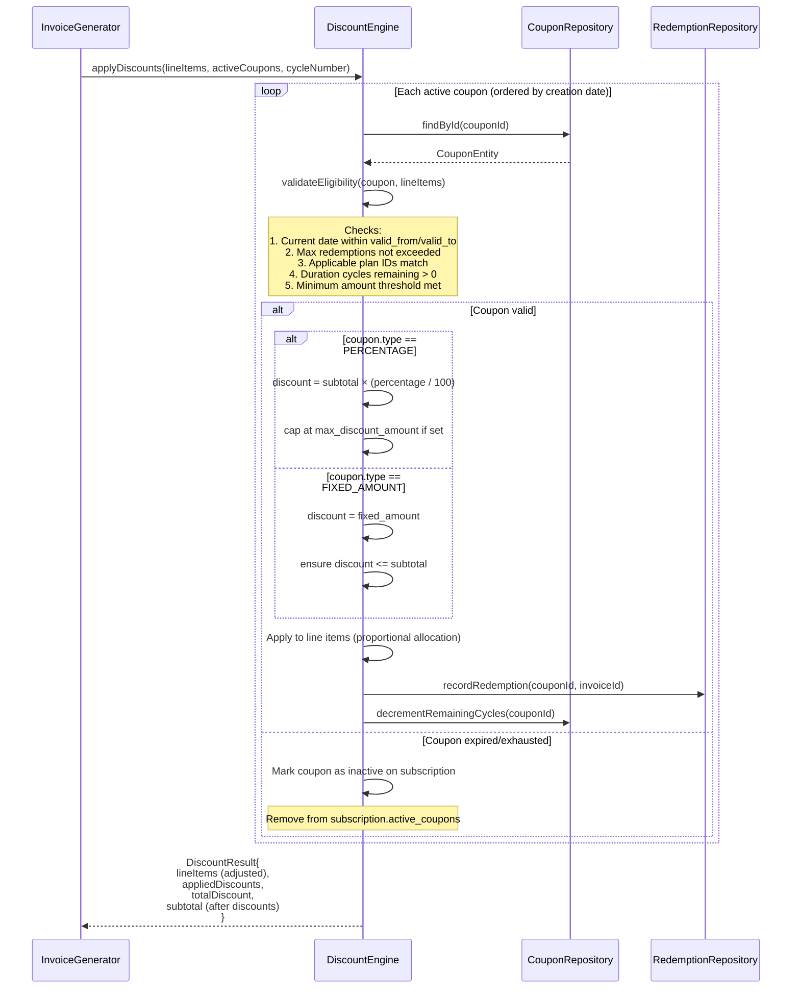
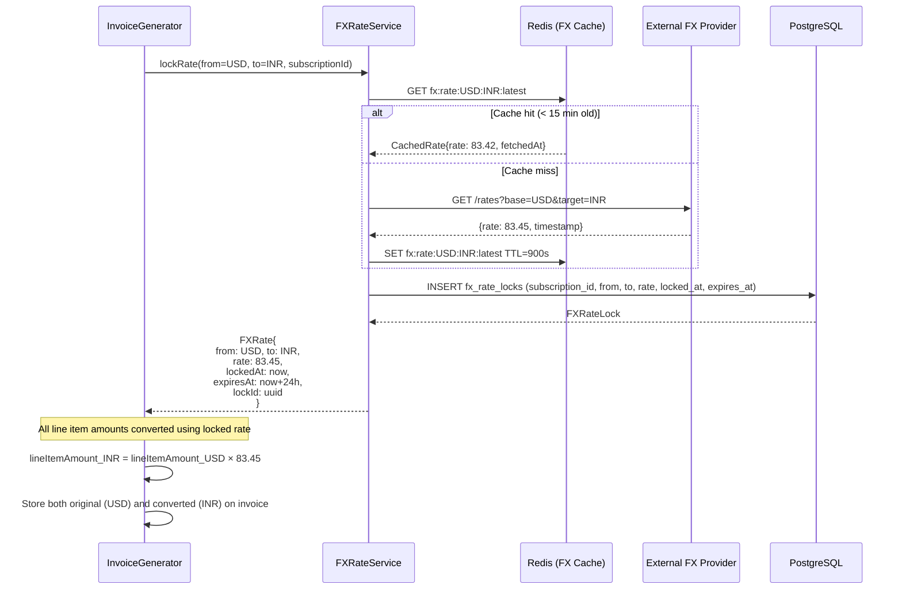
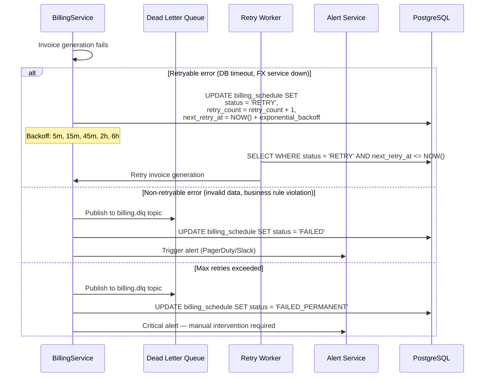

# 05 — Billing & Invoice Workflow

> Automated billing cycle execution — from schedule trigger to invoice generation and tax calculation

---

## Functional Overview

The billing workflow executes on schedule:

1. **Scheduler** identifies subscriptions due for billing
2. **Pre-debit notification** sent 24h before (RBI compliance for UPI Autopay / eNACH)
3. **Invoice generated** with line items (plan + addons + usage + tax − discounts)
4. **Invoice transitions** to `OPEN` status ready for payment collection

### High-Level State Machine

```
SCHEDULED → PRE_DEBIT_NOTIFIED → INVOICE_CREATED → OPEN → PAYMENT_PENDING → PAID
                                                                          ↘ FAILED → RETRY
                 ↘ CUSTOMER_OPTED_OUT (terminal)
```

---

## Flow 1: Billing Cycle Trigger

### Functional Sequence



### Technical Sequence



### Batch Processing Logic

```kotlin
@Service
class BillingCycleScheduler(
    private val billingScheduleRepo: BillingScheduleRepository,
    private val subscriptionRepo: SubscriptionRepository,
    private val redisLockService: RedisDistributedLockService,
    private val outboxService: OutboxService,
    private val meterRegistry: MeterRegistry
) {
    companion object {
        private const val BATCH_SIZE = 1000
        private const val CONCURRENCY = 100
        private const val LOCK_TTL_SECONDS = 300L
        private val logger = LoggerFactory.getLogger(BillingCycleScheduler::class.java)
    }

    suspend fun processDueBillingCycles() {
        val startTime = System.currentTimeMillis()
        val dueCycles = billingScheduleRepo.findDue(
            scheduledDateBefore = Instant.now(),
            statuses = listOf(BillingScheduleStatus.SCHEDULED),
            limit = BATCH_SIZE
        )

        logger.info("Found ${dueCycles.size} billing cycles due for processing")
        meterRegistry.gauge("billing.cycles.due", dueCycles.size.toDouble())

        val results = dueCycles.chunked(CONCURRENCY).flatMap { batch ->
            coroutineScope {
                batch.map { cycle ->
                    async(Dispatchers.IO + SupervisorJob()) {
                        processSingleCycle(cycle)
                    }
                }.awaitAll()
            }
        }

        val succeeded = results.count { it.isSuccess }
        val failed = results.count { it.isFailure }

        meterRegistry.counter("billing.cycles.processed", "status", "success").increment(succeeded.toDouble())
        meterRegistry.counter("billing.cycles.processed", "status", "failure").increment(failed.toDouble())

        logger.info("Billing cycle processing complete: $succeeded succeeded, $failed failed in ${System.currentTimeMillis() - startTime}ms")
    }

    private suspend fun processSingleCycle(cycle: BillingScheduleEntity): Result<Unit> = runCatching {
        val lockKey = "billing:lock:${cycle.subscriptionId}"

        val lock = redisLockService.tryAcquire(lockKey, Duration.ofSeconds(LOCK_TTL_SECONDS))
            ?: return Result.success(Unit) // Already locked, skip

        try {
            val subscription = subscriptionRepo.findById(cycle.subscriptionId)
                ?: throw BillingException("Subscription ${cycle.subscriptionId} not found")

            if (subscription.status != SubscriptionStatus.ACTIVE) {
                billingScheduleRepo.updateStatus(
                    id = cycle.id,
                    status = BillingScheduleStatus.SKIPPED,
                    reason = "Subscription status: ${subscription.status}"
                )
                return Result.success(Unit)
            }

            // Transactional: update schedule + insert outbox event
            billingScheduleRepo.transactional {
                billingScheduleRepo.updateStatus(cycle.id, BillingScheduleStatus.PROCESSING)
                outboxService.publish(
                    aggregateType = "BillingCycle",
                    aggregateId = cycle.id.toString(),
                    eventType = "billing.cycle.started",
                    payload = BillingCycleStartedEvent(
                        billingScheduleId = cycle.id,
                        subscriptionId = cycle.subscriptionId,
                        merchantId = subscription.merchantId,
                        periodStart = cycle.periodStart,
                        periodEnd = cycle.periodEnd,
                        scheduledDate = cycle.scheduledDate
                    )
                )
            }
        } finally {
            redisLockService.release(lock)
        }
    }
}
```

### Scheduler Configuration

```kotlin
// pg_cron setup (applied via Flyway migration)
// V42__create_billing_scheduler_cron.sql
/*
SELECT cron.schedule(
    'billing-cycle-trigger',
    '*/5 * * * *',  -- every 5 minutes
    $$SELECT net.http_post(
        url := 'http://nxt-subscription-gateway-service:8080/internal/billing/trigger',
        headers := '{"X-Internal-Auth": "scheduler-token"}'::jsonb
    )$$
);
*/

// Route handler
fun Route.billingSchedulerRoutes(billingCycleScheduler: BillingCycleScheduler) {
    route("/internal/billing") {
        post("/trigger") {
            call.requireInternalAuth()
            billingCycleScheduler.processDueBillingCycles()
            call.respond(HttpStatusCode.Accepted)
        }
    }
}
```

---

## Flow 2: Pre-Debit Notification (RBI Compliance)

### Functional Sequence



### Technical Sequence



### Pre-Debit Notification Content

```kotlin
data class PreDebitNotificationPayload(
    val subscriptionId: UUID,
    val merchantId: UUID,
    val customerId: UUID,
    val mandateType: MandateType,           // UPI_AUTOPAY, ENACH, CARD_RECURRING
    val mandateUrn: String,
    val debitAmount: Money,                  // Amount to be charged
    val debitDate: LocalDate,               // Scheduled debit date
    val subscriptionName: String,           // Human-readable plan name
    val merchantName: String,
    val optOutLink: String,                 // URL with signed token
    val channels: List<NotificationChannel> // SMS (mandatory) + optional
)

// RBI-compliant SMS template
// "Dear Customer, INR {amount} will be debited from your {mandateType} 
// mandate (UMN: {urn}) on {date} for {merchantName} - {planName}. 
// To stop: {optOutLink}. -Plural"
```

### Opt-Out Handling

```kotlin
suspend fun handleOptOut(token: String): OptOutResult {
    val decoded = tokenService.validateOptOutToken(token)
        ?: throw InvalidTokenException("Expired or invalid opt-out token")

    val schedule = billingScheduleRepo.findById(decoded.billingScheduleId)
        ?: throw NotFoundException("Billing schedule not found")

    if (schedule.status != BillingScheduleStatus.SCHEDULED) {
        return OptOutResult.AlreadyProcessed
    }

    billingScheduleRepo.transactional {
        billingScheduleRepo.updateStatus(
            id = schedule.id,
            status = BillingScheduleStatus.CUSTOMER_OPTED_OUT,
            reason = "Customer opted out via pre-debit notification"
        )

        auditTrailRepo.insert(
            AuditEntry(
                entityType = "BillingSchedule",
                entityId = schedule.id,
                action = "CUSTOMER_OPT_OUT",
                actorType = ActorType.CUSTOMER,
                actorId = decoded.customerId,
                metadata = mapOf("channel" to "pre_debit_link", "timestamp" to Instant.now().toString())
            )
        )

        outboxService.publish(
            aggregateType = "BillingCycle",
            aggregateId = schedule.id.toString(),
            eventType = "billing.cycle.opted_out",
            payload = BillingCycleOptedOutEvent(
                billingScheduleId = schedule.id,
                subscriptionId = schedule.subscriptionId,
                customerId = decoded.customerId,
                reason = "CUSTOMER_PRE_DEBIT_OPT_OUT"
            )
        )
    }

    return OptOutResult.Success
}
```

---

## Flow 3: Invoice Generation

### Functional Sequence



### Technical Sequence (Detailed)



### Invoice Line Item Calculation

#### Fixed Recurring Example

```
┌─────────────────────────────────────────────────────┐
│ INVOICE #INV-2025-000847                            │
│ Period: 01-Jan-2025 to 31-Jan-2025                  │
├─────────────────────────────────────────────────────┤
│ Line Items:                                         │
│                                                     │
│ 1. Pro Monthly Plan                  INR    999.00  │
│ 2. Extra Storage (5 units × ₹99)     INR    495.00  │
│                                      ───────────── │
│    Subtotal                          INR  1,494.00  │
│                                                     │
│ Discounts:                                          │
│ - WELCOME20 (20% off, 2/3 cycles)   INR   -298.80  │
│                                      ───────────── │
│    Taxable Amount                    INR  1,195.20  │
│                                                     │
│ Tax (GST 18%):                                      │
│ - CGST (9%)                          INR    107.57  │
│ - SGST (9%)                          INR    107.57  │
│                                      ───────────── │
│    TOTAL                             INR  1,410.34  │
└─────────────────────────────────────────────────────┘
```

#### Usage-Based (Tiered Pricing) Example

```
┌─────────────────────────────────────────────────────┐
│ INVOICE #INV-2025-000848                            │
│ Period: 01-Jan-2025 to 31-Jan-2025                  │
├─────────────────────────────────────────────────────┤
│ Usage: API Calls — Total: 7,500                     │
│                                                     │
│ Tier 1:    0 – 1,000  @ ₹0.05/call  INR     50.00  │
│ Tier 2: 1,001 – 5,000 @ ₹0.04/call  INR    160.00  │
│ Tier 3: 5,001 – 7,500 @ ₹0.03/call  INR     75.00  │
│                                      ───────────── │
│    Usage Total                       INR    285.00  │
│                                                     │
│ Tax (IGST 18%):                                     │
│ - IGST                               INR     51.30  │
│                                      ───────────── │
│    TOTAL                             INR    336.30  │
└─────────────────────────────────────────────────────┘
```

#### Hybrid (Fixed + Usage Overage) Example

```
┌─────────────────────────────────────────────────────┐
│ INVOICE #INV-2025-000849                            │
│ Period: 01-Jan-2025 to 31-Jan-2025                  │
├─────────────────────────────────────────────────────┤
│ 1. Starter Plan (incl. 1,000 calls)  INR    999.00  │
│ 2. Overage: 4,500 calls × ₹0.02     INR     90.00  │
│                                      ───────────── │
│    Subtotal                          INR  1,089.00  │
│                                                     │
│ Tax (GST 18%):                                      │
│ - CGST (9%)                          INR     98.01  │
│ - SGST (9%)                          INR     98.01  │
│                                      ───────────── │
│    TOTAL                             INR  1,285.02  │
└─────────────────────────────────────────────────────┘
```

### Core Invoice Generation Code

```kotlin
class InvoiceGenerator(
    private val lineItemCalculator: LineItemCalculator,
    private val discountEngine: DiscountEngine,
    private val taxEngine: TaxCalculationEngine,
    private val fxRateService: FXRateService,
    private val invoiceRepo: InvoiceRepository,
    private val outboxService: OutboxService,
    private val sequenceGenerator: InvoiceSequenceGenerator
) {
    suspend fun generateInvoice(
        subscription: SubscriptionEntity,
        billingCycle: BillingScheduleEntity,
        merchant: MerchantContext
    ): Invoice {
        // 1. Generate sequential invoice number
        val invoiceNumber = sequenceGenerator.next(merchant.id)

        // 2. Lock FX rate if multi-currency
        val fxRate = if (subscription.currency != merchant.baseCurrency) {
            fxRateService.lockRate(
                from = merchant.baseCurrency,
                to = subscription.currency,
                ttl = Duration.ofHours(24)
            )
        } else null

        // 3. Calculate line items
        val lineItems = lineItemCalculator.calculate(
            items = subscription.items,
            periodStart = billingCycle.periodStart,
            periodEnd = billingCycle.periodEnd,
            currency = subscription.currency,
            fxRate = fxRate
        )

        // 4. Apply discounts
        val discountResult = discountEngine.apply(
            lineItems = lineItems,
            coupons = subscription.activeCoupons,
            billingCycleNumber = billingCycle.cycleNumber
        )

        // 5. Calculate tax
        val taxResult = taxEngine.calculate(
            merchantGstin = merchant.gstin,
            merchantState = merchant.state,
            customerState = subscription.customer.state,
            lineItems = discountResult.lineItems,
            sacCode = subscription.plan.sacCode
        )

        // 6. Assemble invoice
        val invoice = Invoice(
            id = UUID.randomUUID(),
            number = invoiceNumber,
            subscriptionId = subscription.id,
            merchantId = merchant.id,
            customerId = subscription.customerId,
            status = InvoiceStatus.OPEN,
            currency = subscription.currency,
            periodStart = billingCycle.periodStart,
            periodEnd = billingCycle.periodEnd,
            subtotal = discountResult.subtotal,
            discountTotal = discountResult.totalDiscount,
            taxTotal = taxResult.totalTax,
            total = discountResult.subtotal + taxResult.totalTax,
            lineItems = discountResult.lineItems,
            taxLines = taxResult.taxLines,
            discounts = discountResult.appliedDiscounts,
            fxRate = fxRate?.rate,
            fxRateLockedAt = fxRate?.lockedAt,
            dueDate = billingCycle.scheduledDate.plus(merchant.paymentTermDays.toLong(), ChronoUnit.DAYS),
            createdAt = Instant.now()
        )

        // 7. Persist transactionally
        invoiceRepo.transactional {
            invoiceRepo.save(invoice)
            invoiceRepo.saveLineItems(invoice.id, invoice.lineItems)
            invoiceRepo.saveTaxLines(invoice.id, invoice.taxLines)
            invoiceRepo.saveDiscounts(invoice.id, invoice.discounts)

            outboxService.publish(
                aggregateType = "Invoice",
                aggregateId = invoice.id.toString(),
                eventType = "invoice.created",
                payload = InvoiceCreatedEvent(
                    invoiceId = invoice.id,
                    subscriptionId = subscription.id,
                    merchantId = merchant.id,
                    customerId = subscription.customerId,
                    amount = invoice.total,
                    currency = invoice.currency,
                    dueDate = invoice.dueDate
                )
            )
        }

        return invoice
    }
}
```

### Line Item Calculator

```kotlin
class LineItemCalculator(
    private val usageAggregationService: UsageAggregationService,
    private val prorationCalculator: ProrationCalculator
) {
    suspend fun calculate(
        items: List<SubscriptionItemEntity>,
        periodStart: Instant,
        periodEnd: Instant,
        currency: Currency,
        fxRate: FXRate?
    ): List<InvoiceLineItem> {
        return items.map { item ->
            when (item.pricingModel) {
                PricingModel.FIXED -> calculateFixed(item, currency, fxRate)
                PricingModel.USAGE -> calculateUsage(item, periodStart, periodEnd, currency)
                PricingModel.TIERED -> calculateTiered(item, periodStart, periodEnd, currency)
                PricingModel.VOLUME -> calculateVolume(item, periodStart, periodEnd, currency)
                PricingModel.PER_SEAT -> calculatePerSeat(item, currency)
                PricingModel.STAIRCASE -> calculateStaircase(item, periodStart, periodEnd, currency)
                PricingModel.HYBRID -> calculateHybrid(item, periodStart, periodEnd, currency)
            }
        }.flatten()
    }

    private fun calculateFixed(
        item: SubscriptionItemEntity,
        currency: Currency,
        fxRate: FXRate?
    ): List<InvoiceLineItem> {
        val baseAmount = item.price.getAmount(currency)
        val amount = fxRate?.convert(baseAmount) ?: baseAmount

        return listOf(
            InvoiceLineItem(
                id = UUID.randomUUID(),
                subscriptionItemId = item.id,
                description = item.name,
                quantity = BigDecimal.ONE,
                unitAmount = amount,
                amount = amount,
                type = LineItemType.PLAN
            )
        )
    }

    private suspend fun calculateTiered(
        item: SubscriptionItemEntity,
        periodStart: Instant,
        periodEnd: Instant,
        currency: Currency
    ): List<InvoiceLineItem> {
        val usage = usageAggregationService.aggregate(item.id, periodStart, periodEnd)
        val tiers = item.price.tiers.sortedBy { it.upTo }
        val lineItems = mutableListOf<InvoiceLineItem>()
        var remaining = usage.totalQuantity

        for (tier in tiers) {
            if (remaining <= 0) break
            val tierCapacity = (tier.upTo ?: Long.MAX_VALUE) - (tier.from ?: 0)
            val unitsInTier = minOf(remaining, tierCapacity)
            val tierAmount = BigDecimal(unitsInTier) * tier.unitAmount

            lineItems.add(
                InvoiceLineItem(
                    id = UUID.randomUUID(),
                    subscriptionItemId = item.id,
                    description = "${item.name} — Tier ${tier.from}-${tier.upTo ?: "∞"} @ ${tier.unitAmount}/unit",
                    quantity = BigDecimal(unitsInTier),
                    unitAmount = tier.unitAmount,
                    amount = tierAmount,
                    type = LineItemType.USAGE,
                    metadata = mapOf("tier" to tier.label, "usageTotal" to usage.totalQuantity.toString())
                )
            )
            remaining -= unitsInTier
        }

        return lineItems
    }

    private suspend fun calculateHybrid(
        item: SubscriptionItemEntity,
        periodStart: Instant,
        periodEnd: Instant,
        currency: Currency
    ): List<InvoiceLineItem> {
        val lineItems = mutableListOf<InvoiceLineItem>()

        // Fixed base component
        lineItems.add(
            InvoiceLineItem(
                id = UUID.randomUUID(),
                subscriptionItemId = item.id,
                description = "${item.name} — Base",
                quantity = BigDecimal.ONE,
                unitAmount = item.price.baseAmount,
                amount = item.price.baseAmount,
                type = LineItemType.PLAN
            )
        )

        // Usage overage
        val usage = usageAggregationService.aggregate(item.id, periodStart, periodEnd)
        val includedUnits = item.price.includedUnits ?: 0L
        val overage = maxOf(0L, usage.totalQuantity - includedUnits)

        if (overage > 0) {
            val overageAmount = BigDecimal(overage) * item.price.overageUnitPrice
            lineItems.add(
                InvoiceLineItem(
                    id = UUID.randomUUID(),
                    subscriptionItemId = item.id,
                    description = "${item.name} — Overage ($overage units above $includedUnits included)",
                    quantity = BigDecimal(overage),
                    unitAmount = item.price.overageUnitPrice,
                    amount = overageAmount,
                    type = LineItemType.USAGE_OVERAGE
                )
            )
        }

        return lineItems
    }
}
```

---

## Flow 4: Tax Calculation

### Tax Service Integration



### Tax Calculation Code

```kotlin
class TaxCalculationEngine(
    private val taxRateRepo: TaxRateRepository,
    private val merchantConfigRepo: MerchantConfigRepository
) {
    fun calculate(
        merchantGstin: String?,
        merchantState: IndianState,
        customerState: IndianState?,
        lineItems: List<InvoiceLineItem>,
        sacCode: String
    ): TaxResult {
        val taxRate = taxRateRepo.findBySacCode(sacCode, effectiveDate = LocalDate.now())
            ?: throw TaxConfigurationException("No tax rate found for SAC $sacCode")

        val taxableAmount = lineItems.sumOf { it.amount }
        val gstType = determineGSTType(merchantState, customerState)

        val taxLines = when (gstType) {
            GSTType.INTRA_STATE -> listOf(
                TaxLine(type = TaxType.CGST, rate = taxRate.cgstRate, amount = taxableAmount * taxRate.cgstRate),
                TaxLine(type = TaxType.SGST, rate = taxRate.sgstRate, amount = taxableAmount * taxRate.sgstRate)
            )
            GSTType.INTER_STATE -> listOf(
                TaxLine(type = TaxType.IGST, rate = taxRate.igstRate, amount = taxableAmount * taxRate.igstRate)
            )
            GSTType.ZERO_RATED -> emptyList()
            GSTType.EXEMPT -> emptyList()
        }

        val cessAmount = if (taxRate.cessRate > BigDecimal.ZERO) {
            taxableAmount * taxRate.cessRate
        } else BigDecimal.ZERO

        val totalTax = taxLines.sumOf { it.amount } + cessAmount

        return TaxResult(
            taxLines = taxLines,
            cessAmount = cessAmount,
            totalTax = totalTax,
            gstType = gstType,
            sacCode = sacCode,
            reverseCharge = false, // Set based on B2B rules
            merchantGstin = merchantGstin
        )
    }

    private fun determineGSTType(
        merchantState: IndianState,
        customerState: IndianState?
    ): GSTType {
        if (customerState == null) return GSTType.IGST // Export
        if (merchantState == customerState) return GSTType.INTRA_STATE
        return GSTType.INTER_STATE
    }
}
```

### GST Invoice Requirements

| Field | Required | Notes |
|-------|----------|-------|
| Supplier GSTIN | Yes | Merchant's GST registration number |
| Supplier Name & Address | Yes | Legal entity name |
| Invoice Number | Yes | Sequential, unique per financial year |
| Invoice Date | Yes | Date of supply |
| Recipient GSTIN | Conditional | If B2B and registered |
| HSN/SAC Code | Yes | Service Accounting Code |
| Taxable Value | Yes | Before tax amount |
| CGST/SGST or IGST | Yes | Split by rate |
| Total Tax | Yes | Sum of all tax components |
| Place of Supply | Yes | State code determining intra/inter |
| Reverse Charge | Yes | Y/N flag |

---

## Flow 5: Discount & Coupon Application

### Discount Application Sequence



### Discount Engine Code

```kotlin
class DiscountEngine(
    private val couponRepo: CouponRepository,
    private val redemptionRepo: CouponRedemptionRepository
) {
    fun apply(
        lineItems: List<InvoiceLineItem>,
        coupons: List<SubscriptionCoupon>,
        billingCycleNumber: Int
    ): DiscountResult {
        var currentSubtotal = lineItems.sumOf { it.amount }
        val appliedDiscounts = mutableListOf<AppliedDiscount>()
        var totalDiscount = BigDecimal.ZERO

        // Apply coupons in creation order
        for (subCoupon in coupons.sortedBy { it.appliedAt }) {
            val coupon = couponRepo.findById(subCoupon.couponId) ?: continue

            // Validate eligibility
            if (!isEligible(coupon, subCoupon, currentSubtotal, billingCycleNumber)) continue

            val discountAmount = when (coupon.discountType) {
                DiscountType.PERCENTAGE -> {
                    val raw = currentSubtotal * (coupon.percentageOff / BigDecimal(100))
                    coupon.maxDiscountAmount?.let { minOf(raw, it) } ?: raw
                }
                DiscountType.FIXED_AMOUNT -> {
                    minOf(coupon.amountOff!!, currentSubtotal)
                }
            }

            currentSubtotal -= discountAmount
            totalDiscount += discountAmount

            appliedDiscounts.add(
                AppliedDiscount(
                    couponId = coupon.id,
                    couponCode = coupon.code,
                    discountType = coupon.discountType,
                    discountAmount = discountAmount,
                    remainingCycles = subCoupon.remainingCycles?.minus(1)
                )
            )
        }

        return DiscountResult(
            lineItems = lineItems,
            appliedDiscounts = appliedDiscounts,
            totalDiscount = totalDiscount,
            subtotal = currentSubtotal
        )
    }

    private fun isEligible(
        coupon: CouponEntity,
        subCoupon: SubscriptionCoupon,
        currentSubtotal: BigDecimal,
        cycleNumber: Int
    ): Boolean {
        val now = Instant.now()

        // Date validity
        if (coupon.validFrom != null && now < coupon.validFrom) return false
        if (coupon.validTo != null && now > coupon.validTo) return false

        // Duration check
        if (subCoupon.remainingCycles != null && subCoupon.remainingCycles <= 0) return false

        // Max redemptions
        if (coupon.maxRedemptions != null) {
            val used = redemptionRepo.countByCouponId(coupon.id)
            if (used >= coupon.maxRedemptions) return false
        }

        // Minimum amount
        if (coupon.minimumAmount != null && currentSubtotal < coupon.minimumAmount) return false

        return true
    }
}
```

---

## Flow 6: Multi-Currency Billing

### FX Rate Service Integration



### Multi-Currency Invoice Storage

```kotlin
data class Invoice(
    // ... other fields
    val currency: Currency,                    // Billing currency (what customer pays)
    val baseCurrency: Currency,                // Merchant's base currency
    val fxRate: BigDecimal?,                   // Locked FX rate
    val fxRateLockId: UUID?,                   // Reference to fx_rate_locks table
    val fxRateLockedAt: Instant?,              // When rate was locked
    val subtotalBase: BigDecimal,              // Amount in base currency
    val subtotalConverted: BigDecimal,         // Amount in billing currency
    val totalBase: BigDecimal,                 // Total in base currency
    val totalConverted: BigDecimal             // Total in billing currency (charged amount)
)
```

---

## Billing Models — Detailed Calculation Logic

### 1. FIXED — Same Amount Every Cycle

```kotlin
// Simple: plan price × 1
fun calculateFixed(planPrice: BigDecimal): BigDecimal = planPrice

// Example: Pro Plan = INR 2,499/month → Every invoice = INR 2,499
```

### 2. USAGE — Pure Usage-Based

```kotlin
// Total usage × unit price
fun calculateUsage(totalUnits: Long, unitPrice: BigDecimal): BigDecimal =
    BigDecimal(totalUnits) * unitPrice

// Example: 15,000 API calls × INR 0.05 = INR 750.00
```

### 3. TIERED — Graduated Pricing

Each tier has a different unit price. Units fill tiers sequentially.

```kotlin
fun calculateTiered(totalUnits: Long, tiers: List<PriceTier>): BigDecimal {
    var remaining = totalUnits
    var total = BigDecimal.ZERO

    for (tier in tiers.sortedBy { it.upTo }) {
        if (remaining <= 0) break
        val tierSize = (tier.upTo ?: Long.MAX_VALUE) - (tier.from)
        val unitsInTier = minOf(remaining, tierSize)
        total += BigDecimal(unitsInTier) * tier.unitPrice
        remaining -= unitsInTier
    }
    return total
}

// Example: API Calls = 7,500
// Tier 1: 0-1000    @ ₹0.05 = ₹50.00   (1000 units)
// Tier 2: 1001-5000 @ ₹0.04 = ₹160.00  (4000 units)
// Tier 3: 5001+     @ ₹0.03 = ₹75.00   (2500 units)
// Total = ₹285.00
```

### 4. VOLUME — Single Unit Price Based on Total Volume

The total quantity determines which tier's price applies to ALL units.

```kotlin
fun calculateVolume(totalUnits: Long, tiers: List<PriceTier>): BigDecimal {
    val applicableTier = tiers
        .sortedBy { it.upTo }
        .first { totalUnits <= (it.upTo ?: Long.MAX_VALUE) }
    return BigDecimal(totalUnits) * applicableTier.unitPrice
}

// Example: API Calls = 7,500
// Tier: 5001-10000 @ ₹0.03/unit
// Total = 7,500 × ₹0.03 = ₹225.00
// (ALL units priced at the volume tier rate)
```

### 5. PER_SEAT — Per User/Seat Pricing

```kotlin
fun calculatePerSeat(seatCount: Int, pricePerSeat: BigDecimal): BigDecimal =
    BigDecimal(seatCount) * pricePerSeat

// Example: 25 seats × ₹199/seat = ₹4,975.00
// Mid-cycle seat add: prorated for remaining days
```

### 6. STAIRCASE — Committed Tiers with Overage

```kotlin
data class StaircaseConfig(
    val committedTier: PriceTier,     // e.g., 10,000 units for ₹400/month
    val overageUnitPrice: BigDecimal   // e.g., ₹0.06/unit above committed
)

fun calculateStaircase(totalUnits: Long, config: StaircaseConfig): BigDecimal {
    val baseAmount = config.committedTier.flatPrice
    val overage = maxOf(0L, totalUnits - config.committedTier.upTo!!)
    val overageAmount = BigDecimal(overage) * config.overageUnitPrice
    return baseAmount + overageAmount
}

// Example: Committed = 10,000 units for ₹400. Actual usage = 12,500.
// Base = ₹400.00
// Overage = 2,500 × ₹0.06 = ₹150.00
// Total = ₹550.00
```

### 7. HYBRID — Fixed Base + Usage Overage

```kotlin
fun calculateHybrid(
    basePrice: BigDecimal,
    includedUnits: Long,
    actualUsage: Long,
    overageUnitPrice: BigDecimal
): BigDecimal {
    val overage = maxOf(0L, actualUsage - includedUnits)
    return basePrice + (BigDecimal(overage) * overageUnitPrice)
}

// Example: Base = ₹999 (includes 1,000 API calls). Usage = 5,500.
// Base = ₹999.00
// Overage = 4,500 × ₹0.02 = ₹90.00
// Total = ₹1,089.00
```

---

## Proration Logic

### When Proration Applies

- Mid-cycle plan upgrade/downgrade
- Mid-cycle addon add/remove
- Mid-cycle seat count change

### Calculation

```kotlin
class ProrationCalculator {
    fun prorate(
        oldAmount: BigDecimal,
        newAmount: BigDecimal,
        changeDate: Instant,
        periodStart: Instant,
        periodEnd: Instant
    ): ProrationResult {
        val totalDays = Duration.between(periodStart, periodEnd).toDays()
        val daysUsedOld = Duration.between(periodStart, changeDate).toDays()
        val daysRemainingNew = Duration.between(changeDate, periodEnd).toDays()

        val creditOld = oldAmount * BigDecimal(daysRemainingNew) / BigDecimal(totalDays)
        val chargeNew = newAmount * BigDecimal(daysRemainingNew) / BigDecimal(totalDays)
        val netCharge = chargeNew - creditOld

        return ProrationResult(
            credit = creditOld,
            charge = chargeNew,
            netAmount = netCharge,
            daysOld = daysUsedOld.toInt(),
            daysNew = daysRemainingNew.toInt(),
            totalDays = totalDays.toInt()
        )
    }
}

// Example: Upgrade from ₹999 → ₹1,999 on day 15 of 30-day cycle
// Credit for unused old plan: ₹999 × (15/30) = ₹499.50
// Charge for new plan: ₹1,999 × (15/30) = ₹999.50
// Net additional charge: ₹999.50 - ₹499.50 = ₹500.00
```

---

## Error Handling

| Scenario | Action | Retry Strategy | Alert |
|----------|--------|----------------|-------|
| Usage data missing for period | Use last completed daily rollup; mark invoice as `ESTIMATED` | Wait 30min, re-aggregate | Warn if estimated > 2 cycles |
| FX rate service unavailable | Use last cached rate (< 1h old); fail if stale | Exponential backoff, 3 attempts | Critical if no rate available |
| Tax calculation failed | Fail invoice generation; keep billing cycle in `PROCESSING` | Retry in 5min, max 5 attempts | Alert after 3rd failure |
| Database write failure | Rollback transaction; release Redis lock | Immediate retry, then exponential | Critical on persistent failure |
| Coupon service timeout | Generate invoice without discounts; flag for reconciliation | Retry discount application async | Warn |
| PDF generation failed | Invoice still valid; retry PDF async | Retry 3× with backoff | Non-critical, retry queue |
| Subscription deleted during billing | Check status after lock acquired; mark schedule `SKIPPED` | No retry | Info log |
| Duplicate billing attempt | Redis lock prevents; idempotency key on invoice | N/A (prevented by design) | Warn if detected |
| Invoice amount = 0 | Generate $0 invoice for audit trail; skip payment collection | N/A | Info |
| Customer mandate revoked | Mark billing cycle as `MANDATE_REVOKED`; notify merchant | No retry | Notify merchant |

### Error Recovery Flow



---

## Performance Considerations

### Throughput Design

| Component | Target | Mechanism |
|-----------|--------|-----------|
| Scheduler tick | 1,000 subscriptions/tick | Batch query with LIMIT + cursor |
| Invoice generation | 100 concurrent | Kotlin coroutines with `Dispatchers.IO` |
| Usage aggregation | Pre-computed | Daily rollup job (materialized views) |
| Tax calculation | In-memory | Cached tax rates (Redis, 1h TTL) |
| Invoice PDF | Non-blocking | Async via Kafka consumer (separate service) |
| FX rate lookup | Sub-ms | Redis cache with 15min TTL |

### Batch Processing Architecture

```
┌─────────────────────────────────────────────────────────────────┐
│ Scheduler Instance (3 replicas, leader-elected via Redis)       │
├─────────────────────────────────────────────────────────────────┤
│                                                                 │
│  pg_cron (5min) → HTTP POST /internal/billing/trigger           │
│                          │                                      │
│                          ▼                                      │
│  ┌─────────────────────────────────────┐                        │
│  │ Query: 1000 due schedules           │                        │
│  │ SELECT ... WHERE scheduled_date <=  │                        │
│  │   NOW() AND status = 'SCHEDULED'    │                        │
│  │   ORDER BY priority DESC, date ASC  │                        │
│  │   LIMIT 1000 FOR UPDATE SKIP LOCKED │                        │
│  └───────────────┬─────────────────────┘                        │
│                  │                                              │
│                  ▼                                              │
│  ┌───────────────────────────────────────────────────┐          │
│  │ Chunked Processing (100 per chunk, parallel)      │          │
│  │                                                   │          │
│  │  chunk[0]:  ┌──┐┌──┐┌──┐...┌──┐ (100 coroutines)│          │
│  │  chunk[1]:  ┌──┐┌──┐┌──┐...┌──┐                  │          │
│  │  ...                                              │          │
│  │  chunk[9]:  ┌──┐┌──┐┌──┐...┌──┐                  │          │
│  └───────────────────────────────────────────────────┘          │
│                                                                 │
│  Each coroutine:                                                │
│    1. Redis SETNX lock (prevents double processing)             │
│    2. Validate subscription still ACTIVE                        │
│    3. Insert outbox event (Debezium picks up)                   │
│    4. Release lock on completion or failure                      │
│                                                                 │
└─────────────────────────────────────────────────────────────────┘
```

### Redis Rate Limiting (Thundering Herd Prevention)

```kotlin
class BillingRateLimiter(private val redis: RedisCoroutinesCommands<String, String>) {

    suspend fun allowProcessing(merchantId: UUID, maxPerMinute: Int = 50): Boolean {
        val key = "billing:ratelimit:$merchantId:${Instant.now().epochSecond / 60}"
        val current = redis.incr(key) ?: 0L
        if (current == 1L) redis.expire(key, 120) // 2min TTL for safety
        return current <= maxPerMinute
    }
}
```

### Usage Aggregation Optimization

```sql
-- Daily rollup materialized view (refreshed by pg_cron every hour)
CREATE MATERIALIZED VIEW usage_daily_rollup AS
SELECT
    subscription_item_id,
    date_trunc('day', recorded_at) AS usage_date,
    SUM(quantity) AS total_quantity,
    COUNT(*) AS record_count,
    MIN(recorded_at) AS first_record,
    MAX(recorded_at) AS last_record
FROM usage_records
WHERE recorded_at > NOW() - INTERVAL '90 days'
GROUP BY subscription_item_id, date_trunc('day', recorded_at);

CREATE UNIQUE INDEX idx_usage_rollup_item_date
    ON usage_daily_rollup(subscription_item_id, usage_date);

-- Billing query uses rollup instead of raw records
-- 7,500 API calls = SUM of 30 daily rollup rows instead of 7,500 raw rows
```

### Database Indexes for Billing Performance

```sql
-- Critical indexes for billing scheduler queries
CREATE INDEX idx_billing_schedule_due
    ON billing_schedules(scheduled_date, status)
    WHERE status = 'SCHEDULED';

CREATE INDEX idx_billing_schedule_retry
    ON billing_schedules(next_retry_at, status)
    WHERE status = 'RETRY';

CREATE INDEX idx_subscription_active
    ON subscriptions(id, status)
    WHERE status = 'ACTIVE';

-- Partial index for pre-debit notification window
CREATE INDEX idx_billing_schedule_predebit
    ON billing_schedules(scheduled_date, pre_debit_notified)
    WHERE status = 'SCHEDULED' AND pre_debit_notified = false;
```

---

## Database Schema (Billing-Specific Tables)

```sql
CREATE TABLE invoices (
    id                  UUID PRIMARY KEY DEFAULT gen_random_uuid(),
    number              VARCHAR(50) NOT NULL,         -- INV-2025-000847
    subscription_id     UUID NOT NULL REFERENCES subscriptions(id),
    merchant_id         UUID NOT NULL,
    customer_id         UUID NOT NULL,
    status              VARCHAR(20) NOT NULL DEFAULT 'DRAFT',  -- DRAFT, OPEN, PAID, VOID, UNCOLLECTIBLE
    currency            VARCHAR(3) NOT NULL,
    period_start        TIMESTAMPTZ NOT NULL,
    period_end          TIMESTAMPTZ NOT NULL,
    subtotal            NUMERIC(15,4) NOT NULL,
    discount_total      NUMERIC(15,4) NOT NULL DEFAULT 0,
    tax_total           NUMERIC(15,4) NOT NULL DEFAULT 0,
    total               NUMERIC(15,4) NOT NULL,
    amount_paid         NUMERIC(15,4) NOT NULL DEFAULT 0,
    amount_due          NUMERIC(15,4) NOT NULL,
    fx_rate             NUMERIC(12,6),
    fx_rate_lock_id     UUID,
    due_date            DATE NOT NULL,
    paid_at             TIMESTAMPTZ,
    voided_at           TIMESTAMPTZ,
    pdf_url             TEXT,
    metadata            JSONB DEFAULT '{}',
    created_at          TIMESTAMPTZ NOT NULL DEFAULT NOW(),
    updated_at          TIMESTAMPTZ NOT NULL DEFAULT NOW(),

    CONSTRAINT uq_invoice_number_merchant UNIQUE(merchant_id, number)
);

CREATE TABLE invoice_line_items (
    id                      UUID PRIMARY KEY DEFAULT gen_random_uuid(),
    invoice_id              UUID NOT NULL REFERENCES invoices(id),
    subscription_item_id    UUID REFERENCES subscription_items(id),
    description             TEXT NOT NULL,
    type                    VARCHAR(20) NOT NULL,  -- PLAN, ADDON, USAGE, USAGE_OVERAGE, PRORATION_CREDIT, PRORATION_CHARGE
    quantity                NUMERIC(15,4) NOT NULL,
    unit_amount             NUMERIC(15,4) NOT NULL,
    amount                  NUMERIC(15,4) NOT NULL,
    period_start            TIMESTAMPTZ,
    period_end              TIMESTAMPTZ,
    metadata                JSONB DEFAULT '{}',
    created_at              TIMESTAMPTZ NOT NULL DEFAULT NOW()
);

CREATE TABLE invoice_tax_lines (
    id              UUID PRIMARY KEY DEFAULT gen_random_uuid(),
    invoice_id      UUID NOT NULL REFERENCES invoices(id),
    tax_type        VARCHAR(10) NOT NULL,  -- CGST, SGST, IGST, CESS
    tax_rate        NUMERIC(5,4) NOT NULL,
    taxable_amount  NUMERIC(15,4) NOT NULL,
    tax_amount      NUMERIC(15,4) NOT NULL,
    sac_code        VARCHAR(10),
    created_at      TIMESTAMPTZ NOT NULL DEFAULT NOW()
);

CREATE TABLE invoice_discounts (
    id              UUID PRIMARY KEY DEFAULT gen_random_uuid(),
    invoice_id      UUID NOT NULL REFERENCES invoices(id),
    coupon_id       UUID NOT NULL,
    coupon_code     VARCHAR(50) NOT NULL,
    discount_type   VARCHAR(20) NOT NULL,  -- PERCENTAGE, FIXED_AMOUNT
    discount_amount NUMERIC(15,4) NOT NULL,
    created_at      TIMESTAMPTZ NOT NULL DEFAULT NOW()
);

CREATE TABLE billing_schedules (
    id                      UUID PRIMARY KEY DEFAULT gen_random_uuid(),
    subscription_id         UUID NOT NULL REFERENCES subscriptions(id),
    cycle_number            INTEGER NOT NULL,
    period_start            TIMESTAMPTZ NOT NULL,
    period_end              TIMESTAMPTZ NOT NULL,
    scheduled_date          TIMESTAMPTZ NOT NULL,
    status                  VARCHAR(30) NOT NULL DEFAULT 'SCHEDULED',
    -- SCHEDULED, PRE_DEBIT_NOTIFIED, PROCESSING, INVOICE_CREATED,
    -- RETRY, FAILED, FAILED_PERMANENT, SKIPPED, CUSTOMER_OPTED_OUT
    pre_debit_notified      BOOLEAN NOT NULL DEFAULT false,
    pre_debit_notified_at   TIMESTAMPTZ,
    retry_count             INTEGER NOT NULL DEFAULT 0,
    next_retry_at           TIMESTAMPTZ,
    failure_reason          TEXT,
    invoice_id              UUID REFERENCES invoices(id),
    priority                INTEGER NOT NULL DEFAULT 0,
    metadata                JSONB DEFAULT '{}',
    created_at              TIMESTAMPTZ NOT NULL DEFAULT NOW(),
    updated_at              TIMESTAMPTZ NOT NULL DEFAULT NOW(),

    CONSTRAINT uq_billing_schedule_sub_cycle UNIQUE(subscription_id, cycle_number)
);

CREATE TABLE fx_rate_locks (
    id                  UUID PRIMARY KEY DEFAULT gen_random_uuid(),
    subscription_id     UUID NOT NULL,
    from_currency       VARCHAR(3) NOT NULL,
    to_currency         VARCHAR(3) NOT NULL,
    rate                NUMERIC(12,6) NOT NULL,
    source              VARCHAR(50) NOT NULL,       -- Provider name
    locked_at           TIMESTAMPTZ NOT NULL,
    expires_at          TIMESTAMPTZ NOT NULL,
    used_for_invoice_id UUID REFERENCES invoices(id),
    created_at          TIMESTAMPTZ NOT NULL DEFAULT NOW()
);
```

---

## Kafka Topics & Events

| Topic | Event | Producer | Consumer |
|-------|-------|----------|----------|
| `sub.billing.cycle.started` | BillingCycleStartedEvent | Scheduler (via outbox) | InvoiceGenerator |
| `sub.invoice.created` | InvoiceCreatedEvent | InvoiceGenerator (via outbox) | PaymentCollector, PDFGenerator, WebhookService |
| `sub.invoice.paid` | InvoicePaidEvent | PaymentService | SubscriptionService, WebhookService |
| `sub.invoice.failed` | InvoicePaymentFailedEvent | PaymentService | DunningService, WebhookService |
| `sub.pre_debit.notification` | PreDebitNotificationEvent | PreDebitScheduler (via outbox) | NotificationService |
| `sub.billing.dlq` | FailedBillingEvent | BillingService | AlertService, ManualReviewQueue |

---

## Observability

### Key Metrics

```kotlin
// Counters
billing.cycles.triggered           // Total cycles triggered per tick
billing.cycles.processed{status}   // success/failure/skipped
invoices.generated{model}          // By billing model
invoices.amount{currency}          // Revenue histogram

// Gauges
billing.queue.depth                // Pending schedules due
billing.retry.queue.depth          // Items pending retry

// Histograms
billing.invoice.generation.duration_ms    // P50/P95/P99
billing.usage.aggregation.duration_ms
billing.tax.calculation.duration_ms

// Alerts
billing.failure.rate > 5% in 5min      → PagerDuty
billing.queue.depth > 10000             → Slack warning
billing.retry.queue.depth > 500         → Slack warning
billing.invoice.generation.p99 > 30s    → Performance alert
```

### Structured Log Events

```json
{
  "level": "INFO",
  "logger": "BillingService",
  "message": "Invoice generated",
  "traceId": "abc123",
  "subscriptionId": "sub_xxx",
  "invoiceId": "inv_yyy",
  "merchantId": "mer_zzz",
  "amount": 1410.34,
  "currency": "INR",
  "lineItemCount": 3,
  "billingModel": "FIXED",
  "durationMs": 245
}
```
