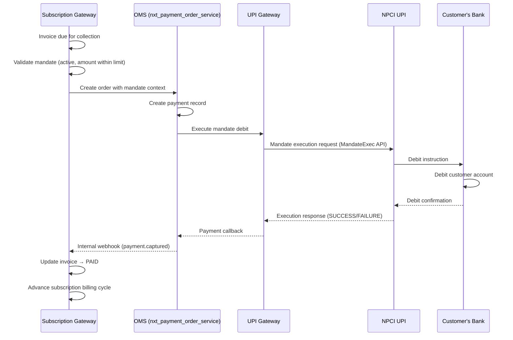
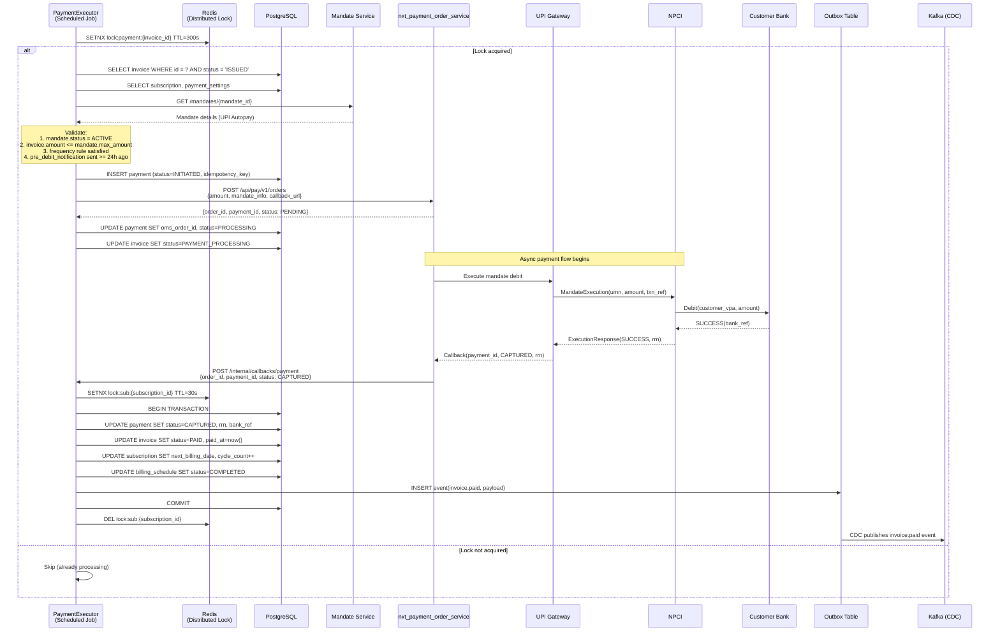
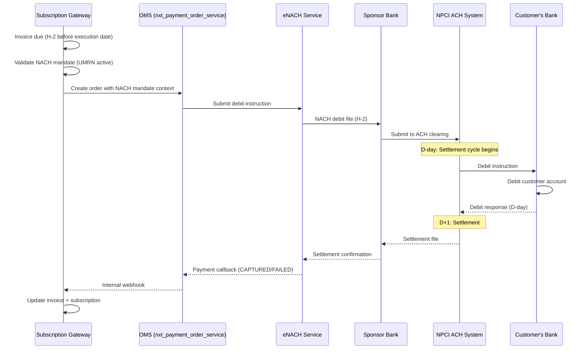
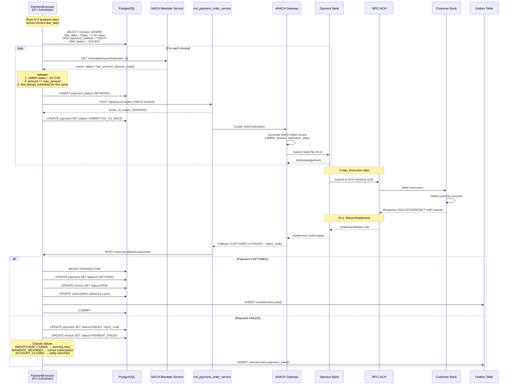
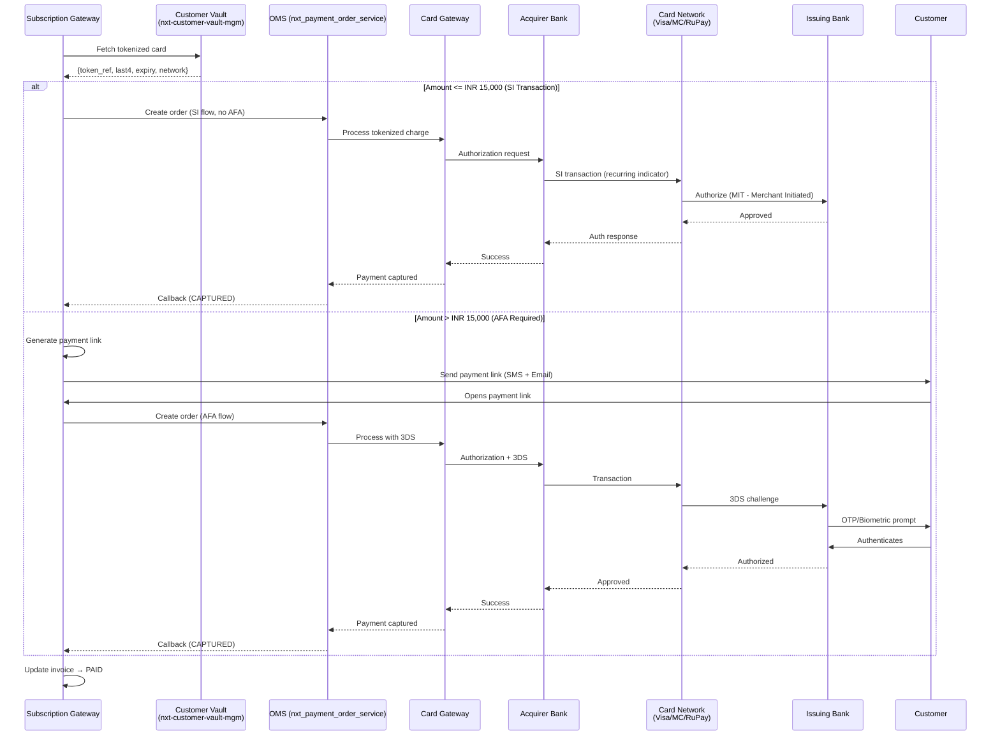
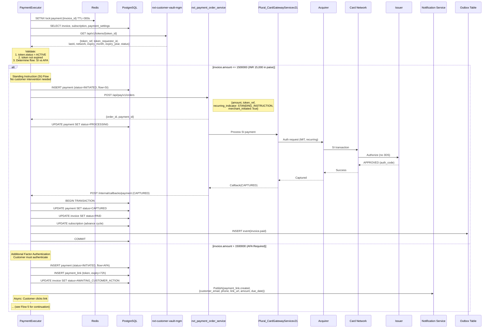
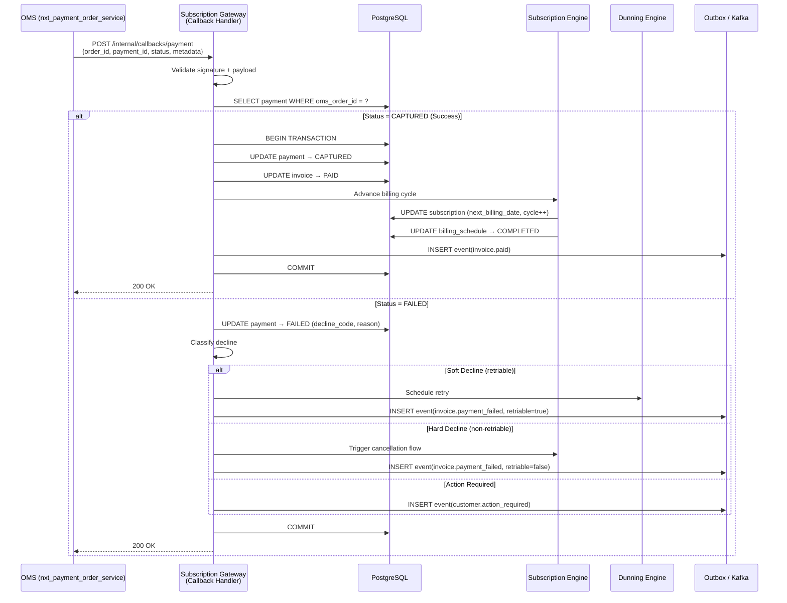
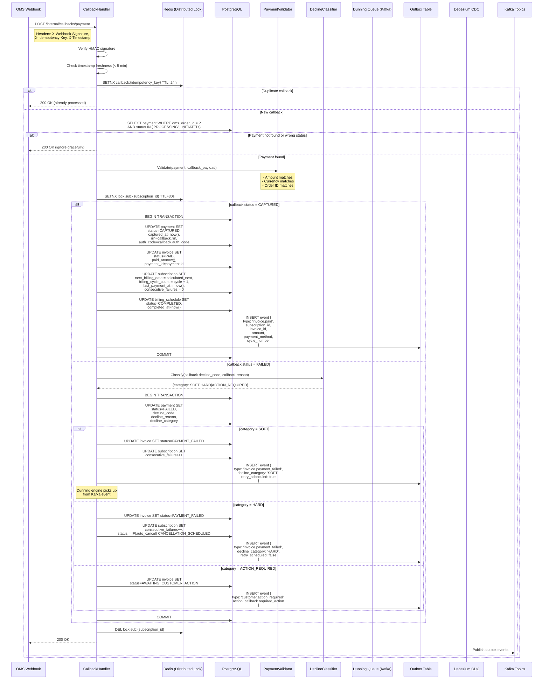
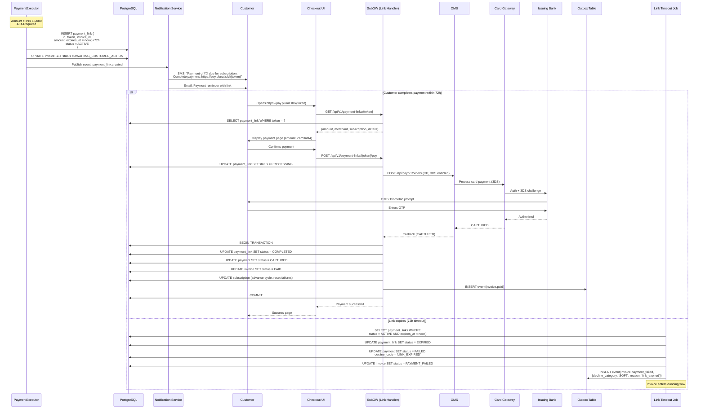
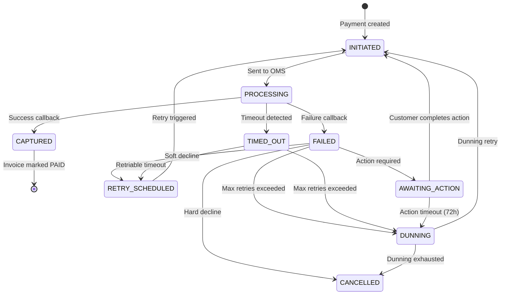

# 06 — Payment Execution Workflow

> Auto-charge execution — from invoice to funds collection via mandate debit or card-on-file

---

## Functional Overview

Once an invoice is generated by the billing engine (see `05-billing-engine`), the **Payment Executor** takes over to collect funds. The workflow:

1. **Determine payment method** — mandate type (UPI Autopay, eNACH, Card-on-file) based on subscription configuration
2. **Create order in OMS** — call `nxt_payment_order_service` to create a payment order
3. **Execute mandate debit / card charge** — dispatch to the appropriate payment rail
4. **Handle async payment confirmation** — process callbacks from payment networks
5. **Update invoice and subscription status** — reconcile state, advance billing cycle

### Key Design Principles

- **Idempotent execution** — same invoice never charged twice
- **At-least-once delivery** — retries with deduplication at every boundary
- **Async-first** — all payment rails treated as async; even "real-time" responses go through the same callback path
- **Outbox pattern** — state changes + events written atomically to PostgreSQL, published via Debezium CDC to Kafka

---

## Architecture Context

```
┌─────────────────────────────────────────────────────────────────┐
│                    Subscription Gateway (SubGW)                   │
│                                                                   │
│  ┌──────────────┐   ┌──────────────┐   ┌────────────────────┐  │
│  │ PaymentExec  │──▶│ MethodSelect │──▶│ OMS Client         │  │
│  │ Scheduler    │   │ Engine       │   │ (nxt_payment_order) │  │
│  └──────────────┘   └──────────────┘   └────────────────────┘  │
│         │                                        │               │
│         ▼                                        ▼               │
│  ┌──────────────┐                       ┌────────────────────┐  │
│  │ Callback     │◀──────────────────────│ Payment Rails      │  │
│  │ Handler      │                       │ (UPI/NACH/Card)    │  │
│  └──────────────┘                       └────────────────────┘  │
└─────────────────────────────────────────────────────────────────┘
```

### Service Dependencies

| Service | Role | Protocol |
|---------|------|----------|
| `nxt_payment_order_service` | Order + payment orchestration | REST (internal) |
| `nxt-customer-vault-mgm-service` | Tokenized card storage | gRPC |
| `upi-mandate-service` | UPI Autopay mandate management | REST |
| `nach-service` | eNACH/NACH mandate + debit instructions | REST |
| `card-gateway-service` | Card tokenized payments | REST |
| `notification-service` | SMS/Email for payment links | Kafka event |

---

## Flow 1: Payment via UPI Autopay Mandate

### Functional Sequence



### Technical Sequence



### UPI Mandate Debit Request Structure

```json
{
  "order_id": "ord_sub_xxxxx",
  "amount": {
    "value": 141034,
    "currency": "INR"
  },
  "mandate_info": {
    "mandate_id": "mdt_xxxxx",
    "upi_mandate_id": "MANDATE1234567890",
    "umn": "c840a9f5-6fb4-4a32-b5d7-e2f3c0a91a7@ybl",
    "execution_type": "RECURRING",
    "sequence_number": 3,
    "pre_debit_notification_id": "pdn_xxxxx"
  },
  "subscription_context": {
    "subscription_id": "sub_xxxxx",
    "invoice_id": "inv_xxxxx",
    "cycle_number": 3,
    "plan_id": "plan_xxxxx"
  },
  "idempotency_key": "sub_xxxxx_inv_xxxxx_1",
  "callback_url": "https://subgw.internal/api/v1/callbacks/payment",
  "metadata": {
    "merchant_id": "mcht_xxxxx",
    "merchant_subscription_ref": "CUST-SUB-001"
  }
}
```

### UPI Autopay Validation Rules

| Rule | Validation | Failure Action |
|------|-----------|----------------|
| Mandate status | Must be `ACTIVE` | Fail invoice, notify merchant |
| Amount limit | `invoice.amount <= mandate.max_amount` | Fail, notify merchant |
| Frequency | Execution aligns with mandate frequency | Fail, notify merchant |
| Pre-debit notification | Sent >= 24 hours before execution | Delay execution to next valid window |
| Mandate expiry | `mandate.valid_upto > execution_date` | Fail, trigger re-authorization |
| Consecutive failures | If last 3 debits failed | Pause, notify merchant |

---

## Flow 2: Payment via eNACH Mandate

### Functional Sequence



### Technical Sequence



### eNACH Timeline

```
H-2 (2 business days before due_date):
  └── SubGW submits debit instruction to sponsor bank

H-1:
  └── Sponsor bank submits to NPCI ACH system

D-day (due_date = execution_date):
  └── NPCI processes debit
  └── Customer bank debits account
  └── Returns processed

D+1:
  └── Settlement file received
  └── SubGW receives final status

D+2:
  └── Funds settled to merchant
```

### NACH Debit Instruction Structure

```json
{
  "order_id": "ord_sub_xxxxx",
  "amount": {
    "value": 249900,
    "currency": "INR"
  },
  "mandate_info": {
    "mandate_id": "mdt_nach_xxxxx",
    "umrn": "NACH00000000012345",
    "sponsor_bank_code": "HDFC",
    "destination_bank_ifsc": "SBIN0001234",
    "customer_account_number": "XXXX1234",
    "execution_date": "2025-02-15",
    "category_code": "U099"
  },
  "subscription_context": {
    "subscription_id": "sub_xxxxx",
    "invoice_id": "inv_xxxxx",
    "cycle_number": 6
  },
  "idempotency_key": "sub_xxxxx_inv_xxxxx_1"
}
```

### NACH Reject Codes & Handling

| Reject Code | Reason | Category | Action |
|-------------|--------|----------|--------|
| `01` | Insufficient funds | SOFT | Retry after 3 days (max 2 retries) |
| `02` | Account closed | HARD | Cancel subscription, notify merchant |
| `03` | No such account | HARD | Cancel subscription, notify merchant |
| `04` | Mandate revoked | HARD | Deactivate mandate, cancel subscription |
| `05` | Account frozen | ACTION_REQUIRED | Notify customer, pause subscription |
| `06` | NRE/NRO account | HARD | Notify merchant, cancel |
| `10` | Mandate expired | HARD | Trigger re-authorization flow |
| `68` | Amount exceeds limit | SOFT | Fail, notify merchant to reduce amount |

---

## Flow 3: Payment via Card-on-File (Tokenized)

### Functional Sequence



### Technical Sequence



### Standing Instruction (SI) Flow Rules

```
┌─────────────────────────────────────────────────────────────┐
│                    SI Transaction Rules                       │
│                  (RBI Circular 2022)                          │
├─────────────────────────────────────────────────────────────┤
│                                                              │
│  Amount <= INR 15,000:                                       │
│    ├── Direct debit (no AFA required)                        │
│    ├── Merchant Initiated Transaction (MIT)                  │
│    ├── Recurring indicator in auth message                   │
│    ├── Real-time response (~2-5 seconds)                     │
│    └── Issuer may still soft-decline → retry next day        │
│                                                              │
│  Amount > INR 15,000:                                        │
│    ├── AFA mandatory (OTP / biometric / PIN)                 │
│    ├── Payment link sent to customer                         │
│    ├── Customer initiates payment (CIT-like)                 │
│    ├── 3DS authentication required                           │
│    ├── Timeout: 72 hours from link generation                │
│    └── On timeout → mark FAILED → enter dunning             │
│                                                              │
│  Pre-transaction notification:                               │
│    ├── Required 24h before debit for amount > INR 5,000      │
│    ├── Must include: amount, date, merchant name             │
│    └── Customer can opt-out before execution                 │
│                                                              │
└─────────────────────────────────────────────────────────────┘
```

### Card Token Validation

```kotlin
data class TokenValidationResult(
    val isValid: Boolean,
    val reason: String? = null,
    val requiresAfa: Boolean = false
)

fun validateCardToken(
    token: CardToken,
    invoice: Invoice,
    subscription: Subscription
): TokenValidationResult {
    // 1. Token must be active
    if (token.status != TokenStatus.ACTIVE) {
        return TokenValidationResult(false, "Token is ${token.status}")
    }
    
    // 2. Token must not be expired
    val now = LocalDate.now()
    val expiryDate = YearMonth.of(token.expiryYear, token.expiryMonth).atEndOfMonth()
    if (now.isAfter(expiryDate)) {
        return TokenValidationResult(false, "Token expired")
    }
    
    // 3. Token must belong to same customer
    if (token.customerId != subscription.customerId) {
        return TokenValidationResult(false, "Token-customer mismatch")
    }
    
    // 4. Determine AFA requirement
    val requiresAfa = invoice.amount.value > SI_THRESHOLD_PAISE // 1500000 (INR 15,000)
    
    return TokenValidationResult(
        isValid = true,
        requiresAfa = requiresAfa
    )
}
```

---

## Flow 4: Payment Confirmation Callback

### Functional Sequence



### Technical Sequence — Callback Processing



### Callback Payload Structure

```json
{
  "event": "payment.status_changed",
  "payment_id": "pay_xxxxx",
  "order_id": "ord_sub_xxxxx",
  "status": "CAPTURED",
  "amount": {
    "value": 141034,
    "currency": "INR"
  },
  "payment_method": {
    "type": "UPI_MANDATE",
    "mandate_id": "mdt_xxxxx"
  },
  "transaction_details": {
    "rrn": "123456789012",
    "auth_code": "ABC123",
    "bank_reference": "HDFC12345",
    "captured_at": "2025-02-15T10:30:00Z"
  },
  "metadata": {
    "subscription_id": "sub_xxxxx",
    "invoice_id": "inv_xxxxx",
    "idempotency_key": "sub_xxxxx_inv_xxxxx_1"
  }
}
```

### Decline Classification Logic

```kotlin
enum class DeclineCategory {
    SOFT,           // Temporary, retriable
    HARD,           // Permanent, non-retriable
    ACTION_REQUIRED // Customer must take action
}

data class DeclineClassification(
    val category: DeclineCategory,
    val retryable: Boolean,
    val maxRetries: Int,
    val retryDelay: Duration,
    val customerNotification: Boolean,
    val merchantNotification: Boolean
)

fun classifyDecline(
    declineCode: String,
    paymentMethod: PaymentMethodType,
    reason: String?
): DeclineClassification {
    return when {
        // Soft declines — retry
        declineCode in INSUFFICIENT_FUNDS_CODES -> DeclineClassification(
            category = DeclineCategory.SOFT,
            retryable = true,
            maxRetries = 3,
            retryDelay = Duration.ofDays(3),
            customerNotification = true,
            merchantNotification = false
        )
        declineCode in TEMPORARY_FAILURE_CODES -> DeclineClassification(
            category = DeclineCategory.SOFT,
            retryable = true,
            maxRetries = 2,
            retryDelay = Duration.ofHours(6),
            customerNotification = false,
            merchantNotification = false
        )
        
        // Hard declines — no retry
        declineCode in CARD_EXPIRED_CODES -> DeclineClassification(
            category = DeclineCategory.HARD,
            retryable = false,
            maxRetries = 0,
            retryDelay = Duration.ZERO,
            customerNotification = true,
            merchantNotification = true
        )
        declineCode in ACCOUNT_CLOSED_CODES -> DeclineClassification(
            category = DeclineCategory.HARD,
            retryable = false,
            maxRetries = 0,
            retryDelay = Duration.ZERO,
            customerNotification = false,
            merchantNotification = true
        )
        declineCode in MANDATE_REVOKED_CODES -> DeclineClassification(
            category = DeclineCategory.HARD,
            retryable = false,
            maxRetries = 0,
            retryDelay = Duration.ZERO,
            customerNotification = false,
            merchantNotification = true
        )
        
        // Action required — customer intervention needed
        declineCode in AUTHENTICATION_REQUIRED_CODES -> DeclineClassification(
            category = DeclineCategory.ACTION_REQUIRED,
            retryable = false,
            maxRetries = 0,
            retryDelay = Duration.ZERO,
            customerNotification = true,
            merchantNotification = false
        )
        
        // Default: treat as soft decline with conservative retry
        else -> DeclineClassification(
            category = DeclineCategory.SOFT,
            retryable = true,
            maxRetries = 1,
            retryDelay = Duration.ofDays(1),
            customerNotification = false,
            merchantNotification = true
        )
    }
}
```

---

## Flow 5: Retry After AFA (Customer Payment Link)

### Sequence Diagram



### Payment Link Schema

```kotlin
@Table("payment_links")
data class PaymentLink(
    val id: UUID,
    val token: String,              // URL-safe unique token
    val invoiceId: UUID,
    val paymentId: UUID,
    val subscriptionId: UUID,
    val customerId: UUID,
    val amount: Long,               // in paise
    val currency: String,
    val status: PaymentLinkStatus,  // ACTIVE, PROCESSING, COMPLETED, EXPIRED, CANCELLED
    val expiresAt: Instant,
    val completedAt: Instant?,
    val metadata: JsonNode?,
    val createdAt: Instant,
    val updatedAt: Instant
)

enum class PaymentLinkStatus {
    ACTIVE,
    PROCESSING,
    COMPLETED,
    EXPIRED,
    CANCELLED
}
```

---

## Payment Method Selection Logic

```kotlin
class PaymentMethodSelector(
    private val mandateRepository: MandateRepository,
    private val tokenRepository: TokenRepository,
    private val paymentHistoryRepository: PaymentHistoryRepository
) {
    suspend fun selectPaymentMethod(
        subscription: Subscription,
        invoice: Invoice
    ): PaymentMethodSelection {
        val paymentSettings = subscription.paymentSettings
        
        // Priority 1: Active mandate matching subscription
        val mandate = mandateRepository.findActiveBySubscriptionId(subscription.id)
        if (mandate != null) {
            val validation = validateMandate(mandate, invoice)
            if (validation.isValid) {
                return PaymentMethodSelection(
                    method = PaymentMethod.MANDATE,
                    mandateId = mandate.id,
                    mandateType = mandate.type, // UPI_AUTOPAY or NACH
                    requiresAfa = false
                )
            }
            // If mandate validation fails, fall through to next option
        }
        
        // Priority 2: Default payment method from payment_settings
        val defaultMethodId = paymentSettings?.defaultPaymentMethodId
        if (defaultMethodId != null) {
            val token = tokenRepository.findActiveById(defaultMethodId)
            if (token != null && !token.isExpired()) {
                val requiresAfa = invoice.amount.value > SI_THRESHOLD_PAISE
                return PaymentMethodSelection(
                    method = PaymentMethod.CARD_TOKEN,
                    tokenId = token.id,
                    requiresAfa = requiresAfa
                )
            }
        }
        
        // Priority 3: Most recently successful payment method
        val lastSuccessful = paymentHistoryRepository
            .findLastSuccessfulByCustomerId(subscription.customerId)
        if (lastSuccessful?.tokenId != null) {
            val token = tokenRepository.findActiveById(lastSuccessful.tokenId)
            if (token != null && !token.isExpired()) {
                val requiresAfa = invoice.amount.value > SI_THRESHOLD_PAISE
                return PaymentMethodSelection(
                    method = PaymentMethod.CARD_TOKEN,
                    tokenId = token.id,
                    requiresAfa = requiresAfa
                )
            }
        }
        
        // No valid payment method available
        throw PaymentMethodUnavailableException(
            subscriptionId = subscription.id,
            reason = "No active mandate or valid card token found"
        )
    }
    
    private fun validateMandate(mandate: Mandate, invoice: Invoice): MandateValidation {
        val errors = mutableListOf<String>()
        
        if (mandate.status != MandateStatus.ACTIVE) {
            errors.add("Mandate status is ${mandate.status}")
        }
        if (invoice.amount.value > mandate.maxAmount) {
            errors.add("Amount ${invoice.amount.value} exceeds mandate max ${mandate.maxAmount}")
        }
        if (mandate.validUpto != null && mandate.validUpto.isBefore(LocalDate.now())) {
            errors.add("Mandate expired on ${mandate.validUpto}")
        }
        if (mandate.type == MandateType.UPI_AUTOPAY) {
            val preDebitSent = mandate.lastPreDebitNotificationAt
            if (preDebitSent == null || 
                Duration.between(preDebitSent, Instant.now()) < Duration.ofHours(24)) {
                errors.add("Pre-debit notification not sent or < 24h ago")
            }
        }
        
        return MandateValidation(
            isValid = errors.isEmpty(),
            errors = errors
        )
    }
    
    companion object {
        const val SI_THRESHOLD_PAISE = 1_500_000L // INR 15,000
    }
}

data class PaymentMethodSelection(
    val method: PaymentMethod,
    val mandateId: UUID? = null,
    val mandateType: MandateType? = null,
    val tokenId: UUID? = null,
    val requiresAfa: Boolean = false
)

enum class PaymentMethod {
    MANDATE,
    CARD_TOKEN
}
```

---

## OMS Integration Contract

### Order Creation Request

```http
POST /api/pay/v1/orders
Content-Type: application/json
X-Merchant-Id: {merchant_id}
X-Idempotency-Key: {subscription_id}_{invoice_id}_{attempt}
```

```json
{
  "amount": {
    "value": 141034,
    "currency": "INR"
  },
  "order_type": "SUBSCRIPTION_RECURRING",
  "payment_method": {
    "type": "UPI_MANDATE",
    "mandate_id": "mdt_xxxxx",
    "upi_mandate_id": "MANDATE1234567890",
    "umn": "umn@ybl"
  },
  "merchant_order_reference": "sub_xxxxx_inv_xxxxx_cycle_3",
  "callback_url": "https://subgw.internal/api/v1/callbacks/payment",
  "metadata": {
    "subscription_id": "sub_xxxxx",
    "invoice_id": "inv_xxxxx",
    "cycle_number": 3,
    "is_retry": false,
    "attempt_number": 1
  },
  "notes": {
    "description": "Subscription payment - Plan Premium Monthly"
  }
}
```

### Order Creation Response

```json
{
  "order_id": "ord_sub_xxxxx",
  "payment_id": "pay_xxxxx",
  "status": "CREATED",
  "amount": {
    "value": 141034,
    "currency": "INR"
  },
  "created_at": "2025-02-15T10:00:00Z"
}
```

### Payment Method Variants

**Card Token (SI — no AFA):**
```json
{
  "payment_method": {
    "type": "CARD_TOKEN",
    "token_reference": "tok_xxxxx",
    "token_requestor_id": "TR_PLURAL_001",
    "recurring_indicator": "STANDING_INSTRUCTION",
    "merchant_initiated": true
  }
}
```

**Card Token (AFA required):**
```json
{
  "payment_method": {
    "type": "CARD_TOKEN",
    "token_reference": "tok_xxxxx",
    "token_requestor_id": "TR_PLURAL_001",
    "recurring_indicator": "CUSTOMER_INITIATED",
    "merchant_initiated": false,
    "three_ds_required": true
  }
}
```

**eNACH:**
```json
{
  "payment_method": {
    "type": "NACH_MANDATE",
    "mandate_id": "mdt_nach_xxxxx",
    "umrn": "NACH00000000012345",
    "execution_date": "2025-02-15",
    "sponsor_bank": "HDFC"
  }
}
```

### Callback/Webhook Contract

```http
POST /internal/callbacks/payment
Content-Type: application/json
X-Webhook-Signature: sha256={hmac}
X-Webhook-Timestamp: 1708012345
X-Idempotency-Key: {unique_callback_id}
```

```json
{
  "event": "payment.status_changed",
  "payment_id": "pay_xxxxx",
  "order_id": "ord_sub_xxxxx",
  "status": "CAPTURED | FAILED | PENDING",
  "amount": {
    "value": 141034,
    "currency": "INR"
  },
  "payment_method": {
    "type": "UPI_MANDATE",
    "mandate_id": "mdt_xxxxx"
  },
  "transaction_details": {
    "rrn": "123456789012",
    "auth_code": "ABC123",
    "bank_reference": "HDFC12345",
    "captured_at": "2025-02-15T10:30:00Z",
    "settlement_id": "stl_xxxxx"
  },
  "failure_details": {
    "decline_code": "INSUFFICIENT_FUNDS",
    "decline_reason": "Customer account has insufficient balance",
    "gateway_error_code": "E001",
    "retriable": true
  },
  "metadata": {
    "subscription_id": "sub_xxxxx",
    "invoice_id": "inv_xxxxx",
    "idempotency_key": "sub_xxxxx_inv_xxxxx_1"
  }
}
```

### OMS Error Codes Mapping

| OMS Error Code | HTTP Status | SubGW Action |
|----------------|-------------|--------------|
| `ORDER_DUPLICATE` | 409 | Fetch existing order, continue |
| `INVALID_MANDATE` | 400 | Mark payment FAILED, notify merchant |
| `MANDATE_EXPIRED` | 400 | Trigger re-authorization flow |
| `AMOUNT_LIMIT_EXCEEDED` | 400 | Fail invoice, notify merchant |
| `MERCHANT_NOT_ACTIVE` | 403 | Pause subscription, alert ops |
| `SERVICE_UNAVAILABLE` | 503 | Retry with exponential backoff |
| `TIMEOUT` | 504 | Check order status, retry if not created |
| `RATE_LIMIT_EXCEEDED` | 429 | Backoff, retry after indicated delay |

---

## Idempotency & Duplicate Prevention

### Idempotency Key Strategy

```kotlin
object IdempotencyKeyGenerator {
    /**
     * Payment execution idempotency key.
     * Format: {subscription_id}_{invoice_id}_{attempt_number}
     * 
     * This ensures:
     * - Same invoice is never double-charged
     * - Retries get unique keys (attempt increments)
     * - OMS deduplicates on its end with same key
     */
    fun forPaymentExecution(
        subscriptionId: UUID,
        invoiceId: UUID,
        attemptNumber: Int
    ): String = "${subscriptionId}_${invoiceId}_${attemptNumber}"
    
    /**
     * OMS order creation idempotency.
     * Same key forwarded to OMS so duplicate order creation returns existing order.
     */
    fun forOmsOrder(
        subscriptionId: UUID,
        invoiceId: UUID,
        attemptNumber: Int
    ): String = "subgw_${subscriptionId}_${invoiceId}_${attemptNumber}"
}
```

### Duplicate Prevention via Redis

```kotlin
class DuplicatePaymentGuard(
    private val redis: RedisClient
) {
    companion object {
        private const val LOCK_PREFIX = "payment_exec_lock:"
        private val LOCK_TTL = Duration.ofMinutes(5)
    }
    
    /**
     * Attempts to acquire execution lock for an invoice.
     * Returns false if payment is already being processed.
     */
    suspend fun tryAcquire(invoiceId: UUID): Boolean {
        val key = "$LOCK_PREFIX$invoiceId"
        val acquired = redis.setNx(key, Instant.now().toString(), LOCK_TTL)
        return acquired
    }
    
    /**
     * Release lock after payment completes (success or terminal failure).
     */
    suspend fun release(invoiceId: UUID) {
        val key = "$LOCK_PREFIX$invoiceId"
        redis.del(key)
    }
    
    /**
     * Check if payment is already in non-terminal state.
     * Used before acquiring lock for early exit.
     */
    suspend fun isAlreadyProcessing(invoiceId: UUID, paymentRepository: PaymentRepository): Boolean {
        val existingPayment = paymentRepository.findByInvoiceIdAndStatusIn(
            invoiceId,
            listOf(PaymentStatus.INITIATED, PaymentStatus.PROCESSING)
        )
        return existingPayment != null
    }
}
```

### Deduplication at Each Layer

```
┌──────────────────────────────────────────────────────────────┐
│ Layer 1: Scheduler Level                                      │
│ ├── Redis SETNX on invoice_id (TTL=5min)                     │
│ ├── Prevents concurrent execution of same invoice            │
│ └── Released on completion or terminal failure               │
├──────────────────────────────────────────────────────────────┤
│ Layer 2: Database Level                                       │
│ ├── UNIQUE constraint on (invoice_id, attempt_number)        │
│ ├── Check payment.status before proceeding                   │
│ └── Optimistic locking on subscription (version field)       │
├──────────────────────────────────────────────────────────────┤
│ Layer 3: OMS Level                                            │
│ ├── Idempotency key in X-Idempotency-Key header             │
│ ├── OMS returns existing order if key matches                │
│ └── No duplicate charges for same idempotency key            │
├──────────────────────────────────────────────────────────────┤
│ Layer 4: Callback Level                                       │
│ ├── Redis SETNX on callback idempotency key (TTL=24h)       │
│ ├── Duplicate callbacks return 200 OK immediately            │
│ └── Database status check as final guard                     │
└──────────────────────────────────────────────────────────────┘
```

---

## Timeout Handling

| Payment Method | Timeout Duration | Action on Timeout | Retry Strategy |
|----------------|-----------------|-------------------|----------------|
| UPI Autopay | 30 minutes | Mark FAILED, record `TIMEOUT` decline | Schedule retry after 4 hours (max 3 retries) |
| eNACH | T+2 business days | Wait for settlement file; if no response by T+3, mark FAILED | No auto-retry; merchant notified |
| Card (SI, no AFA) | 60 seconds | Mark FAILED, record `GATEWAY_TIMEOUT` | Immediate retry (max 2 retries, 30s apart) |
| Card (AFA link) | 72 hours | Mark link EXPIRED, payment FAILED | Enter dunning flow |

### Timeout Detection Implementation

```kotlin
class PaymentTimeoutDetector(
    private val paymentRepository: PaymentRepository,
    private val clock: Clock
) {
    /**
     * Scheduled job: runs every 5 minutes.
     * Finds payments stuck in PROCESSING beyond their timeout window.
     */
    suspend fun detectTimedOutPayments() {
        val timedOut = paymentRepository.findTimedOutPayments(
            statuses = listOf(PaymentStatus.PROCESSING, PaymentStatus.INITIATED),
            cutoffs = mapOf(
                PaymentMethodType.UPI_AUTOPAY to clock.instant().minus(Duration.ofMinutes(30)),
                PaymentMethodType.CARD_SI to clock.instant().minus(Duration.ofSeconds(60)),
                PaymentMethodType.CARD_AFA to clock.instant().minus(Duration.ofHours(72)),
                // eNACH handled separately by settlement file reconciliation
            )
        )
        
        timedOut.forEach { payment ->
            handleTimeout(payment)
        }
    }
    
    private suspend fun handleTimeout(payment: Payment) {
        // 1. Check with OMS if payment actually succeeded (late callback)
        val omsStatus = omsClient.getPaymentStatus(payment.omsOrderId)
        
        when (omsStatus) {
            OmsPaymentStatus.CAPTURED -> {
                // Late success — process as normal callback
                processLateSuccess(payment)
            }
            OmsPaymentStatus.FAILED -> {
                // Confirmed failure
                markTimedOut(payment, retriable = true)
            }
            OmsPaymentStatus.PENDING -> {
                // Still pending at OMS — extend timeout or mark failed
                if (payment.timeoutExtensions < MAX_EXTENSIONS) {
                    extendTimeout(payment)
                } else {
                    markTimedOut(payment, retriable = true)
                }
            }
        }
    }
}
```

---

## Error Handling

### Comprehensive Payment Error Table

| Error Code | Source | Category | Description | Auto-Retry | Customer Notify | Merchant Notify | Next Action |
|-----------|--------|----------|-------------|-----------|----------------|-----------------|-------------|
| `INSUFFICIENT_FUNDS` | Bank | SOFT | Customer account balance too low | Yes (3x, 3-day gap) | Yes (SMS) | No | Dunning retry |
| `DAILY_LIMIT_EXCEEDED` | Bank | SOFT | Customer hit daily txn limit | Yes (1x, next day) | No | No | Retry next day |
| `TECHNICAL_DECLINE` | Gateway | SOFT | Temporary processing error | Yes (2x, 6h gap) | No | No | Retry |
| `GATEWAY_TIMEOUT` | Gateway | SOFT | No response from downstream | Yes (2x, immediate) | No | No | Immediate retry |
| `NETWORK_ERROR` | Internal | SOFT | Connection failure to OMS/gateway | Yes (3x, exponential backoff) | No | No | Retry |
| `CARD_EXPIRED` | Issuer | HARD | Token/card has expired | No | Yes (update card) | Yes | Pause, request new card |
| `CARD_BLOCKED` | Issuer | HARD | Card blocked by issuer | No | Yes | Yes | Request alternate method |
| `ACCOUNT_CLOSED` | Bank | HARD | Customer bank account closed | No | No | Yes | Cancel subscription |
| `MANDATE_REVOKED` | NPCI | HARD | Customer revoked mandate | No | No | Yes | Deactivate mandate, cancel |
| `MANDATE_EXPIRED` | NPCI | HARD | Mandate past validity period | No | No | Yes | Request re-authorization |
| `FRAUD_SUSPECTED` | Network | HARD | Fraud detection triggered | No | No | Yes (alert) | Block, manual review |
| `DO_NOT_HONOUR` | Issuer | HARD | Generic issuer rejection | No | Yes | Yes | Request alternate method |
| `INVALID_TOKEN` | Vault | HARD | Token not found or deactivated | No | Yes (re-link) | Yes | Request new card |
| `AMOUNT_LIMIT_EXCEEDED` | NPCI/Bank | SOFT | Above mandate/SI limit | No | Yes (partial?) | Yes | Merchant must adjust |
| `AFA_REQUIRED` | Issuer | ACTION_REQUIRED | Additional auth needed | No | Yes (payment link) | No | Send payment link |
| `OTP_EXPIRED` | Issuer | ACTION_REQUIRED | Customer didn't complete OTP | No | Yes (resend link) | No | Resend payment link |
| `CUSTOMER_CANCELLED` | Customer | ACTION_REQUIRED | Customer cancelled on checkout | No | Yes (reminder) | No | Resend after 24h |
| `LINK_EXPIRED` | SubGW | SOFT | Payment link TTL exceeded | Yes (new link) | Yes (new link) | No | Generate new link, enter dunning |
| `DUPLICATE_PAYMENT` | OMS | N/A | Payment already processed | No | No | No | Return existing status |
| `MERCHANT_NOT_ACTIVE` | OMS | HARD | Merchant account suspended | No | No | Yes (ops alert) | Pause all subscriptions |
| `RATE_LIMITED` | OMS | SOFT | Too many requests | Yes (after backoff) | No | No | Backoff + retry |

### Error Handling State Machine



### Retry Backoff Configuration

```kotlin
data class RetryConfig(
    val paymentMethod: PaymentMethodType,
    val declineCategory: DeclineCategory,
    val maxAttempts: Int,
    val backoffStrategy: BackoffStrategy,
    val initialDelay: Duration,
    val maxDelay: Duration
)

val RETRY_CONFIGS = listOf(
    // UPI Autopay - soft decline
    RetryConfig(
        paymentMethod = PaymentMethodType.UPI_AUTOPAY,
        declineCategory = DeclineCategory.SOFT,
        maxAttempts = 3,
        backoffStrategy = BackoffStrategy.FIXED,
        initialDelay = Duration.ofHours(4),
        maxDelay = Duration.ofDays(3)
    ),
    // Card SI - gateway timeout
    RetryConfig(
        paymentMethod = PaymentMethodType.CARD_SI,
        declineCategory = DeclineCategory.SOFT,
        maxAttempts = 2,
        backoffStrategy = BackoffStrategy.FIXED,
        initialDelay = Duration.ofSeconds(30),
        maxDelay = Duration.ofMinutes(5)
    ),
    // Card SI - insufficient funds
    RetryConfig(
        paymentMethod = PaymentMethodType.CARD_SI,
        declineCategory = DeclineCategory.SOFT,
        maxAttempts = 3,
        backoffStrategy = BackoffStrategy.EXPONENTIAL,
        initialDelay = Duration.ofDays(1),
        maxDelay = Duration.ofDays(7)
    ),
    // Network errors - immediate retry
    RetryConfig(
        paymentMethod = PaymentMethodType.ANY,
        declineCategory = DeclineCategory.SOFT,
        maxAttempts = 3,
        backoffStrategy = BackoffStrategy.EXPONENTIAL,
        initialDelay = Duration.ofSeconds(1),
        maxDelay = Duration.ofSeconds(30)
    )
)

enum class BackoffStrategy {
    FIXED,
    EXPONENTIAL,
    LINEAR
}
```

---

## Observability

### Key Metrics

| Metric | Type | Labels | Alert Threshold |
|--------|------|--------|-----------------|
| `payment_execution_total` | Counter | method, status, decline_code | — |
| `payment_execution_duration_ms` | Histogram | method, flow (SI/AFA) | p99 > 5s |
| `payment_callback_lag_ms` | Histogram | method | p99 > 60min (UPI) |
| `payment_timeout_total` | Counter | method | > 10/min |
| `payment_duplicate_prevented` | Counter | layer (redis/db/oms) | — |
| `payment_retry_scheduled` | Counter | method, decline_category | — |
| `active_payment_links` | Gauge | — | — |
| `payment_link_conversion_rate` | Gauge | — | < 30% |

### Structured Log Events

```json
{
  "event": "payment.execution.started",
  "subscription_id": "sub_xxxxx",
  "invoice_id": "inv_xxxxx",
  "payment_method": "UPI_AUTOPAY",
  "amount": 141034,
  "attempt_number": 1,
  "idempotency_key": "sub_xxxxx_inv_xxxxx_1",
  "trace_id": "abc123"
}
```

```json
{
  "event": "payment.execution.completed",
  "subscription_id": "sub_xxxxx",
  "invoice_id": "inv_xxxxx",
  "payment_id": "pay_xxxxx",
  "status": "CAPTURED",
  "duration_ms": 2340,
  "rrn": "123456789012",
  "trace_id": "abc123"
}
```

---

## Database Schema (Payment-related)

```sql
CREATE TABLE payments (
    id                  UUID PRIMARY KEY DEFAULT gen_random_uuid(),
    subscription_id     UUID NOT NULL REFERENCES subscriptions(id),
    invoice_id          UUID NOT NULL REFERENCES invoices(id),
    customer_id         UUID NOT NULL,
    merchant_id         UUID NOT NULL,
    
    -- Amount
    amount              BIGINT NOT NULL,
    currency            VARCHAR(3) NOT NULL DEFAULT 'INR',
    
    -- OMS reference
    oms_order_id        VARCHAR(64),
    oms_payment_id      VARCHAR(64),
    
    -- Payment method
    payment_method_type VARCHAR(32) NOT NULL, -- UPI_AUTOPAY, NACH, CARD_SI, CARD_AFA
    mandate_id          UUID,
    token_id            UUID,
    
    -- Status
    status              VARCHAR(32) NOT NULL DEFAULT 'INITIATED',
    -- INITIATED, PROCESSING, CAPTURED, FAILED, TIMED_OUT, CANCELLED
    
    -- Result details
    rrn                 VARCHAR(32),
    auth_code           VARCHAR(16),
    bank_reference      VARCHAR(64),
    decline_code        VARCHAR(64),
    decline_reason      TEXT,
    decline_category    VARCHAR(32), -- SOFT, HARD, ACTION_REQUIRED
    
    -- Retry tracking
    attempt_number      INT NOT NULL DEFAULT 1,
    idempotency_key     VARCHAR(128) NOT NULL,
    
    -- Timestamps
    initiated_at        TIMESTAMPTZ NOT NULL DEFAULT now(),
    processing_at       TIMESTAMPTZ,
    captured_at         TIMESTAMPTZ,
    failed_at           TIMESTAMPTZ,
    created_at          TIMESTAMPTZ NOT NULL DEFAULT now(),
    updated_at          TIMESTAMPTZ NOT NULL DEFAULT now(),
    
    -- Constraints
    CONSTRAINT uq_payment_idempotency UNIQUE (idempotency_key),
    CONSTRAINT uq_invoice_attempt UNIQUE (invoice_id, attempt_number)
);

CREATE INDEX idx_payments_invoice_status ON payments(invoice_id, status);
CREATE INDEX idx_payments_subscription ON payments(subscription_id);
CREATE INDEX idx_payments_status_method ON payments(status, payment_method_type);
CREATE INDEX idx_payments_timeout ON payments(status, payment_method_type, processing_at)
    WHERE status IN ('PROCESSING', 'INITIATED');

CREATE TABLE payment_links (
    id              UUID PRIMARY KEY DEFAULT gen_random_uuid(),
    token           VARCHAR(64) NOT NULL UNIQUE,
    invoice_id      UUID NOT NULL REFERENCES invoices(id),
    payment_id      UUID NOT NULL REFERENCES payments(id),
    subscription_id UUID NOT NULL REFERENCES subscriptions(id),
    customer_id     UUID NOT NULL,
    
    amount          BIGINT NOT NULL,
    currency        VARCHAR(3) NOT NULL DEFAULT 'INR',
    
    status          VARCHAR(32) NOT NULL DEFAULT 'ACTIVE',
    -- ACTIVE, PROCESSING, COMPLETED, EXPIRED, CANCELLED
    
    expires_at      TIMESTAMPTZ NOT NULL,
    completed_at    TIMESTAMPTZ,
    
    metadata        JSONB,
    created_at      TIMESTAMPTZ NOT NULL DEFAULT now(),
    updated_at      TIMESTAMPTZ NOT NULL DEFAULT now()
);

CREATE INDEX idx_payment_links_token ON payment_links(token) WHERE status = 'ACTIVE';
CREATE INDEX idx_payment_links_expiry ON payment_links(expires_at) WHERE status = 'ACTIVE';
```

---

## Kafka Events (Outbox)

### Events Produced

| Event Type | Trigger | Consumers |
|-----------|---------|-----------|
| `invoice.paid` | Payment captured | Webhook service, Analytics, Merchant notification |
| `invoice.payment_failed` | Payment failed | Dunning engine, Webhook service, Alerting |
| `customer.action_required` | AFA needed / card update needed | Notification service |
| `payment_link.created` | Link generated for AFA flow | Notification service |
| `payment_link.expired` | Link TTL exceeded | Dunning engine |
| `subscription.payment_method_invalid` | Hard decline on method | Merchant notification |

### Event Schema Example

```json
{
  "event_id": "evt_xxxxx",
  "event_type": "invoice.paid",
  "aggregate_type": "invoice",
  "aggregate_id": "inv_xxxxx",
  "timestamp": "2025-02-15T10:30:00Z",
  "payload": {
    "invoice_id": "inv_xxxxx",
    "subscription_id": "sub_xxxxx",
    "customer_id": "cust_xxxxx",
    "merchant_id": "mcht_xxxxx",
    "amount": {
      "value": 141034,
      "currency": "INR"
    },
    "payment_method": "UPI_AUTOPAY",
    "payment_id": "pay_xxxxx",
    "rrn": "123456789012",
    "cycle_number": 3,
    "paid_at": "2025-02-15T10:30:00Z"
  },
  "metadata": {
    "trace_id": "abc123",
    "source": "subscription-gateway",
    "version": "1.0"
  }
}
```

---

## Configuration

```yaml
payment-execution:
  scheduler:
    cron: "0 */5 * * * *"  # Every 5 minutes
    batch-size: 100
    
  timeout:
    upi-autopay: 30m
    nach-settlement: 72h  # T+2 business days (conservative)
    card-si: 60s
    card-afa-link: 72h
    
  retry:
    max-attempts-soft: 3
    max-attempts-network: 3
    backoff-initial: 1s
    backoff-max: 30s
    backoff-multiplier: 2.0
    
  redis:
    lock-prefix: "payment_exec_lock:"
    lock-ttl: 300s
    callback-dedup-prefix: "callback:"
    callback-dedup-ttl: 86400s
    
  oms:
    base-url: "http://nxt-payment-order-service.internal"
    timeout: 10s
    retry-count: 2
    
  payment-links:
    base-url: "https://pay.plural.sh/l"
    default-ttl: 72h
    
  nach:
    submission-days-before: 2  # H-2
    settlement-wait-days: 3    # Wait T+3 before timeout
    
  si-threshold:
    amount-paise: 1500000  # INR 15,000
```
