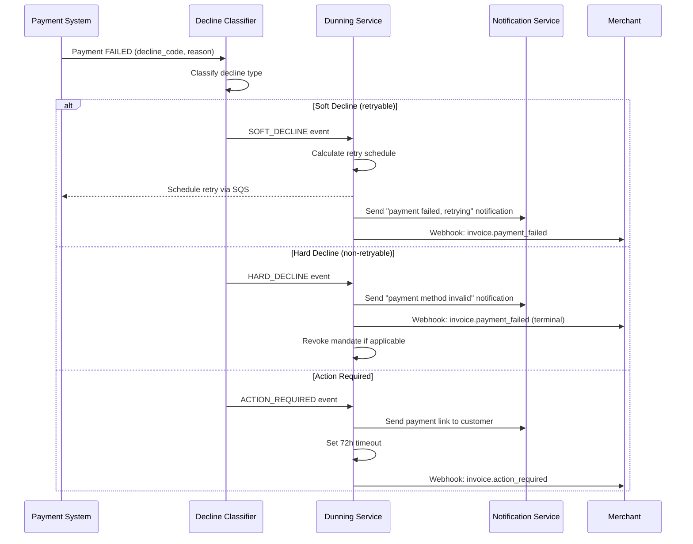
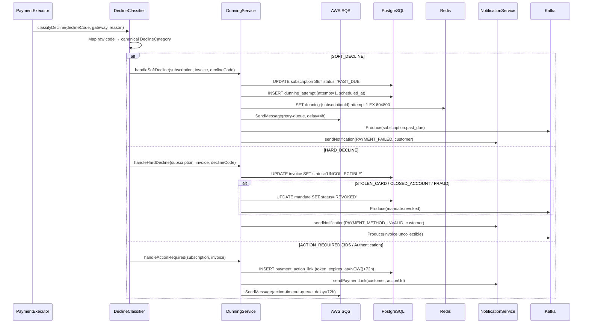
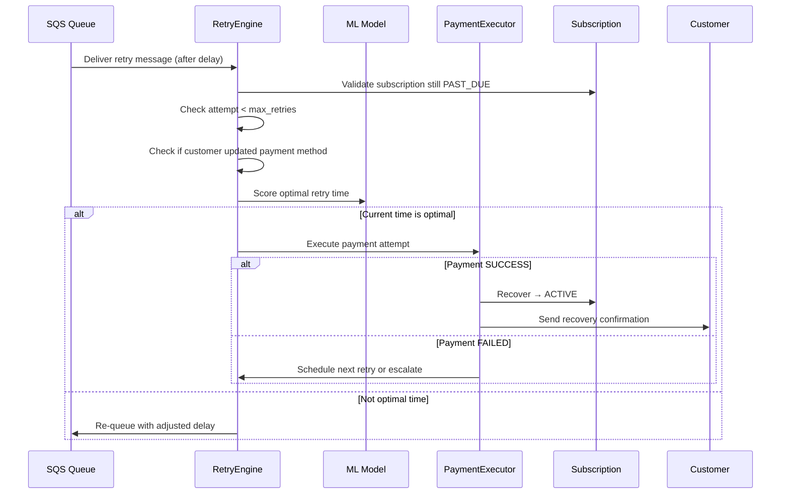
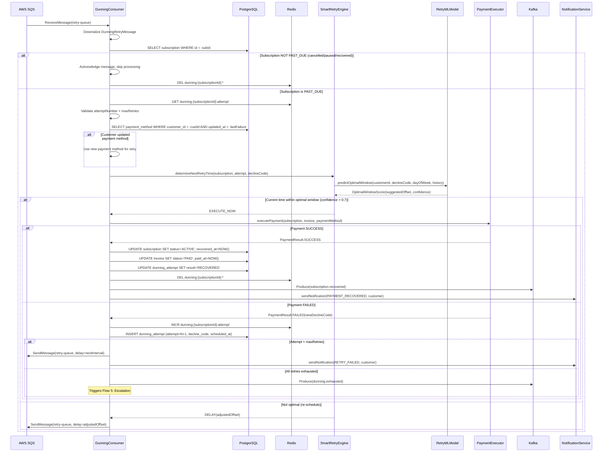
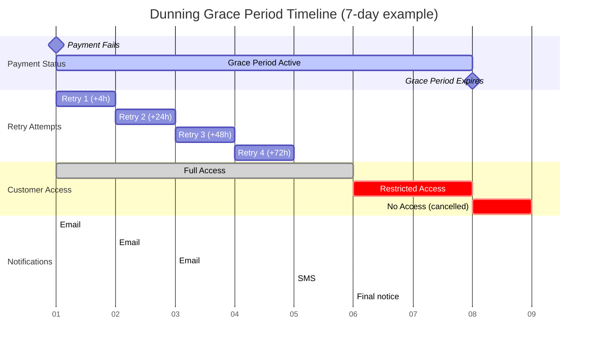
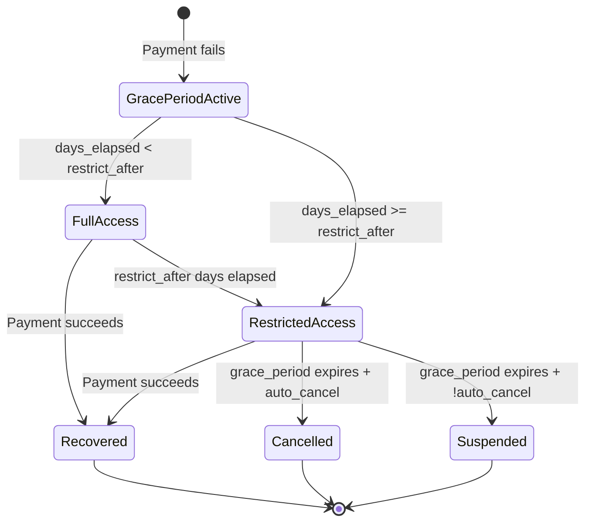
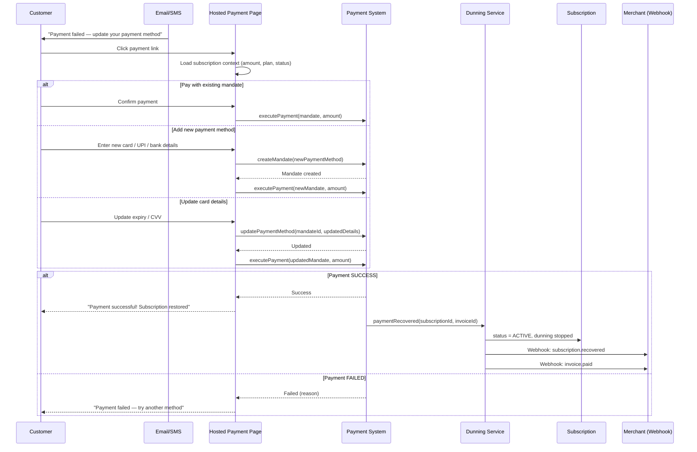
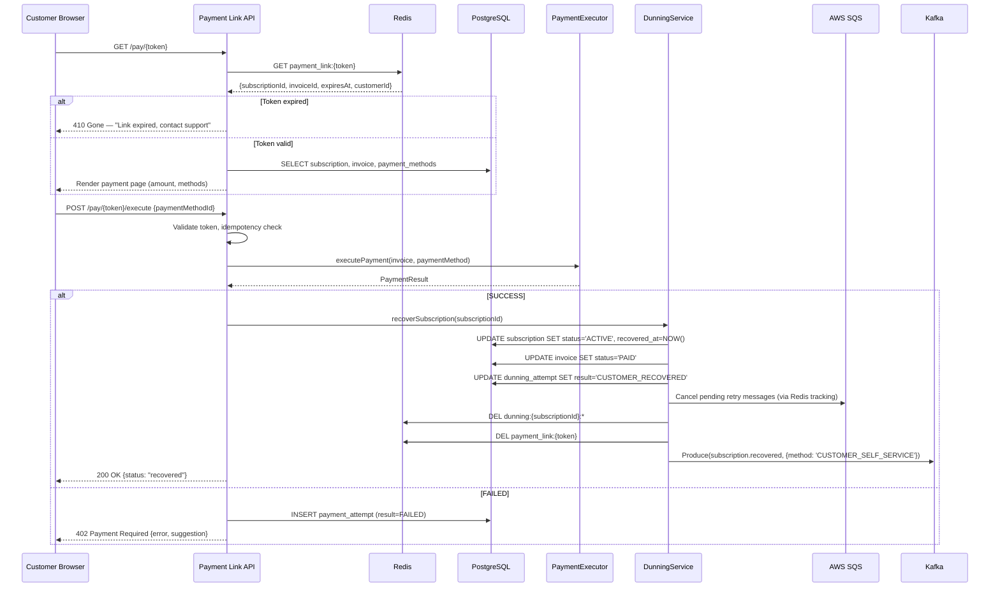
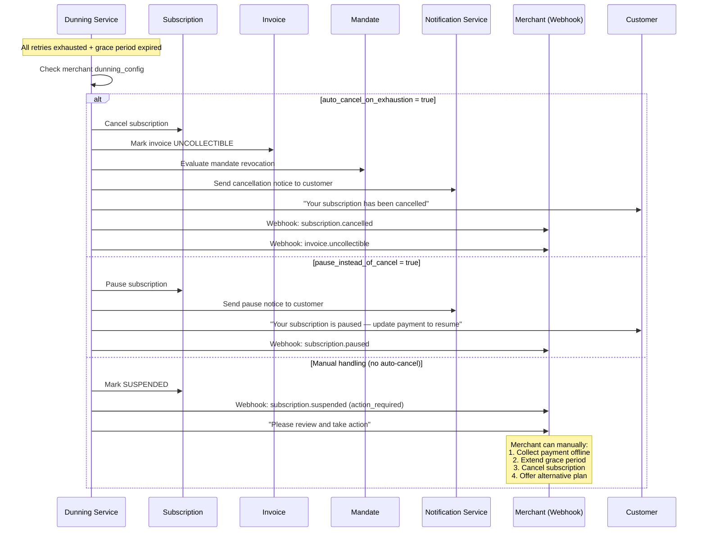
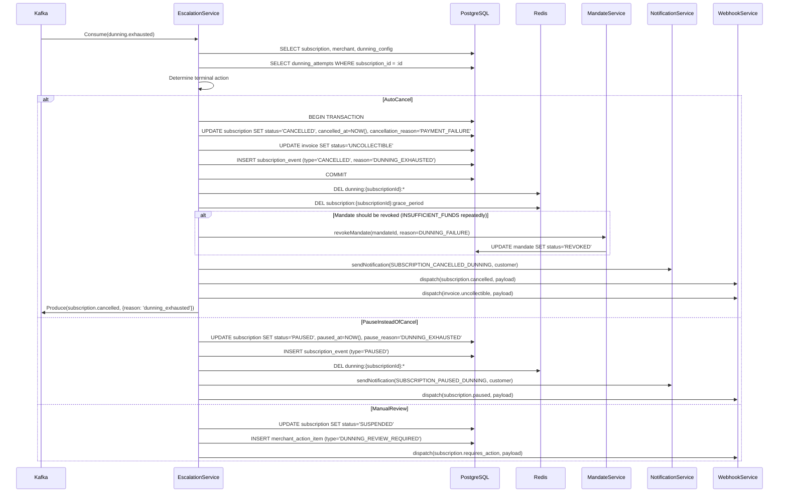

# 07 — Dunning & Retry Workflow

> Smart payment retry, grace period management, escalation, and churn prevention

---

## Functional Overview

When a subscription payment fails, the dunning engine orchestrates intelligent retry:

1. **Classify decline** — soft vs hard vs action-required
2. **Determine retry strategy** — based on decline code, merchant config, and ML scoring
3. **Execute retries** — with optimal timing informed by ML models
4. **Send customer notifications** — at each stage via email, SMS, WhatsApp
5. **Manage grace period countdown** — configurable per merchant
6. **Escalate to cancellation** — if all retries exhausted and grace period expires

---

## Flow 1: Initial Payment Failure Handling

### Functional Sequence



### Technical Sequence



### Decline Classification Logic

```kotlin
enum class DeclineCategory {
    SOFT_DECLINE,       // Temporary issue, retry likely to succeed
    HARD_DECLINE,       // Permanent issue, no retry
    ACTION_REQUIRED,    // Customer authentication needed
    NETWORK_ERROR       // Gateway/network issue, retry immediately
}

class DeclineClassifier {

    fun classify(
        declineCode: String,
        gateway: String,
        rawReason: String?
    ): DeclineClassification {
        // 1. Check canonical mapping first
        val canonical = canonicalDeclineMap[declineCode]
        if (canonical != null) return canonical

        // 2. Gateway-specific mapping
        val gatewayMapping = gatewayDeclineMaps[gateway]?.get(declineCode)
        if (gatewayMapping != null) return gatewayMapping

        // 3. Heuristic fallback based on raw reason
        return when {
            rawReason?.contains("insufficient", ignoreCase = true) == true ->
                DeclineClassification(DeclineCategory.SOFT_DECLINE, retryable = true, maxRetries = 4)
            rawReason?.contains("stolen", ignoreCase = true) == true ->
                DeclineClassification(DeclineCategory.HARD_DECLINE, retryable = false, revokeMandate = true)
            rawReason?.contains("authenticate", ignoreCase = true) == true ->
                DeclineClassification(DeclineCategory.ACTION_REQUIRED, retryable = false)
            else ->
                DeclineClassification(DeclineCategory.SOFT_DECLINE, retryable = true, maxRetries = 2)
        }
    }
}

data class DeclineClassification(
    val category: DeclineCategory,
    val retryable: Boolean,
    val maxRetries: Int = 0,
    val revokeMandate: Boolean = false,
    val suggestedDelay: Duration? = null
)
```

---

## Flow 2: Smart Retry Execution

### Functional Sequence



### Technical Sequence



### Smart Retry Timing Algorithm

```kotlin
class SmartRetryEngine(
    private val retryMLModel: RetryMLModel,
    private val merchantConfig: MerchantRetryConfig,
    private val paymentHistoryRepo: PaymentHistoryRepository
) {
    suspend fun determineNextRetryTime(
        subscription: Subscription,
        currentAttempt: Int,
        declineCode: String,
        customerPaymentHistory: PaymentHistory
    ): RetryDecision {
        // 1. Base delay from merchant retry policy
        val baseDelay = merchantConfig.retryIntervals.getOrNull(currentAttempt)
            ?: return RetryDecision.Exhausted

        // 2. ML model: predict optimal retry window
        val mlScore = retryMLModel.predictOptimalWindow(
            customerId = subscription.customerId,
            declineCode = declineCode,
            dayOfWeek = LocalDate.now().dayOfWeek,
            hourOfDay = LocalTime.now().hour,
            previousAttempts = customerPaymentHistory.recentAttempts,
            averageTransactionAmount = subscription.plan.amount,
            customerTenure = subscription.createdAt.until(Instant.now())
        )

        // 3. Payday proximity adjustment
        val paydayAdjustment = calculatePaydayProximity(subscription.customerId)

        // 4. Jitter to prevent thundering herd
        val jitter = Duration.ofMillis(Random.nextLong(0, 30.minutes.inWholeMilliseconds))

        // 5. Compose final retry time
        val nextRetryAt = Instant.now()
            .plus(baseDelay)
            .plus(mlScore.suggestedOffset)
            .plus(paydayAdjustment)
            .plus(jitter)

        // 6. Check if retry falls within grace period
        val graceDeadline = subscription.currentPeriodEnd
            .plus(Duration.ofDays(merchantConfig.gracePeriodDays.toLong()))

        return if (nextRetryAt.isBefore(graceDeadline)) {
            RetryDecision.ScheduleAt(nextRetryAt, mlScore.confidence)
        } else {
            RetryDecision.Exhausted
        }
    }

    private suspend fun calculatePaydayProximity(customerId: String): Duration {
        val payPattern = paymentHistoryRepo.getPaydayPattern(customerId)
        if (payPattern == null) return Duration.ZERO

        val today = LocalDate.now().dayOfMonth
        val nextPayday = payPattern.predictedPaydays
            .filter { it >= today }
            .minOrNull() ?: payPattern.predictedPaydays.min()

        val daysToPayday = if (nextPayday >= today) {
            nextPayday - today
        } else {
            (LocalDate.now().lengthOfMonth() - today) + nextPayday
        }

        // If payday is within 3 days, delay retry to payday
        return if (daysToPayday in 1..3) {
            Duration.ofDays(daysToPayday.toLong())
        } else {
            Duration.ZERO
        }
    }
}

sealed class RetryDecision {
    data class ScheduleAt(val time: Instant, val confidence: Double) : RetryDecision()
    data class ExecuteNow(val confidence: Double) : RetryDecision()
    object Exhausted : RetryDecision()
}
```

### ML Model Features

```kotlin
data class RetryPredictionFeatures(
    val declineCode: String,
    val attemptNumber: Int,
    val hourOfDay: Int,              // 0-23
    val dayOfWeek: Int,              // 1-7
    val dayOfMonth: Int,             // 1-31
    val amountCents: Long,
    val customerTenureDays: Int,
    val previousRecoveryRate: Double, // Customer's historical recovery rate
    val timeSinceLastSuccess: Long,   // Milliseconds since last successful payment
    val paymentMethodAge: Long,       // How old is the card/mandate
    val cardExpiryProximity: Int,     // Months until card expiry
    val merchantCategory: String,
    val region: String
)

data class OptimalWindowScore(
    val suggestedOffset: Duration,
    val confidence: Double,           // 0.0 to 1.0
    val predictedSuccessRate: Double  // Expected probability of success
)
```

---

## Flow 3: Grace Period Management

### Grace Period Timeline



### Grace Period State Machine



### Grace Period Behavior Table

| Day | Retry | Notification | Customer Access | System Action |
|-----|-------|-------------|-----------------|---------------|
| 0 (T+0h) | — | Email: "Payment failed, we'll retry automatically" | Full access | Subscription → PAST_DUE |
| 0 (T+4h) | Retry 1 | — | Full access | Execute first retry |
| 1 (T+24h) | Retry 2 | Email: "Payment still failing, please check card" | Full access | — |
| 3 (T+72h) | Retry 3 | Email: "Urgent: Update payment method" + payment link | Full access | — |
| 5 (T+120h) | Retry 4 | SMS + Email: "Final retry, service may be restricted" | **Restricted** (merchant-configurable) | Feature restrictions applied |
| 6 | — | Final notice: "1 day remaining" | Restricted | — |
| 7 (Grace expires) | — | Email: "Service cancelled due to payment failure" | **No access** | Auto-cancel or suspend |

### Grace Period Implementation

```kotlin
class GracePeriodManager(
    private val subscriptionRepo: SubscriptionRepository,
    private val featureGateService: FeatureGateService,
    private val notificationService: NotificationService,
    private val clock: Clock = Clock.systemUTC()
) {
    suspend fun evaluateGracePeriod(subscription: Subscription): GracePeriodStatus {
        val dunningConfig = subscription.merchant.dunningConfig
        val failedAt = subscription.dunningStartedAt ?: return GracePeriodStatus.NOT_IN_DUNNING
        val elapsed = Duration.between(failedAt, clock.instant())
        val elapsedDays = elapsed.toDays().toInt()
        val gracePeriodDays = dunningConfig.gracePeriodDays

        return when {
            elapsedDays >= gracePeriodDays -> GracePeriodStatus.EXPIRED
            elapsedDays >= dunningConfig.restrictAccessAfterDays -> GracePeriodStatus.RESTRICTED
            else -> GracePeriodStatus.ACTIVE
        }
    }

    suspend fun applyAccessRestrictions(subscription: Subscription) {
        val status = evaluateGracePeriod(subscription)

        when (status) {
            GracePeriodStatus.RESTRICTED -> {
                featureGateService.restrictAccess(
                    subscriptionId = subscription.id,
                    restrictions = subscription.merchant.dunningConfig.restrictions
                )
            }
            GracePeriodStatus.EXPIRED -> {
                handleGraceExpiration(subscription)
            }
            else -> { /* Full access, no action */ }
        }
    }

    private suspend fun handleGraceExpiration(subscription: Subscription) {
        val config = subscription.merchant.dunningConfig

        if (config.autoCancel) {
            subscriptionRepo.cancel(
                subscriptionId = subscription.id,
                reason = CancellationReason.PAYMENT_FAILURE,
                cancelledAt = clock.instant()
            )
        } else if (config.pauseInsteadOfCancel) {
            subscriptionRepo.pause(
                subscriptionId = subscription.id,
                reason = PauseReason.DUNNING_EXHAUSTED,
                pausedAt = clock.instant()
            )
        } else {
            subscriptionRepo.suspend(
                subscriptionId = subscription.id,
                suspendedAt = clock.instant()
            )
        }
    }
}

enum class GracePeriodStatus {
    NOT_IN_DUNNING,
    ACTIVE,          // Full access
    RESTRICTED,      // Partial access
    EXPIRED          // Grace period over
}
```

---

## Flow 4: Customer Self-Recovery

### Functional Sequence



### Technical Sequence



### Payment Link Generation

```kotlin
class PaymentLinkService(
    private val redis: RedisCoroutinesCommands<String, String>,
    private val tokenGenerator: SecureTokenGenerator,
    private val notificationService: NotificationService,
    private val config: PaymentLinkConfig
) {
    suspend fun generateAndSend(
        subscription: Subscription,
        invoice: Invoice,
        customer: Customer
    ): PaymentLink {
        val token = tokenGenerator.generate(32) // URL-safe, cryptographically random
        val expiresAt = Instant.now().plus(config.linkTtl) // Default: 72h

        val linkData = PaymentLinkData(
            subscriptionId = subscription.id,
            invoiceId = invoice.id,
            customerId = customer.id,
            merchantId = subscription.merchantId,
            amount = invoice.totalAmount,
            currency = invoice.currency,
            expiresAt = expiresAt
        )

        // Store in Redis with TTL
        redis.setex(
            "payment_link:$token",
            config.linkTtl.seconds,
            Json.encodeToString(linkData)
        )

        val url = "${config.baseUrl}/pay/$token"

        // Send via configured channels
        notificationService.send(
            customer = customer,
            template = NotificationTemplate.DUNNING_PAYMENT_LINK,
            channels = subscription.merchant.dunningConfig.customerNotifications.channels,
            params = mapOf(
                "payment_url" to url,
                "amount" to invoice.formattedAmount,
                "plan_name" to subscription.plan.name,
                "expires_in" to "72 hours"
            )
        )

        return PaymentLink(token = token, url = url, expiresAt = expiresAt)
    }
}
```

---

## Flow 5: Dunning Escalation & Cancellation

### Functional Sequence



### Technical Sequence



### Escalation Decision Logic

```kotlin
class EscalationService(
    private val subscriptionRepo: SubscriptionRepository,
    private val invoiceRepo: InvoiceRepository,
    private val mandateService: MandateService,
    private val notificationService: NotificationService,
    private val webhookService: WebhookService,
    private val metricsService: MetricsService
) {
    suspend fun handleDunningExhausted(event: DunningExhaustedEvent) {
        val subscription = subscriptionRepo.findById(event.subscriptionId)
            ?: throw SubscriptionNotFoundException(event.subscriptionId)

        val config = subscription.merchant.dunningConfig
        val dunningAttempts = subscriptionRepo.getDunningAttempts(subscription.id)

        // Record metrics
        metricsService.increment("dunning.exhausted", mapOf(
            "merchant_id" to subscription.merchantId,
            "plan_id" to subscription.planId,
            "total_attempts" to dunningAttempts.size.toString(),
            "last_decline_code" to (dunningAttempts.lastOrNull()?.declineCode ?: "unknown")
        ))

        // Determine if mandate should be revoked
        val shouldRevokeMandate = shouldRevokeMandate(dunningAttempts)

        when {
            config.autoCancel -> executeCancellation(subscription, shouldRevokeMandate)
            config.pauseInsteadOfCancel -> executePause(subscription)
            else -> executeSuspension(subscription)
        }
    }

    private fun shouldRevokeMandate(attempts: List<DunningAttempt>): Boolean {
        val lastDeclineCode = attempts.lastOrNull()?.declineCode ?: return false
        return lastDeclineCode in setOf(
            "stolen_card", "lost_card", "closed_account",
            "fraud_suspected", "card_not_activated", "restricted_card"
        )
    }

    private suspend fun executeCancellation(
        subscription: Subscription,
        revokeMandate: Boolean
    ) {
        subscriptionRepo.transactional {
            subscriptionRepo.updateStatus(
                id = subscription.id,
                status = SubscriptionStatus.CANCELLED,
                metadata = mapOf(
                    "cancelled_at" to Instant.now().toString(),
                    "cancellation_reason" to "DUNNING_EXHAUSTED",
                    "cancellation_source" to "SYSTEM"
                )
            )
            invoiceRepo.markUncollectible(subscription.currentInvoiceId!!)
        }

        if (revokeMandate && subscription.mandateId != null) {
            mandateService.revoke(subscription.mandateId, "DUNNING_FAILURE")
        }

        notificationService.send(
            customer = subscription.customer,
            template = NotificationTemplate.SUBSCRIPTION_CANCELLED_PAYMENT_FAILURE,
            params = mapOf(
                "plan_name" to subscription.plan.name,
                "reactivation_url" to generateReactivationUrl(subscription)
            )
        )

        webhookService.dispatch(
            merchantId = subscription.merchantId,
            event = "subscription.cancelled",
            payload = SubscriptionCancelledPayload(
                subscriptionId = subscription.id,
                reason = "dunning_exhausted",
                lastDeclineCode = subscription.lastDeclineCode,
                totalRetryAttempts = subscription.dunningAttemptCount,
                cancelledAt = Instant.now()
            )
        )
    }
}
```

---

## SQS Queue Architecture

### Multi-Queue Delay Pipeline

```
┌──────────────────────────────────────────────────────────────────────────────┐
│                          DUNNING RETRY QUEUE TOPOLOGY                         │
├──────────────────────────────────────────────────────────────────────────────┤
│                                                                              │
│  ┌─────────────────┐     ┌──────────────────┐     ┌──────────────────┐     │
│  │ retry-immediate │ ──► │ retry-4h         │ ──► │ retry-24h        │     │
│  │ (delay: 0-15m)  │     │ (delay: 4 hours) │     │ (delay: 24 hours)│     │
│  │ Network errors  │     │ Attempt 1        │     │ Attempt 2        │     │
│  └─────────────────┘     └──────────────────┘     └──────────────────┘     │
│                                                            │                 │
│                           ┌──────────────────┐             ▼                 │
│                           │ retry-72h        │     ┌──────────────────┐     │
│                           │ (delay: 72 hours)│ ◄── │ retry-48h        │     │
│                           │ Attempt 4        │     │ (delay: 48 hours)│     │
│                           └────────┬─────────┘     │ Attempt 3        │     │
│                                    │               └──────────────────┘     │
│                                    ▼                                         │
│                           ┌──────────────────┐                               │
│                           │ dunning-dlq      │                               │
│                           │ (dead letter)    │                               │
│                           │ Max receives: 3  │                               │
│                           └──────────────────┘                               │
│                                                                              │
│  ┌─────────────────────────────────────────────────────────────────────┐    │
│  │ action-timeout-queue (delay: 72h) — For ACTION_REQUIRED timeouts   │    │
│  └─────────────────────────────────────────────────────────────────────┘    │
│                                                                              │
│  ┌─────────────────────────────────────────────────────────────────────┐    │
│  │ grace-expiry-queue (delay: configurable) — Grace period expiration │    │
│  └─────────────────────────────────────────────────────────────────────┘    │
│                                                                              │
└──────────────────────────────────────────────────────────────────────────────┘
```

### SQS Message Schema

```kotlin
@Serializable
data class DunningRetryMessage(
    val messageId: String = UUID.randomUUID().toString(),
    val subscriptionId: String,
    val invoiceId: String,
    val merchantId: String,
    val customerId: String,
    val mandateId: String?,
    val attemptNumber: Int,
    val maxRetries: Int,
    val declineCode: String,
    val declineCategory: DeclineCategory,
    val originalFailureAt: Instant,
    val scheduledRetryAt: Instant,
    val gracePeriodExpiresAt: Instant,
    val metadata: Map<String, String> = emptyMap()
)
```

### SQS Consumer with Backpressure

```kotlin
class DunningConsumer(
    private val sqsClient: SqsAsyncClient,
    private val dunningService: DunningService,
    private val redis: RedisCoroutinesCommands<String, String>,
    private val meterRegistry: MeterRegistry
) {
    private val semaphore = Semaphore(permits = 50) // Max concurrent processing

    suspend fun startPolling(queueUrl: String) {
        while (isActive) {
            try {
                semaphore.acquire()
                val messages = sqsClient.receiveMessage(
                    ReceiveMessageRequest.builder()
                        .queueUrl(queueUrl)
                        .maxNumberOfMessages(10)
                        .waitTimeSeconds(20) // Long polling
                        .visibilityTimeout(300) // 5 min processing window
                        .build()
                ).await()

                messages.messages().forEach { msg ->
                    launch {
                        try {
                            processMessage(msg, queueUrl)
                        } finally {
                            semaphore.release()
                        }
                    }
                }

                if (messages.messages().isEmpty()) {
                    semaphore.release()
                }
            } catch (e: Exception) {
                semaphore.release()
                logger.error(e) { "Error polling SQS queue: $queueUrl" }
                delay(5.seconds) // Backoff on error
            }
        }
    }

    private suspend fun processMessage(message: Message, queueUrl: String) {
        val retryMsg = Json.decodeFromString<DunningRetryMessage>(message.body())

        // Idempotency check
        val processingKey = "dunning:processing:${retryMsg.messageId}"
        val acquired = redis.setnx(processingKey, "1")
        if (acquired != true) {
            // Already being processed, delete and skip
            deleteMessage(queueUrl, message)
            return
        }
        redis.expire(processingKey, 300) // 5 min TTL

        try {
            dunningService.executeRetry(retryMsg)
            deleteMessage(queueUrl, message)
            meterRegistry.counter("dunning.message.processed").increment()
        } catch (e: Exception) {
            logger.error(e) { "Failed to process dunning retry: ${retryMsg.messageId}" }
            redis.del(processingKey)
            meterRegistry.counter("dunning.message.failed").increment()
            // Message returns to queue after visibility timeout
        }
    }

    private suspend fun deleteMessage(queueUrl: String, message: Message) {
        sqsClient.deleteMessage(
            DeleteMessageRequest.builder()
                .queueUrl(queueUrl)
                .receiptHandle(message.receiptHandle())
                .build()
        ).await()
    }
}
```

---

## Decline Code Classification Table

| Code | Description | Category | Retryable | Suggested Delay | Max Retries | Action |
|------|-------------|----------|-----------|-----------------|-------------|--------|
| `insufficient_funds` | Not enough balance | SOFT | Yes | 24h (align to payday) | 4 | Wait for payday cycle |
| `issuer_unavailable` | Bank system down | SOFT | Yes | 4h | 4 | Retry soon |
| `processing_error` | Generic gateway error | SOFT | Yes | 1h | 3 | Quick retry |
| `network_error` | Connectivity issue | NETWORK | Yes | 15m | 5 | Immediate retry |
| `rate_limited` | Too many attempts | SOFT | Yes | 6h | 3 | Back off significantly |
| `temporary_hold` | Temporary fraud hold | SOFT | Yes | 24h | 3 | Wait for bank review |
| `exceeds_limit` | Transaction limit exceeded | SOFT | Yes | 24h | 2 | Different amount or wait |
| `expired_card` | Card past expiry date | HARD | No | — | 0 | Request card update |
| `stolen_card` | Reported stolen | HARD | No | — | 0 | Revoke mandate immediately |
| `lost_card` | Reported lost | HARD | No | — | 0 | Revoke mandate immediately |
| `closed_account` | Account closed | HARD | No | — | 0 | Revoke mandate, notify merchant |
| `do_not_honor` | Issuer refused (generic) | SOFT | Yes | 24h | 2 | May resolve on retry |
| `invalid_card` | Card number invalid | HARD | No | — | 0 | Request new payment method |
| `restricted_card` | Card restricted by issuer | HARD | No | — | 0 | Revoke mandate |
| `security_violation` | Security check failed | HARD | No | — | 0 | Revoke mandate |
| `fraud_suspected` | Fraud detection triggered | HARD | No | — | 0 | Revoke mandate, alert |
| `not_permitted` | Transaction not allowed | HARD | No | — | 0 | Notify customer |
| `pickup_card` | Merchant should retain card | HARD | No | — | 0 | Revoke mandate |
| `authentication_required` | 3DS/OTP needed | ACTION | No | — | 0 | Send payment link |
| `customer_action_required` | Customer must approve | ACTION | No | — | 0 | Send action link |
| `sca_required` | Strong auth mandated | ACTION | No | — | 0 | Send auth link |
| `withdrawal_limit` | Daily withdrawal limit | SOFT | Yes | 24h | 3 | Next day retry |
| `issuer_not_available` | Issuer timeout | SOFT | Yes | 2h | 4 | Short retry |
| `system_error` | Bank system error | SOFT | Yes | 4h | 3 | Standard retry |
| `duplicate_transaction` | Already processed | SOFT | Yes | 1h | 1 | Check if actually paid |
| `pin_retries_exceeded` | PIN locked | ACTION | No | — | 0 | Customer action required |
| `incorrect_pin` | Wrong PIN entered | ACTION | No | — | 0 | Customer action required |
| `mandate_revoked` | Customer revoked mandate | HARD | No | — | 0 | Cannot retry, new mandate needed |
| `mandate_expired` | Mandate past validity | HARD | No | — | 0 | Request new mandate |
| `account_frozen` | Account frozen by bank | HARD | No | — | 0 | Notify customer |
| `currency_not_supported` | Currency mismatch | HARD | No | — | 0 | Configuration error |
| `amount_limit_exceeded` | Single txn limit | SOFT | Yes | 24h | 2 | May need split payment |
| `contact_issuer` | Call bank | ACTION | No | — | 0 | Customer must call bank |

---

## Merchant Configuration

### Dunning Configuration Schema

```kotlin
@Serializable
data class DunningConfig(
    val maxRetries: Int = 4,
    val gracePeriodDays: Int = 7,
    val retryScheduleHours: List<Int> = listOf(4, 24, 48, 72),
    val smartRetryEnabled: Boolean = true,
    val autoCancelOnExhaustion: Boolean = true,
    val pauseInsteadOfCancel: Boolean = false,
    val restrictAccessAfterDays: Int = 5,
    val customerNotifications: CustomerNotificationConfig = CustomerNotificationConfig(),
    val restrictions: AccessRestrictions = AccessRestrictions(),
    val webhookEvents: Set<String> = setOf(
        "invoice.payment_failed",
        "subscription.past_due",
        "subscription.recovered",
        "subscription.cancelled"
    )
)

@Serializable
data class CustomerNotificationConfig(
    val onFailure: Boolean = true,
    val onEachRetry: Boolean = false,
    val onRetryFailed: Boolean = true,
    val finalNoticeDaysBefore: Int = 2,
    val includePaymentLink: Boolean = true,
    val channels: Set<NotificationChannel> = setOf(
        NotificationChannel.EMAIL,
        NotificationChannel.SMS
    )
)

@Serializable
data class AccessRestrictions(
    val enabled: Boolean = false,
    val restrictedFeatures: Set<String> = emptySet(), // Feature flags to disable
    val showWarningBanner: Boolean = true,
    val blockNewPurchases: Boolean = true,
    val allowDataExport: Boolean = true  // Always allow data export (compliance)
)
```

### Example Merchant Configuration (JSON API)

```json
{
  "dunning_config": {
    "max_retries": 4,
    "grace_period_days": 7,
    "retry_schedule_hours": [4, 24, 48, 72],
    "smart_retry_enabled": true,
    "auto_cancel_on_exhaustion": true,
    "pause_instead_of_cancel": false,
    "restrict_access_after_days": 5,
    "customer_notifications": {
      "on_failure": true,
      "on_each_retry": false,
      "on_retry_failed": true,
      "final_notice_days_before": 2,
      "include_payment_link": true,
      "channels": ["EMAIL", "SMS", "WHATSAPP"]
    },
    "restrictions": {
      "enabled": true,
      "restricted_features": ["premium_content", "api_access", "team_collaboration"],
      "show_warning_banner": true,
      "block_new_purchases": true,
      "allow_data_export": true
    },
    "webhook_events": [
      "invoice.payment_failed",
      "invoice.uncollectible",
      "subscription.past_due",
      "subscription.recovered",
      "subscription.cancelled",
      "subscription.suspended",
      "dunning.retry_scheduled",
      "dunning.retry_failed",
      "dunning.exhausted"
    ]
  }
}
```

### Preset Dunning Strategies

| Strategy | Grace Days | Retries | Schedule (hours) | Auto-Cancel | Use Case |
|----------|-----------|---------|-------------------|-------------|----------|
| **Aggressive** | 3 | 3 | [1, 12, 48] | Yes | Low-value, high-volume |
| **Standard** | 7 | 4 | [4, 24, 48, 72] | Yes | Default for most merchants |
| **Lenient** | 14 | 6 | [4, 24, 48, 72, 120, 240] | No (suspend) | High-value B2B |
| **Gentle** | 21 | 8 | [4, 24, 48, 72, 120, 168, 240, 336] | No (pause) | Enterprise |
| **Minimal** | 3 | 1 | [24] | Yes | Freemium upsell |

---

## Database Schema

### Dunning Tables

```sql
CREATE TABLE dunning_sessions (
    id                  UUID PRIMARY KEY DEFAULT gen_random_uuid(),
    subscription_id     UUID NOT NULL REFERENCES subscriptions(id),
    invoice_id          UUID NOT NULL REFERENCES invoices(id),
    merchant_id         UUID NOT NULL,
    customer_id         UUID NOT NULL,
    status              VARCHAR(30) NOT NULL DEFAULT 'ACTIVE',
        -- ACTIVE, RECOVERED, EXHAUSTED, CANCELLED_BY_CUSTOMER, CANCELLED_BY_MERCHANT
    decline_category    VARCHAR(30) NOT NULL,
    initial_decline_code VARCHAR(50) NOT NULL,
    max_retries         INT NOT NULL,
    current_attempt     INT NOT NULL DEFAULT 0,
    grace_period_ends_at TIMESTAMPTZ NOT NULL,
    recovered_at        TIMESTAMPTZ,
    exhausted_at        TIMESTAMPTZ,
    recovery_method     VARCHAR(30),
        -- AUTO_RETRY, CUSTOMER_SELF_SERVICE, MERCHANT_MANUAL, PAYMENT_METHOD_UPDATE
    created_at          TIMESTAMPTZ NOT NULL DEFAULT NOW(),
    updated_at          TIMESTAMPTZ NOT NULL DEFAULT NOW(),
    
    CONSTRAINT unique_active_dunning_per_subscription 
        UNIQUE (subscription_id) WHERE status = 'ACTIVE'
);

CREATE INDEX idx_dunning_sessions_status ON dunning_sessions(status) WHERE status = 'ACTIVE';
CREATE INDEX idx_dunning_sessions_grace_expiry ON dunning_sessions(grace_period_ends_at) WHERE status = 'ACTIVE';
CREATE INDEX idx_dunning_sessions_merchant ON dunning_sessions(merchant_id, status);

CREATE TABLE dunning_attempts (
    id                  UUID PRIMARY KEY DEFAULT gen_random_uuid(),
    dunning_session_id  UUID NOT NULL REFERENCES dunning_sessions(id),
    attempt_number      INT NOT NULL,
    scheduled_at        TIMESTAMPTZ NOT NULL,
    executed_at         TIMESTAMPTZ,
    result              VARCHAR(20),
        -- SUCCESS, FAILED, SKIPPED, CANCELLED
    decline_code        VARCHAR(50),
    decline_reason      TEXT,
    payment_method_id   UUID,
    sqs_message_id      VARCHAR(100),
    ml_confidence_score DECIMAL(3,2),
    retry_delay_ms      BIGINT,
    created_at          TIMESTAMPTZ NOT NULL DEFAULT NOW(),
    
    CONSTRAINT unique_attempt_per_session 
        UNIQUE (dunning_session_id, attempt_number)
);

CREATE INDEX idx_dunning_attempts_session ON dunning_attempts(dunning_session_id);
CREATE INDEX idx_dunning_attempts_scheduled ON dunning_attempts(scheduled_at) WHERE result IS NULL;

CREATE TABLE payment_action_links (
    id              UUID PRIMARY KEY DEFAULT gen_random_uuid(),
    token           VARCHAR(64) NOT NULL UNIQUE,
    subscription_id UUID NOT NULL,
    invoice_id      UUID NOT NULL,
    customer_id     UUID NOT NULL,
    dunning_session_id UUID REFERENCES dunning_sessions(id),
    status          VARCHAR(20) NOT NULL DEFAULT 'ACTIVE',
        -- ACTIVE, USED, EXPIRED, REVOKED
    expires_at      TIMESTAMPTZ NOT NULL,
    used_at         TIMESTAMPTZ,
    created_at      TIMESTAMPTZ NOT NULL DEFAULT NOW()
);

CREATE INDEX idx_payment_links_token ON payment_action_links(token) WHERE status = 'ACTIVE';
CREATE INDEX idx_payment_links_expiry ON payment_action_links(expires_at) WHERE status = 'ACTIVE';
```

---

## Kafka Events (CDC via Debezium)

### Events Produced

| Topic | Event | Trigger |
|-------|-------|---------|
| `subscription.events` | `subscription.past_due` | First payment failure |
| `subscription.events` | `subscription.recovered` | Payment succeeds during dunning |
| `subscription.events` | `subscription.cancelled` | Dunning exhausted + auto-cancel |
| `subscription.events` | `subscription.suspended` | Dunning exhausted + manual review |
| `subscription.events` | `subscription.paused` | Dunning exhausted + pause config |
| `dunning.events` | `dunning.started` | New dunning session created |
| `dunning.events` | `dunning.retry_scheduled` | Retry queued to SQS |
| `dunning.events` | `dunning.retry_executed` | Retry attempted |
| `dunning.events` | `dunning.retry_failed` | Retry attempt failed |
| `dunning.events` | `dunning.recovered` | Payment recovered |
| `dunning.events` | `dunning.exhausted` | All retries failed |
| `invoice.events` | `invoice.payment_failed` | Payment attempt failed |
| `invoice.events` | `invoice.uncollectible` | Marked as uncollectible |
| `mandate.events` | `mandate.revoked` | Mandate revoked due to hard decline |

### Event Payload Example

```json
{
  "event_id": "evt_01HXQ3...",
  "event_type": "dunning.retry_failed",
  "timestamp": "2024-03-15T10:30:00Z",
  "subscription_id": "sub_01HXQ3...",
  "merchant_id": "mch_01HXQ3...",
  "data": {
    "dunning_session_id": "dns_01HXQ3...",
    "attempt_number": 2,
    "decline_code": "insufficient_funds",
    "decline_category": "SOFT_DECLINE",
    "next_retry_at": "2024-03-17T10:30:00Z",
    "retries_remaining": 2,
    "grace_period_ends_at": "2024-03-22T00:00:00Z"
  }
}
```

---

## Metrics & Monitoring

### Key Metrics

| Metric | Type | Description | Alert Threshold |
|--------|------|-------------|-----------------|
| `dunning_recovery_rate` | Gauge | % of failed payments eventually recovered | < 40% |
| `dunning_recovery_time_hours` | Histogram | Hours from failure to recovery | p95 > 120h |
| `dunning_retry_success_by_attempt` | Counter (labeled) | Success rate per attempt number | — |
| `dunning_churn_from_payment_failure` | Counter | Subscriptions lost to payment failure | Spike > 2x baseline |
| `dunning_decline_code_distribution` | Counter (labeled) | Distribution of decline codes | Hard decline spike |
| `dunning_smart_retry_accuracy` | Gauge | ML model prediction accuracy | < 60% |
| `dunning_active_sessions` | Gauge | Currently active dunning sessions | Spike > 3x normal |
| `dunning_grace_period_expiring_24h` | Gauge | Sessions expiring in next 24h | — |
| `dunning_sqs_queue_depth` | Gauge | Messages waiting in retry queues | > 10,000 |
| `dunning_sqs_dlq_depth` | Gauge | Messages in dead letter queue | > 0 |
| `dunning_customer_self_recovery_rate` | Gauge | % recovered via payment link | — |
| `dunning_payment_link_click_rate` | Gauge | % of links clicked | < 10% |
| `dunning_mandate_revocation_rate` | Counter | Mandates revoked during dunning | Spike alert |

### Grafana Dashboard Panels

```
┌─────────────────────────────────────────────────────────────────────┐
│                    DUNNING OVERVIEW DASHBOARD                         │
├─────────────────┬───────────────────┬───────────────────────────────┤
│ Recovery Rate   │ Active Sessions   │ Avg Recovery Time             │
│ [67.3%] ▲2.1%  │ [1,247]           │ [38.2h] ▼5h                  │
├─────────────────┴───────────────────┴───────────────────────────────┤
│ Recovery Rate by Attempt Number (Bar Chart)                          │
│ ████████████████████ Attempt 1: 35%                                 │
│ ████████████████ Attempt 2: 22%                                     │
│ ████████ Attempt 3: 8%                                              │
│ ██ Attempt 4: 2%                                                    │
├─────────────────────────────────────────────────────────────────────┤
│ Decline Code Distribution (Pie)  │ SQS Queue Health (Gauge)         │
│ insufficient_funds: 45%          │ retry-4h: 234 msgs               │
│ do_not_honor: 18%                │ retry-24h: 567 msgs              │
│ expired_card: 12%                │ retry-48h: 189 msgs              │
│ issuer_unavailable: 8%           │ DLQ: 0 msgs ✓                   │
│ other: 17%                       │                                  │
├─────────────────────────────────────────────────────────────────────┤
│ ML Model Performance (Time Series)                                   │
│ Prediction accuracy: 72% │ Suggested vs Actual success rate          │
└─────────────────────────────────────────────────────────────────────┘
```

### Alerting Rules

```yaml
alerts:
  - name: dunning_recovery_rate_low
    condition: dunning_recovery_rate < 0.4
    for: 1h
    severity: critical
    message: "Dunning recovery rate dropped below 40%"

  - name: dunning_dlq_not_empty
    condition: dunning_sqs_dlq_depth > 0
    for: 5m
    severity: warning
    message: "Messages in dunning DLQ — investigate processing failures"

  - name: dunning_churn_spike
    condition: rate(dunning_churn_from_payment_failure[1h]) > 2 * avg_over_time(dunning_churn_from_payment_failure[7d])
    for: 30m
    severity: critical
    message: "Payment failure churn spiking — possible issuer outage"

  - name: dunning_queue_backlog
    condition: dunning_sqs_queue_depth > 10000
    for: 15m
    severity: warning
    message: "Dunning retry queue backlog growing"

  - name: dunning_smart_retry_degraded
    condition: dunning_smart_retry_accuracy < 0.5
    for: 6h
    severity: warning
    message: "Smart retry ML model accuracy degraded — consider retraining"
```

---

## Error Handling

### SQS Visibility Timeout

```kotlin
/**
 * If processing takes longer than visibility timeout, the message becomes
 * visible again and another consumer picks it up → duplicate processing.
 * 
 * Mitigation:
 * 1. Redis-based idempotency lock (see DunningConsumer)
 * 2. Heartbeat extension during long processing
 * 3. Subscription state check before execution
 */
class VisibilityTimeoutExtender(
    private val sqsClient: SqsAsyncClient,
    private val queueUrl: String
) {
    suspend fun extendWhileProcessing(
        receiptHandle: String,
        block: suspend () -> Unit
    ) {
        val heartbeatJob = CoroutineScope(Dispatchers.IO).launch {
            while (isActive) {
                delay(120.seconds) // Extend every 2 minutes
                try {
                    sqsClient.changeMessageVisibility(
                        ChangeMessageVisibilityRequest.builder()
                            .queueUrl(queueUrl)
                            .receiptHandle(receiptHandle)
                            .visibilityTimeout(300)
                            .build()
                    ).await()
                } catch (e: Exception) {
                    logger.warn(e) { "Failed to extend visibility timeout" }
                    break
                }
            }
        }

        try {
            block()
        } finally {
            heartbeatJob.cancel()
        }
    }
}
```

### Duplicate Message Processing

```kotlin
class IdempotentDunningProcessor(
    private val redis: RedisCoroutinesCommands<String, String>,
    private val db: Database
) {
    suspend fun processIdempotently(
        messageId: String,
        subscriptionId: String,
        block: suspend () -> Unit
    ): ProcessingResult {
        // 1. Distributed lock via Redis
        val lockKey = "dunning:lock:$subscriptionId"
        val lockValue = messageId
        val acquired = redis.set(
            lockKey, lockValue,
            SetArgs().nx().ex(Duration.ofMinutes(5))
        ) != null

        if (!acquired) {
            // Another consumer is processing this subscription
            return ProcessingResult.SKIPPED_CONCURRENT
        }

        try {
            // 2. Check if already processed (DB is source of truth)
            val existing = db.query(
                "SELECT result FROM dunning_attempts WHERE sqs_message_id = ?",
                messageId
            )
            if (existing != null) {
                return ProcessingResult.ALREADY_PROCESSED
            }

            // 3. Execute
            block()
            return ProcessingResult.SUCCESS
        } finally {
            // Release lock only if we still hold it
            val script = """
                if redis.call("get", KEYS[1]) == ARGV[1] then
                    return redis.call("del", KEYS[1])
                else
                    return 0
                end
            """.trimIndent()
            redis.eval(script, ScriptOutputType.INTEGER, arrayOf(lockKey), lockValue)
        }
    }
}
```

### Subscription State Changes During Retry

```kotlin
class DunningStateValidator {
    /**
     * Validates that a retry should still proceed.
     * Subscription state may have changed between scheduling and execution.
     */
    fun shouldProceedWithRetry(
        subscription: Subscription,
        dunningSession: DunningSession
    ): ValidationResult {
        return when {
            // Customer already paid (recovered via self-service or other means)
            subscription.status == SubscriptionStatus.ACTIVE ->
                ValidationResult.Skip("Subscription already recovered")

            // Subscription cancelled by customer or merchant during dunning
            subscription.status == SubscriptionStatus.CANCELLED ->
                ValidationResult.Skip("Subscription cancelled during dunning")

            // Subscription paused by customer
            subscription.status == SubscriptionStatus.PAUSED ->
                ValidationResult.Skip("Subscription paused during dunning")

            // Dunning session no longer active (already resolved)
            dunningSession.status != DunningSessionStatus.ACTIVE ->
                ValidationResult.Skip("Dunning session already resolved: ${dunningSession.status}")

            // Grace period already expired (escalation should handle this)
            Instant.now().isAfter(dunningSession.gracePeriodEndsAt) ->
                ValidationResult.Skip("Grace period expired, defer to escalation")

            // Payment method was deleted/revoked
            subscription.mandateId == null ->
                ValidationResult.Skip("No active payment method")

            else -> ValidationResult.Proceed
        }
    }
}

sealed class ValidationResult {
    object Proceed : ValidationResult()
    data class Skip(val reason: String) : ValidationResult()
}
```

### Mandate Revocation During Dunning

```kotlin
class MandateRevocationHandler(
    private val dunningSessionRepo: DunningSessionRepository,
    private val subscriptionRepo: SubscriptionRepository,
    private val sqsClient: SqsAsyncClient,
    private val notificationService: NotificationService
) {
    /**
     * When a mandate is revoked (by customer or issuer) while dunning is active,
     * we must stop all retry attempts and notify the merchant.
     */
    suspend fun handleMandateRevoked(event: MandateRevokedEvent) {
        // Find active dunning sessions using this mandate
        val activeSessions = dunningSessionRepo.findActiveByMandateId(event.mandateId)

        activeSessions.forEach { session ->
            // 1. Mark dunning session as cancelled
            dunningSessionRepo.update(session.copy(
                status = DunningSessionStatus.CANCELLED_MANDATE_REVOKED,
                updatedAt = Instant.now()
            ))

            // 2. Cancel pending SQS messages (best effort)
            cancelPendingRetries(session)

            // 3. Update subscription
            subscriptionRepo.updateStatus(
                id = session.subscriptionId,
                status = SubscriptionStatus.SUSPENDED,
                metadata = mapOf("suspend_reason" to "MANDATE_REVOKED_DURING_DUNNING")
            )

            // 4. Notify
            notificationService.send(
                customerId = session.customerId,
                template = NotificationTemplate.MANDATE_REVOKED_ADD_NEW_METHOD,
                params = mapOf("reactivation_url" to generateReactivationUrl(session))
            )
        }
    }

    private suspend fun cancelPendingRetries(session: DunningSession) {
        // We track SQS message IDs in dunning_attempts for cancellation
        val pendingAttempts = dunningSessionRepo.getPendingAttempts(session.id)
        pendingAttempts.forEach { attempt ->
            // Mark as cancelled in DB — consumer will check state before processing
            dunningSessionRepo.updateAttempt(attempt.copy(result = "CANCELLED"))
        }
    }
}
```

### Dead Letter Queue Processing

```kotlin
class DunningDLQProcessor(
    private val sqsClient: SqsAsyncClient,
    private val dlqUrl: String,
    private val alertService: AlertService,
    private val dunningSessionRepo: DunningSessionRepository
) {
    /**
     * Process messages that failed 3 times.
     * These need manual investigation or automated recovery.
     */
    suspend fun processDLQ() {
        val messages = sqsClient.receiveMessage(
            ReceiveMessageRequest.builder()
                .queueUrl(dlqUrl)
                .maxNumberOfMessages(10)
                .build()
        ).await()

        messages.messages().forEach { msg ->
            val retryMsg = Json.decodeFromString<DunningRetryMessage>(msg.body())
            val attributes = msg.attributes()

            val receiveCount = attributes[MessageSystemAttributeNameForReceives.APPROXIMATE_RECEIVE_COUNT]?.toInt() ?: 0

            logger.error {
                "DLQ message: subscription=${retryMsg.subscriptionId}, " +
                "attempt=${retryMsg.attemptNumber}, " +
                "receives=$receiveCount, " +
                "decline=${retryMsg.declineCode}"
            }

            // Alert operations team
            alertService.sendAlert(
                severity = AlertSeverity.HIGH,
                title = "Dunning retry stuck in DLQ",
                details = mapOf(
                    "subscription_id" to retryMsg.subscriptionId,
                    "merchant_id" to retryMsg.merchantId,
                    "decline_code" to retryMsg.declineCode,
                    "attempt" to retryMsg.attemptNumber.toString(),
                    "original_failure" to retryMsg.originalFailureAt.toString()
                )
            )

            // Attempt automated recovery
            try {
                // Re-validate state and either retry or close session
                val session = dunningSessionRepo.findBySubscriptionId(retryMsg.subscriptionId)
                if (session?.status == DunningSessionStatus.ACTIVE) {
                    // Try one more time with fresh state
                    dunningService.executeRetry(retryMsg)
                }
                deleteMessage(msg)
            } catch (e: Exception) {
                logger.error(e) { "DLQ automated recovery failed for ${retryMsg.subscriptionId}" }
                // Leave in DLQ for manual intervention
            }
        }
    }
}
```

---

## Redis Keys & TTLs

| Key Pattern | Type | TTL | Purpose |
|-------------|------|-----|---------|
| `dunning:{subscriptionId}:attempt` | String (int) | 7-21d (grace period) | Current retry attempt counter |
| `dunning:{subscriptionId}:session` | Hash | 7-21d | Active session metadata |
| `dunning:lock:{subscriptionId}` | String | 5m | Distributed processing lock |
| `dunning:processing:{messageId}` | String | 5m | Idempotency guard |
| `payment_link:{token}` | String (JSON) | 72h | Payment link data |
| `dunning:ml:features:{customerId}` | Hash | 24h | Cached ML features |
| `dunning:metrics:recovery:{merchantId}` | HyperLogLog | 30d | Unique recovered subscriptions |

---

## API Endpoints

### Merchant-facing APIs

```
GET    /v1/subscriptions/{id}/dunning          # Get dunning status
GET    /v1/subscriptions/{id}/dunning/attempts  # List retry attempts
POST   /v1/subscriptions/{id}/dunning/retry     # Manually trigger retry
POST   /v1/subscriptions/{id}/dunning/cancel    # Stop dunning, cancel sub
POST   /v1/subscriptions/{id}/dunning/extend    # Extend grace period
PATCH  /v1/merchants/{id}/dunning-config        # Update dunning settings
```

### Internal APIs

```
POST   /internal/dunning/execute-retry          # Called by SQS consumer
POST   /internal/dunning/escalate               # Called on grace expiry
POST   /internal/dunning/recover                # Called on successful payment
GET    /internal/dunning/health                 # Queue depths, active sessions
```

---

## Testing Strategy

### Unit Tests
- Decline classification for all 30+ codes
- Smart retry timing calculations
- Grace period state transitions
- Idempotency logic
- State validation before retry

### Integration Tests
- SQS message round-trip (LocalStack)
- Redis lock acquisition and release
- Database transaction integrity
- Kafka event production

### Scenario Tests
- Full dunning lifecycle: fail → retry × N → recover
- Full dunning lifecycle: fail → retry × N → exhaust → cancel
- Customer self-recovery mid-dunning
- Mandate revocation during active dunning
- Concurrent retry attempts on same subscription
- Grace period expiry during processing
- Payment method update triggers immediate retry
- ML model fallback when service unavailable
