# 08 — Lifecycle Management Workflow

> Pause, resume, cancel, upgrade, and downgrade subscription flows

---

## Functional Overview

Subscription lifecycle management covers all non-billing state changes that alter a subscription's operational state, plan configuration, or billing trajectory. These operations are merchant-initiated (via API) or system-initiated (via scheduled jobs or policy enforcement).

### Lifecycle Operations

| # | Operation | Description | Trigger |
|---|-----------|-------------|---------|
| 1 | **Pause** | Temporarily suspend billing; service may continue | Merchant API / Customer portal |
| 2 | **Resume** | Reactivate after pause | Merchant API / Scheduled auto-resume |
| 3 | **Cancel (Immediate)** | Terminate subscription now | Merchant API / System (fraud, dunning exhaustion) |
| 4 | **Cancel (End-of-Term)** | Mark for termination at period end | Merchant API / Customer portal |
| 5 | **Upgrade** | Move to higher-tier plan | Merchant API |
| 6 | **Downgrade** | Move to lower-tier plan | Merchant API |
| 7 | **Quantity Change** | Add/remove seats or units | Merchant API |

---

## Architecture Context

```
┌─────────────────────────────────────────────────────────────────────┐
│                     Lifecycle Management Layer                        │
├─────────────┬──────────────┬──────────────┬─────────────────────────┤
│ PauseService│ ResumeService│ CancelService│ PlanChangeService       │
├─────────────┴──────────────┴──────────────┴─────────────────────────┤
│                     LifecycleOrchestrator                             │
├─────────────────────────────────────────────────────────────────────┤
│  StateGuard  │  ProrationEngine  │  DistributedLockManager          │
├─────────────────────────────────────────────────────────────────────┤
│  SubscriptionRepository  │  BillingScheduleRepository  │  Outbox    │
├─────────────────────────────────────────────────────────────────────┤
│            PostgreSQL             │  Redis  │  Kafka (CDC)           │
└─────────────────────────────────────────────────────────────────────┘
```

### Key Dependencies

- **DistributedLockManager** — Redis-based (Redlock) to prevent concurrent mutations
- **ProrationEngine** — Calculates credits/charges for mid-cycle changes
- **BillingScheduleService** — Manages future billing events
- **MandateService** — Pause/revoke recurring payment mandates
- **OutboxWriter** — Transactional outbox for CDC-based event publishing
- **DunningService** — Cancel/pause dunning retries on lifecycle changes

---

## Flow 1: Pause Subscription

### 1.1 Functional Sequence

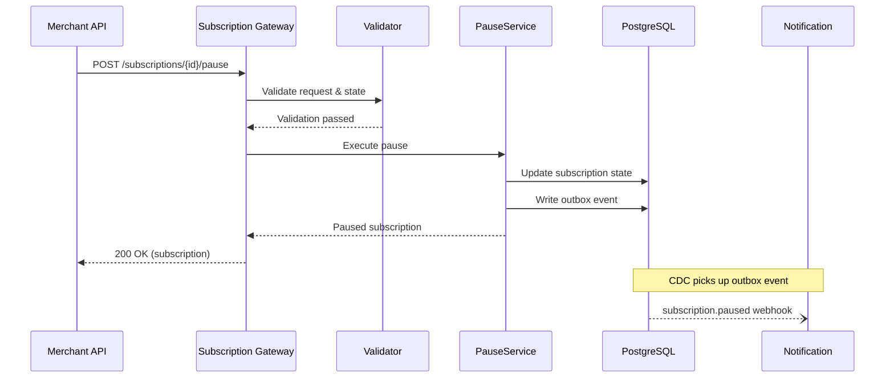

### 1.2 Technical Sequence

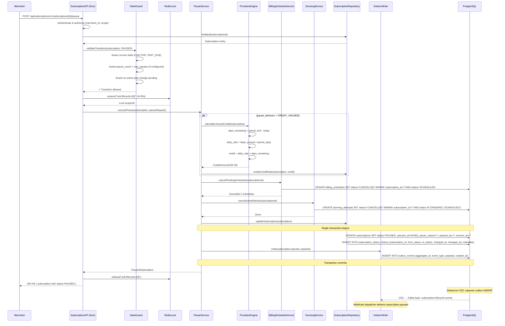

### 1.3 API Contract

```json
POST /api/subscriptions/v1/subscriptions/{id}/pause
Authorization: Bearer {merchant_api_key}
Content-Type: application/json
Idempotency-Key: {unique-key}

{
  "reason": "customer_request",
  "pause_behavior": "CREDIT_UNUSED",
  "resume_at": "2024-04-01T00:00:00Z",
  "preserve_billing_anchor": true,
  "metadata": {
    "requested_by": "customer_support",
    "ticket_id": "SUP-12345"
  }
}
```

**Response:**
```json
{
  "id": "sub_01HQXK...",
  "status": "PAUSED",
  "paused_at": "2024-01-25T10:30:00Z",
  "resume_at": "2024-04-01T00:00:00Z",
  "pause_behavior": "CREDIT_UNUSED",
  "credit_note_id": "cn_01HQXL...",
  "credit_amount": 16633,
  "current_period_start": "2024-01-15T00:00:00Z",
  "current_period_end": "2024-02-15T00:00:00Z",
  "plan": { "id": "plan_basic", "name": "Basic" },
  "billing_anchor_preserved": true
}
```

### 1.4 Pause Options & Behavior Matrix

| Option | Value | Behavior |
|--------|-------|----------|
| `pause_behavior` | `CREDIT_UNUSED` | Calculate credit for unused days in current period |
| `pause_behavior` | `NO_CREDIT` | No credit issued; customer loses unused days |
| `resume_at` | ISO datetime | System auto-resumes at this date via scheduled job |
| `resume_at` | `null` | Indefinite pause (subject to max_pause_duration) |
| `preserve_billing_anchor` | `true` | On resume, billing date stays the same (e.g., 15th of month) |
| `preserve_billing_anchor` | `false` | On resume, new billing cycle starts from resume date |

### 1.5 Kotlin Implementation

```kotlin
// PauseService.kt
class PauseService(
    private val subscriptionRepo: SubscriptionRepository,
    private val billingScheduleService: BillingScheduleService,
    private val dunningService: DunningService,
    private val prorationEngine: ProrationEngine,
    private val outboxWriter: OutboxWriter,
    private val creditNoteService: CreditNoteService,
    private val clock: Clock
) {
    suspend fun executePause(
        subscription: Subscription,
        request: PauseRequest
    ): PauseResult = withContext(Dispatchers.IO) {

        val now = clock.instant()

        // Calculate credit if applicable
        val creditNote = when (request.pauseBehavior) {
            PauseBehavior.CREDIT_UNUSED -> {
                val credit = prorationEngine.calculateUnusedCredit(
                    subscription = subscription,
                    effectiveDate = now
                )
                if (credit.amount > 0) {
                    creditNoteService.create(
                        subscriptionId = subscription.id,
                        amount = credit.amount,
                        currency = subscription.currency,
                        reason = "Pause credit: ${credit.daysRemaining} unused days",
                        applyTo = CreditApplication.NEXT_INVOICE
                    )
                } else null
            }
            PauseBehavior.NO_CREDIT -> null
        }

        // Cancel future billing
        billingScheduleService.cancelPendingSchedules(subscription.id)
        dunningService.cancelActiveRetries(subscription.id)

        // Persist state change
        val pausedSubscription = subscription.copy(
            status = SubscriptionStatus.PAUSED,
            pausedAt = now,
            pauseReason = request.reason,
            pausedBy = request.pausedBy,
            resumeAt = request.resumeAt,
            preserveBillingAnchor = request.preserveBillingAnchor,
            pauseCount = subscription.pauseCount + 1,
            updatedAt = now
        )

        subscriptionRepo.transactional {
            subscriptionRepo.update(pausedSubscription)
            subscriptionRepo.insertStatusHistory(
                StatusHistoryEntry(
                    subscriptionId = subscription.id,
                    fromStatus = subscription.status,
                    toStatus = SubscriptionStatus.PAUSED,
                    changedAt = now,
                    changedBy = request.pausedBy,
                    metadata = mapOf(
                        "reason" to request.reason.name,
                        "credit_note_id" to creditNote?.id,
                        "resume_at" to request.resumeAt?.toString()
                    )
                )
            )
            outboxWriter.write(
                aggregateId = subscription.id,
                eventType = "subscription.paused",
                payload = SubscriptionPausedEvent(
                    subscriptionId = subscription.id,
                    merchantId = subscription.merchantId,
                    customerId = subscription.customerId,
                    pausedAt = now,
                    reason = request.reason,
                    resumeAt = request.resumeAt,
                    creditNoteId = creditNote?.id,
                    creditAmount = creditNote?.amount
                )
            )
        }

        PauseResult(
            subscription = pausedSubscription,
            creditNote = creditNote
        )
    }
}
```

---

## Flow 2: Resume Subscription

### 2.1 Functional Sequence

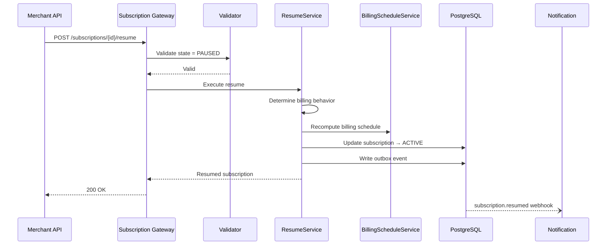

### 2.2 Technical Sequence

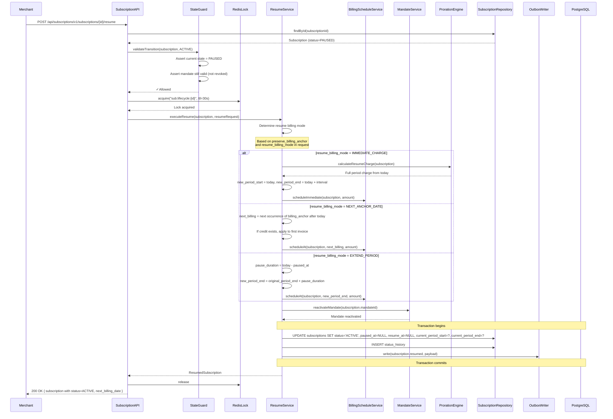

### 2.3 Resume Billing Scenarios

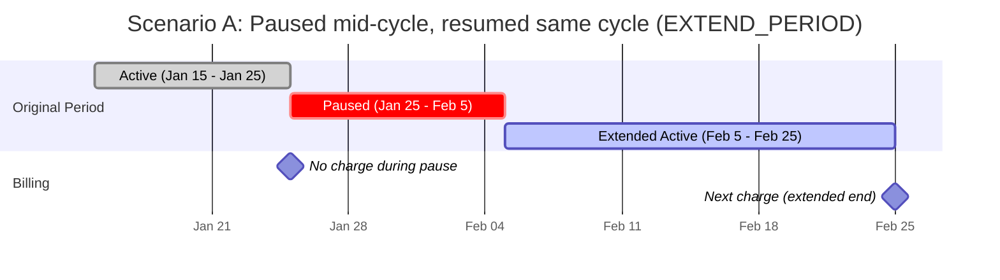

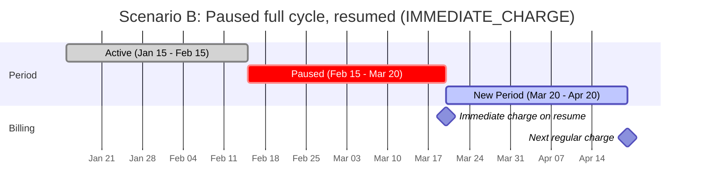

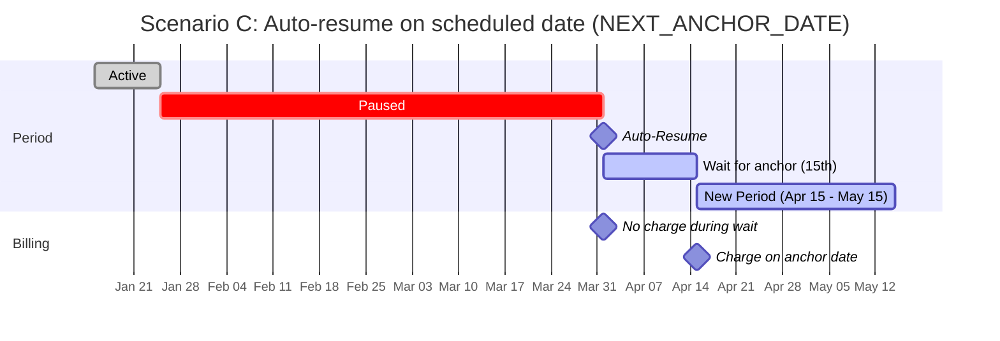

### 2.4 API Contract

```json
POST /api/subscriptions/v1/subscriptions/{id}/resume
Authorization: Bearer {merchant_api_key}
Content-Type: application/json
Idempotency-Key: {unique-key}

{
  "resume_billing_mode": "NEXT_ANCHOR_DATE",
  "metadata": {
    "resumed_by": "customer_support"
  }
}
```

### 2.5 Auto-Resume Scheduled Job

```kotlin
// AutoResumeJob.kt — runs every hour via pg_cron or Quartz
class AutoResumeJob(
    private val subscriptionRepo: SubscriptionRepository,
    private val resumeService: ResumeService,
    private val lockManager: DistributedLockManager
) {
    suspend fun execute() {
        val now = Clock.System.now()
        val candidates = subscriptionRepo.findByStatusAndResumeAtBefore(
            status = SubscriptionStatus.PAUSED,
            resumeAtBefore = now,
            limit = 100
        )

        candidates.forEach { subscription ->
            lockManager.withLock("sub:lifecycle:${subscription.id}") {
                try {
                    resumeService.executeResume(
                        subscription = subscription,
                        request = ResumeRequest(
                            resumeBillingMode = ResumeBillingMode.NEXT_ANCHOR_DATE,
                            triggeredBy = "system:auto_resume"
                        )
                    )
                    logger.info { "Auto-resumed subscription ${subscription.id}" }
                } catch (e: Exception) {
                    logger.error(e) { "Failed to auto-resume ${subscription.id}" }
                    // Will retry on next job execution
                }
            }
        }
    }
}
```

---

## Flow 3: Cancel Subscription (Immediate)

### 3.1 Functional Sequence

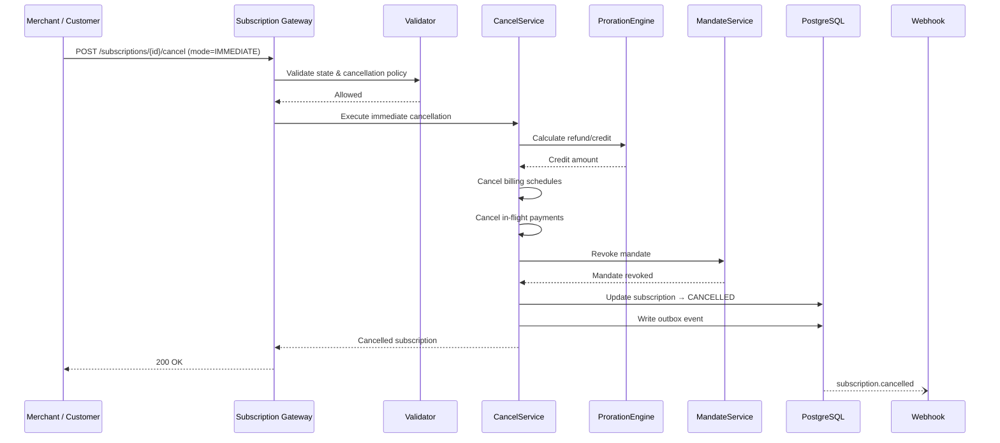

### 3.2 Technical Sequence

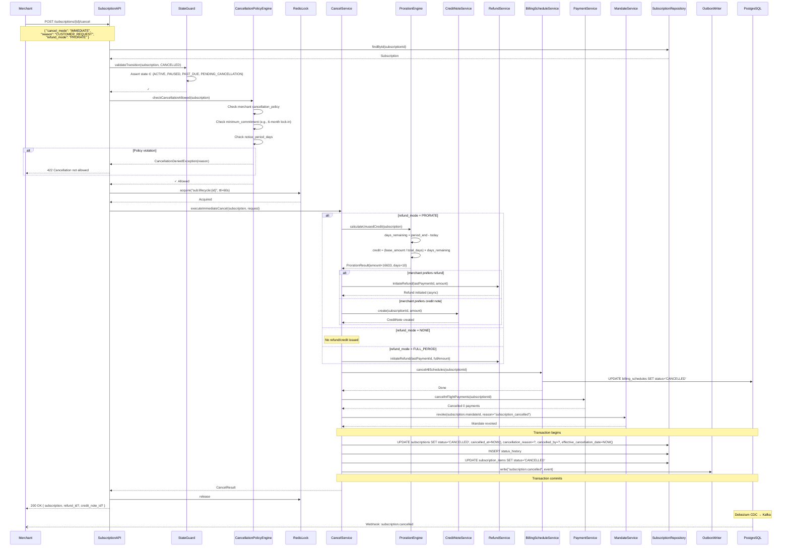

### 3.3 Cancellation Reasons

```kotlin
enum class CancellationReason {
    CUSTOMER_REQUEST,        // Customer asked to cancel
    PAYMENT_FAILURE,         // Dunning exhausted, auto-cancel
    MERCHANT_REQUEST,        // Merchant-initiated cancellation
    FRAUD_DETECTED,          // Fraud system triggered cancellation
    MANDATE_REVOKED,         // Customer revoked payment mandate externally
    PLAN_DISCONTINUED,       // Plan no longer available
    ACCOUNT_CLOSED,          // Customer account deleted
    REGULATORY_COMPLIANCE,   // Legal/regulatory requirement
    TERMS_VIOLATION,         // Customer violated terms of service
    SYSTEM_MIGRATION,        // Migrated to different subscription
    TRIAL_EXPIRED            // Trial ended without conversion
}
```

### 3.4 API Contract

```json
POST /api/subscriptions/v1/subscriptions/{id}/cancel
Authorization: Bearer {merchant_api_key}
Content-Type: application/json
Idempotency-Key: {unique-key}

{
  "cancel_mode": "IMMEDIATE",
  "reason": "CUSTOMER_REQUEST",
  "refund_mode": "PRORATE",
  "cancellation_note": "Customer moving to competitor",
  "metadata": {
    "retention_offered": true,
    "retention_declined": true
  }
}
```

**Response:**
```json
{
  "id": "sub_01HQXK...",
  "status": "CANCELLED",
  "cancelled_at": "2024-01-25T10:30:00Z",
  "cancellation_reason": "CUSTOMER_REQUEST",
  "effective_cancellation_date": "2024-01-25T10:30:00Z",
  "refund": {
    "id": "rfnd_01HQX...",
    "amount": 16633,
    "currency": "INR",
    "status": "PROCESSING"
  },
  "mandate_status": "REVOKED",
  "final_invoice_id": null
}
```

---

## Flow 4: Cancel Subscription (End of Term)

### 4.1 Functional Sequence

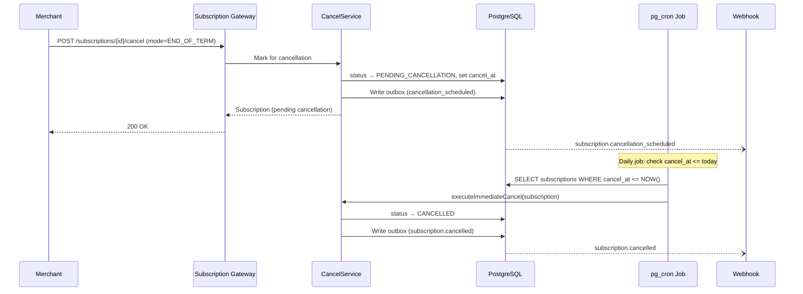

### 4.2 Technical Sequence

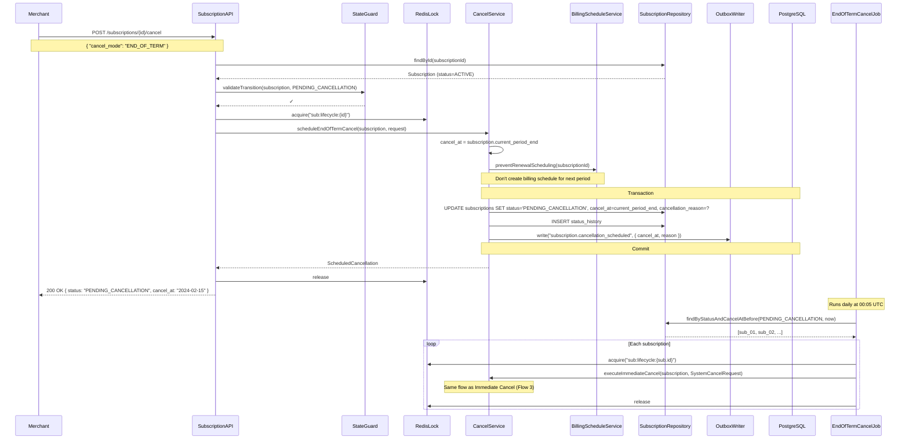

### 4.3 End-of-Term Cancel Behavior

```
Timeline Example:
━━━━━━━━━━━━━━━━━━━━━━━━━━━━━━━━━━━━━━━━━━━━━━━━━━━━━━━━━━━
Jan 15          Jan 25                Feb 15
│────────────────│─────────────────────│
│  Period Start  │  Cancel Requested   │  Period End (cancel_at)
│                │                     │
│  ACTIVE        │  PENDING_CANCEL     │  CANCELLED
│                │  (service continues)│  (mandate revoked)
│                │  (no new billing)   │
━━━━━━━━━━━━━━━━━━━━━━━━━━━━━━━━━━━━━━━━━━━━━━━━━━━━━━━━━━━━━
```

### 4.4 Reactivation (Undo End-of-Term Cancel)

Merchants can undo a pending cancellation before it takes effect:

```json
POST /api/subscriptions/v1/subscriptions/{id}/reactivate
{
  "reason": "customer_changed_mind"
}
```

This transitions `PENDING_CANCELLATION → ACTIVE`, clears `cancel_at`, and reschedules billing.

---

## Flow 5: Upgrade Plan

### 5.1 Functional Sequence

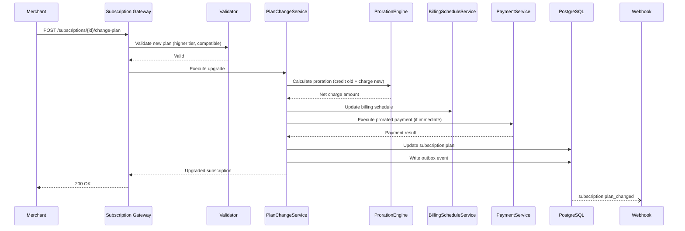

### 5.2 Technical Sequence

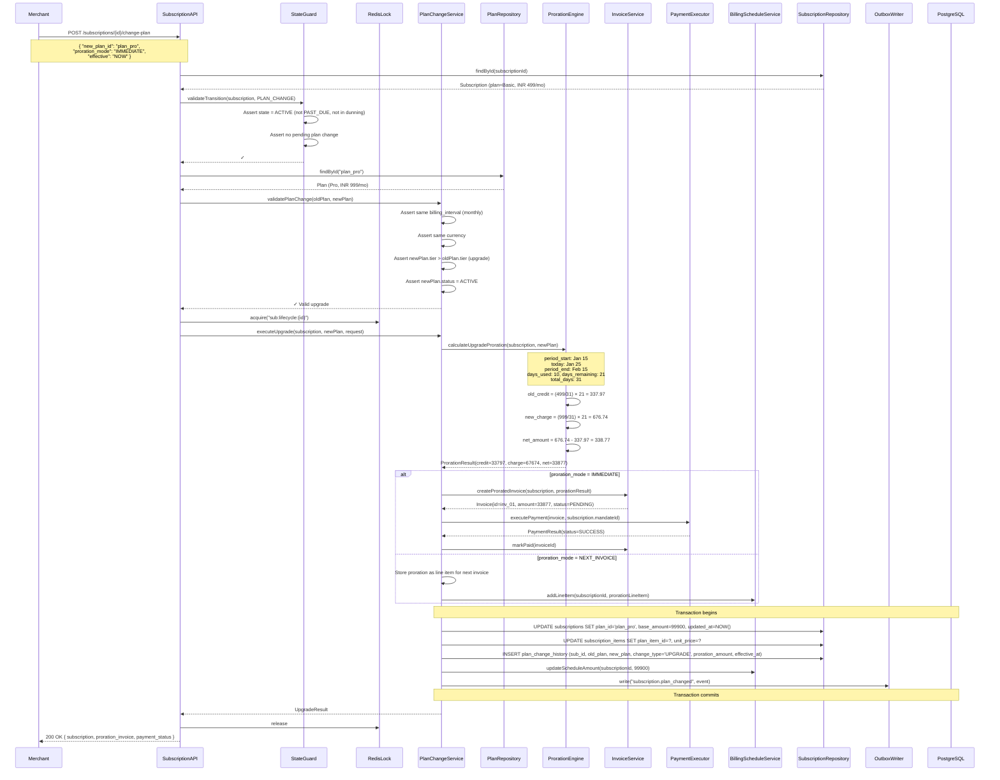

### 5.3 Proration Calculation Detail

```
┌─────────────────────────────────────────────────────────────────┐
│                    UPGRADE PRORATION EXAMPLE                      │
├─────────────────────────────────────────────────────────────────┤
│                                                                   │
│  Current Plan: Basic (INR 499/month)                             │
│  New Plan:     Pro   (INR 999/month)                             │
│  Billing Period: Jan 15 → Feb 15 (31 days)                       │
│  Upgrade Date:   Jan 25 (10 days used, 21 days remaining)        │
│                                                                   │
│  ┌─────────────────────────────────────────────────────────┐     │
│  │ Jan 15        Jan 25                    Feb 15          │     │
│  │ ├──────────────┼──────────────────────────┤             │     │
│  │ │◄─ 10 days ─►│◄────── 21 days ────────►│             │     │
│  │ │  Basic @499  │       Pro @999           │             │     │
│  │ │  (already    │                          │             │     │
│  │ │   paid)      │                          │             │     │
│  └─────────────────────────────────────────────────────────┘     │
│                                                                   │
│  CALCULATION:                                                     │
│  ─────────────                                                    │
│  Old plan daily rate:  499 / 31 = INR 16.10/day                  │
│  New plan daily rate:  999 / 31 = INR 32.23/day                  │
│                                                                   │
│  Credit for unused Basic: 16.10 × 21 = INR 338.10               │
│  Charge for Pro remainder: 32.23 × 21 = INR 676.83              │
│                                                                   │
│  NET CHARGE: 676.83 - 338.10 = INR 338.73                       │
│                                                                   │
│  Next full cycle (Feb 15): INR 999 (full Pro price)              │
│                                                                   │
└─────────────────────────────────────────────────────────────────┘
```

### 5.4 API Contract

```json
POST /api/subscriptions/v1/subscriptions/{id}/change-plan
Authorization: Bearer {merchant_api_key}
Content-Type: application/json
Idempotency-Key: {unique-key}

{
  "new_plan_id": "plan_pro_monthly",
  "proration_mode": "IMMEDIATE",
  "effective": "NOW",
  "metadata": {
    "upgrade_reason": "customer_needs_more_features"
  }
}
```

**Response:**
```json
{
  "id": "sub_01HQXK...",
  "status": "ACTIVE",
  "plan": {
    "id": "plan_pro_monthly",
    "name": "Pro",
    "amount": 99900,
    "currency": "INR",
    "interval": "MONTHLY"
  },
  "plan_change": {
    "type": "UPGRADE",
    "previous_plan_id": "plan_basic_monthly",
    "effective_at": "2024-01-25T10:30:00Z",
    "proration": {
      "credit_amount": 33810,
      "charge_amount": 67683,
      "net_amount": 33873,
      "invoice_id": "inv_01HQX..."
    },
    "payment": {
      "id": "pay_01HQX...",
      "status": "SUCCESS",
      "amount": 33873
    }
  },
  "next_billing_date": "2024-02-15T00:00:00Z",
  "next_billing_amount": 99900
}
```

---

## Flow 6: Downgrade Plan

### 6.1 Functional Sequence

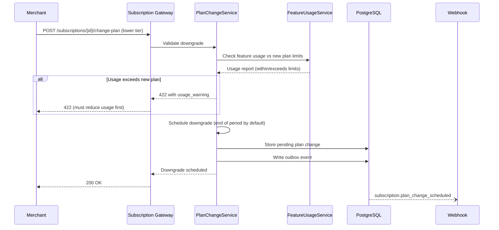

### 6.2 Technical Sequence

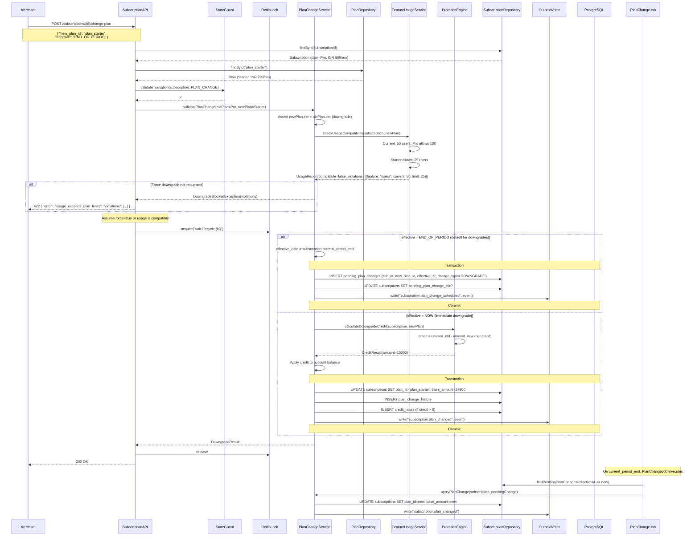

### 6.3 Downgrade Guardrails

```kotlin
data class UsageViolation(
    val feature: String,
    val currentUsage: Long,
    val newPlanLimit: Long,
    val requiredReduction: Long,
    val gracePeriodDays: Int? = null
)

class FeatureUsageService(
    private val usageRepo: UsageRepository,
    private val planRepo: PlanRepository
) {
    suspend fun checkUsageCompatibility(
        subscription: Subscription,
        newPlan: Plan
    ): UsageCompatibilityReport {
        val currentUsage = usageRepo.getCurrentUsage(subscription.id)
        val newLimits = planRepo.getPlanLimits(newPlan.id)

        val violations = newLimits.mapNotNull { (feature, limit) ->
            val usage = currentUsage[feature] ?: 0
            if (usage > limit) {
                UsageViolation(
                    feature = feature,
                    currentUsage = usage,
                    newPlanLimit = limit,
                    requiredReduction = usage - limit,
                    gracePeriodDays = newPlan.downgradeGracePeriodDays
                )
            } else null
        }

        return UsageCompatibilityReport(
            compatible = violations.isEmpty(),
            violations = violations
        )
    }
}
```

---

## Flow 7: Quantity Change (Seat-Based)

### 7.1 Functional Sequence

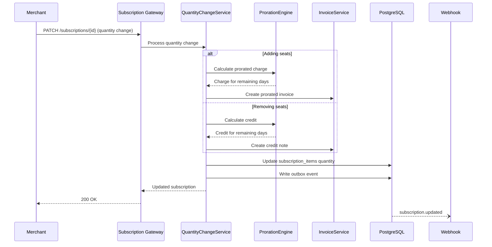

### 7.2 Technical Sequence

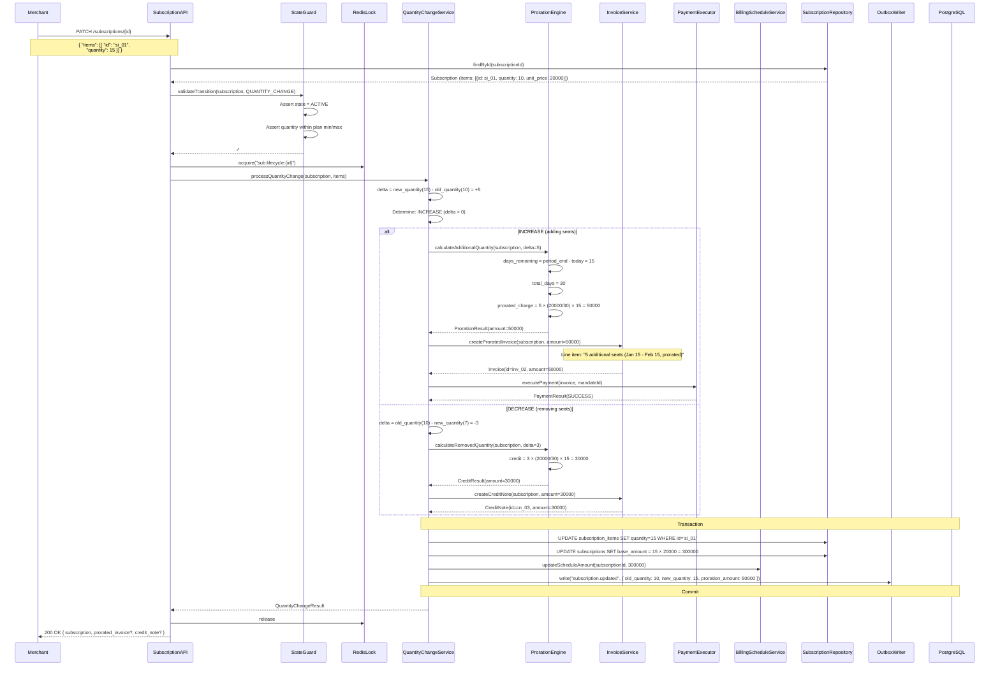

### 7.3 Quantity Change Example

```
┌─────────────────────────────────────────────────────────────────┐
│              SEAT-BASED QUANTITY CHANGE EXAMPLE                   │
├─────────────────────────────────────────────────────────────────┤
│                                                                   │
│  Plan: Per-Seat @ INR 200/seat/month                             │
│  Current: 10 seats (INR 2,000/month)                             │
│  Period: Jan 1 → Jan 31 (31 days)                                │
│  Change Date: Jan 16 (15 days remaining)                         │
│                                                                   │
│  ADDING 5 SEATS:                                                  │
│  ─────────────────                                                │
│  Prorated charge = 5 × (200/31) × 15 = INR 483.87               │
│  → Immediate invoice for INR 483.87                              │
│  → Next cycle (Feb 1): 15 × INR 200 = INR 3,000                 │
│                                                                   │
│  REMOVING 3 SEATS:                                                │
│  ─────────────────                                                │
│  Credit = 3 × (200/31) × 15 = INR 290.32                        │
│  → Credit note applied to next invoice                           │
│  → Next cycle (Feb 1): 7 × INR 200 = INR 1,400                  │
│  → Net next invoice: INR 1,400 - 290.32 = INR 1,109.68          │
│                                                                   │
└─────────────────────────────────────────────────────────────────┘
```

### 7.4 API Contract

```json
PATCH /api/subscriptions/v1/subscriptions/{id}
Authorization: Bearer {merchant_api_key}
Content-Type: application/json
Idempotency-Key: {unique-key}

{
  "items": [
    {
      "id": "si_01HQXK...",
      "quantity": 15
    }
  ],
  "proration_mode": "IMMEDIATE",
  "metadata": {
    "reason": "team_expansion"
  }
}
```

---

## Cancellation Policies

### Policy Configuration (per merchant/plan)

```kotlin
data class CancellationPolicy(
    val mode: CancellationMode,
    val minimumCommitmentMonths: Int? = null,
    val noticePeriodDays: Int? = null,
    val earlyTerminationFee: Long? = null,
    val prorateOnCancel: Boolean = true,
    val refundMode: RefundMode = RefundMode.CREDIT_NOTE,
    val allowReactivation: Boolean = true,
    val reactivationWindowDays: Int = 30
)

enum class CancellationMode {
    IMMEDIATE,      // Cancel right now
    END_OF_TERM,    // Cancel at period end
    CUSTOM_NOTICE,  // Requires N days notice
    NO_CANCEL       // Cannot cancel during commitment
}

enum class RefundMode {
    PRORATE_REFUND,    // Refund to original payment method
    CREDIT_NOTE,       // Issue credit on account
    NO_REFUND          // No refund issued
}
```

### Policy Matrix

| Policy | Behavior | Refund | Use Case |
|--------|----------|--------|----------|
| `IMMEDIATE` | Cancel right now, stop access immediately | Prorated credit/refund | Self-serve SaaS |
| `END_OF_TERM` | Active until period end, no renewal | No refund (already paid) | Standard subscriptions |
| `CUSTOM_NOTICE` | Requires N days notice before effective | Per contract terms | Enterprise contracts |
| `NO_CANCEL` | Cannot cancel during commitment term | Penalty fee if forced | Annual lock-in plans |

### Commitment Period Enforcement

```kotlin
fun validateCancellationPolicy(
    subscription: Subscription,
    policy: CancellationPolicy,
    request: CancelRequest
): CancellationValidation {
    // Check minimum commitment
    if (policy.minimumCommitmentMonths != null) {
        val commitmentEnd = subscription.startDate
            .plus(policy.minimumCommitmentMonths, DateTimeUnit.MONTH)
        val now = Clock.System.now()

        if (now < commitmentEnd) {
            if (request.forceCancel) {
                // Allow but charge early termination fee
                return CancellationValidation.AllowedWithPenalty(
                    fee = policy.earlyTerminationFee ?: 0,
                    commitmentEnd = commitmentEnd,
                    remainingMonths = commitmentEnd.monthsUntil(now)
                )
            }
            return CancellationValidation.Denied(
                reason = "Minimum commitment not met",
                commitmentEnd = commitmentEnd,
                earliestCancelDate = commitmentEnd
            )
        }
    }

    // Check notice period
    if (policy.noticePeriodDays != null && policy.noticePeriodDays > 0) {
        val earliestEffective = Clock.System.now()
            .plus(policy.noticePeriodDays, DateTimeUnit.DAY)
        return CancellationValidation.AllowedWithNotice(
            effectiveDate = earliestEffective,
            noticeDays = policy.noticePeriodDays
        )
    }

    return CancellationValidation.Allowed
}
```

---

## State Transition Guard Rails

### Valid Transitions Matrix

```
┌───────────────────────────────────────────────────────────────────────────┐
│                    STATE TRANSITION VALIDATION                              │
├───────────────────┬───────────────────────────────────────────────────────┤
│ Current State     │ Allowed Transitions                                    │
├───────────────────┼───────────────────────────────────────────────────────┤
│ ACTIVE            │ PAUSED, PENDING_CANCELLATION, CANCELLED, PLAN_CHANGE  │
│ PAUSED            │ ACTIVE (resume), CANCELLED                             │
│ PAST_DUE          │ ACTIVE (payment cleared), PAUSED, CANCELLED           │
│ PENDING_CANCEL    │ ACTIVE (reactivate), CANCELLED                         │
│ CANCELLED         │ ─ (terminal state, no transitions)                     │
│ EXPIRED           │ ─ (terminal state, no transitions)                     │
└───────────────────┴───────────────────────────────────────────────────────┘
```

### Guard Implementation

```kotlin
class StateGuard {
    private val allowedTransitions: Map<SubscriptionStatus, Set<SubscriptionStatus>> = mapOf(
        ACTIVE to setOf(PAUSED, PENDING_CANCELLATION, CANCELLED),
        PAUSED to setOf(ACTIVE, CANCELLED),
        PAST_DUE to setOf(ACTIVE, PAUSED, CANCELLED),
        PENDING_CANCELLATION to setOf(ACTIVE, CANCELLED),
        // Terminal states
        CANCELLED to emptySet(),
        EXPIRED to emptySet()
    )

    private val planChangeAllowedFrom: Set<SubscriptionStatus> = setOf(ACTIVE)
    private val quantityChangeAllowedFrom: Set<SubscriptionStatus> = setOf(ACTIVE)

    fun validateTransition(
        subscription: Subscription,
        targetState: SubscriptionStatus
    ): ValidationResult {
        val currentState = subscription.status
        val allowed = allowedTransitions[currentState] ?: emptySet()

        if (targetState !in allowed) {
            return ValidationResult.Denied(
                "Cannot transition from $currentState to $targetState"
            )
        }

        return ValidationResult.Allowed
    }

    fun validatePlanChange(subscription: Subscription): ValidationResult {
        if (subscription.status !in planChangeAllowedFrom) {
            return ValidationResult.Denied(
                "Plan changes not allowed in ${subscription.status} state. " +
                "Clear outstanding dues first."
            )
        }
        if (subscription.pendingPlanChangeId != null) {
            return ValidationResult.Denied(
                "A plan change is already pending (${subscription.pendingPlanChangeId})"
            )
        }
        if (subscription.activeDunningCycleId != null) {
            return ValidationResult.Denied(
                "Cannot change plan during active dunning cycle"
            )
        }
        return ValidationResult.Allowed
    }

    fun validatePause(subscription: Subscription): ValidationResult {
        val base = validateTransition(subscription, PAUSED)
        if (base is ValidationResult.Denied) return base

        // Additional pause-specific checks
        val maxPauses = subscription.plan.maxPausesPerYear ?: Int.MAX_VALUE
        if (subscription.pauseCountThisYear >= maxPauses) {
            return ValidationResult.Denied(
                "Maximum pauses ($maxPauses) reached for this year"
            )
        }

        val maxDuration = subscription.plan.maxPauseDurationDays ?: 90
        // Check if previous pauses exceeded limit (informational)

        return ValidationResult.Allowed
    }
}
```

### Enforcement Rules Summary

| Rule | Description | Error Code |
|------|-------------|------------|
| No self-transition | Cannot pause a PAUSED subscription | `INVALID_STATE_TRANSITION` |
| No resume if active | Cannot resume an ACTIVE subscription | `INVALID_STATE_TRANSITION` |
| Terminal states immutable | Cannot modify CANCELLED/EXPIRED | `SUBSCRIPTION_TERMINATED` |
| Clear dues before change | Upgrade/downgrade blocked during PAST_DUE | `OUTSTANDING_DUES` |
| No change during dunning | Plan/quantity changes blocked in dunning | `ACTIVE_DUNNING_CYCLE` |
| Pause limits | Max 3 pauses per year (configurable) | `PAUSE_LIMIT_REACHED` |
| Pause duration | Max 90 days (configurable) | `PAUSE_DURATION_EXCEEDED` |
| Single pending change | Only one plan change can be pending | `PLAN_CHANGE_PENDING` |
| Commitment enforcement | Cannot cancel during lock-in period | `COMMITMENT_NOT_MET` |

---

## Webhook Events Emitted

### Event Catalog

| Action | Event Type | Trigger |
|--------|-----------|---------|
| Pause | `subscription.paused` | Subscription paused successfully |
| Resume | `subscription.resumed` | Subscription resumed (manual or auto) |
| Cancel (immediate) | `subscription.cancelled` | Subscription cancelled immediately |
| Cancel (scheduled) | `subscription.cancellation_scheduled` | End-of-term cancellation scheduled |
| Cancel (executed) | `subscription.cancelled` | Scheduled cancellation executed |
| Reactivate | `subscription.reactivated` | Pending cancellation undone |
| Upgrade | `subscription.plan_changed` | Plan upgraded (immediate or scheduled) |
| Downgrade scheduled | `subscription.plan_change_scheduled` | Downgrade scheduled for end of period |
| Downgrade applied | `subscription.plan_changed` | Downgrade applied at period end |
| Quantity change | `subscription.updated` | Seats/units added or removed |

### Event Payloads

```json
// subscription.paused
{
  "event_type": "subscription.paused",
  "subscription_id": "sub_01HQXK...",
  "merchant_id": "mer_01HQ...",
  "customer_id": "cus_01HQ...",
  "data": {
    "pause_reason": "CUSTOMER_REQUEST",
    "paused_at": "2024-01-25T10:30:00Z",
    "resume_at": "2024-04-01T00:00:00Z",
    "pause_behavior": "CREDIT_UNUSED",
    "credit_note_id": "cn_01HQ...",
    "credit_amount": 16633,
    "previous_status": "ACTIVE"
  }
}

// subscription.resumed
{
  "event_type": "subscription.resumed",
  "subscription_id": "sub_01HQXK...",
  "data": {
    "resumed_at": "2024-04-01T00:00:00Z",
    "resume_trigger": "AUTO_RESUME",
    "next_billing_date": "2024-04-15T00:00:00Z",
    "next_billing_amount": 49900,
    "pause_duration_days": 66,
    "previous_status": "PAUSED"
  }
}

// subscription.cancelled
{
  "event_type": "subscription.cancelled",
  "subscription_id": "sub_01HQXK...",
  "data": {
    "cancelled_at": "2024-01-25T10:30:00Z",
    "cancellation_reason": "CUSTOMER_REQUEST",
    "cancel_mode": "IMMEDIATE",
    "refund_amount": 16633,
    "refund_id": "rfnd_01HQ...",
    "mandate_revoked": true,
    "final_period_end": "2024-02-15T00:00:00Z",
    "previous_status": "ACTIVE"
  }
}

// subscription.cancellation_scheduled
{
  "event_type": "subscription.cancellation_scheduled",
  "subscription_id": "sub_01HQXK...",
  "data": {
    "scheduled_at": "2024-01-25T10:30:00Z",
    "cancel_at": "2024-02-15T00:00:00Z",
    "cancellation_reason": "CUSTOMER_REQUEST",
    "service_continues_until": "2024-02-15T00:00:00Z",
    "can_reactivate": true
  }
}

// subscription.plan_changed
{
  "event_type": "subscription.plan_changed",
  "subscription_id": "sub_01HQXK...",
  "data": {
    "change_type": "UPGRADE",
    "old_plan": {
      "id": "plan_basic",
      "name": "Basic",
      "amount": 49900
    },
    "new_plan": {
      "id": "plan_pro",
      "name": "Pro",
      "amount": 99900
    },
    "effective_at": "2024-01-25T10:30:00Z",
    "proration": {
      "credit_amount": 33810,
      "charge_amount": 67683,
      "net_amount": 33873,
      "invoice_id": "inv_01HQ..."
    }
  }
}

// subscription.updated (quantity change)
{
  "event_type": "subscription.updated",
  "subscription_id": "sub_01HQXK...",
  "data": {
    "change_type": "QUANTITY_CHANGE",
    "items_changed": [
      {
        "item_id": "si_01HQ...",
        "old_quantity": 10,
        "new_quantity": 15,
        "unit_price": 20000
      }
    ],
    "old_total_amount": 200000,
    "new_total_amount": 300000,
    "proration_amount": 50000,
    "proration_invoice_id": "inv_01HQ..."
  }
}
```

---

## Distributed Locking Strategy

All lifecycle operations acquire a distributed lock to prevent race conditions (e.g., concurrent pause + cancel).

```kotlin
class DistributedLockManager(
    private val redis: RedisCoroutinesCommands<String, String>,
    private val instanceId: String = UUID.randomUUID().toString()
) {
    suspend fun <T> withLock(
        key: String,
        ttl: Duration = 30.seconds,
        block: suspend () -> T
    ): T {
        val lockKey = "lock:$key"
        val lockValue = "$instanceId:${Clock.System.now().toEpochMilliseconds()}"

        // Acquire with retry
        val acquired = retryWithBackoff(maxAttempts = 5, baseDelay = 100.milliseconds) {
            redis.set(lockKey, lockValue, SetArgs().nx().px(ttl.inWholeMilliseconds)) == "OK"
        }

        if (!acquired) {
            throw ConcurrentModificationException(
                "Failed to acquire lock for $key. Another operation is in progress."
            )
        }

        try {
            return block()
        } finally {
            // Release only if we still own the lock (Lua script for atomicity)
            val script = """
                if redis.call("get", KEYS[1]) == ARGV[1] then
                    return redis.call("del", KEYS[1])
                else
                    return 0
                end
            """.trimIndent()
            redis.eval(script, ScriptOutputType.INTEGER, arrayOf(lockKey), lockValue)
        }
    }
}
```

---

## Idempotency

All lifecycle endpoints require an `Idempotency-Key` header to prevent duplicate operations:

```kotlin
class IdempotencyInterceptor(
    private val redis: RedisCoroutinesCommands<String, String>
) {
    suspend fun <T> executeIdempotent(
        key: String,
        ttl: Duration = 24.hours,
        block: suspend () -> T
    ): T {
        val idempotencyKey = "idempotency:$key"

        // Check if already processed
        val cached = redis.get(idempotencyKey)
        if (cached != null) {
            return Json.decodeFromString(cached)
        }

        // Execute operation
        val result = block()

        // Cache result
        redis.setex(idempotencyKey, ttl.inWholeSeconds, Json.encodeToString(result))

        return result
    }
}
```

---

## Error Handling

### Error Response Format

```json
{
  "error": {
    "code": "INVALID_STATE_TRANSITION",
    "message": "Cannot pause subscription in PAUSED state",
    "details": {
      "subscription_id": "sub_01HQXK...",
      "current_status": "PAUSED",
      "requested_action": "PAUSE",
      "allowed_actions": ["RESUME", "CANCEL"]
    }
  },
  "request_id": "req_01HQX..."
}
```

### Error Codes

| Code | HTTP Status | Description |
|------|-------------|-------------|
| `INVALID_STATE_TRANSITION` | 409 | Current state doesn't allow this operation |
| `SUBSCRIPTION_NOT_FOUND` | 404 | Subscription ID doesn't exist |
| `SUBSCRIPTION_TERMINATED` | 409 | Subscription is cancelled/expired |
| `OUTSTANDING_DUES` | 409 | Must clear past-due amount first |
| `ACTIVE_DUNNING_CYCLE` | 409 | Operation blocked during dunning |
| `PAUSE_LIMIT_REACHED` | 422 | Max pauses per year exhausted |
| `PAUSE_DURATION_EXCEEDED` | 422 | Would exceed max pause duration |
| `PLAN_CHANGE_PENDING` | 409 | Another plan change is scheduled |
| `COMMITMENT_NOT_MET` | 422 | Minimum commitment period not completed |
| `USAGE_EXCEEDS_PLAN` | 422 | Current usage exceeds new plan limits |
| `INCOMPATIBLE_PLAN` | 422 | Plans have different intervals/currencies |
| `MANDATE_REVOKED` | 409 | Payment mandate no longer valid |
| `CONCURRENT_MODIFICATION` | 409 | Another operation is in progress |
| `IDEMPOTENCY_CONFLICT` | 409 | Same idempotency key, different payload |

---

## Database Schema (Lifecycle-Specific)

```sql
-- Pause/resume metadata
ALTER TABLE subscriptions ADD COLUMN IF NOT EXISTS
    paused_at TIMESTAMPTZ,
    pause_reason VARCHAR(50),
    paused_by VARCHAR(100),
    resume_at TIMESTAMPTZ,
    preserve_billing_anchor BOOLEAN DEFAULT true,
    pause_count INT DEFAULT 0;

-- Cancellation metadata
ALTER TABLE subscriptions ADD COLUMN IF NOT EXISTS
    cancelled_at TIMESTAMPTZ,
    cancellation_reason VARCHAR(50),
    cancelled_by VARCHAR(100),
    cancel_at TIMESTAMPTZ,  -- scheduled cancellation date
    effective_cancellation_date TIMESTAMPTZ;

-- Plan change tracking
CREATE TABLE pending_plan_changes (
    id UUID PRIMARY KEY DEFAULT gen_random_uuid(),
    subscription_id UUID NOT NULL REFERENCES subscriptions(id),
    old_plan_id UUID NOT NULL,
    new_plan_id UUID NOT NULL,
    change_type VARCHAR(20) NOT NULL,  -- UPGRADE, DOWNGRADE
    effective_at TIMESTAMPTZ NOT NULL,
    status VARCHAR(20) NOT NULL DEFAULT 'PENDING',  -- PENDING, APPLIED, CANCELLED
    created_at TIMESTAMPTZ NOT NULL DEFAULT NOW(),
    applied_at TIMESTAMPTZ,
    metadata JSONB DEFAULT '{}'
);

CREATE INDEX idx_pending_plan_changes_status_effective
    ON pending_plan_changes(status, effective_at)
    WHERE status = 'PENDING';

-- Plan change history (audit trail)
CREATE TABLE plan_change_history (
    id UUID PRIMARY KEY DEFAULT gen_random_uuid(),
    subscription_id UUID NOT NULL REFERENCES subscriptions(id),
    old_plan_id UUID NOT NULL,
    new_plan_id UUID NOT NULL,
    change_type VARCHAR(20) NOT NULL,
    proration_credit BIGINT DEFAULT 0,
    proration_charge BIGINT DEFAULT 0,
    net_amount BIGINT DEFAULT 0,
    invoice_id UUID,
    effective_at TIMESTAMPTZ NOT NULL,
    created_at TIMESTAMPTZ NOT NULL DEFAULT NOW()
);

-- Status history (full audit log)
CREATE TABLE subscription_status_history (
    id UUID PRIMARY KEY DEFAULT gen_random_uuid(),
    subscription_id UUID NOT NULL REFERENCES subscriptions(id),
    from_status VARCHAR(30) NOT NULL,
    to_status VARCHAR(30) NOT NULL,
    changed_at TIMESTAMPTZ NOT NULL DEFAULT NOW(),
    changed_by VARCHAR(100) NOT NULL,
    metadata JSONB DEFAULT '{}'
);

CREATE INDEX idx_status_history_sub_id
    ON subscription_status_history(subscription_id, changed_at DESC);
```

---

## Observability

### Key Metrics

| Metric | Type | Labels |
|--------|------|--------|
| `subscription.lifecycle.operation.total` | Counter | `operation`, `status`, `merchant_id` |
| `subscription.lifecycle.operation.duration_ms` | Histogram | `operation` |
| `subscription.pause.active` | Gauge | `merchant_id` |
| `subscription.cancel.reason` | Counter | `reason`, `mode` |
| `subscription.plan_change.total` | Counter | `direction` (upgrade/downgrade) |
| `subscription.proration.amount` | Histogram | `operation` |
| `subscription.lock.acquisition.duration_ms` | Histogram | — |
| `subscription.lock.timeout.total` | Counter | — |

### Structured Log Events

```json
{
  "level": "INFO",
  "message": "Subscription lifecycle operation completed",
  "subscription_id": "sub_01HQXK...",
  "merchant_id": "mer_01HQ...",
  "operation": "PAUSE",
  "from_status": "ACTIVE",
  "to_status": "PAUSED",
  "duration_ms": 145,
  "proration_amount": 16633,
  "trace_id": "abc123...",
  "span_id": "def456..."
}
```

---

## Summary

The lifecycle management workflow provides a robust, transactional system for managing subscription state changes with:

- **Atomic state transitions** via distributed locks and PostgreSQL transactions
- **Proration engine** for fair billing on mid-cycle changes
- **Policy enforcement** via configurable cancellation policies and state guards
- **Event-driven architecture** with Debezium CDC for reliable webhook delivery
- **Idempotent operations** to handle retries safely
- **Full audit trail** via status history and plan change history tables
