# 09 — Webhook & Notification Workflow

> Event-driven merchant and customer notification system for the Plural Subscriptions platform.

---

## Functional Overview

The notification system provides two distinct channels triggered by subscription events flowing through Kafka:

| Channel | Target | Purpose |
|---------|--------|---------|
| **Merchant Webhooks** | Server-to-server | Subscription lifecycle events delivered to merchant endpoints |
| **Customer Notifications** | End customers | SMS, Email, WhatsApp, Push for payment reminders, receipts, alerts |

Both channels follow the **Transactional Outbox Pattern** — events are first persisted in the database alongside business state changes, then captured by Debezium CDC and published to Kafka, ensuring at-least-once delivery without distributed transaction coordination.

---

## Flow 1: Merchant Webhook Delivery

### Functional Sequence

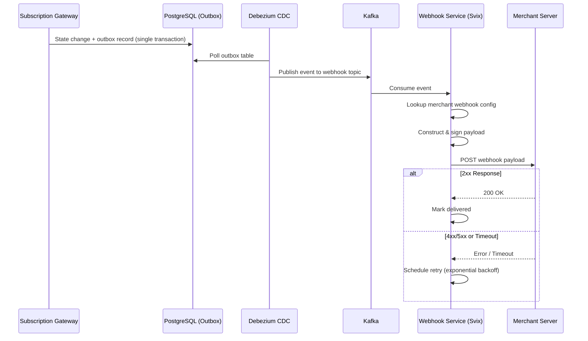

### Technical Sequence (Detailed)

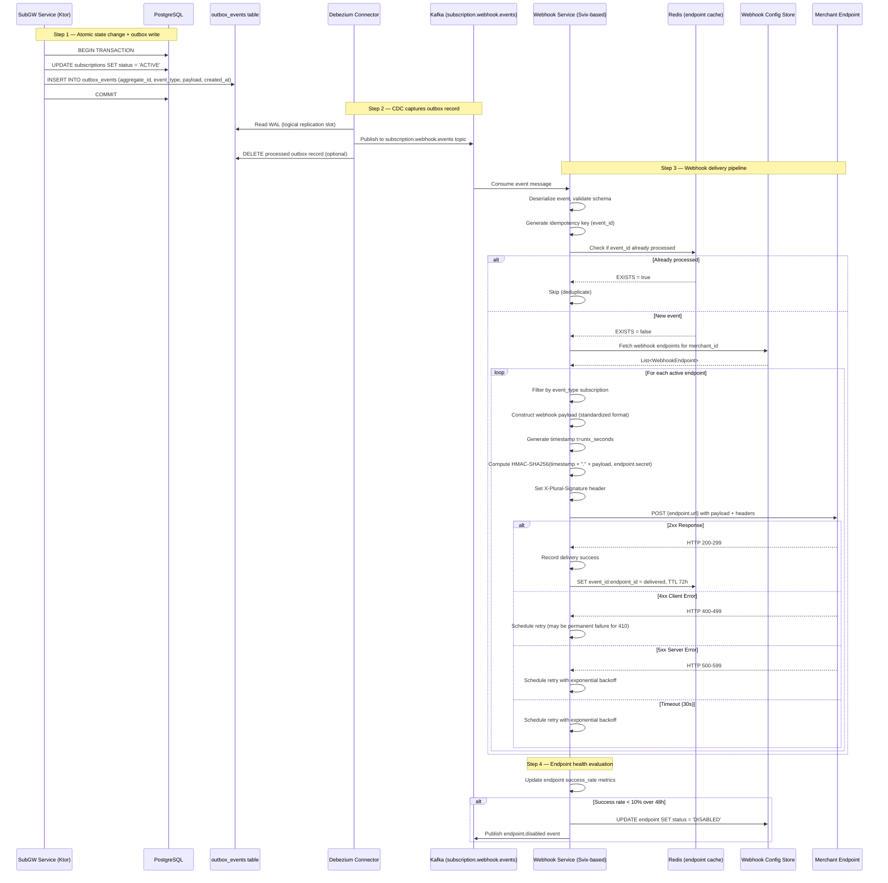

### Webhook Payload Structure

All webhook payloads follow a standardized envelope format:

```json
{
  "id": "evt_01HQ3K7M8N2P4R6T8V0X2Z4B6D",
  "type": "subscription.invoice.paid",
  "api_version": "2024-01-01",
  "created_at": "2024-01-15T10:30:00Z",
  "livemode": true,
  "data": {
    "object": "event_data",
    "subscription_id": "sub_01HQ3K7M8N2P4R6T8V0X",
    "invoice_id": "inv_01HQ3K7M8N2P4R6T8V0X",
    "amount": {
      "value": 141034,
      "currency": "INR"
    },
    "billing_period": {
      "start": "2024-01-15",
      "end": "2024-02-14"
    },
    "payment_method": "UPI_AUTOPAY",
    "attempt_number": 1,
    "customer_id": "cust_01HQ3K7M8N2P4R6T8V0X",
    "plan_id": "plan_pro_monthly"
  },
  "merchant_id": "merch_01HQ3K7M8N2P4R6T8V0X",
  "request": {
    "idempotency_key": null
  }
}
```

#### Payload Field Reference

| Field | Type | Description |
|-------|------|-------------|
| `id` | string | Unique event identifier (ULID format, prefixed `evt_`) |
| `type` | string | Dot-notation event type (e.g., `subscription.created`) |
| `api_version` | string | API version this payload conforms to |
| `created_at` | ISO 8601 | Timestamp when event occurred |
| `livemode` | boolean | `true` for production, `false` for sandbox |
| `data` | object | Event-specific payload data |
| `merchant_id` | string | Merchant this event belongs to |
| `request` | object | Original request context (if event was API-triggered) |

### Webhook Signature Verification

Every webhook delivery includes an `X-Plural-Signature` header for payload authenticity verification:

```
X-Plural-Signature: t=1705312200,v1=5257a869e7ecebeda32affa62cdca3fa51cad7e77a0e56ff536d0ce8e108d8bd
```

#### Signature Construction

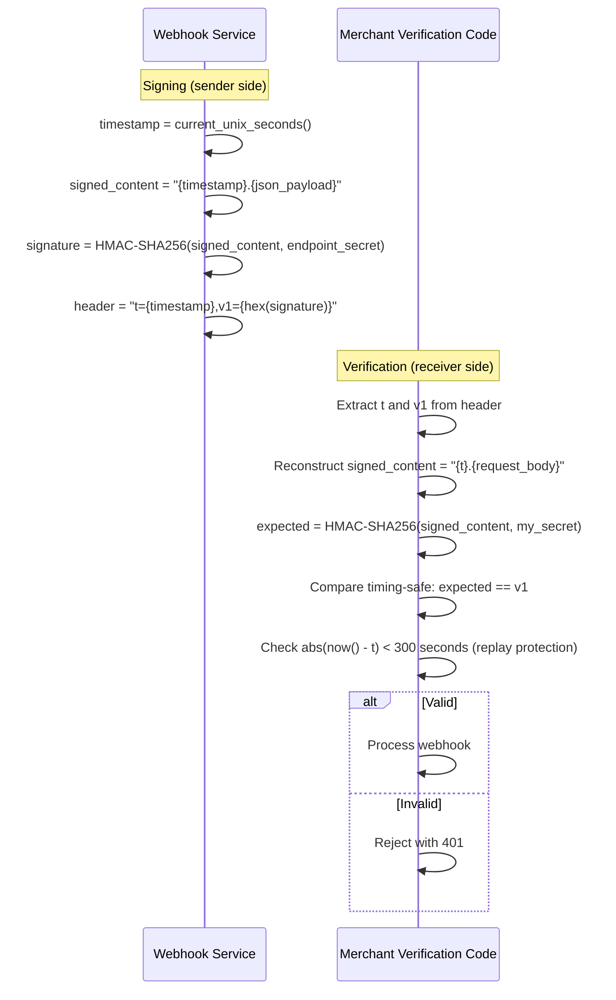

#### Merchant Verification Code (Kotlin Example)

```kotlin
import javax.crypto.Mac
import javax.crypto.spec.SecretKeySpec
import kotlin.math.abs

fun verifyWebhookSignature(
    payload: String,
    signatureHeader: String,
    secret: String,
    toleranceSeconds: Long = 300
): Boolean {
    val parts = signatureHeader.split(",").associate {
        val (key, value) = it.split("=", limit = 2)
        key to value
    }

    val timestamp = parts["t"]?.toLongOrNull() ?: return false
    val expectedSignature = parts["v1"] ?: return false

    // Replay protection
    if (abs(System.currentTimeMillis() / 1000 - timestamp) > toleranceSeconds) {
        return false
    }

    // Compute expected
    val signedContent = "$timestamp.$payload"
    val mac = Mac.getInstance("HmacSHA256")
    mac.init(SecretKeySpec(secret.toByteArray(), "HmacSHA256"))
    val computed = mac.doFinal(signedContent.toByteArray()).joinToString("") { "%02x".format(it) }

    // Timing-safe comparison
    return computed.length == expectedSignature.length &&
        computed.zip(expectedSignature).all { (a, b) -> a == b }
}
```

---

## Flow 2: Customer Notification Delivery

### Functional Sequence

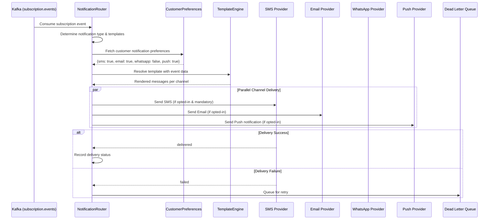

### Technical Sequence (Detailed)

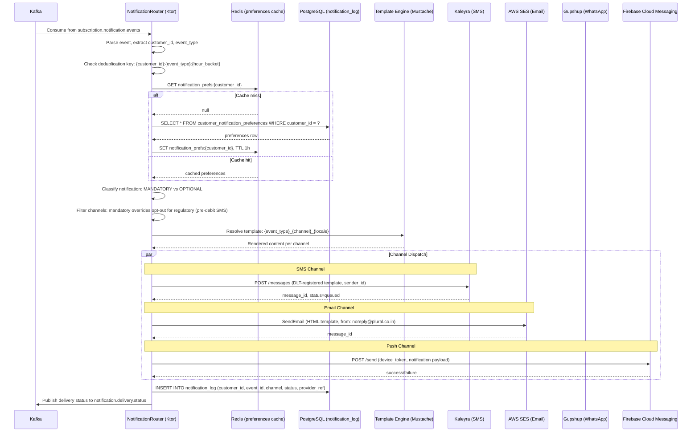

### Notification Channels

| Channel | Provider | Use Case | SLA | Regulatory |
|---------|----------|----------|-----|------------|
| **SMS** | Kaleyra / MSG91 | Payment reminders, OTP, pre-debit alerts, critical failures | < 10s delivery | DLT registered templates required (India) |
| **Email** | AWS SES / SendGrid | Invoices, receipts, detailed notifications, monthly statements | < 60s delivery | CAN-SPAM / GDPR compliant |
| **WhatsApp** | Gupshup | Rich media notifications, payment links, interactive buttons | < 15s delivery | WhatsApp Business API approved templates |
| **Push** | Firebase (Android) / APNs (iOS) | Mobile app users, real-time alerts | < 5s delivery | User must have app installed + permissions |

### Template Resolution Strategy

```
Template ID Format: {event_type}_{channel}_{locale}

Examples:
  subscription.invoice.paid_sms_en-IN
  subscription.invoice.paid_email_en-IN
  subscription.past_due_whatsapp_hi-IN
  mandate.created_sms_en-IN

Fallback chain:
  1. {event_type}_{channel}_{merchant_locale}
  2. {event_type}_{channel}_{customer_locale}
  3. {event_type}_{channel}_en-IN (default)
```

---

## Complete Event Catalog

### Subscription Events

| Event Type | Trigger | Key Payload Fields | Customer Notification |
|------------|---------|-------------------|----------------------|
| `subscription.created` | New subscription created | plan, customer, status, start_date | Welcome email |
| `subscription.activated` | Mandate confirmed or trial started | mandate_id, start_date, first_billing_date | Confirmation SMS + email |
| `subscription.trial_started` | Trial period begins | trial_end_date, plan_name | Trial welcome |
| `subscription.trial_ending` | 3 days before trial end | trial_end_date, next_charge_amount, next_charge_date | Upgrade reminder |
| `subscription.trial_ended` | Trial period expired | charged (bool), amount, converted_to_paid | Trial end notice |
| `subscription.paused` | Subscription paused (merchant/customer) | reason, paused_at, resume_at (nullable) | Pause confirmation |
| `subscription.resumed` | Subscription resumed | resumed_at, next_billing_date | Resume confirmation |
| `subscription.cancelled` | Subscription cancelled | reason, effective_date, cancelled_by | Cancellation confirmation |
| `subscription.cancellation_scheduled` | End-of-term cancel scheduled | cancel_at, remaining_days | Schedule confirmation |
| `subscription.past_due` | Payment failed, dunning started | amount_due, retry_date, dunning_level | Payment failure alert |
| `subscription.recovered` | Payment recovered during dunning | recovered_amount, payment_method, dunning_days | Recovery confirmation |
| `subscription.plan_changed` | Upgrade or downgrade | old_plan, new_plan, proration_amount, effective_date | Plan change confirmation |
| `subscription.renewed` | Successful renewal | cycle_number, amount, next_renewal_date | Renewal receipt |
| `subscription.expired` | Subscription reached end date | expired_at, total_cycles_completed | Expiry notice |

### Invoice Events

| Event Type | Trigger | Key Payload Fields | Customer Notification |
|------------|---------|-------------------|----------------------|
| `invoice.created` | Invoice generated for billing cycle | amount, line_items[], due_date, billing_period | — |
| `invoice.finalized` | Invoice locked, ready for collection | total, subtotal, tax, discount | Invoice email (PDF attached) |
| `invoice.paid` | Payment captured successfully | amount_paid, payment_method, transaction_id | Payment receipt |
| `invoice.payment_failed` | Payment attempt declined | decline_code, decline_reason, next_retry_at, attempt_number | Failure notification |
| `invoice.upcoming` | 7 days before next invoice | estimated_amount, estimated_date, line_items[] | Upcoming charge reminder |
| `invoice.voided` | Invoice cancelled/voided | reason, voided_by | — |
| `invoice.uncollectible` | All retry attempts exhausted | amount_due, total_attempts, last_decline_code | Final failure notice |
| `invoice.refunded` | Refund processed on paid invoice | refund_amount, refund_reason, original_amount | Refund confirmation |

### Mandate Events

| Event Type | Trigger | Key Payload Fields | Customer Notification |
|------------|---------|-------------------|----------------------|
| `mandate.created` | Mandate registration initiated | type (UPI/eNACH/eMandate), setup_url, max_amount | Setup instruction SMS |
| `mandate.activated` | Mandate successfully registered | umrn, max_amount, frequency, valid_until | Activation confirmation |
| `mandate.failed` | Registration failed/rejected | failure_reason, failure_code, can_retry | Failure notice + retry link |
| `mandate.revoked` | Mandate revoked by customer or system | revoked_by, reason, effective_date | Revocation confirmation |
| `mandate.expiring` | 30 days before mandate expiry | expires_at, renewal_url | Renewal reminder |
| `mandate.paused` | Mandate temporarily paused | paused_by, reason | Pause confirmation |
| `mandate.amount_updated` | Mandate amount limit changed | old_amount, new_amount, effective_date | Amount change notice |

### Payment Events

| Event Type | Trigger | Key Payload Fields | Customer Notification |
|------------|---------|-------------------|----------------------|
| `payment.created` | Payment attempt initiated | amount, currency, method, subscription_id, invoice_id | — |
| `payment.succeeded` | Payment captured successfully | transaction_id, amount, method, bank_ref | Success SMS |
| `payment.failed` | Payment declined | decline_code, decline_reason, retriable | Failure alert |
| `payment.refunded` | Refund processed | refund_amount, refund_id, reason | Refund confirmation |
| `payment.disputed` | Chargeback/dispute raised | dispute_id, amount, reason, evidence_due_date | — (merchant only) |

### Pre-Debit Events (RBI Compliance)

| Event Type | Trigger | Key Payload Fields | Customer Notification |
|------------|---------|-------------------|----------------------|
| `pre_debit.notification_sent` | 24h pre-debit notice dispatched | charge_amount, charge_date, opt_out_link, mandate_details | **Mandatory** SMS + Email |
| `pre_debit.opt_out_received` | Customer opted out of charge | opted_out_at, subscription_id, next_action | Opt-out confirmation |
| `pre_debit.opt_out_window_closed` | Opt-out window expired, charge will proceed | charge_date, amount | — |

---

## Flow 3: Webhook Retry & Dead Letter

### Retry Pipeline

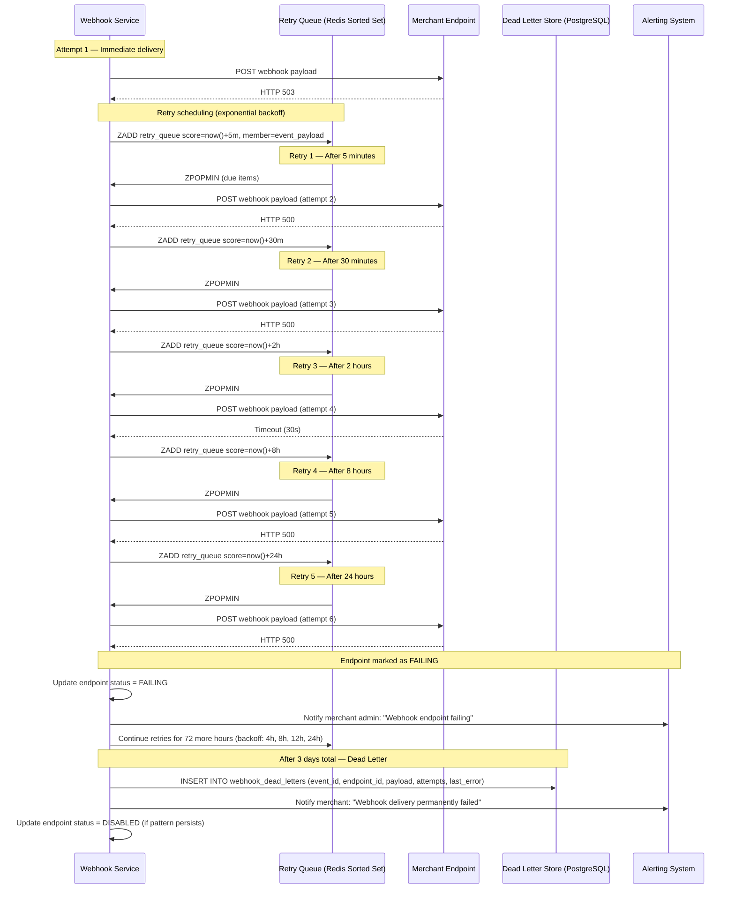

### Retry Schedule

| Attempt | Delay After Previous | Cumulative Time | Action on Failure |
|---------|---------------------|-----------------|-------------------|
| 1 | Immediate | 0s | Queue retry |
| 2 | 5 minutes | 5m | Queue retry |
| 3 | 30 minutes | 35m | Queue retry |
| 4 | 2 hours | 2h 35m | Queue retry |
| 5 | 8 hours | 10h 35m | Queue retry, mark endpoint FAILING |
| 6 | 24 hours | 34h 35m | Queue retry |
| 7 | 4 hours | 38h 35m | Queue retry |
| 8 | 8 hours | 46h 35m | Queue retry |
| 9 | 12 hours | 58h 35m | Queue retry |
| 10 | 24 hours | 82h 35m (~3.4 days) | Dead letter, disable endpoint |

### Endpoint Health Monitoring

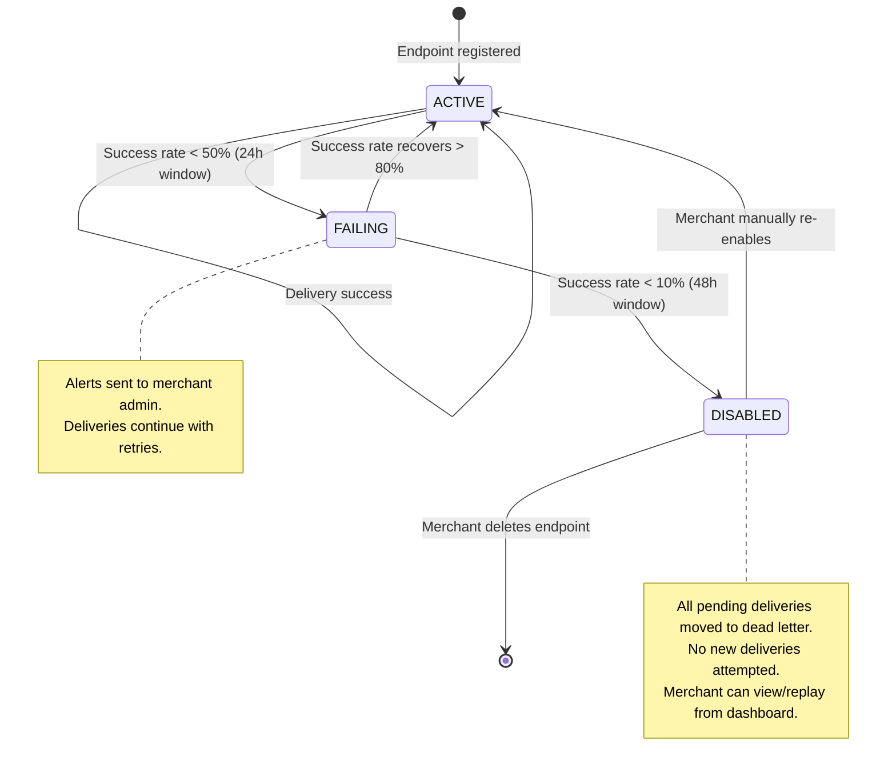

#### Health Metrics Tracked

| Metric | Window | Threshold | Action |
|--------|--------|-----------|--------|
| `delivery_success_rate` | Rolling 24h | < 50% | Alert merchant, mark FAILING |
| `delivery_success_rate` | Rolling 48h | < 10% | Disable endpoint |
| `avg_response_time_ms` | Rolling 1h | > 10,000ms | Alert merchant (slow endpoint) |
| `consecutive_failures` | Last N attempts | >= 5 | Mark FAILING |
| `total_dead_letters` | All time | > 100 | Alert Plural ops team |

#### Merchant Dashboard Capabilities

- View all webhook deliveries (success/failure) with payload and response
- Filter by event type, status, date range
- Manual retry of failed/dead-lettered events
- Re-enable disabled endpoints
- View endpoint health metrics and response time graphs
- Download failed payloads as JSON for debugging
- Test endpoint with sample payload

---

## Flow 4: Pre-Debit Notification (RBI Compliance)

### Regulatory Context

Per RBI circular on recurring e-mandates (RBI/2020-21/24), merchants must:
1. Send a pre-transaction notification **at least 24 hours** before the actual debit
2. Notification must include: amount, date, merchant name, opt-out mechanism
3. Customer must be able to opt out before the debit
4. For amounts > INR 15,000: explicit AFA (Additional Factor of Authentication) required per transaction

### Detailed Sequence

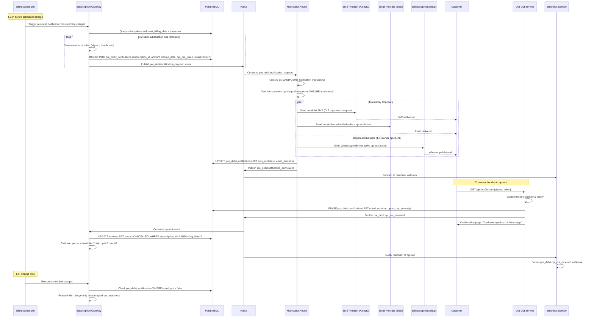

### Pre-Debit SMS Template (DLT Registered)

```
Template ID: 1107162XXXXXX
Sender: PLURAL

"Dear Customer, INR {#amount#} will be debited from your A/c ending {#account_last4#} on {#date#} for {#plan_name#} subscription via {#payment_method#}. To opt out: {#opt_out_url#}. Helpline: {#support_number#} -Plural"
```

**Example rendered:**
```
Dear Customer, INR 1,410.34 will be debited from your A/c ending 4523 on 15-Jan-2024 for Pro Monthly subscription via UPI Autopay. To opt out: https://pay.plural.co.in/optout/aBcDeFgH. Helpline: 1800-XXX-XXXX -Plural
```

### Pre-Debit Email Content

```
Subject: Upcoming charge of INR 1,410.34 on 15-Jan-2024

Body:
- Subscription: Pro Monthly Plan
- Merchant: {merchant_name}
- Amount: INR 1,410.34 (inclusive of GST)
- Charge Date: 15-Jan-2024
- Payment Method: UPI Autopay (UPI ID: user@oksbi)
- Mandate Reference: UMRN12345678

[Opt Out of This Charge] ← CTA button

Note: If you opt out, your subscription may be paused or cancelled 
depending on the merchant's policy.
```

### Opt-Out Token Structure

```kotlin
data class OptOutToken(
    val subscriptionId: String,
    val invoiceId: String,
    val chargeDate: LocalDate,
    val customerId: String,
    val expiresAt: Instant  // charge_date - 2 hours (cutoff)
)

// Signed with HMAC-SHA256 using system secret
// URL-safe Base64 encoded
// Example: /opt-out?token=eyJzdWIiOiJzdWJfMDFIUTN...signature
```

---

## Flow 5: Dunning Customer Notifications

### Progressive Urgency Sequence

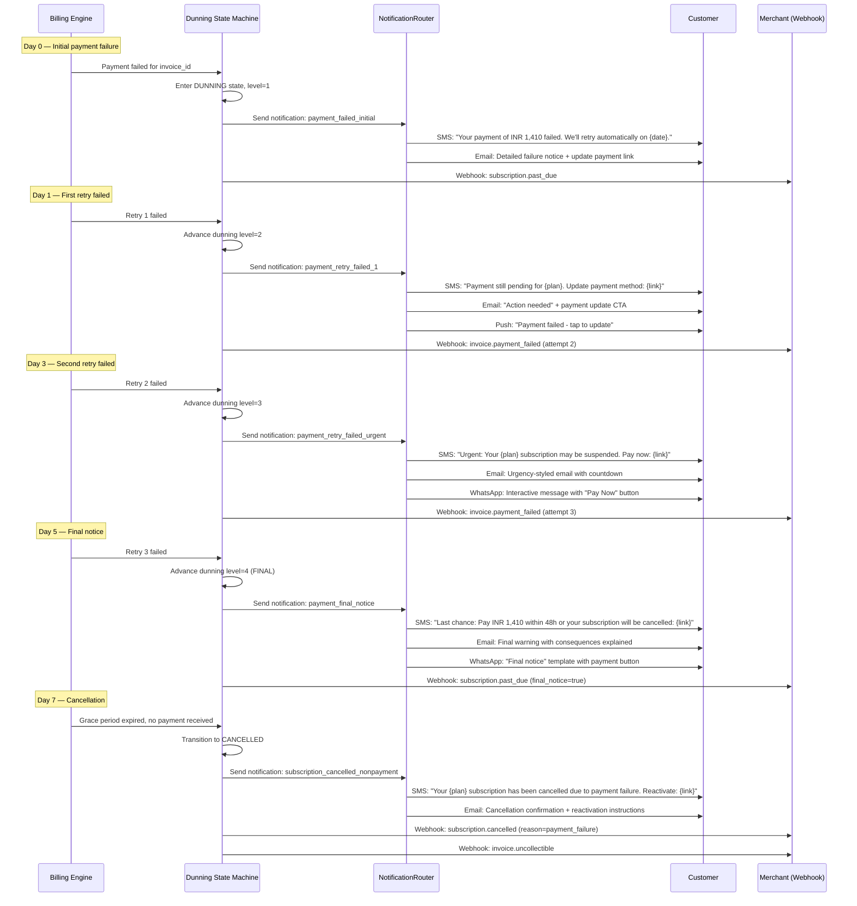

### Dunning Notification Schedule (Configurable per Merchant)

| Stage | Day | SMS | Email | WhatsApp | Push | Tone |
|-------|-----|-----|-------|----------|------|------|
| Initial failure | 0 | Informational | Detailed | — | Badge | Neutral |
| Retry 1 failed | 1 | Action needed | CTA button | — | Alert | Helpful |
| Retry 2 failed | 3 | Urgent | Countdown | Interactive | Urgent | Urgent |
| Final notice | 5 | Last chance | Warning | Pay Now button | Critical | Critical |
| Cancellation | 7 | Cancelled | Full details | — | — | Final |
| Win-back | 14 | Come back offer | Re-subscribe | — | — | Friendly |

---

## Webhook Security

### Security Layers

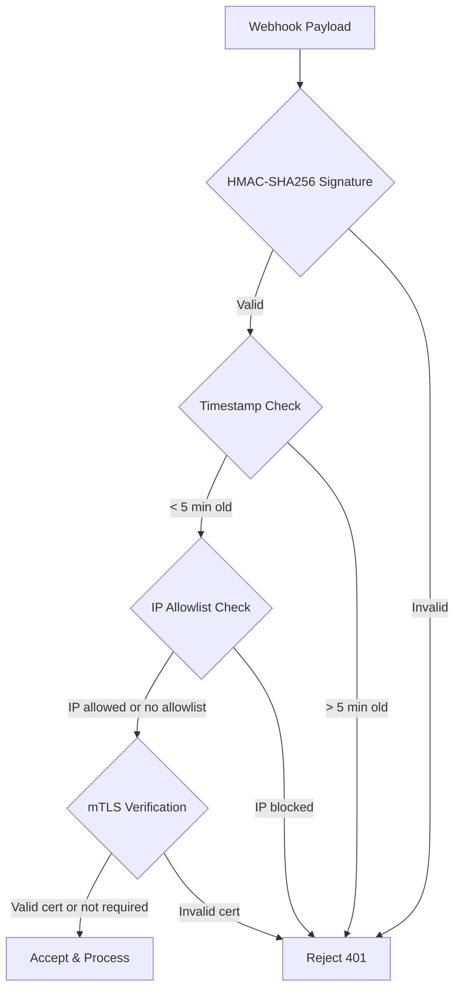

### Security Feature Matrix

| Feature | Default | Enterprise | Description |
|---------|---------|-----------|-------------|
| **HMAC-SHA256 Signatures** | Always | Always | Every payload signed with endpoint-specific secret |
| **Timestamp Validation** | 5 min tolerance | Configurable (1-10 min) | Prevents replay attacks |
| **IP Allowlisting** | Disabled | Available | Merchant configures accepted source IPs |
| **Mutual TLS (mTLS)** | Disabled | Available | Client certificate verification for webhook delivery |
| **Payload Encryption** | Disabled | Available | AES-256-GCM encryption of sensitive fields (PII) |
| **Secret Rotation** | Manual | Automatic (90 days) | Endpoint secrets can be rotated without downtime |

### Secret Rotation Without Downtime

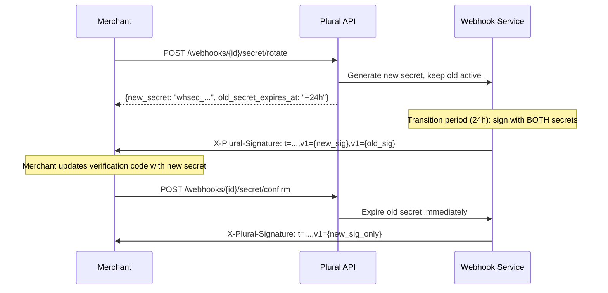

### IP Allowlist (Plural Egress IPs)

Merchants should allowlist the following Plural webhook source IPs:

```
# Production
52.66.XXX.XXX/32
13.235.XXX.XXX/32
3.7.XXX.XXX/32

# Sandbox
13.127.XXX.XXX/32
```

---

## Notification Preferences & Consent

### Data Model

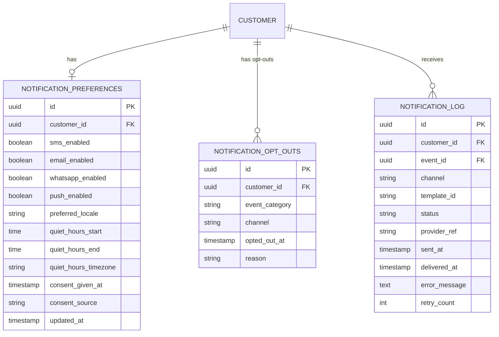

### Notification Classification

| Classification | Override Customer Opt-Out? | Examples |
|---------------|--------------------------|----------|
| **MANDATORY_REGULATORY** | Yes (cannot opt out) | Pre-debit notification (RBI), OTP |
| **MANDATORY_TRANSACTIONAL** | Yes (cannot opt out) | Payment confirmation, refund confirmation |
| **TRANSACTIONAL** | No (respects preference) | Invoice generated, plan change confirmation |
| **PROMOTIONAL** | No (explicit opt-in required) | Upgrade offers, win-back campaigns |

### Quiet Hours Handling

```kotlin
fun shouldDeliverNow(
    customer: NotificationPreferences,
    notification: Notification
): DeliveryDecision {
    // Mandatory notifications always deliver immediately
    if (notification.classification == MANDATORY_REGULATORY) {
        return DeliveryDecision.DELIVER_NOW
    }

    val customerLocalTime = Instant.now().atZone(customer.quietHoursTimezone)
    val isQuietHours = customerLocalTime.toLocalTime() in
        customer.quietHoursStart..customer.quietHoursEnd

    return if (isQuietHours) {
        // Queue for delivery at quiet hours end
        DeliveryDecision.QUEUE_UNTIL(customer.quietHoursEnd, customer.quietHoursTimezone)
    } else {
        DeliveryDecision.DELIVER_NOW
    }
}
```

### GDPR/DPA Compliance

- Consent tracked with source and timestamp
- Customers can withdraw consent via API or unsubscribe links
- Right to erasure: notification logs anonymized after 90 days
- Data portability: notification history exportable via API
- Processing basis: legitimate interest (transactional) or consent (promotional)

---

## Idempotency & Deduplication

### Webhook Idempotency

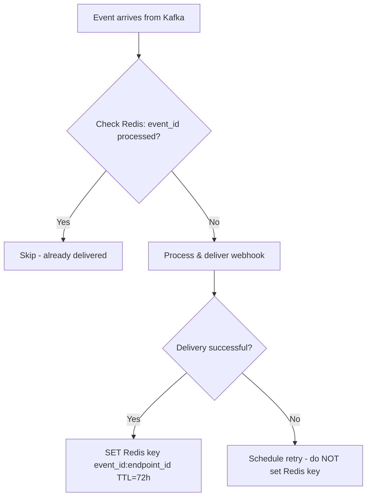

| Layer | Deduplication Key | TTL | Storage |
|-------|------------------|-----|---------|
| **Webhook Service** | `{event_id}:{endpoint_id}` | 72 hours | Redis |
| **Notification Router** | `{customer_id}:{event_type}:{hour_bucket}` | 2 hours | Redis |
| **Merchant (recommended)** | `event.id` field in payload | Permanent | Merchant DB |

### Merchant-Side Idempotency Guidance

Merchants should implement idempotent webhook handlers:

```kotlin
// Merchant's webhook handler (recommended pattern)
fun handleWebhook(payload: WebhookPayload): Response {
    // 1. Verify signature first
    if (!verifySignature(payload)) return Response(401)

    // 2. Check if already processed
    val existing = db.findByEventId(payload.id)
    if (existing != null) {
        return Response(200) // Already processed, return success
    }

    // 3. Process event
    processEvent(payload)

    // 4. Record as processed
    db.insertProcessedEvent(payload.id, Instant.now())

    return Response(200)
}
```

### Deduplication Edge Cases

| Scenario | Handling |
|----------|----------|
| Same event, multiple endpoints | Each endpoint is independent — delivered to all |
| Kafka consumer rebalance replay | Redis dedup key prevents re-delivery |
| Debezium restart replays | Outbox event_id is stable — deduped at webhook service |
| Clock skew between services | Use event_id (ULID) not timestamps for dedup |
| Customer receives duplicate SMS | Dedup by `{customer_id}:{event_type}:{hour_bucket}` in notification router |

---

## Observability & Monitoring

### Key Metrics

| Metric | Type | Alert Threshold |
|--------|------|----------------|
| `webhook.delivery.success_rate` | Gauge (per endpoint) | < 90% over 1h |
| `webhook.delivery.latency_p99` | Histogram | > 5s |
| `webhook.retry.queue_depth` | Gauge | > 10,000 |
| `webhook.dead_letter.count` | Counter (per merchant) | > 10 in 1h |
| `notification.delivery.success_rate` | Gauge (per channel) | < 95% |
| `notification.delivery.latency_p99` | Histogram (per channel) | SMS > 30s, Email > 120s |
| `pre_debit.notification.sent_rate` | Gauge | < 100% (must be 100%) |
| `pre_debit.opt_out.rate` | Gauge (per merchant) | > 20% (merchant alert) |

### Structured Log Events

```json
{
  "level": "INFO",
  "logger": "webhook-service",
  "message": "Webhook delivered",
  "event_id": "evt_01HQ3K7M8N2P4R6T8V0X",
  "merchant_id": "merch_01HQ3K7M8N2P4R6T8V0X",
  "endpoint_id": "ep_01HQ3K7M8N2P4R6T8V0X",
  "event_type": "subscription.renewed",
  "response_status": 200,
  "response_time_ms": 245,
  "attempt_number": 1,
  "trace_id": "abc123def456"
}
```

---

## Configuration

### Merchant Webhook Configuration (API)

```http
POST /v1/webhooks/endpoints
{
  "url": "https://merchant.example.com/webhooks/plural",
  "events": ["subscription.*", "invoice.paid", "mandate.activated"],
  "secret": null,  // auto-generated if null
  "metadata": {
    "environment": "production"
  },
  "rate_limit": 1000,  // max deliveries per minute
  "timeout_seconds": 30
}
```

### Subscription-Level Notification Override

```http
POST /v1/subscriptions/{id}/notification-preferences
{
  "pre_debit_channels": ["sms", "email", "whatsapp"],
  "pre_debit_hours_before": 48,  // override default 24h
  "dunning_enabled": true,
  "dunning_channels": ["sms", "email"],
  "renewal_reminder_enabled": true,
  "renewal_reminder_days_before": 7
}
```

---

## Database Tables (Webhook Service)

```sql
-- Webhook endpoints registered by merchants
CREATE TABLE webhook_endpoints (
    id UUID PRIMARY KEY DEFAULT gen_random_uuid(),
    merchant_id UUID NOT NULL REFERENCES merchants(id),
    url TEXT NOT NULL,
    secret TEXT NOT NULL,  -- encrypted at rest
    events TEXT[] NOT NULL DEFAULT '{}',  -- event type patterns
    status VARCHAR(20) NOT NULL DEFAULT 'ACTIVE',  -- ACTIVE, FAILING, DISABLED
    metadata JSONB DEFAULT '{}',
    rate_limit_per_minute INT DEFAULT 1000,
    timeout_seconds INT DEFAULT 30,
    created_at TIMESTAMPTZ NOT NULL DEFAULT now(),
    updated_at TIMESTAMPTZ NOT NULL DEFAULT now(),
    disabled_at TIMESTAMPTZ,
    CONSTRAINT valid_status CHECK (status IN ('ACTIVE', 'FAILING', 'DISABLED'))
);

-- Webhook delivery attempts
CREATE TABLE webhook_deliveries (
    id UUID PRIMARY KEY DEFAULT gen_random_uuid(),
    event_id VARCHAR(64) NOT NULL,
    endpoint_id UUID NOT NULL REFERENCES webhook_endpoints(id),
    status VARCHAR(20) NOT NULL,  -- PENDING, DELIVERED, FAILED, DEAD_LETTER
    request_payload JSONB NOT NULL,
    response_status INT,
    response_body TEXT,
    response_time_ms INT,
    attempt_number INT NOT NULL DEFAULT 1,
    next_retry_at TIMESTAMPTZ,
    error_message TEXT,
    created_at TIMESTAMPTZ NOT NULL DEFAULT now(),
    delivered_at TIMESTAMPTZ,
    CONSTRAINT unique_delivery UNIQUE (event_id, endpoint_id, attempt_number)
);

CREATE INDEX idx_deliveries_endpoint_status ON webhook_deliveries(endpoint_id, status);
CREATE INDEX idx_deliveries_retry ON webhook_deliveries(next_retry_at) WHERE status = 'FAILED';

-- Dead letter store
CREATE TABLE webhook_dead_letters (
    id UUID PRIMARY KEY DEFAULT gen_random_uuid(),
    event_id VARCHAR(64) NOT NULL,
    endpoint_id UUID NOT NULL REFERENCES webhook_endpoints(id),
    merchant_id UUID NOT NULL,
    event_type VARCHAR(100) NOT NULL,
    payload JSONB NOT NULL,
    total_attempts INT NOT NULL,
    first_attempted_at TIMESTAMPTZ NOT NULL,
    last_attempted_at TIMESTAMPTZ NOT NULL,
    last_error TEXT,
    replayed BOOLEAN DEFAULT FALSE,
    replayed_at TIMESTAMPTZ,
    created_at TIMESTAMPTZ NOT NULL DEFAULT now()
);

CREATE INDEX idx_dead_letters_merchant ON webhook_dead_letters(merchant_id, created_at DESC);
```

---

## Related Documents

- [02 — State Machines](./02-state-machines.md) — Subscription states that trigger webhook events
- [05 — Billing & Invoice Workflow](./05-billing-and-invoice-workflow.md) — Invoice events that trigger notifications
- [06 — Payment Execution Workflow](./06-payment-execution-workflow.md) — Payment events and pre-debit flow
- Existing `webhook-service` (Svix-based) — [nxt-webhook-service](../nxt-webhook-service/)
