# 10 — Proration & Metering Workflow

> Usage-based billing, mid-cycle plan changes, credits, and metered pricing

---

## Functional Overview

This document covers two related systems:

1. **Proration** — Calculating fair charges when subscriptions change mid-cycle
2. **Metering** — Tracking and billing usage-based consumption

Both systems integrate with the billing engine (doc 05) and payment execution (doc 06) to produce accurate invoices regardless of when plan changes occur or how much usage is consumed.

---

## Part A: Proration Engine

### Proration Triggers

| Trigger | Direction | Default Behavior |
|---------|-----------|-----------------|
| Plan upgrade (immediate) | Charge difference | Generate prorated invoice |
| Plan downgrade (immediate) | Credit difference | Apply credit to next invoice |
| Quantity change (add seats) | Charge for new seats | Generate mini-invoice |
| Quantity change (remove seats) | Credit for removed seats | Apply credit to next invoice |
| Mid-cycle cancellation | Refund unused | Credit note or refund |
| Subscription pause | Credit unused | Credit note |
| Addon addition mid-cycle | Charge remaining days | Generate prorated invoice |
| Addon removal mid-cycle | Credit remaining days | Apply credit to next invoice |

### Proration Calculation Methods

```kotlin
enum class ProrationMethod {
    DAY_BASED,      // Credit/charge per calendar day
    SECOND_BASED,   // Precise to-the-second proration
    HALF_PERIOD,    // Charge half if <50% used, full if >50%
    FULL_PERIOD,    // Always charge full period (no proration)
    NONE            // No proration (credit to next cycle)
}

data class ProrationConfig(
    val method: ProrationMethod = ProrationMethod.DAY_BASED,
    val roundingMode: RoundingMode = RoundingMode.HALF_UP,
    val roundingScale: Int = 2,
    val creditExpiryMonths: Int = 12,
    val allowNegativeInvoice: Boolean = false,
    val minimumChargeAmount: Long = 100, // INR 1.00 in paise
    val applyCreditsAutomatically: Boolean = true
)
```

---

### Flow 1: Upgrade Proration (Immediate)

#### Functional Sequence

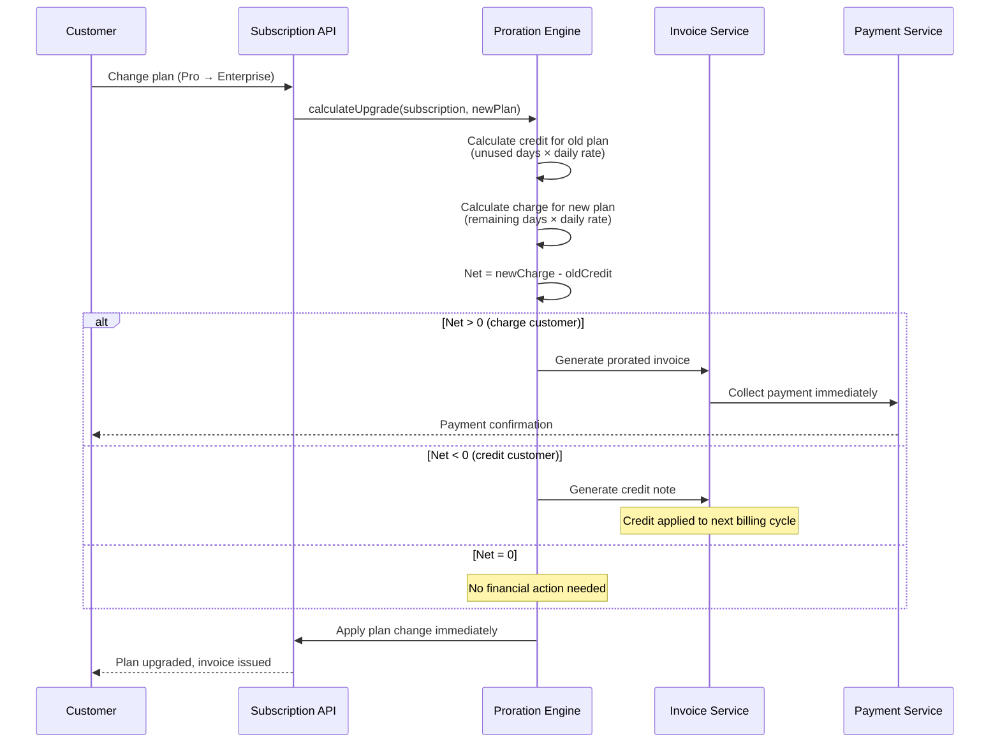

#### Technical Sequence

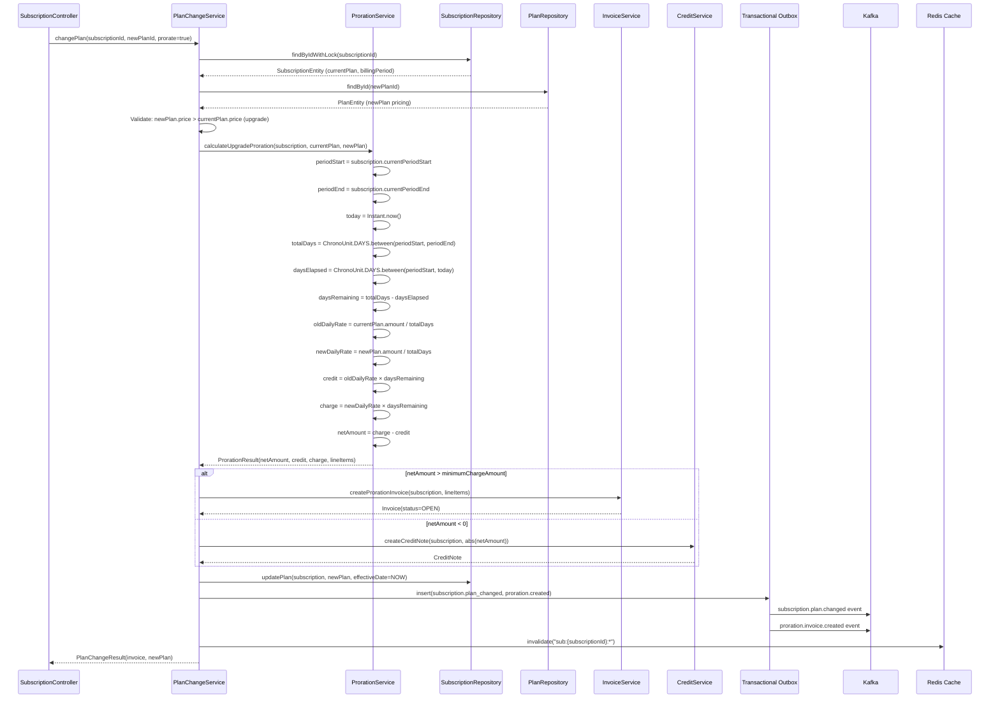

#### Core Proration Calculation Logic

```kotlin
data class ProrationResult(
    val netAmount: Long,           // in smallest currency unit (paise)
    val creditAmount: Long,        // credit for old plan unused
    val chargeAmount: Long,        // charge for new plan remaining
    val lineItems: List<ProrationLineItem>,
    val method: ProrationMethod,
    val periodStart: LocalDate,
    val periodEnd: LocalDate,
    val effectiveDate: LocalDate,
    val daysRemaining: Int,
    val totalDaysInPeriod: Int
)

data class ProrationLineItem(
    val description: String,
    val amount: Long,
    val type: LineItemType,        // CREDIT or DEBIT
    val planId: UUID,
    val planName: String,
    val dailyRate: Long,
    val days: Int
)

class ProrationService(
    private val config: ProrationConfig
) {
    fun calculateUpgradeProration(
        subscription: SubscriptionEntity,
        currentPlan: PlanEntity,
        newPlan: PlanEntity,
        effectiveDate: Instant = Instant.now()
    ): ProrationResult {
        val periodStart = subscription.currentPeriodStart
        val periodEnd = subscription.currentPeriodEnd
        val today = effectiveDate.atZone(ZoneId.of("Asia/Kolkata")).toLocalDate()

        val totalDays = ChronoUnit.DAYS.between(periodStart, periodEnd).toInt()
        val daysElapsed = ChronoUnit.DAYS.between(periodStart, today).toInt()
        val daysRemaining = totalDays - daysElapsed

        require(daysRemaining > 0) { "Cannot prorate on last day of period" }
        require(totalDays > 0) { "Invalid billing period" }

        val oldDailyRate = calculateDailyRate(currentPlan.amount, totalDays)
        val newDailyRate = calculateDailyRate(newPlan.amount, totalDays)

        val creditAmount = oldDailyRate * daysRemaining
        val chargeAmount = newDailyRate * daysRemaining
        val netAmount = chargeAmount - creditAmount

        val lineItems = listOf(
            ProrationLineItem(
                description = "Unused time on ${currentPlan.name} " +
                    "(${today} to ${periodEnd})",
                amount = -creditAmount,
                type = LineItemType.CREDIT,
                planId = currentPlan.id,
                planName = currentPlan.name,
                dailyRate = oldDailyRate,
                days = daysRemaining
            ),
            ProrationLineItem(
                description = "Remaining time on ${newPlan.name} " +
                    "(${today} to ${periodEnd})",
                amount = chargeAmount,
                type = LineItemType.DEBIT,
                planId = newPlan.id,
                planName = newPlan.name,
                dailyRate = newDailyRate,
                days = daysRemaining
            )
        )

        return ProrationResult(
            netAmount = netAmount,
            creditAmount = creditAmount,
            chargeAmount = chargeAmount,
            lineItems = lineItems,
            method = config.method,
            periodStart = periodStart,
            periodEnd = periodEnd,
            effectiveDate = today,
            daysRemaining = daysRemaining,
            totalDaysInPeriod = totalDays
        )
    }

    private fun calculateDailyRate(amount: Long, totalDays: Int): Long {
        return when (config.method) {
            ProrationMethod.DAY_BASED -> {
                BigDecimal(amount)
                    .divide(BigDecimal(totalDays), 10, config.roundingMode)
                    .setScale(0, config.roundingMode)
                    .toLong()
            }
            ProrationMethod.SECOND_BASED -> {
                // For second-based, caller provides seconds remaining
                amount / totalDays // simplified; actual uses seconds
            }
            else -> amount / totalDays
        }
    }
}
```

#### Detailed Example (DAY_BASED)

```
Subscription: Pro Plan (INR 999/month)
Billing period: Jan 1 - Jan 31 (31 days)
Upgrade to Enterprise (INR 2,499/month) on Jan 11

Days elapsed on old plan: 10
Days remaining: 21

Old plan daily rate: 99900 paise / 31 = 3,223 paise/day (INR 32.23)
New plan daily rate: 249900 paise / 31 = 8,061 paise/day (INR 80.61)

Credit for old plan (unused): 3,223 × 21 = 67,683 paise (INR 676.83)
Charge for new plan (remaining): 8,061 × 21 = 169,281 paise (INR 1,692.81)
Net proration charge: 169,281 - 67,683 = 101,598 paise (INR 1,015.98)

Prorated invoice generated: INR 1,015.98 + GST
Next cycle (Feb 1): Full Enterprise price INR 2,499.00
```

---

### Flow 2: Downgrade Proration

#### Functional Sequence

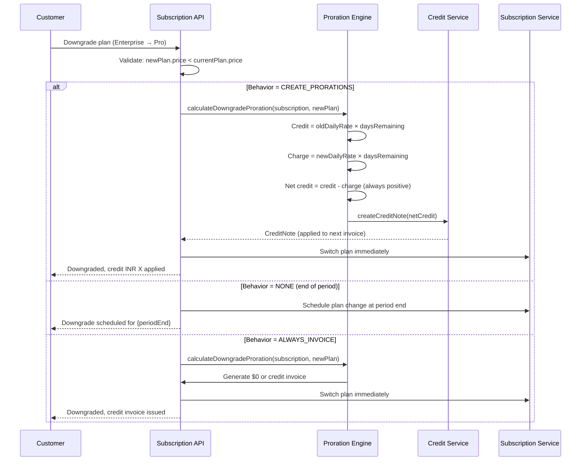

#### Technical Sequence

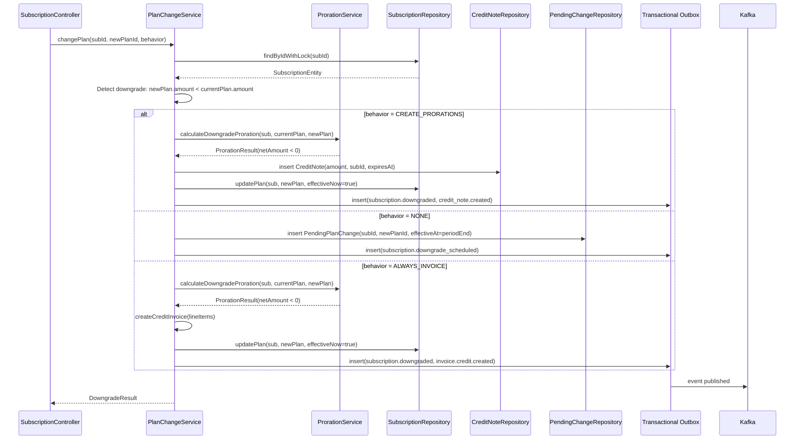

#### Downgrade Behavior Options

| Setting | Behavior | Use Case |
|---------|----------|----------|
| `CREATE_PRORATIONS` | Generate credit note, apply to next invoice | Default — fair to customer |
| `NONE` | No credit, switch at end of period | Simple billing, no mid-cycle changes |
| `ALWAYS_INVOICE` | Generate $0 or credit invoice immediately | Full audit trail required |

---

### Flow 3: Quantity Change Proration

#### Functional Sequence — Adding Seats

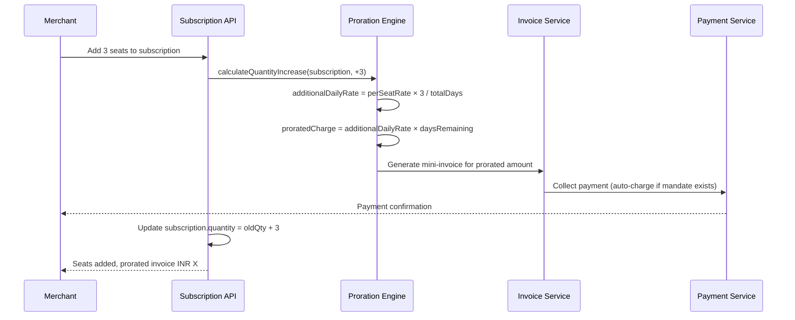

#### Functional Sequence — Removing Seats

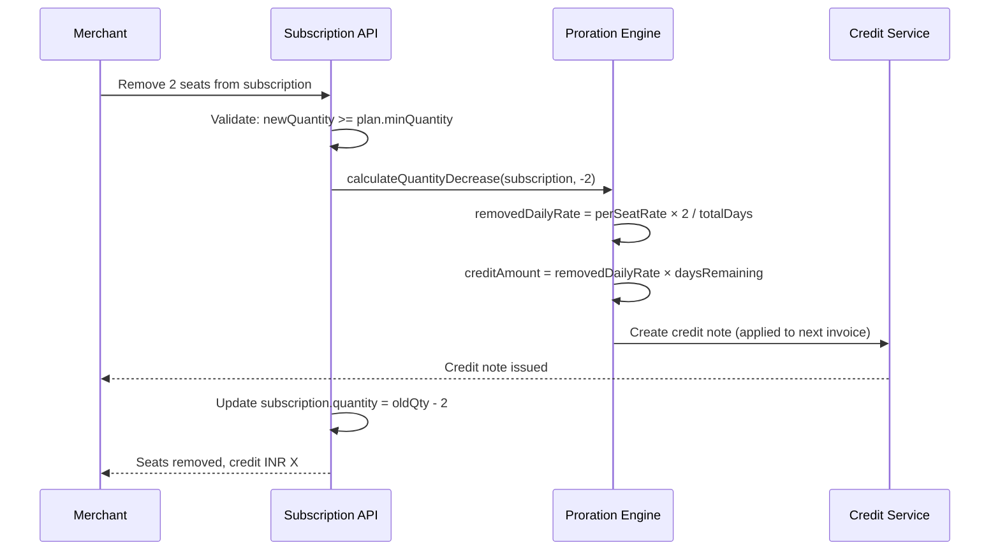

#### Technical Sequence — Quantity Change

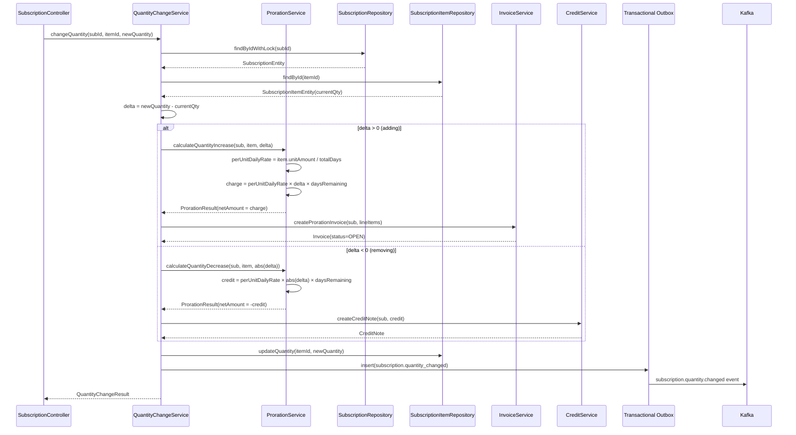

#### Example: Seat Addition

```
Plan: Per-Seat INR 200/seat/month (30-day billing period)
Current: 10 seats, Period: Jan 1 - Jan 30
Day 15: Add 3 seats (15 days remaining)

Per-seat daily rate: 20000 paise / 30 = 667 paise/day
Added seats charge: 667 × 3 × 15 = 30,015 paise (INR 300.15)

Prorated invoice: INR 300.15 + GST
Next full cycle: 13 seats × INR 200 = INR 2,600.00
```

#### Example: Seat Removal

```
Plan: Per-Seat INR 200/seat/month (30-day billing period)
Current: 10 seats, Period: Jan 1 - Jan 30
Day 20: Remove 2 seats (10 days remaining)

Per-seat daily rate: 20000 paise / 30 = 667 paise/day
Credit for removed seats: 667 × 2 × 10 = 13,340 paise (INR 133.40)

Credit note: INR 133.40 (applied to next invoice)
Next full cycle: 8 seats × INR 200 = INR 1,600.00
Applied credit: INR 1,600.00 - INR 133.40 = INR 1,466.60 charged
```

---

### Flow 4: Mid-Cycle Cancellation Proration

#### Functional Sequence

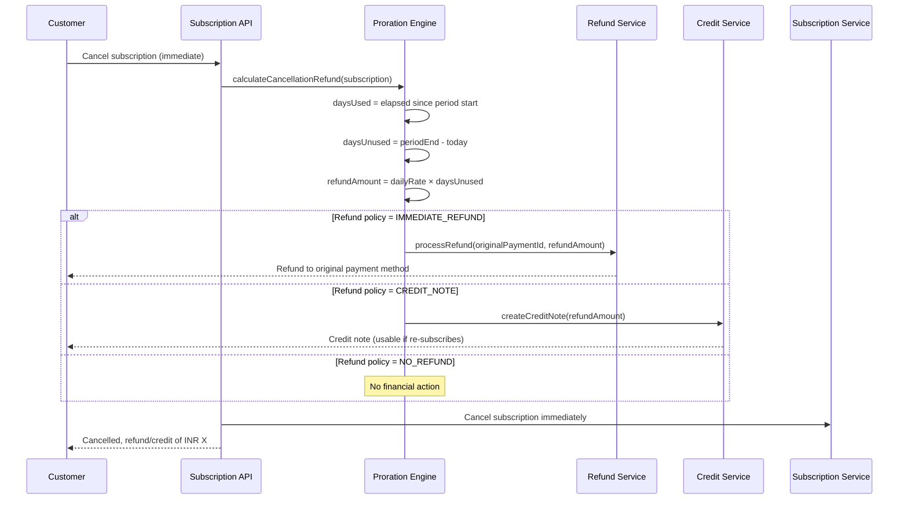

#### Technical Sequence

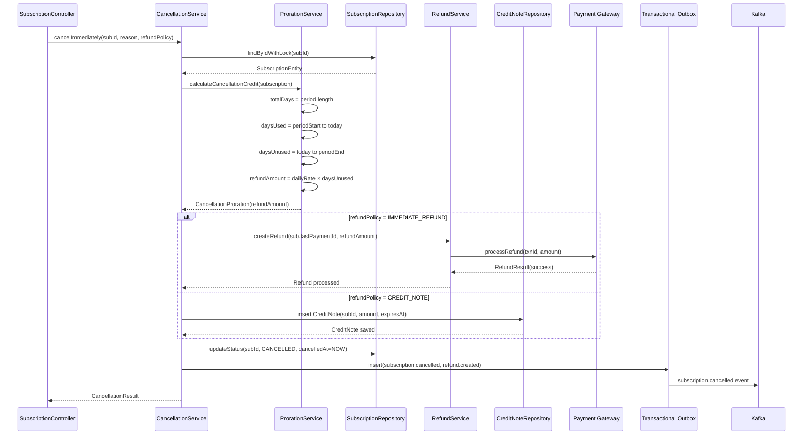

#### Cancellation Example

```
Plan: INR 999/month, billing period: Jan 1 - Jan 31 (31 days)
Cancel on: Jan 20

Days used: 20
Days unused: 11
Daily rate: 99900 / 31 = 3,223 paise/day

Refund amount: 3,223 × 11 = 35,453 paise (INR 354.53)

Result: Refund of INR 354.53 to original payment method
```

---

## Part B: Usage Metering Engine

### Architecture Overview

```
┌─────────────────────────────────────────────────────────────────────┐
│                        Metering Pipeline                             │
├─────────────────────────────────────────────────────────────────────┤
│                                                                     │
│  Merchant API ──→ Ingestion API ──→ Kafka ──→ Usage Processor       │
│       │                                            │                │
│       │                                            ▼                │
│       │                                     PostgreSQL              │
│       │                                    (usage_records)          │
│       │                                            │                │
│       │                                            ▼                │
│       │                                     Daily Rollup            │
│       │                                    (pg_cron midnight)       │
│       │                                            │                │
│       │                                            ▼                │
│       │                                     Billing Engine          │
│       │                                    (invoice generation)     │
│       │                                            │                │
│       ▼                                            ▼                │
│  Real-time Usage Query ◄─── Redis (running totals) ──→ Alerts      │
│                                                                     │
└─────────────────────────────────────────────────────────────────────┘
```

---

### Flow 5: Usage Record Ingestion

#### Functional Sequence

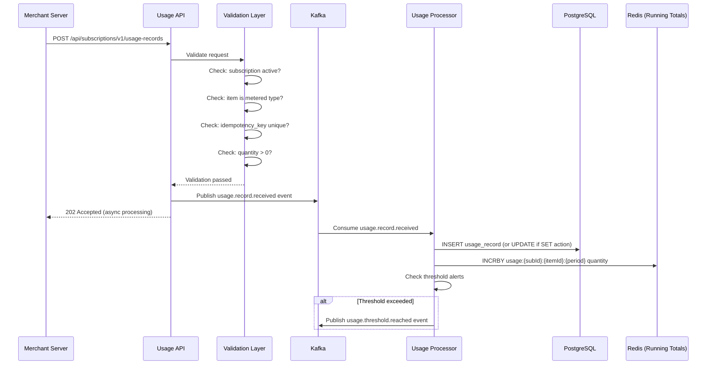

#### Technical Sequence

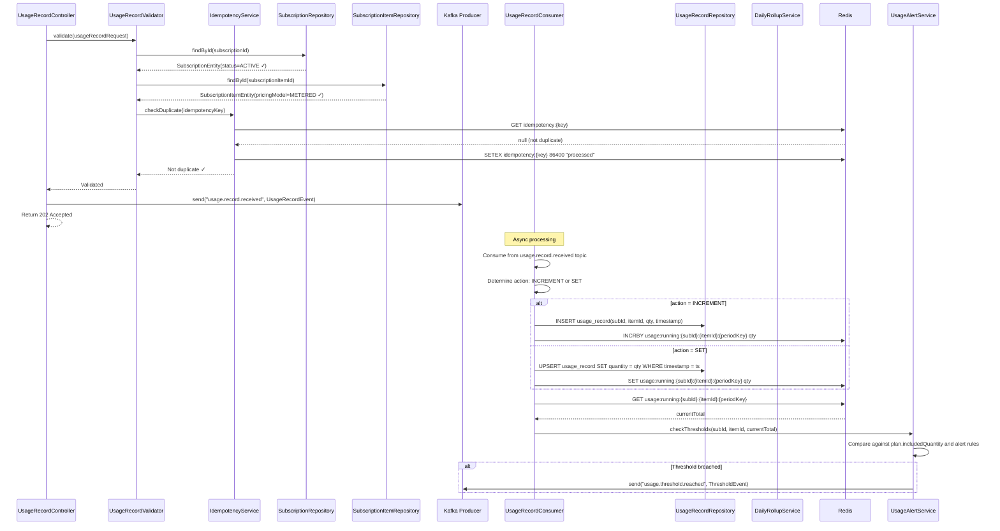

#### Usage Record API

```
POST /api/subscriptions/v1/usage-records
```

**Request:**
```json
{
  "subscription_id": "sub_01HQ3KXYZ789ABC",
  "subscription_item_id": "si_01HQ3KXYZ789DEF",
  "quantity": 150,
  "action": "INCREMENT",
  "timestamp": "2024-01-15T14:30:00Z",
  "idempotency_key": "usage_2024-01-15_batch_42",
  "metadata": {
    "batch_id": "42",
    "source": "api-gateway",
    "region": "ap-south-1"
  }
}
```

**Response (202 Accepted):**
```json
{
  "id": "ur_01HQ3MXYZ789GHI",
  "subscription_id": "sub_01HQ3KXYZ789ABC",
  "subscription_item_id": "si_01HQ3KXYZ789DEF",
  "quantity": 150,
  "action": "INCREMENT",
  "running_total": 4,350,
  "billing_period": {
    "start": "2024-01-01T00:00:00Z",
    "end": "2024-01-31T23:59:59Z"
  },
  "created_at": "2024-01-15T14:30:01Z"
}
```

**Batch Ingestion:**
```
POST /api/subscriptions/v1/usage-records/batch
```

```json
{
  "records": [
    {
      "subscription_item_id": "si_01HQ3KXYZ789DEF",
      "quantity": 50,
      "action": "INCREMENT",
      "timestamp": "2024-01-15T14:00:00Z",
      "idempotency_key": "usage_2024-01-15_14h"
    },
    {
      "subscription_item_id": "si_01HQ3KXYZ789DEF",
      "quantity": 100,
      "action": "INCREMENT",
      "timestamp": "2024-01-15T15:00:00Z",
      "idempotency_key": "usage_2024-01-15_15h"
    }
  ],
  "subscription_id": "sub_01HQ3KXYZ789ABC"
}
```

**Response:**
```json
{
  "accepted": 2,
  "rejected": 0,
  "results": [
    {"idempotency_key": "usage_2024-01-15_14h", "status": "ACCEPTED", "running_total": 4200},
    {"idempotency_key": "usage_2024-01-15_15h", "status": "ACCEPTED", "running_total": 4300}
  ]
}
```

#### Usage Record Data Model

```kotlin
data class UsageRecordEntity(
    val id: UUID,
    val subscriptionId: UUID,
    val subscriptionItemId: UUID,
    val quantity: Long,
    val action: UsageAction,           // INCREMENT, SET
    val usageDate: LocalDate,
    val usageTimestamp: Instant,
    val idempotencyKey: String,
    val metadata: JsonNode?,
    val billingPeriodStart: LocalDate,
    val billingPeriodEnd: LocalDate,
    val createdAt: Instant
)

enum class UsageAction {
    INCREMENT,  // Add to running total
    SET         // Override running total (absolute reporting)
}
```

---

### Flow 6: Usage Aggregation at Billing Time

#### Functional Sequence

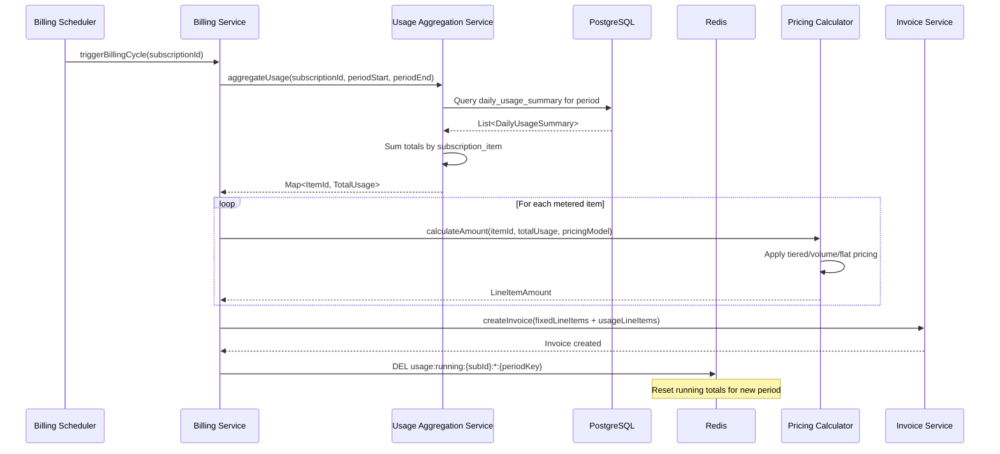

#### Technical Sequence

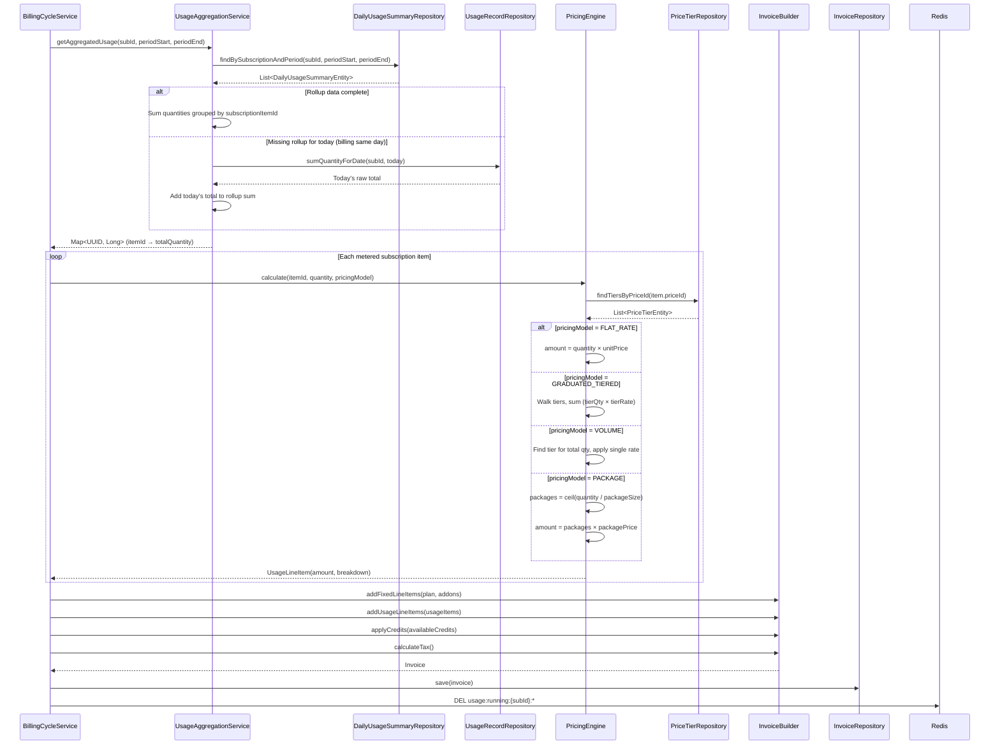

#### Aggregation SQL Query

```sql
-- Primary aggregation query (uses daily rollups for performance)
SELECT 
    subscription_item_id,
    SUM(total_quantity) AS total_usage,
    SUM(record_count) AS total_records,
    MIN(usage_date) AS first_usage_date,
    MAX(usage_date) AS last_usage_date
FROM daily_usage_summary
WHERE subscription_id = :subId
    AND usage_date >= :periodStart
    AND usage_date <= :periodEnd
GROUP BY subscription_item_id;

-- Fallback: raw query if rollups incomplete
SELECT 
    subscription_item_id,
    SUM(quantity) AS total_usage,
    COUNT(*) AS total_records
FROM usage_records
WHERE subscription_id = :subId
    AND usage_date >= :periodStart
    AND usage_date <= :periodEnd
    AND action = 'INCREMENT'
GROUP BY subscription_item_id;

-- For SET-action items (last value wins per day)
SELECT DISTINCT ON (subscription_item_id, usage_date)
    subscription_item_id,
    usage_date,
    quantity
FROM usage_records
WHERE subscription_id = :subId
    AND usage_date >= :periodStart
    AND usage_date <= :periodEnd
    AND action = 'SET'
ORDER BY subscription_item_id, usage_date, usage_timestamp DESC;
```

---

### Flow 7: Tiered Usage Pricing

#### Graduated Tiered Pricing

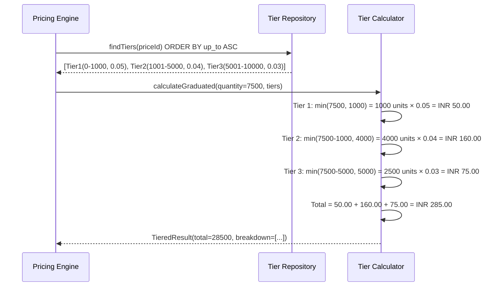

#### Graduated Tiered Calculation

```
Usage: 7,500 API calls

Tier 1:  0 - 1,000       @ INR 0.05/call  →  1,000 × 0.05  = INR  50.00
Tier 2:  1,001 - 5,000   @ INR 0.04/call  →  4,000 × 0.04  = INR 160.00
Tier 3:  5,001 - 10,000  @ INR 0.03/call  →  2,500 × 0.03  = INR  75.00
─────────────────────────────────────────────────────────────────────────
Total:                                                          INR 285.00
```

#### Volume Pricing (distinct from graduated tiered)

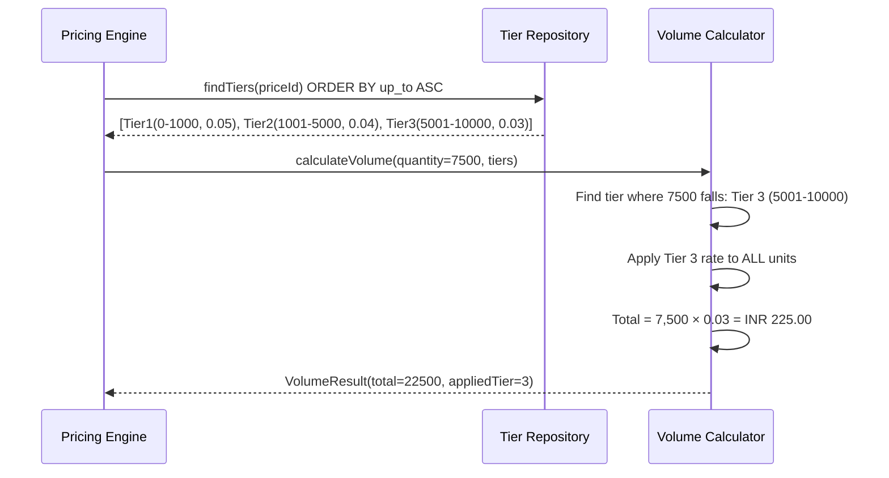

#### Volume Pricing Calculation

```
Usage: 7,500 API calls

Tier lookup: 7,500 falls in bracket 5,001 - 10,000 → rate = INR 0.03/call
Apply rate to ALL calls: 7,500 × 0.03 = INR 225.00

Total: INR 225.00
```

#### Pricing Engine Implementation

```kotlin
enum class PricingModel {
    FLAT_RATE,          // Single unit price for all usage
    GRADUATED_TIERED,   // Different rates per tier bracket
    VOLUME,             // Single rate based on total volume bracket
    PACKAGE,            // Charge per package of N units
    STAIRCASE           // Flat fee per tier reached
}

data class PriceTier(
    val id: UUID,
    val priceId: UUID,
    val upTo: Long?,            // null = infinity (last tier)
    val unitAmount: Long,       // per-unit rate in paise
    val flatAmount: Long?,      // optional flat fee for this tier
    val sortOrder: Int
)

class PricingEngine {

    fun calculateUsageAmount(
        quantity: Long,
        pricingModel: PricingModel,
        tiers: List<PriceTier>
    ): UsagePricingResult {
        return when (pricingModel) {
            PricingModel.FLAT_RATE -> calculateFlat(quantity, tiers.first())
            PricingModel.GRADUATED_TIERED -> calculateGraduated(quantity, tiers)
            PricingModel.VOLUME -> calculateVolume(quantity, tiers)
            PricingModel.PACKAGE -> calculatePackage(quantity, tiers.first())
            PricingModel.STAIRCASE -> calculateStaircase(quantity, tiers)
        }
    }

    private fun calculateGraduated(quantity: Long, tiers: List<PriceTier>): UsagePricingResult {
        var remaining = quantity
        var total = 0L
        val breakdown = mutableListOf<TierBreakdown>()
        var previousUpTo = 0L

        for (tier in tiers.sortedBy { it.sortOrder }) {
            if (remaining <= 0) break

            val tierCapacity = (tier.upTo ?: Long.MAX_VALUE) - previousUpTo
            val unitsInTier = minOf(remaining, tierCapacity)
            val tierAmount = unitsInTier * tier.unitAmount + (tier.flatAmount ?: 0)

            breakdown.add(TierBreakdown(
                tierFrom = previousUpTo + 1,
                tierTo = previousUpTo + unitsInTier,
                units = unitsInTier,
                unitRate = tier.unitAmount,
                amount = tierAmount
            ))

            total += tierAmount
            remaining -= unitsInTier
            previousUpTo = tier.upTo ?: Long.MAX_VALUE
        }

        return UsagePricingResult(
            totalAmount = total,
            quantity = quantity,
            model = PricingModel.GRADUATED_TIERED,
            breakdown = breakdown
        )
    }

    private fun calculateVolume(quantity: Long, tiers: List<PriceTier>): UsagePricingResult {
        val applicableTier = tiers
            .sortedBy { it.sortOrder }
            .first { tier -> tier.upTo == null || quantity <= tier.upTo }

        val total = quantity * applicableTier.unitAmount + (applicableTier.flatAmount ?: 0)

        return UsagePricingResult(
            totalAmount = total,
            quantity = quantity,
            model = PricingModel.VOLUME,
            breakdown = listOf(TierBreakdown(
                tierFrom = 1,
                tierTo = quantity,
                units = quantity,
                unitRate = applicableTier.unitAmount,
                amount = total
            ))
        )
    }

    private fun calculatePackage(quantity: Long, tier: PriceTier): UsagePricingResult {
        val packageSize = tier.upTo ?: 1
        val packages = ceil(quantity.toDouble() / packageSize).toLong()
        val total = packages * tier.unitAmount

        return UsagePricingResult(
            totalAmount = total,
            quantity = quantity,
            model = PricingModel.PACKAGE,
            breakdown = listOf(TierBreakdown(
                tierFrom = 1, tierTo = quantity,
                units = packages, unitRate = tier.unitAmount,
                amount = total
            ))
        )
    }
}
```

---

### Flow 8: Real-Time Usage Alerts

#### Functional Sequence

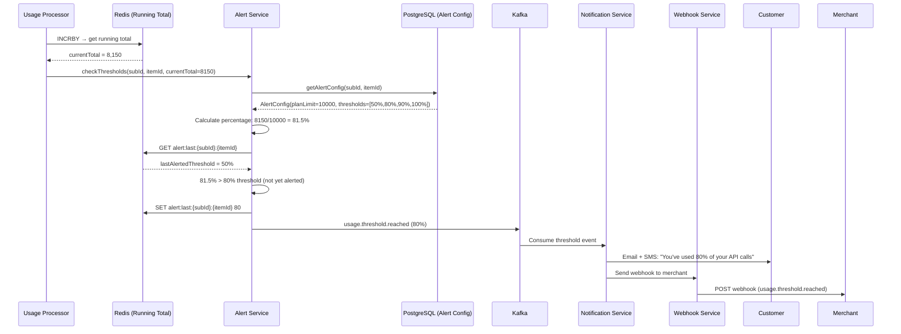

#### Technical Sequence

```mermaid
sequenceDiagram
    participant AlertSvc as UsageAlertService
    participant Redis as Redis
    participant AlertConfigRepo as AlertConfigRepository
    participant SubItemRepo as SubscriptionItemRepository
    participant KafkaProducer as Kafka Producer
    participant AlertLogRepo as AlertLogRepository

    AlertSvc->>SubItemRepo: findById(itemId)
    SubItemRepo-->>AlertSvc: SubscriptionItemEntity(includedQuantity=10000)

    AlertSvc->>AlertConfigRepo: findBySubscriptionAndItem(subId, itemId)
    AlertConfigRepo-->>AlertSvc: UsageAlertConfig(thresholds=[50,80,90,100])

    AlertSvc->>AlertSvc: percentage = (currentTotal / includedQuantity) × 100

    AlertSvc->>Redis: GET alert:last_threshold:{subId}:{itemId}:{periodKey}
    Redis-->>AlertSvc: lastAlerted = 50

    AlertSvc->>AlertSvc: Find next threshold to fire: 80 (since 81.5% > 80%)

    alt New threshold crossed
        AlertSvc->>Redis: SET alert:last_threshold:{subId}:{itemId}:{periodKey} 80
        AlertSvc->>AlertLogRepo: insert AlertLog(subId, itemId, threshold=80, total=8150)

        AlertSvc->>KafkaProducer: send("usage.alert.triggered", UsageAlertEvent{
            subscriptionId, itemId, threshold=80,
            currentUsage=8150, limit=10000,
            channels=[EMAIL, SMS, WEBHOOK]
        })
    else No new threshold
        Note over AlertSvc: No action needed
    end
```

#### Threshold Configuration

```json
{
  "subscription_item_id": "si_01HQ3KXYZ789DEF",
  "plan_included_quantity": 10000,
  "hard_limit": null,
  "overage_allowed": true,
  "usage_alerts": [
    {
      "threshold_percentage": 50,
      "channels": ["EMAIL"],
      "message_template": "usage_50_percent"
    },
    {
      "threshold_percentage": 80,
      "channels": ["EMAIL", "SMS"],
      "message_template": "usage_80_percent"
    },
    {
      "threshold_percentage": 90,
      "channels": ["EMAIL", "SMS", "WEBHOOK"],
      "message_template": "usage_90_percent"
    },
    {
      "threshold_percentage": 100,
      "channels": ["EMAIL", "SMS", "WEBHOOK"],
      "action": "ALERT_ONLY",
      "message_template": "usage_100_percent"
    },
    {
      "threshold_percentage": 120,
      "channels": ["EMAIL", "SMS", "WEBHOOK"],
      "action": "BLOCK_USAGE",
      "message_template": "usage_hard_limit"
    }
  ]
}
```

#### Hard Limit Enforcement

```kotlin
class UsageLimitEnforcer(
    private val redis: RedisCommands,
    private val alertConfigRepo: AlertConfigRepository
) {
    suspend fun canRecordUsage(
        subscriptionId: UUID,
        itemId: UUID,
        quantity: Long
    ): UsageLimitResult {
        val config = alertConfigRepo.findBySubscriptionAndItem(subscriptionId, itemId)
            ?: return UsageLimitResult.ALLOWED // No config = no limits

        if (!config.hardLimit) return UsageLimitResult.ALLOWED

        val periodKey = getCurrentPeriodKey(subscriptionId)
        val currentTotal = redis.get("usage:running:$subscriptionId:$itemId:$periodKey")?.toLong() ?: 0
        val projectedTotal = currentTotal + quantity

        val limit = config.planIncludedQuantity * (config.hardLimitPercentage / 100.0)

        return if (projectedTotal > limit) {
            UsageLimitResult.BLOCKED(
                currentUsage = currentTotal,
                limit = limit.toLong(),
                overage = projectedTotal - limit.toLong()
            )
        } else {
            UsageLimitResult.ALLOWED
        }
    }
}
```

---

### Flow 9: Hybrid Billing (Fixed + Usage)

#### Functional Sequence

```mermaid
sequenceDiagram
    participant Scheduler as Billing Scheduler
    participant BillingSvc as Billing Service
    participant PlanSvc as Plan Service
    participant UsageSvc as Usage Service
    participant PricingEngine as Pricing Engine
    participant InvoiceSvc as Invoice Service
    participant Customer as Customer

    Scheduler->>BillingSvc: triggerBilling(subscriptionId)
    BillingSvc->>PlanSvc: getPlanDetails(planId)
    PlanSvc-->>BillingSvc: Plan(basePrice=499, includedCalls=1000)

    BillingSvc->>UsageSvc: getUsage(subId, period)
    UsageSvc-->>BillingSvc: totalUsage = 3,500 calls

    BillingSvc->>BillingSvc: overageUsage = max(0, 3500 - 1000) = 2,500

    alt overageUsage > 0
        BillingSvc->>PricingEngine: calculateOverage(2500, overageRate=0.05)
        PricingEngine-->>BillingSvc: overageAmount = INR 125.00
    end

    BillingSvc->>InvoiceSvc: createInvoice(
        fixedCharge = INR 499.00,
        usageCharge = INR 125.00,
        total = INR 624.00
    )
    InvoiceSvc-->>Customer: Invoice for INR 624.00
```

#### Technical Sequence

```mermaid
sequenceDiagram
    participant BillingSvc as BillingCycleService
    participant SubRepo as SubscriptionRepository
    participant ItemRepo as SubscriptionItemRepository
    participant UsageAggSvc as UsageAggregationService
    participant PricingEngine as PricingEngine
    participant InvoiceBuilder as InvoiceBuilder
    participant CreditSvc as CreditService
    participant TaxSvc as TaxService
    participant InvoiceRepo as InvoiceRepository

    BillingSvc->>SubRepo: findById(subId)
    SubRepo-->>BillingSvc: Subscription with items

    BillingSvc->>ItemRepo: findBySubscriptionId(subId)
    ItemRepo-->>BillingSvc: List<SubscriptionItem>

    BillingSvc->>InvoiceBuilder: create()

    loop Each subscription item
        alt item.type = FIXED
            BillingSvc->>InvoiceBuilder: addLineItem(item.name, item.amount, item.quantity)
        else item.type = METERED
            BillingSvc->>UsageAggSvc: getUsage(subId, item.id, period)
            UsageAggSvc-->>BillingSvc: totalUsage

            BillingSvc->>BillingSvc: overageQty = max(0, totalUsage - item.includedQuantity)

            alt overageQty > 0
                BillingSvc->>PricingEngine: calculate(overageQty, item.overagePricingModel, tiers)
                PricingEngine-->>BillingSvc: UsagePricingResult

                BillingSvc->>InvoiceBuilder: addUsageLineItem(
                    description = "${item.name}: ${totalUsage} used (${item.includedQuantity} included, ${overageQty} overage)",
                    amount = result.totalAmount,
                    breakdown = result.breakdown
                )
            else
                BillingSvc->>InvoiceBuilder: addUsageLineItem(
                    description = "${item.name}: ${totalUsage} used (within ${item.includedQuantity} included)",
                    amount = 0
                )
            end
        end
    end

    BillingSvc->>CreditSvc: getAvailableCredits(subId)
    CreditSvc-->>BillingSvc: List<CreditNote>(total=INR 133.40)
    BillingSvc->>InvoiceBuilder: applyCredits(credits)

    BillingSvc->>TaxSvc: calculateTax(lineItems, merchantAddress)
    TaxSvc-->>BillingSvc: TaxResult(gst=18%)
    BillingSvc->>InvoiceBuilder: addTax(taxResult)

    BillingSvc->>InvoiceBuilder: build()
    InvoiceBuilder-->>BillingSvc: Invoice

    BillingSvc->>InvoiceRepo: save(invoice)
```

#### Hybrid Billing Examples

**Within Included Usage:**
```
Plan: Starter (INR 499/month, includes 1,000 API calls)
Overage rate: INR 0.05/call

Actual usage: 800 calls (within included)

Invoice:
  Base plan charge:          INR 499.00
  Usage (800/1000 included): INR   0.00
  ─────────────────────────────────────
  Subtotal:                  INR 499.00
  GST (18%):                 INR  89.82
  ─────────────────────────────────────
  Total:                     INR 588.82
```

**Exceeding Included Usage:**
```
Plan: Starter (INR 499/month, includes 1,000 API calls)
Overage rate: INR 0.05/call

Actual usage: 3,500 calls (2,500 overage)

Invoice:
  Base plan charge:                    INR 499.00
  API calls: 3,500 used
    Included: 1,000                    INR   0.00
    Overage: 2,500 × INR 0.05         INR 125.00
  ─────────────────────────────────────────────────
  Subtotal:                            INR 624.00
  GST (18%):                           INR 112.32
  ─────────────────────────────────────────────────
  Total:                               INR 736.32
```

**Multi-Meter Hybrid:**
```
Plan: Business (INR 1,999/month)
  Includes: 10,000 API calls + 50GB storage + 1,000 emails
  Overage rates: API = INR 0.03/call, Storage = INR 5/GB, Email = INR 0.10/email

Actual usage: 12,500 API calls, 45GB storage, 1,800 emails

Invoice:
  Base plan charge:                           INR 1,999.00
  API calls: 12,500 (10,000 incl, 2,500 overage × 0.03)   INR    75.00
  Storage: 45GB (within 50GB included)                      INR     0.00
  Emails: 1,800 (1,000 incl, 800 overage × 0.10)           INR    80.00
  ───────────────────────────────────────────────────────────────────────
  Subtotal:                                                 INR 2,154.00
  GST (18%):                                                INR   387.72
  ───────────────────────────────────────────────────────────────────────
  Total:                                                    INR 2,541.72
```

---

## Daily Usage Rollup (Performance Optimization)

### Rollup Job

```kotlin
/**
 * pg_cron job runs at 00:05 UTC daily.
 * Aggregates raw usage_records into daily_usage_summary for billing performance.
 * Billing queries use rollups instead of scanning millions of raw records.
 */
data class DailyUsageSummary(
    val id: UUID,
    val subscriptionId: UUID,
    val subscriptionItemId: UUID,
    val usageDate: LocalDate,
    val totalQuantity: Long,
    val recordCount: Int,
    val minTimestamp: Instant,
    val maxTimestamp: Instant,
    val lastUpdated: Instant
)

class DailyRollupJob(
    private val rollupRepo: DailyUsageSummaryRepository,
    private val usageRepo: UsageRecordRepository,
    private val redis: RedisCommands
) {
    /**
     * Runs daily via pg_cron: SELECT cron.schedule('usage_rollup', '5 0 * * *', $$...)
     */
    suspend fun execute(targetDate: LocalDate = LocalDate.now().minusDays(1)) {
        logger.info { "Starting daily usage rollup for $targetDate" }

        val aggregates = usageRepo.aggregateByDate(targetDate)

        for (agg in aggregates) {
            rollupRepo.upsert(
                DailyUsageSummary(
                    id = UUID.randomUUID(),
                    subscriptionId = agg.subscriptionId,
                    subscriptionItemId = agg.subscriptionItemId,
                    usageDate = targetDate,
                    totalQuantity = agg.totalQuantity,
                    recordCount = agg.recordCount,
                    minTimestamp = agg.minTimestamp,
                    maxTimestamp = agg.maxTimestamp,
                    lastUpdated = Instant.now()
                )
            )
        }

        logger.info { "Rollup complete: ${aggregates.size} summaries written for $targetDate" }
    }
}
```

### Rollup SQL

```sql
-- pg_cron scheduled job
SELECT cron.schedule(
    'daily_usage_rollup',
    '5 0 * * *',  -- 00:05 UTC daily
    $$
    INSERT INTO daily_usage_summary 
        (id, subscription_id, subscription_item_id, usage_date, total_quantity, record_count, min_timestamp, max_timestamp, last_updated)
    SELECT 
        gen_random_uuid(),
        subscription_id,
        subscription_item_id,
        usage_date,
        SUM(quantity),
        COUNT(*),
        MIN(usage_timestamp),
        MAX(usage_timestamp),
        NOW()
    FROM usage_records
    WHERE usage_date = CURRENT_DATE - INTERVAL '1 day'
    GROUP BY subscription_id, subscription_item_id, usage_date
    ON CONFLICT (subscription_id, subscription_item_id, usage_date)
    DO UPDATE SET
        total_quantity = EXCLUDED.total_quantity,
        record_count = EXCLUDED.record_count,
        min_timestamp = EXCLUDED.min_timestamp,
        max_timestamp = EXCLUDED.max_timestamp,
        last_updated = NOW();
    $$
);
```

---

## Proration Credit Application

### Credit Lifecycle

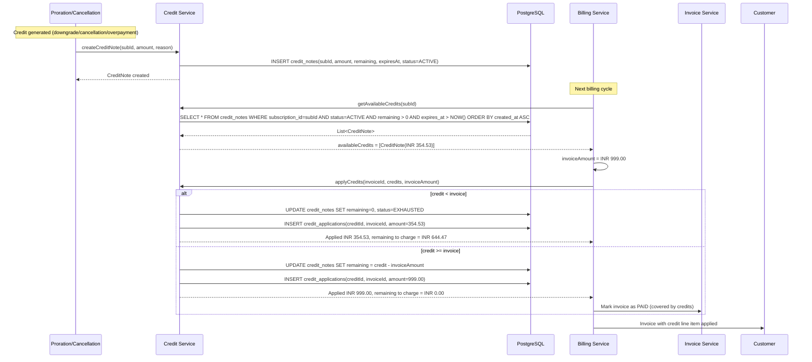

### Credit Data Model

```kotlin
data class CreditNoteEntity(
    val id: UUID,
    val subscriptionId: UUID,
    val merchantId: UUID,
    val originalAmount: Long,       // Total credit in paise
    val remainingAmount: Long,      // Unused balance
    val currency: String,           // INR
    val reason: CreditReason,
    val status: CreditStatus,       // ACTIVE, EXHAUSTED, EXPIRED, VOIDED
    val expiresAt: Instant,         // Default: 12 months from creation
    val metadata: JsonNode?,
    val createdAt: Instant,
    val updatedAt: Instant
)

enum class CreditReason {
    PRORATION_DOWNGRADE,
    PRORATION_CANCELLATION,
    PRORATION_SEAT_REMOVAL,
    OVERPAYMENT,
    GOODWILL,
    SERVICE_DISRUPTION
}

data class CreditApplicationEntity(
    val id: UUID,
    val creditNoteId: UUID,
    val invoiceId: UUID,
    val amount: Long,
    val appliedAt: Instant
)
```

---

## Edge Cases

### Leap Year Handling

```kotlin
fun calculateDailyRate(monthlyAmount: Long, periodStart: LocalDate, periodEnd: LocalDate): Long {
    val totalDays = ChronoUnit.DAYS.between(periodStart, periodEnd).toInt()
    // Feb in leap year: 29 days → lower daily rate
    // Feb in normal year: 28 days → higher daily rate
    return BigDecimal(monthlyAmount)
        .divide(BigDecimal(totalDays), 10, RoundingMode.HALF_UP)
        .setScale(0, RoundingMode.HALF_UP)
        .toLong()
}
```

### Month-End Anchoring

```kotlin
/**
 * Jan 31 subscription: next billing date = Feb 28 (or 29 in leap year)
 * Uses billing anchor day with fallback to month end.
 */
fun nextBillingDate(currentPeriodEnd: LocalDate, anchorDay: Int): LocalDate {
    val nextMonth = currentPeriodEnd.plusMonths(1)
    val maxDay = nextMonth.lengthOfMonth()
    val billingDay = minOf(anchorDay, maxDay)
    return nextMonth.withDayOfMonth(billingDay)
}

// Examples:
// Anchor day 31: Jan 31 → Feb 28 → Mar 31 → Apr 30
// Anchor day 29: Jan 29 → Feb 28 → Mar 29 → Apr 29
// Anchor day 15: Jan 15 → Feb 15 → Mar 15 → Apr 15
```

### Zero-Usage Periods

```kotlin
enum class ZeroUsageBehavior {
    GENERATE_ZERO_INVOICE,   // Create invoice with $0 usage line
    SKIP_USAGE_LINE,         // Omit usage line entirely (only fixed charges)
    SKIP_INVOICE_IF_ZERO     // Don't generate invoice if total = $0 (pure metered plans)
}
```

### Negative Proration (Credit > Charge)

```kotlin
fun handleNegativeProration(result: ProrationResult, config: ProrationConfig): ProrationAction {
    return when {
        result.netAmount >= 0 -> ProrationAction.ChargeCustomer(result.netAmount)
        !config.allowNegativeInvoice -> ProrationAction.CreateCreditNote(abs(result.netAmount))
        else -> ProrationAction.CreateCreditInvoice(result.netAmount) // negative invoice
    }
}
```

### Multiple Plan Changes in Same Period

```kotlin
/**
 * Customer upgrades twice in same period:
 * Day 1: Plan A (INR 499)
 * Day 10: Upgrade to Plan B (INR 999) → proration invoice 1
 * Day 20: Upgrade to Plan C (INR 1,999) → proration invoice 2
 *
 * Second proration is based on Plan B (current), not Plan A (original).
 * The subscription always tracks the CURRENT plan for proration baseline.
 */
fun calculateChainedProration(
    subscription: SubscriptionEntity, // reflects current plan (B)
    newPlan: PlanEntity               // target plan (C)
): ProrationResult {
    // Use subscription.currentPlan (B) as baseline, not original plan (A)
    return calculateUpgradeProration(subscription, subscription.currentPlan, newPlan)
}
```

### Late Usage Reporting

```kotlin
/**
 * Usage reported after billing cycle closed.
 * Options:
 * 1. REJECT: Return 422 (usage_date outside active period)
 * 2. NEXT_INVOICE: Add to next billing period
 * 3. ADJUSTMENT_INVOICE: Generate separate catch-up invoice
 */
enum class LateUsagePolicy {
    REJECT,
    ADD_TO_NEXT_INVOICE,
    GENERATE_ADJUSTMENT_INVOICE
}

fun handleLateUsage(
    record: UsageRecordRequest,
    subscription: SubscriptionEntity,
    policy: LateUsagePolicy
): LateUsageResult {
    val isPastPeriod = record.timestamp.isBefore(subscription.currentPeriodStart)
    if (!isPastPeriod) return LateUsageResult.Normal // not late

    return when (policy) {
        LateUsagePolicy.REJECT -> LateUsageResult.Rejected("Usage date is in a closed billing period")
        LateUsagePolicy.ADD_TO_NEXT_INVOICE -> {
            // Store with current period dates instead
            LateUsageResult.AcceptedForNextPeriod(record.copy(
                billingPeriodStart = subscription.currentPeriodStart,
                billingPeriodEnd = subscription.currentPeriodEnd
            ))
        }
        LateUsagePolicy.GENERATE_ADJUSTMENT_INVOICE -> {
            LateUsageResult.AdjustmentRequired(record)
        }
    }
}
```

---

## Database Schema (Key Tables)

```sql
-- Proration credits
CREATE TABLE credit_notes (
    id UUID PRIMARY KEY DEFAULT gen_random_uuid(),
    subscription_id UUID NOT NULL REFERENCES subscriptions(id),
    merchant_id UUID NOT NULL,
    original_amount BIGINT NOT NULL,
    remaining_amount BIGINT NOT NULL,
    currency VARCHAR(3) NOT NULL DEFAULT 'INR',
    reason VARCHAR(50) NOT NULL,
    status VARCHAR(20) NOT NULL DEFAULT 'ACTIVE',
    expires_at TIMESTAMPTZ NOT NULL,
    metadata JSONB,
    created_at TIMESTAMPTZ NOT NULL DEFAULT NOW(),
    updated_at TIMESTAMPTZ NOT NULL DEFAULT NOW()
);

CREATE INDEX idx_credit_notes_sub_active 
    ON credit_notes(subscription_id, status) WHERE status = 'ACTIVE';

-- Credit applications (which invoices used which credits)
CREATE TABLE credit_applications (
    id UUID PRIMARY KEY DEFAULT gen_random_uuid(),
    credit_note_id UUID NOT NULL REFERENCES credit_notes(id),
    invoice_id UUID NOT NULL REFERENCES invoices(id),
    amount BIGINT NOT NULL,
    applied_at TIMESTAMPTZ NOT NULL DEFAULT NOW()
);

-- Usage records (partitioned by month)
CREATE TABLE usage_records (
    id UUID NOT NULL DEFAULT gen_random_uuid(),
    subscription_id UUID NOT NULL,
    subscription_item_id UUID NOT NULL,
    quantity BIGINT NOT NULL,
    action VARCHAR(10) NOT NULL DEFAULT 'INCREMENT',
    usage_date DATE NOT NULL,
    usage_timestamp TIMESTAMPTZ NOT NULL,
    idempotency_key VARCHAR(255) NOT NULL,
    billing_period_start DATE NOT NULL,
    billing_period_end DATE NOT NULL,
    metadata JSONB,
    created_at TIMESTAMPTZ NOT NULL DEFAULT NOW()
) PARTITION BY RANGE (usage_date);

-- Monthly partitions
CREATE TABLE usage_records_2024_01 PARTITION OF usage_records
    FOR VALUES FROM ('2024-01-01') TO ('2024-02-01');
CREATE TABLE usage_records_2024_02 PARTITION OF usage_records
    FOR VALUES FROM ('2024-02-01') TO ('2024-03-01');
-- ... auto-created by partition management job

CREATE UNIQUE INDEX idx_usage_records_idempotency 
    ON usage_records(idempotency_key, subscription_id);
CREATE INDEX idx_usage_records_billing 
    ON usage_records(subscription_id, subscription_item_id, usage_date);

-- Daily usage rollup (for billing performance)
CREATE TABLE daily_usage_summary (
    id UUID PRIMARY KEY DEFAULT gen_random_uuid(),
    subscription_id UUID NOT NULL,
    subscription_item_id UUID NOT NULL,
    usage_date DATE NOT NULL,
    total_quantity BIGINT NOT NULL,
    record_count INT NOT NULL,
    min_timestamp TIMESTAMPTZ,
    max_timestamp TIMESTAMPTZ,
    last_updated TIMESTAMPTZ NOT NULL DEFAULT NOW(),
    UNIQUE (subscription_id, subscription_item_id, usage_date)
);

CREATE INDEX idx_daily_usage_billing 
    ON daily_usage_summary(subscription_id, usage_date);

-- Price tiers (for tiered/volume pricing)
CREATE TABLE price_tiers (
    id UUID PRIMARY KEY DEFAULT gen_random_uuid(),
    price_id UUID NOT NULL REFERENCES prices(id),
    up_to BIGINT,           -- NULL = infinity (last tier)
    unit_amount BIGINT NOT NULL,
    flat_amount BIGINT,
    sort_order INT NOT NULL,
    created_at TIMESTAMPTZ NOT NULL DEFAULT NOW()
);

CREATE INDEX idx_price_tiers_price ON price_tiers(price_id, sort_order);

-- Usage alert configuration
CREATE TABLE usage_alert_configs (
    id UUID PRIMARY KEY DEFAULT gen_random_uuid(),
    subscription_id UUID NOT NULL,
    subscription_item_id UUID NOT NULL,
    threshold_percentage INT NOT NULL,
    channels JSONB NOT NULL DEFAULT '["EMAIL"]',
    action VARCHAR(30) NOT NULL DEFAULT 'ALERT_ONLY',
    message_template VARCHAR(100),
    enabled BOOLEAN NOT NULL DEFAULT true,
    created_at TIMESTAMPTZ NOT NULL DEFAULT NOW()
);

-- Usage alert log (audit trail)
CREATE TABLE usage_alert_log (
    id UUID PRIMARY KEY DEFAULT gen_random_uuid(),
    subscription_id UUID NOT NULL,
    subscription_item_id UUID NOT NULL,
    threshold_percentage INT NOT NULL,
    current_usage BIGINT NOT NULL,
    plan_limit BIGINT NOT NULL,
    channels_notified JSONB NOT NULL,
    triggered_at TIMESTAMPTZ NOT NULL DEFAULT NOW()
);
```

---

## Kafka Topics

| Topic | Producer | Consumer | Purpose |
|-------|----------|----------|---------|
| `usage.record.received` | Usage API | Usage Processor | Async usage ingestion |
| `usage.threshold.reached` | Usage Processor | Notification Service | Usage alerts |
| `usage.alert.triggered` | Alert Service | Notification + Webhook | Multi-channel alerting |
| `proration.invoice.created` | Plan Change Service | Payment Service | Collect prorated charge |
| `subscription.plan.changed` | Plan Change Service | Analytics, Webhook | Plan change event |
| `subscription.quantity.changed` | Quantity Service | Analytics, Webhook | Seat change event |
| `credit.note.created` | Credit Service | Accounting Service | Credit tracking |
| `credit.note.applied` | Billing Service | Accounting Service | Credit usage tracking |

---

## Redis Key Patterns

| Key Pattern | TTL | Purpose |
|-------------|-----|---------|
| `usage:running:{subId}:{itemId}:{periodKey}` | Period duration + 7d | Running usage total |
| `idempotency:usage:{key}` | 24h | Dedup usage records |
| `alert:last_threshold:{subId}:{itemId}:{periodKey}` | Period duration + 1d | Last alerted threshold |
| `lock:proration:{subId}` | 60s | Prevent concurrent plan changes |
| `sub:{subId}:plan` | 5m | Cached subscription plan info |

---

## Performance & Scale

| Metric | Target | Design |
|--------|--------|--------|
| Usage ingestion throughput | 10,000 records/sec per merchant | Async via Kafka, batch API |
| Batch ingestion limit | 1,000 records per request | Validated and published as batch |
| Billing-time aggregation | < 100ms per subscription | Daily rollups reduce scan to ~30 rows |
| Proration calculation | < 50ms | In-memory arithmetic, no I/O |
| Usage query (running total) | < 5ms | Redis running totals |
| Partition scan (raw records) | Eliminated for billing | Monthly partitions + daily rollup |

### Partitioning Strategy

```sql
-- usage_records partitioned by usage_date (monthly)
-- Partition management job creates partitions 3 months ahead
-- Old partitions (> 13 months) detached and archived to S3

-- Index strategy:
-- 1. (subscription_id, subscription_item_id, usage_date) — billing aggregation
-- 2. (idempotency_key, subscription_id) — deduplication
-- 3. (usage_date) — partition pruning (implicit)
```

### Scaling Considerations

- **Kafka partitioning**: Usage records keyed by `subscription_id` for ordering guarantees
- **Consumer group scaling**: 12 partitions per topic → up to 12 parallel consumers
- **Redis cluster**: Usage running totals sharded by subscription_id hash slot
- **PostgreSQL**: Read replicas for usage queries; primary for writes
- **Batch coalescing**: Multiple rapid usage reports coalesced in 1s window before write

---

## Observability

### Key Metrics (OpenTelemetry)

```kotlin
// Proration metrics
meter.counterBuilder("proration.calculations.total")
    .setDescription("Total proration calculations performed")
    .build()

meter.histogramBuilder("proration.amount.net")
    .setDescription("Net proration amounts in paise")
    .build()

// Usage metrics
meter.counterBuilder("usage.records.ingested")
    .setDescription("Total usage records ingested")
    .build()

meter.counterBuilder("usage.records.rejected")
    .setDescription("Rejected usage records (validation/dedup)")
    .build()

meter.histogramBuilder("usage.ingestion.latency.ms")
    .setDescription("Usage record ingestion latency")
    .build()

meter.gaugeBuilder("usage.running_total")
    .setDescription("Current running usage total per subscription item")
    .build()
```

### Alerts

| Alert | Condition | Severity |
|-------|-----------|----------|
| Usage ingestion lag | Kafka consumer lag > 10,000 | P2 |
| Rollup job failure | pg_cron job failed | P2 |
| Proration calculation error | Error rate > 1% | P1 |
| Credit expiry approaching | Credits expiring in 7 days | P3 |
| Usage threshold alert delivery failure | Notification send failed | P2 |
