# 11 — Mandate & Token Management

> Recurring authorization, payment token lifecycle, multi-method management

---

## Functional Overview

Mandates are the authorization mechanism for recurring payments:
1. **UPI Autopay** — UPI-based recurring mandate (RBI regulated)
2. **eNACH/NACH** — Electronic National Automated Clearing House
3. **Card-on-File** — Tokenized card with Standing Instruction (SI)
4. **eMandate** — Net banking based mandate

This document covers the complete lifecycle of each mandate type.

---

## Flow 1: UPI Autopay Mandate Registration

### Functional Sequence

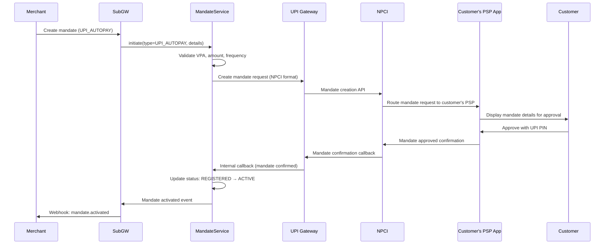

### Technical Sequence

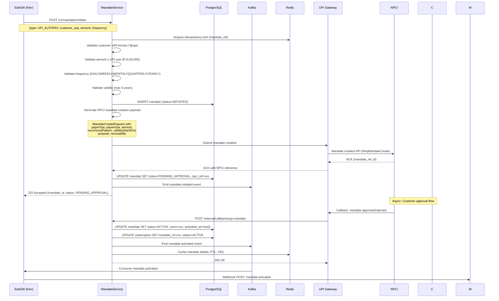

### UPI Mandate Parameters

```json
{
  "mandate_type": "UPI_AUTOPAY",
  "customer_vpa": "customer@upi",
  "payee_vpa": "merchant@plural",
  "amount": {
    "max_amount": 150000,
    "currency": "INR"
  },
  "frequency": "MONTHLY",
  "debit_day": 15,
  "validity": {
    "start_date": "2024-01-15",
    "end_date": "2029-01-15"
  },
  "purpose": "Subscription payment",
  "revocable": true
}
```

### RBI Rules for UPI Autopay

| Rule | Details |
|------|---------|
| Max amount per debit | Registered max_amount |
| Frequency enforcement | Cannot exceed registered frequency |
| Pre-debit notification | **24 hours mandatory** before execution |
| Customer revocation | Anytime via UPI app |
| Maximum validity | Up to 5 years |
| Amount changes | Require new mandate creation |
| First debit | Can be same-day if mandate registered before cutoff |

---

## Flow 2: eNACH Mandate Registration

### Functional Sequence

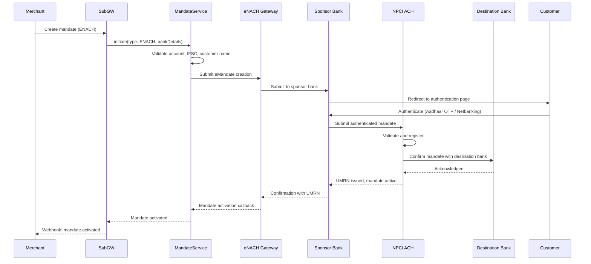

### Technical Sequence

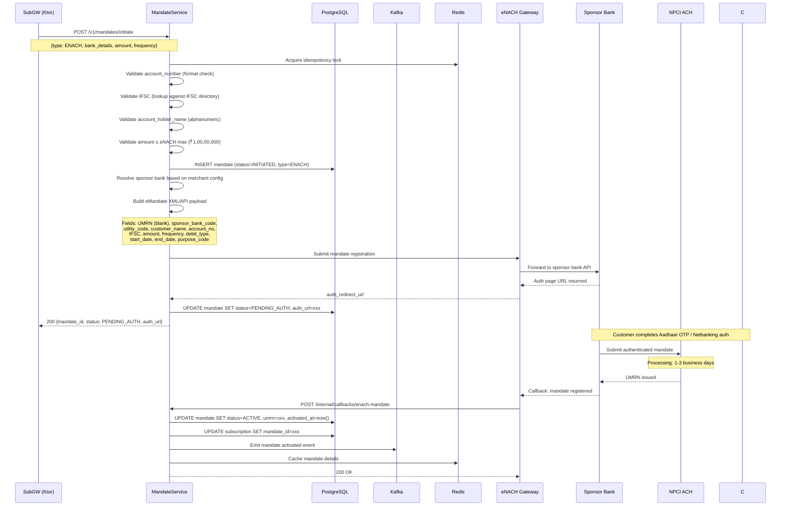

### eNACH Mandate Parameters

```json
{
  "mandate_type": "ENACH",
  "customer_bank_details": {
    "account_number_encrypted": "enc_aes256_xxxxx",
    "ifsc_code": "HDFC0001234",
    "account_type": "SAVINGS",
    "account_holder_name": "John Doe"
  },
  "amount": {
    "max_amount": 10000000,
    "currency": "INR"
  },
  "frequency": "MONTHLY",
  "debit_day": 5,
  "validity": {
    "start_date": "2024-01-01",
    "end_date": null
  },
  "authentication_mode": "AADHAAR_OTP",
  "sponsor_bank": "HDFC",
  "utility_code": "PLURAL001",
  "purpose_code": "SUBSCRIPTION"
}
```

### eNACH Timeline

| Step | Timeline | Description |
|------|----------|-------------|
| Mandate submission | Day 0 | Sent to sponsor bank |
| Bank authentication | Day 0-1 | Customer completes Aadhaar OTP/Netbanking |
| NPCI processing | Day 1-3 | NPCI validates, registers in ACH system |
| Confirmation | Day 2-5 | UMRN issued, mandate status → ACTIVE |
| First debit eligible | Day 5+ | After mandate confirmed active |
| Debit submission | H-2 days | Must submit 2 days before execution date |

---

## Flow 3: Card-on-File (Token) Registration

### Functional Sequence

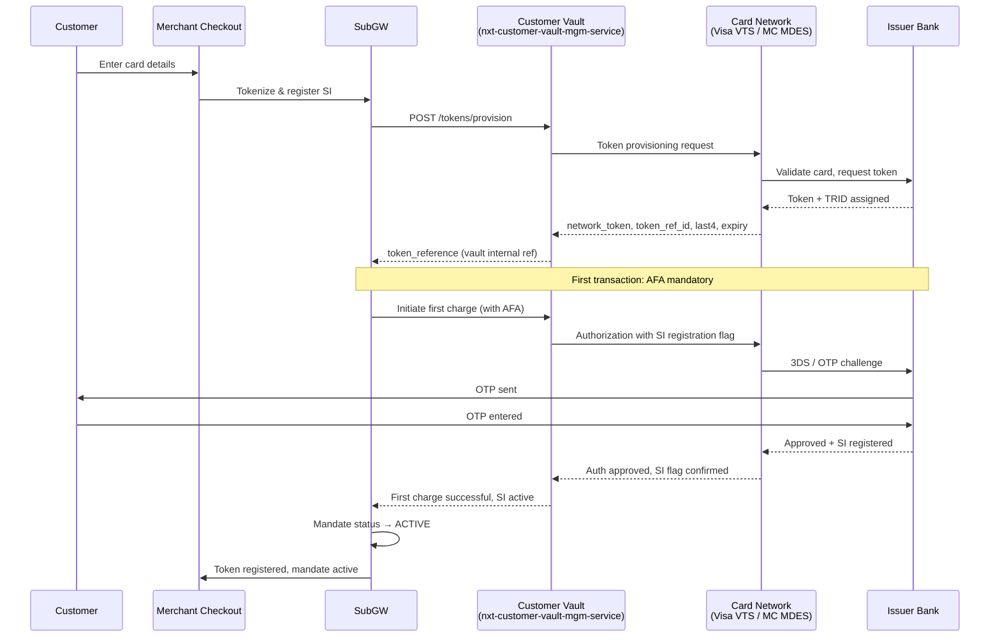

### Technical Sequence

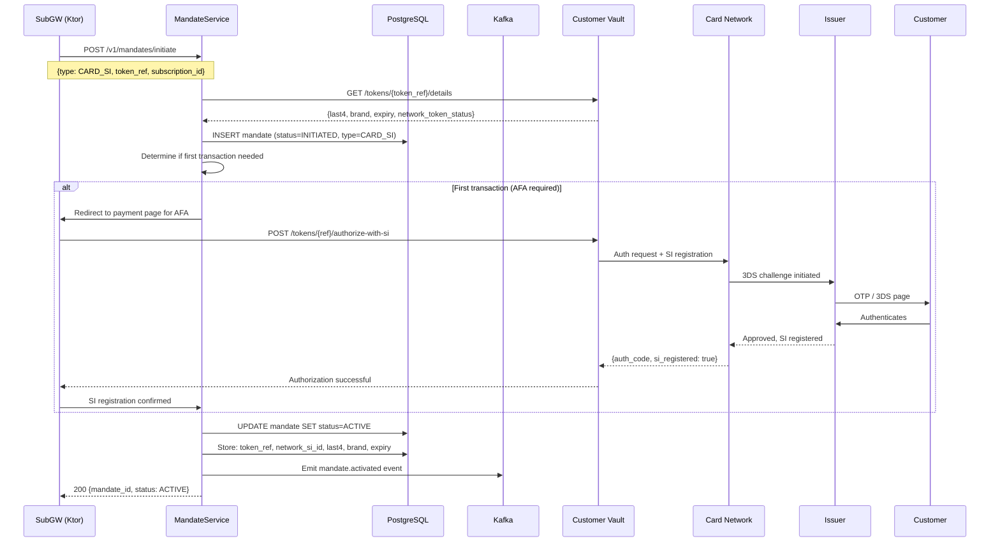

### RBI Card-on-File Rules

| Rule | Details |
|------|---------|
| Card storage | **No merchant can store actual card numbers** (RBI Oct 2022) |
| Tokenization | Must use network tokenization (Visa/Mastercard/RuPay) |
| First recurring txn | AFA (3DS/OTP) required regardless of amount |
| Subsequent ≤ ₹15,000 | Auto-debit allowed (no AFA) |
| Subsequent > ₹15,000 | AFA required per transaction |
| Customer deletion | Can delete token anytime |
| Token validity | Until card expiry or customer-initiated deletion |
| SI registration | Must be registered with issuer for auto-debits |

---

## Flow 4: Mandate Execution (Debit)

### UPI Autopay Debit

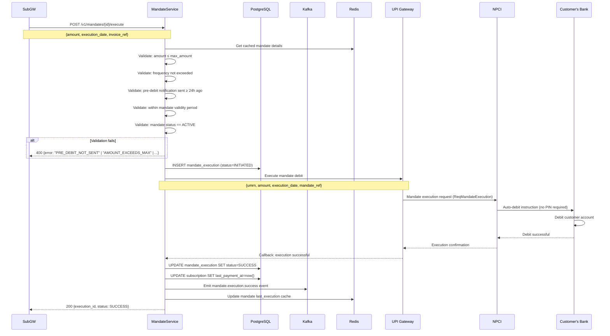

### eNACH Debit

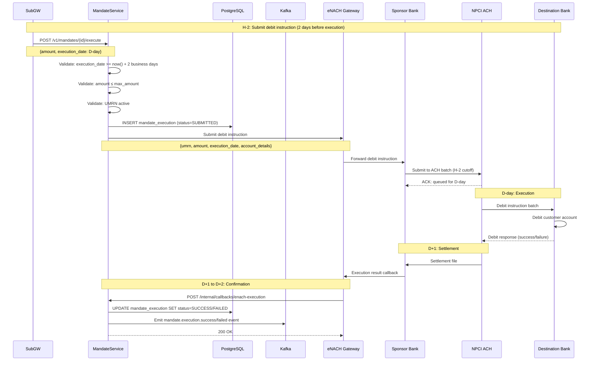

### Card SI Debit

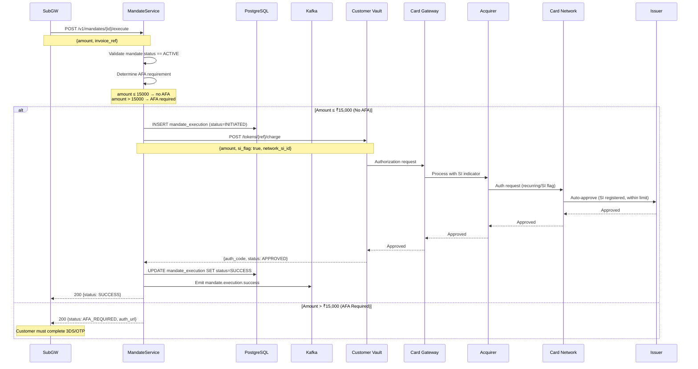

---

## Flow 5: Mandate Modification

### When mandate amount needs to increase

| Mandate Type | Modification Approach | Timeline |
|---|---|---|
| UPI Autopay | **New mandate required** (NPCI does not support amendment) | Same as new registration |
| eNACH | Amendment request via sponsor bank | 3-5 business days |
| Card-on-File | No amount limit on token (acquirer limits apply) | Instant |

### Mandate Upgrade Sequence

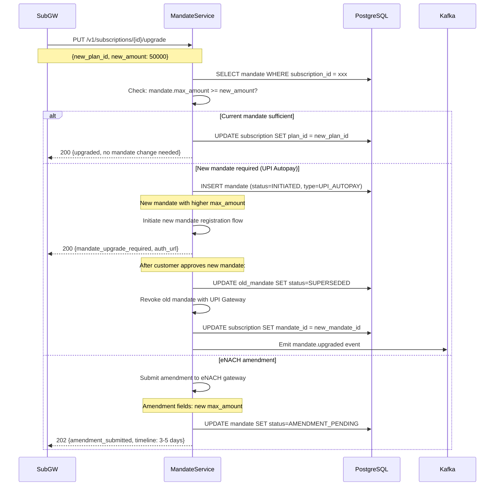

---

## Flow 6: Mandate Revocation

### Customer-Initiated Revocation

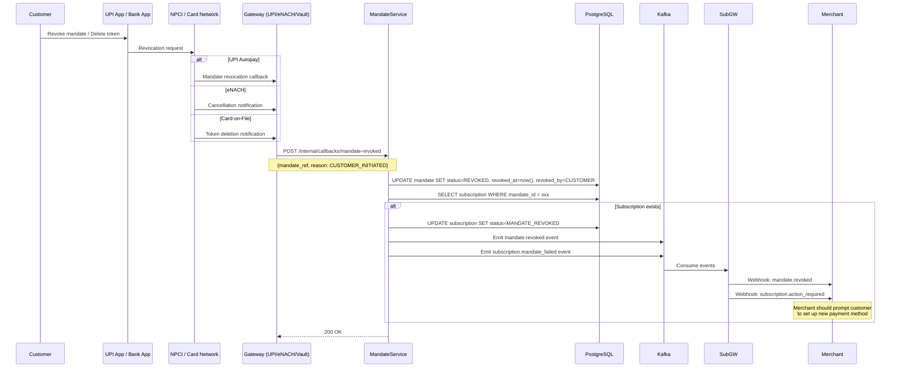

### System-Initiated Revocation

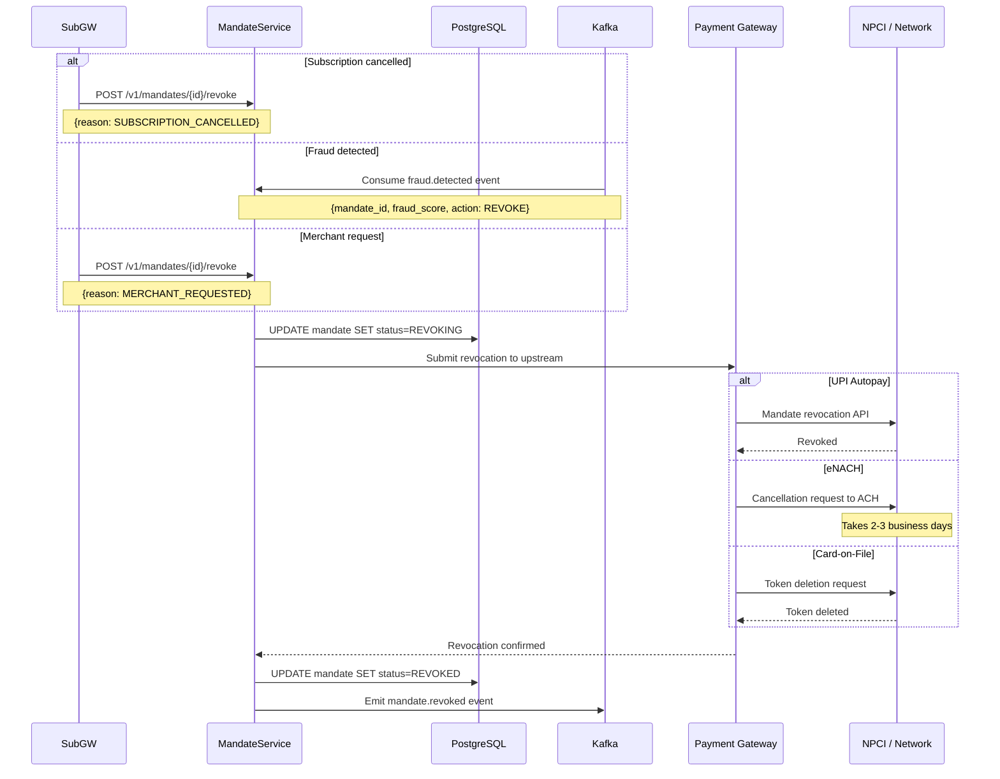

### Handling Unexpected Revocation

```kotlin
suspend fun handleUnexpectedRevocation(mandateId: String, reason: String) {
    val mandate = mandateRepo.findById(mandateId) ?: throw MandateNotFoundException(mandateId)

    // 1. Update mandate status
    mandateRepo.updateStatus(mandateId, MandateStatus.REVOKED, revokedBy = "CUSTOMER", reason = reason)

    // 2. Find affected subscriptions
    val subscriptions = subscriptionRepo.findByMandateId(mandateId)

    subscriptions.forEach { subscription ->
        // 3. Check for fallback mandates
        val fallbacks = mandateRepo.findFallbacksForSubscription(subscription.id)

        if (fallbacks.isNotEmpty()) {
            // 4. Promote next fallback
            val nextMandate = fallbacks.minByOrNull { it.priority }!!
            subscriptionRepo.updateMandate(subscription.id, nextMandate.id)
            eventBus.emit(MandateFallbackActivated(subscription.id, nextMandate.id))
        } else {
            // 5. No fallback: subscription enters MANDATE_FAILED
            subscriptionRepo.updateStatus(subscription.id, SubscriptionStatus.MANDATE_FAILED)
            eventBus.emit(SubscriptionMandateFailed(subscription.id, mandateId))

            // 6. Notify customer
            notificationService.send(
                customerId = subscription.customerId,
                template = "mandate_revoked_setup_new",
                data = mapOf("subscription_name" to subscription.planName)
            )
        }
    }
}
```

---

## Flow 7: Token Rotation & Renewal

### Card Expiry Handling

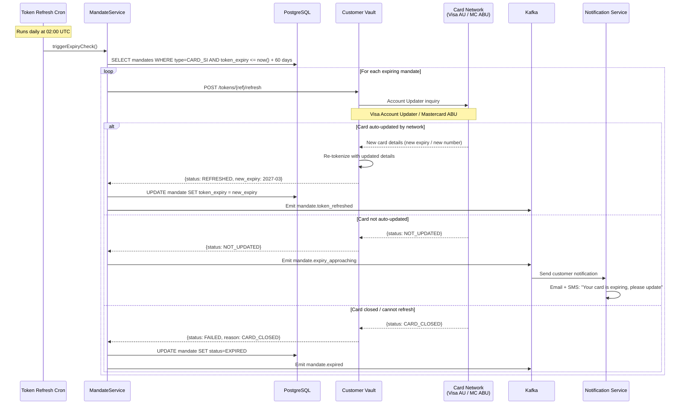

### Token Auto-Refresh Implementation

```kotlin
// Monthly cron job: check expiring tokens
@Scheduled(cron = "0 0 2 * * *") // Daily at 2 AM
suspend fun refreshExpiringTokens() {
    val expiringMandates = mandateRepo.findExpiringWithin(days = 60)

    logger.info("Found ${expiringMandates.size} mandates with expiring tokens")

    expiringMandates.forEach { mandate ->
        try {
            val refreshResult = vault.refreshToken(mandate.tokenReference)
            when (refreshResult) {
                is TokenRefreshResult.Success -> {
                    mandateRepo.updateTokenExpiry(mandate.id, refreshResult.newExpiry)
                    eventBus.emit(MandateTokenRefreshed(mandate.id, refreshResult.newExpiry))
                    metrics.counter("mandate.token_refresh.success").increment()
                }
                is TokenRefreshResult.NotUpdated -> {
                    notificationService.sendExpiryWarning(mandate.customerId, mandate)
                    metrics.counter("mandate.token_refresh.not_updated").increment()
                }
                is TokenRefreshResult.CardClosed -> {
                    mandateRepo.updateStatus(mandate.id, MandateStatus.EXPIRED)
                    handleUnexpectedRevocation(mandate.id, "CARD_CLOSED")
                    metrics.counter("mandate.token_refresh.card_closed").increment()
                }
                is TokenRefreshResult.Error -> {
                    logger.warn("Token refresh failed for mandate ${mandate.id}", refreshResult.error)
                    metrics.counter("mandate.token_refresh.error").increment()
                }
            }
        } catch (e: Exception) {
            logger.error("Unexpected error refreshing mandate ${mandate.id}", e)
        }
    }
}
```

---

## Flow 8: Multi-Mandate / Fallback

### Fallback Payment Method Logic

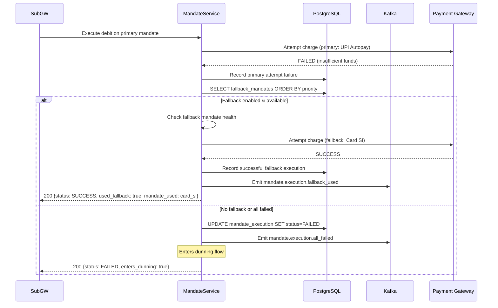

### Data Model for Multi-Mandate

```json
{
  "subscription_id": "sub_xxxxx",
  "payment_settings": {
    "primary_mandate_id": "mdt_upi_xxxxx",
    "fallback_mandates": [
      {"mandate_id": "mdt_card_xxxxx", "priority": 2, "type": "CARD_SI"},
      {"mandate_id": "mdt_nach_xxxxx", "priority": 3, "type": "ENACH"}
    ],
    "fallback_enabled": true,
    "max_fallback_attempts": 2,
    "fallback_delay_seconds": 300
  }
}
```

### Fallback Execution Logic

```kotlin
suspend fun executeWithFallback(subscriptionId: String, amount: Long): ExecutionResult {
    val settings = paymentSettingsRepo.findBySubscription(subscriptionId)

    // Attempt primary
    val primaryResult = executeMandateDebit(settings.primaryMandateId, amount)
    if (primaryResult.isSuccess) return primaryResult

    if (!settings.fallbackEnabled) {
        return ExecutionResult.Failed(primaryResult.error, entersDunning = true)
    }

    // Attempt fallbacks in priority order
    val fallbacks = settings.fallbackMandates.sortedBy { it.priority }
    var attempts = 0

    for (fallback in fallbacks) {
        if (attempts >= settings.maxFallbackAttempts) break
        attempts++

        // Delay between attempts
        delay(settings.fallbackDelaySeconds.seconds)

        val mandate = mandateRepo.findById(fallback.mandateId)
        if (mandate?.status != MandateStatus.ACTIVE) continue

        val result = executeMandateDebit(fallback.mandateId, amount)
        if (result.isSuccess) {
            eventBus.emit(FallbackUsed(subscriptionId, fallback.mandateId, attempts))
            return result.copy(usedFallback = true, fallbackMandateId = fallback.mandateId)
        }
    }

    // All attempts exhausted
    eventBus.emit(AllPaymentMethodsFailed(subscriptionId))
    return ExecutionResult.Failed(error = "ALL_METHODS_EXHAUSTED", entersDunning = true)
}
```

---

## Mandate Health Monitoring

### Proactive Mandate Checks

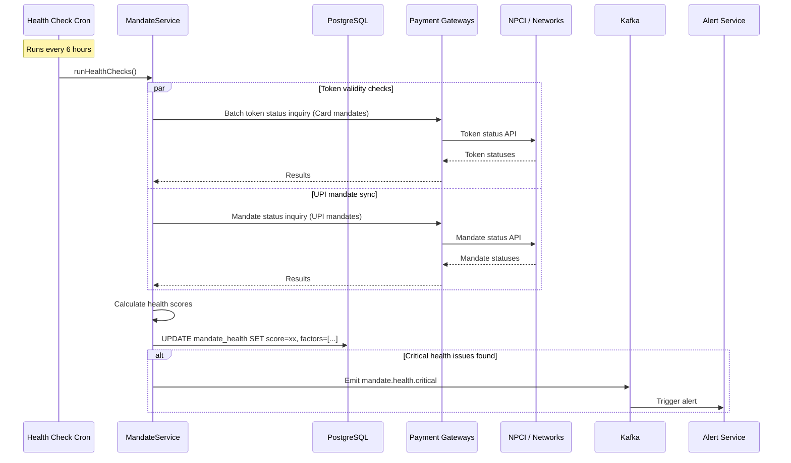

### Mandate Health Score

```kotlin
data class MandateHealth(
    val mandateId: String,
    val score: Int, // 0-100
    val factors: List<HealthFactor>,
    val calculatedAt: Instant
) {
    enum class HealthFactor(val weight: Int) {
        RECENTLY_SUCCESSFUL(+30),     // Last debit succeeded within 60 days
        NOT_EXPIRED(+20),             // Well within validity period
        NO_RECENT_FAILURES(+20),      // No failures in last 3 months
        ACTIVE_STATUS(+15),           // Mandate active in NPCI/Network
        UPDATED_TOKEN(+15),           // Token recently refreshed (card only)
        APPROACHING_EXPIRY(-20),      // Expires within 60 days
        RECENT_FAILURE(-30),          // Last debit failed
        CUSTOMER_COMPLAINT(-40),      // Customer disputed a charge
        MULTIPLE_FAILURES(-50),       // 3+ failures in last 30 days
        REVOCATION_RISK(-25),         // Pattern suggests likely revocation
    }

    fun isHealthy(): Boolean = score >= 60
    fun needsAttention(): Boolean = score in 30..59
    fun isCritical(): Boolean = score < 30
}

suspend fun calculateHealth(mandateId: String): MandateHealth {
    val mandate = mandateRepo.findById(mandateId)!!
    val executions = executionRepo.findRecent(mandateId, limit = 10)
    val factors = mutableListOf<MandateHealth.HealthFactor>()

    // Positive factors
    if (mandate.status == MandateStatus.ACTIVE) factors.add(ACTIVE_STATUS)
    if (executions.firstOrNull()?.status == ExecutionStatus.SUCCESS) factors.add(RECENTLY_SUCCESSFUL)
    if (mandate.expiresAt == null || mandate.expiresAt > Instant.now().plus(60.days)) factors.add(NOT_EXPIRED)
    if (executions.none { it.status == ExecutionStatus.FAILED && it.executedAt > Instant.now().minus(90.days) }) {
        factors.add(NO_RECENT_FAILURES)
    }

    // Negative factors
    if (mandate.expiresAt != null && mandate.expiresAt <= Instant.now().plus(60.days)) factors.add(APPROACHING_EXPIRY)
    if (executions.firstOrNull()?.status == ExecutionStatus.FAILED) factors.add(RECENT_FAILURE)
    if (executions.count { it.status == ExecutionStatus.FAILED && it.executedAt > Instant.now().minus(30.days) } >= 3) {
        factors.add(MULTIPLE_FAILURES)
    }

    val score = (50 + factors.sumOf { it.weight }).coerceIn(0, 100)
    return MandateHealth(mandateId, score, factors, Instant.now())
}
```

### Periodic Health Check (Test Debit for eNACH)

```kotlin
/**
 * For eNACH mandates, perform periodic ₹1 test debits with immediate refund
 * to verify mandate is still active at the destination bank.
 * Runs monthly for mandates not used in 90+ days.
 */
suspend fun performTestDebits() {
    val staleEnachMandates = mandateRepo.findByTypeAndLastUsedBefore(
        type = MandateType.ENACH,
        lastUsedBefore = Instant.now().minus(90.days),
        status = MandateStatus.ACTIVE
    )

    staleEnachMandates.forEach { mandate ->
        val testResult = executeMandateDebit(mandate.id, amount = 100) // ₹1 in paise
        when {
            testResult.isSuccess -> {
                // Immediately initiate refund
                refundService.initiateRefund(testResult.executionId, amount = 100, reason = "HEALTH_CHECK")
                mandateRepo.updateLastHealthCheck(mandate.id, healthy = true)
            }
            else -> {
                mandateRepo.updateLastHealthCheck(mandate.id, healthy = false)
                mandateRepo.updateHealthScore(mandate.id, deduct = 30)
                eventBus.emit(MandateHealthCheckFailed(mandate.id, testResult.error))
            }
        }
    }
}
```

---

## Security

### Encryption & Data Protection

| Data | Protection | Storage |
|------|-----------|---------|
| Card numbers | Never stored; network tokenization only | Customer Vault |
| Bank account numbers | AES-256-GCM encrypted | MandateService DB (encrypted column) |
| UPI VPA | Plain text (not sensitive) | MandateService DB |
| Token references | Vault-internal opaque IDs | MandateService DB |
| UMRN | Plain text | MandateService DB |
| Mandate callbacks | TLS 1.3, IP allowlist, HMAC signature | — |

### Access Control

```kotlin
// IP-based allowlist for mandate callbacks
val callbackAllowlist = mapOf(
    "UPI_GATEWAY" to listOf("10.0.1.0/24", "10.0.2.0/24"),
    "ENACH_GATEWAY" to listOf("10.0.3.0/24"),
    "CARD_NETWORK" to listOf("10.0.4.0/24", "10.0.5.0/24")
)

// Rate limiting on mandate creation (prevent abuse)
val mandateCreationLimits = RateLimitConfig(
    perCustomer = RateLimit(max = 5, window = Duration.ofHours(1)),
    perMerchant = RateLimit(max = 100, window = Duration.ofMinutes(10)),
    global = RateLimit(max = 1000, window = Duration.ofMinutes(1))
)
```

### Audit Trail

```kotlin
// Every mandate action is audit-logged
data class MandateAuditEntry(
    val id: String = UUID.randomUUID().toString(),
    val mandateId: String,
    val action: MandateAction,
    val actor: String,          // system | customer | merchant | admin
    val actorId: String?,
    val previousStatus: MandateStatus?,
    val newStatus: MandateStatus?,
    val metadata: Map<String, String>,
    val ipAddress: String?,
    val timestamp: Instant = Instant.now()
)

enum class MandateAction {
    INITIATED, PENDING_AUTH, ACTIVATED, EXECUTED, FAILED,
    AMENDED, REVOKED, EXPIRED, HEALTH_CHECKED, FALLBACK_PROMOTED
}
```

---

## Database Schema

### Core Mandate Tables

```sql
-- Main mandate table
CREATE TABLE mandates (
    id              UUID PRIMARY KEY DEFAULT gen_random_uuid(),
    subscription_id UUID REFERENCES subscriptions(id),
    customer_id     UUID NOT NULL,
    merchant_id     UUID NOT NULL,
    mandate_type    VARCHAR(20) NOT NULL, -- UPI_AUTOPAY, ENACH, CARD_SI, EMANDATE
    status          VARCHAR(30) NOT NULL DEFAULT 'INITIATED',
    -- UPI specific
    customer_vpa    VARCHAR(255),
    payee_vpa       VARCHAR(255),
    upi_mandate_ref VARCHAR(100),
    -- eNACH specific
    umrn            VARCHAR(50),
    sponsor_bank    VARCHAR(20),
    utility_code    VARCHAR(20),
    account_number_enc BYTEA,           -- AES-256-GCM encrypted
    ifsc_code       VARCHAR(11),
    account_holder  VARCHAR(100),
    -- Card specific
    token_reference VARCHAR(100),       -- Vault internal reference
    card_last4      VARCHAR(4),
    card_brand      VARCHAR(20),
    card_network    VARCHAR(20),
    network_si_id   VARCHAR(100),
    token_expiry    DATE,
    -- Common fields
    max_amount      BIGINT NOT NULL,    -- In smallest currency unit (paise)
    currency        VARCHAR(3) NOT NULL DEFAULT 'INR',
    frequency       VARCHAR(20) NOT NULL, -- DAILY, WEEKLY, MONTHLY, QUARTERLY, YEARLY, AS_PRESENTED
    debit_day       INT,
    validity_start  DATE NOT NULL,
    validity_end    DATE,
    purpose         VARCHAR(255),
    revocable       BOOLEAN DEFAULT true,
    -- Metadata
    activated_at    TIMESTAMPTZ,
    revoked_at      TIMESTAMPTZ,
    revoked_by      VARCHAR(20),        -- CUSTOMER, MERCHANT, SYSTEM
    revoke_reason   VARCHAR(255),
    health_score    INT DEFAULT 50,
    last_health_check TIMESTAMPTZ,
    -- Timestamps
    created_at      TIMESTAMPTZ NOT NULL DEFAULT now(),
    updated_at      TIMESTAMPTZ NOT NULL DEFAULT now(),

    CONSTRAINT chk_mandate_type CHECK (mandate_type IN ('UPI_AUTOPAY', 'ENACH', 'CARD_SI', 'EMANDATE')),
    CONSTRAINT chk_status CHECK (status IN (
        'INITIATED', 'PENDING_AUTH', 'PENDING_APPROVAL', 'ACTIVE',
        'AMENDMENT_PENDING', 'SUPERSEDED', 'REVOKED', 'EXPIRED', 'FAILED'
    )),
    CONSTRAINT chk_frequency CHECK (frequency IN (
        'DAILY', 'WEEKLY', 'FORTNIGHTLY', 'MONTHLY', 'BIMONTHLY',
        'QUARTERLY', 'HALFYEARLY', 'YEARLY', 'AS_PRESENTED'
    ))
);

-- Indexes
CREATE INDEX idx_mandates_subscription ON mandates(subscription_id);
CREATE INDEX idx_mandates_customer ON mandates(customer_id);
CREATE INDEX idx_mandates_merchant ON mandates(merchant_id);
CREATE INDEX idx_mandates_status ON mandates(status);
CREATE INDEX idx_mandates_type_status ON mandates(mandate_type, status);
CREATE INDEX idx_mandates_token_expiry ON mandates(token_expiry) WHERE mandate_type = 'CARD_SI';
CREATE INDEX idx_mandates_umrn ON mandates(umrn) WHERE umrn IS NOT NULL;
CREATE INDEX idx_mandates_upi_ref ON mandates(upi_mandate_ref) WHERE upi_mandate_ref IS NOT NULL;
CREATE INDEX idx_mandates_health ON mandates(health_score, status) WHERE status = 'ACTIVE';

-- Mandate executions (debit attempts)
CREATE TABLE mandate_executions (
    id              UUID PRIMARY KEY DEFAULT gen_random_uuid(),
    mandate_id      UUID NOT NULL REFERENCES mandates(id),
    subscription_id UUID REFERENCES subscriptions(id),
    invoice_id      UUID REFERENCES invoices(id),
    amount          BIGINT NOT NULL,
    currency        VARCHAR(3) NOT NULL DEFAULT 'INR',
    status          VARCHAR(20) NOT NULL DEFAULT 'INITIATED',
    execution_date  DATE NOT NULL,
    -- Result details
    gateway_ref     VARCHAR(100),
    failure_code    VARCHAR(50),
    failure_reason  VARCHAR(500),
    -- Fallback tracking
    is_fallback     BOOLEAN DEFAULT false,
    fallback_from   UUID REFERENCES mandate_executions(id),
    attempt_number  INT DEFAULT 1,
    -- Timestamps
    initiated_at    TIMESTAMPTZ NOT NULL DEFAULT now(),
    completed_at    TIMESTAMPTZ,
    created_at      TIMESTAMPTZ NOT NULL DEFAULT now(),

    CONSTRAINT chk_exec_status CHECK (status IN (
        'INITIATED', 'SUBMITTED', 'PENDING', 'SUCCESS', 'FAILED', 'REVERSED'
    ))
);

CREATE INDEX idx_executions_mandate ON mandate_executions(mandate_id);
CREATE INDEX idx_executions_subscription ON mandate_executions(subscription_id);
CREATE INDEX idx_executions_status ON mandate_executions(status);
CREATE INDEX idx_executions_date ON mandate_executions(execution_date);
CREATE INDEX idx_executions_mandate_date ON mandate_executions(mandate_id, execution_date DESC);

-- Payment settings (multi-mandate config per subscription)
CREATE TABLE subscription_payment_settings (
    id                    UUID PRIMARY KEY DEFAULT gen_random_uuid(),
    subscription_id       UUID NOT NULL UNIQUE REFERENCES subscriptions(id),
    primary_mandate_id    UUID NOT NULL REFERENCES mandates(id),
    fallback_enabled      BOOLEAN DEFAULT false,
    max_fallback_attempts INT DEFAULT 2,
    fallback_delay_secs   INT DEFAULT 300,
    created_at            TIMESTAMPTZ NOT NULL DEFAULT now(),
    updated_at            TIMESTAMPTZ NOT NULL DEFAULT now()
);

-- Fallback mandate associations
CREATE TABLE subscription_fallback_mandates (
    id              UUID PRIMARY KEY DEFAULT gen_random_uuid(),
    subscription_id UUID NOT NULL REFERENCES subscriptions(id),
    mandate_id      UUID NOT NULL REFERENCES mandates(id),
    priority        INT NOT NULL,
    created_at      TIMESTAMPTZ NOT NULL DEFAULT now(),

    UNIQUE(subscription_id, mandate_id),
    UNIQUE(subscription_id, priority)
);

CREATE INDEX idx_fallback_subscription ON subscription_fallback_mandates(subscription_id);

-- Mandate audit log
CREATE TABLE mandate_audit_log (
    id              UUID PRIMARY KEY DEFAULT gen_random_uuid(),
    mandate_id      UUID NOT NULL REFERENCES mandates(id),
    action          VARCHAR(30) NOT NULL,
    actor_type      VARCHAR(20) NOT NULL, -- SYSTEM, CUSTOMER, MERCHANT, ADMIN
    actor_id        VARCHAR(100),
    previous_status VARCHAR(30),
    new_status      VARCHAR(30),
    metadata        JSONB,
    ip_address      INET,
    created_at      TIMESTAMPTZ NOT NULL DEFAULT now()
);

CREATE INDEX idx_audit_mandate ON mandate_audit_log(mandate_id);
CREATE INDEX idx_audit_action ON mandate_audit_log(action);
CREATE INDEX idx_audit_created ON mandate_audit_log(created_at);

-- Pre-debit notifications tracking (UPI Autopay requirement)
CREATE TABLE pre_debit_notifications (
    id              UUID PRIMARY KEY DEFAULT gen_random_uuid(),
    mandate_id      UUID NOT NULL REFERENCES mandates(id),
    execution_date  DATE NOT NULL,
    amount          BIGINT NOT NULL,
    notification_type VARCHAR(20) NOT NULL, -- SMS, EMAIL, PUSH, IN_APP
    sent_at         TIMESTAMPTZ NOT NULL,
    delivered_at    TIMESTAMPTZ,
    status          VARCHAR(20) DEFAULT 'SENT',
    created_at      TIMESTAMPTZ NOT NULL DEFAULT now(),

    CONSTRAINT chk_notif_status CHECK (status IN ('SENT', 'DELIVERED', 'FAILED'))
);

CREATE INDEX idx_predebit_mandate_date ON pre_debit_notifications(mandate_id, execution_date);
```

---

## Observability

### Metrics

| Metric | Type | Labels | Description |
|--------|------|--------|-------------|
| `mandate_registration_total` | Counter | type, status | Total mandate registration attempts |
| `mandate_registration_success_rate` | Gauge | type | Success rate by mandate type |
| `mandate_registration_duration_seconds` | Histogram | type | Time from initiation to activation |
| `mandate_debit_total` | Counter | type, status | Total debit attempts |
| `mandate_debit_success_rate` | Gauge | type | Debit success rate by type |
| `mandate_debit_duration_seconds` | Histogram | type | Debit execution latency |
| `mandate_revocation_total` | Counter | type, initiated_by | Revocations count |
| `mandate_revocation_rate` | Gauge | type | Revocation rate (30-day rolling) |
| `mandate_health_score` | Gauge | mandate_id, type | Current health score |
| `mandate_fallback_used_total` | Counter | from_type, to_type | Fallback executions |
| `mandate_token_refresh_total` | Counter | status | Token refresh outcomes |
| `mandate_expiry_approaching` | Gauge | type | Count of mandates expiring in 60 days |

### Alerts

```yaml
# Prometheus alert rules
groups:
  - name: mandate_alerts
    rules:
      - alert: HighMandateRevocationRate
        expr: mandate_revocation_rate > 0.05
        for: 15m
        labels:
          severity: warning
        annotations:
          summary: "Mandate revocation rate > 5%"

      - alert: MandateRegistrationFailureSpike
        expr: rate(mandate_registration_total{status="FAILED"}[5m]) > 10
        for: 5m
        labels:
          severity: critical
        annotations:
          summary: "Mandate registration failures spiking"

      - alert: MandateDebitSuccessRateDrop
        expr: mandate_debit_success_rate < 0.85
        for: 10m
        labels:
          severity: critical
        annotations:
          summary: "Mandate debit success rate below 85%"

      - alert: ExpiryCluster
        expr: mandate_expiry_approaching > 100
        for: 1h
        labels:
          severity: warning
        annotations:
          summary: "Large cluster of mandates expiring soon"

      - alert: TokenRefreshFailures
        expr: rate(mandate_token_refresh_total{status="error"}[1h]) > 5
        for: 30m
        labels:
          severity: warning
        annotations:
          summary: "Token refresh failures increasing"

      - alert: UPIPreDebitNotificationFailure
        expr: rate(pre_debit_notification_total{status="FAILED"}[1h]) > 0
        for: 5m
        labels:
          severity: critical
        annotations:
          summary: "Pre-debit notifications failing (RBI compliance risk)"
```

### Dashboard Panels

- **Mandate Overview**: Active mandates by type (pie chart), registration trend (time series)
- **Health Distribution**: Health score histogram, critical/attention/healthy counts
- **Execution Performance**: Success rate by type (time series), latency percentiles
- **Expiry Timeline**: Mandates expiring in 30/60/90 days (bar chart)
- **Revocation Analysis**: Revocation rate trend, initiated_by breakdown, reason distribution
- **Fallback Usage**: Fallback trigger rate, fallback success rate, primary→fallback type flow (Sankey)

---

## Kafka Events

| Event | Topic | Partition Key | Description |
|-------|-------|---------------|-------------|
| `mandate.initiated` | `mandate-lifecycle` | mandate_id | Mandate creation started |
| `mandate.activated` | `mandate-lifecycle` | mandate_id | Mandate is active |
| `mandate.revoked` | `mandate-lifecycle` | mandate_id | Mandate revoked |
| `mandate.expired` | `mandate-lifecycle` | mandate_id | Mandate expired |
| `mandate.upgraded` | `mandate-lifecycle` | mandate_id | Mandate replaced with new one |
| `mandate.execution.success` | `mandate-executions` | subscription_id | Debit succeeded |
| `mandate.execution.failed` | `mandate-executions` | subscription_id | Debit failed |
| `mandate.execution.fallback_used` | `mandate-executions` | subscription_id | Fallback mandate used |
| `mandate.health.critical` | `mandate-health` | mandate_id | Health score dropped below threshold |
| `mandate.token_refreshed` | `mandate-health` | mandate_id | Card token auto-refreshed |
| `mandate.expiry_approaching` | `mandate-health` | mandate_id | Token/mandate nearing expiry |

---

## API Endpoints

| Method | Path | Description |
|--------|------|-------------|
| POST | `/v1/mandates/initiate` | Create a new mandate |
| GET | `/v1/mandates/{id}` | Get mandate details |
| GET | `/v1/mandates?subscription_id=xxx` | List mandates for subscription |
| POST | `/v1/mandates/{id}/execute` | Execute debit on mandate |
| POST | `/v1/mandates/{id}/revoke` | Revoke a mandate |
| PUT | `/v1/mandates/{id}/amend` | Amend mandate (eNACH only) |
| GET | `/v1/mandates/{id}/health` | Get mandate health score |
| GET | `/v1/mandates/{id}/executions` | List execution history |
| POST | `/internal/callbacks/upi-mandate` | UPI mandate callback |
| POST | `/internal/callbacks/enach-mandate` | eNACH mandate callback |
| POST | `/internal/callbacks/card-token` | Card network token callback |
