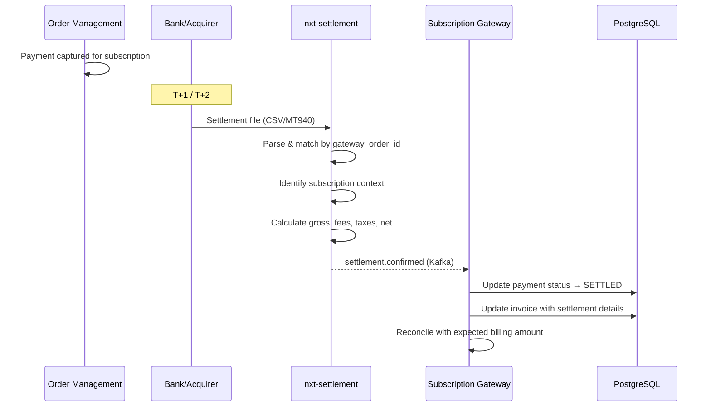
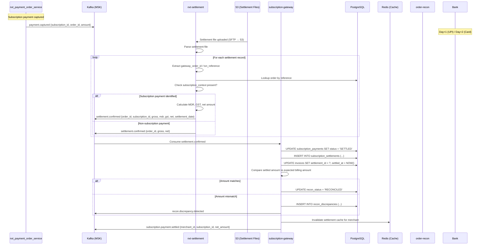
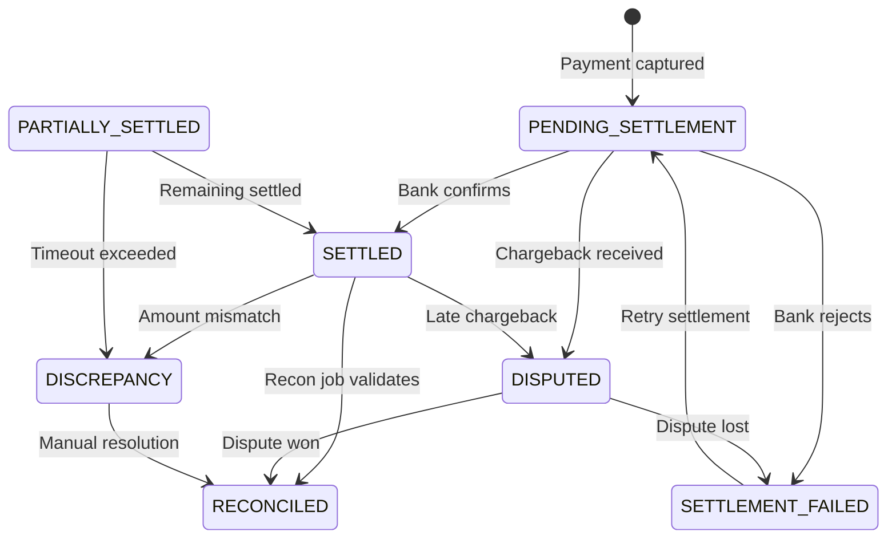
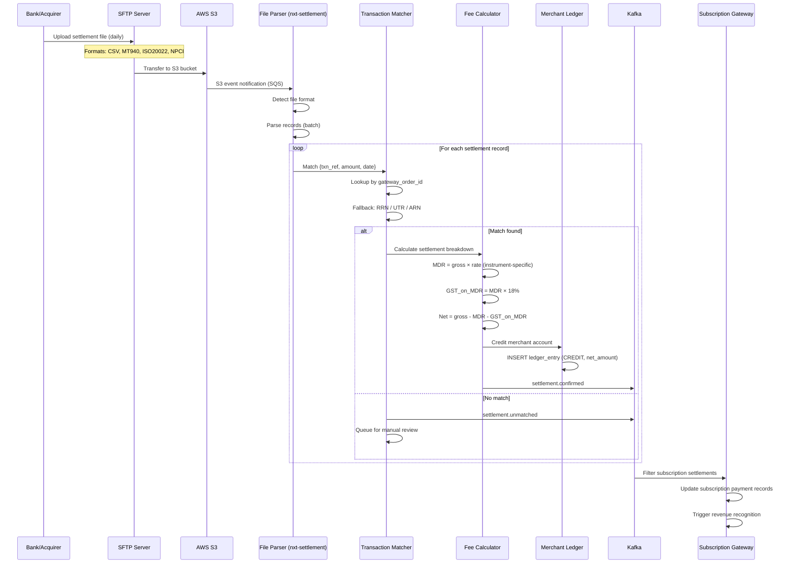
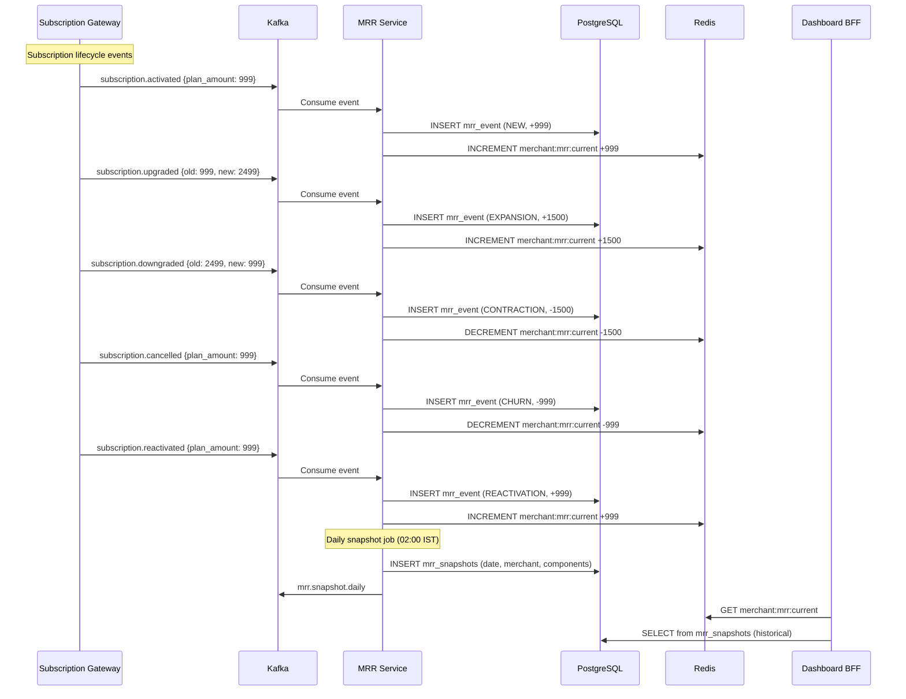
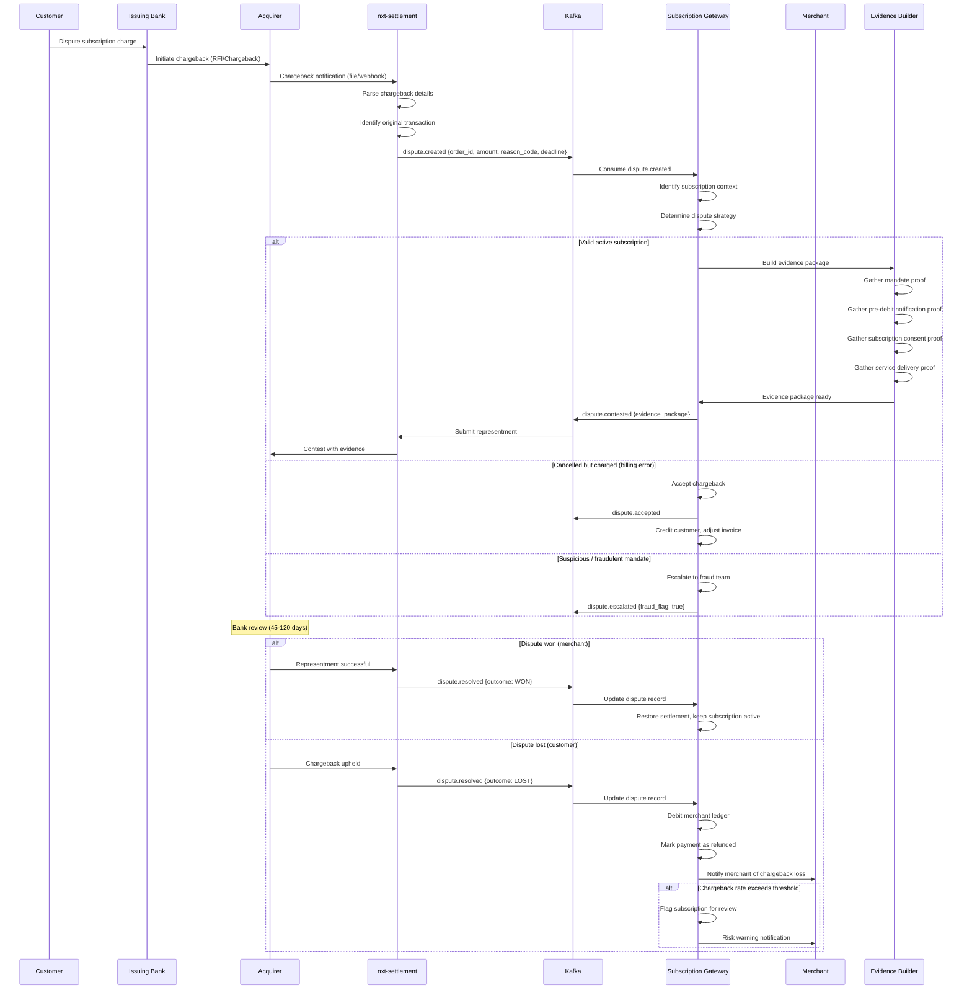
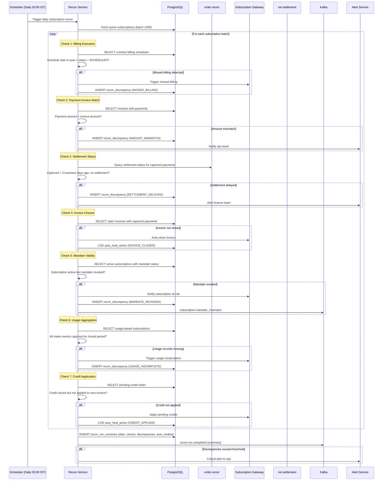
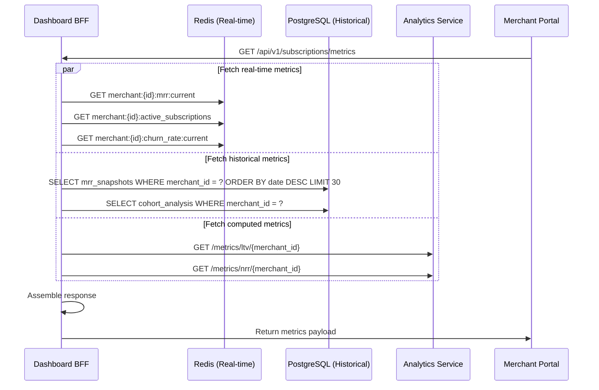
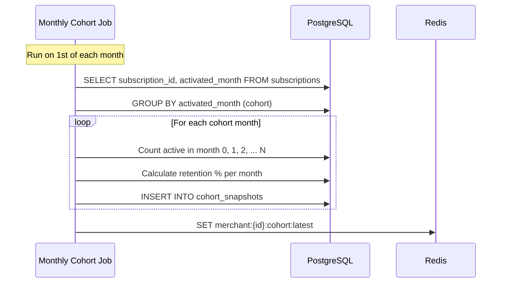
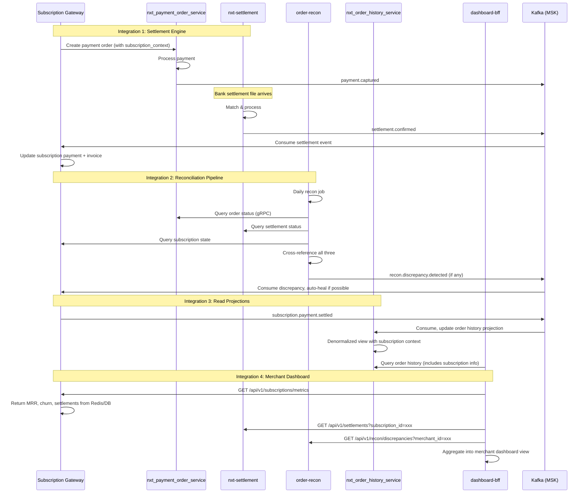

# 12 — Settlement & Reconciliation

> Subscription reconciliation pipeline, MRR tracking, and revenue recognition

---

## Functional Overview

Settlement and reconciliation for subscriptions involves:
1. **Payment Reconciliation** — Matching subscription payments with bank settlements
2. **Revenue Recognition** — Tracking MRR, ARR, deferred revenue
3. **Settlement** — Funds flow from gateway to merchant
4. **Dispute Handling** — Chargebacks on subscription payments
5. **Analytics & Reporting** — Financial metrics, cohort analysis

---

## Flow 1: Subscription Payment Reconciliation

### Functional Sequence



### Technical Sequence



### Reconciliation States

| State | Description |
|-------|-------------|
| `PENDING_SETTLEMENT` | Payment captured, awaiting settlement confirmation from bank |
| `SETTLED` | Bank confirmed settlement, funds transferred |
| `PARTIALLY_SETTLED` | Partial amount settled (rare, split settlement scenarios) |
| `SETTLEMENT_FAILED` | Settlement reversed or rejected by bank |
| `DISPUTED` | Chargeback initiated by customer |
| `RECONCILED` | Matched and verified — amount, timing, references all correct |
| `DISCREPANCY` | Amount mismatch or timing anomaly detected |

### State Machine



---

## Flow 2: Settlement File Processing

### Settlement Pipeline



### Settlement Calculation Examples

```
── Card Payment (Visa/MC) ──────────────────────────
Gross amount:           INR 1,410.34
MDR (2.0%):            -INR 28.21
GST on MDR (18%):      -INR 5.08
Net settlement:         INR 1,377.05
Settlement date:        T+2

── UPI Payment ─────────────────────────────────────
Gross amount:           INR 999.00
MDR (0%):              -INR 0.00  (UPI ≤ INR 2000 zero MDR)
GST on MDR:            -INR 0.00
Net settlement:         INR 999.00
Settlement date:        T+1

── UPI Recurring (mandate) ─────────────────────────
Gross amount:           INR 4,999.00
MDR (1.5%):            -INR 74.99
GST on MDR (18%):      -INR 13.50
Net settlement:         INR 4,910.51
Settlement date:        T+1

── NACH/eMandate ───────────────────────────────────
Gross amount:           INR 15,000.00
Processing fee:        -INR 25.00
GST on fee (18%):      -INR 4.50
Net settlement:         INR 14,970.50
Settlement date:        T+3
```

### File Format Support

| Format | Source | Fields |
|--------|--------|--------|
| CSV (proprietary) | HDFC, ICICI, Axis | TxnRef, Amount, Date, Status, UTR |
| MT940 (SWIFT) | International acquirers | Structured bank statement |
| ISO 20022 (XML) | NPCI (UPI), RBI | pain.002, camt.053 |
| NPCI Settlement | UPI ecosystem | NPCI Ref, Payer VPA, Amount, Status |
| NACH Response | Sponsor banks | UMRN, Amount, Return Code |

---

## Flow 3: Revenue Recognition (MRR Tracking)

### MRR Computation Pipeline



### MRR Components

| Component | Calculation | Example |
|-----------|-------------|---------|
| **New MRR** | Sum of new subscriptions activated this month | +INR 50,000 |
| **Expansion MRR** | Upgrades + quantity increases + add-ons | +INR 20,000 |
| **Contraction MRR** | Downgrades + quantity decreases + removed add-ons | -INR 8,000 |
| **Churned MRR** | Cancelled subscriptions (voluntary + involuntary) | -INR 12,000 |
| **Reactivation MRR** | Resumed/recovered subscriptions (dunning wins) | +INR 5,000 |
| **Net New MRR** | New + Expansion - Contraction - Churn + Reactivation | **+INR 55,000** |

### MRR Normalization Rules

```kotlin
/**
 * Normalize non-monthly billing intervals to monthly equivalent.
 * All MRR is stored as monthly-equivalent INR.
 */
fun normalizeMRR(amount: Money, interval: BillingInterval): Money {
    return when (interval) {
        BillingInterval.WEEKLY -> amount * (52.0 / 12.0)       // × 4.333
        BillingInterval.MONTHLY -> amount                       // × 1
        BillingInterval.QUARTERLY -> amount / 3.0               // ÷ 3
        BillingInterval.SEMI_ANNUAL -> amount / 6.0             // ÷ 6
        BillingInterval.ANNUAL -> amount / 12.0                 // ÷ 12
        BillingInterval.CUSTOM -> amount / interval.months()    // ÷ custom months
    }
}

// Examples:
// Annual plan INR 11,988 → MRR = INR 999/month
// Quarterly plan INR 2,999 → MRR = INR 999.67/month
// Weekly plan INR 249 → MRR = INR 1,079.17/month
```

### Revenue Recognition Rules

```kotlin
/**
 * Revenue recognition configuration per merchant.
 * Determines when and how revenue is recognized from subscription payments.
 */
data class RevenueRecognition(
    val subscriptionId: String,
    val invoiceId: String,
    val merchantId: String,
    val totalAmount: Money,
    val recognitionMethod: RecognitionMethod,
    val periodStart: LocalDate,
    val periodEnd: LocalDate,
    val recognizedAmount: Money,    // Amount recognized so far
    val deferredAmount: Money,      // Amount to recognize in future periods
    val currency: Currency,
    val createdAt: Instant,
    val updatedAt: Instant
)

enum class RecognitionMethod {
    IMMEDIATE,       // Recognize full amount on payment (default for monthly)
    OVER_PERIOD,     // Spread evenly over service period (quarterly, annual)
    MILESTONE,       // Recognize at specific milestones (usage-based)
    USAGE_BASED      // Recognize proportional to actual usage delivered
}

/**
 * Daily revenue recognition job.
 * Processes all deferred revenue entries and recognizes the daily portion.
 */
class RevenueRecognitionJob(
    private val revenueRepo: RevenueRecognitionRepository,
    private val ledgerService: LedgerService
) {
    suspend fun runDaily(date: LocalDate) {
        val deferredEntries = revenueRepo.findWithDeferredRevenue(date)
        
        for (entry in deferredEntries) {
            val dailyRecognition = calculateDailyRecognition(entry, date)
            
            if (dailyRecognition.amount > Money.ZERO) {
                ledgerService.recognize(
                    merchantId = entry.merchantId,
                    amount = dailyRecognition,
                    fromDeferred = true,
                    subscriptionId = entry.subscriptionId,
                    invoiceId = entry.invoiceId,
                    date = date
                )
                
                revenueRepo.updateRecognized(
                    entryId = entry.id,
                    additionalRecognized = dailyRecognition,
                    newDeferredAmount = entry.deferredAmount - dailyRecognition
                )
            }
        }
    }
    
    private fun calculateDailyRecognition(
        entry: RevenueRecognition,
        date: LocalDate
    ): Money {
        val totalDays = ChronoUnit.DAYS.between(entry.periodStart, entry.periodEnd)
        val dailyRate = entry.totalAmount.amount / BigDecimal(totalDays)
        return Money(dailyRate.setScale(2, RoundingMode.HALF_UP), entry.currency)
    }
}
```

### Deferred Revenue Calculation

```
── Quarterly Plan ──────────────────────────────────────────
Invoice paid: Jan 1, Amount: INR 2,999 (quarterly plan)
Recognition method: OVER_PERIOD (evenly over 90 days)

Day of payment:
  Recognized:  INR 0.00
  Deferred:    INR 2,999.00

End of January (31 days elapsed):
  Recognized:  INR 2,999 × (31/90) = INR 1,032.89
  Deferred:    INR 1,966.11

End of February (28 days elapsed):
  Recognized:  INR 2,999 × (59/90) = INR 1,965.91
  Deferred:    INR 1,033.09

End of March (31 days elapsed):
  Recognized:  INR 2,999 × (90/90) = INR 2,999.00
  Deferred:    INR 0.00

── Annual Plan ─────────────────────────────────────────────
Invoice paid: Jan 1, Amount: INR 11,988 (annual plan)
Recognition method: OVER_PERIOD (evenly over 365 days)
Daily recognition: INR 11,988 / 365 = INR 32.84/day

Month 1 (Jan):  INR 1,018.04
Month 2 (Feb):  INR 919.52
Month 3 (Mar):  INR 1,018.04
...
Month 12 (Dec): INR 1,018.04
```

---

## Flow 4: Chargeback/Dispute Handling

### Dispute Flow



### Evidence Package for Subscription Disputes

```json
{
  "dispute_id": "dsp_8f7g6h5j4k3l",
  "original_transaction": {
    "order_id": "ord_abc123",
    "amount": 2499.00,
    "currency": "INR",
    "payment_date": "2024-01-15T06:00:00Z",
    "payment_method": "UPI_RECURRING",
    "gateway_reference": "PAY2024011500001234"
  },
  "evidence_type": "SUBSCRIPTION_RECURRING",
  "mandate_proof": {
    "mandate_id": "mdt_9x8y7z6w5v",
    "mandate_type": "UPI_AUTOPAY",
    "registration_date": "2024-01-01T10:30:00Z",
    "customer_authorization": "UPI_PIN_VERIFIED",
    "umrn": "MANDATE1234567890",
    "max_amount": 5000.00,
    "frequency": "MONTHLY",
    "validity_start": "2024-01-01",
    "validity_end": "2026-01-01",
    "customer_vpa": "customer@upi",
    "registration_reference": "REG2024010112345"
  },
  "pre_debit_proof": {
    "notification_id": "notif_abc123",
    "notification_sent_at": "2024-01-14T10:00:00Z",
    "channel": "SMS",
    "recipient": "+91-9876543210",
    "message_content": "INR 2,499 will be debited on 15-Jan-2024 for Pro Monthly subscription. Reply STOP to cancel.",
    "delivery_confirmed": true,
    "delivery_timestamp": "2024-01-14T10:00:03Z",
    "opt_out_window_hours": 24,
    "opt_out_received": false,
    "sms_vendor": "msg91",
    "delivery_receipt_id": "dlr_xyz789"
  },
  "subscription_proof": {
    "subscription_id": "sub_5a4b3c2d1e",
    "plan_name": "Pro Monthly",
    "plan_amount": 2499.00,
    "billing_interval": "MONTHLY",
    "subscription_start_date": "2024-01-01",
    "current_period_start": "2024-01-15",
    "current_period_end": "2024-02-14",
    "customer_consent_timestamp": "2023-12-28T14:30:00Z",
    "consent_ip_address": "103.21.58.100",
    "consent_user_agent": "Mozilla/5.0 (Linux; Android 13) ...",
    "terms_accepted_version": "v2.3",
    "cancellation_policy_shown": true
  },
  "service_delivery_proof": {
    "service_type": "SaaS Platform Access",
    "usage_logs_available": true,
    "last_login": "2024-01-14T18:22:00Z",
    "logins_in_billing_period": 12,
    "api_calls_in_period": 4521,
    "features_accessed": ["dashboard", "reports", "api", "integrations"],
    "data_exported": true,
    "active_team_members": 3
  },
  "communication_history": [
    {
      "date": "2024-01-01",
      "type": "EMAIL",
      "subject": "Welcome to Pro Plan",
      "delivered": true
    },
    {
      "date": "2024-01-14",
      "type": "SMS",
      "subject": "Pre-debit notification",
      "delivered": true
    },
    {
      "date": "2024-01-15",
      "type": "EMAIL",
      "subject": "Payment receipt - Invoice #INV-2024-001",
      "delivered": true
    }
  ],
  "submitted_at": "2024-01-20T09:00:00Z",
  "response_deadline": "2024-02-04T23:59:59Z"
}
```

### Dispute Reason Codes & Strategy

| Reason Code | Description | Auto-Strategy | Win Rate |
|-------------|-------------|---------------|----------|
| `10.4` | Unrecognized transaction | Contest + mandate proof | ~70% |
| `13.1` | Merchandise not received | Contest + delivery proof | ~65% |
| `13.2` | Cancelled recurring | Check dates, accept if valid | ~30% |
| `13.7` | Cancelled merchandise | Contest if active subscription | ~55% |
| `10.1` | EMV liability shift | Accept (rare for recurring) | ~10% |
| `NPCI-1005` | Customer claims not authorized | Contest + UPI PIN proof | ~75% |
| `NPCI-1061` | Duplicate transaction | Verify, accept if duplicate | ~20% |

---

## Flow 5: Subscription Recon Pipeline

### Periodic Reconciliation Flow



### Reconciliation Checks Detail

| Check | Expected State | Detection Condition | Auto-Heal Action | Escalation |
|-------|---------------|--------------------|--------------------|------------|
| Billing executed | Schedule date in past → status ≠ SCHEDULED | `billing_schedule.status = 'SCHEDULED' AND billing_schedule.due_date < NOW()` | Trigger billing immediately | Alert if > 2 hours late |
| Payment settled | Captured > 3 biz days → settlement exists | `payment.status = 'CAPTURED' AND payment.captured_at < NOW() - INTERVAL '3 days' AND NOT EXISTS settlement` | None (external dependency) | Alert finance team |
| Invoice closed | Payment captured → invoice PAID | `invoice.status = 'OPEN' AND EXISTS (payment WHERE status = 'CAPTURED')` | Auto-close invoice | None (auto-healed) |
| Mandate active | Subscription active → mandate not revoked | `subscription.status = 'ACTIVE' AND mandate.status = 'REVOKED'` | Pause subscription, notify merchant | Alert if payment due within 48h |
| Usage aggregated | All meter events for closed period captured | `usage_period.end < NOW() AND usage_events.count < expected_min` | Trigger re-aggregation from raw events | Alert if billing imminent |
| Credit applied | Issued credit note → reflected in next invoice | `credit_note.status = 'ISSUED' AND NOT EXISTS (invoice_credit_application)` | Apply to next invoice | None (auto-healed) |
| Duplicate payment | One payment per billing period | `COUNT(payments) > 1 FOR same subscription + period` | Flag for refund | Alert immediately |
| Orphan payment | Payment exists without subscription context | `payment.subscription_id IS NULL AND payment.metadata LIKE '%subscription%'` | Attempt re-linking | Manual review |

### Auto-Heal Actions

```kotlin
/**
 * Auto-healing actions that the recon pipeline can perform
 * without human intervention. All actions are idempotent and audited.
 */
sealed class AutoHealAction {
    data class CloseInvoice(
        val invoiceId: String,
        val paymentId: String,
        val reason: String = "Recon auto-heal: payment captured but invoice not closed"
    ) : AutoHealAction()
    
    data class TriggerMissedBilling(
        val subscriptionId: String,
        val scheduleId: String,
        val originalDueDate: LocalDate
    ) : AutoHealAction()
    
    data class ApplyPendingCredit(
        val creditNoteId: String,
        val invoiceId: String,
        val amount: Money
    ) : AutoHealAction()
    
    data class RecalculateUsage(
        val subscriptionId: String,
        val periodStart: Instant,
        val periodEnd: Instant
    ) : AutoHealAction()
    
    data class RelinkPayment(
        val paymentId: String,
        val subscriptionId: String,
        val confidence: Double  // Only auto-heal if confidence > 0.95
    ) : AutoHealAction()
}

/**
 * All auto-heal actions are:
 * 1. Idempotent (safe to retry)
 * 2. Audited (full trail in recon_audit_log)
 * 3. Bounded (max 100 auto-heals per run to prevent cascading issues)
 * 4. Reversible (compensating action recorded)
 */
```

---

## Flow 6: Financial Reporting

### MRR Dashboard Metrics



### Key Metrics Definitions

| Metric | Formula | Example |
|--------|---------|---------|
| **Total MRR** | Sum of all active subscription monthly values | INR 11,75,000 |
| **MRR Growth Rate** | (Current MRR - Previous MRR) / Previous MRR × 100 | 17.5% |
| **Net Revenue Retention (NRR)** | (Beginning MRR + Expansion - Contraction - Churn) / Beginning MRR × 100 | 112% |
| **Gross Revenue Retention (GRR)** | (Beginning MRR - Contraction - Churn) / Beginning MRR × 100 | 88% |
| **Customer LTV** | ARPU / Monthly Churn Rate | INR 49,950 |
| **ARPU** | Total MRR / Active Subscriptions | INR 999 |
| **Voluntary Churn Rate** | Cancelled by customer / Total active × 100 | 3.2% |
| **Involuntary Churn Rate** | Failed payment (exhausted retries) / Total active × 100 | 1.8% |
| **Dunning Recovery Rate** | Recovered via retry / Total failed first attempts × 100 | 62% |
| **Quick Ratio** | (New MRR + Expansion MRR) / (Contraction MRR + Churned MRR) | 3.5 |

### Cohort Analysis



**Example Cohort Table:**

| Cohort | Month 0 | Month 1 | Month 3 | Month 6 | Month 12 |
|--------|---------|---------|---------|---------|----------|
| Jan 2024 | 100% (500) | 88% (440) | 76% (380) | 65% (325) | 52% (260) |
| Feb 2024 | 100% (620) | 90% (558) | 79% (490) | 68% (422) | — |
| Mar 2024 | 100% (580) | 91% (528) | 81% (470) | — | — |
| Apr 2024 | 100% (700) | 89% (623) | — | — | — |

### Revenue Waterfall

```
┌─────────────────────────────────────────────────────┐
│           Monthly Revenue Waterfall                   │
├─────────────────────────────────────────────────────┤
│                                                       │
│  Beginning MRR:          INR 10,00,000               │
│  ┌──────────────────┐                                │
│  │ + New MRR:        │    INR 2,50,000   ████████   │
│  │ + Expansion MRR:  │    INR    75,000  ██         │
│  │ - Contraction:    │   -INR    30,000  █          │
│  │ - Churned MRR:    │   -INR 1,20,000  ████       │
│  │ + Reactivation:   │    INR    20,000  █          │
│  └──────────────────┘                                │
│  = Ending MRR:           INR 11,95,000               │
│                                                       │
│  Net New MRR:            INR 1,95,000                │
│  Growth Rate:            19.5%                        │
│  Quick Ratio:            (250+75+20)/(30+120) = 2.3  │
│                                                       │
└─────────────────────────────────────────────────────┘
```

### ARR Projections

```kotlin
data class ArrProjection(
    val currentMRR: Money,
    val currentARR: Money,           // MRR × 12
    val projectedARR: Money,         // Based on growth trend
    val runRateARR: Money,           // Current pace annualized
    val contractedARR: Money,        // Based on committed contracts
    val atRiskARR: Money             // Subscriptions showing churn signals
)

// Example:
// Current MRR: INR 11,95,000
// Current ARR: INR 1,43,40,000
// Growth rate (3-month avg): 15%/month
// Projected ARR (12 months): INR 7.68 Cr (compounding)
// At-risk ARR: INR 18,00,000 (subscriptions with failed payments)
```

---

## Database Schema (Settlement-specific)

### subscription_settlements

```sql
CREATE TABLE subscription_settlements (
    id                      UUID PRIMARY KEY DEFAULT gen_random_uuid(),
    subscription_id         UUID NOT NULL REFERENCES subscriptions(id),
    invoice_id              UUID NOT NULL REFERENCES invoices(id),
    payment_id              UUID NOT NULL,
    order_id                VARCHAR(64) NOT NULL,
    
    -- Settlement details
    gross_amount            NUMERIC(15,2) NOT NULL,
    mdr_amount              NUMERIC(15,2) NOT NULL DEFAULT 0,
    mdr_rate                NUMERIC(5,4),               -- e.g., 0.0200 for 2%
    gst_on_mdr              NUMERIC(15,2) NOT NULL DEFAULT 0,
    net_amount              NUMERIC(15,2) NOT NULL,
    currency                VARCHAR(3) NOT NULL DEFAULT 'INR',
    
    -- Settlement metadata
    settlement_reference    VARCHAR(128),                -- Bank UTR/reference
    settlement_date         DATE NOT NULL,
    settlement_batch_id     VARCHAR(64),                 -- File batch reference
    acquirer_code           VARCHAR(32),
    payment_instrument      VARCHAR(32),                 -- CARD, UPI, NACH, etc.
    
    -- Reconciliation
    recon_status            VARCHAR(32) NOT NULL DEFAULT 'PENDING_SETTLEMENT',
    recon_matched_at        TIMESTAMPTZ,
    expected_amount         NUMERIC(15,2),               -- From invoice
    discrepancy_amount      NUMERIC(15,2) DEFAULT 0,
    
    -- Audit
    created_at              TIMESTAMPTZ NOT NULL DEFAULT NOW(),
    updated_at              TIMESTAMPTZ NOT NULL DEFAULT NOW(),
    
    CONSTRAINT chk_settlement_status CHECK (
        recon_status IN ('PENDING_SETTLEMENT', 'SETTLED', 'PARTIALLY_SETTLED',
                         'SETTLEMENT_FAILED', 'DISPUTED', 'RECONCILED', 'DISCREPANCY')
    )
);

CREATE INDEX idx_sub_settlements_subscription ON subscription_settlements(subscription_id);
CREATE INDEX idx_sub_settlements_invoice ON subscription_settlements(invoice_id);
CREATE INDEX idx_sub_settlements_order ON subscription_settlements(order_id);
CREATE INDEX idx_sub_settlements_date ON subscription_settlements(settlement_date);
CREATE INDEX idx_sub_settlements_recon_status ON subscription_settlements(recon_status);
CREATE INDEX idx_sub_settlements_merchant_date ON subscription_settlements(settlement_date, recon_status);
```

### revenue_recognition_entries

```sql
CREATE TABLE revenue_recognition_entries (
    id                      UUID PRIMARY KEY DEFAULT gen_random_uuid(),
    merchant_id             UUID NOT NULL,
    subscription_id         UUID NOT NULL REFERENCES subscriptions(id),
    invoice_id              UUID NOT NULL REFERENCES invoices(id),
    
    -- Revenue details
    total_amount            NUMERIC(15,2) NOT NULL,
    recognized_amount       NUMERIC(15,2) NOT NULL DEFAULT 0,
    deferred_amount         NUMERIC(15,2) NOT NULL,
    currency                VARCHAR(3) NOT NULL DEFAULT 'INR',
    
    -- Recognition configuration
    recognition_method      VARCHAR(32) NOT NULL,        -- IMMEDIATE, OVER_PERIOD, MILESTONE, USAGE_BASED
    period_start            DATE NOT NULL,
    period_end              DATE NOT NULL,
    
    -- Status
    status                  VARCHAR(32) NOT NULL DEFAULT 'ACTIVE',  -- ACTIVE, COMPLETED, CANCELLED
    completed_at            TIMESTAMPTZ,
    
    -- Audit
    created_at              TIMESTAMPTZ NOT NULL DEFAULT NOW(),
    updated_at              TIMESTAMPTZ NOT NULL DEFAULT NOW(),
    
    CONSTRAINT chk_rev_rec_method CHECK (
        recognition_method IN ('IMMEDIATE', 'OVER_PERIOD', 'MILESTONE', 'USAGE_BASED')
    ),
    CONSTRAINT chk_rev_rec_amounts CHECK (
        recognized_amount + deferred_amount = total_amount
    )
);

CREATE INDEX idx_rev_rec_merchant ON revenue_recognition_entries(merchant_id);
CREATE INDEX idx_rev_rec_subscription ON revenue_recognition_entries(subscription_id);
CREATE INDEX idx_rev_rec_active ON revenue_recognition_entries(status) WHERE status = 'ACTIVE';
CREATE INDEX idx_rev_rec_period ON revenue_recognition_entries(period_start, period_end);
```

### mrr_snapshots

```sql
CREATE TABLE mrr_snapshots (
    id                      UUID PRIMARY KEY DEFAULT gen_random_uuid(),
    merchant_id             UUID NOT NULL,
    snapshot_date           DATE NOT NULL,
    
    -- MRR components
    total_mrr               NUMERIC(15,2) NOT NULL,
    new_mrr                 NUMERIC(15,2) NOT NULL DEFAULT 0,
    expansion_mrr           NUMERIC(15,2) NOT NULL DEFAULT 0,
    contraction_mrr         NUMERIC(15,2) NOT NULL DEFAULT 0,
    churned_mrr             NUMERIC(15,2) NOT NULL DEFAULT 0,
    reactivation_mrr        NUMERIC(15,2) NOT NULL DEFAULT 0,
    net_new_mrr             NUMERIC(15,2) NOT NULL DEFAULT 0,
    
    -- Subscriber counts
    total_active            INTEGER NOT NULL DEFAULT 0,
    new_subscriptions       INTEGER NOT NULL DEFAULT 0,
    upgrades                INTEGER NOT NULL DEFAULT 0,
    downgrades              INTEGER NOT NULL DEFAULT 0,
    churned                 INTEGER NOT NULL DEFAULT 0,
    reactivated             INTEGER NOT NULL DEFAULT 0,
    
    -- Derived metrics
    arpu                    NUMERIC(15,2),               -- total_mrr / total_active
    churn_rate              NUMERIC(8,4),                -- churned / previous total_active
    growth_rate             NUMERIC(8,4),                -- net_new_mrr / previous total_mrr
    nrr                     NUMERIC(8,4),                -- net revenue retention
    
    currency                VARCHAR(3) NOT NULL DEFAULT 'INR',
    created_at              TIMESTAMPTZ NOT NULL DEFAULT NOW(),
    
    CONSTRAINT uq_mrr_snapshot UNIQUE (merchant_id, snapshot_date)
);

CREATE INDEX idx_mrr_snapshots_merchant_date ON mrr_snapshots(merchant_id, snapshot_date DESC);
```

### dispute_records

```sql
CREATE TABLE dispute_records (
    id                      UUID PRIMARY KEY DEFAULT gen_random_uuid(),
    subscription_id         UUID NOT NULL REFERENCES subscriptions(id),
    invoice_id              UUID REFERENCES invoices(id),
    payment_id              UUID NOT NULL,
    order_id                VARCHAR(64) NOT NULL,
    merchant_id             UUID NOT NULL,
    
    -- Dispute details
    dispute_reference       VARCHAR(128) NOT NULL,       -- Bank/network reference
    reason_code             VARCHAR(32) NOT NULL,        -- Chargeback reason code
    reason_description      VARCHAR(512),
    dispute_amount          NUMERIC(15,2) NOT NULL,
    currency                VARCHAR(3) NOT NULL DEFAULT 'INR',
    
    -- Timeline
    dispute_initiated_at    TIMESTAMPTZ NOT NULL,
    response_deadline       TIMESTAMPTZ NOT NULL,
    resolved_at             TIMESTAMPTZ,
    
    -- Strategy & outcome
    auto_strategy           VARCHAR(32),                 -- CONTEST, ACCEPT, ESCALATE
    status                  VARCHAR(32) NOT NULL DEFAULT 'OPEN',
    outcome                 VARCHAR(32),                 -- WON, LOST, WITHDRAWN
    
    -- Evidence
    evidence_submitted      BOOLEAN NOT NULL DEFAULT FALSE,
    evidence_package        JSONB,                       -- Full evidence JSON
    evidence_submitted_at   TIMESTAMPTZ,
    
    -- Impact
    settlement_debit_id     UUID,                        -- Ledger entry for debit
    mrr_impact              NUMERIC(15,2) DEFAULT 0,     -- Impact on MRR if lost
    
    created_at              TIMESTAMPTZ NOT NULL DEFAULT NOW(),
    updated_at              TIMESTAMPTZ NOT NULL DEFAULT NOW(),
    
    CONSTRAINT chk_dispute_status CHECK (
        status IN ('OPEN', 'EVIDENCE_SUBMITTED', 'UNDER_REVIEW', 'RESOLVED', 'ESCALATED')
    ),
    CONSTRAINT chk_dispute_outcome CHECK (
        outcome IS NULL OR outcome IN ('WON', 'LOST', 'WITHDRAWN', 'EXPIRED')
    )
);

CREATE INDEX idx_disputes_subscription ON dispute_records(subscription_id);
CREATE INDEX idx_disputes_merchant ON dispute_records(merchant_id);
CREATE INDEX idx_disputes_status ON dispute_records(status) WHERE status != 'RESOLVED';
CREATE INDEX idx_disputes_deadline ON dispute_records(response_deadline) WHERE status = 'OPEN';
```

### recon_discrepancies

```sql
CREATE TABLE recon_discrepancies (
    id                      UUID PRIMARY KEY DEFAULT gen_random_uuid(),
    subscription_id         UUID REFERENCES subscriptions(id),
    merchant_id             UUID NOT NULL,
    recon_run_id            UUID NOT NULL,
    
    -- Discrepancy details
    discrepancy_type        VARCHAR(64) NOT NULL,
    severity                VARCHAR(16) NOT NULL DEFAULT 'MEDIUM',
    description             TEXT NOT NULL,
    
    -- Amounts (if applicable)
    expected_amount         NUMERIC(15,2),
    actual_amount           NUMERIC(15,2),
    difference_amount       NUMERIC(15,2),
    
    -- References
    invoice_id              UUID,
    payment_id              UUID,
    settlement_id           UUID,
    
    -- Resolution
    status                  VARCHAR(32) NOT NULL DEFAULT 'OPEN',
    resolution_type         VARCHAR(32),                 -- AUTO_HEALED, MANUAL, ACCEPTED, WAIVED
    resolved_by             VARCHAR(128),
    resolution_notes        TEXT,
    resolved_at             TIMESTAMPTZ,
    
    -- Auto-heal
    auto_heal_attempted     BOOLEAN NOT NULL DEFAULT FALSE,
    auto_heal_action        VARCHAR(64),
    auto_heal_success       BOOLEAN,
    
    created_at              TIMESTAMPTZ NOT NULL DEFAULT NOW(),
    updated_at              TIMESTAMPTZ NOT NULL DEFAULT NOW(),
    
    CONSTRAINT chk_discrepancy_type CHECK (
        discrepancy_type IN (
            'MISSED_BILLING', 'AMOUNT_MISMATCH', 'SETTLEMENT_DELAYED',
            'INVOICE_NOT_CLOSED', 'MANDATE_REVOKED', 'USAGE_INCOMPLETE',
            'CREDIT_NOT_APPLIED', 'DUPLICATE_PAYMENT', 'ORPHAN_PAYMENT',
            'STATE_INCONSISTENCY', 'TIMING_ANOMALY'
        )
    ),
    CONSTRAINT chk_discrepancy_severity CHECK (
        severity IN ('LOW', 'MEDIUM', 'HIGH', 'CRITICAL')
    )
);

CREATE INDEX idx_recon_disc_merchant ON recon_discrepancies(merchant_id);
CREATE INDEX idx_recon_disc_status ON recon_discrepancies(status) WHERE status = 'OPEN';
CREATE INDEX idx_recon_disc_type ON recon_discrepancies(discrepancy_type);
CREATE INDEX idx_recon_disc_run ON recon_discrepancies(recon_run_id);
```

### merchant_ledger_entries

```sql
CREATE TABLE merchant_ledger_entries (
    id                      UUID PRIMARY KEY DEFAULT gen_random_uuid(),
    merchant_id             UUID NOT NULL,
    
    -- Entry details
    entry_type              VARCHAR(32) NOT NULL,
    direction               VARCHAR(8) NOT NULL,         -- CREDIT or DEBIT
    amount                  NUMERIC(15,2) NOT NULL,
    currency                VARCHAR(3) NOT NULL DEFAULT 'INR',
    
    -- Running balance
    balance_before          NUMERIC(15,2) NOT NULL,
    balance_after           NUMERIC(15,2) NOT NULL,
    
    -- References
    subscription_id         UUID,
    invoice_id              UUID,
    settlement_id           UUID,
    dispute_id              UUID,
    
    -- Context
    description             VARCHAR(512),
    metadata                JSONB,
    
    created_at              TIMESTAMPTZ NOT NULL DEFAULT NOW(),
    
    CONSTRAINT chk_ledger_direction CHECK (direction IN ('CREDIT', 'DEBIT')),
    CONSTRAINT chk_ledger_entry_type CHECK (
        entry_type IN (
            'SETTLEMENT', 'SETTLEMENT_REVERSAL', 'CHARGEBACK_DEBIT',
            'CHARGEBACK_REVERSAL', 'REFUND', 'ADJUSTMENT', 'FEE',
            'REVENUE_RECOGNIZED', 'PAYOUT'
        )
    )
);

CREATE INDEX idx_ledger_merchant ON merchant_ledger_entries(merchant_id, created_at DESC);
CREATE INDEX idx_ledger_subscription ON merchant_ledger_entries(subscription_id) WHERE subscription_id IS NOT NULL;
CREATE INDEX idx_ledger_type ON merchant_ledger_entries(entry_type, created_at DESC);
```

---

## Kafka Events (Settlement)

| Event | Topic | Producer | Consumer(s) | Payload |
|-------|-------|----------|-------------|---------|
| `settlement.confirmed` | `subscription.settlements` | nxt-settlement | SubGW, Analytics | `{order_id, subscription_id, gross, mdr, gst, net, settlement_date, acquirer, instrument}` |
| `settlement.failed` | `subscription.settlements` | nxt-settlement | SubGW (alert), Ops | `{order_id, reason, failure_code}` |
| `settlement.unmatched` | `subscription.settlements` | nxt-settlement | Recon Service | `{reference, amount, date, file_id}` |
| `dispute.created` | `subscription.disputes` | nxt-settlement | SubGW, Merchant Notifier | `{order_id, dispute_ref, reason_code, amount, deadline}` |
| `dispute.resolved` | `subscription.disputes` | nxt-settlement | SubGW, Ledger | `{dispute_ref, outcome, amount}` |
| `mrr.snapshot.daily` | `subscription.analytics` | MRR Service | Dashboard, Alerts | `{merchant_id, date, total_mrr, components}` |
| `mrr.anomaly.detected` | `subscription.analytics` | MRR Service | Ops Alert | `{merchant_id, metric, expected, actual, deviation}` |
| `recon.discrepancy.detected` | `subscription.recon` | Recon Service | Ops, SubGW | `{type, severity, subscription_id, details}` |
| `recon.run.completed` | `subscription.recon` | Recon Service | Dashboard | `{run_id, date, checks, discrepancies, auto_healed}` |
| `revenue.recognized` | `subscription.revenue` | Revenue Service | Ledger, Analytics | `{merchant_id, subscription_id, amount, date}` |

### Event Schemas (Protobuf)

```protobuf
message SettlementConfirmedEvent {
  string event_id = 1;
  string order_id = 2;
  string subscription_id = 3;
  string invoice_id = 4;
  string merchant_id = 5;
  MoneyProto gross_amount = 6;
  MoneyProto mdr_amount = 7;
  MoneyProto gst_on_mdr = 8;
  MoneyProto net_amount = 9;
  string settlement_reference = 10;
  string settlement_date = 11;        // ISO date
  string acquirer_code = 12;
  string payment_instrument = 13;
  google.protobuf.Timestamp settled_at = 14;
}

message DisputeCreatedEvent {
  string event_id = 1;
  string dispute_reference = 2;
  string order_id = 3;
  string subscription_id = 4;
  string merchant_id = 5;
  string reason_code = 6;
  string reason_description = 7;
  MoneyProto dispute_amount = 8;
  google.protobuf.Timestamp initiated_at = 9;
  google.protobuf.Timestamp response_deadline = 10;
}

message MrrSnapshotEvent {
  string merchant_id = 1;
  string snapshot_date = 2;            // ISO date
  MoneyProto total_mrr = 3;
  MoneyProto new_mrr = 4;
  MoneyProto expansion_mrr = 5;
  MoneyProto contraction_mrr = 6;
  MoneyProto churned_mrr = 7;
  MoneyProto reactivation_mrr = 8;
  MoneyProto net_new_mrr = 9;
  int32 total_active = 10;
  double churn_rate = 11;
  double growth_rate = 12;
  double nrr = 13;
}
```

---

## Integration with Existing Services

### Integration Architecture



### Service Contract Details

| Service | Protocol | Endpoint | Purpose |
|---------|----------|----------|---------|
| nxt-settlement | Kafka (consume) | `settlement.confirmed` topic | Receive settlement confirmations |
| nxt-settlement | Kafka (consume) | `dispute.created` topic | Receive chargeback notifications |
| nxt-settlement | gRPC | `SettlementService/GetByOrderId` | Query settlement status |
| order-recon | gRPC | `ReconService/GetOrderReconStatus` | Check recon state per order |
| order-recon | Kafka (produce) | `recon.subscription.check` | Request subscription-specific recon |
| nxt_order_history_service | gRPC | `OrderHistoryService/GetBySubscription` | Fetch payment history for subscription |
| dashboard-bff | REST | `GET /api/v1/merchants/{id}/settlements` | Merchant settlement view |
| dashboard-bff | REST | `GET /api/v1/merchants/{id}/mrr` | MRR dashboard data |

---

## Observability & Alerts

### Key Metrics (Prometheus)

```yaml
# Settlement metrics
subscription_settlement_delay_seconds:
  type: histogram
  labels: [merchant_id, payment_instrument, acquirer]
  description: "Time from payment capture to settlement confirmation"
  buckets: [3600, 43200, 86400, 172800, 259200, 432000]  # 1h to 5d

subscription_settlement_total:
  type: counter
  labels: [merchant_id, status, instrument]
  description: "Total subscription settlements processed"

subscription_settlement_amount_inr:
  type: histogram
  labels: [merchant_id, instrument]
  description: "Settlement amounts distribution"

# Reconciliation metrics
subscription_recon_discrepancy_total:
  type: counter
  labels: [merchant_id, discrepancy_type, severity]
  description: "Count of reconciliation discrepancies detected"

subscription_recon_auto_heal_total:
  type: counter
  labels: [action_type, success]
  description: "Auto-heal actions attempted and outcomes"

subscription_recon_run_duration_seconds:
  type: histogram
  description: "Duration of daily recon runs"

# Dispute metrics
subscription_chargeback_rate:
  type: gauge
  labels: [merchant_id]
  description: "Chargeback rate (disputes / total payments in rolling 30d)"

subscription_dispute_resolution_days:
  type: histogram
  labels: [outcome]
  description: "Days to resolve disputes"

subscription_dispute_win_rate:
  type: gauge
  labels: [merchant_id, reason_code]
  description: "Dispute win rate by reason code"

# MRR metrics
subscription_mrr_total_inr:
  type: gauge
  labels: [merchant_id]
  description: "Current total MRR"

subscription_mrr_growth_rate:
  type: gauge
  labels: [merchant_id]
  description: "Month-over-month MRR growth rate"

subscription_mrr_churn_rate:
  type: gauge
  labels: [merchant_id, churn_type]  # voluntary, involuntary
  description: "Monthly churn rate"

# Revenue recognition metrics
subscription_deferred_revenue_total_inr:
  type: gauge
  labels: [merchant_id]
  description: "Total deferred revenue outstanding"

subscription_revenue_recognized_daily_inr:
  type: counter
  labels: [merchant_id]
  description: "Revenue recognized today"

# Billing execution metrics
subscription_billing_execution_lag_seconds:
  type: histogram
  labels: [merchant_id]
  description: "Lag between scheduled billing time and actual execution"
  buckets: [60, 300, 900, 1800, 3600, 7200]
```

### Alert Rules

```yaml
groups:
  - name: subscription_settlement_alerts
    rules:
      # Settlement delay alert
      - alert: SubscriptionSettlementDelayed
        expr: |
          subscription_settlement_delay_seconds{quantile="0.95"} > 259200
        for: 1h
        labels:
          severity: warning
          team: finance
        annotations:
          summary: "Settlement delay > 3 days for {{ $labels.merchant_id }}"
          description: "95th percentile settlement delay exceeds 3 business days"

      # High chargeback rate
      - alert: SubscriptionChargebackRateHigh
        expr: |
          subscription_chargeback_rate > 0.01
        for: 30m
        labels:
          severity: critical
          team: risk
        annotations:
          summary: "Chargeback rate > 1% for merchant {{ $labels.merchant_id }}"
          description: "Chargeback rate {{ $value | humanizePercentage }} exceeds network threshold"
          runbook: "https://wiki.internal/runbooks/high-chargeback-rate"

      # Recon discrepancy spike
      - alert: SubscriptionReconDiscrepancySpike
        expr: |
          rate(subscription_recon_discrepancy_total{severity="CRITICAL"}[1h]) > 5
        for: 15m
        labels:
          severity: critical
          team: platform
        annotations:
          summary: "Critical recon discrepancies spiking for {{ $labels.merchant_id }}"

      # MRR anomaly (sudden drop > 10%)
      - alert: SubscriptionMRRDrop
        expr: |
          (subscription_mrr_total_inr - subscription_mrr_total_inr offset 1d) 
          / subscription_mrr_total_inr offset 1d < -0.10
        for: 1h
        labels:
          severity: critical
          team: platform
        annotations:
          summary: "MRR dropped > 10% in 24h for merchant {{ $labels.merchant_id }}"
          description: "Current MRR: {{ $value }}. Investigate for mass cancellation or billing failure."

      # Billing execution lag
      - alert: SubscriptionBillingLag
        expr: |
          subscription_billing_execution_lag_seconds{quantile="0.99"} > 3600
        for: 30m
        labels:
          severity: warning
          team: platform
        annotations:
          summary: "Billing execution lag > 1 hour"
          description: "Scheduled billings are being executed with significant delay"

      # Settlement unmatched rate
      - alert: SubscriptionSettlementUnmatchedHigh
        expr: |
          rate(subscription_settlement_total{status="UNMATCHED"}[1h])
          / rate(subscription_settlement_total[1h]) > 0.05
        for: 1h
        labels:
          severity: warning
          team: finance
        annotations:
          summary: "Unmatched settlement rate > 5%"

      # Deferred revenue anomaly
      - alert: SubscriptionDeferredRevenueAnomaly
        expr: |
          abs(delta(subscription_deferred_revenue_total_inr[1d])) 
          / subscription_deferred_revenue_total_inr > 0.20
        for: 2h
        labels:
          severity: warning
          team: finance
        annotations:
          summary: "Deferred revenue changed > 20% in 24h"

      # Dispute response deadline approaching
      - alert: SubscriptionDisputeDeadlineApproaching
        expr: |
          (subscription_dispute_deadline_timestamp - time()) < 172800
          and subscription_dispute_status == "OPEN"
        labels:
          severity: critical
          team: finance
        annotations:
          summary: "Dispute {{ $labels.dispute_id }} deadline in < 48 hours"
          description: "Evidence must be submitted before deadline to contest chargeback"
```

### Grafana Dashboard Panels

| Panel | Query | Visualization |
|-------|-------|---------------|
| Settlement Pipeline | `rate(subscription_settlement_total[5m])` by status | Stacked time series |
| Settlement Latency | `histogram_quantile(0.95, subscription_settlement_delay_seconds)` | Heatmap |
| Chargeback Rate (30d) | `subscription_chargeback_rate` per merchant | Gauge (red > 1%) |
| MRR Trend | `subscription_mrr_total_inr` over 90 days | Line chart |
| MRR Components | `subscription_mrr_*` (new, expansion, contraction, churn) | Stacked bar |
| Recon Health | `subscription_recon_discrepancy_total` by type | Pie chart |
| Auto-Heal Success | `subscription_recon_auto_heal_total{success="true"}` / total | Stat panel |
| Revenue Recognition | `subscription_revenue_recognized_daily_inr` vs deferred | Dual axis |
| Dispute Win Rate | `subscription_dispute_win_rate` by reason code | Bar chart |
| Billing Lag P99 | `histogram_quantile(0.99, subscription_billing_execution_lag_seconds)` | Time series |

---

## SQS Integration (Settlement File Processing)

```kotlin
/**
 * SQS consumer for S3 settlement file upload notifications.
 * Triggers the settlement file processing pipeline.
 */
class SettlementFileConsumer(
    private val sqsClient: SqsClient,
    private val settlementProcessor: SettlementFileProcessor,
    private val metrics: MeterRegistry
) {
    private val queueUrl = "https://sqs.ap-south-1.amazonaws.com/305714281830/settlement-file-notifications"
    
    suspend fun poll() {
        val messages = sqsClient.receiveMessage(
            ReceiveMessageRequest.builder()
                .queueUrl(queueUrl)
                .maxNumberOfMessages(10)
                .waitTimeSeconds(20)  // Long polling
                .visibilityTimeout(300)  // 5 min processing window
                .build()
        ).messages()
        
        for (message in messages) {
            val s3Event = parseS3Event(message.body())
            val bucket = s3Event.bucket
            val key = s3Event.key  // e.g., "settlements/hdfc/2024-01-15/batch_001.csv"
            
            try {
                metrics.counter("settlement.file.received", "acquirer", extractAcquirer(key)).increment()
                
                settlementProcessor.processFile(bucket, key)
                
                sqsClient.deleteMessage(
                    DeleteMessageRequest.builder()
                        .queueUrl(queueUrl)
                        .receiptHandle(message.receiptHandle())
                        .build()
                )
                
                metrics.counter("settlement.file.processed", "acquirer", extractAcquirer(key)).increment()
            } catch (e: Exception) {
                metrics.counter("settlement.file.failed", "acquirer", extractAcquirer(key)).increment()
                logger.error(e) { "Failed to process settlement file: $key" }
                // Message returns to queue after visibility timeout
            }
        }
    }
}
```

---

## Redis Caching Strategy

```kotlin
/**
 * Redis keys used for settlement & MRR caching.
 * All keys use the prefix 'sub:settle:' or 'sub:mrr:'.
 */
object SettlementCacheKeys {
    // Real-time MRR (updated on every subscription event)
    fun currentMRR(merchantId: String) = "sub:mrr:current:$merchantId"
    
    // MRR components breakdown (updated daily)
    fun mrrComponents(merchantId: String, date: String) = "sub:mrr:components:$merchantId:$date"
    
    // Settlement summary (TTL: 5 min, invalidated on new settlement)
    fun settlementSummary(merchantId: String) = "sub:settle:summary:$merchantId"
    
    // Pending settlements count (real-time)
    fun pendingSettlements(merchantId: String) = "sub:settle:pending:$merchantId"
    
    // Dispute count (real-time, for chargeback rate calculation)
    fun activeDisputes(merchantId: String) = "sub:settle:disputes:active:$merchantId"
    
    // Chargeback rate (rolling 30-day, recalculated hourly)
    fun chargebackRate(merchantId: String) = "sub:settle:cbk_rate:$merchantId"
    
    // Last settlement timestamp (for delay monitoring)
    fun lastSettlement(merchantId: String) = "sub:settle:last:$merchantId"
}

// TTL Configuration
val CACHE_TTL = mapOf(
    "current_mrr" to Duration.ZERO,           // No expiry (always updated)
    "mrr_components" to Duration.ofHours(24),
    "settlement_summary" to Duration.ofMinutes(5),
    "pending_settlements" to Duration.ZERO,    // Counter, no expiry
    "active_disputes" to Duration.ZERO,        // Counter, no expiry
    "chargeback_rate" to Duration.ofHours(1),
    "last_settlement" to Duration.ofDays(7)
)
```
