# UPI Gateway Architecture - Plural Platform

## Table of Contents

- [1. System Overview](#1-system-overview)
- [2. Service Components](#2-service-components)
- [3. High-Level Architecture](#3-high-level-architecture)
- [4. Functional Workflows](#4-functional-workflows)
  - [4.1 UPI Collect Payment Flow](#41-upi-collect-payment-flow)
  - [4.2 UPI Intent Payment Flow](#42-upi-intent-payment-flow)
  - [4.3 VPA Verification Flow](#43-vpa-verification-flow)
  - [4.4 Payment Callback Flow](#44-payment-callback-flow)
  - [4.5 Refund Flow](#45-refund-flow)
  - [4.6 Cancel Payment Flow](#46-cancel-payment-flow)
  - [4.7 Payment Status Inquiry Flow](#47-payment-status-inquiry-flow)
- [5. Mandate/Subscription Workflows](#5-mandatesubscription-workflows)
  - [5.1 Create Mandate Flow](#51-create-mandate-flow)
  - [5.2 Execute Mandate Flow](#52-execute-mandate-flow)
  - [5.3 Notify Mandate (Pre-Debit) Flow](#53-notify-mandate-pre-debit-flow)
  - [5.4 Update Mandate Flow](#54-update-mandate-flow)
  - [5.5 Revoke Mandate Flow](#55-revoke-mandate-flow)
  - [5.6 Refund Mandate Flow](#56-refund-mandate-flow)
  - [5.7 Mandate Callback Flow](#57-mandate-callback-flow)
  - [5.8 Mandate Inquiry Flow](#58-mandate-inquiry-flow)
- [6. Technical Workflows](#6-technical-workflows)
  - [6.1 Decision Engine Routing Flow](#61-decision-engine-routing-flow)
  - [6.2 Risk Evaluation Flow](#62-risk-evaluation-flow)
  - [6.3 Circuit Breaker & Resilience Flow](#63-circuit-breaker--resilience-flow)
  - [6.4 Error Handling Flow](#64-error-handling-flow)
- [7. Data Models](#7-data-models)
- [8. Integration Points](#8-integration-points)
- [9. Configuration & Environment](#9-configuration--environment)
- [10. Observability & Monitoring](#10-observability--monitoring)

---

## 1. System Overview

The Plural UPI Gateway is a high-throughput, multi-acquirer payment processing system that orchestrates UPI transactions across multiple PSP (Payment Service Provider) integrations. It handles **Collect**, **Intent**, and **Mandate/Subscription** payment modes with intelligent acquirer routing, real-time risk evaluation, and asynchronous callback processing.

### Key Capabilities

| Capability | Description |
|------------|-------------|
| Multi-Acquirer Routing | Intelligent routing via Decision Engine (Rust) across Wolf (HDFC/Airtel/IDFC), ICICI, Axis, Setu (Kotak) |
| Payment Modes | UPI Collect, UPI Intent, Dynamic QR |
| Mandate/Subscription | Create, Execute, Notify, Update, Revoke, Refund mandates |
| Risk Management | CyberSource real-time risk evaluation (Accept/Review/Reject) |
| Resilience | Circuit breakers, configurable timeouts, retry logic |
| Async Callbacks | Webhook-based and Kafka-based callback processing |
| VPA Verification | Multi-provider VPA validation (Wolf, Axis Direct, UMAP) |

### Technology Stack

| Component | Technology |
|-----------|-----------|
| Language | Kotlin 1.9+ (JVM 17) |
| Framework | Ktor 2.3 |
| Build | Gradle Kotlin DSL |
| Error Handling | Arrow (Either monad) |
| Resilience | Arrow Resilience (CircuitBreaker) |
| Configuration | Hoplite (YAML + env override) |
| Validation | Konform |
| DI | Koin |
| Testing | Kotest, MockK, WireMock |
| Serialization | Kotlinx Serialization + Gson |

---

## 2. Service Components

```
+-----------------------------------------------------------------------------------+
|                              PLURAL UPI ECOSYSTEM                                  |
+-----------------------------------------------------------------------------------+
|                                                                                   |
|  +---------------------+    +----------------------+    +---------------------+   |
|  | upi-gateway-service |    | upi-callback-service |    | umap-connector-svc  |   |
|  | (Kotlin/Ktor - NXT) |    | (Kotlin/Ktor - NXT)  |    | (Kotlin/Ktor - NXT) |   |
|  | Port: 8080          |    | Port: 8080           |    | Port: 8080          |   |
|  +---------------------+    +----------------------+    +---------------------+   |
|                                                                                   |
|  +---------------------+    +----------------------+    +---------------------+   |
|  | Plural_UPICoreSystem|    | setu-upi-connector   |    | ICICI UPI Connector |   |
|  | (Java/Spring - v21) |    | (Java/Spring - v21)  |    | (Java/Spring - v21) |   |
|  | Legacy + DynamicQR  |    | Kotak Setu adapter   |    | ICICI direct        |   |
|  +---------------------+    +----------------------+    +---------------------+   |
|                                                                                   |
+-----------------------------------------------------------------------------------+
```

### Service Responsibilities

| Service | Responsibility | Generation |
|---------|---------------|------------|
| **upi-gateway-service** | Primary UPI gateway - payment processing, routing, risk evaluation, VPA verification | NXT (Kotlin/Ktor) |
| **upi-callback-service** | Webhook handler - receives Wolf callbacks, maps status, forwards to OMS | NXT (Kotlin/Ktor) |
| **umap-connector-service** | UMAP mandate operations via Setu for NPCI mandate infrastructure | NXT (Kotlin/Ktor) |
| **Plural_UPICoreSystem** | Legacy UPI system - Dynamic QR callbacks via Kafka, intent links, Setu/Wolf | v21 (Java/Spring) |
| **setu-upi-connector-service** | Setu (Kotak) UPI connector - VPA verification, account operations | v21 (Java/Spring) |
| **Plural_ICICIUPIConnectorService** | ICICI in-house UPI connector - direct bank integration | v21 (Java/Spring) |
| **Plural_YBLUPIConnectorService** | Yes Bank UPI connector | v21 (Java/Spring) |

---

## 3. High-Level Architecture

```
                                    EXTERNAL
    ┌─────────────┐            ┌─────────────────┐
    │   Merchant  │            │   NPCI / Banks   │
    │   System    │            │   (UPI Switch)   │
    └──────┬──────┘            └────────┬─────────┘
           │                            │
           ▼                            ▼
    ┌─────────────┐            ┌─────────────────┐
    │    Kong     │            │   Wolf PSP       │
    │  (API GW)   │            │  (HDFC/Airtel)   │
    └──────┬──────┘            └───┬─────────┬───┘
           │                       │         │
           ▼                       │         ▼
    ┌─────────────────┐            │    ┌──────────────────────┐
    │      OMS        │            │    │  upi-callback-service │
    │ (Order Mgmt)    │◄───────────┼────│  (Webhook Handler)    │
    └──────┬──────────┘            │    └──────────────────────┘
           │                       │
           ▼                       ▼
    ┌──────────────────────────────────────────┐
    │          upi-gateway-service              │
    │  ┌────────────┐  ┌──────────────────┐   │
    │  │ Payment    │  │  Mandate          │   │
    │  │ Processor  │  │  Processor        │   │
    │  └─────┬──────┘  └────────┬──────────┘   │
    │        │                   │              │
    │  ┌─────┴───────────────────┴──────────┐  │
    │  │         Adapter Layer               │  │
    │  │  Wolf | ICICI | UMAP | Axis | Cybs  │  │
    │  └─────────────────────────────────────┘  │
    └──────────────────────────────────────────┘
           │              │              │
           ▼              ▼              ▼
    ┌───────────┐  ┌───────────┐  ┌───────────────┐
    │  Wolf     │  │  Decision │  │  CyberSource  │
    │  Service  │  │  Engine   │  │  Risk Engine  │
    └───────────┘  └───────────┘  └───────────────┘
    ┌───────────┐  ┌───────────┐  ┌───────────────┐
    │  Merchant │  │   UMAP    │  │  ICICI        │
    │  Service  │  │  Service  │  │  Connector    │
    └───────────┘  └───────────┘  └───────────────┘
```

---

## 4. Functional Workflows

### 4.1 UPI Collect Payment Flow

The Collect flow initiates a payment request to the payer's VPA. The payer receives a collect notification on their UPI app and approves/rejects it.

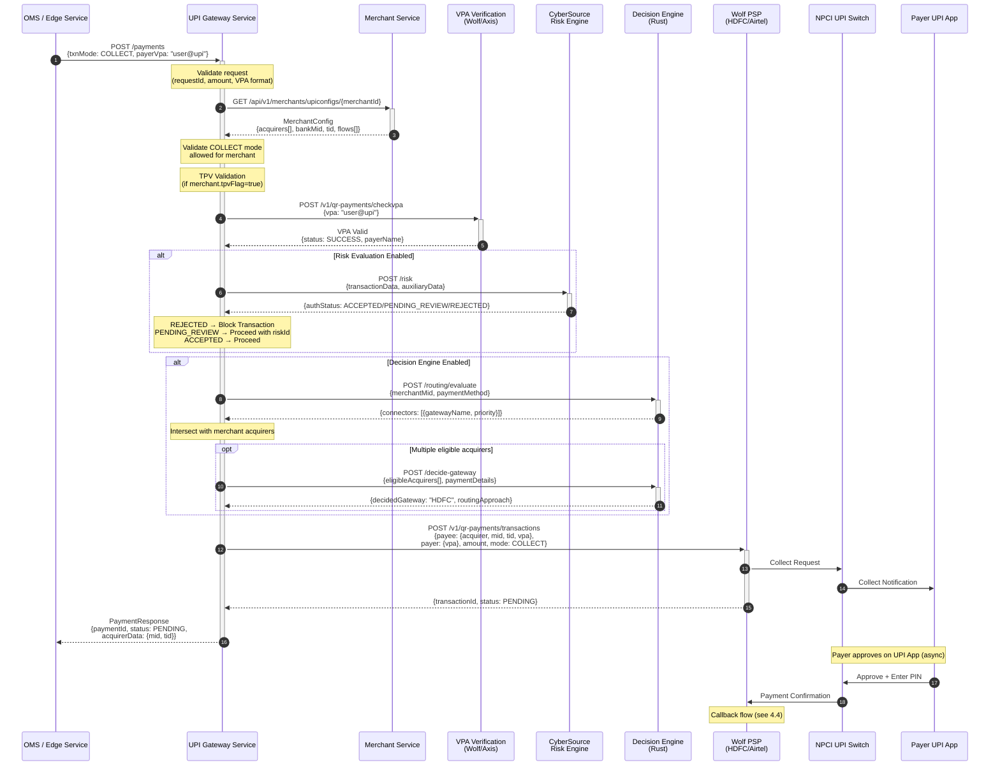
```mermaid
sequenceDiagram
    autonumber
    participant Client as OMS / Edge Service
    participant GW as UPI Gateway Service
    participant MS as Merchant Service
    participant VPA as VPA Verification<br/>(Wolf/Axis)
    participant RE as CyberSource<br/>Risk Engine
    participant DE as Decision Engine<br/>(Rust)
    participant Wolf as Wolf PSP<br/>(HDFC/Airtel)
    participant NPCI as NPCI UPI Switch
    participant Payer as Payer UPI App

    Client->>+GW: POST /payments<br/>{txnMode: COLLECT, payerVpa: "user@upi"}
    
    Note over GW: Validate request<br/>(requestId, amount, VPA format)
    
    GW->>+MS: GET /api/v1/merchants/upiconfigs/{merchantId}
    MS-->>-GW: MerchantConfig<br/>{acquirers[], bankMid, tid, flows[]}
    
    Note over GW: Validate COLLECT mode<br/>allowed for merchant
    
    Note over GW: TPV Validation<br/>(if merchant.tpvFlag=true)
    
    GW->>+VPA: POST /v1/qr-payments/checkvpa<br/>{vpa: "user@upi"}
    VPA-->>-GW: VPA Valid<br/>{status: SUCCESS, payerName}
    
    alt Risk Evaluation Enabled
        GW->>+RE: POST /risk<br/>{transactionData, auxiliaryData}
        RE-->>-GW: {authStatus: ACCEPTED/PENDING_REVIEW/REJECTED}
        Note over GW: REJECTED → Block Transaction<br/>PENDING_REVIEW → Proceed with riskId<br/>ACCEPTED → Proceed
    end
    
    alt Decision Engine Enabled
        GW->>+DE: POST /routing/evaluate<br/>{merchantMid, paymentMethod}
        DE-->>-GW: {connectors: [{gatewayName, priority}]}
        Note over GW: Intersect with merchant acquirers
        
        opt Multiple eligible acquirers
            GW->>+DE: POST /decide-gateway<br/>{eligibleAcquirers[], paymentDetails}
            DE-->>-GW: {decidedGateway: "HDFC", routingApproach}
        end
    end
    
    GW->>+Wolf: POST /v1/qr-payments/transactions<br/>{payee: {acquirer, mid, tid, vpa},<br/> payer: {vpa}, amount, mode: COLLECT}
    Wolf->>NPCI: Collect Request
    NPCI->>Payer: Collect Notification
    Wolf-->>-GW: {transactionId, status: PENDING}
    
    GW-->>-Client: PaymentResponse<br/>{paymentId, status: PENDING,<br/> acquirerData: {mid, tid}}
    
    Note over Payer,NPCI: Payer approves on UPI App (async)
    
    Payer->>NPCI: Approve + Enter PIN
    NPCI->>Wolf: Payment Confirmation
    
    Note over Wolf: Callback flow (see 4.4)
```

---

### 4.2 UPI Intent Payment Flow

The Intent flow generates a deep-link/QR code that the payer scans or clicks to initiate payment directly from their UPI app.

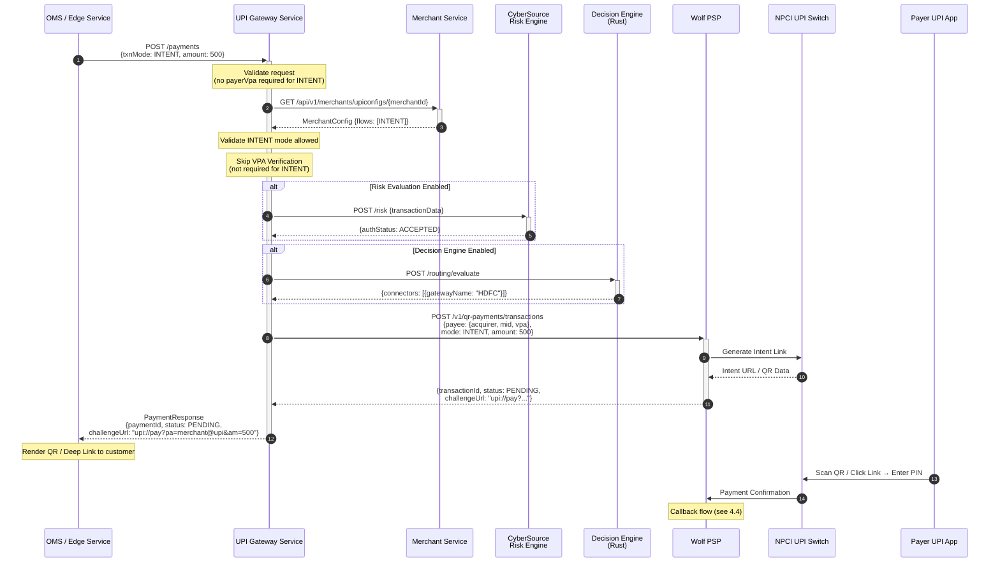
```mermaid
sequenceDiagram
    autonumber
    participant Client as OMS / Edge Service
    participant GW as UPI Gateway Service
    participant MS as Merchant Service
    participant RE as CyberSource<br/>Risk Engine
    participant DE as Decision Engine<br/>(Rust)
    participant Wolf as Wolf PSP
    participant NPCI as NPCI UPI Switch
    participant Payer as Payer UPI App

    Client->>+GW: POST /payments<br/>{txnMode: INTENT, amount: 500}
    
    Note over GW: Validate request<br/>(no payerVpa required for INTENT)
    
    GW->>+MS: GET /api/v1/merchants/upiconfigs/{merchantId}
    MS-->>-GW: MerchantConfig {flows: [INTENT]}
    
    Note over GW: Validate INTENT mode allowed
    
    Note over GW: Skip VPA Verification<br/>(not required for INTENT)
    
    alt Risk Evaluation Enabled
        GW->>+RE: POST /risk {transactionData}
        RE-->>-GW: {authStatus: ACCEPTED}
    end
    
    alt Decision Engine Enabled
        GW->>+DE: POST /routing/evaluate
        DE-->>-GW: {connectors: [{gatewayName: "HDFC"}]}
    end
    
    GW->>+Wolf: POST /v1/qr-payments/transactions<br/>{payee: {acquirer, mid, vpa},<br/> mode: INTENT, amount: 500}
    Wolf->>NPCI: Generate Intent Link
    NPCI-->>Wolf: Intent URL / QR Data
    Wolf-->>-GW: {transactionId, status: PENDING,<br/> challengeUrl: "upi://pay?..."}
    
    GW-->>-Client: PaymentResponse<br/>{paymentId, status: PENDING,<br/> challengeUrl: "upi://pay?pa=merchant@upi&am=500"}
    
    Note over Client: Render QR / Deep Link to customer
    
    Payer->>NPCI: Scan QR / Click Link → Enter PIN
    NPCI->>Wolf: Payment Confirmation
    
    Note over Wolf: Callback flow (see 4.4)
```

---

### 4.3 VPA Verification Flow

Multiple verification paths based on acquirer configuration.

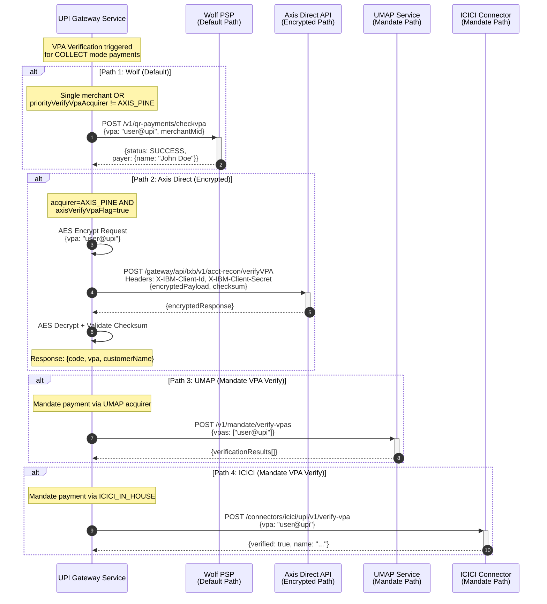
```mermaid
sequenceDiagram
    autonumber
    participant GW as UPI Gateway Service
    participant Wolf as Wolf PSP<br/>(Default Path)
    participant Axis as Axis Direct API<br/>(Encrypted Path)
    participant UMAP as UMAP Service<br/>(Mandate Path)
    participant ICICI as ICICI Connector<br/>(Mandate Path)

    Note over GW: VPA Verification triggered<br/>for COLLECT mode payments

    alt Path 1: Wolf (Default)
        Note over GW: Single merchant OR<br/>priorityVerifyVpaAcquirer != AXIS_PINE
        GW->>+Wolf: POST /v1/qr-payments/checkvpa<br/>{vpa: "user@upi", merchantMid}
        Wolf-->>-GW: {status: SUCCESS,<br/> payer: {name: "John Doe"}}
    end

    alt Path 2: Axis Direct (Encrypted)
        Note over GW: acquirer=AXIS_PINE AND<br/>axisVerifyVpaFlag=true
        GW->>GW: AES Encrypt Request<br/>{vpa: "user@upi"}
        GW->>+Axis: POST /gateway/api/txb/v1/acct-recon/verifyVPA<br/>Headers: X-IBM-Client-Id, X-IBM-Client-Secret<br/>{encryptedPayload, checksum}
        Axis-->>-GW: {encryptedResponse}
        GW->>GW: AES Decrypt + Validate Checksum
        Note over GW: Response: {code, vpa, customerName}
    end

    alt Path 3: UMAP (Mandate VPA Verify)
        Note over GW: Mandate payment via UMAP acquirer
        GW->>+UMAP: POST /v1/mandate/verify-vpas<br/>{vpas: ["user@upi"]}
        UMAP-->>-GW: {verificationResults[]}
    end

    alt Path 4: ICICI (Mandate VPA Verify)
        Note over GW: Mandate payment via ICICI_IN_HOUSE
        GW->>+ICICI: POST /connectors/icici/upi/v1/verify-vpa<br/>{vpa: "user@upi"}
        ICICI-->>-GW: {verified: true, name: "..."}
    end
```

---

### 4.4 Payment Callback Flow

Asynchronous callback processing when Wolf receives payment confirmation from NPCI.

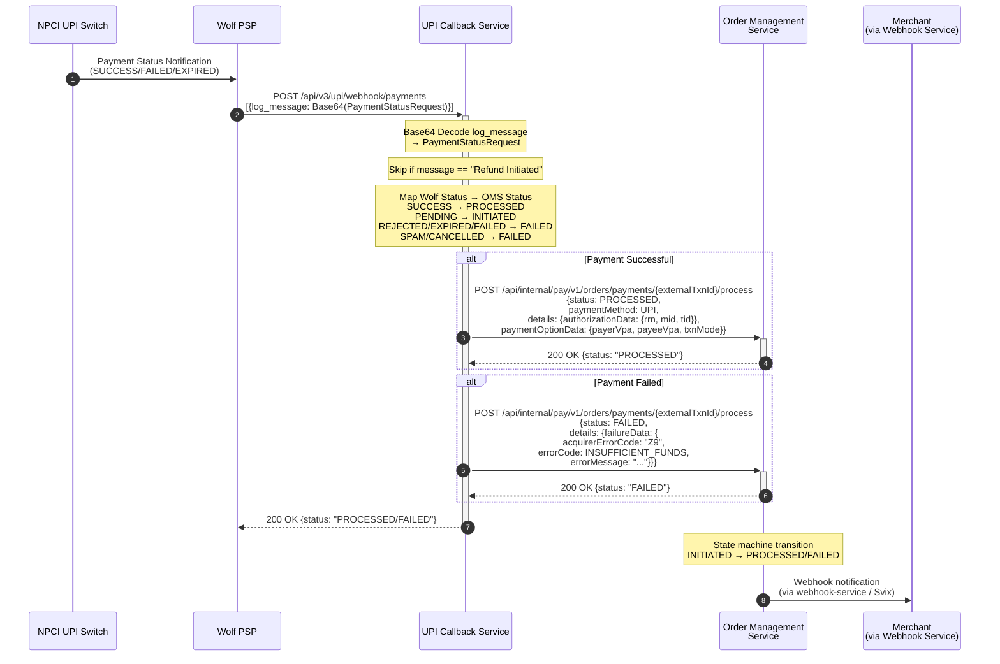
```mermaid
sequenceDiagram
    autonumber
    participant NPCI as NPCI UPI Switch
    participant Wolf as Wolf PSP
    participant CB as UPI Callback Service
    participant OMS as Order Management<br/>Service
    participant Merchant as Merchant<br/>(via Webhook Service)

    NPCI->>Wolf: Payment Status Notification<br/>(SUCCESS/FAILED/EXPIRED)
    
    Wolf->>+CB: POST /api/v3/upi/webhook/payments<br/>[{log_message: Base64(PaymentStatusRequest)}]
    
    Note over CB: Base64 Decode log_message<br/>→ PaymentStatusRequest
    
    Note over CB: Skip if message == "Refund Initiated"
    
    Note over CB: Map Wolf Status → OMS Status<br/>SUCCESS → PROCESSED<br/>PENDING → INITIATED<br/>REJECTED/EXPIRED/FAILED → FAILED<br/>SPAM/CANCELLED → FAILED

    alt Payment Successful
        CB->>+OMS: POST /api/internal/pay/v1/orders/payments/{externalTxnId}/process<br/>{status: PROCESSED,<br/> paymentMethod: UPI,<br/> details: {authorizationData: {rrn, mid, tid}},<br/> paymentOptionData: {payerVpa, payeeVpa, txnMode}}
        OMS-->>-CB: 200 OK {status: "PROCESSED"}
    end

    alt Payment Failed
        CB->>+OMS: POST /api/internal/pay/v1/orders/payments/{externalTxnId}/process<br/>{status: FAILED,<br/> details: {failureData: {<br/>   acquirerErrorCode: "Z9",<br/>   errorCode: INSUFFICIENT_FUNDS,<br/>   errorMessage: "..."}}}
        OMS-->>-CB: 200 OK {status: "FAILED"}
    end

    CB-->>-Wolf: 200 OK {status: "PROCESSED/FAILED"}

    Note over OMS: State machine transition<br/>INITIATED → PROCESSED/FAILED

    OMS->>Merchant: Webhook notification<br/>(via webhook-service / Svix)
```

---

### 4.5 Refund Flow

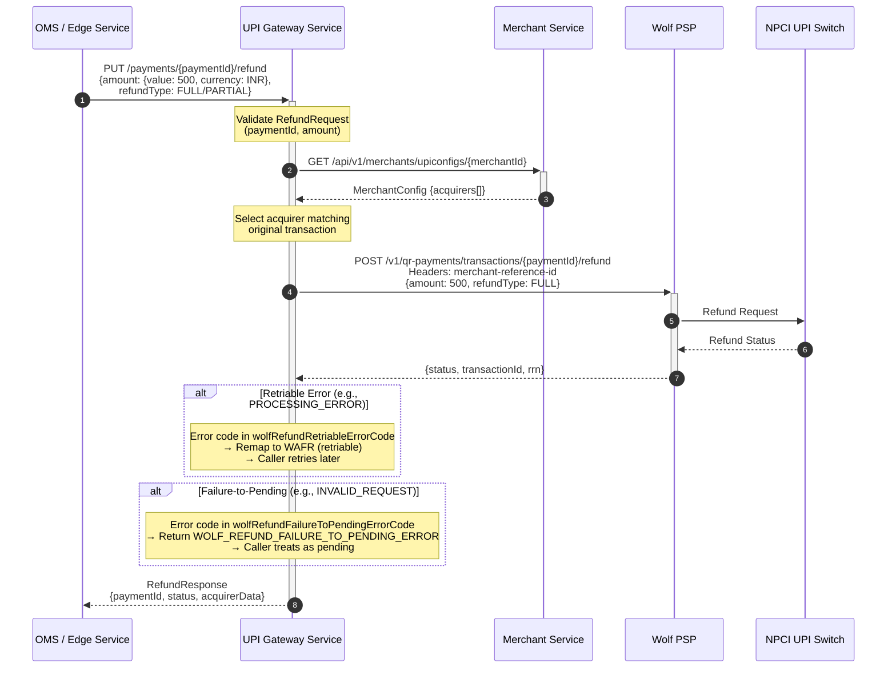
```mermaid
sequenceDiagram
    autonumber
    participant Client as OMS / Edge Service
    participant GW as UPI Gateway Service
    participant MS as Merchant Service
    participant Wolf as Wolf PSP
    participant NPCI as NPCI UPI Switch

    Client->>+GW: PUT /payments/{paymentId}/refund<br/>{amount: {value: 500, currency: INR},<br/> refundType: FULL/PARTIAL}
    
    Note over GW: Validate RefundRequest<br/>(paymentId, amount)
    
    GW->>+MS: GET /api/v1/merchants/upiconfigs/{merchantId}
    MS-->>-GW: MerchantConfig {acquirers[]}
    
    Note over GW: Select acquirer matching<br/>original transaction
    
    GW->>+Wolf: POST /v1/qr-payments/transactions/{paymentId}/refund<br/>Headers: merchant-reference-id<br/>{amount: 500, refundType: FULL}
    Wolf->>NPCI: Refund Request
    NPCI-->>Wolf: Refund Status
    Wolf-->>-GW: {status, transactionId, rrn}
    
    alt Retriable Error (e.g., PROCESSING_ERROR)
        Note over GW: Error code in wolfRefundRetriableErrorCode<br/>→ Remap to WAFR (retriable)<br/>→ Caller retries later
    end
    
    alt Failure-to-Pending (e.g., INVALID_REQUEST)
        Note over GW: Error code in wolfRefundFailureToPendingErrorCode<br/>→ Return WOLF_REFUND_FAILURE_TO_PENDING_ERROR<br/>→ Caller treats as pending
    end
    
    GW-->>-Client: RefundResponse<br/>{paymentId, status, acquirerData}
```

---

### 4.6 Cancel Payment Flow

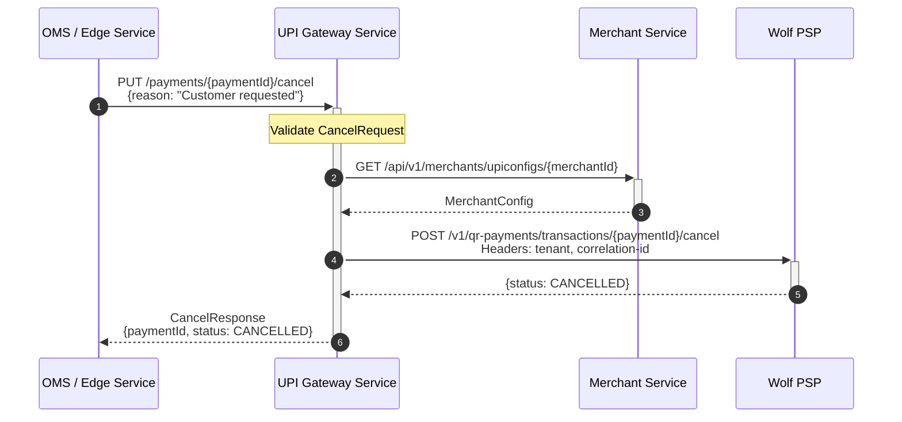
```mermaid
sequenceDiagram
    autonumber
    participant Client as OMS / Edge Service
    participant GW as UPI Gateway Service
    participant MS as Merchant Service
    participant Wolf as Wolf PSP

    Client->>+GW: PUT /payments/{paymentId}/cancel<br/>{reason: "Customer requested"}
    
    Note over GW: Validate CancelRequest
    
    GW->>+MS: GET /api/v1/merchants/upiconfigs/{merchantId}
    MS-->>-GW: MerchantConfig
    
    GW->>+Wolf: POST /v1/qr-payments/transactions/{paymentId}/cancel<br/>Headers: tenant, correlation-id
    Wolf-->>-GW: {status: CANCELLED}
    
    GW-->>-Client: CancelResponse<br/>{paymentId, status: CANCELLED}
```

---

### 4.7 Payment Status Inquiry Flow

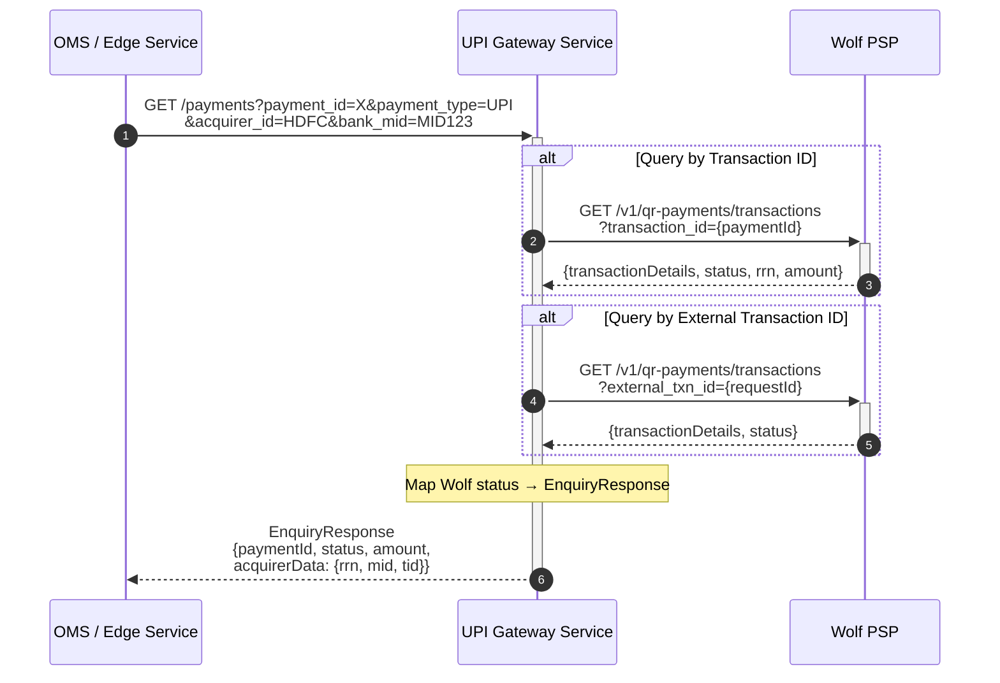
```mermaid
sequenceDiagram
    autonumber
    participant Client as OMS / Edge Service
    participant GW as UPI Gateway Service
    participant Wolf as Wolf PSP

    Client->>+GW: GET /payments?payment_id=X&payment_type=UPI<br/>&acquirer_id=HDFC&bank_mid=MID123

    alt Query by Transaction ID
        GW->>+Wolf: GET /v1/qr-payments/transactions<br/>?transaction_id={paymentId}
        Wolf-->>-GW: {transactionDetails, status, rrn, amount}
    end

    alt Query by External Transaction ID
        GW->>+Wolf: GET /v1/qr-payments/transactions<br/>?external_txn_id={requestId}
        Wolf-->>-GW: {transactionDetails, status}
    end

    Note over GW: Map Wolf status → EnquiryResponse

    GW-->>-Client: EnquiryResponse<br/>{paymentId, status, amount,<br/> acquirerData: {rrn, mid, tid}}
```

---

## 5. Mandate/Subscription Workflows

### Mandate Architecture

```
                         ┌────────────────────────────┐
                         │    UPI Gateway Service      │
                         │  ┌──────────────────────┐  │
                         │  │ MandatePaymentProcessor│  │
                         │  └──────────┬───────────┘  │
                         │             │              │
                         │  ┌──────────┴───────────┐  │
                         │  │ MandateProcessorFactory│  │
                         │  └──────────┬───────────┘  │
                         └─────────────┼──────────────┘
                                       │
                      ┌────────────────┼────────────────┐
                      │                                 │
                      ▼                                 ▼
            ┌──────────────────┐              ┌──────────────────┐
            │ UmapMandateAdapter│              │IciciMandateAdapter│
            │ (All acquirers   │              │ (ICICI_IN_HOUSE   │
            │  except ICICI)   │              │  only)            │
            └────────┬─────────┘              └────────┬─────────┘
                     │                                 │
                     ▼                                 ▼
            ┌──────────────────┐              ┌──────────────────┐
            │  UMAP Service    │              │  ICICI Connector  │
            │  (Setu/NPCI)     │              │  Service          │
            └──────────────────┘              └──────────────────┘
```

---

### 5.1 Create Mandate Flow

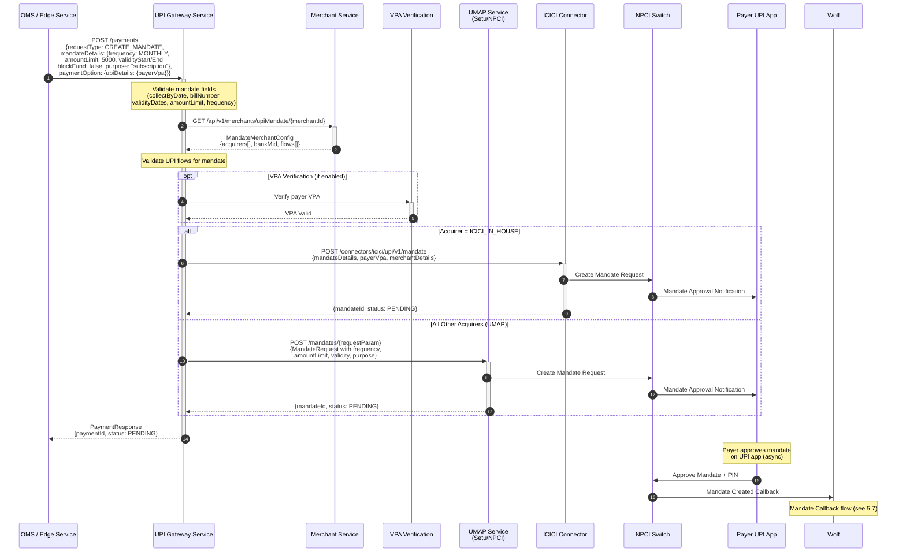
```mermaid
sequenceDiagram
    autonumber
    participant Client as OMS / Edge Service
    participant GW as UPI Gateway Service
    participant MS as Merchant Service
    participant VPA as VPA Verification
    participant UMAP as UMAP Service<br/>(Setu/NPCI)
    participant ICICI as ICICI Connector
    participant NPCI as NPCI Switch
    participant Payer as Payer UPI App

    Client->>+GW: POST /payments<br/>{requestType: CREATE_MANDATE,<br/> mandateDetails: {frequency: MONTHLY,<br/>   amountLimit: 5000, validityStart/End,<br/>   blockFund: false, purpose: "subscription"},<br/> paymentOption: {upiDetails: {payerVpa}}}
    
    Note over GW: Validate mandate fields<br/>(collectByDate, billNumber,<br/>validityDates, amountLimit, frequency)
    
    GW->>+MS: GET /api/v1/merchants/upiMandate/{merchantId}
    MS-->>-GW: MandateMerchantConfig<br/>{acquirers[], bankMid, flows[]}
    
    Note over GW: Validate UPI flows for mandate
    
    opt VPA Verification (if enabled)
        GW->>+VPA: Verify payer VPA
        VPA-->>-GW: VPA Valid
    end
    
    alt Acquirer = ICICI_IN_HOUSE
        GW->>+ICICI: POST /connectors/icici/upi/v1/mandate<br/>{mandateDetails, payerVpa, merchantDetails}
        ICICI->>NPCI: Create Mandate Request
        NPCI->>Payer: Mandate Approval Notification
        ICICI-->>-GW: {mandateId, status: PENDING}
    else All Other Acquirers (UMAP)
        GW->>+UMAP: POST /mandates/{requestParam}<br/>{MandateRequest with frequency,<br/> amountLimit, validity, purpose}
        UMAP->>NPCI: Create Mandate Request
        NPCI->>Payer: Mandate Approval Notification
        UMAP-->>-GW: {mandateId, status: PENDING}
    end
    
    GW-->>-Client: PaymentResponse<br/>{paymentId, status: PENDING}
    
    Note over Payer: Payer approves mandate<br/>on UPI app (async)
    
    Payer->>NPCI: Approve Mandate + PIN
    NPCI->>Wolf: Mandate Created Callback
    
    Note over Wolf: Mandate Callback flow (see 5.7)
```

---

### 5.2 Execute Mandate Flow

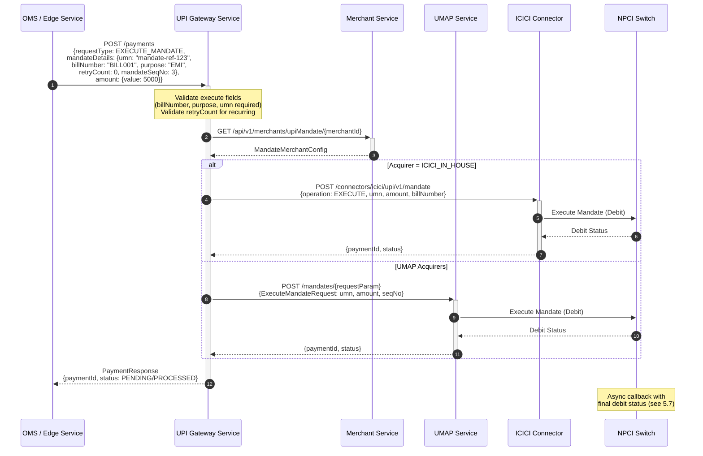
```mermaid
sequenceDiagram
    autonumber
    participant Client as OMS / Edge Service
    participant GW as UPI Gateway Service
    participant MS as Merchant Service
    participant UMAP as UMAP Service
    participant ICICI as ICICI Connector
    participant NPCI as NPCI Switch

    Client->>+GW: POST /payments<br/>{requestType: EXECUTE_MANDATE,<br/> mandateDetails: {umn: "mandate-ref-123",<br/>   billNumber: "BILL001", purpose: "EMI",<br/>   retryCount: 0, mandateSeqNo: 3},<br/> amount: {value: 5000}}
    
    Note over GW: Validate execute fields<br/>(billNumber, purpose, umn required)<br/>Validate retryCount for recurring
    
    GW->>+MS: GET /api/v1/merchants/upiMandate/{merchantId}
    MS-->>-GW: MandateMerchantConfig
    
    alt Acquirer = ICICI_IN_HOUSE
        GW->>+ICICI: POST /connectors/icici/upi/v1/mandate<br/>{operation: EXECUTE, umn, amount, billNumber}
        ICICI->>NPCI: Execute Mandate (Debit)
        NPCI-->>ICICI: Debit Status
        ICICI-->>-GW: {paymentId, status}
    else UMAP Acquirers
        GW->>+UMAP: POST /mandates/{requestParam}<br/>{ExecuteMandateRequest: umn, amount, seqNo}
        UMAP->>NPCI: Execute Mandate (Debit)
        NPCI-->>UMAP: Debit Status
        UMAP-->>-GW: {paymentId, status}
    end
    
    GW-->>-Client: PaymentResponse<br/>{paymentId, status: PENDING/PROCESSED}
    
    Note over NPCI: Async callback with<br/>final debit status (see 5.7)
```

---

### 5.3 Notify Mandate (Pre-Debit) Flow

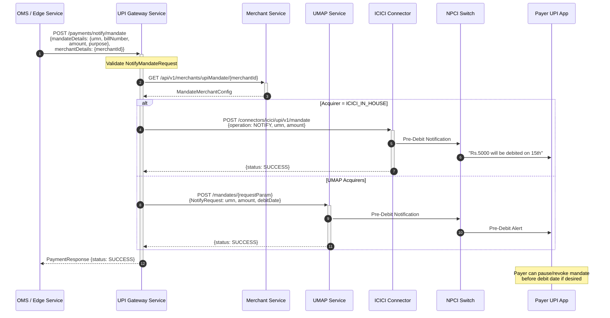
```mermaid
sequenceDiagram
    autonumber
    participant Client as OMS / Edge Service
    participant GW as UPI Gateway Service
    participant MS as Merchant Service
    participant UMAP as UMAP Service
    participant ICICI as ICICI Connector
    participant NPCI as NPCI Switch
    participant Payer as Payer UPI App

    Client->>+GW: POST /payments/notify/mandate<br/>{mandateDetails: {umn, billNumber,<br/>   amount, purpose},<br/> merchantDetails: {merchantId}}
    
    Note over GW: Validate NotifyMandateRequest
    
    GW->>+MS: GET /api/v1/merchants/upiMandate/{merchantId}
    MS-->>-GW: MandateMerchantConfig
    
    alt Acquirer = ICICI_IN_HOUSE
        GW->>+ICICI: POST /connectors/icici/upi/v1/mandate<br/>{operation: NOTIFY, umn, amount}
        ICICI->>NPCI: Pre-Debit Notification
        NPCI->>Payer: "Rs.5000 will be debited on 15th"
        ICICI-->>-GW: {status: SUCCESS}
    else UMAP Acquirers
        GW->>+UMAP: POST /mandates/{requestParam}<br/>{NotifyRequest: umn, amount, debitDate}
        UMAP->>NPCI: Pre-Debit Notification
        NPCI->>Payer: Pre-Debit Alert
        UMAP-->>-GW: {status: SUCCESS}
    end
    
    GW-->>-Client: PaymentResponse {status: SUCCESS}
    
    Note over Payer: Payer can pause/revoke mandate<br/>before debit date if desired
```

---

### 5.4 Update Mandate Flow

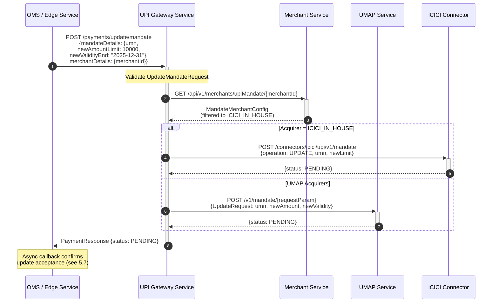
```mermaid
sequenceDiagram
    autonumber
    participant Client as OMS / Edge Service
    participant GW as UPI Gateway Service
    participant MS as Merchant Service
    participant UMAP as UMAP Service
    participant ICICI as ICICI Connector

    Client->>+GW: POST /payments/update/mandate<br/>{mandateDetails: {umn,<br/>   newAmountLimit: 10000,<br/>   newValidityEnd: "2025-12-31"},<br/> merchantDetails: {merchantId}}
    
    Note over GW: Validate UpdateMandateRequest
    
    GW->>+MS: GET /api/v1/merchants/upiMandate/{merchantId}
    MS-->>-GW: MandateMerchantConfig<br/>(filtered to ICICI_IN_HOUSE)
    
    alt Acquirer = ICICI_IN_HOUSE
        GW->>+ICICI: POST /connectors/icici/upi/v1/mandate<br/>{operation: UPDATE, umn, newLimit}
        ICICI-->>-GW: {status: PENDING}
    else UMAP Acquirers
        GW->>+UMAP: POST /v1/mandate/{requestParam}<br/>{UpdateRequest: umn, newAmount, newValidity}
        UMAP-->>-GW: {status: PENDING}
    end
    
    GW-->>-Client: PaymentResponse {status: PENDING}
    
    Note over Client: Async callback confirms<br/>update acceptance (see 5.7)
```

---

### 5.5 Revoke Mandate Flow

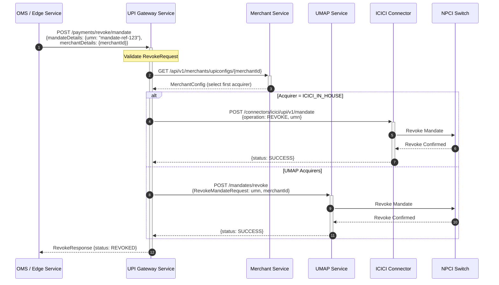
```mermaid
sequenceDiagram
    autonumber
    participant Client as OMS / Edge Service
    participant GW as UPI Gateway Service
    participant MS as Merchant Service
    participant UMAP as UMAP Service
    participant ICICI as ICICI Connector
    participant NPCI as NPCI Switch

    Client->>+GW: POST /payments/revoke/mandate<br/>{mandateDetails: {umn: "mandate-ref-123"},<br/> merchantDetails: {merchantId}}
    
    Note over GW: Validate RevokeRequest
    
    GW->>+MS: GET /api/v1/merchants/upiconfigs/{merchantId}
    MS-->>-GW: MerchantConfig (select first acquirer)
    
    alt Acquirer = ICICI_IN_HOUSE
        GW->>+ICICI: POST /connectors/icici/upi/v1/mandate<br/>{operation: REVOKE, umn}
        ICICI->>NPCI: Revoke Mandate
        NPCI-->>ICICI: Revoke Confirmed
        ICICI-->>-GW: {status: SUCCESS}
    else UMAP Acquirers
        GW->>+UMAP: POST /mandates/revoke<br/>{RevokeMandateRequest: umn, merchantId}
        UMAP->>NPCI: Revoke Mandate
        NPCI-->>UMAP: Revoke Confirmed
        UMAP-->>-GW: {status: SUCCESS}
    end
    
    GW-->>-Client: RevokeResponse {status: REVOKED}
```

---

### 5.6 Refund Mandate Flow

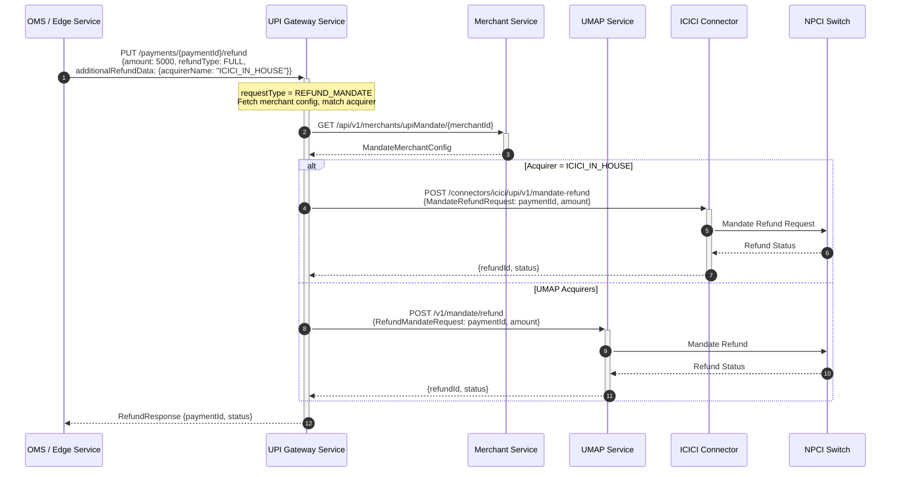
```mermaid
sequenceDiagram
    autonumber
    participant Client as OMS / Edge Service
    participant GW as UPI Gateway Service
    participant MS as Merchant Service
    participant UMAP as UMAP Service
    participant ICICI as ICICI Connector
    participant NPCI as NPCI Switch

    Client->>+GW: PUT /payments/{paymentId}/refund<br/>{amount: 5000, refundType: FULL,<br/> additionalRefundData: {acquirerName: "ICICI_IN_HOUSE"}}
    
    Note over GW: requestType = REFUND_MANDATE<br/>Fetch merchant config, match acquirer
    
    GW->>+MS: GET /api/v1/merchants/upiMandate/{merchantId}
    MS-->>-GW: MandateMerchantConfig
    
    alt Acquirer = ICICI_IN_HOUSE
        GW->>+ICICI: POST /connectors/icici/upi/v1/mandate-refund<br/>{MandateRefundRequest: paymentId, amount}
        ICICI->>NPCI: Mandate Refund Request
        NPCI-->>ICICI: Refund Status
        ICICI-->>-GW: {refundId, status}
    else UMAP Acquirers
        GW->>+UMAP: POST /v1/mandate/refund<br/>{RefundMandateRequest: paymentId, amount}
        UMAP->>NPCI: Mandate Refund
        NPCI-->>UMAP: Refund Status
        UMAP-->>-GW: {refundId, status}
    end
    
    GW-->>-Client: RefundResponse {paymentId, status}
```

---

### 5.7 Mandate Callback Flow

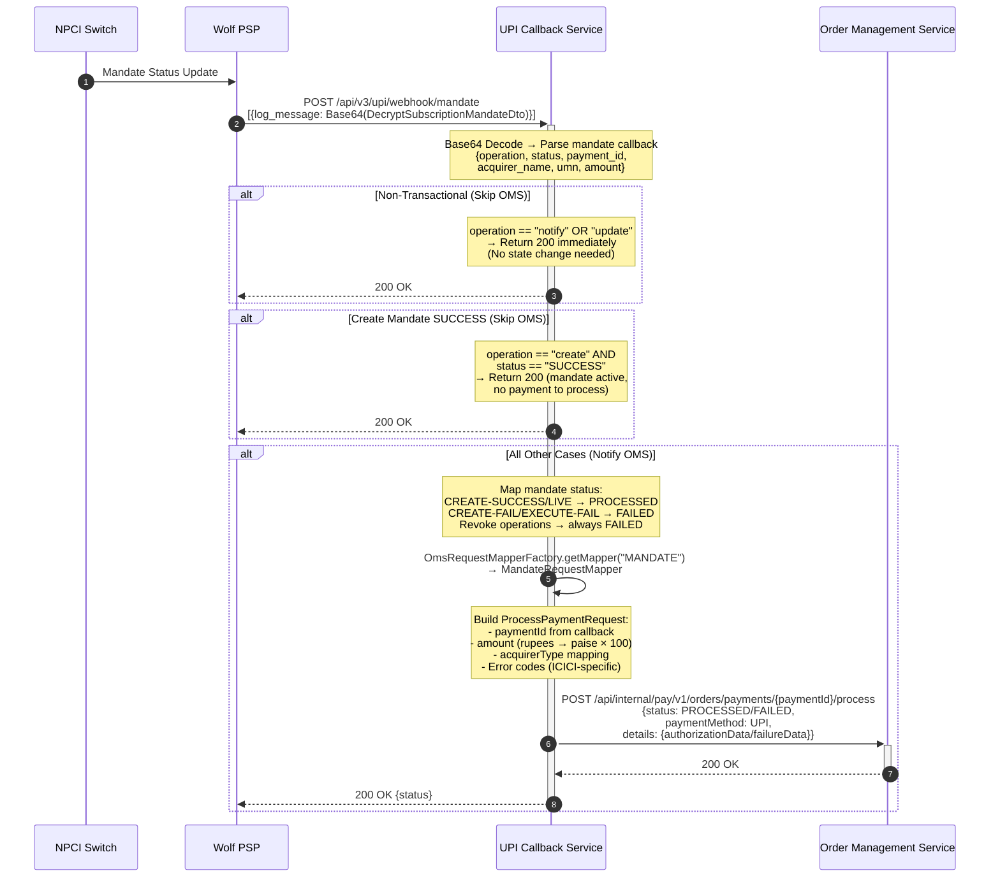
```mermaid
sequenceDiagram
    autonumber
    participant NPCI as NPCI Switch
    participant Wolf as Wolf PSP
    participant CB as UPI Callback Service
    participant OMS as Order Management Service

    NPCI->>Wolf: Mandate Status Update
    
    Wolf->>+CB: POST /api/v3/upi/webhook/mandate<br/>[{log_message: Base64(DecryptSubscriptionMandateDto)}]
    
    Note over CB: Base64 Decode → Parse mandate callback<br/>{operation, status, payment_id,<br/> acquirer_name, umn, amount}

    alt Non-Transactional (Skip OMS)
        Note over CB: operation == "notify" OR "update"<br/>→ Return 200 immediately<br/>(No state change needed)
        CB-->>Wolf: 200 OK
    end

    alt Create Mandate SUCCESS (Skip OMS)
        Note over CB: operation == "create" AND<br/>status == "SUCCESS"<br/>→ Return 200 (mandate active,<br/>no payment to process)
        CB-->>Wolf: 200 OK
    end

    alt All Other Cases (Notify OMS)
        Note over CB: Map mandate status:<br/>CREATE-SUCCESS/LIVE → PROCESSED<br/>CREATE-FAIL/EXECUTE-FAIL → FAILED<br/>Revoke operations → always FAILED
        
        CB->>CB: OmsRequestMapperFactory.getMapper("MANDATE")<br/>→ MandateRequestMapper
        
        Note over CB: Build ProcessPaymentRequest:<br/>- paymentId from callback<br/>- amount (rupees → paise × 100)<br/>- acquirerType mapping<br/>- Error codes (ICICI-specific)
        
        CB->>+OMS: POST /api/internal/pay/v1/orders/payments/{paymentId}/process<br/>{status: PROCESSED/FAILED,<br/> paymentMethod: UPI,<br/> details: {authorizationData/failureData}}
        OMS-->>-CB: 200 OK
        
        CB-->>-Wolf: 200 OK {status}
    end
```

---

### 5.8 Mandate Inquiry Flow

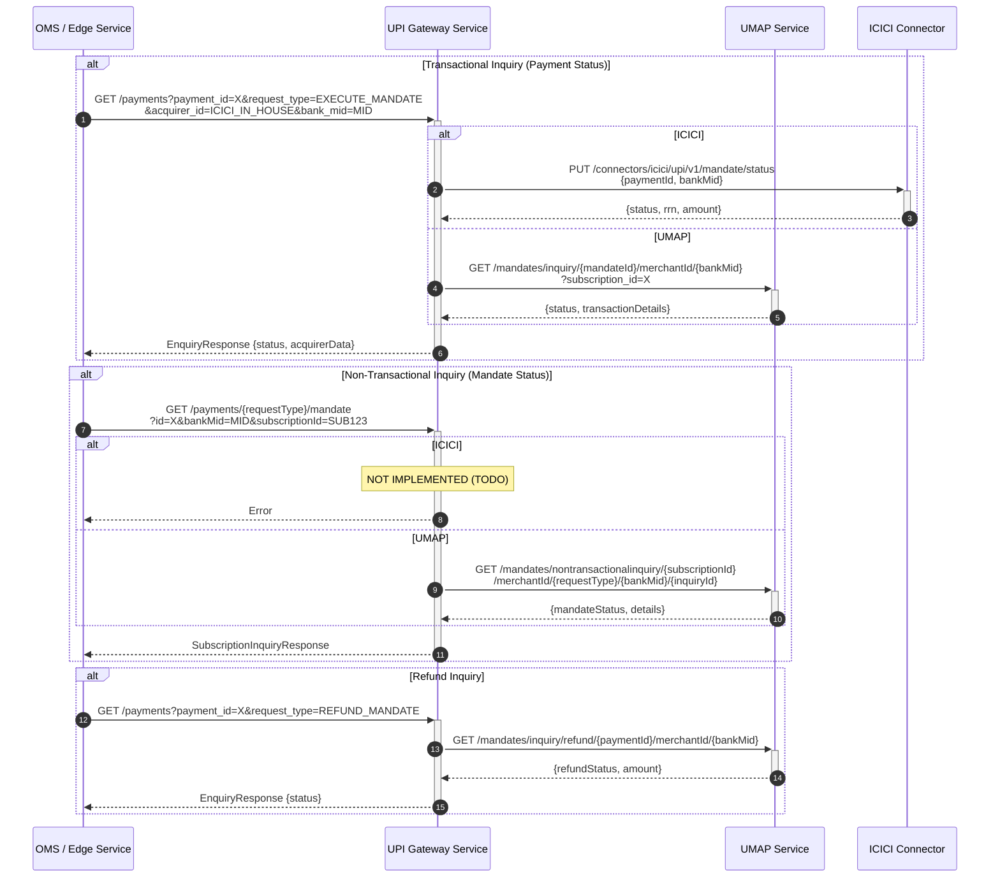
```mermaid
sequenceDiagram
    autonumber
    participant Client as OMS / Edge Service
    participant GW as UPI Gateway Service
    participant UMAP as UMAP Service
    participant ICICI as ICICI Connector

    alt Transactional Inquiry (Payment Status)
        Client->>+GW: GET /payments?payment_id=X&request_type=EXECUTE_MANDATE<br/>&acquirer_id=ICICI_IN_HOUSE&bank_mid=MID
        
        alt ICICI
            GW->>+ICICI: PUT /connectors/icici/upi/v1/mandate/status<br/>{paymentId, bankMid}
            ICICI-->>-GW: {status, rrn, amount}
        else UMAP
            GW->>+UMAP: GET /mandates/inquiry/{mandateId}/merchantId/{bankMid}<br/>?subscription_id=X
            UMAP-->>-GW: {status, transactionDetails}
        end
        
        GW-->>-Client: EnquiryResponse {status, acquirerData}
    end

    alt Non-Transactional Inquiry (Mandate Status)
        Client->>+GW: GET /payments/{requestType}/mandate<br/>?id=X&bankMid=MID&subscriptionId=SUB123
        
        alt ICICI
            Note over GW: NOT IMPLEMENTED (TODO)
            GW-->>Client: Error
        else UMAP
            GW->>+UMAP: GET /mandates/nontransactionalinquiry/{subscriptionId}<br/>/merchantId/{requestType}/{bankMid}/{inquiryId}
            UMAP-->>-GW: {mandateStatus, details}
        end
        
        GW-->>-Client: SubscriptionInquiryResponse
    end

    alt Refund Inquiry
        Client->>+GW: GET /payments?payment_id=X&request_type=REFUND_MANDATE
        
        GW->>+UMAP: GET /mandates/inquiry/refund/{paymentId}/merchantId/{bankMid}
        UMAP-->>-GW: {refundStatus, amount}
        
        GW-->>-Client: EnquiryResponse {status}
    end
```

---

## 6. Technical Workflows

### 6.1 Decision Engine Routing Flow

The Decision Engine (Rust/Axum service) provides intelligent acquirer routing using volume-split and priority-based algorithms.

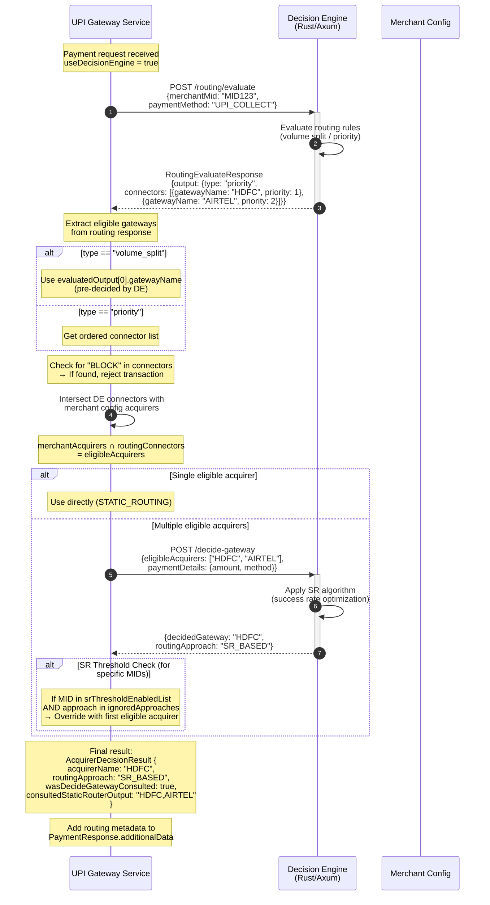
```mermaid
sequenceDiagram
    autonumber
    participant GW as UPI Gateway Service
    participant DE as Decision Engine<br/>(Rust/Axum)
    participant Config as Merchant Config

    Note over GW: Payment request received<br/>useDecisionEngine = true

    GW->>+DE: POST /routing/evaluate<br/>{merchantMid: "MID123",<br/> paymentMethod: "UPI_COLLECT"}
    
    DE->>DE: Evaluate routing rules<br/>(volume split / priority)
    
    DE-->>-GW: RoutingEvaluateResponse<br/>{output: {type: "priority",<br/>  connectors: [{gatewayName: "HDFC", priority: 1},<br/>               {gatewayName: "AIRTEL", priority: 2}]}}

    Note over GW: Extract eligible gateways<br/>from routing response

    alt type == "volume_split"
        Note over GW: Use evaluatedOutput[0].gatewayName<br/>(pre-decided by DE)
    else type == "priority"
        Note over GW: Get ordered connector list
    end

    Note over GW: Check for "BLOCK" in connectors<br/>→ If found, reject transaction

    GW->>GW: Intersect DE connectors with<br/>merchant config acquirers
    
    Note over GW: merchantAcquirers ∩ routingConnectors<br/>= eligibleAcquirers

    alt Single eligible acquirer
        Note over GW: Use directly (STATIC_ROUTING)
    else Multiple eligible acquirers
        GW->>+DE: POST /decide-gateway<br/>{eligibleAcquirers: ["HDFC", "AIRTEL"],<br/> paymentDetails: {amount, method}}
        DE->>DE: Apply SR algorithm<br/>(success rate optimization)
        DE-->>-GW: {decidedGateway: "HDFC",<br/> routingApproach: "SR_BASED"}
        
        alt SR Threshold Check (for specific MIDs)
            Note over GW: If MID in srThresholdEnabledList<br/>AND approach in ignoredApproaches<br/>→ Override with first eligible acquirer
        end
    end

    Note over GW: Final result:<br/>AcquirerDecisionResult {<br/>  acquirerName: "HDFC",<br/>  routingApproach: "SR_BASED",<br/>  wasDecideGatewayConsulted: true,<br/>  consultedStaticRouterOutput: "HDFC,AIRTEL"<br/>}
    
    Note over GW: Add routing metadata to<br/>PaymentResponse.additionalData
```

---

### 6.2 Risk Evaluation Flow

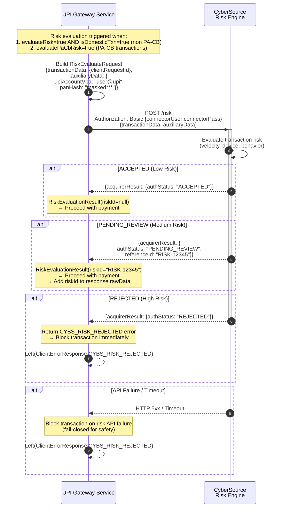
```mermaid
sequenceDiagram
    autonumber
    participant GW as UPI Gateway Service
    participant Cybs as CyberSource<br/>Risk Engine

    Note over GW: Risk evaluation triggered when:<br/>1. evaluateRisk=true AND isDomesticTxn=true (non PA-CB)<br/>2. evaluatePaCbRisk=true (PA-CB transactions)

    GW->>GW: Build RiskEvaluateRequest<br/>{transactionData: {clientRequestId},<br/> auxiliaryData: {<br/>   upiAccountVpa: "user@upi",<br/>   panHash: "masked***"}}

    GW->>+Cybs: POST /risk<br/>Authorization: Basic {connectorUser:connectorPass}<br/>{transactionData, auxiliaryData}

    Cybs->>Cybs: Evaluate transaction risk<br/>(velocity, device, behavior)

    alt ACCEPTED (Low Risk)
        Cybs-->>GW: {acquirerResult: {authStatus: "ACCEPTED"}}
        Note over GW: RiskEvaluationResult(riskId=null)<br/>→ Proceed with payment
    end

    alt PENDING_REVIEW (Medium Risk)
        Cybs-->>GW: {acquirerResult: {<br/>  authStatus: "PENDING_REVIEW",<br/>  referenceId: "RISK-12345"}}
        Note over GW: RiskEvaluationResult(riskId="RISK-12345")<br/>→ Proceed with payment<br/>→ Add riskId to response rawData
    end

    alt REJECTED (High Risk)
        Cybs-->>-GW: {acquirerResult: {authStatus: "REJECTED"}}
        Note over GW: Return CYBS_RISK_REJECTED error<br/>→ Block transaction immediately
        GW-->>GW: Left(ClientErrorResponse.CYBS_RISK_REJECTED)
    end

    alt API Failure / Timeout
        Cybs-->>GW: HTTP 5xx / Timeout
        Note over GW: Block transaction on risk API failure<br/>(fail-closed for safety)
        GW-->>GW: Left(ClientErrorResponse.CYBS_RISK_REJECTED)
    end
```

---

### 6.3 Circuit Breaker & Resilience Flow

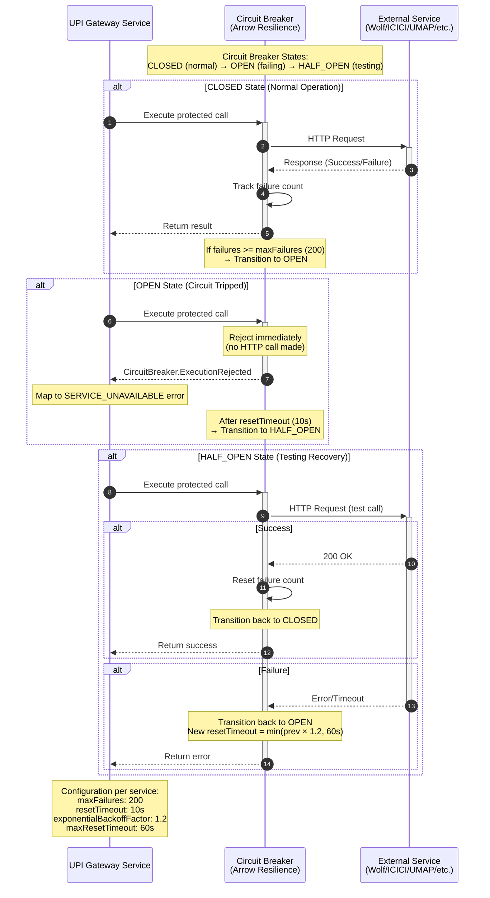
```mermaid
sequenceDiagram
    autonumber
    participant GW as UPI Gateway Service
    participant CB as Circuit Breaker<br/>(Arrow Resilience)
    participant Ext as External Service<br/>(Wolf/ICICI/UMAP/etc.)

    Note over CB: Circuit Breaker States:<br/>CLOSED (normal) → OPEN (failing) → HALF_OPEN (testing)

    alt CLOSED State (Normal Operation)
        GW->>+CB: Execute protected call
        CB->>+Ext: HTTP Request
        Ext-->>-CB: Response (Success/Failure)
        CB->>CB: Track failure count
        CB-->>-GW: Return result
        
        Note over CB: If failures >= maxFailures (200)<br/>→ Transition to OPEN
    end

    alt OPEN State (Circuit Tripped)
        GW->>+CB: Execute protected call
        Note over CB: Reject immediately<br/>(no HTTP call made)
        CB-->>-GW: CircuitBreaker.ExecutionRejected
        Note over GW: Map to SERVICE_UNAVAILABLE error
        
        Note over CB: After resetTimeout (10s)<br/>→ Transition to HALF_OPEN
    end

    alt HALF_OPEN State (Testing Recovery)
        GW->>+CB: Execute protected call
        CB->>+Ext: HTTP Request (test call)
        
        alt Success
            Ext-->>CB: 200 OK
            CB->>CB: Reset failure count
            Note over CB: Transition back to CLOSED
            CB-->>GW: Return success
        end
        
        alt Failure
            Ext-->>-CB: Error/Timeout
            Note over CB: Transition back to OPEN<br/>New resetTimeout = min(prev × 1.2, 60s)
            CB-->>-GW: Return error
        end
    end

    Note over GW: Configuration per service:<br/>maxFailures: 200<br/>resetTimeout: 10s<br/>exponentialBackoffFactor: 1.2<br/>maxResetTimeout: 60s
```

---

### 6.4 Error Handling Flow

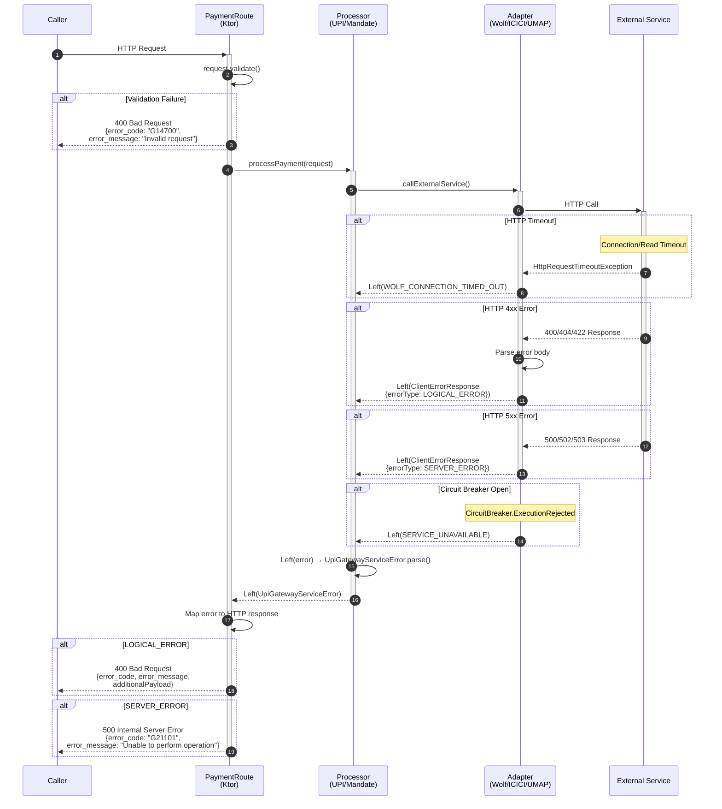
```mermaid
sequenceDiagram
    autonumber
    participant Client as Caller
    participant Route as PaymentRoute<br/>(Ktor)
    participant Proc as Processor<br/>(UPI/Mandate)
    participant Adapter as Adapter<br/>(Wolf/ICICI/UMAP)
    participant Ext as External Service

    Client->>+Route: HTTP Request

    Route->>Route: request.validate()
    
    alt Validation Failure
        Route-->>Client: 400 Bad Request<br/>{error_code: "G14700",<br/> error_message: "Invalid request"}
    end

    Route->>+Proc: processPayment(request)
    Proc->>+Adapter: callExternalService()
    Adapter->>+Ext: HTTP Call
    
    alt HTTP Timeout
        Note over Ext: Connection/Read Timeout
        Ext-->>Adapter: HttpRequestTimeoutException
        Adapter-->>Proc: Left(WOLF_CONNECTION_TIMED_OUT)
    end
    
    alt HTTP 4xx Error
        Ext-->>Adapter: 400/404/422 Response
        Adapter->>Adapter: Parse error body
        Adapter-->>Proc: Left(ClientErrorResponse<br/>{errorType: LOGICAL_ERROR})
    end
    
    alt HTTP 5xx Error
        Ext-->>-Adapter: 500/502/503 Response
        Adapter-->>-Proc: Left(ClientErrorResponse<br/>{errorType: SERVER_ERROR})
    end
    
    alt Circuit Breaker Open
        Note over Adapter: CircuitBreaker.ExecutionRejected
        Adapter-->>Proc: Left(SERVICE_UNAVAILABLE)
    end

    Proc->>Proc: Left(error) → UpiGatewayServiceError.parse()
    Proc-->>-Route: Left(UpiGatewayServiceError)

    Route->>Route: Map error to HTTP response

    alt LOGICAL_ERROR
        Route-->>Client: 400 Bad Request<br/>{error_code, error_message,<br/> additionalPayload}
    end
    
    alt SERVER_ERROR
        Route-->>-Client: 500 Internal Server Error<br/>{error_code: "G21101",<br/> error_message: "Unable to perform operation"}
    end
```

---

## 7. Data Models

### Payment Request/Response

```
┌─────────────────────────────────────────────────────────────────┐
│                        PaymentRequest                            │
├─────────────────────────────────────────────────────────────────┤
│ request_id: String (unique idempotency key)                     │
│ subscription_id: String? (mandate reference)                    │
│ request_type: RequestType? (CREATE/EXECUTE/NOTIFY/UPDATE/etc.)  │
│ amount: Amount {value: Long (paise), currency_code: String}     │
│ order_details: OrderDetails                                     │
│ payment_option: PaymentOption                                   │
│   └── upiDetails: UpiDetails                                   │
│         ├── txnMode: COLLECT | INTENT                           │
│         └── payerVpa: String                                    │
│ merchant_details: MerchantDetails {merchantId}                  │
│ mandate_details: MandateDetails?                                │
│   ├── collectByDate, billNumber                                 │
│   ├── validityStartDate, validityEndDate                        │
│   ├── amountLimit, frequency, blockFund                         │
│   ├── purpose, umn, retryCount, mandateSeqNo                   │
│   └── (all required for mandate operations)                     │
│ customer_account_details: CustomerAccountDetails? (TPV)         │
│ is_domestic_txn_for_risk: Boolean?                              │
│ device_info: DeviceInfo?                                        │
│ customer_metadata: Map<String, String>?                         │
│ cross_border_details: PaymentCrossBorderDetails?                │
└─────────────────────────────────────────────────────────────────┘

┌─────────────────────────────────────────────────────────────────┐
│                        PaymentResponse                           │
├─────────────────────────────────────────────────────────────────┤
│ payment_id: String (Wolf transaction ID)                        │
│ status: PaymentStatus (PENDING/PROCESSED/FAILED/CANCELLED)      │
│ challenge_url: String? (Intent deep link / QR URL)              │
│ acquirer_data: AuthorizationData                                │
│   ├── mid: String (Bank MID)                                    │
│   ├── tid: String (Terminal ID)                                 │
│   └── rawData: Map (RRN, routing info, riskId)                  │
│ image_url: String? (QR image URL)                               │
│ additional_data: Map<String, String>?                            │
│   ├── consulted_static_router_output                            │
│   ├── consulted_gateway_router                                  │
│   └── routing_approach                                          │
└─────────────────────────────────────────────────────────────────┘
```

### Callback Models

```
┌─────────────────────────────────────────────────────────────────┐
│                    PaymentStatusRequest (Wolf Callback)           │
├─────────────────────────────────────────────────────────────────┤
│ transaction_id: String                                          │
│ external_transaction_id: String (maps to OMS payment)           │
│ status: SUCCESS | PENDING | REJECTED | INITIATED | EXPIRED |    │
│         FAILED | SPAM | CANCELLED                               │
│ message: String                                                 │
│ amount: {value: Long, currency_code: "INR"}                     │
│ payment_method: {mode: DYNAMICQR | COLLECT}                     │
│ payee: {vpa, acquirer_name, reference_type, reference_id}       │
│ payer: {vpa, phone_number, account_type, name}                  │
│ response_code: String (NPCI response code for error mapping)    │
│ rrn: String (Retrieval Reference Number)                        │
│ host_transaction_id: String                                     │
│ host_merchant_id: String                                        │
│ confee_amount: Long                                             │
└─────────────────────────────────────────────────────────────────┘

┌─────────────────────────────────────────────────────────────────┐
│              DecryptSubscriptionMandateDto (Mandate Callback)     │
├─────────────────────────────────────────────────────────────────┤
│ payment_id: String                                              │
│ transaction_id: String                                          │
│ internal_payment_id: String                                     │
│ operation: "create" | "execute" | "revoke" | "notify" | "update"│
│ status: "CREATE-SUCCESS" | "CREATE-FAIL" | "EXECUTE-FAIL" |    │
│         "SUCCESS" | "LIVE" | "FAILED"                           │
│ acquirer_name: "ICICI_IN_HOUSE" | "PINE_AXIS"                  │
│ amount: String (in rupees, converted to paise)                  │
│ payer_vpa, payee_vpa: String                                    │
│ payer_name, payer_mobile: String                                │
│ bank_rrn: String                                                │
│ umn: String (Unique Mandate Number)                             │
│ response_code: String                                           │
│ npci_error_code, npci_error_description, npci_error_category    │
└─────────────────────────────────────────────────────────────────┘
```

### Status Mapping Tables

| Wolf Payment Status | OMS Status | HTTP to Merchant |
|---------------------|-----------|-----------------|
| SUCCESS | PROCESSED | Payment confirmed |
| PENDING | INITIATED | Awaiting payer action |
| REJECTED | FAILED | Payer rejected |
| INITIATED | INITIATED | Transaction in progress |
| EXPIRED | FAILED | Collect request expired |
| FAILED | FAILED | Transaction failed |
| SPAM | FAILED | Marked as spam |
| CANCELLED | FAILED | Transaction cancelled |

| Mandate Status | OMS Status |
|----------------|-----------|
| CREATE-SUCCESS | PROCESSED |
| LIVE | PROCESSED |
| SUCCESS | PROCESSED |
| UPDATE-SUCCESS | PROCESSED |
| REVOKE-SUCCESS | PROCESSED |
| CREATE-FAIL | FAILED |
| EXECUTE-FAIL | FAILED |
| FAILED | FAILED |
| Revoke (any status) | FAILED |

---

## 8. Integration Points

### External Service Integration Map

```
┌──────────────────────────────────────────────────────────────────────────┐
│                         EXTERNAL INTEGRATIONS                             │
├──────────────────────────────────────────────────────────────────────────┤
│                                                                          │
│  ┌─────────────────┐     ┌─────────────────┐     ┌─────────────────┐   │
│  │   Wolf PSP      │     │   NPCI UMAP     │     │   ICICI Direct  │   │
│  │   (HDFC/Airtel/ │     │   (Mandate      │     │   (In-house     │   │
│  │    IDFC)        │     │    Platform)    │     │    connector)   │   │
│  │                 │     │                 │     │                 │   │
│  │ • Collect       │     │ • Create Mandate│     │ • Create Mandate│   │
│  │ • Intent        │     │ • Execute       │     │ • Execute       │   │
│  │ • Refund        │     │ • Notify        │     │ • Notify        │   │
│  │ • Cancel        │     │ • Update        │     │ • Update        │   │
│  │ • Status        │     │ • Revoke        │     │ • Revoke        │   │
│  │ • VPA Verify    │     │ • Refund        │     │ • Refund        │   │
│  │ • Callbacks     │     │ • VPA Verify    │     │ • VPA Verify    │   │
│  └─────────────────┘     └─────────────────┘     └─────────────────┘   │
│                                                                          │
│  ┌─────────────────┐     ┌─────────────────┐     ┌─────────────────┐   │
│  │   Axis Bank     │     │   CyberSource   │     │   Setu (Kotak)  │   │
│  │   (VPA Direct)  │     │   (Risk Engine) │     │   (Legacy)      │   │
│  │                 │     │                 │     │                 │   │
│  │ • VPA Verify    │     │ • Risk Evaluate │     │ • VPA Verify    │   │
│  │   (AES encrypt) │     │   (Accept/      │     │ • Payment       │   │
│  │ • Fetch VPA     │     │    Review/      │     │ • OAuth Token   │   │
│  │                 │     │    Reject)      │     │   (Redis cache) │   │
│  └─────────────────┘     └─────────────────┘     └─────────────────┘   │
│                                                                          │
└──────────────────────────────────────────────────────────────────────────┘
```

### Internal Service Dependencies

| Service | Protocol | Purpose | Endpoint |
|---------|----------|---------|----------|
| **Merchant Service** | HTTP REST | Merchant config, acquirer mapping, TPV flags | `GET /api/v1/merchants/upiconfigs/{id}` |
| **Decision Engine** | HTTP REST | Intelligent acquirer routing | `POST /routing/evaluate`, `POST /decide-gateway` |
| **CyberSource (Cybs)** | HTTP REST (Basic Auth) | Transaction risk scoring | `POST /risk` |
| **OMS** | HTTP REST | Order/payment state management | `POST /api/internal/pay/v1/orders/payments/{id}/process` |
| **Wolf PSP** | HTTP REST | UPI payment processing | Multiple endpoints under `/v1/qr-payments/` |
| **UMAP Connector** | HTTP REST | Mandate operations via Setu | `POST /mandates/*`, `GET /mandates/*` |
| **ICICI Connector** | HTTP REST | ICICI in-house mandate/payment | `POST /connectors/icici/upi/v1/*` |
| **Axis Service** | HTTP REST (AES Encrypted) | Direct VPA verification | `POST /gateway/api/txb/v1/acct-recon/verifyVPA` |

### Acquirer Routing Matrix

| Acquirer | Payment Modes | Mandate Support | VPA Verify | Connector |
|----------|--------------|----------------|-----------|-----------|
| **HDFC (Wolf)** | Collect, Intent, DynamicQR | No | Yes (via Wolf) | WolfAdapter |
| **Airtel (Wolf)** | Collect, Intent | No | Yes (via Wolf) | WolfAdapter |
| **IDFC (Wolf)** | Collect, Intent | No | Yes (via Wolf) | WolfAdapter |
| **ICICI_IN_HOUSE** | - | Full mandate support | Yes (direct) | IciciMandateAdapter |
| **AXIS_PINE (UMAP)** | - | Full mandate support | Yes (UMAP) | UmapMandateAdapter |
| **Axis Direct** | - | - | Yes (AES encrypted) | FetchVpaProcessor |
| **Setu/Kotak** | Collect, Intent | - | Yes | UPISetuSystemService (legacy) |

---

## 9. Configuration & Environment

### Service Configuration (`application.yaml`)

```yaml
# Core Settings
tenant: "pluralv3"                    # Wolf service tenant identifier
port: 8080                            # Service port

# Feature Flags
verifyVpa: true                       # Enable VPA verification for mandates
useDecisionEngine: true               # Enable intelligent acquirer routing
evaluateRisk: true                    # Enable CyberSource risk evaluation
evaluatePaCbRisk: false               # Enable risk for PA-CB transactions
useWolfSslClient: false               # Force SSL for Wolf communication
useSimulator: false                   # Enable WireMock (non-prod only)
axisVerifyVpaFlag: false              # Use Axis direct VPA API
isDefaultSmartRoutingEnabled: true    # Default smart routing behavior
priorityVerifyVpaAcquirer: "AXIS_PINE" # Default VPA verify acquirer

# Circuit Breaker (per service)
circuitBreaker:
  resetTimeout: 10000                 # ms before testing recovery
  maxFailures: 200                    # failures before opening
  exponentialBackoffFactor: 1.2       # backoff multiplier
  maxResetTimeout: 60000              # max recovery timeout (ms)

# Refund Retry Configuration
wolfRefundRetriableErrorCode: ["PROCESSING_ERROR"]
wolfRefundFailureToPendingErrorCode: ["INVALID_REQUEST"]

# SR Threshold (Decision Engine override)
decisionEngineMidsSrThresholdEnabled: ["MID1", "MID2"]
```

### Environment-Specific Service URLs

| Service | Dev/QA | Production |
|---------|--------|-----------|
| Wolf | `https://wiremock-dev.v2.pinepg.in` (simulator) | `https://wolf-service.internal` |
| Merchant | `http://merchant-service:8080` | `http://merchant-service:8080` |
| Decision Engine | `https://decision-engine-service-qa.v2.pinepg.in` | `https://decision-engine-service.internal` |
| CyberSource | `http://cybs-connector:8080` | `http://cybs-connector:8080` |
| UMAP | `http://umap-connector-service:8080` | `http://umap-connector-service:8080` |
| ICICI | `http://icici-upi-connector:7070` | `http://icici-upi-connector:7070` |
| OMS | `http://oms-service:8080` | `http://oms-service:8080` |

### Kubernetes Deployment

```yaml
# Health Probes
livenessProbe: GET /health/live (port 8081)
readinessProbe: GET /health/ready (port 8081)

# Resource Recommendations
resources:
  requests: { cpu: 500m, memory: 512Mi }
  limits: { cpu: 2000m, memory: 1Gi }

# Thread Pool
wolfDispatcher: 200 threads (dedicated for Wolf calls)
```

---

## 10. Observability & Monitoring

### Tracing

```
┌─────────────────────────────────────────────────────────────┐
│                  Distributed Tracing (OpenTelemetry)          │
├─────────────────────────────────────────────────────────────┤
│                                                             │
│  correlation-id header propagated across all service calls  │
│                                                             │
│  OMS → upi-gateway-service → Wolf/ICICI/UMAP               │
│   │         │                      │                        │
│   │         ├── merchant-service   │                        │
│   │         ├── decision-engine    │                        │
│   │         └── cybs-risk          │                        │
│   │                                │                        │
│   │    upi-callback-service ◄──────┘                        │
│   │         │                                               │
│   └─────────┘ (OMS update)                                  │
│                                                             │
│  Exporter: OTLP → Last9 (otlp-aps1.last9.io:443)          │
│  Agent: opentelemetry-javaagent v2.8.0                      │
│                                                             │
└─────────────────────────────────────────────────────────────┘
```

### Metrics

| Metric | Type | Labels | Purpose |
|--------|------|--------|---------|
| `upi_payment_requests_total` | Counter | acquirer, txnMode, status | Payment volume |
| `upi_payment_duration_ms` | Histogram | acquirer, operation | Latency tracking |
| `upi_vpa_verification_total` | Counter | provider, status | VPA verify success rate |
| `upi_decision_engine_calls` | Counter | routingApproach, acquirer | Routing distribution |
| `upi_risk_evaluation_total` | Counter | decision (accept/review/reject) | Risk decisions |
| `upi_callback_processed_total` | Counter | acquirer, status | Callback processing |
| `upi_circuit_breaker_state` | Gauge | service, state | Circuit breaker health |

### Structured Logging

```json
{
  "timestamp": "2024-01-15T10:30:45.123Z",
  "level": "INFO",
  "correlationId": "req-abc-123",
  "service": "upi-gateway-service",
  "operation": "processPayment",
  "merchantId": "MID123",
  "acquirer": "HDFC",
  "txnMode": "COLLECT",
  "duration_ms": 245,
  "status": "SUCCESS"
}
```

**Sensitive Data Masking** (via JsonMasker):
- `emailId`, `firstName`, `lastName` → masked
- `mobileNumber`, `phoneNumber` → masked
- `vpa` → masked in logs (visible in traces)
- `accountNumber` → masked
- `panHash` → masked

### Alerting Rules

| Alert | Condition | Severity |
|-------|-----------|----------|
| High Error Rate | Error rate > 5% for 5 minutes | P1 - Critical |
| Circuit Breaker Open | Any service circuit open > 30s | P2 - High |
| Latency Spike | p99 > 5s for 3 minutes | P2 - High |
| Callback Processing Delay | Callback queue lag > 100 | P2 - High |
| Wolf Timeout Rate | Timeout rate > 10% for 2 min | P1 - Critical |
| Risk Engine Down | Risk API failures > 50% | P1 - Critical |

---

## End-to-End Payment Lifecycle (Complete Flow)

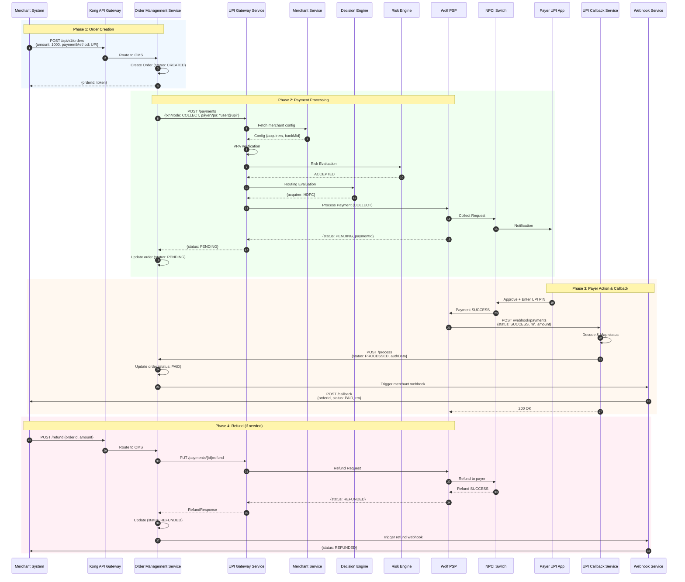
```mermaid
sequenceDiagram
    autonumber
    participant Merchant as Merchant System
    participant Kong as Kong API Gateway
    participant OMS as Order Management Service
    participant GW as UPI Gateway Service
    participant MS as Merchant Service
    participant DE as Decision Engine
    participant RE as Risk Engine
    participant Wolf as Wolf PSP
    participant NPCI as NPCI Switch
    participant Payer as Payer UPI App
    participant CB as UPI Callback Service
    participant WH as Webhook Service

    rect rgb(240, 248, 255)
        Note over Merchant,OMS: Phase 1: Order Creation
        Merchant->>Kong: POST /api/v1/orders<br/>{amount: 1000, paymentMethod: UPI}
        Kong->>OMS: Route to OMS
        OMS->>OMS: Create Order (status: CREATED)
        OMS-->>Merchant: {orderId, token}
    end

    rect rgb(240, 255, 240)
        Note over OMS,Wolf: Phase 2: Payment Processing
        OMS->>GW: POST /payments<br/>{txnMode: COLLECT, payerVpa: "user@upi"}
        GW->>MS: Fetch merchant config
        MS-->>GW: Config {acquirers, bankMid}
        GW->>GW: VPA Verification
        GW->>RE: Risk Evaluation
        RE-->>GW: ACCEPTED
        GW->>DE: Routing Evaluation
        DE-->>GW: {acquirer: HDFC}
        GW->>Wolf: Process Payment (COLLECT)
        Wolf->>NPCI: Collect Request
        NPCI->>Payer: Notification
        Wolf-->>GW: {status: PENDING, paymentId}
        GW-->>OMS: {status: PENDING}
        OMS->>OMS: Update order (status: PENDING)
    end

    rect rgb(255, 248, 240)
        Note over Payer,WH: Phase 3: Payer Action & Callback
        Payer->>NPCI: Approve + Enter UPI PIN
        NPCI->>Wolf: Payment SUCCESS
        Wolf->>CB: POST /webhook/payments<br/>{status: SUCCESS, rrn, amount}
        CB->>CB: Decode & Map status
        CB->>OMS: POST /process<br/>{status: PROCESSED, authData}
        OMS->>OMS: Update order (status: PAID)
        OMS->>WH: Trigger merchant webhook
        WH->>Merchant: POST /callback<br/>{orderId, status: PAID, rrn}
        CB-->>Wolf: 200 OK
    end

    rect rgb(255, 240, 245)
        Note over Merchant,Wolf: Phase 4: Refund (if needed)
        Merchant->>Kong: POST /refund {orderId, amount}
        Kong->>OMS: Route to OMS
        OMS->>GW: PUT /payments/{id}/refund
        GW->>Wolf: Refund Request
        Wolf->>NPCI: Refund to payer
        NPCI-->>Wolf: Refund SUCCESS
        Wolf-->>GW: {status: REFUNDED}
        GW-->>OMS: RefundResponse
        OMS->>OMS: Update (status: REFUNDED)
        OMS->>WH: Trigger refund webhook
        WH->>Merchant: {status: REFUNDED}
    end
```

---

## NPCI Response Code Reference

| Code | Description | Category |
|------|-------------|----------|
| 00 | Success | Success |
| Z9 | Insufficient funds | Payer Error |
| ZM | Invalid/Incorrect PIN | Payer Error |
| 91 | Issuer bank unavailable | Bank Error |
| UT | Request timeout | Timeout |
| UP | PSP unavailable | PSP Error |
| ZA | Transaction cancelled by user | User Action |
| 17 | Customer cancelled | User Action |
| 51 | Insufficient credit | Payer Error |
| 65 | Exceeds per-transaction limit | Limit |
| 75 | Exceeds daily transaction limit | Limit |
| U69 | Collect request expired | Expiry |
| AM | Account blocked/frozen | Account Error |
| B1 | Registered mobile number changed | Account Error |

---

## Glossary

| Term | Definition |
|------|-----------|
| **VPA** | Virtual Payment Address (e.g., user@upi) |
| **PSP** | Payment Service Provider |
| **NPCI** | National Payments Corporation of India |
| **Wolf** | Plural's UPI PSP gateway (integrates HDFC, Airtel, IDFC) |
| **UMAP** | Unified Mandate Architecture Platform (NPCI mandate infrastructure) |
| **OMS** | Order Management Service |
| **RRN** | Retrieval Reference Number |
| **UMN** | Unique Mandate Number |
| **TPV** | Third Party Validation (validates payer account) |
| **MID** | Merchant Identifier |
| **TID** | Terminal Identifier |
| **SR** | Success Rate (routing optimization metric) |
| **PA-CB** | Payment Aggregator - Cross Border |
| **DynamicQR** | Merchant-generated QR for specific amount |
| **Collect** | Pull payment - merchant sends collect request to payer |
| **Intent** | Push payment - payer initiates via deep link/QR scan |

---

*Document Version: 1.0*  
*Last Updated: 2025-05-29*  
*Service Versions: upi-gateway-service (NXT), upi-callback-service (NXT)*  
*Authors: Platform Engineering Team*
