# Refund & Reconciliation — Complete Flow Documentation

> Covers: **nxt-refund-management-service (RMS)**, **order-recon**, **nxt_payment_order_service (OMS)**
>
> Includes: Refund initiation, reconciliation, retry on acquirer decline, force close, termination, and state sync.

---

## Table of Contents

### Part 1 — Refund & Reconciliation Flows
1. [Flow 1: Merchant Initiates Refund](#flow-1-merchant-initiates-refund)
2. [Flow 2: Refund Reconciliation via Order-Recon Sync](#flow-2-refund-reconciliation-via-order-recon-sync)
3. [Flow 3: SQS Pipeline — Inquiry Recon with Exponential Backoff](#flow-3-sqs-pipeline--inquiry-recon-with-exponential-backoff)
4. [Flow 4: Force Close Refund](#flow-4-force-close-refund)
5. [Flow 5: Terminate Refund Orders (Long Pending)](#flow-5-terminate-refund-orders-long-pending)
6. [Flow 6: Sync Refunds (RMS DB → OHS State Sync)](#flow-6-sync-refunds-rms-db--ohs-state-sync)

### Part 2 — Refund Retry on Acquirer Decline
7. [Overview — Acquirer Decline Retry Mechanism](#overview--acquirer-decline-retry-mechanism)
8. [Configuration](#configuration)
9. [Flow Summary — Retry Steps](#flow-summary--retry-steps)
10. [Sequence Diagram — Refund Retry Full Flow](#sequence-diagram--refund-retry-full-flow)
11. [Sequence Diagram — Retry During Reconciliation](#sequence-diagram--retry-during-reconciliation)
12. [State Diagram — Refund Order Lifecycle](#state-diagram--refund-order-lifecycle)
13. [Reconciliation Inquiry Path](#reconciliation-inquiry-path)
14. [Error Scenarios](#error-scenarios)

### Part 3 — Architecture & System Views
15. [Architecture Diagram](#architecture-diagram)
16. [Component Diagram — RMS Internal Structure](#component-diagram--rms-internal-structure)
17. [Component Diagram — Refund Retry System](#component-diagram--refund-retry-system)
18. [Use Case Diagram](#use-case-diagram)

### Part 4 — Reference
19. [Key Design Patterns](#key-design-patterns)
20. [Inter-Service API Reference](#inter-service-api-reference)
21. [Code Reference](#code-reference)

---

# Part 1 — Refund & Reconciliation Flows

---

## Flow 1: Merchant Initiates Refund

The merchant calls the refund API. RMS validates, creates the refund entity, and delegates processing to OMS which interacts with the payment connector.

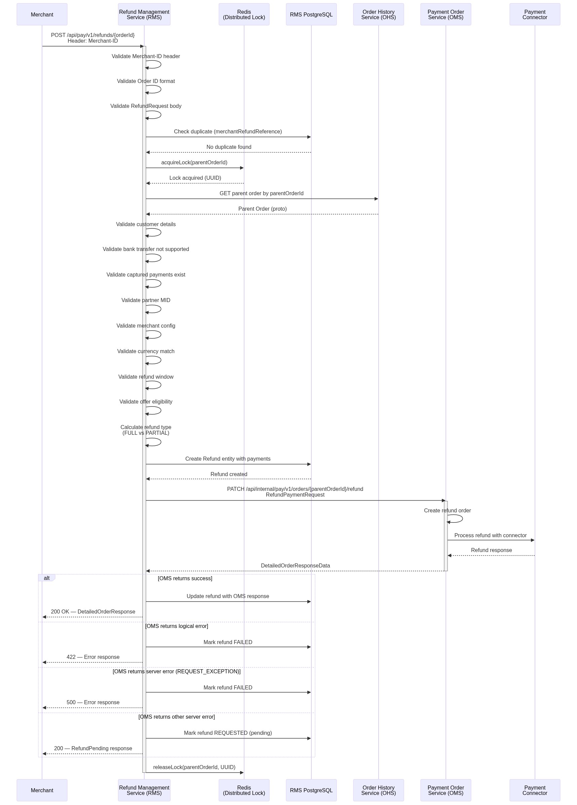

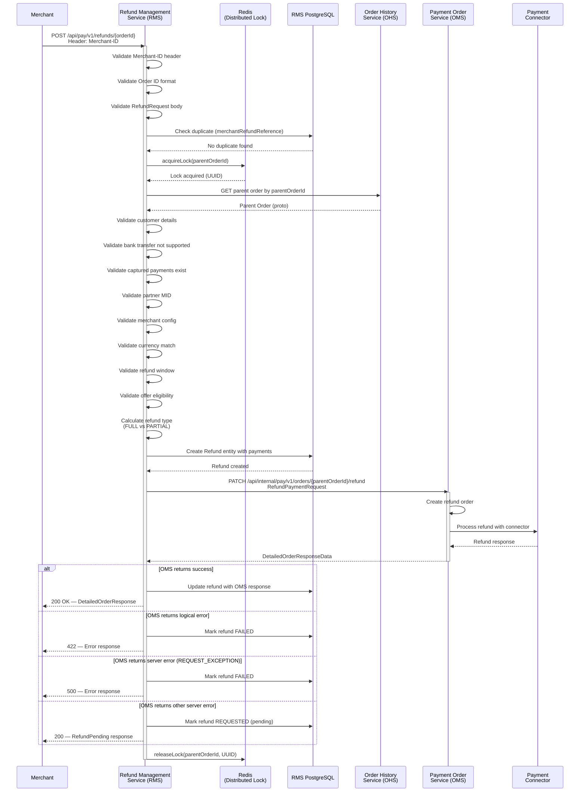
```mermaid
sequenceDiagram
    participant M as Merchant
    participant RMS as Refund Management<br/>Service (RMS)
    participant Redis as Redis<br/>(Distributed Lock)
    participant DB as RMS PostgreSQL
    participant OHS as Order History<br/>Service (OHS)
    participant OMS as Payment Order<br/>Service (OMS)
    participant Conn as Payment<br/>Connector

    M->>RMS: POST /api/pay/v1/refunds/{orderId}<br/>Header: Merchant-ID
    activate RMS

    RMS->>RMS: Validate Merchant-ID header
    RMS->>RMS: Validate Order ID format
    RMS->>RMS: Validate RefundRequest body
    RMS->>DB: Check duplicate (merchantRefundReference)
    DB-->>RMS: No duplicate found

    RMS->>Redis: acquireLock(parentOrderId)
    Redis-->>RMS: Lock acquired (UUID)

    RMS->>OHS: GET parent order by parentOrderId
    OHS-->>RMS: Parent Order (proto)

    RMS->>RMS: Validate customer details
    RMS->>RMS: Validate bank transfer not supported
    RMS->>RMS: Validate captured payments exist
    RMS->>RMS: Validate partner MID
    RMS->>RMS: Validate merchant config
    RMS->>RMS: Validate currency match
    RMS->>RMS: Validate refund window
    RMS->>RMS: Validate offer eligibility
    RMS->>RMS: Calculate refund type<br/>(FULL vs PARTIAL)

    RMS->>DB: Create Refund entity with payments
    DB-->>RMS: Refund created

    RMS->>OMS: PATCH /api/internal/pay/v1/orders/{parentOrderId}/refund<br/>RefundPaymentRequest
    activate OMS
    OMS->>OMS: Create refund order
    OMS->>Conn: Process refund with connector
    Conn-->>OMS: Refund response
    OMS-->>RMS: DetailedOrderResponseData
    deactivate OMS

    alt OMS returns success
        RMS->>DB: Update refund with OMS response
        RMS-->>M: 200 OK — DetailedOrderResponse
    else OMS returns logical error
        RMS->>DB: Mark refund FAILED
        RMS-->>M: 422 — Error response
    else OMS returns server error (REQUEST_EXCEPTION)
        RMS->>DB: Mark refund FAILED
        RMS-->>M: 500 — Error response
    else OMS returns other server error
        RMS->>DB: Mark refund REQUESTED (pending)
        RMS-->>M: 200 — RefundPending response
    end

    RMS->>Redis: releaseLock(parentOrderId, UUID)
    deactivate RMS
```

---

## Flow 2: Refund Reconciliation via Order-Recon Sync

A scheduled sync job triggers `order-recon` to fetch pending refund orders from OHS, classify them, and publish to Kafka topics. Downstream consumers (OMS/RMS) process the reconciliation.

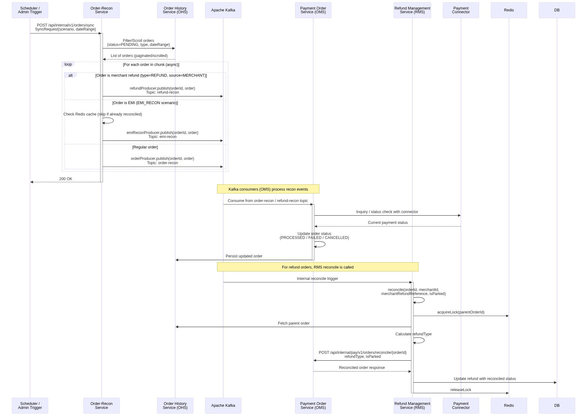

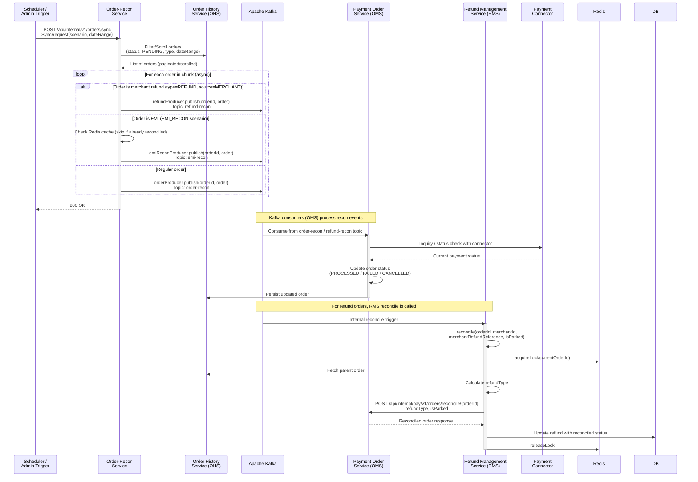
```mermaid
sequenceDiagram
    participant Sched as Scheduler /<br/>Admin Trigger
    participant OR as Order-Recon<br/>Service
    participant OHS as Order History<br/>Service (OHS)
    participant Kafka as Apache Kafka
    participant OMS as Payment Order<br/>Service (OMS)
    participant RMS as Refund Management<br/>Service (RMS)
    participant Conn as Payment<br/>Connector

    Sched->>OR: POST /api/internal/v1/orders/sync<br/>SyncRequest{scenario, dateRange}
    activate OR

    OR->>OHS: Filter/Scroll orders<br/>(status=PENDING, type, dateRange)
    OHS-->>OR: List of orders (paginated/scrolled)

    loop For each order in chunk (async)
        alt Order is merchant refund (type=REFUND, source=MERCHANT)
            OR->>Kafka: refundProducer.publish(orderId, order)<br/>Topic: refund-recon
        else Order is EMI (EMI_RECON scenario)
            OR->>OR: Check Redis cache (skip if already reconciled)
            OR->>Kafka: emiReconProducer.publish(orderId, order)<br/>Topic: emi-recon
        else Regular order
            OR->>Kafka: orderProducer.publish(orderId, order)<br/>Topic: order-recon
        end
    end

    OR-->>Sched: 200 OK
    deactivate OR

    Note over Kafka,OMS: Kafka consumers (OMS) process recon events

    Kafka->>OMS: Consume from order-recon / refund-recon topic
    activate OMS
    OMS->>Conn: Inquiry / status check with connector
    Conn-->>OMS: Current payment status
    OMS->>OMS: Update order status<br/>(PROCESSED / FAILED / CANCELLED)
    OMS->>OHS: Persist updated order
    deactivate OMS

    Note over Kafka,RMS: For refund orders, RMS reconcile is called

    Kafka->>RMS: Internal reconcile trigger
    activate RMS
    RMS->>RMS: reconcile(orderId, merchantId,<br/>merchantRefundReference, isParked)
    RMS->>Redis: acquireLock(parentOrderId)
    RMS->>OHS: Fetch parent order
    RMS->>RMS: Calculate refundType
    RMS->>OMS: POST /api/internal/pay/v1/orders/reconcile/{orderId}<br/>refundType, isParked
    OMS-->>RMS: Reconciled order response
    RMS->>DB: Update refund with reconciled status
    RMS->>Redis: releaseLock
    deactivate RMS
```

---

## Flow 3: SQS Pipeline — Inquiry Recon with Exponential Backoff

The SQS-based reconciliation pipeline handles delayed/retry reconciliation. Messages flow through a step-based pipeline with exponential backoff delays, checking OMS/OHS for terminal status at each step.

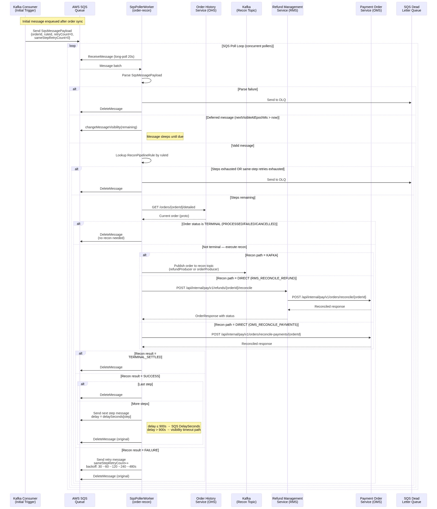

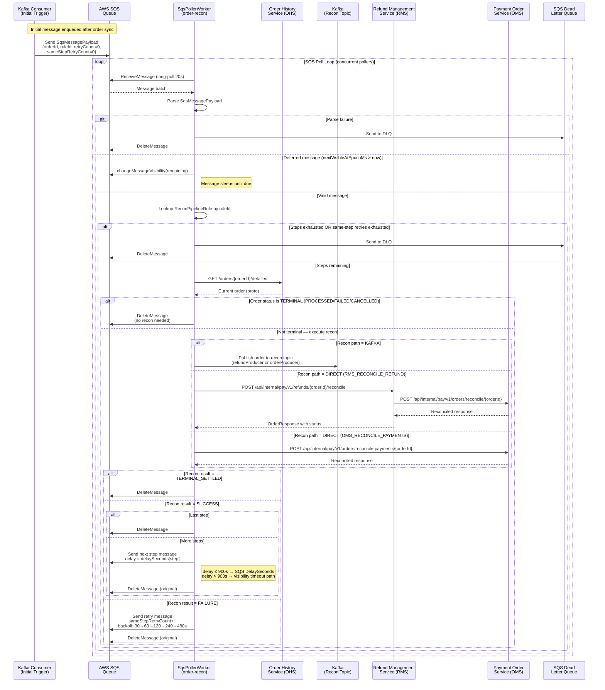
```mermaid
sequenceDiagram
    participant Kafka as Kafka Consumer<br/>(Initial Trigger)
    participant SQS as AWS SQS<br/>Queue
    participant Poller as SqsPollerWorker<br/>(order-recon)
    participant OHS as Order History<br/>Service (OHS)
    participant KafkaPub as Kafka<br/>(Recon Topic)
    participant RMS as Refund Management<br/>Service (RMS)
    participant OMS as Payment Order<br/>Service (OMS)
    participant DLQ as SQS Dead<br/>Letter Queue

    Note over Kafka,SQS: Initial message enqueued after order sync

    Kafka->>SQS: Send SqsMessagePayload<br/>{orderId, ruleId, retryCount=0,<br/>sameStepRetryCount=0}

    loop SQS Poll Loop (concurrent pollers)
        Poller->>SQS: ReceiveMessage (long-poll 20s)
        SQS-->>Poller: Message batch

        Poller->>Poller: Parse SqsMessagePayload

        alt Parse failure
            Poller->>DLQ: Send to DLQ
            Poller->>SQS: DeleteMessage
        else Deferred message (nextVisibleAtEpochMs > now)
            Poller->>SQS: changeMessageVisibility(remaining)
            Note right of Poller: Message sleeps until due
        else Valid message
            Poller->>Poller: Lookup ReconPipelineRule by ruleId

            alt Steps exhausted OR same-step retries exhausted
                Poller->>DLQ: Send to DLQ
                Poller->>SQS: DeleteMessage
            else Steps remaining
                Poller->>OHS: GET /orders/{orderId}/detailed
                OHS-->>Poller: Current order (proto)

                alt Order status is TERMINAL (PROCESSED/FAILED/CANCELLED)
                    Poller->>SQS: DeleteMessage<br/>(no recon needed)
                else Not terminal — execute recon
                    alt Recon path = KAFKA
                        Poller->>KafkaPub: Publish order to recon topic<br/>(refundProducer or orderProducer)
                    else Recon path = DIRECT (RMS_RECONCILE_REFUND)
                        Poller->>RMS: POST /api/internal/pay/v1/refunds/{orderId}/reconcile
                        RMS->>OMS: POST /api/internal/pay/v1/orders/reconcile/{orderId}
                        OMS-->>RMS: Reconciled response
                        RMS-->>Poller: OrderResponse with status
                    else Recon path = DIRECT (OMS_RECONCILE_PAYMENTS)
                        Poller->>OMS: POST /api/internal/pay/v1/orders/reconcile-payments/{orderId}
                        OMS-->>Poller: Reconciled response
                    end

                    alt Recon result = TERMINAL_SETTLED
                        Poller->>SQS: DeleteMessage
                    else Recon result = SUCCESS
                        alt Last step
                            Poller->>SQS: DeleteMessage
                        else More steps
                            Poller->>SQS: Send next step message<br/>delay = delaySeconds[step]
                            Note right of Poller: delay ≤ 900s → SQS DelaySeconds<br/>delay > 900s → visibility timeout path
                            Poller->>SQS: DeleteMessage (original)
                        end
                    else Recon result = FAILURE
                        Poller->>SQS: Send retry message<br/>sameStepRetryCount++<br/>backoff: 30→60→120→240→480s
                        Poller->>SQS: DeleteMessage (original)
                    end
                end
            end
        end
    end
```

---

## Flow 4: Force Close Refund

Admin triggers force-close on a stuck refund order. Order-recon fetches the order from OHS, determines if it's a refund order, and routes to RMS or OMS accordingly.

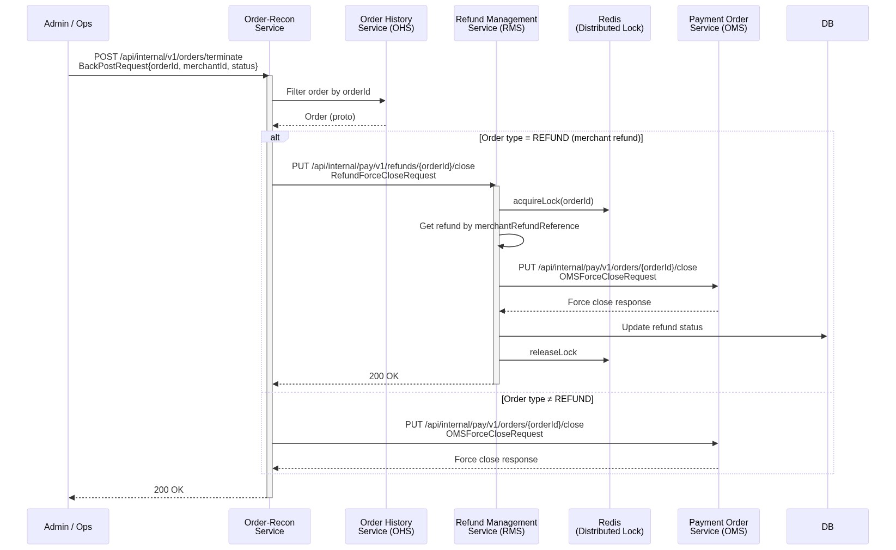

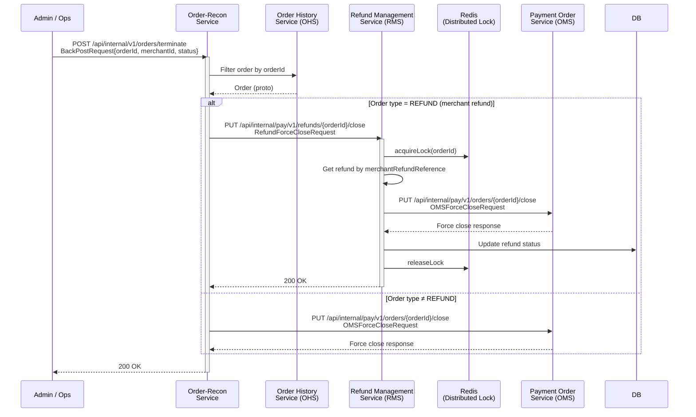
```mermaid
sequenceDiagram
    participant Admin as Admin / Ops
    participant OR as Order-Recon<br/>Service
    participant OHS as Order History<br/>Service (OHS)
    participant RMS as Refund Management<br/>Service (RMS)
    participant Redis as Redis<br/>(Distributed Lock)
    participant OMS as Payment Order<br/>Service (OMS)

    Admin->>OR: POST /api/internal/v1/orders/terminate<br/>BackPostRequest{orderId, merchantId, status}
    activate OR

    OR->>OHS: Filter order by orderId
    OHS-->>OR: Order (proto)

    alt Order type = REFUND (merchant refund)
        OR->>RMS: PUT /api/internal/pay/v1/refunds/{orderId}/close<br/>RefundForceCloseRequest
        activate RMS
        RMS->>Redis: acquireLock(orderId)
        RMS->>RMS: Get refund by merchantRefundReference
        RMS->>OMS: PUT /api/internal/pay/v1/orders/{orderId}/close<br/>OMSForceCloseRequest
        OMS-->>RMS: Force close response
        RMS->>DB: Update refund status
        RMS->>Redis: releaseLock
        RMS-->>OR: 200 OK
        deactivate RMS
    else Order type ≠ REFUND
        OR->>OMS: PUT /api/internal/pay/v1/orders/{orderId}/close<br/>OMSForceCloseRequest
        OMS-->>OR: Force close response
    end

    OR-->>Admin: 200 OK
    deactivate OR
```

---

## Flow 5: Terminate Refund Orders (Long Pending)

Handles long-pending orders that need termination. Refund orders are routed to a dedicated Kafka topic (`longPendingRefundProducer`).

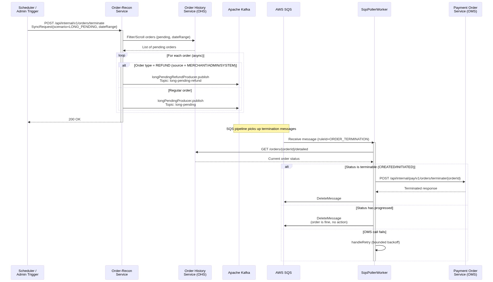

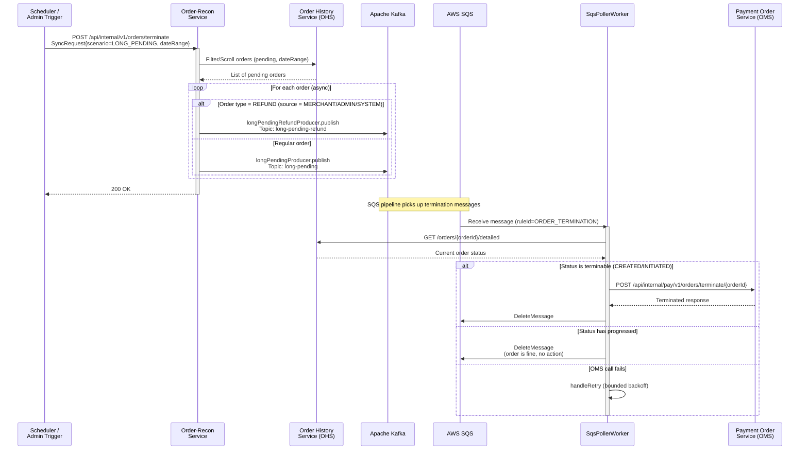
```mermaid
sequenceDiagram
    participant Sched as Scheduler /<br/>Admin Trigger
    participant OR as Order-Recon<br/>Service
    participant OHS as Order History<br/>Service (OHS)
    participant Kafka as Apache Kafka
    participant SQS as AWS SQS
    participant Poller as SqsPollerWorker
    participant OMS as Payment Order<br/>Service (OMS)

    Sched->>OR: POST /api/internal/v1/orders/terminate<br/>SyncRequest{scenario=LONG_PENDING, dateRange}
    activate OR

    OR->>OHS: Filter/Scroll orders (pending, dateRange)
    OHS-->>OR: List of pending orders

    loop For each order (async)
        alt Order type = REFUND (source = MERCHANT/ADMIN/SYSTEM)
            OR->>Kafka: longPendingRefundProducer.publish<br/>Topic: long-pending-refund
        else Regular order
            OR->>Kafka: longPendingProducer.publish<br/>Topic: long-pending
        end
    end

    OR-->>Sched: 200 OK
    deactivate OR

    Note over Kafka,SQS: SQS pipeline picks up termination messages

    SQS->>Poller: Receive message (ruleId=ORDER_TERMINATION)
    activate Poller
    Poller->>OHS: GET /orders/{orderId}/detailed
    OHS-->>Poller: Current order status

    alt Status is terminable (CREATED/INITIATED)
        Poller->>OMS: POST /api/internal/pay/v1/orders/terminate/{orderId}
        OMS-->>Poller: Terminated response
        Poller->>SQS: DeleteMessage
    else Status has progressed
        Poller->>SQS: DeleteMessage<br/>(order is fine, no action)
    else OMS call fails
        Poller->>Poller: handleRetry (bounded backoff)
    end
    deactivate Poller
```

---

## Flow 6: Sync Refunds (RMS DB → OHS State Sync)

Order-recon delegates to RMS to sync refund statuses from OHS back into RMS's local database.

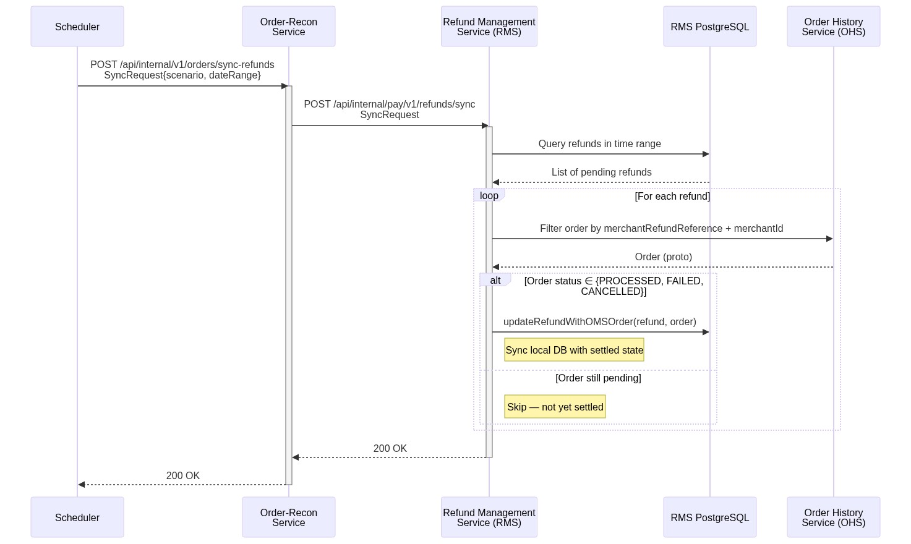

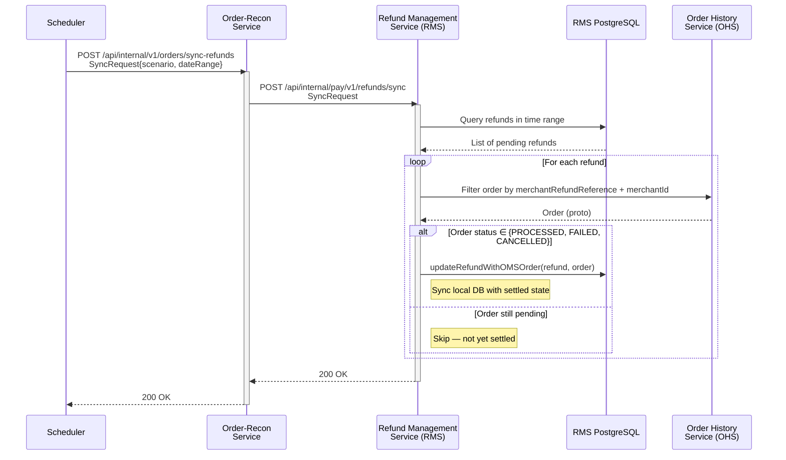
```mermaid
sequenceDiagram
    participant Sched as Scheduler
    participant OR as Order-Recon<br/>Service
    participant RMS as Refund Management<br/>Service (RMS)
    participant DB as RMS PostgreSQL
    participant OHS as Order History<br/>Service (OHS)

    Sched->>OR: POST /api/internal/v1/orders/sync-refunds<br/>SyncRequest{scenario, dateRange}
    activate OR

    OR->>RMS: POST /api/internal/pay/v1/refunds/sync<br/>SyncRequest
    activate RMS

    RMS->>DB: Query refunds in time range
    DB-->>RMS: List of pending refunds

    loop For each refund
        RMS->>OHS: Filter order by merchantRefundReference + merchantId
        OHS-->>RMS: Order (proto)

        alt Order status ∈ {PROCESSED, FAILED, CANCELLED}
            RMS->>DB: updateRefundWithOMSOrder(refund, order)
            Note right of RMS: Sync local DB with settled state
        else Order still pending
            Note right of RMS: Skip — not yet settled
        end
    end

    RMS-->>OR: 200 OK
    deactivate RMS
    OR-->>Sched: 200 OK
    deactivate OR
```

---

# Part 2 — Refund Retry on Acquirer Decline

---

## Overview — Acquirer Decline Retry Mechanism

When a refund request is sent to an acquirer and the acquirer responds with a **specific error code** (e.g., `MRR000`), OMS does **not** permanently fail the refund. Instead, the order is **parked** — a new `INITIATED` payment model is created on the order, and the original payment is marked `FAILED`.

During **reconciliation** (triggered by the order-recon SQS pipeline), OMS checks whether the parked order has retries remaining. If the retry count is within the configured limit (`max_attempts: 6`), OMS retries the refund by calling `processRefund()` again. If retries are exhausted, the order stays parked and a `RETRIES_EXHAUSTED` log is emitted.

### Key Design Decisions

- **Retry count is derived from `order.paymentModels.size`** — each retry creates a new `INITIATED` payment model, so the count of payment models equals the total attempt count.
- **Parking is idempotent** — if `processRefundBody.isParked == true`, the refund skips processing and returns immediately.
- **Two entry points for acquirer decline detection**:
  - `handleRefundResponse()` — during initial refund processing
  - `handleRefundReconcileResponse()` — during reconciliation inquiry

---

## Configuration

### Error Codes (`application.yaml`)

```yaml
acquirer_error_code_config:
  card_acquirer_error_codes: "MRR000"
  sdk_acquirer_error_codes: "MRR000"
```

- **`card_acquirer_error_codes`**: Checked for `CARD` and `CREDIT_EMI` payment methods. The error code is extracted from `acquirerErrorDetails.acquirerErrorDetail.code`.
- **`sdk_acquirer_error_codes`**: Checked for all other payment methods. The error code is extracted from `additionalErrorPayload.errorCode`.

### Retry Limit (`application.yaml`)

```yaml
acquirer_decline_attempt_config:
  max_attempts: 6
```

- Maximum **6 payment models** (including the original) are allowed on the order.
- Validation: `retryCount <= maxAttempts` where `retryCount = order.paymentModels.size`.

### Config Classes (`PaymentOrderConfigs.kt`)

```kotlin
data class AcquirerErrorCodeConfig(
    val cardAcquirerErrorCodes: List<String>,
    val sdkAcquirerErrorCodes: List<String>
)

data class AcquirerDeclineAttemptConfig(
    val maxAttempts: Int
)
```

---

## Flow Summary — Retry Steps

| Step | Action | Service | Method |
|------|--------|---------|--------|
| 1 | Merchant initiates refund | RMS | `RefundService.process()` |
| 2 | RMS calls OMS to process refund | OMS | `processRefund()` |
| 3 | OMS sends refund to acquirer | OMS → PaymentSDK | `paymentSDK.refundPayment()` |
| 4 | Acquirer returns error with code `MRR000` | Acquirer | — |
| 5 | OMS checks if error code is retryable | OMS | `handleRefundResponse()` |
| 6 | Error code matches → park the order | OMS | `handleAcquirerFailure()` |
| 7 | New INITIATED payment created, original FAILED | OMS | `orderRepository.failPendingPaymentAndCreateNewPayment()` |
| 8 | Order-recon SQS picks up parked order | order-recon | SQS pipeline |
| 9 | RMS reconciles the order | RMS | `RefundService.reconcile()` |
| 10 | OMS checks if retries remain | OMS | `handleRefundParkedOrder()` → `validRetryCount()` |
| 11a | Retries available → retry refund | OMS | `resumeOrder()` → `processRefund()` |
| 11b | Retries exhausted → stop | OMS | Logs `RETRIES_EXHAUSTED` |

---

## Sequence Diagram — Refund Retry Full Flow

Shows the end-to-end flow from initial refund failure through parking, reconciliation, and retry.

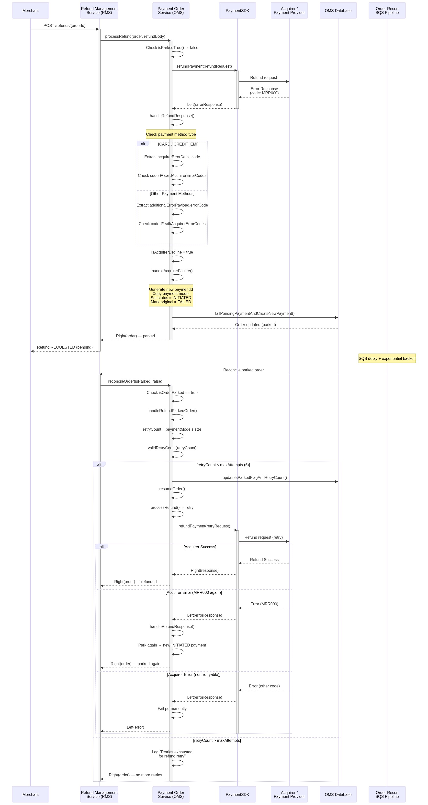

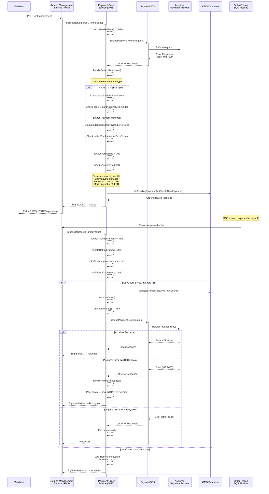
```mermaid
sequenceDiagram
    participant M as Merchant
    participant RMS as Refund Management<br/>Service (RMS)
    participant OMS as Payment Order<br/>Service (OMS)
    participant SDK as PaymentSDK
    participant ACQ as Acquirer /<br/>Payment Provider
    participant DB as OMS Database
    participant SQS as Order-Recon<br/>SQS Pipeline

    %% Initial Refund Attempt
    M->>RMS: POST /refunds/{orderId}
    activate RMS
    RMS->>OMS: processRefund(order, refundBody)
    activate OMS

    OMS->>OMS: Check isParkedTrue() → false
    OMS->>SDK: refundPayment(refundRequest)
    activate SDK
    SDK->>ACQ: Refund request
    ACQ-->>SDK: Error Response<br/>(code: MRR000)
    SDK-->>OMS: Left(errorResponse)
    deactivate SDK

    %% Error Code Check
    OMS->>OMS: handleRefundResponse()
    Note over OMS: Check payment method type
    alt CARD / CREDIT_EMI
        OMS->>OMS: Extract acquirerErrorDetail.code
        OMS->>OMS: Check code ∈ cardAcquirerErrorCodes
    else Other Payment Methods
        OMS->>OMS: Extract additionalErrorPayload.errorCode
        OMS->>OMS: Check code ∈ sdkAcquirerErrorCodes
    end
    OMS->>OMS: isAcquirerDecline = true

    %% Park the Order
    OMS->>OMS: handleAcquirerFailure()
    Note over OMS: Generate new paymentId<br/>Copy payment model<br/>Set status = INITIATED<br/>Mark original = FAILED
    OMS->>DB: failPendingPaymentAndCreateNewPayment()
    DB-->>OMS: Order updated (parked)
    OMS-->>RMS: Right(order) — parked
    deactivate OMS
    RMS-->>M: Refund REQUESTED (pending)
    deactivate RMS

    %% Reconciliation Retry
    Note over SQS: SQS delay + exponential backoff
    SQS->>RMS: Reconcile parked order
    activate RMS
    RMS->>OMS: reconcileOrder(isParked=false)
    activate OMS

    OMS->>OMS: Check isOrderParked == true
    OMS->>OMS: handleRefundParkedOrder()
    OMS->>OMS: retryCount = paymentModels.size
    OMS->>OMS: validRetryCount(retryCount)

    alt retryCount ≤ maxAttempts (6)
        OMS->>DB: updateIsParkedFlagAndRetryCount()
        OMS->>OMS: resumeOrder()
        OMS->>OMS: processRefund() ← retry

        OMS->>SDK: refundPayment(retryRequest)
        activate SDK
        SDK->>ACQ: Refund request (retry)

        alt Acquirer Success
            ACQ-->>SDK: Refund Success
            SDK-->>OMS: Right(response)
            OMS-->>RMS: Right(order) — refunded
        else Acquirer Error (MRR000 again)
            ACQ-->>SDK: Error (MRR000)
            SDK-->>OMS: Left(errorResponse)
            OMS->>OMS: handleRefundResponse()
            OMS->>OMS: Park again → new INITIATED payment
            OMS-->>RMS: Right(order) — parked again
        else Acquirer Error (non-retryable)
            ACQ-->>SDK: Error (other code)
            SDK-->>OMS: Left(errorResponse)
            OMS->>OMS: Fail permanently
            OMS-->>RMS: Left(error)
        end
        deactivate SDK

    else retryCount > maxAttempts
        OMS->>OMS: Log "Retries exhausted<br/>for refund retry"
        OMS-->>RMS: Right(order) — no more retries
    end

    deactivate OMS
    deactivate RMS
```

---

## Sequence Diagram — Retry During Reconciliation

Focused view of the reconciliation retry logic within OMS.

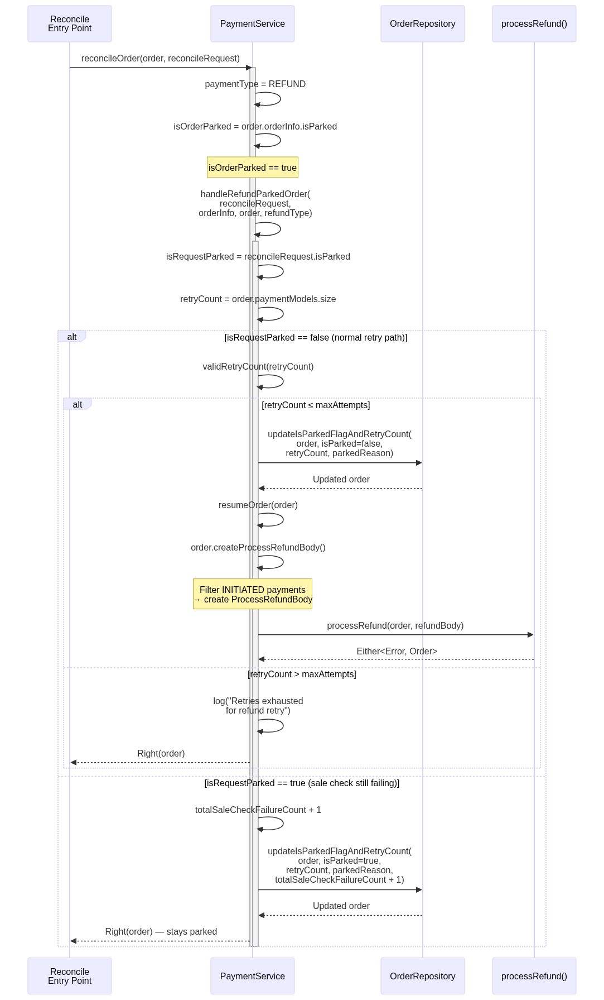

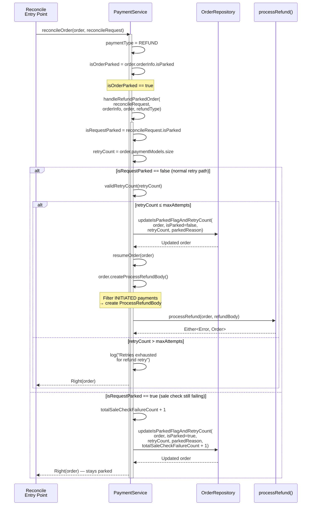
```mermaid
sequenceDiagram
    participant RECON as Reconcile<br/>Entry Point
    participant PS as PaymentService
    participant REPO as OrderRepository
    participant PROC as processRefund()

    RECON->>PS: reconcileOrder(order, reconcileRequest)
    activate PS

    PS->>PS: paymentType = REFUND
    PS->>PS: isOrderParked = order.orderInfo.isParked
    Note over PS: isOrderParked == true

    PS->>PS: handleRefundParkedOrder(<br/>  reconcileRequest,<br/>  orderInfo, order, refundType)
    activate PS

    PS->>PS: isRequestParked = reconcileRequest.isParked
    PS->>PS: retryCount = order.paymentModels.size

    alt isRequestParked == false (normal retry path)
        PS->>PS: validRetryCount(retryCount)

        alt retryCount ≤ maxAttempts
            PS->>REPO: updateIsParkedFlagAndRetryCount(<br/>  order, isParked=false,<br/>  retryCount, parkedReason)
            REPO-->>PS: Updated order
            PS->>PS: resumeOrder(order)
            PS->>PS: order.createProcessRefundBody()
            Note over PS: Filter INITIATED payments<br/>→ create ProcessRefundBody
            PS->>PROC: processRefund(order, refundBody)
            PROC-->>PS: Either<Error, Order>
        else retryCount > maxAttempts
            PS->>PS: log("Retries exhausted<br/>for refund retry")
            PS-->>RECON: Right(order)
        end

    else isRequestParked == true (sale check still failing)
        PS->>PS: totalSaleCheckFailureCount + 1
        PS->>REPO: updateIsParkedFlagAndRetryCount(<br/>  order, isParked=true,<br/>  retryCount, parkedReason,<br/>  totalSaleCheckFailureCount + 1)
        REPO-->>PS: Updated order
        PS-->>RECON: Right(order) — stays parked
    end

    deactivate PS
    deactivate PS
```

---

## State Diagram — Refund Order Lifecycle

Shows the refund order states through the parking and retry cycle.

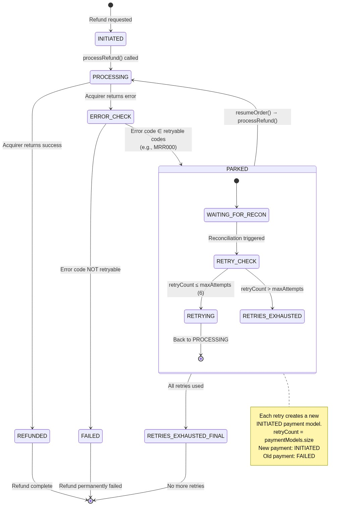

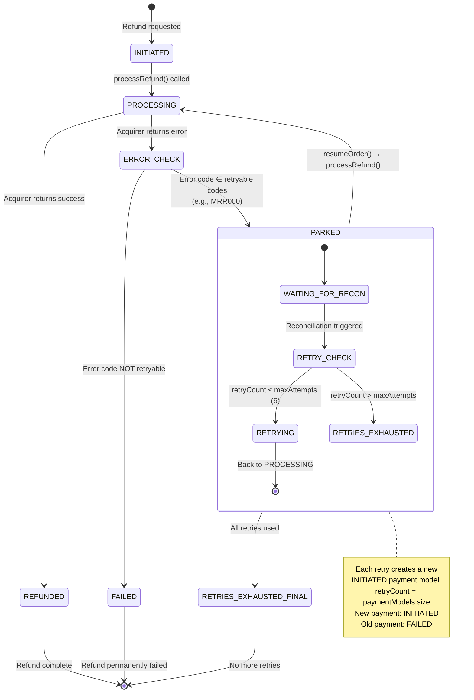
```mermaid
stateDiagram-v2
    [*] --> INITIATED: Refund requested

    INITIATED --> PROCESSING: processRefund() called

    PROCESSING --> REFUNDED: Acquirer returns success
    PROCESSING --> ERROR_CHECK: Acquirer returns error

    ERROR_CHECK --> PARKED: Error code ∈ retryable codes<br/>(e.g., MRR000)
    ERROR_CHECK --> FAILED: Error code NOT retryable

    state PARKED {
        [*] --> WAITING_FOR_RECON
        WAITING_FOR_RECON --> RETRY_CHECK: Reconciliation triggered

        RETRY_CHECK --> RETRYING: retryCount ≤ maxAttempts (6)
        RETRY_CHECK --> RETRIES_EXHAUSTED: retryCount > maxAttempts

        RETRYING --> [*]: Back to PROCESSING
    }

    PARKED --> PROCESSING: resumeOrder() → processRefund()
    PARKED --> RETRIES_EXHAUSTED_FINAL: All retries used

    REFUNDED --> [*]: Refund complete
    FAILED --> [*]: Refund permanently failed
    RETRIES_EXHAUSTED_FINAL --> [*]: No more retries

    note right of PARKED
        Each retry creates a new
        INITIATED payment model.
        retryCount = paymentModels.size
        New payment: INITIATED
        Old payment: FAILED
    end note
```

---

## Reconciliation Inquiry Path

During reconciliation, OMS also checks for acquirer decline in the **inquiry response** via `handleRefundReconcileResponse()`. This handles the case where the acquirer returns a `FAILED` status with a retryable error code during the reconciliation inquiry itself.

The logic mirrors `handleRefundResponse()`:
- For CARD/CREDIT_EMI → check `acquirerDetails.acquirerErrorDetail.code`
- For other methods → check `errorDetails.failureData.additionalErrorPayload.errorCode`
- If retryable → `handleAcquirerFailureForInquiryResponse()` (same parking logic)
- If not retryable → `markPaymentsAndOrderFailed()`

---

## Error Scenarios

| Scenario | Behavior |
|----------|----------|
| Acquirer returns `MRR000` on first attempt | Order parked, retry in next recon cycle |
| Acquirer returns `MRR000` on attempts 2-6 | Order re-parked each time, retry continues |
| Acquirer returns `MRR000` on attempt 7+ | `RETRIES_EXHAUSTED` logged, order stays as-is |
| Acquirer returns non-retryable error | Order and payment permanently `FAILED` |
| Acquirer returns success on retry | Order marked `REFUNDED` |
| `isRequestParked = true` during recon | `totalSaleCheckFailureCount` incremented, stays parked |
| `processRefundBody.isParked = true` | `processRefund()` returns immediately (no acquirer call) |

---

# Part 3 — Architecture & System Views

---

## Architecture Diagram

High-level service topology showing all services, message brokers, data stores, and external systems.

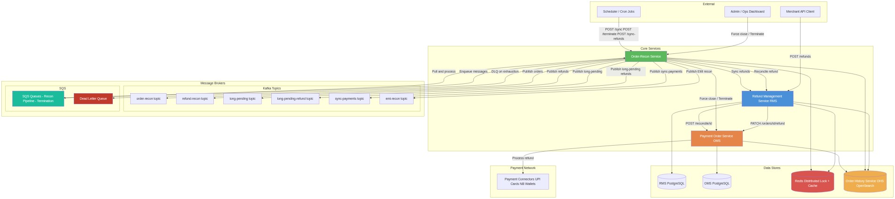

```mermaid
graph TB
    subgraph External
        M[Merchant API Client]
        Admin[Admin / Ops Dashboard]
        Sched[Scheduler / Cron Jobs]
    end

    subgraph Core Services
        RMS[Refund Management<br/>Service - RMS]
        OMS[Payment Order<br/>Service - OMS]
        OR[Order-Recon<br/>Service]
    end

    subgraph Message Brokers
        subgraph Kafka Topics
            KT1[order-recon topic]
            KT2[refund-recon topic]
            KT3[long-pending topic]
            KT4[long-pending-refund topic]
            KT5[sync-payments topic]
            KT6[emi-recon topic]
        end
        subgraph SQS
            SQ[SQS Queues<br/>- Recon Pipeline<br/>- Termination]
            DLQ[Dead Letter Queue]
        end
    end

    subgraph Data Stores
        PG1[(RMS PostgreSQL)]
        PG2[(OMS PostgreSQL)]
        Redis[(Redis<br/>Distributed Lock<br/>+ Cache)]
        OHS[(Order History<br/>Service - OHS<br/>OpenSearch)]
    end

    subgraph Payment Network
        Conn[Payment Connectors<br/>UPI / Cards / NB / Wallets]
    end

    M -->|POST /refunds| RMS
    RMS -->|PATCH /orders/{id}/refund| OMS
    OMS -->|Process refund| Conn

    Admin -->|Force close / Terminate| OR

    Sched -->|POST /sync<br/>POST /terminate<br/>POST /sync-refunds| OR

    OR -->|Reconcile refund| RMS
    OR -->|Force close / Terminate| OMS
    OR -->|Sync refunds| RMS

    OR -->|Publish orders| KT1
    OR -->|Publish refunds| KT2
    OR -->|Publish long-pending| KT3
    OR -->|Publish long-pending refunds| KT4
    OR -->|Publish sync-payments| KT5
    OR -->|Publish EMI recon| KT6

    OR -->|Enqueue messages| SQ
    SQ -->|Poll & process| OR
    OR -->|DLQ on exhaustion| DLQ

    RMS --> PG1
    OMS --> PG2
    RMS --> Redis
    OR --> Redis
    RMS --> OHS
    OR --> OHS
    OMS --> OHS

    RMS -->|POST /reconcile/{id}| OMS

    style RMS fill:#4a90d9,color:#fff
    style OMS fill:#e6854a,color:#fff
    style OR fill:#5cb85c,color:#fff
    style Redis fill:#d9534f,color:#fff
    style OHS fill:#f0ad4e,color:#fff
    style KT1 fill:#8e44ad,color:#fff
    style KT2 fill:#8e44ad,color:#fff
    style KT3 fill:#8e44ad,color:#fff
    style KT4 fill:#8e44ad,color:#fff
    style KT5 fill:#8e44ad,color:#fff
    style KT6 fill:#8e44ad,color:#fff
    style SQ fill:#1abc9c,color:#fff
    style DLQ fill:#c0392b,color:#fff
```

---

## Component Diagram — RMS Internal Structure

Internal component decomposition of the Refund Management Service showing modules, clients, and data flow.

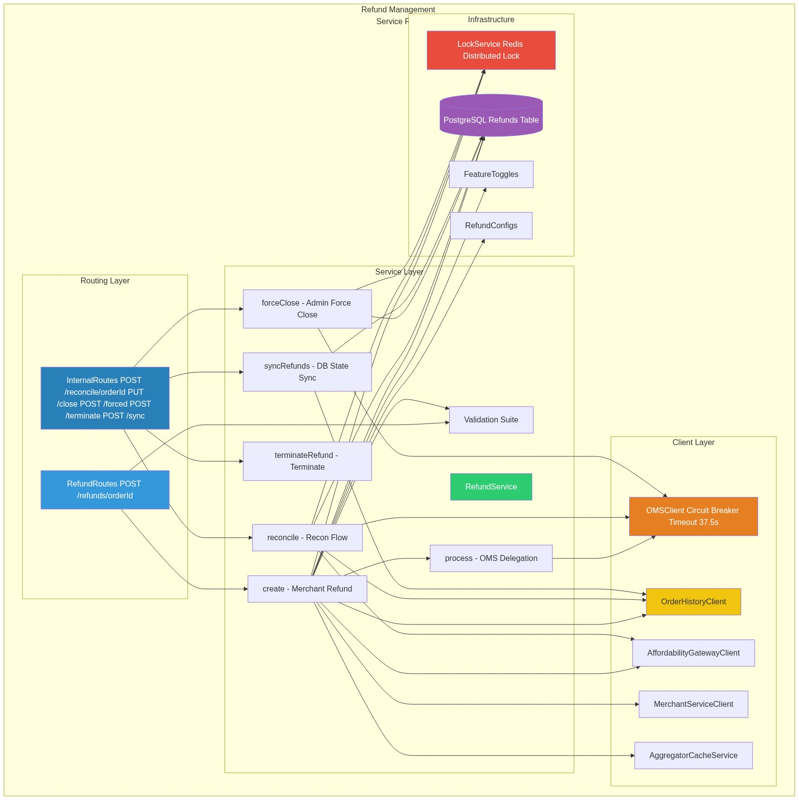

```mermaid
graph TB
    subgraph "Refund Management Service (RMS)"
        subgraph "Routing Layer"
            RR[RefundRoutes<br/>POST /refunds/{orderId}]
            IR[InternalRoutes<br/>POST /reconcile/{orderId}<br/>PUT /close<br/>POST /forced<br/>POST /terminate<br/>POST /sync]
        end

        subgraph "Service Layer"
            RS[RefundService]
            RS_CREATE[create - Merchant Refund]
            RS_RECON[reconcile - Recon Flow]
            RS_FORCE[forceClose - Admin Force Close]
            RS_TERM[terminateRefund - Terminate]
            RS_SYNC[syncRefunds - DB State Sync]
            RS_PROCESS[process - OMS Delegation]
            RS_VALIDATE[Validation Suite<br/>- Customer details<br/>- Duplicate check<br/>- Refund window<br/>- Amount limits<br/>- Currency match<br/>- Offer validation]
        end

        subgraph "Client Layer"
            OMSC[OMSClient<br/>Circuit Breaker<br/>Timeout: 37.5s]
            OHSC[OrderHistoryClient]
            AGC[AffordabilityGatewayClient]
            MSC[MerchantServiceClient]
            ACS[AggregatorCacheService]
        end

        subgraph "Infrastructure"
            LS[LockService<br/>Redis Distributed Lock]
            DB[(PostgreSQL<br/>Refunds Table)]
            FT[FeatureToggles]
            RC[RefundConfigs]
        end
    end

    RR --> RS_CREATE
    RR --> RS_VALIDATE
    IR --> RS_RECON
    IR --> RS_FORCE
    IR --> RS_TERM
    IR --> RS_SYNC

    RS_CREATE --> LS
    RS_CREATE --> RS_VALIDATE
    RS_CREATE --> RS_PROCESS
    RS_RECON --> LS
    RS_FORCE --> LS

    RS_PROCESS --> OMSC
    RS_RECON --> OMSC
    RS_FORCE --> OMSC

    RS_CREATE --> OHSC
    RS_RECON --> OHSC
    RS_SYNC --> OHSC

    RS_CREATE --> AGC
    RS_RECON --> AGC
    RS_CREATE --> MSC
    RS_CREATE --> ACS

    RS_CREATE --> DB
    RS_RECON --> DB
    RS_FORCE --> DB
    RS_SYNC --> DB

    RS_CREATE --> FT
    RS_CREATE --> RC

    style RR fill:#3498db,color:#fff
    style IR fill:#2980b9,color:#fff
    style RS fill:#2ecc71,color:#fff
    style OMSC fill:#e67e22,color:#fff
    style OHSC fill:#f1c40f,color:#333
    style LS fill:#e74c3c,color:#fff
    style DB fill:#9b59b6,color:#fff
```

---

## Component Diagram — Refund Retry System

Shows the system components participating in the refund retry mechanism and their interactions.

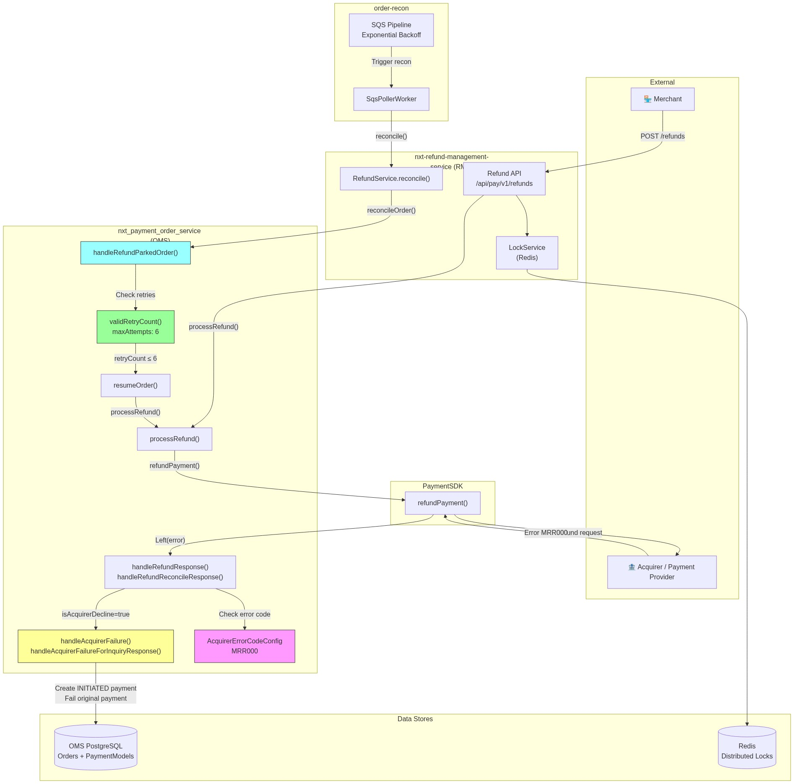

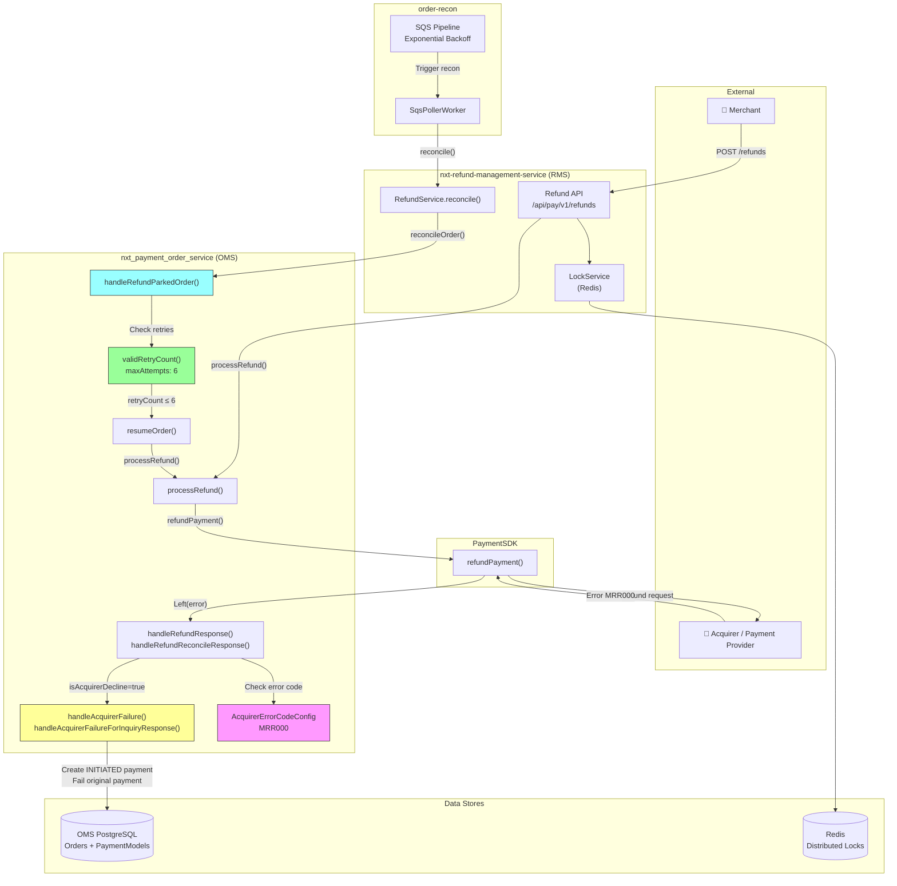
```mermaid
graph TB
    subgraph External["External"]
        MERCHANT["🏪 Merchant"]
        ACQUIRER["🏦 Acquirer / Payment Provider"]
    end

    subgraph RMS_SVC["nxt-refund-management-service (RMS)"]
        RMS_API["Refund API<br/>/api/pay/v1/refunds"]
        RMS_RECON["RefundService.reconcile()"]
        RMS_LOCK["LockService<br/>(Redis)"]
    end

    subgraph OMS_SVC["nxt_payment_order_service (OMS)"]
        OMS_PROCESS["processRefund()"]
        OMS_HANDLE_RESP["handleRefundResponse()<br/>handleRefundReconcileResponse()"]
        OMS_PARK["handleAcquirerFailure()<br/>handleAcquirerFailureForInquiryResponse()"]
        OMS_RETRY["handleRefundParkedOrder()"]
        OMS_VALIDATE["validRetryCount()<br/>maxAttempts: 6"]
        OMS_RESUME["resumeOrder()"]
        OMS_CONFIG["AcquirerErrorCodeConfig<br/>MRR000"]
    end

    subgraph SDK_SVC["PaymentSDK"]
        SDK_REFUND["refundPayment()"]
    end

    subgraph RECON_SVC["order-recon"]
        SQS_PIPE["SQS Pipeline<br/>Exponential Backoff"]
        SQS_WORKER["SqsPollerWorker"]
    end

    subgraph DATA["Data Stores"]
        OMS_DB[("OMS PostgreSQL<br/>Orders + PaymentModels")]
        REDIS[("Redis<br/>Distributed Locks")]
    end

    MERCHANT -->|"POST /refunds"| RMS_API
    RMS_API --> RMS_LOCK
    RMS_LOCK --> REDIS
    RMS_API -->|"processRefund()"| OMS_PROCESS
    OMS_PROCESS -->|"refundPayment()"| SDK_REFUND
    SDK_REFUND -->|"Refund request"| ACQUIRER
    ACQUIRER -->|"Error MRR000"| SDK_REFUND
    SDK_REFUND -->|"Left(error)"| OMS_HANDLE_RESP
    OMS_HANDLE_RESP -->|"Check error code"| OMS_CONFIG
    OMS_HANDLE_RESP -->|"isAcquirerDecline=true"| OMS_PARK
    OMS_PARK -->|"Create INITIATED payment<br/>Fail original payment"| OMS_DB

    SQS_PIPE -->|"Trigger recon"| SQS_WORKER
    SQS_WORKER -->|"reconcile()"| RMS_RECON
    RMS_RECON -->|"reconcileOrder()"| OMS_RETRY
    OMS_RETRY -->|"Check retries"| OMS_VALIDATE
    OMS_VALIDATE -->|"retryCount ≤ 6"| OMS_RESUME
    OMS_RESUME -->|"processRefund()"| OMS_PROCESS

    style OMS_CONFIG fill:#f9f,stroke:#333
    style OMS_PARK fill:#ff9,stroke:#333
    style OMS_RETRY fill:#9ff,stroke:#333
    style OMS_VALIDATE fill:#9f9,stroke:#333
```

---

## Use Case Diagram

Actors and their interactions with the refund and reconciliation system.

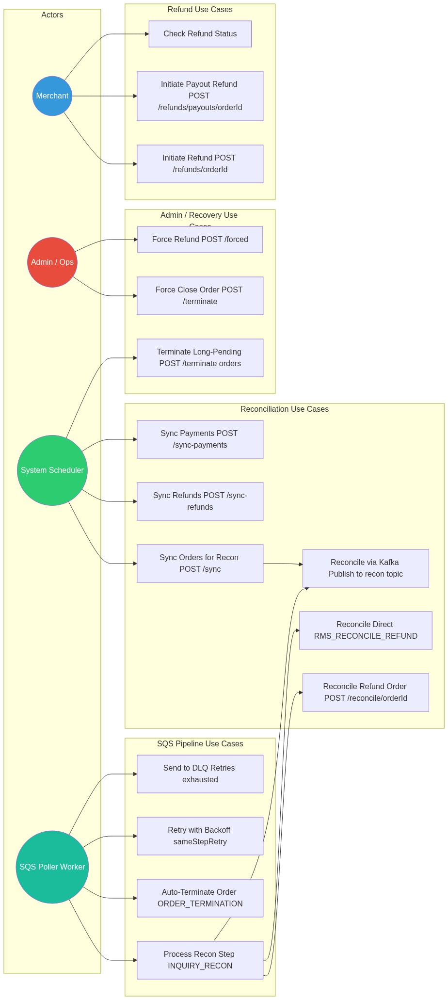

```mermaid
graph LR
    subgraph Actors
        M((Merchant))
        A((Admin / Ops))
        S((System<br/>Scheduler))
        SQS_W((SQS Poller<br/>Worker))
    end

    subgraph "Refund Use Cases"
        UC1[Initiate Refund<br/>POST /refunds/{orderId}]
        UC2[Initiate Payout Refund<br/>POST /refunds/payouts/{orderId}]
        UC3[Check Refund Status]
    end

    subgraph "Reconciliation Use Cases"
        UC4[Sync Orders for Recon<br/>POST /sync]
        UC5[Sync Refunds<br/>POST /sync-refunds]
        UC6[Sync Payments<br/>POST /sync-payments]
        UC7[Reconcile Refund Order<br/>POST /reconcile/{orderId}]
        UC8[Reconcile via Kafka<br/>Publish to recon topic]
        UC9[Reconcile Direct<br/>RMS_RECONCILE_REFUND]
    end

    subgraph "Admin / Recovery Use Cases"
        UC10[Force Close Order<br/>POST /terminate]
        UC11[Force Refund<br/>POST /forced]
        UC12[Terminate Long-Pending<br/>POST /terminate orders]
    end

    subgraph "SQS Pipeline Use Cases"
        UC13[Process Recon Step<br/>INQUIRY_RECON]
        UC14[Auto-Terminate Order<br/>ORDER_TERMINATION]
        UC15[Retry with Backoff<br/>sameStepRetry]
        UC16[Send to DLQ<br/>Retries exhausted]
    end

    M --> UC1
    M --> UC2
    M --> UC3

    A --> UC10
    A --> UC11

    S --> UC4
    S --> UC5
    S --> UC6
    S --> UC12

    SQS_W --> UC13
    SQS_W --> UC14
    SQS_W --> UC15
    SQS_W --> UC16

    UC4 --> UC8
    UC13 --> UC7
    UC13 --> UC9
    UC13 --> UC8

    style M fill:#3498db,color:#fff
    style A fill:#e74c3c,color:#fff
    style S fill:#2ecc71,color:#fff
    style SQS_W fill:#1abc9c,color:#fff
```

---

# Part 4 — Reference

---

## Key Design Patterns

| Pattern | Where Used | Purpose |
|---|---|---|
| **Distributed Lock (Redis)** | RMS — create, reconcile, forceClose | Prevents concurrent refund processing on same order |
| **Circuit Breaker** | All inter-service HTTP calls | Graceful degradation when downstream is unhealthy |
| **Exponential Backoff** | SQS Poller — handleRetry | 30→60→120→240→480s before DLQ |
| **Delete-Last** | SQS Poller — advanceToNextStep | At-least-once delivery: delete original only after next message sent |
| **Dual Delay Modes** | SQS Producer | ≤900s: SQS DelaySeconds; >900s: visibility-timeout path (max 12h) |
| **Kafka Topic Routing** | order-recon sync, SQS recon | Separate topics for orders, refunds, EMI, long-pending, payments |
| **Fail-Open Cache** | EMI recon Redis check | If Redis unavailable, allow Kafka publish |
| **Bounded Same-Step Retries** | SQS Poller | Max 5 retries per step before DLQ |
| **Scroll/Pagination** | order-recon OHS queries | Configurable: scroll for large datasets, pagination for smaller |
| **Parked Order Retry** | OMS — acquirer decline | Park order on retryable error, retry during recon up to 6 attempts |

---

## Inter-Service API Reference

| Source | Target | Method | Endpoint | Purpose |
|---|---|---|---|---|
| Merchant | RMS | POST | `/api/pay/v1/refunds/{orderId}` | Initiate merchant refund |
| RMS | OMS | PATCH | `/api/internal/pay/v1/orders/{parentOrderId}/refund` | Process refund (create refund order) |
| RMS | OMS | POST | `/api/internal/pay/v1/orders/reconcile/{orderId}` | Reconcile refund order |
| RMS | OMS | PUT | `/api/internal/pay/v1/orders/{orderId}/close` | Force close order |
| order-recon | RMS | POST | `/api/internal/pay/v1/refunds/{orderId}/reconcile` | Reconcile refund via direct path |
| order-recon | RMS | PUT | `/api/internal/pay/v1/refunds/{orderId}/close` | Force close refund |
| order-recon | RMS | POST | `/api/internal/pay/v1/refunds/sync` | Sync refunds from OHS to RMS DB |
| order-recon | OMS | PUT | `/api/internal/pay/v1/orders/{orderId}/close` | Force close non-refund order |
| order-recon | OMS | POST | `/api/internal/pay/v1/orders/terminate/{orderId}` | Terminate stuck order |
| order-recon | OMS | POST | `/api/internal/pay/v1/orders/reconcile-payments/{orderId}` | Reconcile payment-level |
| order-recon | OHS | GET | `/api/internal/v1/orders/{orderId}/detailed` | Fetch order proto |
| order-recon | OHS | POST | `/api/internal/v1/orders/filter` | Filter orders (pagination) |
| order-recon | OHS | POST | `/api/internal/v1/orders/scroll` | Scroll orders (large datasets) |

---

## Code Reference

### Key Files — OMS (nxt_payment_order_service)

| File | Purpose |
|------|---------|
| `PaymentService.kt` | All retry logic: `processRefund()`, `handleRefundResponse()`, `handleAcquirerFailure()`, `handleRefundParkedOrder()`, `validRetryCount()`, `resumeOrder()` |
| `PaymentOrderConfigs.kt` | Config classes: `AcquirerErrorCodeConfig`, `AcquirerDeclineAttemptConfig` |
| `application.yaml` | Config values: error codes (`MRR000`), max attempts (`6`) |
| `OrderRepository.kt` | `updateIsParkedFlagAndRetryCount()`, `failPendingPaymentAndCreateNewPayment()` |
| `Order.kt` | `isParked()`, parked order payment model selection |
| `AdditionalDetails.kt` | `isParked`, `parkedReason` fields on `OrderInfo` |
| `ProcessRefundBody.kt` | `isParked`, `parkedReason` fields on refund request |
| `ReconcileOrderRequest.kt` | `isParked` field on reconcile request |
| `Constants.kt` | `RETRIES_EXHAUSTED` constant |

### Key Methods (PaymentService.kt)

#### `processRefund()` — Entry Point

```kotlin
// Line ~1487: If already parked, skip processing
if (processRefundBody.isParkedTrue()) {
    // Returns immediately, parks for recon
}

// Line ~1592: Send refund to acquirer
val refundPaymentResponse = paymentSDK.refundPayment(...)

// On error → handleRefundResponse()
```

#### `handleRefundResponse()` — Error Code Check

```kotlin
// For CARD/CREDIT_EMI:
val acquirerErrorCode = omsErrorResponse.acquirerErrorDetails?.acquirerErrorDetail?.code
if (acquirerErrorCode in omsConfigs.acquirerErrorCodeConfig.cardAcquirerErrorCodes) {
    isAcquirerDecline = true
}

// For other methods:
val errorCode = omsErrorResponse.additionalErrorPayload?.errorCode
if (errorCode in omsConfigs.acquirerErrorCodeConfig.sdkAcquirerErrorCodes) {
    isAcquirerDecline = true
}

// If retryable → handleAcquirerFailure() → Right(order)
// If not retryable → fail payment and order
```

#### `handleAcquirerFailure()` — Park the Order

```kotlin
// Create new INITIATED payment (copy of failed one with new ID)
val newPayment = paymentModel.copy(
    paymentId = newPaymentId,
    status = PaymentStatus.INITIATED,
    errorDetail = null
)
// Mark original as FAILED
paymentModel.mutateStatus(PaymentStatus.FAILED)
// Persist both
orderRepository.failPendingPaymentAndCreateNewPayment(order, paymentModel, newPayment)
```

#### `handleRefundParkedOrder()` — Retry Decision

```kotlin
val retryCount = order.paymentModels.size.toLong()

when (isRequestParked) {
    false -> {
        if (validRetryCount(retryCount)) {
            orderRepository.updateIsParkedFlagAndRetryCount(...)
            return resumeOrder(order)  // → processRefund() retry
        } else {
            log(Level.INFO, RETRIES_EXHAUSTED)
            return Right(order)  // No more retries
        }
    }
    true -> {
        // Sale check still failing, increment failure count
        totalSaleCheckFailureCount + 1
        // Stay parked
    }
}
```

#### `validRetryCount()` — Limit Check

```kotlin
private fun validRetryCount(retryCount: Long): Boolean =
    retryCount <= acquirerDeclineAttemptConfig.maxAttempts  // maxAttempts = 6
```

#### `resumeOrder()` — Execute Retry

```kotlin
private suspend fun resumeOrder(order: Order): Either<OMSErrorResponse, Order> {
    val processRefundBody = order.createProcessRefundBody()  // INITIATED payments → ProcessRefundBody
    return processRefund(order, processRefundBody)
}
```
