# Card Payment Processing Ecosystem: End-to-End Architecture

**Date:** 2026-06-06  
**Scope:** Merchant → PA/PF/PG → Processor → Acquirer Bank → Card Network → Issuer Bank, including authorization, authentication, 3DS2, money flow, settlement, refunds, reconciliation, MPR, disputes, MID/TID, BIN sponsorship, ACS, Directory Server, CAVV/AAV/TAVV/ECI/XID, and operating models.

---

## 1. Executive Summary

Card payments are not the same as UPI payments.

In UPI, a successful customer payment normally means the payer account is debited and the payee side is accepted in the same online push-payment flow.

In card payments, checkout success usually means **authorization success**, not final merchant money settlement.

A card transaction generally moves through these phases:

```text
1. Authentication       - Is the customer really the cardholder?
2. Authorization        - Will the issuer approve the transaction?
3. Capture              - Does the merchant confirm the amount to be charged?
4. Clearing             - Is the transaction presented to the network/issuer?
5. Settlement           - Are net funds moved between issuer, network, acquirer?
6. Merchant Funding     - Does the acquirer/PA/PF pay the merchant?
7. Reconciliation       - Do all systems, reports, ledgers, refunds, disputes, and payouts match?
```

Visa describes VisaNet Connect as allowing acquirers, acquirer-processors, and approved technology partners to authorize, clear, and settle payments through a direct interface to Visa’s global payment system. Mastercard similarly describes its switching services as covering authorization, clearing, and settlement through its authorization, clearing, and settlement systems.

---

## 2. Card Payment Ecosystem

```mermaid
flowchart LR
    Cardholder[Cardholder / Customer]
    Merchant[Merchant / Seller]
    PA[PA / PF / Marketplace / Platform]
    PG[Payment Gateway]
    Processor[Acquirer Processor / Payment Processor]
    Acquirer[Acquiring Bank]
    Network[Card Network<br/>Visa / Mastercard / RuPay / Amex]
    IssuerProcessor[Issuer Processor]
    Issuer[Issuing Bank]
    CardAccount[Cardholder Account / Credit Line / Bank Account]

    Cardholder --> Merchant
    Merchant --> PA
    PA --> PG
    PG --> Processor
    Processor --> Acquirer
    Acquirer --> Network
    Network --> IssuerProcessor
    IssuerProcessor --> Issuer
    Issuer --> CardAccount
```

### 2.1 Main Entities

| Entity | Role |
|---|---|
| **Cardholder** | Customer using credit card, debit card, prepaid card, corporate card, or network token. |
| **Merchant** | Business selling goods or services. |
| **Payment Aggregator / PA** | In India, an entity that aggregates customer payments through merchant interfaces and subsequently settles funds to merchants. |
| **Payment Facilitator / PF / PayFac** | Card-network model where a registered service provider facilitates card transactions on behalf of sub-merchants under an acquirer sponsorship. |
| **Payment Gateway / PG** | Technology layer that collects payment data, tokenizes, routes, performs fraud checks, invokes 3DS, and submits auth/capture/refund APIs. |
| **Processor** | Converts gateway/acquirer requests into network messages; handles auth routing, capture, clearing files, settlement files, disputes, reconciliation, terminal management, and reporting. |
| **Acquiring Bank** | Bank/network member that sponsors merchant/PF/PA, submits transactions into Visa/Mastercard/RuPay, receives settlement, carries acquiring risk, and funds merchant/PA. |
| **Card Network** | Visa, Mastercard, RuPay, Amex, Discover, etc. Routes authorization, provides rules, clearing, settlement, dispute rails, 3DS Directory Server program, tokenization, and fraud tools. |
| **Issuer Bank** | Bank that issued the card. It approves/declines authorization, posts cardholder account, validates CVV/cryptograms/3DS data, and handles disputes. |
| **Issuer Processor** | Technology processor for issuer: card management, authorization engine, risk, ledger, card lifecycle, clearing, settlement, and disputes. |

---

## 3. Four-Party Card Model vs PA/PF Model

### 3.1 Traditional Direct Acquiring Model

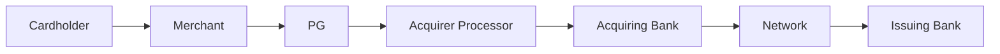

In this model:

```text
Merchant has a direct merchant agreement with the acquirer.
Acquirer assigns MID/TID.
Acquirer or processor funds merchant.
Merchant receives settlement report directly or through processor.
```

### 3.2 Payment Facilitator / PayFac Model


In a PayFac model:

```text
The PF has a direct relationship with sponsored/sub-merchants.
The PF is registered/sponsored by an acquiring bank.
The acquirer remains responsible to the network.
The PF may receive settlement and distribute proceeds to sub-merchants.
The PF manages onboarding, risk, reporting, refunds, disputes, and support.
```

### 3.3 Indian Payment Aggregator Model

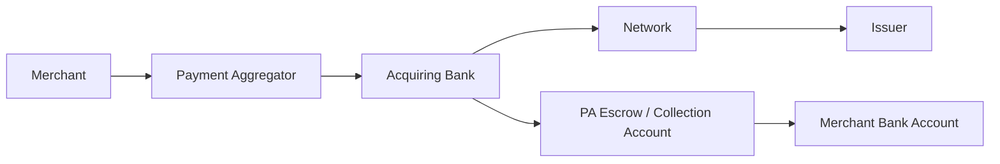

In India, RBI requires non-bank PAs to maintain merchant funds in a separate escrow account with a scheduled commercial bank. Permitted credits and debits include payer collections, merchant settlements, refunds, and other regulated movements.

---

## 4. Online Card Transaction Flow

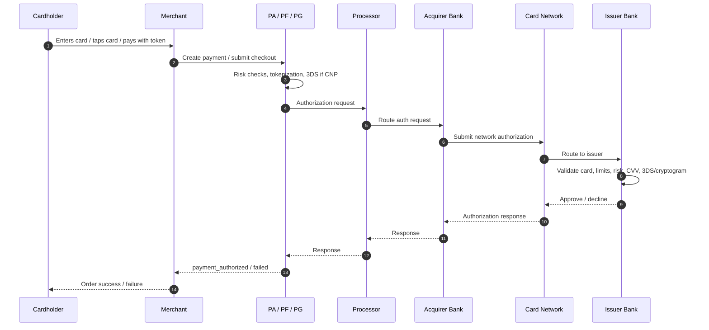

### Key Point

```text
Authorization is not final money settlement.
Authorization is issuer approval and usually a hold/reservation of funds or credit line.
Merchant money settlement happens later through capture, clearing, settlement, and merchant funding.
```

---

## 5. Card-Present vs Card-Not-Present

### 5.1 Card-Present Transaction

Examples:

```text
POS chip card
Tap-to-pay NFC
Magstripe fallback
PIN debit
Contactless card
Mobile wallet tap
```

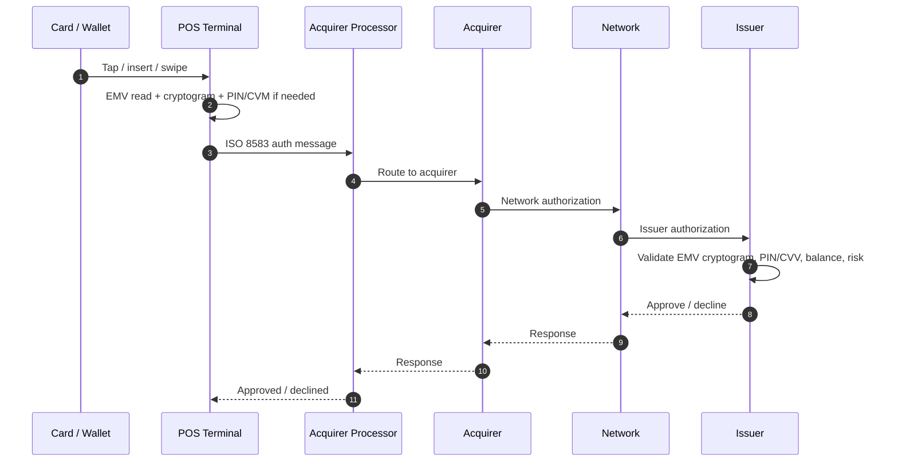

### 5.2 Card-Not-Present Transaction

Examples:

```text
E-commerce checkout
In-app card payment
Saved card payment
Subscription
Mail-order / telephone-order
Payment link
```

CNP usually requires additional controls:

```text
CVV2 / CVC2
AVS, where used
3DS authentication
device fingerprint
risk score
tokenization
merchant-initiated transaction indicators
stored credential indicators
```

---

## 6. Authentication vs Authorization

### 6.1 Authentication

Authentication asks:

```text
Is the customer actually the cardholder?
```

Examples:

```text
3DS OTP
Issuer app push
Biometric approval
Risk-based frictionless authentication
Wallet cryptogram
Device binding
```

### 6.2 Authorization

Authorization asks:

```text
Can this transaction be approved financially and risk-wise?
```

Issuer checks:

```text
card status
available balance / credit limit
CVV/CVV2/CVC
EMV cryptogram or token cryptogram
3DS authentication result
fraud rules
velocity
MCC restrictions
geo/IP/device signals
account status
regulatory controls
```

---

## 7. EMV 3-D Secure / 3DS2 Ecosystem

3DS is a cardholder-authentication protocol for card-not-present transactions.

### 7.1 3DS Components

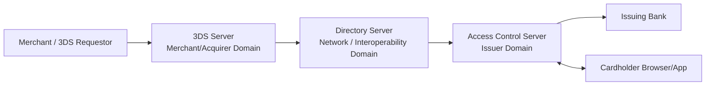

| Component | Role |
|---|---|
| **3DS Requestor** | Merchant or entity requesting cardholder authentication. |
| **3DS Server** | Merchant/acquirer-side protocol server. Creates and handles AReq, ARes, CReq, CRes, RReq, RRes. |
| **Directory Server / DS** | Network/scheme server. Routes authentication messages to correct ACS based on card range/BIN and supported protocol. |
| **Access Control Server / ACS** | Issuer-side system that performs risk assessment and authenticates/challenges cardholder. |
| **Issuer** | Bank that owns the cardholder authentication relationship. |
| **3DS SDK** | Mobile-app component for app-based 3DS flows. |

---

## 8. Why Directory Server Is Required

The Directory Server is needed because the merchant/acquirer does not directly know:

```text
Which issuer ACS owns the card range/BIN.
Which protocol version the card/ACS supports.
Whether the card is enrolled or supported for 3DS.
Which ACS endpoint and certificates to use.
Which scheme rules apply.
Whether attempts processing is supported.
```

The DS does:

```text
Card range / BIN lookup
Routing AReq to correct issuer ACS
Maintaining scheme-level 3DS rules and certificates
Returning ACS availability and version support
Generating/returning DS transaction identifiers
Supporting attempts/fallback behavior
```

---

## 9. 3DS2 Frictionless Flow

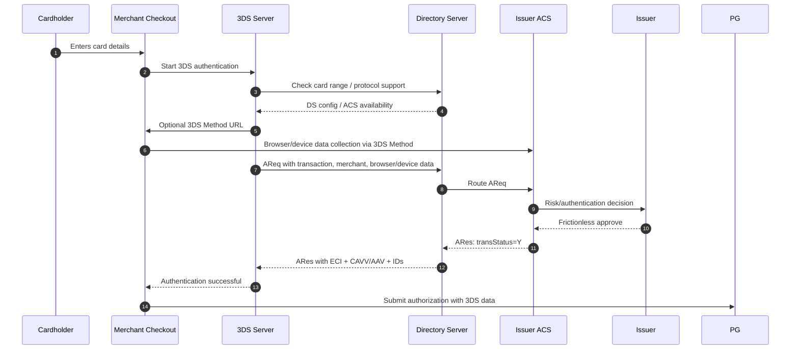

### What happens

```text
The issuer/ACS determines that the transaction is low risk.
No OTP/challenge is shown to customer.
ACS returns authentication success.
Merchant passes ECI + CAVV/AAV + DS transaction data into authorization.
```

---

## 10. 3DS2 Challenge Flow

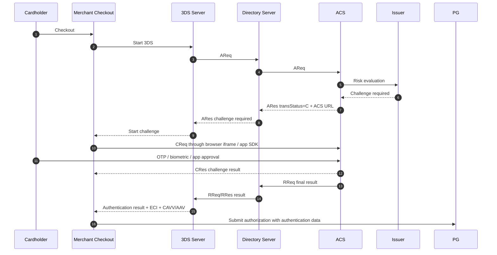

### What happens

```text
Issuer/ACS wants stronger authentication.
Customer sees OTP/app/biometric challenge.
If customer passes, ACS returns authenticated result and authentication values.
Merchant sends those values in authorization.
```

---

## 11. ACS Authentication Internals

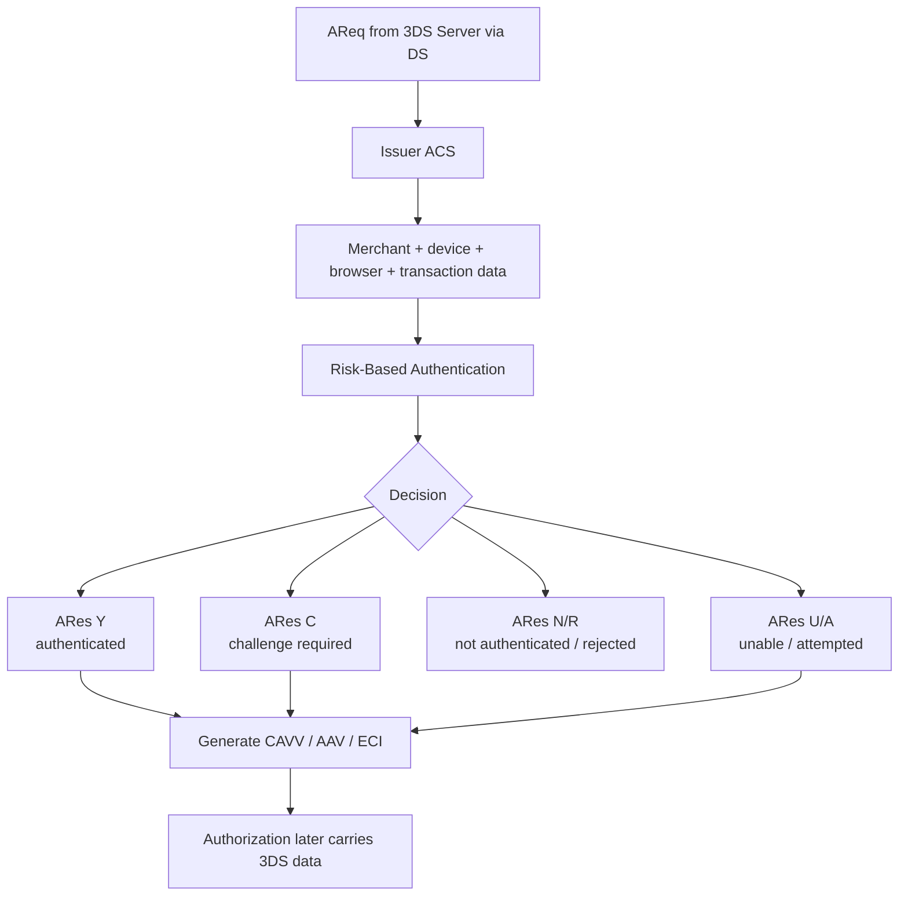

ACS may use:

```text
OTP
issuer mobile app push
biometric authentication
risk-based authentication
device reputation
cardholder account history
shipping/billing address
email/phone history
transaction amount
merchant risk score
IP/device/browser data
```

---

## 12. 3DS Transaction Statuses

Common `transStatus` values:

```text
Y = Authentication successful
N = Authentication failed / not authenticated
U = Authentication could not be performed
A = Attempts processing / attempted authentication
C = Challenge required
R = Authentication rejected
I = Informational / data-only style result depending on scheme/product
```

Treatment can vary by network, region, product, issuer, acquirer, and local regulation.

---

## 13. XID, CAVV, AAV, TAVV, ECI, DS Trans ID

### 13.1 ECI — Electronic Commerce Indicator

ECI tells the network and issuer the security/authentication level of the e-commerce transaction.

Common Visa-style values:

```text
05 = 3DS authenticated
06 = attempted authentication
07 = non-authenticated / non-3DS / failed / data-only depending context
```

Common Mastercard/Maestro-style values:

```text
02 = authenticated
01 = attempted authentication
00 = internet, not authenticated
06 = exemption / network token without 3DS, depending context
07 = authenticated merchant-initiated transaction, depending context
```

Why it matters:

```text
Tells issuer/network whether authentication happened.
Affects interchange, fraud monitoring, liability shift, and authorization treatment.
Must match the 3DS outcome and scheme rules.
```

### 13.2 CAVV — Cardholder Authentication Verification Value

CAVV is mainly Visa Secure terminology.

It is a cryptographic authentication value generated by issuer ACS or attempts server and passed into authorization.

Why it matters:

```text
Proves authentication or attempted authentication happened.
Links 3DS result to later authorization.
Allows issuer/network validation.
Supports liability-shift decision.
Prevents merchant from falsely claiming 3DS authentication.
```

### 13.3 AAV / UCAF — Mastercard Authentication Value

Mastercard Identity Check uses AAV, commonly passed in UCAF.

Why it matters:

```text
AAV binds the cardholder authentication to a specific transaction.
UCAF is the data field used to carry the Mastercard authentication value.
Issuer/network uses it during authorization validation and dispute/liability-shift handling.
```

### 13.4 XID

XID is a 3DS transaction identifier used heavily in 3DS1 and still used by many PSP/acquirer APIs for compatibility and traceability.

It helps link:

```text
authentication request
authentication response
authorization request
dispute evidence
gateway logs
acquirer logs
issuer/network records
```

In EMV 3DS2, the more modern correlation IDs are:

```text
threeDSServerTransID
dsTransID
acsTransID
```

### 13.5 dsTransID — Directory Server Transaction ID

`dsTransID` is a unique transaction identifier generated by the Directory Server.

Why it matters:

```text
Network-level traceability
Authentication-to-authorization correlation
Scheme validation
Dispute evidence
Issuer/acquirer investigation
```

### 13.6 threeDSServerTransID and acsTransID

```text
threeDSServerTransID = generated by 3DS Server.
acsTransID           = generated by ACS.
dsTransID            = generated by Directory Server.
```

Together, they correlate:

```text
AReq / ARes
CReq / CRes
RReq / RRes
authorization
fraud investigation
dispute evidence
logs across merchant, gateway, network, ACS, issuer
```

### 13.7 TAVV — Token Authentication Verification Value

TAVV is used for tokenized card transactions, especially network tokens.

Why it matters:

```text
Proves the network token was legitimately used.
Prevents replay of tokenized transactions.
Allows issuer/network to validate token cryptogram.
Reduces raw PAN exposure.
Improves authorization and fraud outcomes.
```

---

## 14. Authorization With 3DS Data

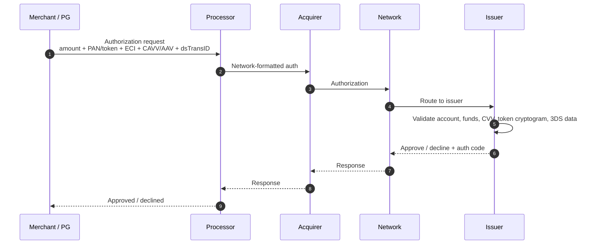

Typical authorization fields:

```text
PAN or network token
expiry
amount
currency
merchant ID
terminal ID
MCC
merchant country
merchant descriptor
POS entry mode / e-commerce indicator
CVV2/CVC2 result
AVS data, where applicable
3DS version
ECI
CAVV / AAV / UCAF
XID, if applicable
dsTransID
threeDSServerTransID
token cryptogram / TAVV, if tokenized
stored credential indicator
recurring / MIT / CIT indicator
authorization type: sale, pre-auth, incremental, completion
```

---

## 15. Authorization vs Capture vs Clearing vs Settlement

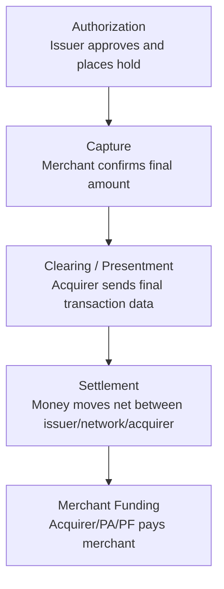

### Authorization

```text
Real-time approval.
Issuer checks card/account/risk.
For credit card: available credit is reduced or held.
For debit card: bank balance may be held or reduced from available balance.
No final merchant money movement yet.
```

### Capture

```text
Merchant confirms that the authorized transaction should be charged.
For e-commerce, capture can be immediate or delayed.
For pre-auth, capture/completion may be lower than or equal to authorized amount, subject to rules.
```

### Clearing / Presentment

```text
Acquirer/processor sends final transaction records to network.
Network validates, edits, assesses fees/interchange, and passes records to issuer.
Issuer posts transaction to cardholder statement/account.
```

### Settlement

```text
Network calculates net obligations.
Issuer owes network/acquirer for settled transactions.
Acquirer receives net settlement.
Acquirer/PA/PF funds merchant after deductions/holds.
```

---

## 16. Money Flow

### 16.1 During Authorization

No final money has moved to the merchant.

```text
Issuer ledger:
Cardholder available credit/balance is reduced or held.

Merchant/acquirer ledger:
Authorized sale is recorded but not yet settled.
```

### 16.2 During Clearing and Settlement

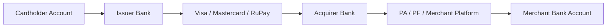

### 16.3 Ledger Concept

```text
Issuer:
Dr Cardholder receivable / customer account
Cr Network settlement payable

Network:
Dr Issuer settlement receivable
Cr Acquirer settlement payable

Acquirer:
Dr Network settlement receivable
Cr Merchant payable / PA payable

PA:
Dr Escrow / collection account
Cr Merchant payable

Merchant funding:
Dr Merchant payable
Cr Merchant bank account
```

---

## 17. Settlement Flow With PA/PF

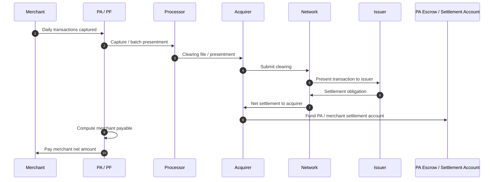

Merchant payout formula:

```text
Gross captured sales
- refunds
- chargebacks / dispute holds
- MDR
- GST / tax on fees
- scheme fees, if passed through
- processor/platform fee
- rolling reserve / risk hold
- loan/advance recovery, if applicable
+ adjustments
= net merchant settlement
```

---

## 18. MPR Generation

MPR can mean:

```text
Merchant Payment Report
Merchant Payout Report
Merchant Settlement Report
```

It is generated after settlement calculation and reconciliation.

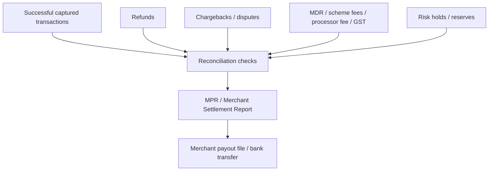

### MPR Should Include

```text
merchant_id / MID
terminal_id / TID
submerchant_id, if PF/PA model
merchant legal name
merchant display name
settlement date
transaction date
capture date
network: Visa / Mastercard / RuPay / Amex
card type: credit / debit / prepaid / corporate
domestic / international
auth code
RRN / retrieval reference number
STAN
ARN / acquirer reference number
transaction amount
refund amount
chargeback amount
gross amount
MDR rate
MDR amount
GST/tax on fees
scheme fee, if passed through
processor fee
rolling reserve
risk hold
net payable
UTR / bank payout reference
payout status
settlement account
batch number
reason codes for exceptions
```

---

## 19. Reconciliation

Reconciliation means matching independent records to prove the transaction and money flow are correct.

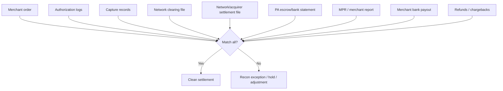

### What Gets Matched

```text
merchant order ID
PG transaction ID
processor transaction ID
network transaction ID
auth code
RRN
STAN
ARN
PAN token / masked PAN
amount
currency
MID
TID
MCC
capture ID
batch number
settlement cycle
refund ID
chargeback ID
payout UTR
```

### Common Reconciliation Breaks

```text
Auth approved but never captured.
Capture submitted but not in clearing.
Clearing present but settlement missing.
Settlement received but MPR missing transaction.
Merchant paid twice due to duplicate payout file.
Refund processed but not deducted from merchant settlement.
Chargeback debited after merchant payout.
Wrong MID/TID/MCC.
Wrong GST/MDR calculation.
Network fee mismatch.
Partial capture mismatch.
Currency conversion mismatch.
```

---

## 20. Refund Flow

There are two cases:

```text
Void / authorization reversal = before capture/settlement.
Refund / credit = after capture/settlement.
```

### 20.1 Authorization Reversal / Void

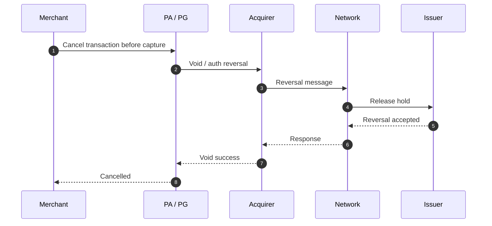

Purpose:

```text
Release cardholder hold.
Prevent capture.
Avoid customer seeing pending amount for too long.
```

### 20.2 Refund After Capture/Settlement

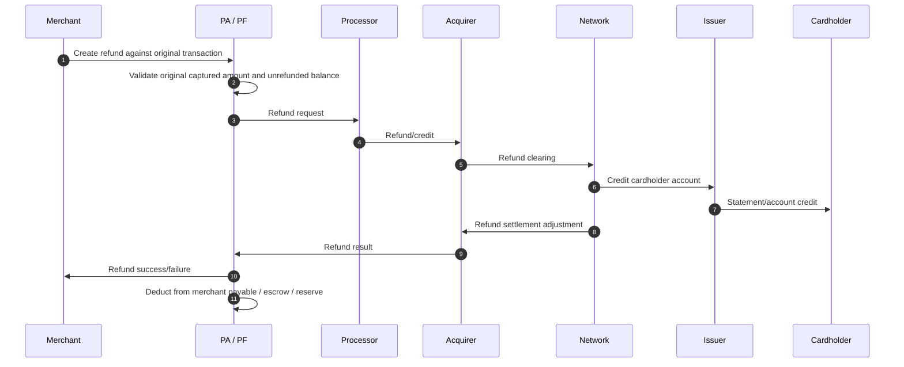

### Refund Validation

```text
original transaction exists
original transaction captured/settled
refund amount <= unrefunded amount
same merchant/MID
refund reference unique
merchant has sufficient settlement balance or reserve
refund window/rules satisfied
no duplicate refund
```

---

## 21. Dispute / Chargeback Flow

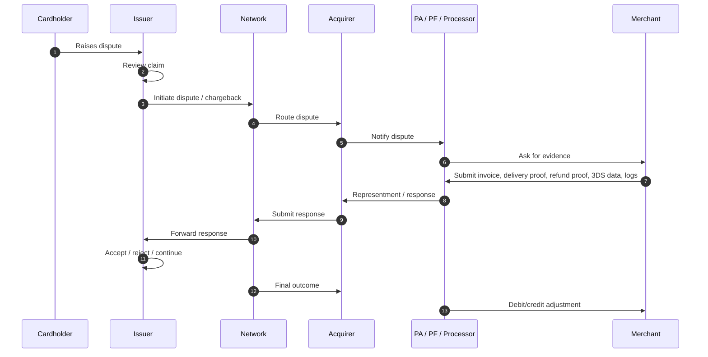

### Dispute Reason Categories

```text
fraud / cardholder did not authorize
goods/services not received
goods/services not as described
duplicate processing
cancelled recurring transaction
credit not processed
incorrect amount
processing error
late presentment
no authorization
```

### Evidence Package

```text
authorization code
3DS CAVV/AAV/ECI
proof of delivery
invoice
customer communication
refund/cancellation policy
AVS/CVV result
IP/device data
shipping address
order history
login/session logs
signed receipt for card-present
merchant descriptor evidence
```

3DS data is important because successful or attempted authentication can affect fraud liability shift, depending on scheme, region, and transaction conditions.

---

## 22. MID and TID Generation

### 22.1 MID — Merchant ID

MID identifies the merchant relationship in the acquirer/processor system.

MID stores:

```text
merchant legal name
merchant display name / descriptor
MCC
acquirer
settlement bank account
business address
risk category
pricing/MDR
enabled schemes
enabled currencies
refund permissions
chargeback contacts
settlement cycle
tax/GST data
PA/PF/submerchant mapping
```

### 22.2 TID — Terminal ID

TID identifies the acceptance point.

For card-present:

```text
physical POS terminal
store location
terminal serial number
key-injection profile
batch number
DUKPT/key management profile
acquirer routing profile
```

For e-commerce:

```text
virtual terminal
gateway terminal profile
checkout channel
merchant website/app terminal
3DS merchant profile
```

### 22.3 MID/TID in PA/PF Model

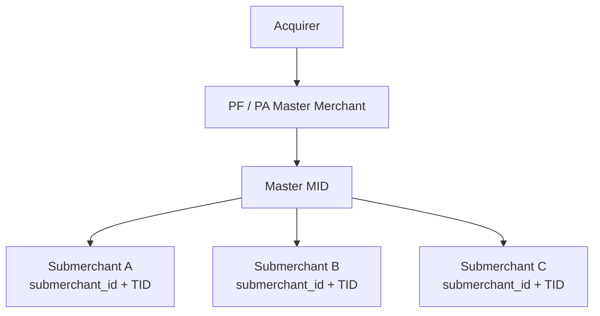

### 22.4 Why MID/TID Matters

```text
routing
risk monitoring
chargeback routing
statement descriptor
settlement
MDR pricing
tax reporting
terminal batch settlement
scheme monitoring
fraud/velocity rules
merchant-level reconciliation
MPR generation
```

---

## 23. BIN Sponsorship Model

BIN sponsorship can mean two different things.

### 23.1 Issuing BIN Sponsorship

```mermaid
flowchart LR
    Fintech[Fintech / Program Manager]
    Sponsor[Issuer Bank / BIN Sponsor]
    Processor[Issuer Processor]
    Network[Visa / Mastercard / RuPay]
    Cardholder[Cardholder]
    Merchant[Merchant]

    Fintech --> Sponsor
    Sponsor --> Network
    Sponsor --> Processor
    Processor --> Cardholder
    Cardholder --> Merchant
    Merchant --> Network
```

In issuing BIN sponsorship:

```text
Bank owns network license / BIN / regulatory issuer role.
Fintech owns customer experience and program proposition.
Issuer processor handles card lifecycle and authorization.
Sponsor bank remains responsible for scheme/regulatory obligations.
Network routes transactions based on BIN/IIN.
```

### 23.2 Acquiring Sponsorship

```mermaid
flowchart LR
    PF[PF / PA / Platform]
    Acquirer[Acquiring Bank Sponsor]
    Network[Visa / Mastercard / RuPay]
    SubMerchants[Sub-merchants]

    SubMerchants --> PF
    PF --> Acquirer
    Acquirer --> Network
```

In acquiring sponsorship:

```text
Acquirer is network member.
PF/PA is registered/sponsored by acquirer.
PF/PA onboards submerchants.
Acquirer submits transactions to network.
Acquirer carries scheme/regulatory risk.
PF/PA handles merchant experience, settlement, risk, reporting.
```

---

## 24. Acquiring Model Options

### 24.1 Direct Acquirer Model

```text
Merchant signs directly with acquiring bank.
Acquirer assigns MID/TID.
Acquirer funds merchant.
Merchant receives acquirer statements.
```

Best for:

```text
large merchants
enterprise retail
regulated/high-volume merchants
businesses needing direct scheme/acquirer control
```

### 24.2 PA / PF Model

```text
PA/PF signs merchants/submerchants.
Acquirer sponsors PA/PF.
PA/PF handles onboarding, risk, settlement, dashboard, support.
Acquirer/network receive required identifiers and transaction data.
```

Best for:

```text
SMB onboarding
marketplaces
SaaS platforms
vertical platforms
fast merchant activation
aggregated merchant settlement
```

### 24.3 ISO / Referral Model

```text
ISO refers or services merchants.
Merchant may still have direct acquiring agreement.
ISO may not receive settlement proceeds like a PayFac.
```

### 24.4 Marketplace / Merchant of Record Model

```text
Marketplace may be treated as merchant for transaction.
Marketplace handles buyer/seller relationship.
Marketplace may carry dispute and refund responsibility.
```

---

## 25. Processor Types

### 25.1 Acquirer Processor

```text
connects acquirer to networks
authorization routing
capture/batch processing
clearing file generation
settlement files
chargeback/dispute processing
merchant reporting
terminal management
MPR generation
risk tools
```

### 25.2 Issuer Processor

```text
card account management
PAN/token lifecycle
card controls
authorization decisioning
fraud engine
ledger posting
clearing ingestion
cardholder statement posting
dispute handling
settlement with network
```

### 25.3 Gateway Processor / PSP Layer

```text
checkout APIs
tokenization
3DS orchestration
fraud screening
routing to multiple acquirers
smart retries
webhooks
merchant dashboard
payment links
refund APIs
reconciliation APIs
```

---

## 26. Card Transaction State Machine

```mermaid
stateDiagram-v2
    [*] --> Created
    Created --> AuthenticationStarted
    AuthenticationStarted --> Authenticated
    AuthenticationStarted --> AuthenticationFailed
    Authenticated --> AuthorizationRequested
    Created --> AuthorizationRequested

    AuthorizationRequested --> Authorized
    AuthorizationRequested --> Declined
    Authorized --> Captured
    Authorized --> Voided
    Authorized --> Expired

    Captured --> ClearingSubmitted
    ClearingSubmitted --> Settled
    Settled --> MerchantFunded

    Settled --> RefundInitiated
    RefundInitiated --> RefundSettled

    Settled --> DisputeRaised
    DisputeRaised --> Representment
    Representment --> DisputeWon
    Representment --> DisputeLost
    DisputeLost --> MerchantDebited

    MerchantFunded --> [*]
    Declined --> [*]
    Voided --> [*]
```

Important states:

```text
created
authentication_started
authentication_success
authentication_failed
authorization_requested
authorized
declined
captured
voided
clearing_submitted
settled
merchant_funded
refund_initiated
refund_settled
dispute_raised
representment
dispute_won
dispute_lost
adjusted
```

---

## 27. End-to-End E-Commerce Card Payment With 3DS2

```mermaid
sequenceDiagram
    autonumber
    participant C as Customer
    participant M as Merchant
    participant PA as PA / PG / PF
    participant ThreeDS as 3DS Server
    participant DS as Directory Server
    participant ACS as Issuer ACS
    participant Proc as Processor
    participant Acq as Acquirer
    participant Net as Card Network
    participant Iss as Issuer

    C->>M: Checkout with card
    M->>PA: Create payment
    PA->>ThreeDS: Initiate 3DS2
    ThreeDS->>DS: PReq/PRes or card range lookup
    ThreeDS->>ACS: 3DS Method / device data where applicable
    ThreeDS->>DS: AReq with transaction + device + merchant data
    DS->>ACS: Route AReq
    ACS->>ACS: Risk-based authentication
    alt Frictionless
        ACS-->>DS: ARes Y + ECI + CAVV/AAV
        DS-->>ThreeDS: ARes
    else Challenge
        ACS-->>DS: ARes C + ACS URL
        DS-->>ThreeDS: ARes C
        ThreeDS-->>M: Challenge required
        C->>ACS: OTP / app approval / biometric
        ACS-->>ThreeDS: RReq/RRes result + ECI + CAVV/AAV
    end

    ThreeDS-->>PA: 3DS result
    PA->>Proc: Authorization with ECI, CAVV/AAV, dsTransID, token cryptogram if any
    Proc->>Acq: Auth request
    Acq->>Net: Network auth
    Net->>Iss: Issuer auth
    Iss->>Iss: Validate funds, fraud, CVV, 3DS, token cryptogram
    Iss-->>Net: Approve / decline
    Net-->>Acq: Response
    Acq-->>Proc: Response
    Proc-->>PA: Approved / declined
    PA-->>M: Payment authorized
    M-->>C: Order confirmed

    M->>PA: Capture now or later
    PA->>Proc: Capture
    Proc->>Acq: Clearing/presentment
    Acq->>Net: Clearing
    Net->>Iss: Presentment
    Net->>Acq: Settlement
    Acq->>PA: Fund PA/merchant
    PA->>M: Merchant settlement + MPR
```

---

## 28. Why Authorization Can Succeed but Settlement Can Differ

Possible reasons:

```text
auth approved but merchant never captured
capture amount differs from auth amount
auth expired before capture
duplicate capture
wrong MID/TID/MCC
network clearing reject
cardholder dispute
refund before settlement
processor file failure
currency conversion mismatch
scheme fee/interchange mismatch
settlement bank delay
risk hold by acquirer/PA
merchant reserve applied
```

A world-class card platform treats authorization as one state and settlement as another. It does not mark money as finally payable until clearing, settlement, and reconciliation rules are satisfied.

---

## 29. World-Class PA/PF/Card Acquiring Platform Checklist

### 29.1 Merchant Onboarding

```text
business KYC/KYB
beneficial ownership
PAN/GST/tax details
business address/contact point verification
MCC assignment
risk category
settlement account validation
merchant descriptor validation
website/app validation
prohibited/restricted business screening
submerchant mapping
pricing/MDR setup
refund/dispute contacts
```

### 29.2 Payment Processing

```text
card vault/tokenization
3DS Server integration
gateway routing
fraud/risk engine
auth/capture/void/refund APIs
smart routing across acquirers
retry and timeout handling
idempotency
webhooks
terminal/POS support
network token support
```

### 29.3 Ledger and Settlement

```text
authorization ledger
capture ledger
refund ledger
chargeback ledger
merchant payable ledger
PA escrow ledger
fee ledger
tax ledger
reserve/hold ledger
payout ledger
```

### 29.4 Reports

```text
transaction report
settlement report
MPR
refund report
chargeback report
fee report
GST/tax report
network exception report
bank statement reconciliation
```

### 29.5 Risk Operations

```text
velocity checks
chargeback ratio monitoring
fraud ratio monitoring
merchant risk score
negative merchant list
MCC controls
cross-border controls
high-risk business restrictions
settlement hold
rolling reserve
merchant suspension
```

---

## 30. Best Official Documents and References

| Topic | Source |
|---|---|
| Visa authorization, clearing, settlement APIs | VisaNet Connect – Acceptance: https://developer.visa.com/capabilities/visanet-connect-acceptance/docs-getting-started |
| Visa issuer-side authorization and settlement | VisaNet Connect – Issuing: https://developer.visa.com/capabilities/visanet-connect-issuing |
| Mastercard authorization, clearing, settlement | Mastercard Switching explained: https://www.mastercard.com/eea/switching-services/our-technology/transaction.html |
| EMV 3DS protocol documents | EMVCo 3-D Secure Documentation: https://www.emvco.com/dynamic/emv-3-d-secure-whitepaper-v2/3-d-secure-documentation/ |
| EMV 3DS product approval | EMVCo 3DS Approval Process: https://www.emvco.com/processes/emv-3-d-secure-approval-processes/ |
| PCI 3DS security | PCI 3DS FAQ / Core Security Standard: https://www.pcisecuritystandards.org/documents/FAQs_for_PCI_3DS_Core_Security_Standard.pdf |
| PCI DSS | PCI SSC PCI DSS: https://www.pcisecuritystandards.org/standards/pci-dss/ |
| Visa Secure / EMV 3DS data quality | Visa Secure Better Data Guide: https://www.visa.co.in/content/dam/VCOM/corporate/solutions/documents/global-better-data-best-practices-guide-for-visa-secure-with-emv.pdf |
| Visa 3DS processing reminders | Visa Secure Processing Requirements: https://usa.visa.com/dam/VCOM/global/support-legal/documents/visa-secure-vbn-visa-public.pdf |
| ECI and authorization fields | CyberSource ECI documentation: https://developer.cybersource.com/docs/cybs/en-us/payments/developer/ctv/so/payments/payments-processing-pa-process-intro/payments-processing-pa-eci.html |
| Mastercard AAV/UCAF | CyberSource Mastercard Identity Check documentation: https://developer.cybersource.com/docs/cybs/en-us/payments/developer/ctv/rest/payments/payments-processing-pa-process-intro/payments-processing-pa-mc-intro.html |
| Token cryptograms / TAVV | Visa token cryptogram rules: https://usa.visa.com/content/dam/VCOM/global/support-legal/documents/avoid-authorization-declines-by-following-the-requirements-for-token.pdf |
| Visa PayFac model | Visa Payment Facilitator Model: https://usa.visa.com/dam/VCOM/global/support-legal/documents/visa-payment-facilitator-model.pdf |
| Mastercard PayFac registration | Mastercard Payment Facilitator page: https://www.mastercard.com/global/en/business/support/payment-facilitators.html |
| PayFac risk and registration | Visa Payment Facilitator and Marketplace Risk Guide: https://usa.visa.com/content/dam/VCOM/regional/na/us/partner-with-us/documents/visa-payment-facilitator-and-marketplace-risk-guide.pdf |
| India PA regulation | RBI Payment Aggregator Directions 2025: https://www.rbi.org.in/Scripts/BS_ViewMasDirections.aspx?id=12896 |
| Visa disputes | Visa Dispute Management Guidelines for Merchants: https://usa.visa.com/content/dam/VCOM/global/support-legal/documents/merchants-dispute-management-guidelines.pdf |
| Merchant descriptors/data | Visa Merchant Data Standards Manual: https://usa.visa.com/content/dam/VCOM/download/merchants/visa-merchant-data-standards-manual.pdf |

---


## 31. Why Network Still Needs Clearing After Authorization and Capture

A common question is:

```text
If the card network already saw the authorization, and the merchant or gateway has captured the transaction,
why does the acquirer or processor still need to send a clearing file to the network?
Why cannot the network itself send the transaction to the issuer for final posting?
```

The reason is that **authorization is only permission or a hold**, while **clearing is the merchant/acquirer's final financial claim**.

```text
Authorization = Issuer says: "This cardholder can pay; I approve the hold."
Capture       = Merchant says: "I want to charge this approved transaction."
Clearing      = Acquirer tells the network/issuer: "Here is the final completed transaction to post."
Settlement    = Network moves net money between issuer and acquirer.
```

Card networks separate these stages because many authorizations never become final charges, and many final charges differ from the original authorization amount.

Mastercard describes authorization, clearing, and settlement as separate switching activities. Authorization transports approval requests and responses, while clearing exchanges financial transaction details between acquirer and issuer to support posting to the cardholder account and settlement-position reconciliation.

Reference: https://www.mastercard.com/eea/switching-services/our-technology/transaction.html

---

### 31.1 Why Authorization Alone Is Not Enough

When the issuer approves an authorization, it usually creates a temporary hold or reduces available credit. It does not automatically mean that the merchant has completed the sale.

Example:

```text
Customer places online order for ₹1,000.
Issuer approves authorization for ₹1,000.
Customer available balance/credit is reduced by ₹1,000.
Merchant has not yet shipped the product.
Merchant has not yet made the final financial claim.
```

So the issuer approval means:

```text
Issuer: "I approve this transaction for now."
```

It does not mean:

```text
Merchant/acquirer: "The sale is complete; please finally post and settle it."
```

That final instruction comes through capture and clearing.

Visa's authorization-reversal guidance explains that a successful authorization reduces the cardholder's available funds through an authorization hold, and not all authorizations are ultimately settled.

Reference: https://cis.visa.com/content/dam/VCOM/download/merchants/authorization-reversals.pdf

---

### 31.2 Why the Network Cannot Auto-Clear Every Authorization

If the network automatically converted every approved authorization into clearing, many wrong charges would happen.

#### Case 1: Customer cancels before shipment

```text
Authorization: ₹1,000 approved
Customer cancels order
Merchant does not capture
Authorization should be reversed or expire
Final charge should not happen
```

If the network auto-cleared the authorization, the cardholder would be charged even though the order was cancelled.

#### Case 2: Final amount is lower than the authorized amount

Hotel, fuel, car rental, and service transactions often authorize an estimated amount first.

```text
Estimated authorization: ₹10,000
Final bill: ₹8,200
Clearing amount: ₹8,200
Unused hold: ₹1,800 released
```

The network cannot know the final amount from the original authorization alone.

Visa's authorization best-practice guidance says estimated authorizations are used where the final amount is not known, and merchants must correct/reverse excess authorization amounts when the final amount is lower.

Reference: https://usa.visa.com/content/dam/VCOM/regional/na/us/support-legal/documents/authorization-and-reversal-processing-best-practices-for-merchants.pdf

#### Case 3: Incremental authorizations

```text
Initial hotel authorization: ₹5,000
Incremental authorization: +₹2,000
Final capture: ₹6,700
```

The final clearing record must represent the completed transaction, not only the first authorization.

#### Case 4: Partial shipment / split capture

```text
Order total: ₹3,000
Authorization: ₹3,000
Item A ships today: capture ₹1,000
Item B ships tomorrow: capture ₹2,000
```

A single authorization may result in multiple captures or presentments, depending on merchant, acquirer, and scheme rules.

#### Case 5: Authorization expires

```text
Authorization approved on Monday
Merchant never captures
Authorization validity expires
No clearing should happen
```

If the network auto-cleared expired or uncaptured authorizations, customers would be charged incorrectly.

---

### 31.3 What Clearing Contains That Authorization May Not Contain

The authorization message is optimized for real-time approval. The clearing record is optimized for final posting, interchange, settlement, fee calculation, reporting, and dispute traceability.

A clearing or presentment record can include:

```text
final transaction amount
final currency
capture date
settlement date
merchant descriptor
MID
TID
MCC
acquirer ID
authorization code
RRN
STAN
ARN
interchange qualification data
tax / tip / surcharge / cashback data, where applicable
partial capture indicators
e-commerce / POS entry data
3DS / ECI / authentication indicators
token data
clearing sequence
batch number
fee assessment data
merchant location
dispute-relevant data
```

The network needs this final record to:

```text
send the issuer the final posting item
calculate interchange
calculate scheme/network fees
create acquirer and issuer settlement positions
generate acquirer and issuer reports
support chargebacks and disputes
support merchant, acquirer, issuer, and network reconciliation
```

Mastercard says its GCMS clearing system accepts transaction information, edits it, assesses appropriate fees, and routes it to the appropriate receiver.

Reference: https://www.mastercard.com/eea/switching-services/our-technology/transaction.html

---

### 31.4 Authorization vs Clearing Flow

```mermaid
sequenceDiagram
    autonumber
    participant M as Merchant
    participant PG as PG / Processor
    participant Acq as Acquirer
    participant Net as Network
    participant Iss as Issuer

    M->>PG: Authorization request ₹1,000
    PG->>Acq: Authorization request
    Acq->>Net: Network authorization
    Net->>Iss: Issuer authorization
    Iss-->>Net: Approved + auth code
    Net-->>Acq: Approved
    Acq-->>PG: Approved
    PG-->>M: Payment authorized

    Note over M,Iss: Issuer has approved/held funds,<br/>but final financial posting has not happened.

    M->>PG: Capture ₹1,000
    PG->>Acq: Capture accepted / batch for presentment
    Acq->>Net: Clearing / presentment record
    Net->>Iss: Final transaction for cardholder posting
    Iss->>Iss: Post transaction to cardholder account
    Net->>Acq: Settlement position
    Acq->>M: Merchant funding after fees, holds, and adjustments
```

The network needs the second leg because that is the acquirer/merchant saying:

```text
This transaction is complete. Present it to the issuer for final posting and settlement.
```

VisaNet Connect documentation shows this separation in API terms: authorization APIs are used for approval, and completion/clearing APIs are used to clear previously approved authorizations. Completed clearing advices are then cleared and settled in the relevant settlement window.

Reference: https://developer.visa.com/capabilities/visanet-connect-issuing

---

### 31.5 But Capture Already Happened. Does the Network Know?

Usually, capture first happens inside the merchant, gateway, processor, or acquirer domain.

```text
Merchant -> PG: capture payment
PG -> processor: capture accepted
Processor/acquirer: include transaction in clearing batch or clearing message
Network: receives the final clearing/presentment item
Issuer: receives final posting item from network
```

So when a gateway dashboard says `captured`, it often means:

```text
The merchant/acquirer domain has marked the transaction for financial presentment.
```

It does not always mean:

```text
The network and issuer have already received and settled the final clearing record.
```

Some modern network APIs can combine parts of this flow, but the logical step still exists: the captured/completed transaction must become a clearing or presentment record before issuer posting and final settlement.

---

### 31.6 Why Acquirer or Processor Must Send Clearing

The acquirer is the merchant-side financial claimant. Through clearing, the acquirer is effectively telling the network and issuer:

```text
My merchant completed this transaction.
Please present this final transaction to the issuer.
Please include it in clearing and settlement.
I accept the acquiring-side responsibility for this transaction.
```

The network cannot make that decision by itself because it does not know:

```text
whether goods were shipped
whether the order was cancelled
whether the final amount changed
whether partial capture is required
whether authorization should be reversed
whether tip/fuel/hotel/service amount changed
whether merchant risk rules blocked capture
whether the merchant is suspended
whether the merchant/acquirer has legal/commercial right to claim the funds
```

The merchant/acquirer owns the final claim.

---

### 31.7 What Would Go Wrong If the Network Auto-Cleared Every Authorization?

```text
Cancelled orders would still charge customers.
Expired holds would become final charges.
Estimated authorizations would post wrong amounts.
Partial shipments would post wrong amounts.
Duplicate authorizations could become duplicate charges.
Fraud-screened orders rejected after authorization would still charge.
Hotels, fuel, and car rentals could overcharge.
Merchants would lose fulfilment-based capture control.
Issuers would post transactions without final merchant presentment.
Disputes and complaints would increase sharply.
```

That is why dual-message card systems separate:

```text
Authorization message: real-time approval
Clearing message: final presentment
Settlement process: money movement
```

---

### 31.8 Exception: Single-Message Card Transactions

Some card/debit networks and transaction types use single-message processing, where authorization and financial presentment are combined or where approved final-amount-known purchases are automatically cleared and settled.

Examples can include certain PIN debit, ATM, and final-amount-known transactions depending on network, region, and product.

So the architecture can be:

```text
Dual-message model:
Authorization now, clearing later.

Single-message model:
Authorization and financial presentment are combined.
```

Most e-commerce credit-card flows are best understood as dual-message:

```text
authorize -> capture -> clear -> settle
```

VisaNet Connect documentation also distinguishes purchase-style APIs, where approved payments can be automatically cleared and settled, from completion/clearing flows for previously approved authorizations.

Reference: https://developer.visa.com/capabilities/visanet-connect-issuing

---

### 31.9 Simple Example

Customer buys a laptop for ₹50,000.

#### Authorization

```text
Issuer approves ₹50,000.
Cardholder available credit is reduced by ₹50,000.
Merchant receives authorization code.
```

Then the merchant checks inventory.

#### Scenario A: Item available

```text
Merchant ships laptop.
Merchant captures ₹50,000.
Acquirer sends clearing record.
Issuer posts ₹50,000 to cardholder statement.
Network settles with acquirer.
Merchant gets funded.
```

#### Scenario B: Item unavailable

```text
Merchant cancels order.
Merchant does not capture.
Merchant sends reversal or authorization expires.
Issuer releases hold.
Customer is not finally charged.
```

If the network automatically converted authorization to clearing, Scenario B would incorrectly charge the customer.

---

### 31.10 One-Line Answer

```text
The network has the authorization, but authorization is only temporary approval.
The network still needs the acquirer/processor clearing record because clearing is the merchant/acquirer's final financial presentment containing the final amount, final merchant details, settlement data, fee/interchange data, and posting instructions.
```

Clean mental model:

```text
Authorization:
Issuer promises, "I will allow this payment."

Capture:
Merchant says, "I completed the sale; charge it."

Clearing:
Acquirer tells network/issuer, "Here is the final transaction to post."

Settlement:
Network moves net money between issuer and acquirer.

Reconciliation:
Everyone checks that authorization, capture, clearing, settlement, refunds, disputes, and merchant payout match.
```

---

## 32. Final Mental Model

```text
UPI is push-payment, bank-account-to-bank-account, real time.

Card payment is authorization-first:
1. Cardholder authenticates, often through 3DS for e-commerce.
2. Issuer authorizes and places a hold / approves credit.
3. Merchant captures the transaction.
4. Acquirer clears transaction through network.
5. Network settles net obligations.
6. Acquirer/PA/PF funds merchant.
7. Reconciliation proves order, auth, capture, clearing, settlement, refund, dispute, and payout all match.
```

The most important architectural difference from UPI:

```text
UPI success usually means customer account debit and payee-side success are part of the same online push payment.

Card success at checkout usually means authorization success.

Merchant money depends on capture, clearing, settlement, acquirer funding, PA/PF settlement rules, refunds, disputes, and risk holds.
```
