# UPI Merchant Payment Flow: PSP, Issuing Switch, Acquiring Switch, TSP, NPCI, Settlement, Refunds, and Reconciliation

## Purpose

This document explains the complete UPI merchant-payment architecture in a market-grade way, covering:

- PSP and TPAP roles
- Issuing switch flow
- Acquiring switch flow
- TSP / Setu-like acquiring switch model
- Merchant onboarding and VPA creation
- UPI QR / Intent transaction processing
- Direct merchant credit vs PA / aggregator settlement
- NPCI routing and settlement
- Merchant callbacks / webhooks
- Reconciliation
- Refunds and disputes

The exact NPCI production specifications are available only to approved UPI participants. This document explains the architecture and flow conceptually using public UPI/RBI/Setu-style information.

---

# 1. Big Picture: UPI Merchant Payment Ecosystem

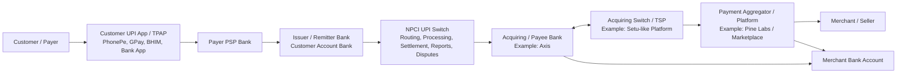

## Main Entities

| Entity | Meaning |
|---|---|
| Customer / payer | Person paying through UPI. |
| UPI app / TPAP | Customer-facing UPI app, such as PhonePe, Google Pay, Paytm, BHIM, or a bank app. |
| PSP Bank | Bank that provides UPI access to the customer app and routes payment requests into UPI. |
| Issuer / Remitter Bank | Bank where the customer's account is held. It validates UPI PIN, account status, balance, risk, and debits the customer. |
| NPCI | Central UPI network operator. It routes, processes, settles, provides reports, dispute/chargeback systems, transaction-status systems, and rule framework. |
| Acquiring / Payee Bank | Bank sponsoring or owning the merchant-side UPI handle/acquiring arrangement, such as an Axis-like acquirer in a `@pineaxis` setup. |
| Acquiring Switch / TSP | Technology platform that manages merchant onboarding, VPA mapping, QR/Intent creation, transaction processing, merchant ledger, webhooks, refunds, disputes, settlement reports, and reconciliation. |
| Payment Aggregator / PA | Commercial entity that aggregates payments and later settles merchants. |
| Merchant / seller | Business accepting the UPI payment. |

---

# 2. Separate the Three Flows

A lot of UPI confusion happens because people mix payment success, notification, and settlement. They are related, but not the same.

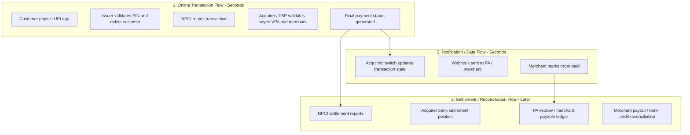

## Key Rule

```text
Payment success = online transaction succeeded.
Settlement = money obligations between banks / PA / merchant are cleared and reconciled.
Notification = payment platform informs merchant or PA about status.
```

---

# 3. Merchant Onboarding and VPA Creation

Before a merchant can collect UPI payments through a Setu-like acquiring switch, the platform must onboard the merchant and create or assign a VPA.

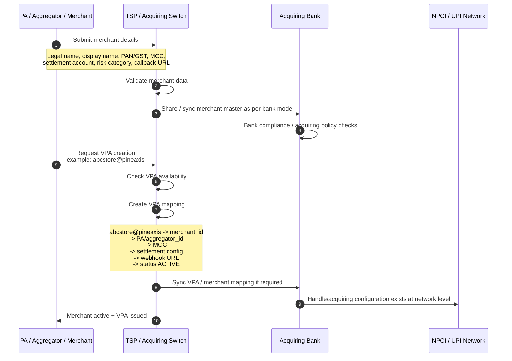

## What “Setu Issues VPA on Behalf of Bank” Means

Example VPA:

```text
abcstore@pineaxis
```

Breakdown:

```text
abcstore = merchant alias / VPA username
pineaxis = UPI handle sponsored/approved through bank-acquirer arrangement
```

```mermaid
flowchart LR
    Handle[@pineaxis handle]
    Bank[Axis-like Acquiring Bank<br/>Regulated sponsor/acquirer]
    TSP[Setu-like TSP<br/>VPA mapper + merchant APIs]
    MerchantVPA[abcstore@pineaxis]
    Merchant[Merchant ABC Store]

    Bank --> Handle
    Handle --> TSP
    TSP --> MerchantVPA
    MerchantVPA --> Merchant
```

The handle is bank/NPCI-sponsored. The TSP can operationally create merchant aliases under that approved handle, but the acquiring bank remains the regulated banking/acquiring participant.

---

# 4. Acquiring Switch Architecture

The acquiring switch is the merchant/payee-side UPI processing platform.

```mermaid
flowchart TB
    subgraph MerchantSide[Merchant / PA Facing Layer]
        API[API Gateway<br/>Auth, rate limit, audit logs]
        Dashboard[Merchant Dashboard]
        Webhook[Webhook Engine]
    end

    subgraph ProductLayer[Payment Product Layer]
        MerchantOnboarding[Merchant Onboarding]
        VPA[VPA Manager]
        QR[Static QR / Dynamic QR]
        Intent[UPI Intent / Deep Link]
        Link[Payment Link]
        Collect[Collect Request]
        TPV[TPV Validation]
    end

    subgraph CoreSwitch[Acquiring Switch Core]
        Mapper[VPA -> Merchant Mapper]
        Txn[Transaction State Machine]
        Idem[Idempotency / Duplicate Check]
        Risk[Risk / Velocity / MCC Controls]
        NPCIAdapter[NPCI / Bank UPI Adapter]
    end

    subgraph MoneyOps[Money Operations]
        Ledger[Merchant / Beneficiary Ledger]
        Refund[Refund Engine]
        Dispute[Dispute / UDIR Engine]
        Settlement[Settlement Engine]
        Recon[Reconciliation Engine]
    end

    subgraph BankLayer[Bank / Network Layer]
        AcqBank[Acquiring Bank]
        NPCI[NPCI UPI]
        Reports[NPCI / Bank Reports]
        Escrow[PA Escrow / Collection / Merchant Account]
    end

    API --> MerchantOnboarding
    API --> QR
    API --> Intent
    API --> Link
    API --> Refund
    API --> Dispute

    MerchantOnboarding --> VPA
    VPA --> Mapper
    QR --> Txn
    Intent --> Txn
    Link --> Txn
    Collect --> Txn
    TPV --> Txn

    Txn --> Idem
    Idem --> Risk
    Risk --> NPCIAdapter
    NPCIAdapter <--> AcqBank
    AcqBank <--> NPCI

    Txn --> Ledger
    Ledger --> Settlement
    Refund --> Ledger
    Dispute --> Ledger
    Reports --> Recon
    AcqBank --> Reports
    NPCI --> Reports
    Recon --> Ledger
    Settlement --> Escrow
    Txn --> Webhook
    Dashboard --> API
```

## What the Acquiring Switch Does

```text
Merchant onboarding
Merchant VPA creation
VPA-to-merchant mapping
Static QR / Dynamic QR generation
UPI Intent / payment link generation
Payee-side UPI transaction validation
Merchant payment ledger
Webhook notification to PA / merchant
Refund lifecycle
Dispute / UDIR lifecycle
Merchant-level reconciliation
Merchant settlement reports
Aggregator / sub-merchant management
Risk controls
Operational dashboards
```

The acquiring bank can build all of this itself. A TSP is useful when the bank wants a ready merchant-grade payment platform instead of building every product layer internally.

---

# 5. Issuing Switch Architecture

The issuing switch is the customer/account-holder side. It protects the customer's money.

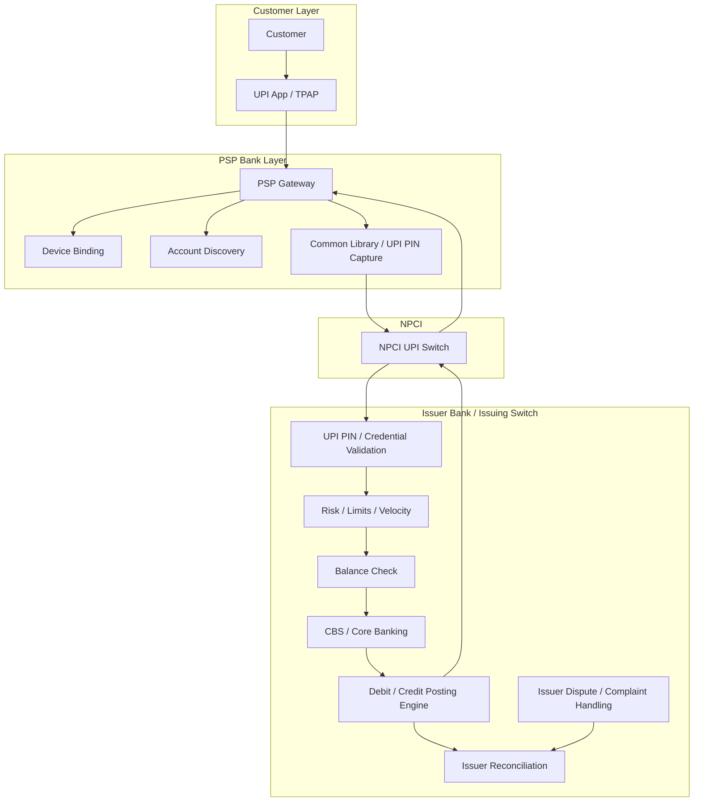

## What the Issuing Switch Does

```text
Customer registration
Mobile/device binding
Bank account discovery
VPA/account linking
UPI PIN set/reset/change
UPI PIN validation
Risk and limit checks
Balance check
Customer account debit
Incoming refund credit
Reversal processing
Issuer-side reconciliation
Customer complaint and dispute handling
```

The issuing side is where the customer's money is actually debited.

---

# 6. PSP, TPAP, Issuer, Acquirer: Difference

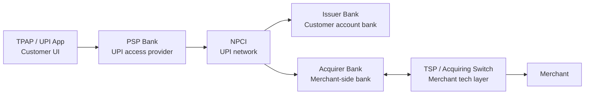

| Role | Simple Meaning |
|---|---|
| TPAP | Customer-facing UPI app. |
| PSP Bank | Bank enabling the TPAP/app to access UPI. |
| Issuer Bank | Bank where payer's account is held. |
| NPCI | Network router, rule-set owner, settlement/report/dispute platform. |
| Acquiring Bank | Merchant-side bank/acquirer. |
| TSP / Acquiring Switch | Technology platform operating merchant-side APIs, VPA mapper, ledger, webhooks, refunds, disputes, reconciliation. |
| PA / Aggregator | Commercial aggregator that may collect and settle merchant funds under applicable RBI PA rules. |

---

# 7. UPI QR / Intent Payment Flow: Successful Transaction

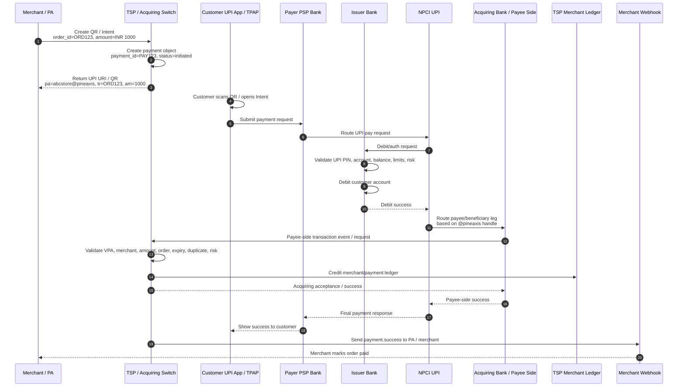

## Important Correction

The customer does not simply get success first and then NPCI later tells the acquiring switch. The acquirer/payee side is part of the online transaction path. The final customer success is based on the overall UPI response, including issuer-side debit and payee/acquiring-side processing.

---

# 8. What Is Inside QR / Intent?

A UPI QR or Intent usually carries payment information like:

```text
pa = payee VPA
pn = payee name
am = amount
cu = currency
tr = transaction/order reference
tn = transaction note
mc = merchant category code
```

Example:

```text
upi://pay?pa=abcstore@pineaxis&pn=ABC%20Store&am=1000.00&cu=INR&tr=ORD123&tn=Order%20Payment
```

The acquiring switch later uses `pa`, `tr`, amount, and transaction identifiers to match the incoming actual UPI payment against the merchant's expected payment object.

---

# 9. Acquiring Switch Validation Logic

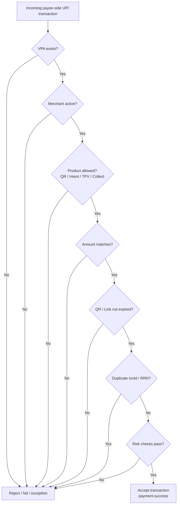

Validation uses:

```text
Payee VPA
Merchant ID
Aggregator / PA ID
Order reference
UPI txn ID
RRN / customer reference
Amount
Currency
Timestamp
Product type
QR/link/intent state
Risk rules
Merchant status
Refund/dispute status
```

---

# 10. Static Shop QR Flow: Why Merchant Sees Instant Money

For a small shop QR, the merchant may receive instant bank credit or instant merchant-ledger credit.

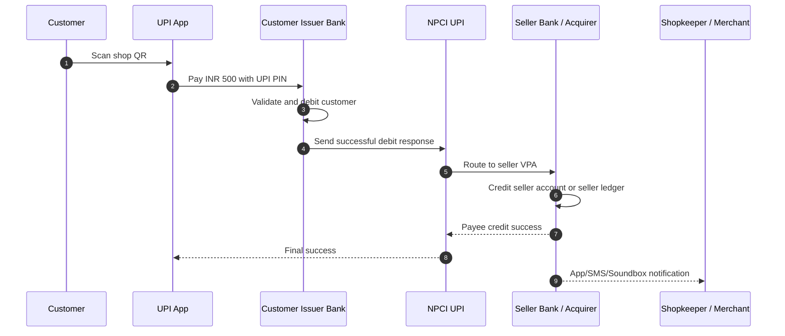

## Direct Merchant Account Model

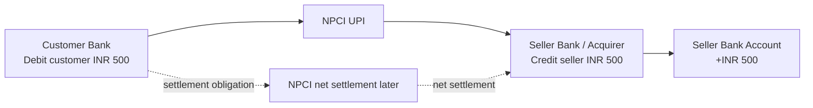

Here the seller's bank credits the seller immediately and records a receivable from UPI/NPCI settlement. Interbank settlement is handled later in net cycles.

## PA / Aggregator QR Model

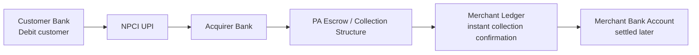

In this model, the merchant may instantly hear “payment received” from the app/soundbox, but the actual bank-account payout can happen later as per the PA-merchant agreement.

---

# 11. Money Flow vs Data Flow

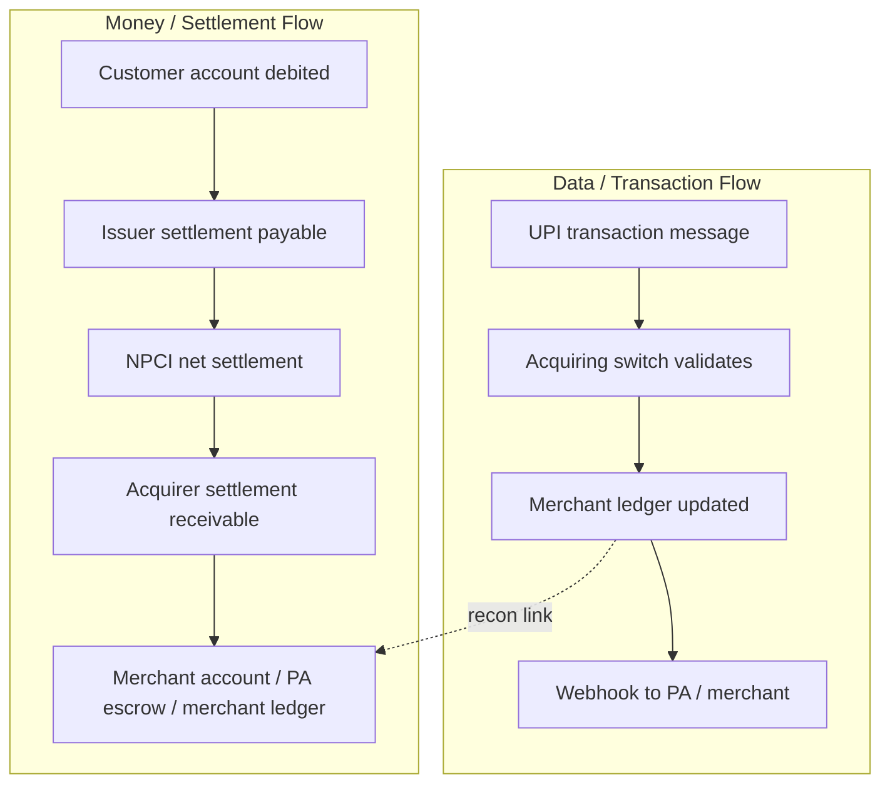

A TSP does not need money to enter its own corporate bank account to send notifications or reconcile transactions. It needs transaction events, UPI/acquirer reports, bank settlement data, and its own ledger.

---

# 12. Settlement Flow

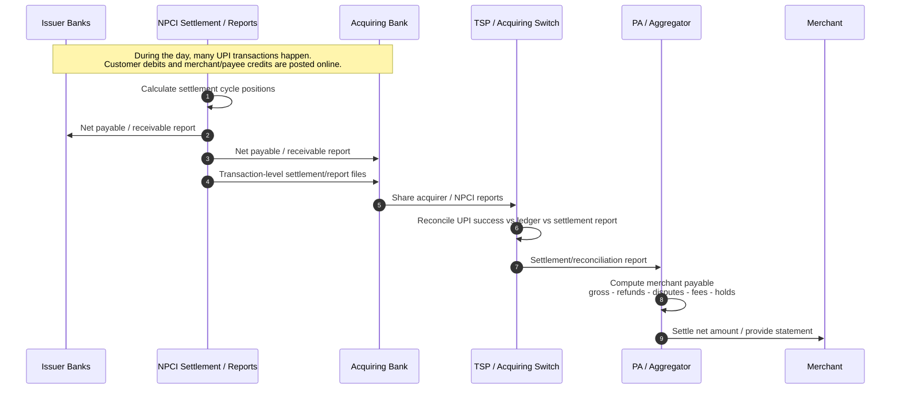

Settlement is not usually a separate instant money packet for every transaction. Transaction posting is real time; interbank settlement is reported and settled through NPCI settlement cycles.

---

# 13. Reconciliation Flow

Reconciliation means matching all independent records to prove the transaction, money, ledger, refund, dispute, and merchant payout are correct.

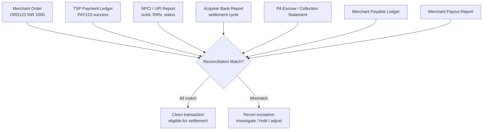

## What Gets Matched

```text
merchant_reference_id / order_id
payment_id
UPI txn ID
RRN / customer reference
refId / tr
payee VPA
payer VPA
amount
timestamp
status
settlement cycle
refund ID
dispute ID
merchant ID
aggregator ID
payout reference
```

## Clean Reconciliation Example

```text
Merchant order:
ORD123, INR 1000, awaiting payment

TSP:
PAY123, ORD123, INR 1000, payment.success

NPCI/acquirer report:
RRN 412345678901, INR 1000, success

PA ledger:
ABC Store gross payable +INR 1000

Merchant settlement:
INR 1000 - fees - GST - refunds - holds = net payout
```

## Reconciliation Exception Example

```text
TSP says:
payment.success

NPCI/acquirer report says:
transaction missing or pending

Action:
create exception, investigate, possibly hold settlement.
```

---

# 14. Refund Flow

A refund is not just a status update. It is a new payment operation linked to the original successful UPI transaction.

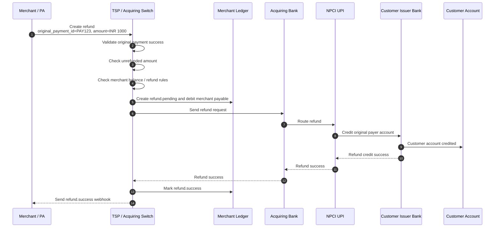

Refund validations:

```text
Original payment exists
Original payment was successful
Refund amount <= unrefunded amount
Refund reference is unique
Merchant is allowed to refund
Merchant balance / settlement reserve is sufficient
Refund is within allowed window
No duplicate refund request
```

---

# 15. Dispute / Complaint / UDIR-Style Flow

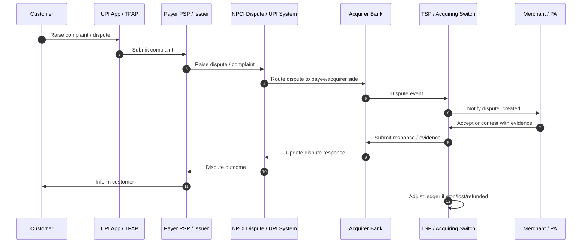

Common dispute reasons:

```text
Customer debited but merchant did not receive confirmation
Duplicate debit
Wrong merchant credited
Goods/services not received
Refund not received
Transaction failed but account debited
Unauthorised or disputed payment
```

---

# 16. Complete End-to-End Architecture

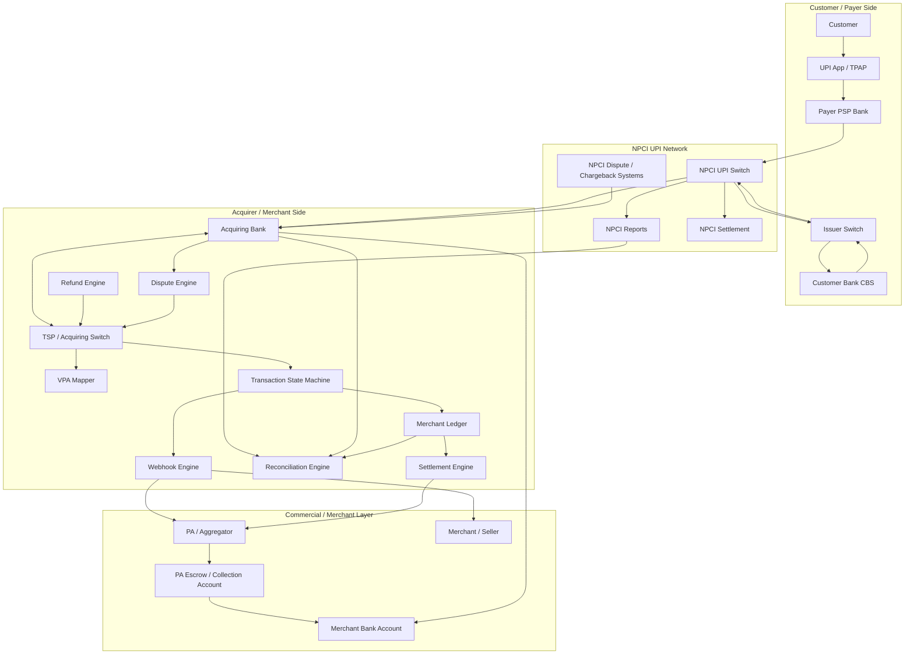

---

# 17. Transaction State Machine

A production-grade UPI acquiring switch needs a strong state machine.

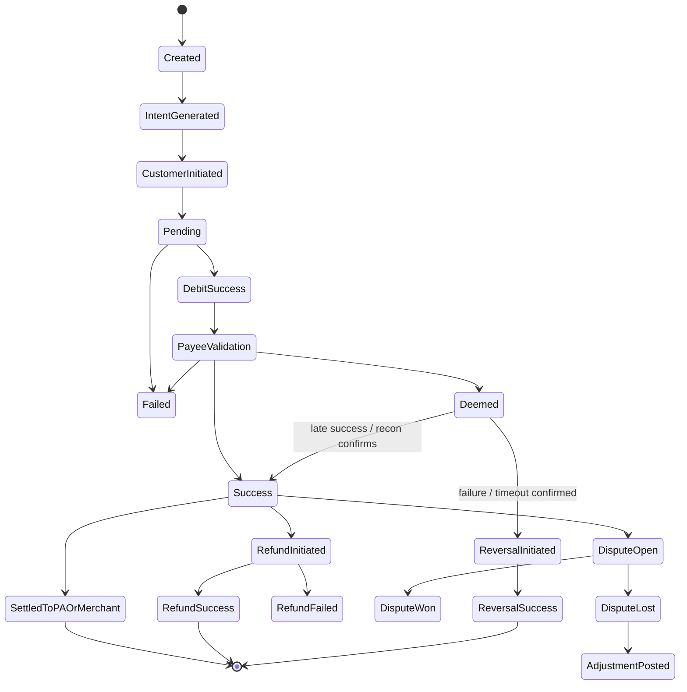

Typical states:

```text
created
intent_generated
payment.initiated
payment.pending
debit_success
payee_validation
payment.success
payment.failed
deemed / pending confirmation
reversal_initiated
reversal_success
refund.pending
refund.success
dispute_open
dispute_won
dispute_lost
settled
```

---

# 18. Pending / Deemed Transaction Handling

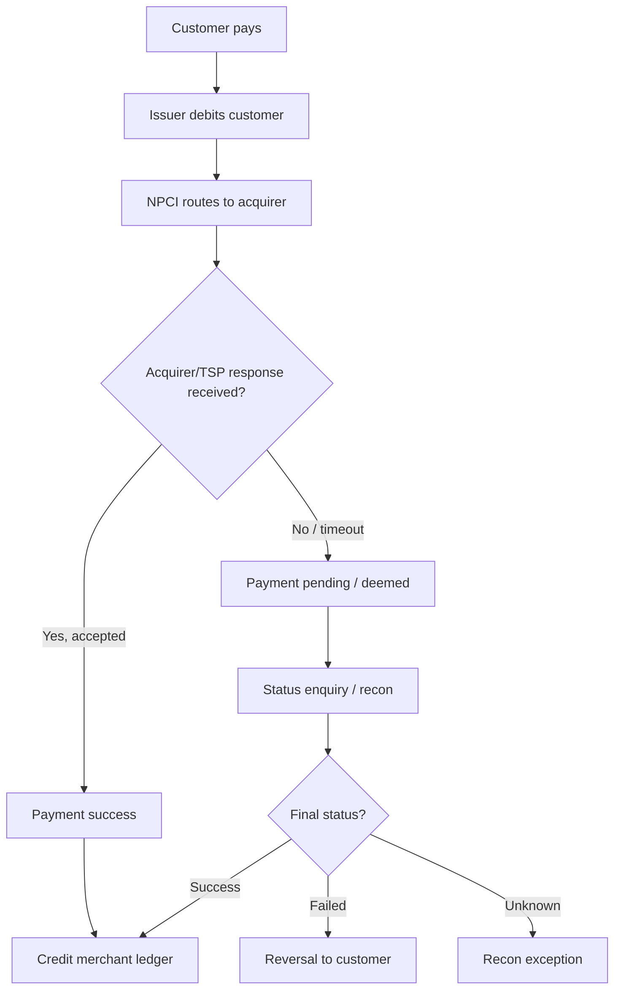

This is why acquiring switches need status enquiry, reconciliation, duplicate detection, and reversal handling.

---

# 19. APIs on Each Side

## Merchant-Facing APIs

```text
POST /merchants
GET  /merchants/{id}
POST /vpas
GET  /vpas/availability
POST /payments/qr/dynamic
POST /payments/qr/static
POST /payments/intent
POST /payment-links
GET  /payments/{id}
POST /refunds
GET  /refunds/{id}
GET  /disputes
POST /disputes/{id}/accept
POST /disputes/{id}/contest
GET  /settlements
GET  /reconciliation-reports
POST /webhook-endpoints
POST /events/{id}/replay
```

## Acquirer / Bank / NPCI-Facing Interfaces

These are not necessarily the same APIs. They can be real-time APIs, switch messages, files, queues, dashboards, or report feeds.

```text
merchant master sync
VPA registration / mapper sync
UPI transaction message processing
status enquiry
refund processing
dispute / chargeback processing
settlement report exchange
NPCI report ingestion
bank GL / settlement statement ingestion
escrow account statement ingestion
risk and audit reporting
```

The acquirer side needs integration, but not necessarily the same merchant-friendly APIs.

---

# 20. How Acquirer Knows Whether Transaction Is Right or Wrong

The acquirer/TSP does not wait for settlement and then guess. It receives transaction data during online processing and later validates it again through reports.

```mermaid
flowchart TD
    Txn[Incoming UPI transaction]
    IDs[Extract identifiers<br/>txnId, RRN, refId, tr, VPA, amount]
    Map[Lookup VPA mapper]
    Order[Lookup order/payment object]
    Rules[Apply product + risk rules]
    Ledger[Post merchant ledger once]
    Report[Later match with NPCI/acquirer report]
    Final[Clean / exception]

    Txn --> IDs --> Map --> Order --> Rules --> Ledger --> Report --> Final
```

Identifiers used:

```text
UPI transaction ID
NPCI transaction ID
RRN / customer reference
refId / tr
merchant reference ID
payee VPA
payer VPA
amount
timestamp
status
settlement cycle
```

---

# 21. Direct Merchant Settlement vs PA Settlement

```mermaid
flowchart TB
    subgraph Direct[Direct Merchant Account Model]
        D1[Customer pays]
        D2[Issuer debits customer]
        D3[NPCI routes to acquirer]
        D4[Acquirer credits merchant account]
        D5[Merchant sees bank credit]
    end

    subgraph PAFlow[PA / Aggregator Model]
        P1[Customer pays]
        P2[Issuer debits customer]
        P3[NPCI routes to acquirer]
        P4[Funds credited to PA escrow / collection structure]
        P5[PA merchant ledger updated]
        P6[Merchant receives payout later]
    end

    D1 --> D2 --> D3 --> D4 --> D5
    P1 --> P2 --> P3 --> P4 --> P5 --> P6
```

In the direct model, the seller's bank account can show credit almost instantly. In the PA model, the merchant may receive instant payment confirmation while final merchant bank payout follows the PA/acquirer settlement agreement.

---

# 22. Why a TSP Is Used If Acquiring Bank Can Settle Funds

A TSP is not mandatory. The bank can build everything itself. But a TSP is used because the acquiring bank's settlement function is not the same as a full merchant acquiring platform.

```mermaid
flowchart LR
    Bank[Acquiring Bank Strengths<br/>NPCI membership, settlement, compliance, bank accounts]
    TSP[TSP Strengths<br/>merchant APIs, VPA mapper, QR/Intent,<br/>webhooks, ledger, refund, dispute, recon]
    Merchant[Merchant / PA Needs<br/>simple APIs, instant status,<br/>reports, payouts, refunds, support]

    Bank --> TSP --> Merchant
```

## Bank-Level Reconciliation

```text
Did NPCI settlement match our bank GL?
Did net payable/receivable match?
Did successful UPI transactions match bank reports?
Did refunds and chargebacks adjust correctly?
```

## Merchant-Level Reconciliation

```text
Which merchant got which payment?
Which order was paid?
Was webhook delivered?
Was QR reused?
Was amount exact?
Was refund already processed?
Was dispute deducted?
Which sub-merchant should get payout?
```

A TSP specialises in the second layer.

---

# 23. Full Example: abcstore@pineaxis

Assume:

```text
Merchant: ABC Store
PA: Pine Labs-like PA
TSP: Setu-like acquiring switch
Acquirer bank: Axis-like bank
Merchant VPA: abcstore@pineaxis
Customer bank: HDFC-like issuer
Amount: INR 1000
Order: ORD123
```

```mermaid
sequenceDiagram
    autonumber
    participant Merchant as ABC Store
    participant PA as Pine Labs-like PA
    participant Setu as Setu-like TSP
    participant Axis as Axis-like Acquirer
    participant NPCI as NPCI UPI
    participant HDFC as Customer Issuer Bank
    participant App as Customer UPI App
    participant Cust as Customer

    PA->>Setu: Onboard ABC Store
    Setu->>Setu: Create merchant_id=MER123
    Setu->>Setu: Create VPA abcstore@pineaxis
    Setu->>Axis: Sync merchant/VPA as per acquiring model

    Merchant->>PA: Create order ORD123 INR 1000
    PA->>Setu: Create dynamic QR / intent
    Setu-->>PA: UPI URI with pa=abcstore@pineaxis, tr=ORD123, am=1000
    PA-->>Merchant: Show QR / Intent

    Cust->>App: Scan QR and approve payment
    App->>HDFC: Pay INR 1000
    HDFC->>HDFC: Validate PIN, balance, limits
    HDFC->>HDFC: Debit customer INR 1000
    HDFC->>NPCI: Debit success

    NPCI->>Axis: Route payee leg to @pineaxis
    Axis->>Setu: Transaction for abcstore@pineaxis
    Setu->>Setu: Validate VPA, order, amount, duplicate, risk
    Setu->>Setu: Mark PAY123 payment.success
    Setu-->>Axis: Payee-side acceptance
    Axis-->>NPCI: Success
    NPCI-->>App: Final success
    App-->>Cust: Show payment successful

    Setu-->>PA: payment.success webhook
    PA-->>Merchant: Order paid notification

    NPCI-->>Axis: Later settlement/reporting cycle
    Axis-->>Setu: Settlement / transaction reports
    Setu-->>PA: Reconciliation report
    PA-->>Merchant: Net settlement / payout report
```

---

# 24. Practical Database / Ledger Model

A production acquiring switch should not rely on only one `transactions` table. It should maintain transaction state and accounting-grade ledger records.

## Merchant Table

```text
merchant_id
aggregator_id
legal_name
display_name
mcc
status
settlement_account
risk_profile
created_at
updated_at
```

## VPA Mapper

```text
vpa
merchant_id
aggregator_id
handle
status
product_enabled
mcc
settlement_config_id
created_at
updated_at
```

## Payment Table

```text
payment_id
merchant_reference_id
merchant_id
aggregator_id
payee_vpa
amount
currency
product_type
status
upi_txn_id
rrn
payer_vpa
created_at
paid_at
updated_at
```

## Ledger Entry Table

```text
entry_id
ledger_id
payment_id
refund_id
dispute_id
direction: debit / credit
account: merchant_payable / fee_income / refund_payable / settlement_account
amount
currency
created_at
```

## Refund Table

```text
refund_id
original_payment_id
merchant_id
amount
status
refund_reference_id
upi_refund_txn_id
rrn
created_at
updated_at
```

## Dispute Table

```text
dispute_id
payment_id
merchant_id
reason_code
status
evidence_status
adjustment_amount
created_at
updated_at
```

## Settlement Table

```text
settlement_id
merchant_id
cycle_id
gross_amount
refund_amount
dispute_amount
fee_amount
tax_amount
hold_amount
net_amount
payout_reference
status
created_at
settled_at
```

---

# 25. Final Mental Model

```text
Customer UPI app initiates payment.
Issuer bank debits customer.
NPCI routes the transaction.
Acquiring bank / TSP validates merchant side.
TSP sends merchant/PA notification.
NPCI settles bank positions later.
PA/acquirer settles merchant depending on the model.
Reconciliation proves every transaction and rupee matched correctly.
```

Or shorter:

```text
Issuer switch protects payer money.
NPCI routes and settles the network.
Acquiring switch protects merchant-side correctness.
TSP productizes acquiring for merchants and PAs.
PA handles commercial aggregation and merchant settlement.
Merchant receives payment confirmation and final payout.
```

---

# 26. Reference Links

- NPCI UPI product page: https://www.npci.org.in/product/upi
- NPCI UPI roles and responsibilities: https://www.npci.org.in/product/upi/roles-responsibilities
- RBI Payment Aggregator directions: https://www.rbi.org.in/Scripts/BS_ViewMasDirections.aspx?id=12896
- Setu UPI Setu overview: https://docs.setu.co/payments/umap/overview
- Setu merchant onboarding: https://docs.setu.co/payments/umap/merchant-onboarding
- Setu notifications: https://docs.setu.co/payments/umap/notifications

